# 神经结构搜索第 1 部分:概述

> 原文：<https://blog.paperspace.com/overview-of-neural-architecture-search/>

对于经典的机器学习算法，超参数优化问题已经以许多不同的方式得到解决。一些例子包括使用网格搜索、随机搜索、贝叶斯优化、元学习等等。但是当考虑深度学习架构时，这个问题变得更加难以处理。在本文中，我们将涵盖神经架构搜索的问题和当前的艺术状态。本文假设不同的神经网络和深度学习架构的基本知识。

这是一个系列的第 1 部分，将带您了解什么是神经架构搜索(NAS)问题，以及如何使用 Keras 实现各种有趣的 NAS 方法。在这一部分中，我们将涉及控制器(RNNs)、加强梯度、遗传算法、控制搜索空间和设计搜索策略等主题。这将包括该领域的最新论文的文献综述。

# 介绍

深度学习工程师应该对什么架构可能最适合什么情况有直观的理解，但这种情况很少发生。一个人可以创造的可能架构是无穷无尽的。想想我们用于迁移学习的所有在 ImageNet 上训练的卷积骨干。以 ResNet 为例，它具有 50、100 和 150 层的变体。有许多方法可以调整这些架构——添加额外的跳过连接，删除卷积块等。

神经结构搜索的目的是在给定数据集的情况下，自动执行寻找最佳模型结构的过程。

使这一领域成为热门研究领域的第一篇论文来自 Zoph 等人。(2016).这个想法是使用一个控制器(一个递归神经网络)生成一个架构，训练它，记录它的准确性，根据计算的梯度训练控制器，最后确定哪个架构表现最好。换句话说，它将评估所有(或者至少许多)可能的架构，并找到一个给出最佳验证准确性的架构。

这种对整个搜索空间的探索只对那些拥有大量计算资源的人有意义。令人欣慰的是，随着时间的推移，已经开发出了几种更快、更有效的执行神经结构搜索任务的方法。

# 神经结构搜索的基础

为了理解应用于这项任务的主要方法，我们需要一些深度学习、优化和计算机科学的跨领域知识。人们解决这个问题的方法从强化学习到进化算法。

神经架构搜索的早期解决方案可以被视为一个多步循环，大致如下:


换句话说:

1.  使用控制器生成架构
2.  为几个时期训练生成的架构
3.  评估生成的架构
4.  了解所述架构的表现如何
5.  相应地更新您的控制器
6.  重复一遍。

这种广泛的概述让我们对我们试图解决的问题有了一个概念，但留下了几个未回答的问题，例如:

1.  设计控制器的最好方法是什么？
2.  我们如何优化更好的架构生成？
3.  我们如何有效地缩小搜索空间？

要回答这些问题，我们应该先讨论一些基础理论。

## 控制器:循环网络

阅读本文的大多数人可能已经知道什么是 rnn，但是为了完整起见，我们仍然会触及一些基本概念。递归神经网络接受顺序输入，并根据训练数据预测序列中的下一个元素。普通的递归网络将基于所提供的输入，处理它们先前的隐藏状态，并输出下一个隐藏状态和顺序预测。将该预测与地面真实值进行比较，以使用反向传播来更新权重。

我们也知道 rnn 容易受到消失和爆炸梯度的影响。为了解决这个问题，LSTMs 应运而生。LSTMs 使用不同的门来管理序列中每个先前元素的重要性。还有 LSTMs 的双向变体，其从左到右以及从右到左学习不同元素的顺序依赖性。

在神经结构搜索的背景下，这种或那种形式的递归网络将会派上用场，因为它们可以作为控制器来创建顺序输出。这些顺序输出将被解码，以创建神经网络架构，我们将反复训练和测试这些架构，以实现更好的架构建模。

## 加固坡度

强化学习流程看起来像这样。给定环境、当前状态和一组可能的操作:

1.  我们的代理根据策略采取行动
2.  环境被操纵，新的状态被创建
3.  基于奖励函数，我们的代理更新它的策略
4.  使用新的状态和更新的策略重复上述步骤

“策略梯度”指的是更新此策略的不同方式。加强是一种策略梯度算法，最初用于 NAS 上，以优化控制器的体系结构搜索过程。强化策略梯度试图通过最大化每个搜索步骤的对数似然性与每个步骤的报酬的乘积，以最大化代理的总报酬的方式优化目标函数。奖励可以是由控制器创建的每个架构的验证准确性的某个函数。

对于神经结构搜索，我们将发现我们的控制器可以通过使用增强梯度来优化以创建更好的结构。这里，动作是您的架构中可能的层或连接，策略是每个控制器步骤中这些层的 softmax 分布。

## 遗传算法

同样的优化过程可以使用遗传算法来完成，这是一类旨在复制种群在自然界中如何进化以优化函数的算法。整个工作流程看起来像这样:给定一组初始的解决方案...

1.  **评估每个解决方案的适用性。**这是专门为你的优化问题设计的。根据你的目标，你必须找到一个合适的适应度函数。
2.  选择最适合的种群来创造后代。我们可以使用多种选择方案来挑选父母——从排序的适应值中挑选最适合的；轮盘赌选择，考虑机会；锦标赛选择，允许锦标赛的获胜者被挑选出来进行进一步发展，等等。
3.  **创造后代和变异。在数字进化中，后代不需要只有双亲。每种表型中的基因或每种溶液中的不同变量可以以几种方式混合和匹配来产生后代。未来的一代也是由以各种方式变异的某一部分人口创造的。**
4.  **使用新一代解决方案重复该过程。**

执行这些步骤有几种方法。遗传算法变得越来越复杂，包括寿命、多目标优化、精英主义、多样性、好奇心、存档前代等。

关于进化算法，另一个重要的概念是[帕累托最优](https://web.stanford.edu/group/sisl/k12/optimization/MO-unit5-pdfs/5.8Pareto.pdf)。帕累托阵线是资源配置的一种状态，这种状态使得不可能以有利于一方而不损害另一方的方式偏离这种状态。当试图平衡多目标权衡时，这个概念很方便，就像在神经架构搜索中，为了可伸缩性的目的，在寻找最优解决方案时必须平衡准确性和效率。

# 神经结构搜索

在 2017 年由 [Zoph et al.](https://arxiv.org/abs/1707.07012) 发表的论文中，遵循的方法是生成层超参数(例如，卷积层将需要步幅、内核大小、内核数量、是否具有跳过连接等。)依次。这些超参数就是我们所说的搜索空间。生成的架构在 CIFAR-10 数据集上训练了一定数量的时期。所使用的奖励函数是在最后 5 个立方历元中发现的最大验证准确度，并且使用加强策略梯度来更新控制器。

至少在最初的几个时代，这看起来像是创建架构的盲目尝试。

## 控制搜索空间

NAS 算法设计一个特定的搜索空间，并在搜索空间中搜寻更好的体系结构。上面提到的论文中卷积网络设计的搜索空间可以在下图中看到。

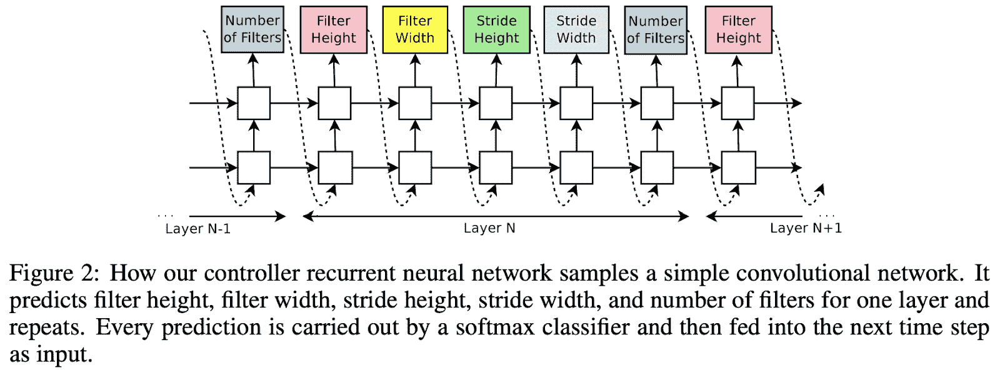

如果层数超过最大值，算法将停止。在他们后来的实验中，他们还在搜索空间中添加了跳过连接、批量标准化和重新激活。类似地，他们通过使用如下所示的搜索空间创建不同的递归单元架构来创建 RNN 架构。

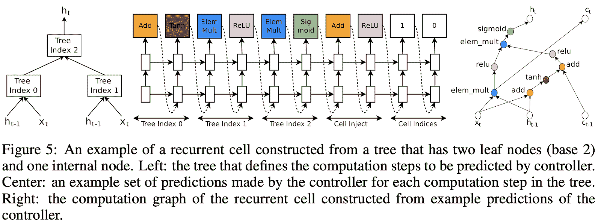

上面提到的方法的最大缺点是，在得出明确的解决方案之前，在搜索空间中导航要花费时间。他们用了 28 天 800 个 GPU 在整个搜索空间中导航，然后提出了最好的架构。显然需要一种方法来设计能够更智能地导航搜索空间的控制器。

为此， [Zoph 等人(2017)](https://arxiv.org/pdf/1707.07012.pdf) 试图通过将其分解为两个步骤来解决这个问题:

1.  为卷积块设计单元
2.  堆叠一定数量的块来创建架构

他们使用扩展的搜索空间，包括各种内核大小的卷积、池化和深度可分离卷积，首先创建:

1.  **正常细胞。**返回与输入相同大小的特征图的卷积单元
2.  **一个还原细胞。**返回初始输入的一半宽度和高度的特征图的卷积单元

还开发了约束搜索空间的新方法，如由 [Ghiasi 等人(2019)](http://openaccess.thecvf.com/content_CVPR_2019/papers/Ghiasi_NAS-FPN_Learning_Scalable_Feature_Pyramid_Architecture_for_Object_Detection_CVPR_2019_paper.pdf) 采用 MobileNet 框架并调整更好的特征金字塔网络，然后将 FPN 架构堆叠一定次数以生成最终架构。[陈等(2019)](http://papers.nips.cc/paper/8890-detnas-backbone-search-for-object-detection.pdf) 对不同目标检测算法的主干架构也是如此。正如 [Elsken et al. (2019)](https://arxiv.org/pdf/1808.05377.pdf) 所指出的，这些方法也带来了设计宏观架构的问题，即考虑需要堆叠多少个电池块以及它们如何相互连接。

## 设计搜索策略

进入神经架构搜索的大多数工作都是针对这部分问题的创新:找出哪些优化方法效果最好，以及如何改变或调整它们，以使搜索过程更快地产生更好的结果，并保持一致的稳定性。已经尝试了几种方法，包括贝叶斯优化、强化学习、神经进化、网络变形和博弈论。我们将逐一研究所有这些方法。

### 1.贝叶斯优化

贝叶斯优化方法在神经结构搜索的早期工作中取得了很大成功。贝叶斯优化通过优化代理模型的获取函数来指导下一个评估点的选择。步骤(如本条中[所述)如下:](https://towardsdatascience.com/the-intuitions-behind-bayesian-optimization-with-gaussian-processes-7e00fcc898a0)

```py
Initialization
      - Place a Gaussian process prior on f
      - Observe f at n_0 points according to an initial space-filling
        experimental design
      - Set n to n_0

While n ≤ N do
      - Update the posterior probability distribution of f using all
	available data
      - Identify the maximiser x_n of the acquisition function over the valid
        input domain choices for parameters, where the acquisition function is
        calculated using the current posterior distribution
      - Observe y_n = f(x_n)
      - Increment n
End while

Return either the point evaluated with the largest f(x) or the point
with the largest posterior mean.
```

[Kandasamy 等人(2018)](https://arxiv.org/abs/1802.07191) 创建了 NASBOT，这是一种基于高斯过程的方法，用于多层感知器和卷积网络的神经架构搜索。他们通过最优传输程序计算距离度量来导航搜索空间。[周等(2019)](https://arxiv.org/abs/1905.04919) 提出 BayesNAS，将经典贝叶斯学习应用于一次架构搜索(在最后一节有更多关于一次架构搜索的内容)。

### 2.强化学习

强化学习已经成功地用于推动更好架构的搜索过程。如前所述，NAS 的初始方法主要是使用增强梯度作为搜索策略(例如 [Zoph 等人(2016)](https://arxiv.org/abs/1611.01578) 和 [Pham 等人(2018)](https://arxiv.org/abs/1802.03268) )。其他方法，如最近策略优化和 Q 学习，分别由 [Zoph et al. (2018)](https://arxiv.org/pdf/1707.07012.pdf) 和 [Baker et al. (2016)](https://arxiv.org/abs/1611.02167) 应用于相同的问题。你可以在这里了解更多关于 PPO 算法[的知识，在这里](https://arxiv.org/abs/1707.06347)了解更多关于 Q 学习[的知识。](https://www.analyticsvidhya.com/blog/2019/04/introduction-deep-q-learning-python/)

有效导航搜索空间以节省宝贵的计算和存储资源的能力通常是 NAS 算法中的主要瓶颈。通常，以高验证准确性为唯一目标的模型最终会变得非常复杂——这意味着更多的参数、更多的内存需求和更长的推理时间。增强学习对解决这些问题的一个重要贡献是由 [Hsu 等人(2018)](https://arxiv.org/abs/1806.10332) 做出的，他们提出了 MONAS:使用增强学习的多目标神经架构搜索。MONAS 试图通过构建一个新的优化目标来优化可伸缩性；它不仅具有良好的验证精度，而且功耗极低。

混合奖励函数被定义为:

```py
R = α∗Accuracy − (1−α)∗Energy
```

另一个减少推理延迟的有趣努力是由[郭等人(2018)](https://arxiv.org/abs/1812.05285) 进行的，他们试图以模仿人类设计架构的方式创建一种搜索方法:通过训练一个代理来学习人类设计的搜索网络结构的拓扑结构。

代理智能地在搜索空间中导航，使用[反向强化学习](https://towardsdatascience.com/inverse-reinforcement-learning-6453b7cdc90d) (IRL)构建由人类设计的拓扑引导的架构。IRL 是一种依赖于马尔可夫决策过程(MDPs)的范式，其中学徒代理的目标是从专家的演示中找到可以解释专家行为的奖励函数。强化学习试图通过优化其策略来最大化回报，而在反向强化学习中，我们得到了一个专家策略，我们试图通过找到最佳回报函数来解释它。

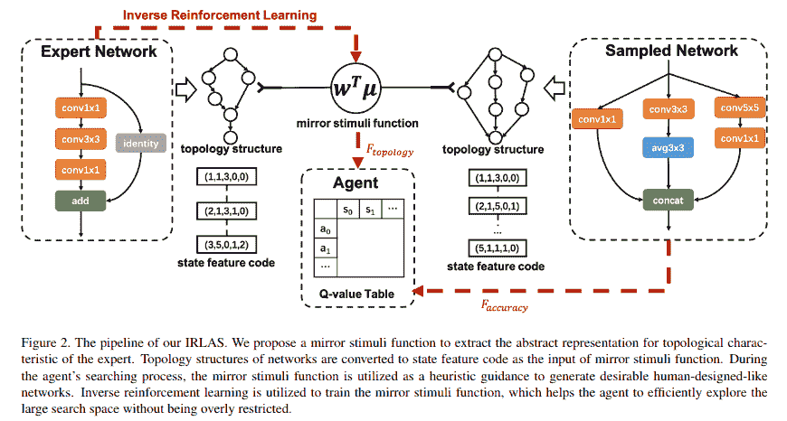

他们提出了一个受生物认知理论启发的镜像刺激函数来提取专家人类设计网络(ResNet)的抽象拓扑知识。他们在工作中回答了两个主要问题:

1.  如何以代理能够理解的方式对拓扑进行编码？
2.  如何使用这些信息来指导我们的搜索过程？

我们来看看他们是如何回答这两个问题的。

#### 如何以代理能够理解的方式对拓扑进行编码？

作者使用网络前两层的超参数(内核大小、操作类型和索引)来编码他们所谓的“状态特征码”。它们使用特征计数将这些特征代码编码到嵌入中，如下式所述。

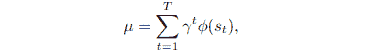

其中 *φ* 是状态特征函数， *s* 是环境的状态， *t* 代表迭代(因为在给定时间的每个状态是由我们的代理创建的架构)，从 1 到 *T* 变化(可以是上界或根据一些收敛标准计算，在本文中不清楚)； *γ* 表示考虑时间相关性的折扣标量。

#### 如何使用这些信息来指导我们的搜索过程？

在这里，他们面临着经典的探索-利用权衡，其中算法需要创建拓扑结构，类似于专家网络，同时还有效地探索搜索空间。政策模仿会导致我们的网络提高强先验并抑制搜索过程。为了避免这一点，他们设计了一个镜像刺激函数:

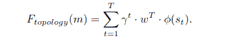

优化的问题变得类似于寻找一个时间步长的奖励函数 *r(st) =wT φ(st)。*这是通过由[吴恩达和皮特阿比尔](https://ai.stanford.edu/~ang/papers/icml04-apprentice.pdf)提出的匹配函数来完成的。最终的奖励函数计算如下:

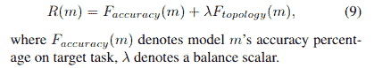

他们应用 Q 学习，使用上面显示的奖励的标准化版本来指导他们的搜索。IRLAS 能够在 ImageNet 和移动环境中实现最先进的结果。

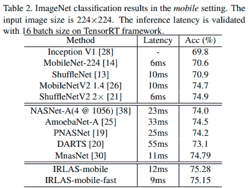

### 3.神经进化

[Floreano 等人](https://link.springer.com/article/10.1007/s12065-007-0002-4) (2008)声称，对于神经网络权重的优化，基于梯度的方法优于进化方法，并且进化方法应仅用于优化架构本身。除了决定正确的遗传进化参数，如突变率、死亡率等。，也有必要评估神经网络的拓扑结构在我们用于数字进化的基因型中的确切表现。

这种表示可以是:

1.  **Direct，**我们要优化的网络的每个属性都将直接与一个基因相关联
2.  **间接，**基因型和表型之间的联系不是一对一的映射，而是一组描述如何创造个体的规则

[Stanley et al. (2002)](http://nn.cs.utexas.edu/downloads/papers/stanley.ec02.pdf) 提出了 NEAT，它使用直接编码策略来表示神经网络中的不同节点和连接。它们的基因型表示包括节点基因和连接基因，每个基因都直接描述了你的网络中不同的节点是如何连接的，它们是否活跃等等。NEAT 中的变异包括修改一个连接或添加一个新的连接。本文还讨论了竞争惯例问题——由于盲目交叉而产生更差网络的可能性。

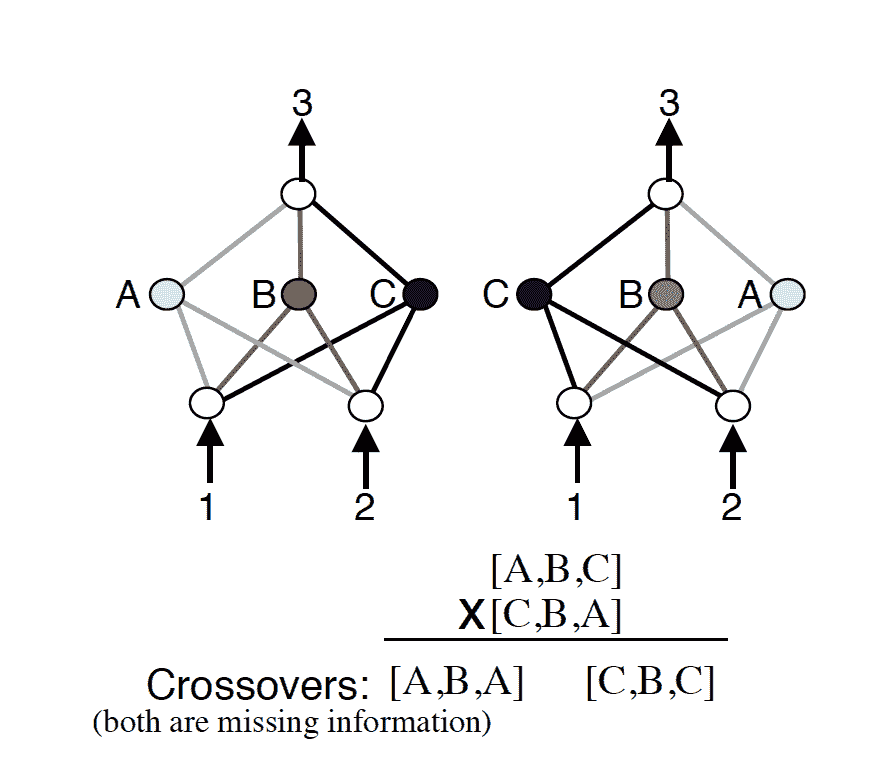

[NEAT](https://towardsdatascience.com/neat-an-awesome-approach-to-neuroevolution-3eca5cc7930f) 通过使用历史标记来解决这个问题(如上所示)。通过用历史数字标记新的进化，当需要交叉两个个体时，这可以以低得多的机会创建无功能的个体来完成。采取的另一项措施是使用[物种形成](https://pdfs.semanticscholar.org/08e2/776737c890709eaa94664d05c2992b55c5b7.pdf)，或者根据拓扑结构将不同的生成架构分组。每个新的架构只需要和它自己的“物种”竞争。

另一方面，组合模式产生网络(CPPNs)提供了一个强大的间接编码，可以用 NEAT 进化以获得更好的结果。你可以在这里了解更多关于 CPPNs 的信息，在这里大卫·哈[的一篇文章中可以找到它的实现和可视化。NEAT 的另一个变种叫做](http://blog.otoro.net/2015/07/31/neurogram/) [HyperNEAT](http://axon.cs.byu.edu/~dan/778/papers/NeuroEvolution/stanley3**.pdf) ，也使用 CPPNs 进行编码，并随着 NEAT 算法发展。 [Irwin-Harris et al. (2019)](https://ieeexplore.ieee.org/document/8790093) 提出了一种间接编码方法，使用有向无环图对不同的神经网络架构进行编码，用于进化。

[Stanley 等人](https://www.nature.com/articles/s42256-018-0006-z.pdf) (2019)强调了遗传算法中考虑多样性的能力，这增加了发现新架构的机会，也允许大规模并行探索。考虑多样性对于多重局部最优的问题也很重要，并且可以避免[遗传漂移](https://en.wikipedia.org/wiki/Genetic_drift)。为了帮助多样性，早期的许多工作试图扩大遗传空间，其思想是，如果进化过程被引导远离局部最优解，这将有助于探索和鼓励创新。它们包括[小生境](https://dzone.com/articles/algorithm-week-niching-genetic)方法，如[拥挤](https://kilthub.cmu.edu/articles/The_Crowding_Approach_to_Niching_in_Genetic_Algorithms/6711068)，其中一个新个体替换与其基因最相似的个体，以及[适应度共享](https://stackoverflow.com/questions/37836751/what-are-fitness-sharing-and-niche-count-in-evolutionary-computation/38174559)，其中个体根据基因距离聚集，并根据其集群中成员的数量进行惩罚。

尽管有时有效，但这些方法也会失败，因为这些解决方案通常不是最优的，并且适应性低。为了解决这个问题， [Stanton et al. (2018)](https://arxiv.org/abs/1806.00553) 将好奇心纳入强化学习算法中，以进行更好的探索。 [Gravina 等人(2016)](http://antoniosliapis.com/papers/surprise_search_beyond_objectives_and_novelty.pdf) 引入惊喜世代元素，鼓励多元化。在进化算法中结合多样性的其他方法可以在[这篇论文](https://arxiv.org/ftp/arxiv/papers/1510/1510.07163.pdf)中找到。

正如 [Elsken 等人(2018)](https://arxiv.org/abs/1808.05377) 所指出的，使用进化算法优于其他优化方法的一个优势是它们在性能函数设计中提供的灵活性。适应度函数的范围可以从非常简单到非常复杂，与错误率或对数似然函数相比，它给了我们很大的实验空间。 [Elsken et al. (2019)](https://openreview.net/forum?id=ByME42AqK7) 通过提出柠檬水解决可扩展性、高精度、低资源消耗。这是一种用于多目标架构搜索的进化算法，允许在该方法的单次运行中，在多个目标下逼近架构的整个 Pareto 前沿，例如预测性能和参数数量。

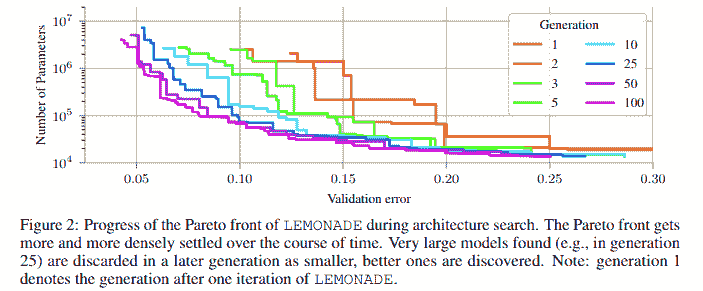

为了减少运行神经进化方法本身的计算资源，他们为柠檬水添加了一个[拉马克继承](https://en.wikipedia.org/wiki/Lamarckism)机制，该机制使用网络变形操作从其父网络中产生子网络。

### 4.网络变形

[金等(2019)](https://arxiv.org/pdf/1806.10282.pdf) 构建了 AutoKeras，这是一个开源的 NAS 引擎，功能有点像 AutoML。他们的框架利用贝叶斯优化来指导网络形态。为了引导变形操作通过搜索空间，构建了基于编辑距离的核(因为架构表示避开了欧几里德表示)。编辑距离是指将一个网络转换成另一个网络需要多少次变形操作，核函数定义如下:

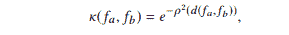

其中 *d* 表示建筑之间的编辑距离 *f[a] 和 f[b] ，*和 *p* 是将编辑距离映射到新空间的映射函数。这个新空间基于使用[布尔增益定理](http://www.cs.toronto.edu/~avner/teaching/S6-2414/LN2.pdf)将原始度量嵌入到一个新的空间中。对于这个 NP 难题，编辑距离近似如下。

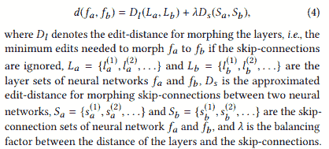

他们通过为树形结构空间设计新的获取函数，将贝叶斯优化应用于网络变形。它们不仅改变了树结构的叶子，还改变了内部节点，允许它们变成更小的架构，避免迭代地构建更大更复杂的架构。提出了 A*搜索和[模拟退火](https://www.geeksforgeeks.org/simulated-annealing/)来平衡勘探和开采。他们在分类任务上取得了令人印象深刻的结果。

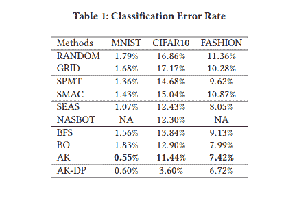

[Kwasigroch 等人(2019)](https://ieeexplore.ieee.org/abstract/document/8864624) 针对检测恶性黑色素瘤的问题，提出了一种使用进化算法和[爬山](https://www.geeksforgeeks.org/introduction-hill-climbing-artificial-intelligence/)算法进行神经架构搜索的网络变形方法。爬山策略通过反复扰动初始解来创建新的解，直到找到最佳解。应用于 NAS 的爬山策略和进化算法启发的变形操作如下图所示。

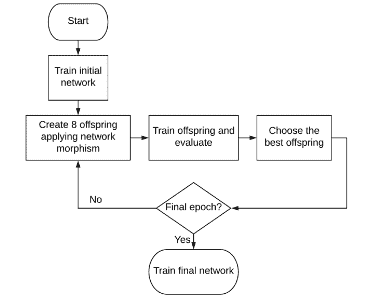

Hill climbing algorithm for NAS

初始网络的结构是四个块[Conv、巴奇诺姆、雷卢、最大池]，后面是最后一个块[Conv、巴奇诺姆、雷卢、西格蒙德]。卷积层包含 128 个跨度为 1 的 3×3 内核的过滤器，而最大池层包含跨度为 2 的 2×2 窗口。网络用热重启随机梯度下降法训练，学习率下降。

### 5.博弈论

[刘等(2019)](https://arxiv.org/pdf/1806.09055.pdf) 提出 DARTS，一种利用博弈论概念优化神经架构的可区分架构搜索方法。他们将架构搜索问题描述为双层优化，其中一个优化问题嵌入到另一个优化问题中。 [Nayman 等人(2019)](https://papers.nips.cc/paper/8472-xnas-neural-architecture-search-with-expert-advice.pdf) 提出了一种基于最小化遗憾的决策科学概念的架构搜索方法。他们重新制定了 DARTS 方法，通过利用[豌豆理论](https://www.mit.edu/~9.520/spring08/Classes/online_learning_2008.pdf)(专家建议的预测)直接优化架构权重，并提出了 XNAS。PEA 框架使用预测者/决策者来尝试顺序地做出决策，在我们的例子中，使用专家的建议来构建神经架构。

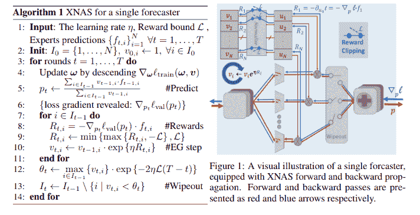

这些专家网络在每个时间步做出预测，指导预测者的决策。他们使用指数梯度规则进行优化。然后，优化器删除弱专家，并有效地将权重重新分配给剩余的专家。

#### 模型压缩

虽然不完全在体系结构搜索的领域中，但是设计神经体系结构的一个重要考虑是模型压缩。随着时间的推移，已经采用了几种方法:量化、修剪、知识提炼等。值得一提的是[施蒂尔等人(2019)](https://arxiv.org/pdf/1904.08166.pdf) 的工作，他们提出了一种基于沙普利值的博弈论方法来创建高效的网络拓扑。Shapley 值是一个博弈论问题的主要解决方案:如何在拥有不同技能的玩家联盟中最好地分配集体收益？对于玩家的子集，Shapley 值可以被认为是玩家在集体收益中的预期边际贡献。它的计算如下所示。

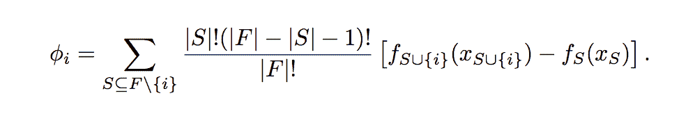

Notation: |F| is the size of the full coalition. S represents any subset of the coalition that doesn’t include player i, and |S| is the size of that subset. The bit at the end is just “how much bigger is the payoff when we add player i to this particular subset S”. [[source](https://towardsdatascience.com/one-feature-attribution-method-to-supposedly-rule-them-all-shapley-values-f3e04534983d)]

Shapley 值和边际收益如何工作的解释可以在这里找到。

参与者可以被视为网络的结构组件。例如，在这个联盟游戏中，单一隐藏层网络中的每一个神经元都会扮演一个玩家的角色。对于收益函数，存在几种不同的可能选择，如训练损失、验证准确性等。在这项工作中，交叉熵准确性被用作支付函数，因为它的有界性质。他们从评估精度中减去基线(回归精度)来获得收益。Shapley 值通过随机采样来近似，并用于最终修剪模型，以根据哪些玩家具有最低的 Shapley 值来减少玩家的数量。

## 绩效评估策略

[Elsken 等人(2019)](https://arxiv.org/pdf/1808.05377.pdf) 提到需要加快 NAS 方法的性能评估。测量生成的架构的性能的一个简单方法是测量验证的准确性。但是对于大的搜索空间、大的数据集和几层深度网络，这变成了一个耗时且计算量大的任务。为了避免这种情况，他们提出了几个策略，如使用通过训练获得的较少时期的低保真度估计值，或像 [Real 等人(2019)](https://scinapse.io/papers/2904817185) 所做的那样，对一小部分数据进行训练。如果我们能够确定架构的相对等级不会因为低保真度评估而改变，那么这种方法是可行的。但是最近的研究表明事实并非如此。

另一种策略是基于学习曲线的外推。从最初几个时期的学习曲线来看，预测性能较差的架构可以终止，以加快搜索过程。[刘等(2018)](https://arxiv.org/abs/1712.00559) 另一方面，不使用学习曲线，而是建议训练一个代理模型，根据从其他新颖架构推断的属性来预测架构的性能。

由 [Pham et al. (2018)](https://arxiv.org/abs/1802.03268) 推广的 One-shot architecture search 是 NAS 方法，试图训练一个包含搜索空间中所有其他架构的超级架构。这是通过在由搜索空间导航策略创建的所有网络之间共享参数来实现的。一次性方法允许快速评估，因为超图的权重可以被继承，以通过训练它们来评估各种不同的架构。虽然一次性 NAS 减少了神经架构搜索所需的计算资源，但尚不清楚超图的权重继承如何影响子图的性能以及它引入架构的偏差种类。

# 摘要

在这篇文章中，我们回顾了神经结构搜索的问题，将它分为三个活跃的研究领域。我们看了如何设计搜索空间，如何设计搜索策略(使用贝叶斯优化、强化学习、进化算法、网络形态或博弈论)，最后我们看了加速架构性能评估的不同方法(即低保真度评估、学习曲线外推和一次性学习)。

我们跳过了许多关于使用剪枝、量化和知识提取来压缩神经网络的文献，因为这更属于如何在给定父架构的情况下构建高效架构的讨论。另一篇长文可以很容易地专门讨论这个话题。我仍然觉得有必要简单提一下这个话题，因为这些技术目前正受到越来越多的关注，它们为机器学习的民主化铺平了道路。

我希望这篇文章对你有用。

在本系列的下一部分，我们将开始研究如何为多层感知器实现 NAS，以便了解这里讨论的核心概念是如何工作的。