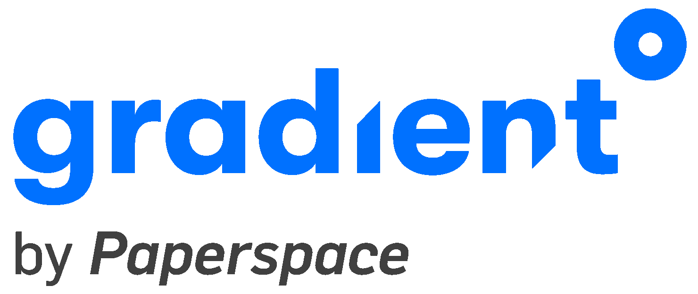

# 欢迎回来申请 ATG 奖学金！

> 原文：<https://blog.paperspace.com/paperspace-advanced-technology-group-fellowships/>

在全球疫情期间中断了一年之后，我们非常激动地宣布，我们将重新召集纸张空间[高级技术集团](https://gradient.paperspace.com/atg)！

[https://www.youtube.com/embed/4cuz9cgQ1sc?feature=oembed](https://www.youtube.com/embed/4cuz9cgQ1sc?feature=oembed)

Paperspace CEO Dillon Erb shares the critical role ATG Fellows play at Paperspace

ATG 研究员承担与机器学习和深度学习相关的重要研究项目，并在更大的 Paperspace R&D 组织中发挥重要作用。

ATG 奖学金为期 10-15 周，是带薪的全职职位。该计划旨在吸引希望在 Paperspace engineering org 的支持和合作下从事机器学习和深度学习研究的研究生和研究生。

我们依靠 ATG 研究员获得广泛的专业知识。我们与 ATG 研究员一起设计有意义的研究项目，以探索尖端的机器学习技术和库，并推动机器学习的可能性。

今年，我们希望支持三个研究方向:

*   **深度技术** -这一研究方向旨在推动当前机器学习算法、应用或基础知识的极限。过去的研究员承担了 GPU 内核开发、对抗性自动编码器、自动 ml 参数空间探索策略和深度学习领域的其他高级主题。
*   **工具/界面** -该研究方向旨在推动 ML 界面(GUI、CLI 等)的发展。诸如实验跟踪、可视化技术、新的分布式训练体系结构以及复杂数据和交互建模的新方法等主题都属于该研究领域的范围。过去的研究员一直致力于通过新的抽象和接口使预训练的深度学习模型更容易被更广泛的受众访问。各种推理架构和设备约束的模型优化也是一个感兴趣的领域。
*   **教育/可及性** -这一研究方向旨在通过教育和宣传来扩大现有 ML 和深度学习技术的可及性。随着越来越多的高级课题来自学术界，专家和新手之间的鸿沟越来越大。此外，向新受众和用户开放深度学习的最佳方式是什么，而不仅仅是领域专家？公平、偏见、解释和公开的问题是这次谈话的中心。

[Advanced Technologies GroupPaperspace ATG is the internal R&D arm of Paperspace and is tasked with exploring advanced topics in machine learning, data engineering, and UI/UX for developing intelligent applications.](https://gradient.paperspace.com/atg)

Paperspace 上次支持 ATG 奖学金是在 2018 年和 2019 年。ATG 研究员来自广泛的学术背景。我们接待了来自领先的人工智能和人工智能机构的研究人员，包括 NYU 大学、佐治亚理工学院和哈佛大学。前两批人继续攻读博士学位，成为领先公司的研究科学家，并建立了风险投资支持的机器学习公司，如 T2 跑道 T3。

[https://www.youtube.com/embed/XRVjZHpe4iQ?feature=oembed](https://www.youtube.com/embed/XRVjZHpe4iQ?feature=oembed)

Past ATG Fellows discuss their time at Paperspace

Paperspace ATG 项目的一个显著特点是，在 Paperspace 世界级工程组织的全力支持下，可以自由探索研究课题。

对于一家软件公司来说，我们拥有异常广阔的表面积，因此我们在从低延迟流到分布式系统架构、加速计算和生产级机器学习系统编排的所有领域都拥有主题专业知识。

作为一名 ATG 研究员，你的工作很有可能会提供给近 50 万用户。您将能够影响 Paperspace 产品的未来，同时还能进行有意义的合作研究。

我们邀请您今天就申请！

[Advanced Technologies GroupPaperspace ATG is the internal R&D arm of Paperspace and is tasked with exploring advanced topics in machine learning, data engineering, and UI/UX for developing intelligent applications.](https://gradient.paperspace.com/atg)