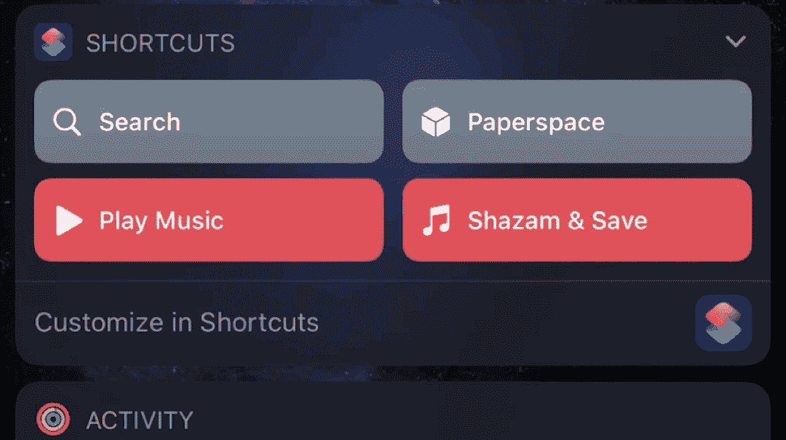
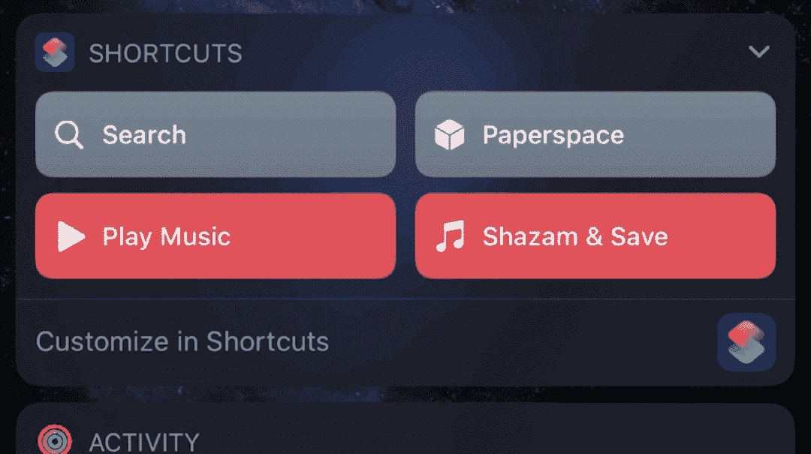
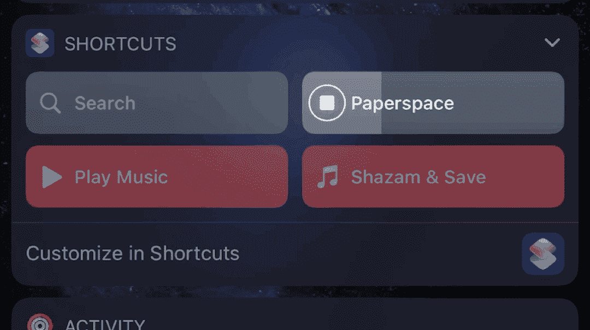

# 在 iOS 中管理您的 Paperspace 核心计算机

> 原文：<https://blog.paperspace.com/paperspace-ios-shortcuts/>

‌If:您和我一样，越来越依赖移动设备，但您仍然需要一台运行完整操作系统的工作站来访问您的工作所需的功能强大但过时的工具套件。输入:Paperspace +您选择的 RDP/VNC 客户(我使用[跳转桌面](https://jumpdesktop.com))。从 Paperspace 提供的众多[核心机器中选择一台，几分钟后，您就可以在任何移动设备上访问一个完全托管的超级桌面。问题变成了:你如何在移动中以最小的摩擦管理这台机器？当然，你可以登录在线仪表盘，但你和我一样，我们都很懒。](https://www.paperspace.com/core)

# 什么是 iOS 快捷方式&为什么？

****[快捷方式](https://apps.apple.com/us/app/shortcuts/id915249334)**** 是一款运行复杂任务的免费(也经常被忽视)iOS 设备应用。与[****paper space API****](https://www.paperspace.com/api)相结合，快捷方式成为一个强大的工具，让您只需轻点几下就能管理您的机器。

> 快捷方式应该预装在你的 iOS 设备上，但是如果你删除了它，你可以在这里重新下载。

我开始开发 Paperspace iOS 快捷方式主要是为了一个目的:快速启动/停止/重启虚拟机的能力。如果你的机器是按小时计费的，那么当你不使用它的时候，你很可能会关闭机器*。这意味着每次你想实际使用这台机器时，你必须先把它的*和*转到*和*。如果您使用本机 Paperspace 客户端，这将自动发生。然而，目前还没有原生的 iOS 或 Android Paperspace 客户端。相反，您可以简单地通过 RDP/VNC 访问机器([点击此处](https://blog.paperspace.com/paperspace-and-rdp/)或[此处](https://support.paperspace.com/hc/en-us/articles/236361248-Does-Paperspace-support-RDP-or-VNC-)如果您想了解有关设置的更多信息)。*

*总而言之:*

*****问题# 1:**** RDP/VNC 只有当你的 Paperspace 机器是**ON**
+
****问题#2:**** 如果你选择按小时计费 您可能会让您的机器处于 **关闭** 状态
+
****问题#3:**** 没有本地 iOS/Android Paperspace 应用程序来轻松管理您的移动机器
=
_ _ _ _ _ _ _ _ _ _ _ _ _ _ _ _ _ _ _ _
****解决方案:**** 一个与 Paperspace 的 API 交互的快捷方式，只需点击几下鼠标即可管理您的机器*

# *图纸空间 iOS 快捷方式*

 **paper space iOS 快捷方式将根据您的反馈不断改进。
要报告 bug，请求新功能，或者其他一般询问，请随时[联系我](mailto:jon@sandsnewmedia.com)。*

**这里下载 1.0 版本:**
https://www . I cloud . com/shortcut s/712 c 756367644 E3 f 81636512 a6 FCE 44 a

*请注意，与应用程序不同，快捷方式不会通过 app store 自动更新，因此请务必返回此处下载最新版本。*

## 版本 1.0 (04.20.20)

**管理多台机器，每台机器:**

*   **查看当前机器状态(关闭、启动、就绪等。)**
*   **启动/停止/重启机器**
*   **查看机器规格**
    *   名字
    *   身份证明
    *   地区
    *   公共知识产权(如果适用)
    *   随机存取存储
    *   中央处理器
    *   国家政治保卫局。参见 OGPU
    *   可用存储空间(%和 GB)
*   **查看当月账单**
    *   每月总数
    *   计费周期
    *   使用类型
    *   小时率
    *   使用小时数
    *   存储速率
    *   公共知识产权(如果适用)
*   **更新机器名称**
*   **将公共 IP 复制到剪贴板(如果适用)**

In a few taps, you can quickly manage your Paperspace Core Machine from your iOS device. No login required.

# 装置

按照以下步骤开始:

1.  导航到设置->快捷方式，打开*“允许不受信任的快捷方式”*

*注意:只有 Apple 快捷方式被认为是“可信的”，所有第三方快捷方式都需要此设置。如果你的 iOS 设备上没有快捷方式应用，[在这里](https://apps.apple.com/us/app/shortcuts/id915249334)下载。*

如果这是您第一次使用快捷方式，您将无法更改此设置，除非您已经运行了至少一个快捷方式。打开快捷方式应用程序，尝试一下。然后，您将能够返回到步骤#1。

2.  通过 [Paperspace Web 控制台](https://www.paperspace.com/console/account/api)创建一个新的 Paperspace API 密钥。
    复制你创建的 API 密匙，因为它需要在设置时添加。

3.  获取您的机器 ID，也称为主机名。这也可以通过 [Paperspace Web 控制台](https://www.paperspace.com/console/account/api)找到。复制主机名供以后参考。

4.  [下载 Paperspace iOS 快捷方式的最新版本](https://www.icloud.com/shortcuts/712c756367644e3f81636512a6fce44a)。
    你需要滚动快捷方式的所有动作。
    在底部选择**“添加不可信快捷方式”**。

5.  按照添加 API 密钥和机器 id 中的说明进行操作。确保您的机器 id 中没有空行。

**设置完成！**

### 可选步骤:

*   **将您的快捷方式添加到小部件页面，以便快速访问。**

    1.  在主屏幕上，向右滑动以显示您的小工具。
    2.  滚动到底部并选择“编辑”。
    3.  将“快捷方式”添加到您的小部件列表中。
    4.  您可以通过小组件屏幕上的“自定义快捷方式”选择显示哪些快捷方式。
*   在主屏幕上添加图标。

    1.  将所需的 Paperspace 图标图像下载到 iOS 照片库中。[点击此处查看来自 Paperspace 的 Github 的示例](https://avatars2.githubusercontent.com/u/9925401?s=200&v=4)。
    2.  在 iOS 设备上打开快捷方式应用程序。
    3.  选择三个点“...”对于图纸空间快捷方式。
    4.  再次选择三个点“...”。
    5.  点击“添加到主屏幕”。
    6.  点击小图标，选择“选择照片”。选择您下载的照片。如果愿意，您可以重命名该应用程序。
    7.  点击右上角的“添加”完成此过程。
    8.  现在，您将在主屏幕上看到应用程序图标。

# 限制

*   **计费:**
    *   并非所有的[附加组件](https://support.paperspace.com/hc/en-us/sections/115000396193-Paperspace-Add-ons)目前都支持计费计算。
        *   支持公共 IP 地址，但不支持快照、模板或共享驱动器。
*   **API 调用:**
    *   [每月 6000 次通话的默认限制](https://support.paperspace.com/hc/en-us/articles/360001736073-Service-Limits-and-Quotas#h_28052220571537473445139)。
        *   如果您需要增加服务限制，您可以[提交支持票，并从下拉菜单](https://support.paperspace.com/hc/en-us/requests/new)中选择服务限制增加。
        *   对于 99%的用户来说，上述限制应该不是问题，但对于那些出于其他目的频繁使用 API 调用的少数用户来说，这是一个需要考虑的问题。

# 结论

Paperspace iOS 快捷方式是在旅途中快速管理您的 Paperspace 核心机器的便捷工具。

**这里下载 1.0 版本:**
https://www . I cloud . com/shortcut s/712 c 756367644 E3 f 81636512 a6 FCE 44 a

Paperspace iOS 快捷方式将根据您的反馈随着时间的推移而不断发展。要报告错误、请求新功能或其他一般问题，请随时[联系我](mailto:jon@sandsnewmedia.com)。

*注意:与应用程序不同，快捷方式不会通过 app store 自动更新。请务必回来这里下载最新版本。**