# 用 Python 实现梯度下降，第 4 部分:适用于任意数量的神经元

> 原文：<https://blog.paperspace.com/part-4-generic-python-implementation-of-gradient-descent-for-nn-optimization/>

在本教程中，我们将梯度下降的实现扩展到具有任意数量神经元的单个隐藏层。

第 4 部分分为两节。首先，我们将扩展第 3 部分的实现，允许在一个隐藏层中有 5 个神经元，而不是只有 2 个。第二部分将解决使梯度下降(GD)算法神经元不可知的问题，因为任意数量的隐藏神经元可以被包括在单个隐藏层中。

这是教程系列的第四部分，专门向您展示如何用 Python 实现一般的梯度下降算法。这可以为任何神经网络架构实现，以优化其参数。在第 2 部分中，我们看到了如何为任意数量的输入神经元实现 GD 算法。在[第 3 部分](https://blog.paperspace.com/part-3-generic-python-implementation-of-gradient-descent-for-nn-optimization/)中，我们扩展了这个实现，使其适用于一个额外的具有 2 个神经元的单层。在这部分教程的最后，将会有一个用 Python 实现的梯度下降算法，它可以处理任意数量的输入，以及**一个具有任意数量神经元的单个隐藏层**。

# 步骤 1: 1 个有 5 个神经元的隐藏层

我们将从扩展前面的实现开始，允许在隐藏层中有 5 个神经元。下图示意性地显示了这一点。扩展算法的一个简单方法就是重复我们已经写好的几行代码，现在针对所有 5 个神经元。

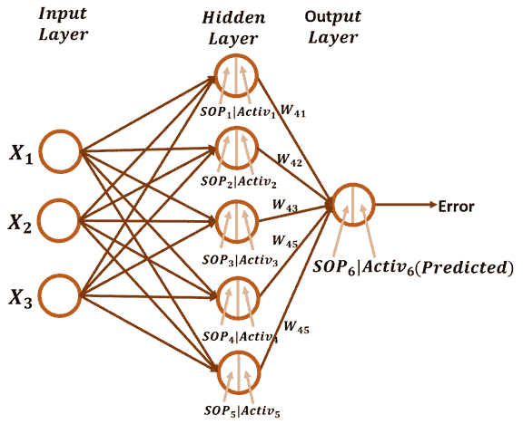

在查看向后传递之前，值得回忆的是，在向前传递中使用了 sigmoid 激活函数(定义如下)。注意 **SOP** 代表**积**之和。

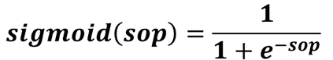

使用标准平方误差函数计算误差。

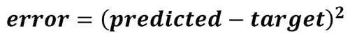

在反向传递中，用于更新隐藏层和输出层之间的权重的梯度被简单地计算，如第 3 部分中所讨论的，没有任何改变。一阶导数是下面给出的预测输出导数的误差。

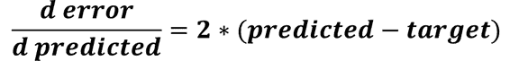

二阶导数是预测输出对 **SOP6** 的导数。

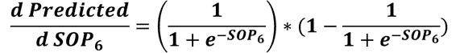

第三个也是最后一个导数是隐藏层和输出层之间权重的 **SOP6** 。因为有 5 个权重将 5 个隐藏神经元连接到输出神经元，所以将有 5 个导数，每个权重一个。记住 **SOP6** 是根据下面的等式计算的:

```py
SOP6 = Activ1*W41 + Activ2*W42 + Activ3*W43 + Activ4*W44 + Activ5*W45
```

比如 **SOP6** 对 **W41** 的导数等于 Activ1， **SOP6** 对 **W42** 的导数等于 **Activ2** 等等。

为了计算这 5 个权重的梯度，将前面 3 个导数的链相乘。所有梯度都是根据下图中的等式计算的。所有这些梯度共享链中的前两个导数。

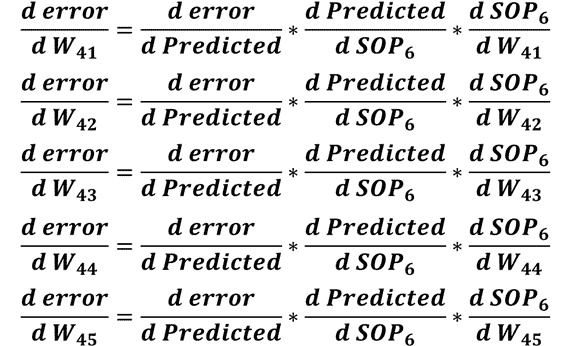

计算隐藏层和输出层之间的权重梯度后，接下来是计算输入层和隐藏层之间的权重梯度。

用于计算此类梯度的导数链将从之前计算的前两个导数开始，它们是:

1.  预测输出导数的误差。
2.  SOP6 导数的预测输出。

链中的三阶导数将是 sigmoid 函数( **Activ1** 至 **Activ5** )输出的 SOP6。基于下面再次给出的将 SOP6 和 Activ1 与 Activ2 相关联的等式，SOP6 对 Activ1 的导数等于 W41，SOP6 对 Activ2 的导数等于 W42，以此类推。

```py
SOP6 = Activ1*W41 + Activ2*W42 + Activ3*W43 + Activ4*W44 + Activ5*W45
```

链中的下一个导数是 sigmoid 函数对隐藏层中的 SOP 的导数。例如，Activ1 对 SOP1 的导数根据下式计算。要计算 Activ2 对 SOP2 的导数，只需将 SOP1 替换为 SOP2。这适用于所有其他衍生品。

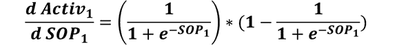

链中的最后一个导数是计算每个隐藏神经元的 SOP 相对于与其相连的权重的导数。为简单起见，下图显示了 ANN 体系结构，除了与第一个隐藏神经元的连接之外，输入层和隐藏层之间的所有连接都被删除。

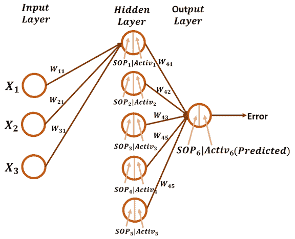

为了计算 SOP1 对其 3 个权重(W11、W21 和 W31)的导数，我们必须记住下面给出的与所有权重相关的等式。因此，SOP1 对 W11 的导数为 X1，SOP2 对 W21 的导数为 X2，依此类推。

```py
SOP1 = X1*W11 + X2*W21 + X3*W31
```

如果将输入神经元连接到第二个隐藏神经元的权重是 W12、W22 和 W32，则 SOP2 计算如下。因此，SOP2 至 W12 的导数是 X1，SOP2 至 W22 的导数是 X2，依此类推。对于所有其他隐藏的神经元，该过程继续。

```py
SOP2 = X1*W12 + X2*W22 + X3*W32
```

你可能会注意到，任何 SOP 对其 3 个权重的导数的结果将是 X1、X2 和 X3。

在计算了从误差到输入层权重的链中的所有导数之后，我们可以计算梯度。例如，连接到第一个隐藏神经元的 3 个权重的 3 个梯度是根据下面列出的等式计算的。注意，除了最后一个导数，所有的链都有相同的导数。

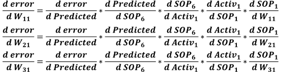

对于第二个隐藏神经元，每个 Activ1 由 Activ2 代替，每个 SOP1 由 SOP2 代替。这对于处理其他隐藏神经元也是有效的。

此时，我们成功地准备了用于计算网络中所有权重的梯度的所有导数链。下一步是用 Python 实现它。

## Python 实现

下面列出了用于实现 GD 算法的 Python 脚本，该算法用于优化具有 3 个输入和 5 个神经元的隐藏层的 ANN。我们将讨论这段代码的每一部分。

```py
import numpy

def sigmoid(sop):
    return 1.0 / (1 + numpy.exp(-1 * sop))

def error(predicted, target):
    return numpy.power(predicted - target, 2)

def error_predicted_deriv(predicted, target):
    return 2 * (predicted - target)

def sigmoid_sop_deriv(sop):
    return sigmoid(sop) * (1.0 - sigmoid(sop))

def sop_w_deriv(x):
    return x

def update_w(w, grad, learning_rate):
    return w - learning_rate * grad

x = numpy.array([0.1, 0.4, 4.1])
target = numpy.array([0.2])

learning_rate = 0.001

w1_3 = numpy.random.rand(3)
w2_3 = numpy.random.rand(3)
w3_3 = numpy.random.rand(3)
w4_3 = numpy.random.rand(3)
w5_3 = numpy.random.rand(3)
w6_5 = numpy.random.rand(5)
w6_5_old = w6_5
print("Initial W : ", w1_3, w2_3, w3_3, w4_3, w5_3, w6_5)

# Forward Pass
# Hidden Layer Calculations
sop1 = numpy.sum(w1_3 * x)
sop2 = numpy.sum(w2_3 * x)
sop3 = numpy.sum(w3_3 * x)
sop4 = numpy.sum(w4_3 * x)
sop5 = numpy.sum(w5_3 * x)

sig1 = sigmoid(sop1)
sig2 = sigmoid(sop2)
sig3 = sigmoid(sop3)
sig4 = sigmoid(sop4)
sig5 = sigmoid(sop5)

# Output Layer Calculations
sop_output = numpy.sum(w6_5 * numpy.array([sig1, sig2, sig3, sig4, sig5]))

predicted = sigmoid(sop_output)
err = error(predicted, target)

# Backward Pass
g1 = error_predicted_deriv(predicted, target)

### Working with weights between hidden and output layer
g2 = sigmoid_sop_deriv(sop_output)

g3 = numpy.zeros(w6_5.shape[0])
g3[0] = sop_w_deriv(sig1)
g3[1] = sop_w_deriv(sig2)
g3[2] = sop_w_deriv(sig3)
g3[3] = sop_w_deriv(sig4)
g3[4] = sop_w_deriv(sig5)

grad_hidden_output = g3 * g2 * g1

w6_5[0] = update_w(w6_5[0], grad_hidden_output[0], learning_rate)
w6_5[1] = update_w(w6_5[1], grad_hidden_output[1], learning_rate)
w6_5[2] = update_w(w6_5[2], grad_hidden_output[2], learning_rate)
w6_5[3] = update_w(w6_5[3], grad_hidden_output[3], learning_rate)
w6_5[4] = update_w(w6_5[4], grad_hidden_output[4], learning_rate)

### Working with weights between input and hidden layer
# First Hidden Neuron
g3 = sop_w_deriv(w6_5_old[0])
g4 = sigmoid_sop_deriv(sop1)
g5 = sop_w_deriv(x)
grad_hidden1_input = g5 * g4 * g3 * g2 * g1
w1_3 = update_w(w1_3, grad_hidden1_input, learning_rate)

# Second Hidden Neuron
g3 = sop_w_deriv(w6_5_old[1])
g4 = sigmoid_sop_deriv(sop2)
g5 = sop_w_deriv(x)
grad_hidden2_input = g5 * g4 * g3 * g2 * g1
w2_3 = update_w(w2_3, grad_hidden2_input, learning_rate)

# Third Hidden Neuron
g3 = sop_w_deriv(w6_5_old[2])
g4 = sigmoid_sop_deriv(sop3)
g5 = sop_w_deriv(x)
grad_hidden3_input = g5 * g4 * g3 * g2 * g1
w3_3 = update_w(w3_3, grad_hidden3_input, learning_rate)

# Fourth Hidden Neuron
g3 = sop_w_deriv(w6_5_old[3])
g4 = sigmoid_sop_deriv(sop4)
g5 = sop_w_deriv(x)
grad_hidden4_input = g5 * g4 * g3 * g2 * g1
w4_3 = update_w(w4_3, grad_hidden4_input, learning_rate)

# Fourth Hidden Neuron
g3 = sop_w_deriv(w6_5_old[4])
g4 = sigmoid_sop_deriv(sop5)
g5 = sop_w_deriv(x)
grad_hidden5_input = g5 * g4 * g3 * g2 * g1
w5_3 = update_w(w5_3, grad_hidden5_input, learning_rate)

w6_5_old = w6_5
print(predicted)
```

根据下面的代码行，准备输入及其输出是这段代码中要做的第一件事。因为输入层有 3 个输入，所以只存在一个有 3 个值的数组。它实际上不是一个数组，而是一个向量。目标被指定为单个值。

```py
x = numpy.array([0.1, 0.4, 4.1])
target = numpy.array([0.2])
```

下一步是准备网络权重，如下所示。每个隐藏神经元的权重在一个单独的变量中创建。例如，第一个隐藏神经元的权重存储在 **w1_3** 变量中。变量 **w6_5** 保存将 5 个隐藏神经元连接到输出神经元的 5 个权重。

```py
w1_3 = numpy.random.rand(3)
w2_3 = numpy.random.rand(3)
w3_3 = numpy.random.rand(3)
w4_3 = numpy.random.rand(3)
w5_3 = numpy.random.rand(3)
w6_5 = numpy.random.rand(5)
```

变量 **w6_5_old** 保存 **w6_5** 变量中的权重，作为计算 SOP6 到 Activ1-Activ5 导数时使用的备份。

```py
w6_5_old = w6_5
```

准备好输入、输出和权重后，下一步是开始向前传递。第一个任务是计算每个隐藏神经元的 SOP，如下所示。这是通过将 3 个输入乘以 3 个权重来实现的。

```py
# Forward Pass
# Hidden Layer Calculations
sop1 = numpy.sum(w1_3 * x)
sop2 = numpy.sum(w2_3 * x)
sop3 = numpy.sum(w3_3 * x)
sop4 = numpy.sum(w4_3 * x)
sop5 = numpy.sum(w5_3 * x)
```

之后，sigmoid 函数应用于所有这些乘积的和。

```py
sig1 = sigmoid(sop1)
sig2 = sigmoid(sop2)
sig3 = sigmoid(sop3)
sig4 = sigmoid(sop4)
sig5 = sigmoid(sop5)
```

sigmoid 函数的输出被视为输出神经元的输入。这种神经元的 SOP 使用下面的线计算。

```py
# Output Layer Calculations
sop_output = numpy.sum(w6_5 * numpy.array([sig1, sig2, sig3, sig4, sig5]))
```

输出神经元的 SOP 被馈送到 sigmoid 函数，以返回预测输出。计算出预测输出后，接下来使用 **error()** 函数计算误差。误差计算是正向传递的最后一步。接下来是开始向后传球。

```py
predicted = sigmoid(sop_output)
err = error(predicted, target)
```

在后向传递中，根据下面的线，计算的一阶导数是预测输出导数的误差。结果保存在变量 **g1** 中以备后用。

```py
g1 = error_predicted_deriv(predicted, target)
```

下一个导数是根据下一行对 SOP6 导数的预测输出。结果保存在变量 **g2** 中以备后用。

```py
g2 = sigmoid_sop_deriv(sop_output)
```

为了计算隐藏层和输出层之间的权重梯度，剩余的导数是 SOP6 到 W41-W45 的导数。它们在变量 **g3** 中根据下一行进行计算。

```py
g3 = numpy.zeros(w6_5.shape[0])
g3[0] = sop_w_deriv(sig1)
g3[1] = sop_w_deriv(sig2)
g3[2] = sop_w_deriv(sig3)
g3[3] = sop_w_deriv(sig4)
g3[4] = sop_w_deriv(sig5)
```

在准备了计算权重 W41 至 W45 的梯度所需的所有导数之后，接下来是使用下一条线来计算梯度。

```py
grad_hidden_output = g3 * g2 * g1
```

之后，可以使用下面给出的 **update_w()** 函数来更新这 5 个权重。它接受旧的权重、梯度和学习率，并返回新的权重。

```py
w6_5 = update_w(w6_5, grad_hidden_output, learning_rate)
```

更新隐藏层和输出层之间的权重后，接下来是计算输入层和隐藏层之间的权重梯度。通过我们的讨论，我们将一次研究一个隐藏的神经元。

对于第一个隐藏神经元，为其权重准备梯度所需的计算如下所示。在变量 **g3** 中，计算 **SOP6** 到 **Activ1** 的导数。在 **g4** 中，计算 **Activ1** 到 **SOP1** 的导数。最后的导数是保存在 **g5** 变量中的 **SOP1** 至 **W11-W31** 导数。注意 **g5** 有 3 个导数，每个重量一个，而 **g4** 和 **g3** 只有一个导数。

在计算链中的所有导数之后，接下来是通过乘以变量 g1 至 g5 来计算梯度，用于更新将 3 个输入神经元连接到第一个隐藏神经元的 3 个权重。结果保存在 **grad_hidden1_input** 变量中。最后，使用 **update_w()** 函数更新 3 个权重。

```py
# First Hidden Neuron
g3 = sop_w_deriv(w6_5_old[0])
g4 = sigmoid_sop_deriv(sop1)
g5 = sop_w_deriv(x)
grad_hidden1_input = g5 * g4 * g3 * g2 * g1
w1_3 = update_w(w1_3, grad_hidden1_input, learning_rate)
```

对其他隐藏神经元的处理与上面的代码非常相似。从上面的 5 行来看，只需对前 2 行进行修改。对于第二个隐藏神经元的工作，使用索引 1 为 **w6_5_old** 计算 **g3** 。计算 **g4** 时，使用 **sop2** 而不是 **sop1** 。下面列出了负责更新第二个隐藏神经元的权重的代码部分。

```py
# Second Hidden Neuron
g3 = sop_w_deriv(w6_5_old[1])
g4 = sigmoid_sop_deriv(sop2)
g5 = sop_w_deriv(x)
grad_hidden2_input = g5 * g4 * g3 * g2 * g1
w2_3 = update_w(w2_3, grad_hidden2_input, learning_rate)
```

对于第三个隐藏神经元，使用索引 2 来计算 **g3** 的 **w6_5_old** 。为了计算 **g4** ，使用 **sop3** 。其代码如下。

```py
# Third Hidden Neuron
g3 = sop_w_deriv(w6_5_old[2])
g4 = sigmoid_sop_deriv(sop3)
g5 = sop_w_deriv(x)
grad_hidden3_input = g5 * g4 * g3 * g2 * g1
w3_3 = update_w(w3_3, grad_hidden3_input, learning_rate)
```

对于第四个隐藏神经元，使用索引 3 来计算 **g3** 的 **w6_5_old** 。为了计算 **g4** ，使用 **sop4** 。其代码如下。

```py
# Fourth Hidden Neuron
g3 = sop_w_deriv(w6_5_old[3])
g4 = sigmoid_sop_deriv(sop4)
g5 = sop_w_deriv(x)
grad_hidden4_input = g5 * g4 * g3 * g2 * g1
w4_3 = update_w(w4_3, grad_hidden4_input, learning_rate)
```

对于第五个也是最后一个隐藏神经元，使用索引 4 为 **w6_5_old** 计算 **g3** 。为了计算 **g4** ，使用 **sop5** 。其代码如下。

```py
# Fifth Hidden Neuron
g3 = sop_w_deriv(w6_5_old[4])
g4 = sigmoid_sop_deriv(sop5)
g5 = sop_w_deriv(x)
grad_hidden5_input = g5 * g4 * g3 * g2 * g1
w5_3 = update_w(w5_3, grad_hidden5_input, learning_rate)
```

此时，计算所有网络权重的梯度，并更新权重。只要记得在最后将 **w6_5_old** 变量设置为新的 **w6_5** 即可。

```py
w6_5_old = w6_5
```

在为正在使用的架构实现了 GD 算法之后，我们可以允许使用一个循环在多次迭代中应用该算法。这在下面列出的代码中实现。

```py
import numpy

def sigmoid(sop):
    return 1.0/(1+numpy.exp(-1*sop))

def error(predicted, target):
    return numpy.power(predicted-target, 2)

def error_predicted_deriv(predicted, target):
    return 2*(predicted-target)

def sigmoid_sop_deriv(sop):
    return sigmoid(sop)*(1.0-sigmoid(sop))

def sop_w_deriv(x):
    return x

def update_w(w, grad, learning_rate):
    return w - learning_rate*grad

x = numpy.array([0.1, 0.4, 4.1])
target = numpy.array([0.2])

learning_rate = 0.001

w1_3 = numpy.random.rand(3)
w2_3 = numpy.random.rand(3)
w3_3 = numpy.random.rand(3)
w4_3 = numpy.random.rand(3)
w5_3 = numpy.random.rand(3)
w6_5 = numpy.random.rand(5)
w6_5_old = w6_5
print("Initial W : ", w1_3, w2_3, w3_3, w4_3, w5_3, w6_5)

for k in range(80000):
    # Forward Pass
    # Hidden Layer Calculations
    sop1 = numpy.sum(w1_3*x)
    sop2 = numpy.sum(w2_3*x)
    sop3 = numpy.sum(w3_3*x)
    sop4 = numpy.sum(w4_3*x)
    sop5 = numpy.sum(w5_3*x)

    sig1 = sigmoid(sop1)
    sig2 = sigmoid(sop2)
    sig3 = sigmoid(sop3)
    sig4 = sigmoid(sop4)
    sig5 = sigmoid(sop5)

    # Output Layer Calculations
    sop_output = numpy.sum(w6_5*numpy.array([sig1, sig2, sig3, sig4, sig5]))

    predicted = sigmoid(sop_output)
    err = error(predicted, target)

    # Backward Pass
    g1 = error_predicted_deriv(predicted, target)

    ### Working with weights between hidden and output layer
    g2 = sigmoid_sop_deriv(sop_output)

    g3 = numpy.zeros(w6_5.shape[0])
    g3[0] = sop_w_deriv(sig1)
    g3[1] = sop_w_deriv(sig2)
    g3[2] = sop_w_deriv(sig3)
    g3[3] = sop_w_deriv(sig4)
    g3[4] = sop_w_deriv(sig5)

    grad_hidden_output = g3*g2*g1

    w6_5 = update_w(w6_5, grad_hidden_output, learning_rate)

    ### Working with weights between input and hidden layer
    # First Hidden Neuron
    g3 = sop_w_deriv(w6_5_old[0])
    g4 = sigmoid_sop_deriv(sop1)
    g5 = sop_w_deriv(x)
    grad_hidden1_input = g5*g4*g3*g2*g1
    w1_3 = update_w(w1_3, grad_hidden1_input, learning_rate)

    # Second Hidden Neuron
    g3 = sop_w_deriv(w6_5_old[1])
    g4 = sigmoid_sop_deriv(sop2)
    g5 = sop_w_deriv(x)
    grad_hidden2_input = g5*g4*g3*g2*g1
    w2_3 = update_w(w2_3, grad_hidden2_input, learning_rate)

    # Third Hidden Neuron
    g3 = sop_w_deriv(w6_5_old[2])
    g4 = sigmoid_sop_deriv(sop3)
    g5 = sop_w_deriv(x)
    grad_hidden3_input = g5*g4*g3*g2*g1
    w3_3 = update_w(w3_3, grad_hidden3_input, learning_rate)

    # Fourth Hidden Neuron
    g3 = sop_w_deriv(w6_5_old[3])
    g4 = sigmoid_sop_deriv(sop4)
    g5 = sop_w_deriv(x)
    grad_hidden4_input = g5*g4*g3*g2*g1
    w4_3 = update_w(w4_3, grad_hidden4_input, learning_rate)

    # Fifth Hidden Neuron
    g3 = sop_w_deriv(w6_5_old[4])
    g4 = sigmoid_sop_deriv(sop5)
    g5 = sop_w_deriv(x)
    grad_hidden5_input = g5*g4*g3*g2*g1
    w5_3 = update_w(w5_3, grad_hidden5_input, learning_rate)

    w6_5_old = w6_5
    print(predicted)
```

下图显示了预测输出与每次迭代之间的关系。

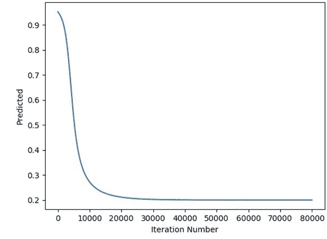

下图给出了误差和迭代之间的关系。

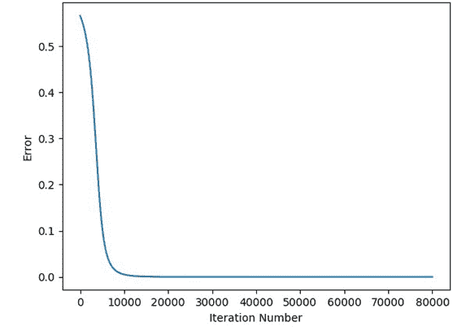

之前的 GD 算法实现不仅适用于单个隐藏层，还适用于该层中特定数量的神经元。为了推广该算法，我们可以继续编辑之前的实现，以便它可以在单个隐藏层内对任意数量的神经元起作用。随后，可以添加更多的隐藏层，并且该算法将不依赖于固定数量的隐藏层。

# 步骤 2:使用任意数量的隐藏神经元

根据前面的实现，每个神经元的计算几乎相同。使用了相同的代码，但只是输入了适当的输入。使用循环，我们可以编写一次这样的代码，并在每次迭代中使用不同的输入。新代码如下所示。

```py
import numpy

def sigmoid(sop):
    return 1.0/(1+numpy.exp(-1*sop))

def error(predicted, target):
    return numpy.power(predicted-target, 2)

def error_predicted_deriv(predicted, target):
    return 2*(predicted-target)

def sigmoid_sop_deriv(sop):
    return sigmoid(sop)*(1.0-sigmoid(sop))

def sop_w_deriv(x):
    return x

def update_w(w, grad, learning_rate):
    return w - learning_rate*grad

x = numpy.array([0.1, 0.4, 4.1])
target = numpy.array([0.2])

learning_rate = 0.001

# Number of inputs, number of neurons per each hidden layer, number of output neurons
network_architecture = numpy.array([x.shape[0], 5, 1])

# Initializing the weights of the entire network
w = []
w_temp = []
for layer_counter in numpy.arange(network_architecture.shape[0]-1):
    for neuron_nounter in numpy.arange(network_architecture[layer_counter+1]):
        w_temp.append(numpy.random.rand(network_architecture[layer_counter]))
    w.append(numpy.array(w_temp))
    w_temp = []
w = numpy.array(w)
w_old = w
print("Initial W : ", w)

for k in range(10000000000000):
    # Forward Pass
    # Hidden Layer Calculations
    sop_hidden = numpy.matmul(w[0], x)

    sig_hidden = sigmoid(sop_hidden)

    # Output Layer Calculations
    sop_output = numpy.sum(w[1][0]*sig_hidden)

    predicted = sigmoid(sop_output)
    err = error(predicted, target)

    # Backward Pass
    g1 = error_predicted_deriv(predicted, target)

    ### Working with weights between hidden and output layer
    g2 = sigmoid_sop_deriv(sop_output)
    g3 = sop_w_deriv(sig_hidden)
    grad_hidden_output = g3*g2*g1
    w[1][0] = update_w(w[1][0], grad_hidden_output, learning_rate)

    ### Working with weights between input and hidden layer
    g5 = sop_w_deriv(x)
    for neuron_idx in numpy.arange(w[0].shape[0]):
        g3 = sop_w_deriv(w_old[1][0][neuron_idx])
        g4 = sigmoid_sop_deriv(sop_hidden[neuron_idx])
        grad_hidden_input = g5*g4*g3*g2*g1
        w[0][neuron_idx] = update_w(w[0][neuron_idx], grad_hidden_input, learning_rate)

    w_old = w
    print(predicted)
```

如前所述，输入和目标被指定。有一个名为 network_architecture 的变量用于保存 ANN 架构。对于所使用的架构，输入的数量等于 x.shape[0],在本例中为 3，隐藏神经元的数量为 5，输出神经元的数量为 1。

```py
network_architecture = numpy.array([x.shape[0], 5, 1])
```

使用遍历架构中指定的每一层的 for 循环，可以在名为 **w** 的单个数组中创建网络的权重。代码如下所示。与使用单个变量保存每个单独图层的权重相比，这是一种更好的构建网络权重的方法。

```py
# Initializing the weights of the entire network
w = []
w_temp = []
for layer_counter in numpy.arange(network_architecture.shape[0]-1):
    for neuron_nounter in numpy.arange(network_architecture[layer_counter+1]):
        w_temp.append(numpy.random.rand(network_architecture[layer_counter]))
    w.append(numpy.array(w_temp))
    w_temp = []
w = numpy.array(w)
```

对于这个例子，数组 w 的形状是(2)，这意味着其中只有 2 个元素。第一个元素的形状是(5，3)，它保存有 3 个输入的输入层和有 5 个神经元的隐藏层之间的权重。数组 w 中第二个元素的形状是(1，5 ),它保存了具有 5 个神经元的隐藏层和只有一个神经元的输出层之间的权重。

以这种方式准备重量有利于向前和向后传球。所有乘积的总和都是使用一条直线计算的，如下所示。请注意，w[0]表示输入层和隐藏层之间的权重。

```py
sop_hidden = numpy.matmul(w[0], x)
```

类似地，sigmoid 函数被调用一次，以应用于所有乘积和，如下所示。

```py
sig_hidden = sigmoid(sop_hidden)
```

隐藏层和输出层之间的乘积之和是根据这条单线计算的。请注意，w[1]返回这两个层之间的权重。

```py
sop_output = numpy.sum(w[1][0]*sig_hidden)
```

通常，预测输出和误差计算如下。

```py
predicted = sigmoid(sop_output)
err = error(predicted, target)
```

这是向前传球的终点。在后向传递中，因为在输出层中只有一个神经元，所以它的权重将以先前使用的相同方式更新。

```py
# Backward Pass
g1 = error_predicted_deriv(predicted, target)

### Working with weights between hidden and output layer
g2 = sigmoid_sop_deriv(sop_output)
g3 = sop_w_deriv(sig_hidden)
grad_hidden_output = g3*g2*g1
w[1][0] = update_w(w[1][0], grad_hidden_output, learning_rate)
```

当更新输入层和隐藏层之间的权重时，使用下面给出的循环的**。它遍历隐藏层中的每个神经元，并将适当的输入用于函数 **sop_w_deriv()** 和 **sigmoid_sop_deriv()** 。**

```py
### Working with weights between input and hidden layer
g5 = sop_w_deriv(x)
for neuron_idx in numpy.arange(w[0].shape[0]):
    g3 = sop_w_deriv(w_old[1][0][neuron_idx])
    g4 = sigmoid_sop_deriv(sop_hidden[neuron_idx])
    grad_hidden_input = g5*g4*g3*g2*g1
    w[0][neuron_idx] = update_w(w[0][neuron_idx], grad_hidden_input, learning_rate)
```

通过这样做，我们成功地最小化了 GD 算法代码，并将其推广到单个隐藏层中的任意数量的隐藏神经元。在用不同数量的隐藏神经元测试代码之前，让我们确保它像前面的实现一样正确工作。下图显示了预测的输出如何随着迭代而变化。它与先前获得的结果相同，这意味着实现是正确的。

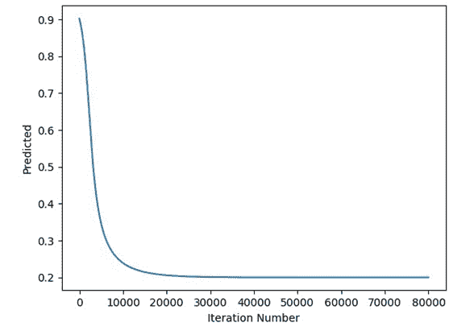

下图显示了误差是如何随着迭代而变化的，这也与上一个实现中的情况相同。


在确保代码正确工作后，下一步是使用不同数量的隐藏神经元。唯一需要的改变是在 **network_architecture** 变量中指定所需的隐藏神经元数量。下一个代码使用了 8 个隐藏的神经元。

```py
import numpy
import matplotlib.pyplot

def sigmoid(sop):
    return 1.0/(1+numpy.exp(-1*sop))

def error(predicted, target):
    return numpy.power(predicted-target, 2)

def error_predicted_deriv(predicted, target):
    return 2*(predicted-target)

def sigmoid_sop_deriv(sop):
    return sigmoid(sop)*(1.0-sigmoid(sop))

def sop_w_deriv(x):
    return x

def update_w(w, grad, learning_rate):
    return w - learning_rate*grad

x = numpy.array([0.1, 0.4, 4.1])
target = numpy.array([0.2])

learning_rate = 0.001

# Number of inputs, number of neurons per each hidden layer, number of output neurons
network_architecture = numpy.array([x.shape[0], 8, 1])

# Initializing the weights of the entire network
w = []
w_temp = []
for layer_counter in numpy.arange(network_architecture.shape[0]-1):
    for neuron_nounter in numpy.arange(network_architecture[layer_counter+1]):
        w_temp.append(numpy.random.rand(network_architecture[layer_counter]))
    w.append(numpy.array(w_temp))
    w_temp = []
w = numpy.array(w)
w_old = w
print("Initial W : ", w)

for k in range(80000):
    # Forward Pass
    # Hidden Layer Calculations
    sop_hidden = numpy.matmul(w[0], x)

    sig_hidden = sigmoid(sop_hidden)

    # Output Layer Calculations
    sop_output = numpy.sum(w[1][0]*sig_hidden)

    predicted = sigmoid(sop_output)
    err = error(predicted, target)

    # Backward Pass
    g1 = error_predicted_deriv(predicted, target)

    ### Working with weights between hidden and output layer
    g2 = sigmoid_sop_deriv(sop_output)
    g3 = sop_w_deriv(sig_hidden)
    grad_hidden_output = g3*g2*g1
    w[1][0] = update_w(w[1][0], grad_hidden_output, learning_rate)

    ### Working with weights between input and hidden layer
    g5 = sop_w_deriv(x)
    for neuron_idx in numpy.arange(w[0].shape[0]):
        g3 = sop_w_deriv(w_old[1][0][neuron_idx])
        g4 = sigmoid_sop_deriv(sop_hidden[neuron_idx])
        grad_hidden_input = g5*g4*g3*g2*g1
        w[0][neuron_idx] = update_w(w[0][neuron_idx], grad_hidden_input, learning_rate)

    w_old = w
    print(predicted)
```

下图显示了预测输出和迭代次数之间的关系，证明了 GD 算法能够成功地训练 ANN。

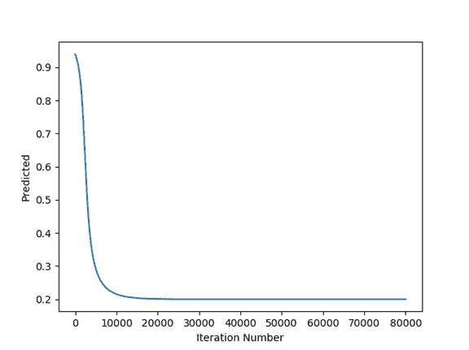

下图给出了误差和迭代次数之间的关系。

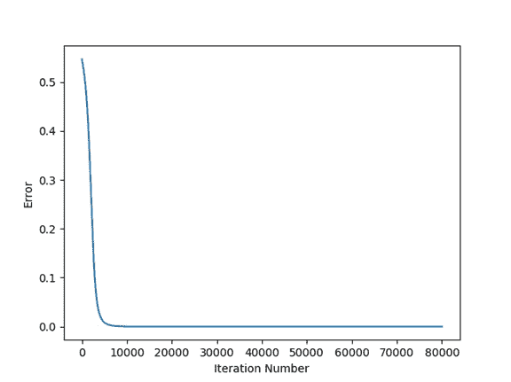

# 结论

到本系列的这一部分结束时，我们已经成功地实现了 GD 算法，可以在单个隐藏层中处理可变数量的隐藏神经元。它也可以接受可变数量的输入。在下一部分中，实现将被扩展，以允许 GD 算法处理不止一个隐藏层。