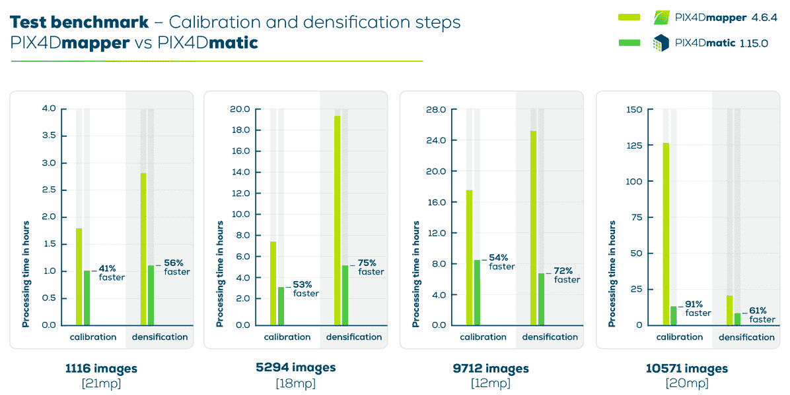
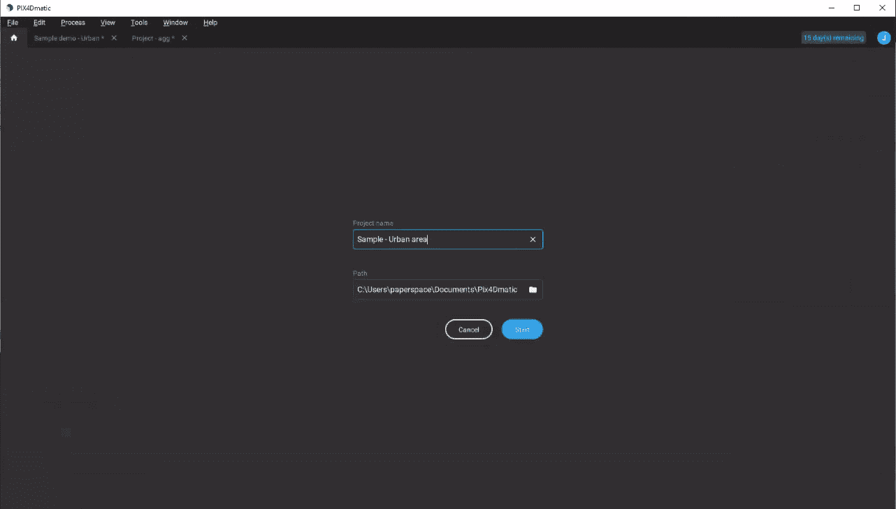
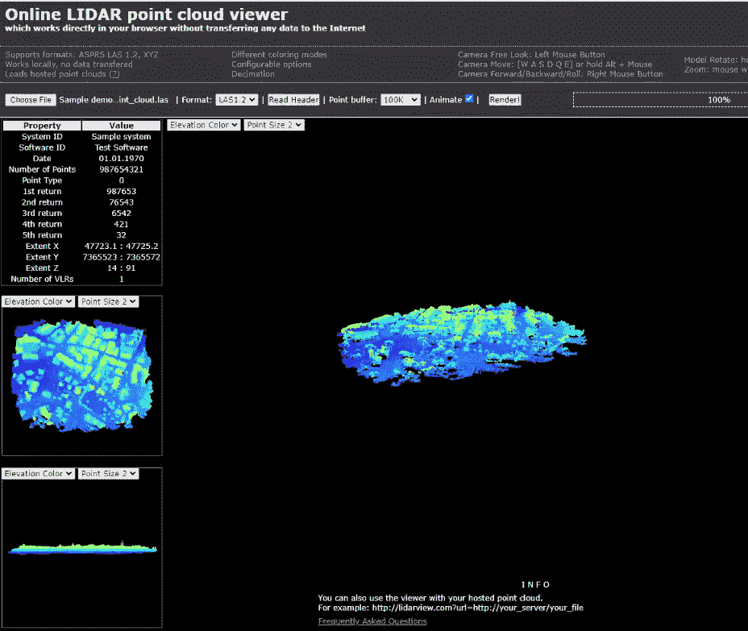
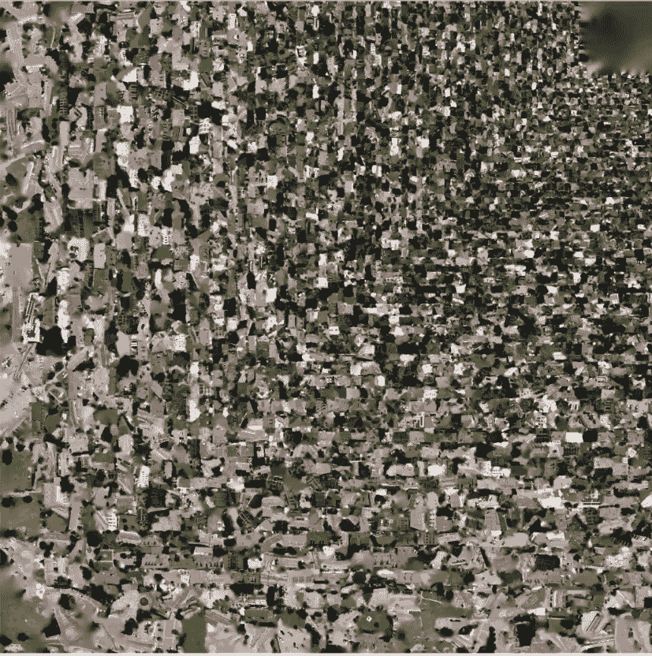
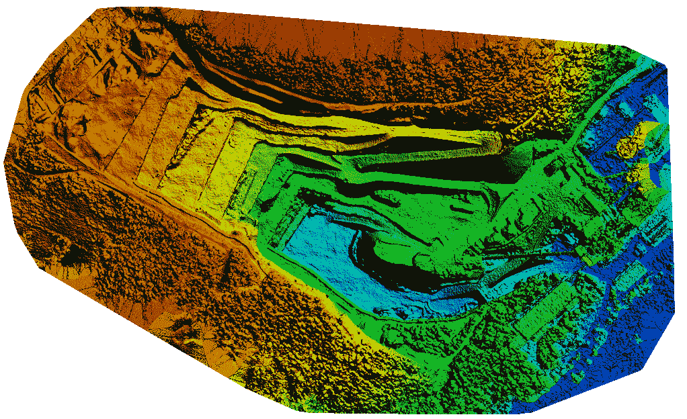
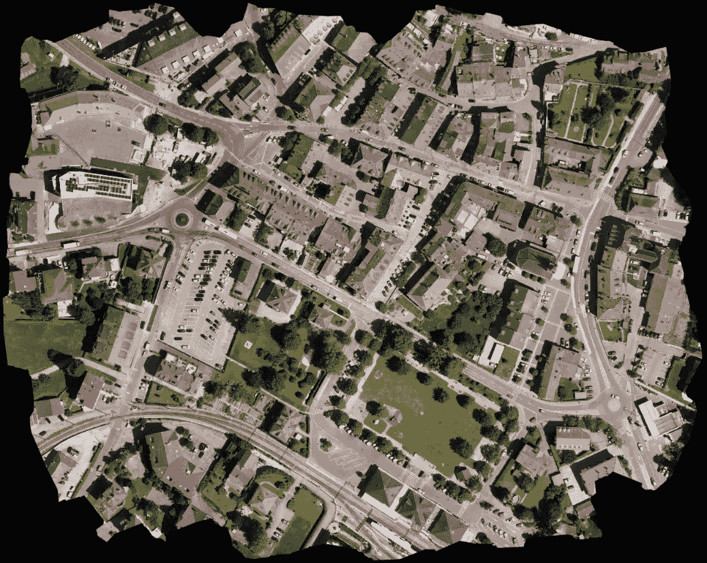
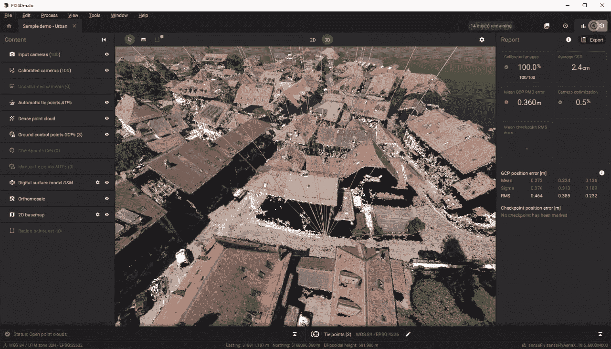

# 使用 Pix4D 和 Core 进行摄影测量

> 原文：<https://blog.paperspace.com/photogrammetry-gpu-cloud-pix4d/>

在测绘中使用摄影来测量物体之间的距离的概念被称为摄影测量。这是通过从不同角度和距离拍摄的一系列照片中观察同一物体来实现的。通过对一些物体上的这些距离进行三角测量，有可能创建物体、土地或空间的三维表示，然后我们可以利用 3D 模型进行大量不同的任务，如进行测量。这个过程在许多不同的用例中被大量利用，如土地测量、医学或体育。例如，对一块土地进行航空摄影测量可以极大地提高工程师、建筑师和施工团队对地块工作做出明智决策的能力。

毫无疑问，最受欢迎的摄影测量软件是 Pix4D，它针对航空摄影测量进行了优化，使用无人机拍摄的照片用于各种目的，如土地测量、建筑和农业规划。Pix4D 的主要产品是 Pix4Dmapper 和 Pix4Dmatic。Pix4Dmapper 是专业无人机测绘的主要软件，Pix4Dmatic 旨在更大规模的项目中做同样的工作。在这篇博客文章中，我们将先看一下 [Pix4Dmapper](https://www.pix4d.com/product/pix4dmapper-photogrammetry-software) ，然后深入了解一下 [Pix4Dmatic](https://www.pix4d.com/product/pix4dmatic-large-scale-photogrammetry-software) 。然后，我们将学习如何在 Paperspace Core 上设置 Pix4Dmatic 来处理样本数据集。

让我们看看如何使用强大的 GPU 来处理摄影测量任务所需的大量数据。

## 为什么要使用摄影测量？

Pix4D 可以说是帮助大规模土地勘测和无人机测绘的首要服务，但这项技术的实际功能用例是什么？

Pix4Dmapper 是 Pix4D 的较小规模无人机测绘软件。使用 Pix4Dmapper，可以用任何相机或无人机捕捉 RGB、热或多光谱图像，在应用程序中将地面或空中图像数字化为可用的 3D 和数字表示，然后使用这些表示创建感兴趣数据的精确测量和检查。然后，这些测量值可用于许多任务，如指导施工、土地测量等。然而，Pix4Dmapper 在快速处理多少数据方面受到限制。

[Source](https://support.pix4d.com/hc/en-us/articles/4408702135069-PIX4Dmatic-and-PIX4Dmapper-comparison)

Pix4Dmatic 是 Pix4D 处理大数据的解决方案。它支持下一代陆地、走廊和大比例制图的摄影测量。Pix4Dmatic 在其他方面的功能与 Pix4Dmapper 非常相似，但在摄影测量的处理步骤上有显著的加速。因为我们可以访问大型示例数据集和核心 GPU，所以我们将在本教程中使用 Pix4Dmatic。

## 设置:核心

在开始之前，在 Paperspace 上加载一个 Windows 核心机器。我建议您选择 Ampere 机器类型(A4000、A5000、A6000 和 A100)中的一种，如果它们可用的话，因为运行 Pix4D 的计算成本非常高。建议至少有 32 GB(20 MP 时有 2，000-5，000 个图像)到 64 GB(20mp 时有 5，000-10，000 个图像)的 CPU RAM，以及至少 100 GB - 200 GB 的可用内存空间(20mp 时有 2，000-5，000 个图像)。您可以在“机器类型”部分的“核心机器创建”页面中更改可用的存储量。

一旦你完成了这些步骤，点击底部的“创建”来创建核心机器。然后，单击 GUI 中的“Launch”按钮访问您的 Windows 桌面。

## 设置:Pix4D

现在，我们在我们的核心机器里。我们需要做的第一件事是用 Pix4D 创建一个帐户并下载软件。Pix4D 是一个商业产品，因此您需要注册一个付费帐户来使用该软件套件。但是，如果您愿意，您可以获得 15 天的免费试用期来演示他们的产品。

要开始创建您的[帐户](https://www.pix4d.com/software-guide)，请转到该页面，向下滚动到标有 [Pix4Dmatic](https://www.pix4d.com/product/pix4dmatic-large-scale-photogrammetry-software) 的部分，如果您还没有帐户，请单击“开始 15 天试用”。按照页面上的说明完成帐户设置。

<https://blog.paperspace.com/content/media/2022/06/pix4d--2.mp4>

现在您已经登录并拥有了许可证，请再次转到 [Pix4Dmatic](https://www.pix4d.com/product/pix4dmatic-large-scale-photogrammetry-software) 页面，并下载该应用程序。运行安装程序以完成设置。接下来，我们需要确保 Pix4DMatic 使用我们提供的 GPU。为此，首先通过单击屏幕左下角的 Windows 按钮进入系统设置，然后单击“齿轮”符号进入设置。从窗口中，搜索“图形设置”并导航到该页面。从那里，转到“添加应用程序”部分，单击“浏览”，然后在 Program Files/Pix4dmatic 中找到您的“pix4dmatic.exe”。添加到自定义图形设置菜单图形用户界面与电子选择“高性能”，以确保您的应用程序利用您的 GPU。

设置我们的演示需要完成的第二步是获取一些用于示例项目的示例数据。幸运的是，Pix4D 为它的用户提供了一个强大的样本数据集和项目选择,我们可以利用它来达到这个目的。打开核心机中的链接，滚动到 Pix4Dmatic 部分。对于今天的例子，我们将下载并使用[城市区域数据集](https://s3.amazonaws.com/mics.pix4d.com/example_datasets/Pix4Dmatic_example_100_images.zip)。城市区域数据集是最初更大的 10615 图像数据集的 100 图像子集，并且“整个数据集的图像采集是使用 4 架同时飞行的 eBee X - senseFly 无人机完成的”[【来源】](https://support.pix4d.com/hc/en-us/articles/360048957691-Example-dataset-PIX4Dmatic#labelM2)。下载并解压缩数据集。

## 载入数据

现在我们已经有了数据和软件设置，我们可以开始我们的摄影测量任务。加载应用程序，并单击 File > New 在应用程序中启动一个新项目。您可以将路径保留为默认文件夹，但最好重命名项目以代表作品的示例性质。

<https://blog.paperspace.com/content/media/2022/06/ezgif.com-gif-maker--2-.mp4>

现在，在您的新项目中，我们可以通过简单地将包含数据集 zip 文件内容的文件拖放到窗口中来加载我们的数据。这将自动用按地理位置组织的 100 幅图像填充地图特征空间。

<https://blog.paperspace.com/content/media/2022/06/samp.mp4>

接下来，我们有一个分配地面控制点(GCP)的可选步骤。“控制点是坐标已知的特征点。他们的坐标是通过传统的测量方法或其他来源(激光雷达、该地区的旧地图或网络地图服务)获得的。GCP 用于对项目进行地理参考并减少噪音。”[【Source】](https://support.pix4d.com/hc/en-us/articles/202558699-Using-GCPs)虽然它们对于摄影测量任务的成功不是绝对必要的，但对于提高我们输出对象的质量却非常有用。

## 处理数据

对于下一步，请确保您已激活 Pix4Dmatic 的许可证。否则，只有前两个处理选项可用，您将无法输出报告。

要处理我们现在上传和设置的城市区域数据集，请选择屏幕右上角带有播放按钮的按钮。这将打开处理菜单。在顶部，您可以更改处理模板，以反映不同类型的无人机飞行和使用的图像捕捉模式。在这种情况下，我们将使用默认的“最低点”。

然后，它给你 5 个处理选项:校准，增密，网格，DSM 和正射镶嵌。您可以单击其中每一项的切换按钮，将它们添加到我们的流程工作流中。让我们来讨论一下它们各自的功能:

#### [校准](https://support.pix4d.com/hc/en-us/articles/360043442151-Calibrate-PIX4Dmatic)

“校准处理”选项有助于为其他处理选项准备 Pix4Dmatic 数据，并通过进一步优化数据为未来运行服务。在实践中，这意味着分配校准模板以决定将使用什么处理选项，分配管道以允许用户控制相机的内部和外部参数，分配图像比例以定义用于提取关键点的图像大小，分配设置以确定提取的关键点的数量。和内部置信度度量来设置初始摄像机校准的置信度。置信度决定了摄像机在校准过程中可以重新校准和调整的程度。

#### [增密](https://support.pix4d.com/hc/en-us/articles/360044439272-Densify-PIX4Dmatic)

The dense point cloud for the urban area dataset

增密处理步骤根据提交的数据创建密集点云。密集点云是 3D 对象建模的常见起点，并且由关于特征空间中许多点的位置的一系列测量来表示。在摄影测量任务中，通过测量图像表面上的许多点来计算它们，然后使用这些距离来推断物体彼此相对位置的三维理解。

#### [网格](https://support.pix4d.com/hc/en-us/articles/4407652056593-Mesh-PIX4Dmatic)

The image mesh for the urban area dataset

在 3D 计算机图形和实体建模中，多边形网格是定义多面体对象形状的顶点、边和面的集合。在网格处理阶段，Pix4Dmatic 生成并提取特征空间中对象的网格表示。这个网格(一个. obj 文件)然后可以在许多第三方应用程序中使用，如 SculptGL 或 Blender。

#### [数字表面模型](https://support.pix4d.com/hc/en-us/articles/360048706771-DSM-PIX4Dmatic)

A sample DSM from Pix4D - [Source](https://support.pix4d.com/hc/en-us/articles/206455126-What-is-a-densified-point-cloud-an-orthomosaic-etc#label7)

DSM 步骤将密集点云作为输入，用于定义分辨率、启用表面平滑和启用插值以创建数字表面模型(DSM)。DSM 被标记为感兴趣区域的 2.5 D 模型。它可以导出为两种不同类型的文件:栅格地理标记或点云(。xyz，。las，。laz)。栅格 geotiff 文件的每个像素和点云中的每个点都包含三维(X，Y，Z)的位移信息，但它们没有第四维来表示捕获的颜色。对于每个(X，Y)位置，DSM 只有 1 个 Z 值(该(X，Y)位置最高点的高度)。

#### [正镶嵌](https://support.pix4d.com/hc/en-us/articles/360048200292-Orthomosaic-PIX4Dmatic)

The orthomosaic for the urban area dataset. 

正射镶嵌是所采集影像的 2D 表示法，其中包含有关映射区域的 X、Y 和颜色值的信息。它不同于照相拼接，因为正射校正方法使用 DSM 从图像中移除透视变形。然而，这需要大量的匹配/关键点(超过 1000 个)来生成模型。实际上，正射镶嵌会校正相机的视角，并根据对象/地面的每个点与相机的距离来增强制图表达以使用不同的比例。这使得正射镶嵌在测量中非常有用，因为物体是根据拍摄的物体彼此之间的相对距离和大小来创建的。

### 把所有的放在一起

在单击 start 运行处理之前，请注意在屏幕底部还有一个标题为“exports”的附加部分。这些输出将决定我们之后可以检查的内容。如果你需要一个输出。例如，obj 文件或 DSM GeoTIFF，确保选择那些框。否则，您现在可以只输出质量报告，然后单击“开始”

<https://blog.paperspace.com/content/media/2022/06/ortho4.mp4>

处理后，我们可以开始查看我们新创建的城市区域数据集的 3D 表示。通过这样做，我们可以更好地理解这个模型是如何创建的。通过点击每个连接点，我们可以看到每个不同角度的“摄像机”是如何连接到这些点的。这些不同的视线中的每一条都为 Pix4D 提供了不同的信息来创建这个 3D 表示。

然而，上面的例子并不完美，当我们放大时，我们可以看到模型的大部分是黑色或空白的。原因有二:第一，即使有广泛的摄像机网络也不可能捕捉到每一点信息，第二，Pix4Dmatic 的能力与有多少台摄像机以及 GCP 连接点的标记有多好直接相关。通过单击窗口右上角的条形图符号，我们可以访问评估信息提取质量的报告。正如我们所见，在所有使用的图像中，平均 GCP 均方根误差为 0.36 米。这是一个相当大的错误，我们可以通过后退一步，更准确地标注 GCP 的所有连接点，来大幅改进这个模型的输出。

### 检查我们处理过的数据

现在，我们的 3D 表示已经处理完毕，可以开始使用提供的摄影测量工具来测量我们的图像。这是 Pix4D 摄影测量的真正用途。通过软件进行测量，可以节省亲自进行物理测量的时间和精力。它还允许像我们这样的人，在不同国家的计算机上，仅使用无人机和 Pix4D 的强大软件套件，在全球各地进行相同的工作。

<https://blog.paperspace.com/content/media/2022/06/Screen-Recording-2022-06-16-at-5.32.29-PM.mp4>

您可以通过选择菜单栏下方屏幕左上角的标尺图标进行简单的测量。然后，只需将鼠标拖过有问题的位置，即可测量两点之间的距离。

## 结束语

Pix4dmatic 是进行大规模摄影测量的一个非常强大的工具。用户可以期待该应用程序能够处理数百到数千个相机输入，以比 Pix4dmapper 更高的速度创建大型 3D 场景模型。如果你打算进行大规模的摄影测量，那么 Pix4dmatic 绝对是与你的核心机器一起运行的首选软件。