# 流行深度学习架构综述:AlexNet、VGG16 和 GoogleNet

> 原文：<https://blog.paperspace.com/popular-deep-learning-architectures-alexnet-vgg-googlenet/>

从图像识别到图像生成和标记的问题已经从各种深度学习(DL)架构进步中受益匪浅。理解不同 DL 模型的复杂性将有助于您理解该领域的发展，并找到适合您试图解决的问题的方法。

在过去的几年中，出现了许多体系结构，它们在许多方面都有所不同，比如层的类型、超参数等。在这个系列中，我们将回顾几个最著名的 DL 架构，它们定义了这个领域，并重新定义了我们解决关键问题的能力。

在本系列的第一部分，我们将介绍 2012 年至 2014 年发布的“早期”车型。这包括:

*   AlexNet
*   VGG16
*   谷歌网

在第 2 部分中，我们将介绍 [ResNet、InceptionV3 和 SqueezeNet](https://blog.paperspace.com/popular-deep-learning-architectures-resnet-inceptionv3-squeezenet) 。第 3 部分将介绍 DenseNet、ResNeXt、MnasNet 和 ShuffleNet v2。

## AlexNet (2012 年)

AlexNet 是迄今为止最流行的神经网络架构之一。它是由 Alex Krizhevsky 为 ImageNet 大规模视觉识别挑战([ils RV](http://www.image-net.org/challenges/LSVRC/))提出的，基于卷积神经网络。ILSVRV 评估用于对象检测和图像分类的算法。2012 年，Alex Krizhevsky 等人发表了 *[用深度卷积神经网络](https://papers.nips.cc/paper/4824-imagenet-classification-with-deep-convolutional-neural-networks.pdf)* 进行 ImageNet 分类。这是第一次听说 AlexNet 的时候。

面临的挑战是开发一个深度卷积神经网络，将 ImageNet LSVRC-2010 数据集中的 120 万幅高分辨率图像分类为 1000 多个不同的类别。该架构实现了 15.3%的前 5 个错误率(在模型的前 5 个预测中找不到给定图像的真实标签的比率)。第二好的成绩是 26.2%，远远落后。

### AlexNet 架构

该架构总共由八层组成，其中前五层是[卷积层](https://docs.paperspace.com/machine-learning/wiki/convolutional-neural-network-cnn)，后三层是全连接的。前两个卷积层连接到重叠的最大池层，以提取最大数量的特征。第三、第四和第五卷积层直接连接到全连接层。卷积和全连接层的所有输出都连接到 ReLu 非线性激活函数。最终输出层连接到 softmax 激活层，生成 1000 个类别标签的分布。

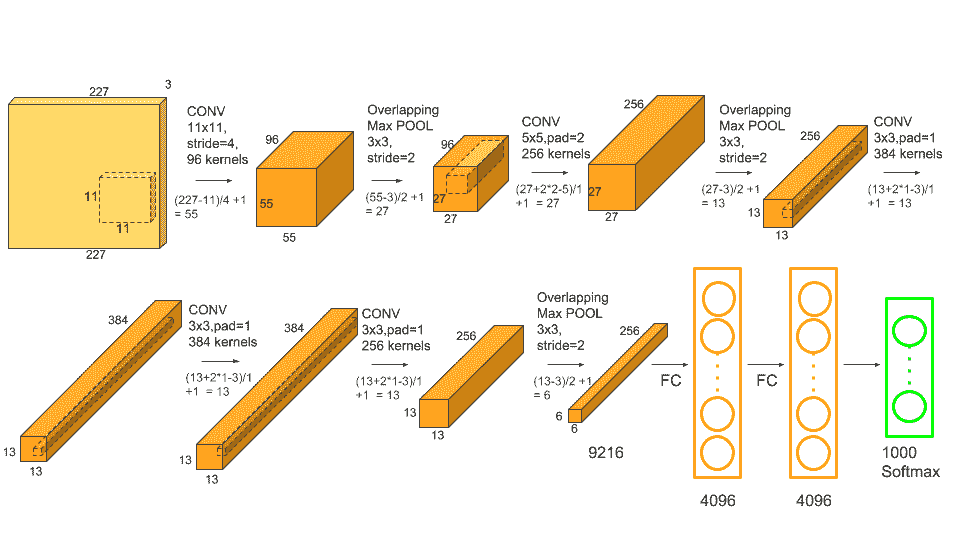

AlexNet Architecture

网络的输入维度为(256 × 256 × 3)，这意味着 AlexNet 的输入是(256 × 256)像素的 RGB (3 通道)图像。该架构涉及超过 6000 万个参数和 65 万个神经元。为了减少训练过程中的过拟合，网络使用了脱落层。被“放弃”的神经元对正向传递没有贡献，也不参与反向传播。这些层存在于前两个完全连接的层中。

### AlexNet 培训和结果

该模型使用随机梯度下降优化函数，批量、动量和重量衰减分别设置为 128、0.9 和 0.0005。所有层都使用 0.001 的相等学习率。为了解决训练过程中的过度拟合问题，AlexNet 同时使用了数据扩充层和数据删除层。在两个 GTX 580 3GB GPU 上训练 90 个周期大约需要 6 天时间。

以下是使用 AlexNet 架构获得的结果截图:

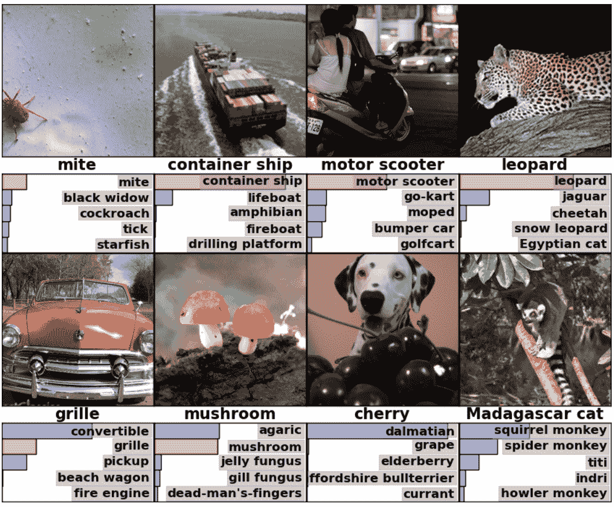

Results Using AlexNet on the ImageNet Dataset

关于在 ILSVRC-2010 数据集上的结果，AlexNet 在比赛进行时取得了 37.5%和 17.0%的 top-1 和 top-5 测试集错误率。

PyTorch 和 TensorFlow 等流行的深度学习框架现在已经有了 AlexNet 等架构的基本实现。下面是几个相关的链接，帮助你自己实现它。

1.  [PyTorch AlexNet 型号](https://pytorch.org/docs/stable/_modules/torchvision/models/alexnet.html)
2.  [Tensorflow AlexNet 模型](https://github.com/tensorflow/models/blob/master/research/slim/nets/alexnet.py)
3.  AlexNet 的 Keras 实现
4.  其他参考:[了解 AlexNet](https://www.learnopencv.com/understanding-alexnet/)
5.  原文：<https://papers.nips.cc/paper/4824-imagenet-classification-with-deep-convolutional-neural-networks.pdf>

## VGG16 (2014 年)

VGG 是由牛津大学的卡伦·西蒙扬和安德鲁·齐泽曼提出的一种流行的神经网络架构。它也基于 CNN，并应用于 2014 年的 ImageNet 挑战赛。作者在他们的论文中详细介绍了他们的工作， *[用于大规模图像识别的非常深的卷积网络](https://arxiv.org/abs/1409.1556)* 。该网络在 [ImageNet](http://image-net.org/) 数据集上取得了 92.7%的前 5 名测试准确率。

与 AlexNet 相比，VGG 的主要改进包括相继使用大内核大小的滤波器(在第一和第二卷积层中分别为 11 和 5)和多个(3×3)内核大小的滤波器。

### VGG 体系结构

架构的输入尺寸固定为图像尺寸(244 × 244)。在预处理步骤中，从图像中的每个像素中减去平均 RGB 值。

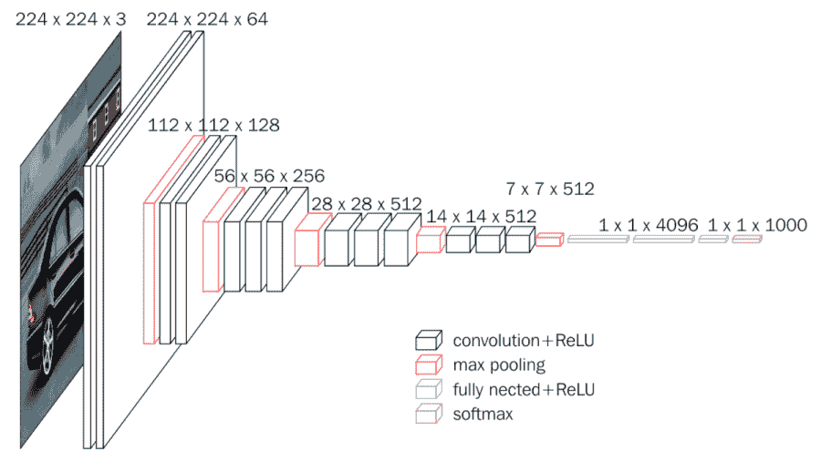

Source: [Step by step VGG16 implementation in Keras for beginners](https://towardsdatascience.com/step-by-step-vgg16-implementation-in-keras-for-beginners-a833c686ae6c)

预处理完成后，图像被传递到一堆卷积层，这些卷积层带有尺寸为(3×3)的小型感受野滤波器。在一些配置中，滤波器大小设置为(1 × 1)，这可视为输入通道的线性变换(后跟非线性)。

卷积运算的步距固定为 1。空间池由五个最大池层执行，这五个最大池层跟随几个卷积层。最大池在(2 × 2)像素窗口上执行，步长设置为 2。

全连接层的配置总是相同的；前两层各有 4096 个通道，第三层执行 1000 路 ILSVRC 分类(因此包含 1000 个通道，每个类别一个通道)，最后一层是 softmax 层。VGG 网络的所有隐藏层之后是 ReLu 激活函数。

### VGG 配置、培训和结果

VGG 网络有五种配置，分别命名为 A 到 e。配置的深度从左(A)到右(B)增加，并增加了更多的层。下表描述了所有可能的网络架构:

所有配置都遵循架构中的通用模式，只是深度不同；从网络 A 中的 11 个权重层(8 个卷积层和 3 个全连接层)，到网络 E 中的 19 个权重层(16 个卷积层和 3 个全连接层)。卷积层的信道数量相当少，从第一层的 64 开始，然后在每个最大汇集层之后增加 2 倍，直到达到 512。下图显示了参数的总数(以百万计):

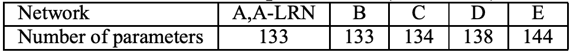

在 VGG 网络上训练图像使用类似于前面提到的 Krizhevsky 等人的技术(即 AlexNet 的训练)。当涉及多尺度训练图像时，只有少数例外。整个训练过程通过使用基于反向传播的小批量梯度下降优化多项式逻辑回归目标来执行。批量大小和动量分别设置为 256 和 0.9。为前两个完全连接的层添加了下降正则化，将下降率设置为 0.5。网络的学习率最初设置为 0.001，然后当验证集精度停止提高时，学习率降低 10 倍。总的来说，学习率降低了 3 倍，并且在 370，000 次迭代(74 个时期)之后停止学习。

在 ILSVRC-2012 和 ILSVRC-2013 比赛中，VGG16 都明显优于上一代车型。关于单网性能，VGG16 架构取得了最好的结果(7.0%测试误差)。下表显示了错误率。

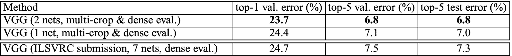

关于硬件和训练时间，VGG 网络使用英伟达的泰坦黑色 GPU 进行了数周的训练。

如果你使用 VGG 网络，有两个主要缺点值得注意。第一，训练要花很多时间。第二，网络架构权重相当大。由于其深度和全连接节点的数量，训练的 VGG16 模型超过 500MB。VGG16 用于很多深度学习图像分类问题；然而，更小的网络架构往往更可取(如 SqueezeNet、GoogleNet 等。)

PyTorch 和 TensorFlow 等流行的深度学习框架都有 VGG16 架构的基本实现。下面是几个相关链接。

1.  [PyTorch VGG 实现](https://github.com/pytorch/vision/blob/master/torchvision/models/vgg.py)
2.  [张量流 VGG 实现](https://github.com/tensorflow/models/blob/master/research/slim/nets/vgg.py)
3.  [链接到原始研究论文](https://arxiv.org/pdf/1409.1556.pdf)

## 谷歌网(2014 年)

初始网络是神经网络领域的重大突破之一，尤其是对 CNN 而言。迄今为止，盗梦网络有三个版本，分别命名为盗梦版本 1、2 和 3。第一个版本于 2014 年进入该领域，正如其名称“GoogleNet”所示，它是由谷歌的一个团队开发的。该网络负责在 ILSVRC 中建立新的分类和检测技术。这个初始网络的第一个版本被称为 **GoogleNet** 。

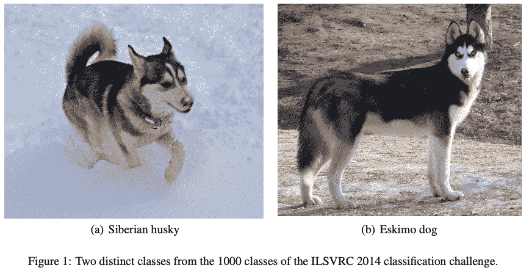

如果网络由许多深层构成，它可能会面临过度拟合的问题。为了解决这个问题，研究论文中的作者提出了 GoogleNet 架构，其想法是拥有可以在同一级别上操作的多种大小的过滤器。有了这个想法，网络实际上变得更宽而不是更深。下图显示了一个简单的初始模块。

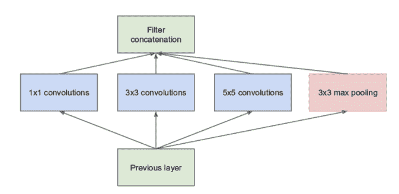

从上图可以看出，卷积运算是对三种滤波器大小的输入执行的:(1 × 1)、(3 × 3)和(5 × 5)。还对卷积执行最大池操作，然后将其发送到下一个初始模块。

由于训练神经网络既耗时又昂贵，作者通过在(3 × 3)和(5 × 5)卷积之前添加额外的(1 × 1)卷积来限制输入通道的数量，以降低网络的维数并执行更快的计算。下面的图片展示了一个简单的 Inception 模块。

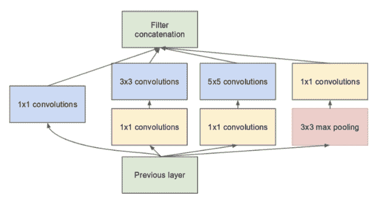

这些是谷歌网的组成部分。下面是关于其架构的详细报告。

## 谷歌网络架构

GoogleNet 架构有 22 层，包括 27 个池层。总共有 9 个初始模块线性堆叠。初始模块的末端连接到全局平均池层。下面是整个 GoogleNet 架构的缩小图。

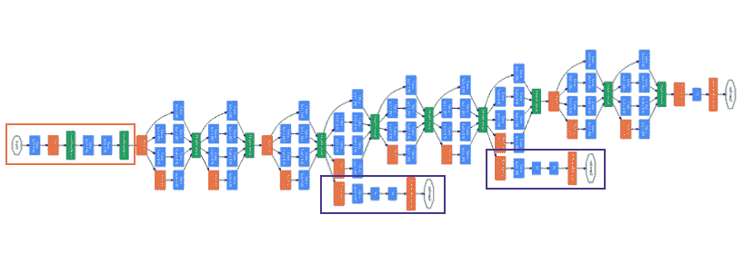

The Orange Box in the architecture is the stem that has few preliminary convolutions. The purple boxes are the auxiliary classes. (Image Credits: [A Simple Guide to the Versions of the Inception Network](https://towardsdatascience.com/a-simple-guide-to-the-versions-of-the-inception-network-7fc52b863202)).

下图解释了详细的架构和参数。

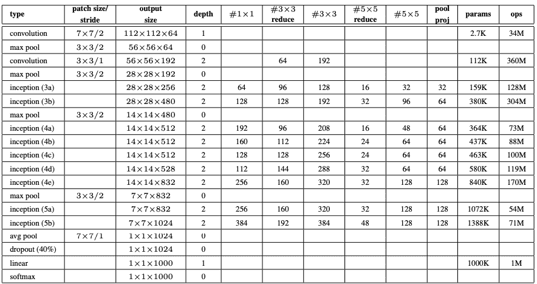

### GoogleNet 培训和结果

GoogleNet 使用分布式机器学习系统进行训练，具有适度的模型和数据并行性。训练使用动量为 0.9 的异步随机梯度下降和每 8 个时期将学习率降低 4%的固定学习率时间表。下面是参加 ILSVRC 2014 的团队的成绩图像。谷歌网以 6.67%的错误率位居第一。

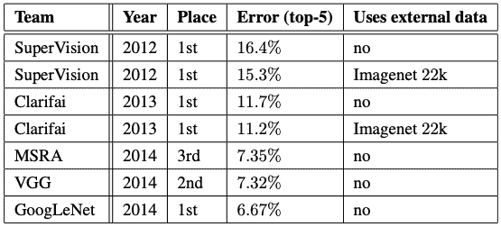

下面是几个相关链接，如果你对使用或实现 GoogleNet 感兴趣，我鼓励你去看看。

1.  [链接到原始研究论文](https://arxiv.org/pdf/1409.4842v1.pdf)
2.  GoogleNet 的 PyTorch 实现
3.  [Google net 的 Tensorflow 实现](https://github.com/conan7882/GoogLeNet-Inception)

在本系列的下一部分，我们将回顾 2015 年至 2016 年发布的流行深度学习架构，包括 [ResNet、InceptionV3 和 SqueezeNet](https://blog.paperspace.com/popular-deep-learning-architectures-resnet-inceptionv3-squeezenet) 。