# 流行深度学习架构综述:DenseNet、ResNeXt、MnasNet 和 ShuffleNet v2

> 原文：<https://blog.paperspace.com/popular-deep-learning-architectures-densenet-mnasnet-shufflenet/>

这个由三部分组成的系列的目的是揭示深度学习模型的前景和发展，这些模型定义了该领域并提高了我们解决挑战性问题的能力。在第 1 部分中，我们介绍了 2012-2014 年开发的模型，即 [AlexNet、VGG16 和 GoogleNet](https://blog.paperspace.com/popular-deep-learning-architectures-alexnet-vgg-googlenet/) 。在第二部分中，我们看到了 2015-2016 年更近的模型: [ResNet，InceptionV3，和 SqueezeNet](https://blog.paperspace.com/popular-deep-learning-architectures-resnet-inceptionv3-squeezenet/) 。既然我们已经介绍了过去流行的架构和模型，我们将继续介绍最新的技术。

我们将在此讨论的架构包括:

*   DenseNet
*   ResNeXt
*   MnasNet
*   ShuffleNet v2

让我们开始吧。

## DenseNet (2016)

“DenseNet”这个名字指的是[密集连接的卷积网络](https://arxiv.org/abs/1608.06993)。这是由黄高、刘庄和他们的团队在 2017 年 CVPR 会议上提出的。它获得了最佳论文奖，并被引用了 2000 多次。

传统的 *n* 层的卷积网络有 *n* 个连接；每层与其后续层之间有一个。在 DenseNet 中，每一层都以前馈方式连接到其他每一层，这意味着 DenseNet 总共有 *n* ( *n* +1)/2 个连接。对于每一层，所有先前层的特征图被用作输入，并且它自己的特征图被用作所有后续层的输入。

### 密集块

DenseNet 比传统的深度 CNN 有一个很大的优势:通过许多层传递的信息在到达网络末端时不会被洗掉或消失。这是通过一个简单的连接模式实现的。为了理解这一点，人们必须知道普通 CNN 中的层是如何连接的。

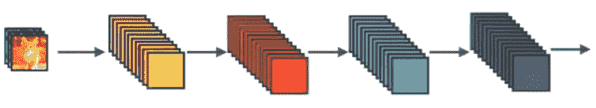

这是一个简单的 CNN，其中各层是顺序连接的。但是，在密集块中，每一层都从所有前面的层获得额外的输入，并将自己的要素地图传递给所有后面的层。下图描绘了致密的块状物。

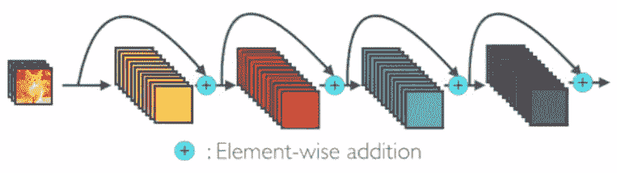

随着网络中的图层从所有先前图层接收要素地图，网络将变得更细、更紧凑。下面是一个通道数设置为 4 的 5 层密集块。

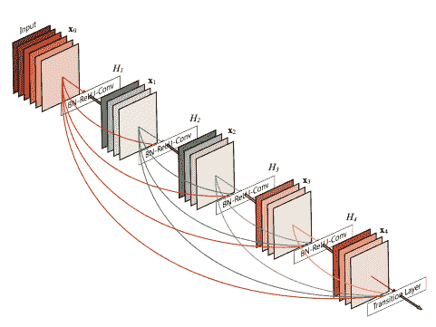

### DenseNet 建筑

DenseNet 已经应用于各种不同的数据集。基于输入的维度，使用不同类型的密集块。下面是对这些层的简要描述。

*   **基本 DenseNet 组合层:**在这种类型的密集块中，每一层后面都有一个预激活的批量标准化层、ReLU 激活函数和一个 3×3 卷积。下面是一个快照。

*   **瓶颈 DenseNet (DenseNet-B):** 由于每一层都会产生 *k* 输出特征图，因此每一层的计算都会更加困难。因此，作者提出了一种瓶颈结构，其中在 3×3 卷积层之前使用 1×1 卷积，如下所示。

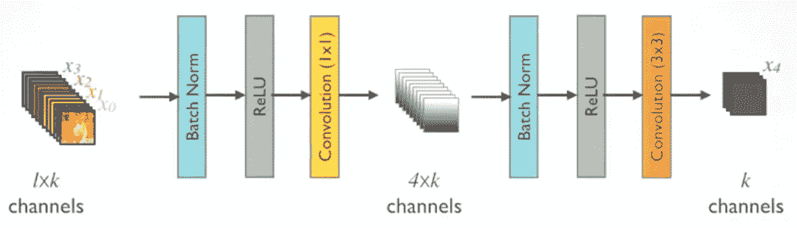

*   **DenseNet 压缩:**为了提高模型的紧凑性，作者尝试减少过渡层的特征图。因此，如果密集块由 *m* 个特征图组成，并且过渡层生成 *i* 个输出特征图，其中 0<I= 1，这个 *i* 也表示压缩因子。如果 I 的值等于 1(I = 1)，则过渡层上的特征图数量保持不变。如果 i < 1，则该架构被称为 DenseNet-C，并且 *i* 的值将变为 0.5。当瓶颈层和带有 *i* < 1 的过渡层都被使用时，我们称我们的模型为 DenseNet-BC。
*   **带过渡层的多个密集块:**架构中的密集块后面是 1×1 卷积层和 2×2 平均池层。由于要素地图大小相同，因此很容易连接过渡图层。最后，在密集块的末尾，执行附加到 softmax 分类器的全局平均池。

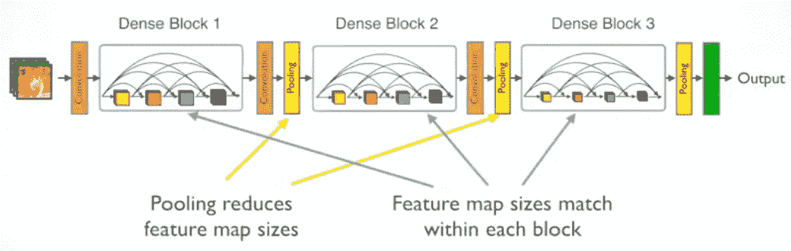

### DenseNet 培训和结果

原始研究论文中定义的 DenseNet 架构应用于三个数据集:CIFAR、SVHN 和 ImageNet。所有架构都使用随机梯度下降优化器进行训练。CIFAR 和 SVHN 的训练批次大小分别为 64、300 和 40 个时期。初始学习率设置为 0.1，并进一步降低。以下是在 ImageNet 上培训的 DenseNet 的指标:

*   批量:256 个
*   纪元:90 年
*   学习率:0.1，在 30 岁和 60 岁时下降了 10 倍
*   重量衰减和动量:0.00004 和 0.9

以下是详细的结果，显示了 DenseNet 的不同配置与 CIFAR 和 SVHN 数据集上的其他网络相比的差异。蓝色数据表示最佳结果。

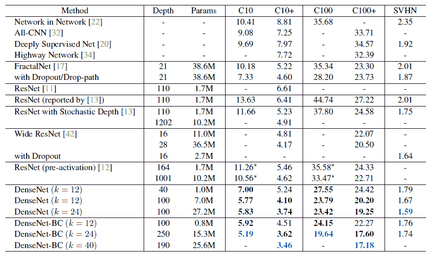

以下是 ImageNet 上不同大小的 DenseNet 的前 1 名和前 5 名错误。

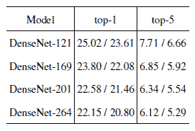

如果您想了解原始论文、其实现或如何自己实现 DenseNet，下面是一些相关链接:

1.  本综述中的大部分图像摘自 Sik-Ho Tsang 的原始研究论文( [DenseNet](https://arxiv.org/pdf/1608.06993.pdf) )和文章【T2 综述:Dense net-密集卷积网络(图像分类)】
2.  [原始纸张对应的代码](https://github.com/liuzhuang13/DenseNet)
3.  [dense net 的 TensorFlow 实现](https://www.tensorflow.org/api_docs/python/tf/keras/applications/densenet)
4.  [PyTorch 实现 DenseNet](https://github.com/pytorch/vision/blob/master/torchvision/models/densenet.py)

## ResNeXt (2017)

ResNeXt 是一个同质神经网络，它减少了传统 [ResNet](https://blog.paperspace.com/popular-deep-learning-architectures-resnet-inceptionv3-squeezenet/) 所需的超参数数量。这是通过使用“基数”来实现的，基数是 ResNet 的宽度和深度之上的一个额外维度。基数定义了转换集的大小。

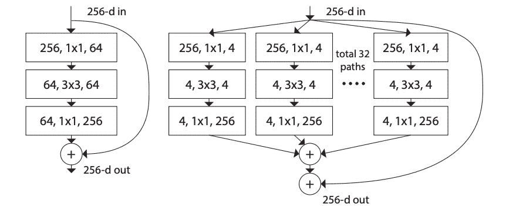

在此图中，最左边的图是一个传统的 ResNet 块；最右边的是 ResNeXt 块，基数为 32。相同的转换应用了 32 次，最后汇总结果。这项技术是在 2017 年的论文 *[中提出的，该论文题为《深度神经网络](https://arxiv.org/abs/1611.05431)* 的聚合残差变换》，由谢赛宁、罗斯·吉希克、彼得·多拉尔、·涂和何合著，他们都在人工智能研究所工作。

[VGG 网络](https://blog.paperspace.com/popular-deep-learning-architectures-alexnet-vgg-googlenet/)、[雷斯网和初始网络](https://blog.paperspace.com/popular-deep-learning-architectures-resnet-inceptionv3-squeezenet/)已经在特征工程领域获得了很大的发展势头。尽管他们表现出色，但仍面临一些限制。这些模型非常适合几个数据集，但由于涉及许多超参数和计算，使它们适应新的数据集不是一件小事。为了克服这些问题，考虑了 VGG/ResNet(从 VGG 发展而来的 ResNet)和 Inception 网络的优点。一言以蔽之，ResNet 的重复策略与 Inception Network 的拆分-转换-合并策略相结合。换句话说，网络块分割输入，将其转换为所需的格式，并将其合并以获得输出，其中每个块遵循相同的拓扑结构。

### ResNeXt 架构

ResNeXt 的基本架构由两条规则定义。首先，如果块产生相同维度的空间图，它们共享相同的超参数集，并且如果空间图以因子 2 被下采样，则块的宽度乘以因子 2。

如表中所示，ResNeXt-50 的基数 32 重复了 4 次(深度)。[]中的尺寸表示剩余块结构，而写在它们旁边的数字表示堆叠块的数量。32 精确地表示在分组卷积中有 32 个组。

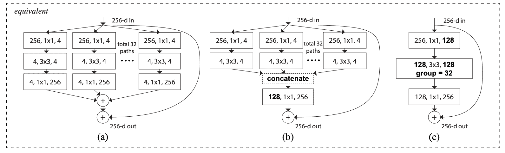

上述网络结构解释了什么是分组卷积，以及它如何胜过其他两种网络结构。

*   (a)表示以前已经见过的普通 ResNeXt 块。它的基数为 32，遵循分割-转换-合并策略。
*   (b)看起来确实像是《盗梦空间》的一片叶子。然而，Inception 或 Inception-ResNet 没有遵循相同拓扑的网络块。
*   (c)与 AlexNet 架构中提出的分组卷积相关。如(a)和(b)所示，32*4 已被替换为 128。简而言之，这意味着分裂是由分组卷积层完成的。类似地，该变换由进行 32 组卷积的另一分组卷积层来完成。后来，连接发生了。

在上述三种方法中，(c)被证明是最好的，因为它易于实现。

### resnet 培训和结果

ImageNet 已经被用来展示当基数而不是宽度/深度被考虑时准确性的提高。

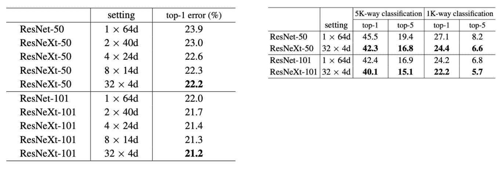

当基数较高时，ResNeXt-50 和 ResNeXt-101 都不太容易出错。此外，与 ResNet 相比，ResNeXt 表现良好。

下面是一些重要的链接，

1.  [链接到原始研究论文](https://arxiv.org/pdf/1611.05431.pdf)
2.  [PyTorch 实现 ResNext](https://pytorch.org/hub/pytorch_vision_resnext/)
3.  [ResNext 的 Tensorflow 实现](https://github.com/taki0112/ResNeXt-Tensorflow)

## ShuffleNet v2 (2018)

ShuffleNet v2 考虑直接指标，如速度或内存访问成本，来衡量网络的计算复杂性(除了 FLOPs，它还充当间接指标)。此外，直接指标也在目标平台上进行评估。ShuffleNet v2 就是这样在 2018 年出版的论文 *[ShuffleNet V2:高效 CNN 架构设计实用指南](https://arxiv.org/abs/1807.11164)* 中介绍的。它是由马宁宁、张翔宇、郑海涛和孙健共同撰写的。

FLOPs 是衡量网络计算性能的常用指标。然而，一些研究证实了这样一个事实，即失败并不能完全挖掘出潜在的真理；具有类似 FLOPs 的网络在速度上有所不同，这可能是因为内存访问成本、并行度、目标平台等。所有这些都不属于失败，因此，被忽视。ShuffleNet v2 通过提出建模网络的四个准则克服了这些麻烦。

### ShuffleNet v2 架构

在了解网络体系结构之前，网络构建所依据的指导原则应简要介绍如何考虑各种其他直接指标:

1.  等通道宽度最小化内存访问成本:当输入通道和输出通道的数量同比例(1:1)时，内存访问成本变低。
2.  过多的组卷积增加了访存成本:组数不宜过高，否则访存成本有增加的趋势。
3.  网络碎片降低了并行度:碎片降低了网络执行并行计算的效率。
4.  基于元素的操作是不可忽略的:基于元素的操作有小的触发器，但是会增加内存访问时间。

所有这些都集成在 ShuffleNet v2 架构中，以提高网络效率。

信道分割操作符将信道分为两组，其中一组作为身份保留(第 3 条准则)。另一个分支沿着三个回旋具有相同数量的输入和输出通道(第一条准则)。1x1 卷积不是分组的(第二条准则)。像 ReLU、Concat、深度卷积这样的基于元素的操作被限制在一个分支中(4 准则)。

ShuffleNet v2 的整体架构列表如下:

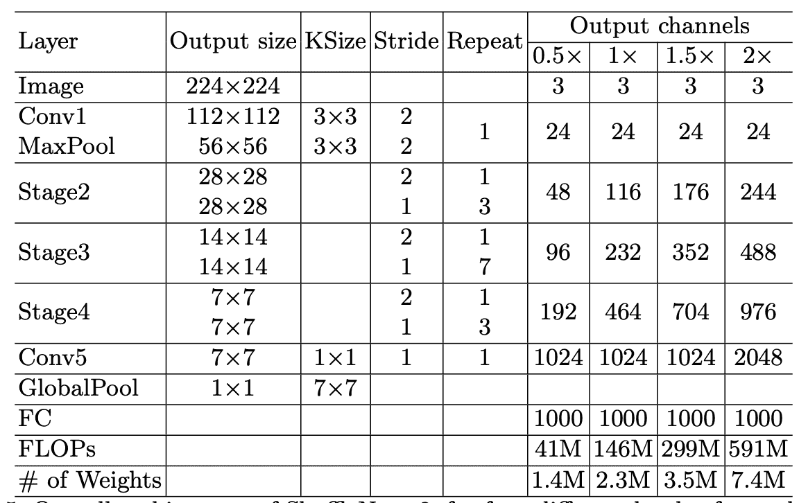

结果是关于输出声道的不同变化。

### ShuffleNet v2 培训和结果

Imagenet 已被用作数据集，以获得各种数据集的结果。

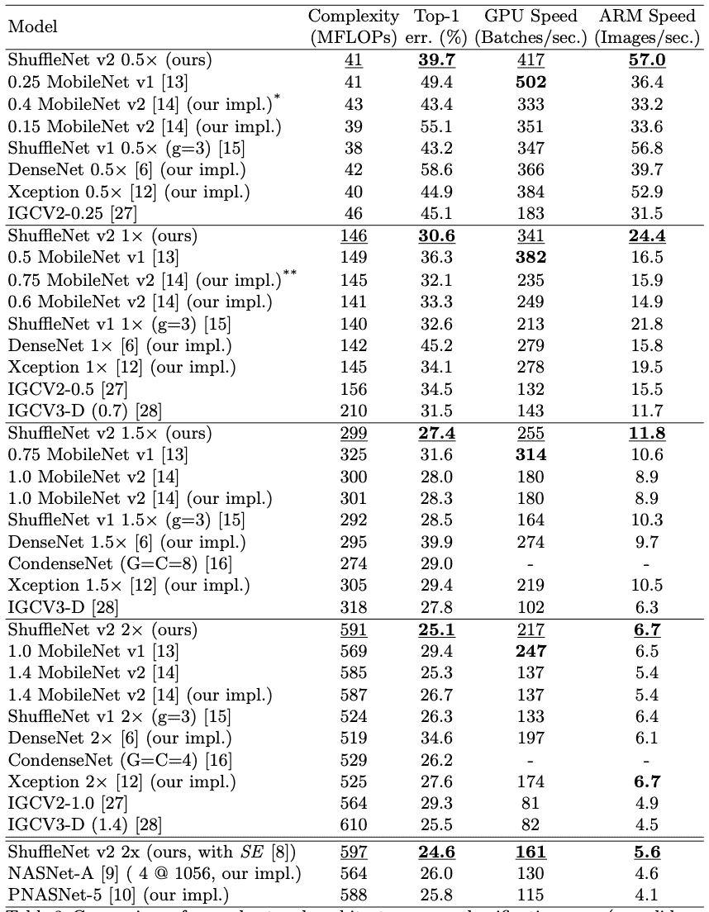

复杂度、错误率、GPU 速度和 ARM 速度已经被用于在预期的模型中导出稳健且有效的模型。虽然 ShuffleNet v2 缺乏 GPU 速度，但它记录了最低的 top-1 错误率，这超过了其他限制。

下面是几个额外的链接，你可能会对自己实现 ShuffleNet 感兴趣，或者深入阅读原文。

1.  [链接到原始研究论文](https://arxiv.org/pdf/1807.11164.pdf)
2.  [shuffle net v2 的 Tensorflow 实现](https://github.com/TropComplique/shufflenet-v2-tensorflowPyTorch )
3.  [PyTorch 实现 ShuffleNet V2](https://pytorch.org/hub/pytorch_vision_shufflenet_v2/)

## 多边核安全网络(2019 年)

MnasNet 是一个自动化的移动神经架构搜索网络，用于使用强化学习来构建移动模型。它结合了 CNN 的基本精髓，从而在提高准确性和减少延迟之间取得了正确的平衡，以在模型部署到移动设备上时描绘高性能。这个想法是在 2019 年出的论文 [*MnasNet:平台感知的神经架构搜索移动*](https://arxiv.org/abs/1807.11626) 中提出的。该论文由谭明星、陈博、庞若明、维杰·瓦苏德万、马克·桑德勒、安德鲁·霍华德和安德鲁·霍华德共同撰写，他们都属于谷歌大脑团队。

到目前为止开发的传统移动 CNN 模型，当考虑等待时间和准确性时，不能产生正确的结果；他们在这两方面都有所欠缺。通常使用 FLOPS 来估计延迟，这不会输出正确的结果。然而，在 MnasNet 中，模型被直接部署到移动设备上，并且对结果进行估计；不涉及代理。移动设备通常是资源受限的，因此，诸如性能、成本和延迟等因素是需要考虑的重要指标。

### MnasNet 架构

该架构通常由两个阶段组成-搜索空间和强化学习方法。

*   分解的分层搜索空间:搜索空间支持在整个网络中包含不同的层结构。CNN 模型被分解成各种块，其中每个块具有唯一的层架构。连接的选择应使输入和输出相互兼容，从而产生良好的结果以保持较高的准确率。下面是搜索空间的样子:

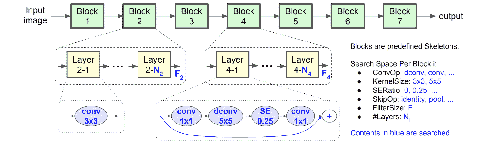

可以注意到，搜索空间由几个块组成。所有层都根据其尺寸和过滤器大小进行隔离。每个块都有一组特定的层，在这些层中可以选择操作(如蓝色所示)。如果输入或输出维度不同，则每个块中的第一层的跨度为 2，其余层的跨度为 1。从第二层开始到第 N 层重复相同的一组操作，其中 N 是块号。

*   强化搜索算法:因为我们有两个主要目标要实现——延迟和准确性，所以我们采用了一种强化学习方法，其中回报是最大化的(多目标回报)。在搜索空间中定义的每个 CNN 模型将被映射到由强化学习代理执行的一系列动作。

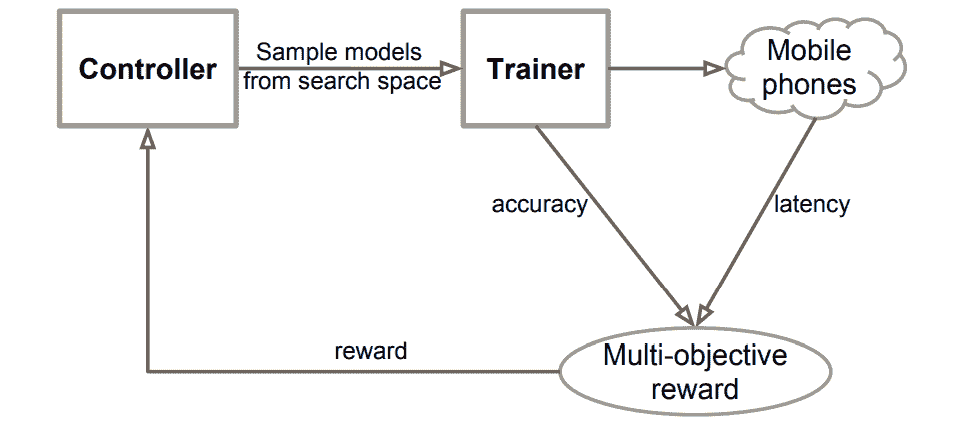

这就是搜索算法中存在的东西——控制器是递归神经网络(RNN)，训练器训练模型并输出精度。该模型被部署到移动电话上以估计延迟。准确性和等待时间被合并成一个多目标的奖励。该奖励被发送到 RNN，使用该奖励更新 RNN 的参数，以最大化总奖励。

### MnasNet 培训和结果

与其他传统的移动 CNN 模型相比，Imagenet 已被用于描述 MnasNet 模型所实现的准确性。这是一个代表相同情况的表格:

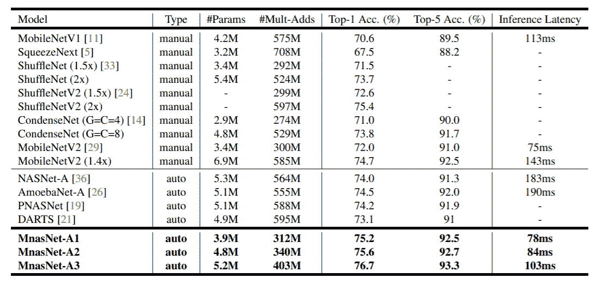

MnasNet 无疑减少了延迟，提高了准确性。

如果您想查看原始论文或在 PyTorch 中自己实现 MnasNet，请查看以下链接:

1.  [链接到原始研究论文](https://arxiv.org/pdf/1807.11626.pdf)
2.  [PyTorch 实施 MnasNet](https://pytorch.org/docs/stable/_modules/torchvision/models/mnasnet.html)

这就结束了我们的三部分系列，涵盖了定义该领域的流行深度学习架构。如果你还没有，请随意查看第一部分和第二部分的[，它们涵盖了 ResNet、Inception v3、AlexNet 等模型。我希望这个系列对你有用。](https://blog.paperspace.com/popular-deep-learning-architectures-alexnet-vgg-googlenet/)