# 流行深度学习架构回顾:ResNet、InceptionV3 和 SqueezeNet

> 原文：<https://blog.paperspace.com/popular-deep-learning-architectures-resnet-inceptionv3-squeezenet/>

之前我们看了 2012-2014 年定义领域的深度学习模型，即 [AlexNet、VGG16 和 GoogleNet](https://blog.paperspace.com/popular-deep-learning-architectures-alexnet-vgg-googlenet/) 。这一时期的特点是大型模型，长时间的培训，以及延续到生产的困难。

在本文中，我们将深入探讨这一时期(2015-2016 年)之后出现的模型。仅在这两年中就取得了巨大的进步，导致了精确度和性能的提高。具体来说，我们将了解:

*   ResNet
*   Wide ResNet
*   InceptionV3
*   斯奎泽尼

让我们开始吧。

## ResNet (2015)

由于深度神经网络的训练既耗时又容易过度拟合，微软的一个团队引入了一个残差学习框架，以改善比以前使用的网络更深的网络训练。这项研究发表在 2015 年题为 *[图像识别的深度残差学习](https://arxiv.org/abs/1512.03385)* 的论文中。就这样，著名的 ResNet(残余网络的简称)诞生了。

当训练深度网络时，深度的增加会导致精度饱和，然后迅速下降。这被称为“退化问题”这突出了并非所有的神经网络架构都同样容易优化。

ResNet 使用一种称为“残差映射”的技术来解决这个问题。残差网络明确地让这些层拟合残差映射，而不是希望每几个堆叠层直接拟合所需的底层映射。下面是剩余网络的构建模块。

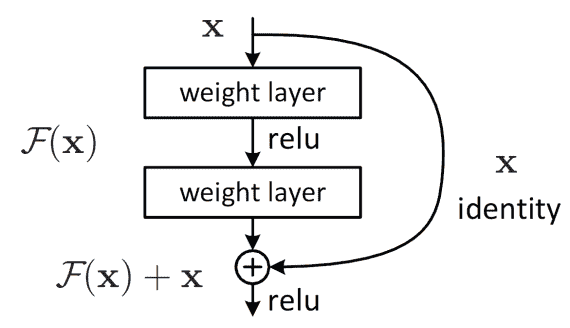

F(x)+x 的公式可以通过具有快捷连接的前馈神经网络来实现。

许多问题可以使用 ResNets 解决。当网络深度增加时，它们易于优化并实现更高的精度，产生比以前的网络更好的结果。像我们在第一部分中介绍的前辈一样，ResNet 首先在 ImageNet 的 120 多万张属于 1000 个不同类别的训练图像上进行训练和测试。

## ResNet 架构

与传统的神经网络结构相比，ResNets 相对容易理解。下图是一个 VGG 网络、一个普通的 34 层神经网络和一个 34 层残差神经网络。在平面网络中，对于相同的输出要素地图，图层具有相同数量的过滤器。如果输出特征的大小减半，则过滤器的数量加倍，使得训练过程更加复杂。

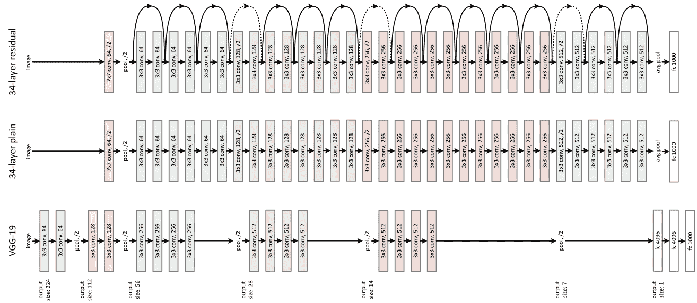

同时，在残差神经网络中，正如我们可以看到的，在关于 VGG 的训练期间，有少得多的滤波器和较低的复杂度。添加了一个快捷连接，将网络转换为其对应的剩余版本。这种快捷连接执行标识映射，并为增加的维度填充额外的零条目。该选项不引入额外的参数。投影快捷方式在数学上表示为 F(x{W}+x)，用于匹配由 1×1 卷积计算的维度。

下表显示了不同 ResNet 架构中的层和参数。

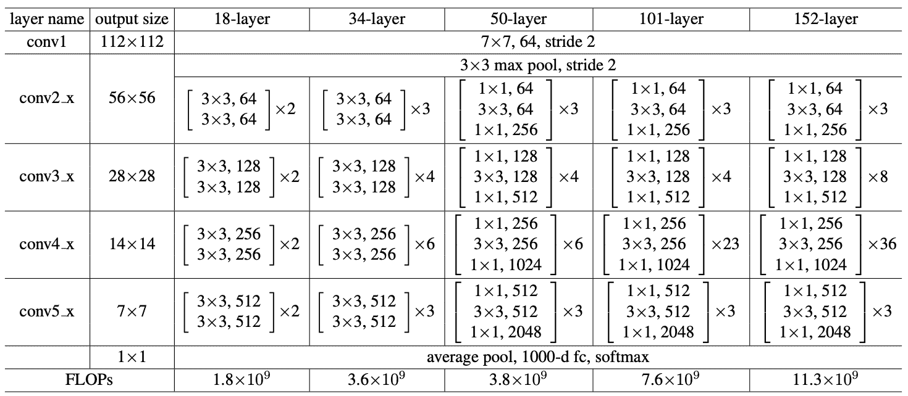

每个 ResNet 块要么是两层深(用于 ResNet 18 或 34 等小型网络)，要么是三层深(ResNet 50、101 或 152)。

### ResNet 培训和结果

来自 ImageNet 数据集的样本被重新缩放到 224 × 224，并通过每像素均值减法进行归一化。随机梯度下降用于最小批量为 256 的优化。学习率从 0.1 开始，误差增大时除以 10，模型训练到 60 × 104 次迭代。重量衰减和动量分别设定为 0.0001 和 0.9。不使用脱落层。

ResNet 在更深层次的架构中表现非常好。下图显示了两个 18 层和 34 层神经网络的错误率。左边的图显示了普通网络，而右边的图显示了它们的 ResNet 等价物。图像中细的红色曲线表示训练错误，粗的曲线表示验证错误。

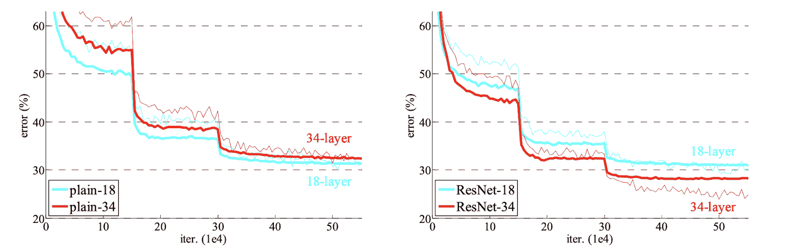

下表显示了 ImageNet 验证中最大的错误(%)，10 次裁剪测试。

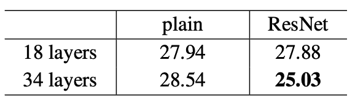

正如我们今天所知，ResNet 在定义深度学习领域方面发挥了重要作用。

如果您对自己实现 ResNet 感兴趣，下面是一些重要的链接:

1.  [PyTorch ResNet 实现](https://github.com/pytorch/vision/blob/master/torchvision/models/resnet.py)
2.  [Tensorflow ResNet 实现](https://github.com/tensorflow/models/blob/master/official/r1/resnet/resnet_model.py)
3.  [链接到原始研究论文](https://arxiv.org/pdf/1512.03385.pdf)

## Wide ResNet (2016)

宽残差网络是对原始深残差网络的更新改进。研究表明，在不影响网络性能的情况下，可以将网络做得更浅更宽，而不是依靠增加网络的深度来提高其精度。这种思想在论文 *[广残网](https://arxiv.org/abs/1605.07146)* 中提出，该论文于 2016 年发表(并由 Sergey Zagoruyko 和 Nikos Komodakis 于 2017 年更新。

深度残差网络已经显示出显著的准确性，有助于相对容易地执行图像识别等任务。尽管如此，深层网络仍然面临着网络退化以及爆炸或消失梯度的挑战。深度残余网络也不能保证所有残余块的使用；只有几个可以被跳过，或者只有几个可以进入更大的贡献块(即提取有用的信息)。这个问题可以通过禁用随机块来解决——这是广义的辍学。从这个想法得到启示，Wide ResNet 的作者已经证明了宽残差网络甚至可以比深残差网络表现得更好。

### 宽 ResNet 架构

宽 ResNet 有一组堆叠在一起的 ResNet 块，其中每个 ResNet 块都遵循 BatchNormalization-ReLU-Conv 结构。该结构描述如下:

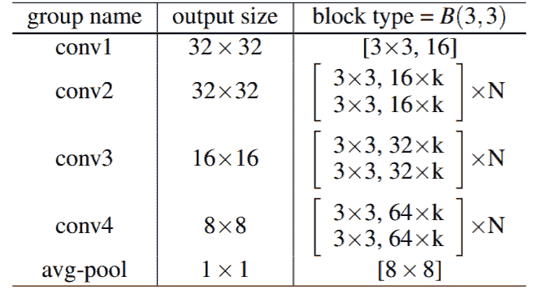

有五个组组成了一个大范围的搜索网。这里的块是指残差块 B(3，3)。Conv1 在任何网络中都保持不变，而 conv2、conv3 和 conv4 则根据 *k* 、定义宽度的值而变化。卷积层之后是平均池层和分类层。

可以调整以下可变度量，以得出残差块的各种表示:

*   **卷积类型:**上图 B(3，3)在残差块中有 3 × 3 个卷积层。也可以探索其他可能性，例如集成 3 × 3 卷积层和 1 × 1 卷积。
*   **每个块的卷积:**块的深度必须通过估计该度量对模型性能的依赖性来确定。
*   **残差块的宽度:**必须一致地检查宽度和深度，以关注计算复杂度和性能。
*   **Dropout:** 在每一个残差块的卷积之间都要增加一个 Dropout 层。这可以防止过度拟合。

### 广泛的 ResNet 培训和结果

在 [CIFAR-10](https://www.cs.toronto.edu/~kriz/cifar.html) 上训练了 Wide ResNet。以下指标导致了最低的错误率:

*   卷积类型:B(3，3)
*   每个残差块的卷积层数:2。因此，B(3，3)是首选维度(而不是 B(3，3，3)或 B(3，3，3，3)。
*   剩余块的宽度:深度为 28，宽度为 10 似乎不太容易出错。
*   辍学:当辍学被包括在内时，错误率进一步降低。比较结果如下图所示。

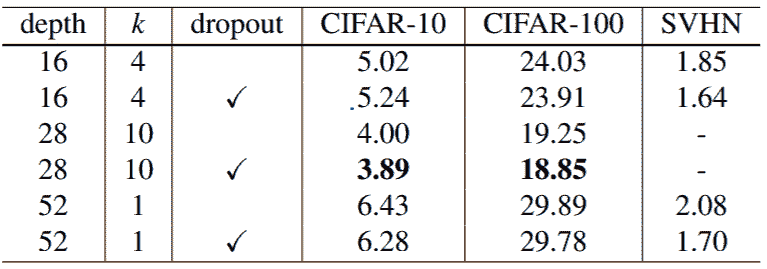

下表比较了 CIFAR-10 和 CIFAR-100 上的 Wide ResNet 与其他几个型号(包括原始 ResNet)的复杂性和性能:

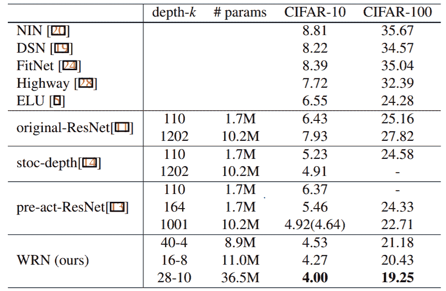

以下是几个你自己实现 Wide ResNet 的重要环节:

1.  [链接到原论文](https://arxiv.org/pdf/1605.07146.pdf)
2.  [PyTorch 实现宽 ResNet](https://pytorch.org/hub/pytorch_vision_wide_resnet/)
3.  [Tensorflow 实现宽 ResNet](https://github.com/dalgu90/wrn-tensorflow)

## 盗梦空间第三版(2015)

Inception v3 主要关注通过修改以前的 Inception 架构来消耗更少的计算能力。这个想法是在 2015 年发表的论文 *[重新思考计算机视觉](https://arxiv.org/abs/1512.00567)* 的盗梦架构中提出的。该书由克里斯蒂安·塞格迪、文森特·范霍克、谢尔盖·约菲和黄邦贤·史伦斯合著。

与 VGGNet 相比，Inception Networks(Google net/Inception v1)已证明在网络生成的参数数量和产生的经济成本(内存和其他资源)方面计算效率更高。如果要对初始网络进行任何更改，需要注意确保计算优势不会丧失。因此，由于新网络效率的不确定性，针对不同用例的初始网络的适应变成了一个问题。在 Inception v3 模型中，已经提出了几种用于优化网络的技术来放松约束，以便更容易地适应模型。这些技术包括分解卷积、正则化、降维以及并行计算。

### Inception v3 架构

Inception v3 网络的架构是逐步构建的，如下所述:

**1。因式分解卷积:**这有助于降低计算效率，因为它减少了网络中涉及的参数数量。它还保持对网络效率的检查。

**2。更小的卷积:用更小的卷积替换更大的卷积肯定会导致更快的训练。假设一个 5 × 5 的滤波器有 25 个参数；代替 5 × 5 卷积的两个 3 × 3 滤波器只有 18 (3*3 + 3*3)个参数。**

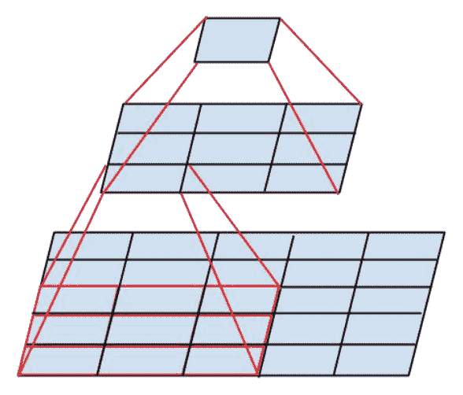

In the middle we see a 3x3 convolution, and below a fully-connected layer. Since both 3x3 convolutions can share weights among themselves, the number of computations can be reduced.

**3。不对称卷积:**一个 3 × 3 卷积可以被一个 1 × 3 卷积和一个 3 × 1 卷积代替。如果用 2 × 2 卷积代替 3 × 3 卷积，参数的数量将比提出的非对称卷积略高。

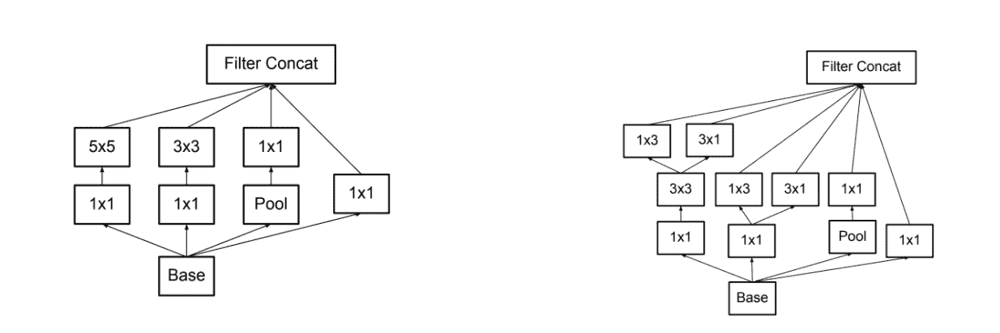

**4。辅助分类器:**辅助分类器是训练时插在层间的小 CNN，产生的损耗加到主网损耗上。在 GoogLeNet 中，辅助分类器用于更深的网络，而在 Inception v3 中，辅助分类器充当正则化器。

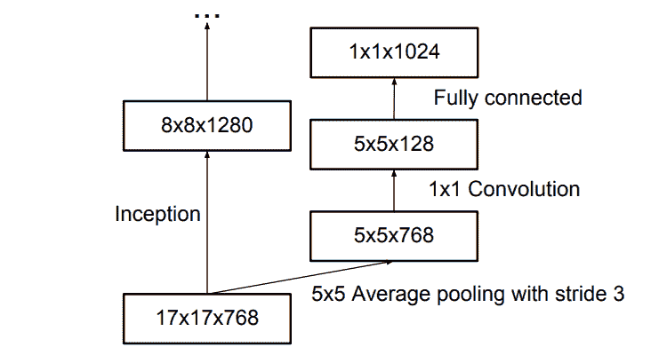

**5。网格尺寸缩减:**网格尺寸缩减通常通过池化操作来完成。然而，为了克服计算成本的瓶颈，提出了一种更有效的技术:

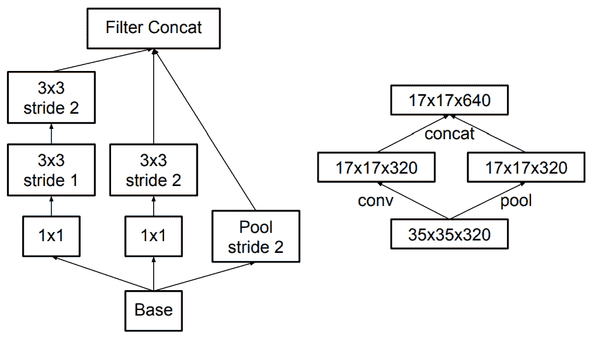

上述所有概念都被整合到最终的架构中。

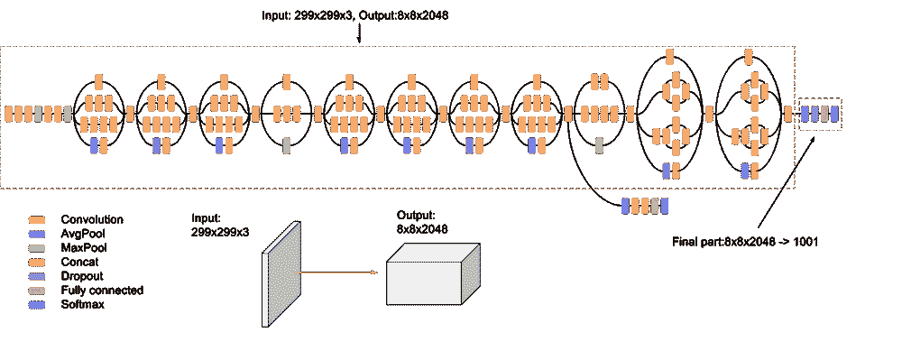

### Inception v3 培训和结果

Inception v3 在 ImageNet 上进行了训练，并与其他当代模型进行了比较，如下所示。

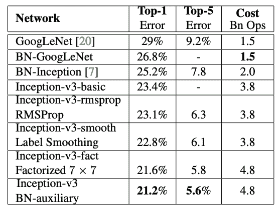

如表中所示，当使用辅助分类器、卷积因子分解、RMSProp 和标签平滑进行增强时，Inception v3 可以实现与其同时代产品相比最低的错误率。

如果你想自己实现 Inception v3，下面是一些相关的链接:

1.  [链接到原始研究论文](https://www.cv-foundation.org/openaccess/content_cvpr_2016/papers/Szegedy_Rethinking_the_Inception_CVPR_2016_paper.pdf)
2.  [TensorFlow 实现 Inception v3](https://github.com/tensorflow/models/tree/master/research/inception)
3.  [PyTorch 实施 Inception v3](https://pytorch.org/hub/pytorch_vision_inception_v3/)

## squeeze et(2016 年)

SqueezeNet 是一个较小的网络，被设计为 AlexNet 的更紧凑的替代品。它的参数比 AlexNet 少了近 50 倍，但执行速度却快了 3 倍。这个架构是由 DeepScale、加州大学伯克利分校和斯坦福大学的研究人员在 2016 年提出的。它最早发表在他们题为 *[SqueezeNet: AlexNet 级别的精度，参数少 50 倍，< 0.5MB 模型大小](https://arxiv.org/abs/1602.07360)* 的论文中。

以下是 SqueezeNet 背后的关键理念:

*   **策略一:**用 1 × 1 的滤镜代替 3 × 3 的滤镜
*   **策略二:**将输入通道的数量减少到 3 × 3 个滤波器
*   **策略三:**在网络后期向下采样，以便卷积层具有大的激活图

### SqueezeNet 架构和结果

SqueezeNet 架构由“挤压”和“扩展”层组成。一个压缩卷积层只有 1 × 1 个滤波器。这些信号被送入一个扩展层，该层混合了 1 × 1 和 3 × 3 卷积滤波器。如下所示。

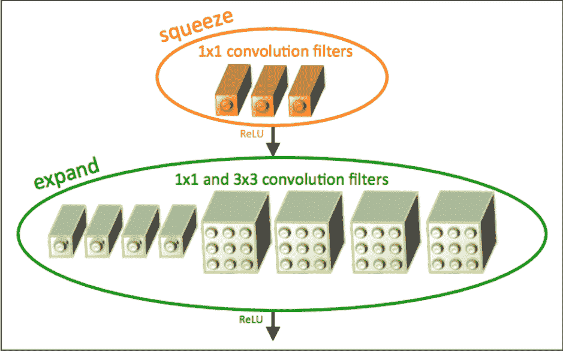

*A "Fire Module"*

本文作者使用术语“火灾模块”来描述挤压层和膨胀层。

输入图像首先被发送到独立的卷积层。根据上面的策略一，这一层之后是 8 个“消防模块”，它们被命名为“消防 2-9”。下图显示了生成的挤压网。

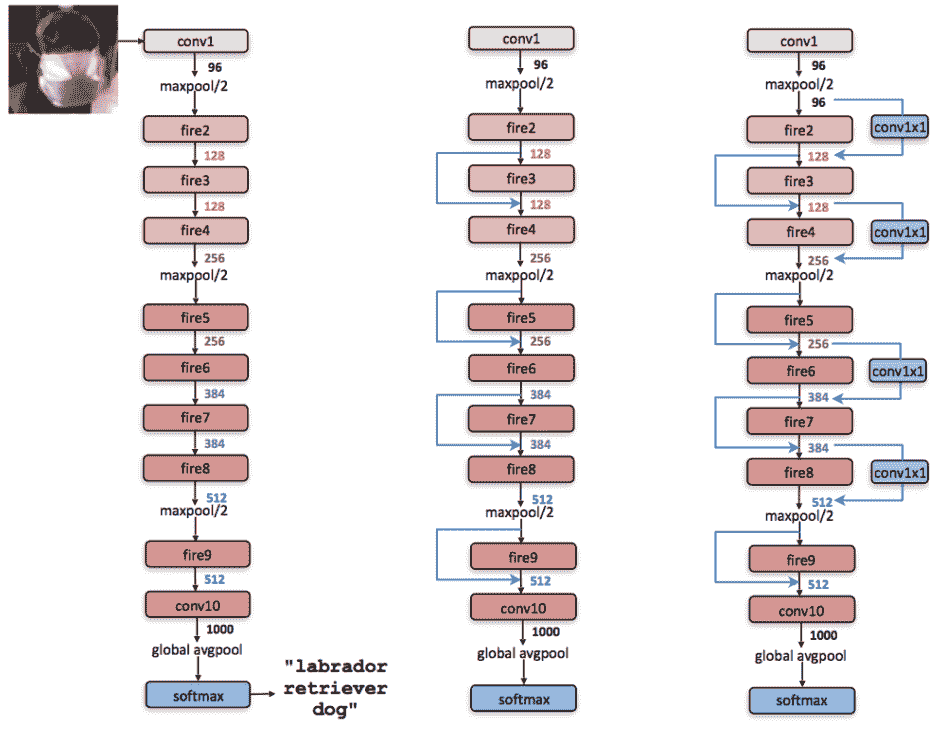

From left to right: SqueezeNet, SqueezeNet with simple bypass, and SqueezeNet with complex bypass

按照策略二，每个火灾模块的过滤器通过“简单旁路”增加最后，SqueezeNet 在层 conv1、fire4、fire8 和 conv10 之后以 2 的步长执行最大池化。根据策略三，池被给予相对较晚的位置，导致 SqueezeNet 具有“复杂旁路”(上图中最右边的架构)

下图显示了 SqueezeNet 与原版 AlexNet 的对比。

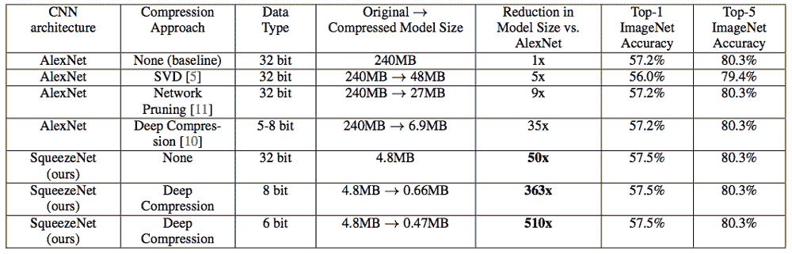

正如我们所观察到的，AlexNet 的压缩模型的权重是 240MB，并且达到了 80.3%的准确率。同时，深度压缩 SqueezeNet 消耗 0.47MB 的内存并实现相同的性能。

以下是网络中使用的其他参数的详细信息:

*   ReLU 激活应用于 fire 模块内部的所有挤压和扩展层之间。
*   在 fire9 模块之后，添加了 Dropout 层以减少过度拟合，概率为 0.5。
*   网络中没有使用完全连接的层。这一设计选择的灵感来自于(林等，2013)提出的网络(NIN) 架构中的[网络。](https://arxiv.org/abs/1312.4400)
*   以 0.04 的学习率训练 SqueezeNet，该学习率在整个训练过程中线性下降。
*   训练的批量大小是 32，并且网络使用了 Adam 优化器。

SqueezeNet 由于体积小，使得部署过程更加容易。最初，这个网络是在 Caffe 中实现的，但这个模型后来越来越流行，并被许多不同的平台采用。

下面是几个相关的链接，可以让你自己实现 SqueezeNet，或者进一步研究最初的实现:

1.  [链接到 SqueezeNet 的原始实现](https://github.com/forresti/SqueezeNet)
2.  [链接到研究论文](https://arxiv.org/pdf/1602.07360.pdf)
3.  [在 tensorlow](https://github.com/vonclites/squeezenet)中的 squeezenet
4.  [pytorch 中的 squeezenet】](https://github.com/pytorch/vision/blob/master/torchvision/models/squeezenet.py)

* * *

在本系列的第三和最后部分，我们将涵盖 2017 年至 2019 年最新发布的模型:DenseNet、ResNeXt、MnasNet 和 ShuffleNet v2。