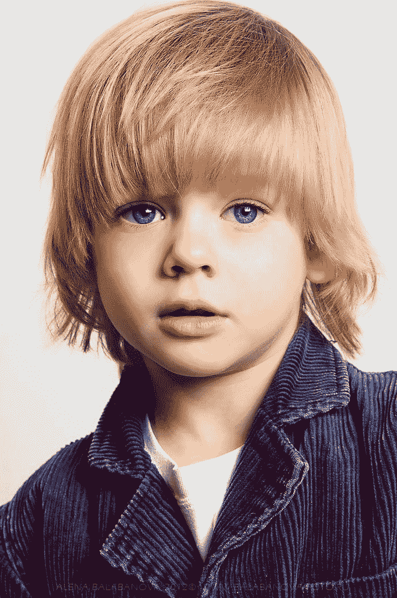
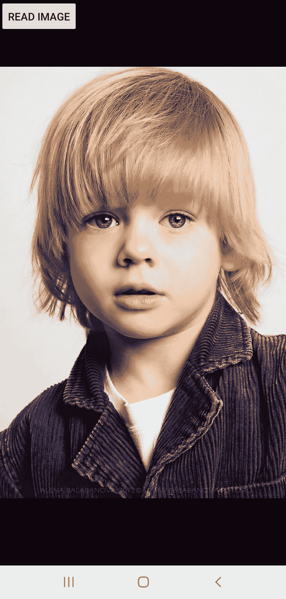
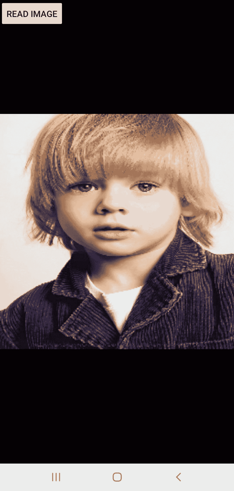
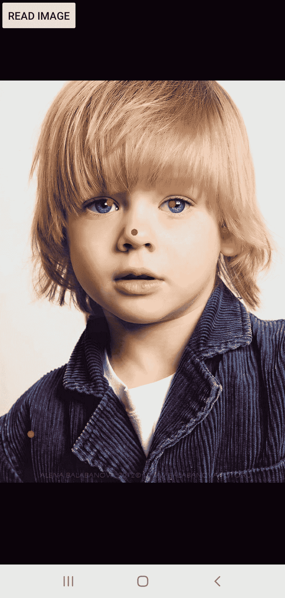
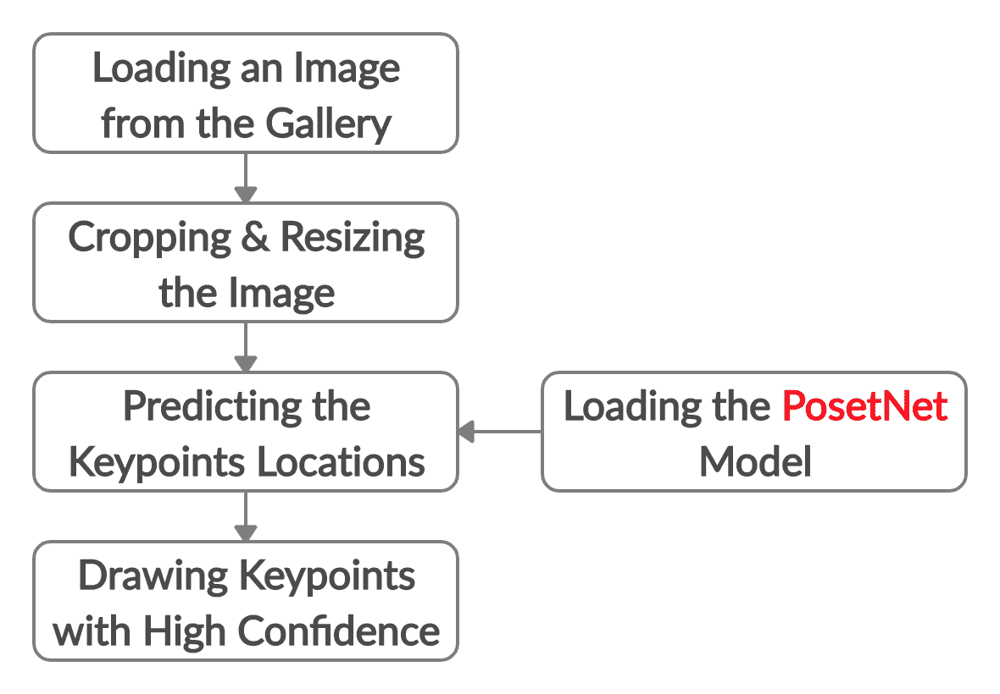

# 用 postnet 构建一个眼睛过滤器的应用程序

> 原文：<https://blog.paperspace.com/posenet-keypoint-detection-android-app/>

姿态估计是用于检测物体姿态(即方向和位置)的计算机视觉任务。它通过检测一些关键点来工作，这样我们就可以了解物体的主要部分，并估计其当前的方向。基于这样的关键点，我们将能够在 2D 或 3D 中形成物体的形状。

本教程介绍了如何构建一个 Android 应用程序，使用预训练的 TFLite PoseNet 模型来估计独立 RGB 图像中的人体姿势。该模型预测了人体 17 个关键点的位置，包括眼睛、鼻子、肩膀等的位置。通过估计关键点的位置，我们将在第二个教程中看到如何使用该应用程序来制作特殊效果和滤镜，就像你在 Snapchat 上看到的那样。

本教程的大纲如下:

*   基本 Android 工作室项目
*   加载图库图像
*   裁剪和缩放图像
*   利用 PoseNet 估计人体姿态
*   获取关于关键点的信息
*   `PosenetActivity.kt`的完整代码

让我们开始吧。

## **Base Android Studio 项目**

我们将使用[tensor flow Lite pose net Android 演示](https://github.com/tensorflow/examples/tree/master/lite/examples/posenet/android)作为节省时间的起点。我们先来讨论一下这个项目是如何运作的。然后我们会根据自己的需要进行编辑。

该项目使用预训练的 PoseNet 模型，这是 MobileNet 的转换版本。PoseNet 模型可在[此链接](https://storage.googleapis.com/download.tensorflow.org/models/tflite/posenet_mobilenet_v1_100_257x257_multi_kpt_stripped.tflite)下载。该模型接受大小为`(257, 257)`的图像，并返回以下 17 个关键点的位置:

1.  鼻子
2.  左眼，左眼
3.  正确地
4.  左耳
5.  战士
6.  左肩膀
7.  右肩
8.  左肘
9.  右肘
10.  左手腕
11.  右手腕
12.  左臀
13.  权利
14.  左膝
15.  右膝盖
16.  左脚踝
17.  右脚踝

对于每个关键点，都有一个表示置信度的相关值，范围从 0.0。到 1.0。因此，该模型返回两个列表:一个表示关键点位置，另一个包含每个关键点的置信度。由您设置置信度阈值，将候选关键点分类为接受或拒绝。通常，当阈值为 0.5 或更高时，就做出了好的决定。

该项目是用 Kotlin 编程语言实现的，并访问 Android 摄像头来捕捉图像。对于每个捕捉的图像，该模型预测关键点的位置，并显示这些关键点重叠的图像。

在本教程中，我们将尽可能地简化这个项目。首先，该项目将被编辑，以处理从图库中选择的单个图像，而不是用相机拍摄的图像。一旦我们有了单幅图像的结果，我们将在眼睛上添加一个遮罩，这是 Snapchat 等图像编辑应用程序中的一个已知效果。

下一节讨论从项目中移除不必要的代码。

### 删除不必要的代码

该项目被配置为处理从摄像机捕获的图像，这不是我们当前的目标。因此，任何与访问或捕捉图像相关的内容都应该删除。有三个文件需要编辑:

*   `PosetnetActivity.kt`活动文件。
*   `activity_posenet.xml`布局`PosetnetActivity.kt`活动的资源文件。
*   `AndroidManifest.xml`

从`PosenetActivity.kt`文件开始，下面是要删除的代码行列表:

*   `CameraDevice.StateCallback()` 161:179
*   `CameraCaptureSession.CaptureCallback()` 184:198
*   `onViewCreated()` 216:219
*   `onResume()` 221:224
*   `onPause()` 232:236
*   `requestCameraPermission()` 243:249
*   `openCamera()` 327:345
*   `closeCamera()` 350:368
*   `startBackgroundThread()` 373:376
*   `stopBackgroundThread()` 381:390
*   `fillBytes()` 393:404
*   `OnImageAvailableListener` 407:451
*   `createCameraPreviewSession()` 598:655
*   `setAutoFlash()` 657:664

由于删除了前面的代码，因此不再需要以下变量:

*   `PREVIEW_WIDTH` : 97
*   `PREVIEW_HEIGHT` : 98
*   从第 104 行到第 158 行定义的所有变量:`cameraId`、`surfaceView`、`captureSession`、`cameraDevice`、`previewSize`、`previewWidth`等等。

完成前面的更改后，也不再需要这三行代码:

*   第 228 行`onStart()`里面的方法:`openCamera()`
*   第 578 行`draw()`方法:`surfaceHolder!!.unlockCanvasAndPost(canvas)`

下面是做出这些改变后的`PosenetActivity.kt`的当前形式。

```py
package org.tensorflow.lite.examples.posenet

import android.Manifest
import android.app.AlertDialog
import android.app.Dialog
import android.content.pm.PackageManager
import android.graphics.Bitmap
import android.graphics.Canvas
import android.graphics.Color
import android.graphics.Paint
import android.graphics.PorterDuff
import android.graphics.Rect
import android.os.Bundle
import android.support.v4.app.ActivityCompat
import android.support.v4.app.DialogFragment
import android.support.v4.app.Fragment
import android.util.Log
import android.util.SparseIntArray
import android.view.LayoutInflater
import android.view.Surface
import android.view.View
import android.view.ViewGroup
import android.widget.Toast
import kotlin.math.abs
import org.tensorflow.lite.examples.posenet.lib.BodyPart
import org.tensorflow.lite.examples.posenet.lib.Person
import org.tensorflow.lite.examples.posenet.lib.Posenet

class PosenetActivity :
  Fragment(),
  ActivityCompat.OnRequestPermissionsResultCallback {

  /** List of body joints that should be connected.    */
  private val bodyJoints = listOf(
    Pair(BodyPart.LEFT_WRIST, BodyPart.LEFT_ELBOW),
    Pair(BodyPart.LEFT_ELBOW, BodyPart.LEFT_SHOULDER),
    Pair(BodyPart.LEFT_SHOULDER, BodyPart.RIGHT_SHOULDER),
    Pair(BodyPart.RIGHT_SHOULDER, BodyPart.RIGHT_ELBOW),
    Pair(BodyPart.RIGHT_ELBOW, BodyPart.RIGHT_WRIST),
    Pair(BodyPart.LEFT_SHOULDER, BodyPart.LEFT_HIP),
    Pair(BodyPart.LEFT_HIP, BodyPart.RIGHT_HIP),
    Pair(BodyPart.RIGHT_HIP, BodyPart.RIGHT_SHOULDER),
    Pair(BodyPart.LEFT_HIP, BodyPart.LEFT_KNEE),
    Pair(BodyPart.LEFT_KNEE, BodyPart.LEFT_ANKLE),
    Pair(BodyPart.RIGHT_HIP, BodyPart.RIGHT_KNEE),
    Pair(BodyPart.RIGHT_KNEE, BodyPart.RIGHT_ANKLE)
  )

  /** Threshold for confidence score. */
  private val minConfidence = 0.5

  /** Radius of circle used to draw keypoints.  */
  private val circleRadius = 8.0f

  /** Paint class holds the style and color information to draw geometries,text and bitmaps. */
  private var paint = Paint()

  /** An object for the Posenet library.    */
  private lateinit var posenet: Posenet

  /**
   * Shows a [Toast] on the UI thread.
   *
   * @param text The message to show
   */
  private fun showToast(text: String) {
    val activity = activity
    activity?.runOnUiThread { Toast.makeText(activity, text, Toast.LENGTH_SHORT).show() }
  }

  override fun onCreateView(
    inflater: LayoutInflater,
    container: ViewGroup?,
    savedInstanceState: Bundle?
  ): View? = inflater.inflate(R.layout.activity_posenet, container, false)

  override fun onStart() {
    super.onStart()
    posenet = Posenet(this.context!!)
  }

  override fun onDestroy() {
    super.onDestroy()
    posenet.close()
  }

  override fun onRequestPermissionsResult(
    requestCode: Int,
    permissions: Array<String>,
    grantResults: IntArray
  ) {
    if (requestCode == REQUEST_CAMERA_PERMISSION) {
      if (allPermissionsGranted(grantResults)) {
        ErrorDialog.newInstance(getString(R.string.request_permission))
          .show(childFragmentManager, FRAGMENT_DIALOG)
      }
    } else {
      super.onRequestPermissionsResult(requestCode, permissions, grantResults)
    }
  }

  private fun allPermissionsGranted(grantResults: IntArray) = grantResults.all {
    it == PackageManager.PERMISSION_GRANTED
  }

  /** Crop Bitmap to maintain aspect ratio of model input.   */
  private fun cropBitmap(bitmap: Bitmap): Bitmap {
    val bitmapRatio = bitmap.height.toFloat() / bitmap.width
    val modelInputRatio = MODEL_HEIGHT.toFloat() / MODEL_WIDTH
    var croppedBitmap = bitmap

    // Acceptable difference between the modelInputRatio and bitmapRatio to skip cropping.
    val maxDifference = 1e-5

    // Checks if the bitmap has similar aspect ratio as the required model input.
    when {
      abs(modelInputRatio - bitmapRatio) < maxDifference -> return croppedBitmap
      modelInputRatio < bitmapRatio -> {
        // New image is taller so we are height constrained.
        val cropHeight = bitmap.height - (bitmap.width.toFloat() / modelInputRatio)
        croppedBitmap = Bitmap.createBitmap(
          bitmap,
          0,
          (cropHeight / 2).toInt(),
          bitmap.width,
          (bitmap.height - cropHeight).toInt()
        )
      }
      else -> {
        val cropWidth = bitmap.width - (bitmap.height.toFloat() * modelInputRatio)
        croppedBitmap = Bitmap.createBitmap(
          bitmap,
          (cropWidth / 2).toInt(),
          0,
          (bitmap.width - cropWidth).toInt(),
          bitmap.height
        )
      }
    }
    return croppedBitmap
  }

  /** Set the paint color and size.    */
  private fun setPaint() {
    paint.color = Color.RED
    paint.textSize = 80.0f
    paint.strokeWidth = 8.0f
  }

  /** Draw bitmap on Canvas.   */
  private fun draw(canvas: Canvas, person: Person, bitmap: Bitmap) {
    canvas.drawColor(Color.TRANSPARENT, PorterDuff.Mode.CLEAR)
    // Draw `bitmap` and `person` in square canvas.
    val screenWidth: Int
    val screenHeight: Int
    val left: Int
    val right: Int
    val top: Int
    val bottom: Int
    if (canvas.height > canvas.width) {
      screenWidth = canvas.width
      screenHeight = canvas.width
      left = 0
      top = (canvas.height - canvas.width) / 2
    } else {
      screenWidth = canvas.height
      screenHeight = canvas.height
      left = (canvas.width - canvas.height) / 2
      top = 0
    }
    right = left + screenWidth
    bottom = top + screenHeight

    setPaint()
    canvas.drawBitmap(
      bitmap,
      Rect(0, 0, bitmap.width, bitmap.height),
      Rect(left, top, right, bottom),
      paint
    )

    val widthRatio = screenWidth.toFloat() / MODEL_WIDTH
    val heightRatio = screenHeight.toFloat() / MODEL_HEIGHT

    // Draw key points over the image.
    for (keyPoint in person.keyPoints) {
      Log.d("KEYPOINT", "" + keyPoint.bodyPart + " : (" + keyPoint.position.x.toFloat().toString() + ", " + keyPoint.position.x.toFloat().toString() + ")");
      if (keyPoint.score > minConfidence) {
        val position = keyPoint.position
        val adjustedX: Float = position.x.toFloat() * widthRatio + left
        val adjustedY: Float = position.y.toFloat() * heightRatio + top
        canvas.drawCircle(adjustedX, adjustedY, circleRadius, paint)
      }
    }

    for (line in bodyJoints) {
      if (
        (person.keyPoints[line.first.ordinal].score > minConfidence) and
        (person.keyPoints[line.second.ordinal].score > minConfidence)
      ) {
        canvas.drawLine(
          person.keyPoints[line.first.ordinal].position.x.toFloat() * widthRatio + left,
          person.keyPoints[line.first.ordinal].position.y.toFloat() * heightRatio + top,
          person.keyPoints[line.second.ordinal].position.x.toFloat() * widthRatio + left,
          person.keyPoints[line.second.ordinal].position.y.toFloat() * heightRatio + top,
          paint
        )
      }
    }

    canvas.drawText(
      "Score: %.2f".format(person.score),
      (15.0f * widthRatio),
      (30.0f * heightRatio + bottom),
      paint
    )
    canvas.drawText(
      "Device: %s".format(posenet.device),
      (15.0f * widthRatio),
      (50.0f * heightRatio + bottom),
      paint
    )
    canvas.drawText(
      "Time: %.2f ms".format(posenet.lastInferenceTimeNanos * 1.0f / 1_000_000),
      (15.0f * widthRatio),
      (70.0f * heightRatio + bottom),
      paint
    )
  }

  /** Process image using Posenet library.   */
  private fun processImage(bitmap: Bitmap) {
    // Crop bitmap.
    val croppedBitmap = cropBitmap(bitmap)

    // Created scaled version of bitmap for model input.
    val scaledBitmap = Bitmap.createScaledBitmap(croppedBitmap, MODEL_WIDTH, MODEL_HEIGHT, true)

    // Perform inference.
    val person = posenet.estimateSinglePose(scaledBitmap)
    val canvas: Canvas = surfaceHolder!!.lockCanvas()
    draw(canvas, person, scaledBitmap)
  }

  /**
   * Shows an error message dialog.
   */
  class ErrorDialog : DialogFragment() {

    override fun onCreateDialog(savedInstanceState: Bundle?): Dialog =
      AlertDialog.Builder(activity)
        .setMessage(arguments!!.getString(ARG_MESSAGE))
        .setPositiveButton(android.R.string.ok) { _, _ -> activity!!.finish() }
        .create()

    companion object {

      @JvmStatic
      private val ARG_MESSAGE = "message"

      @JvmStatic
      fun newInstance(message: String): ErrorDialog = ErrorDialog().apply {
        arguments = Bundle().apply { putString(ARG_MESSAGE, message) }
      }
    }
  }

  companion object {
    /**
     * Conversion from screen rotation to JPEG orientation.
     */
    private val ORIENTATIONS = SparseIntArray()
    private val FRAGMENT_DIALOG = "dialog"

    init {
      ORIENTATIONS.append(Surface.ROTATION_0, 90)
      ORIENTATIONS.append(Surface.ROTATION_90, 0)
      ORIENTATIONS.append(Surface.ROTATION_180, 270)
      ORIENTATIONS.append(Surface.ROTATION_270, 180)
    }

    /**
     * Tag for the [Log].
     */
    private const val TAG = "PosenetActivity"
  }
}
```

文件`activity_posenet.xml`中的所有元素也应该被删除，因为不再需要它们了。因此，该文件应该如下所示:

```py
<?xml version="1.0" encoding="utf-8"?>
<RelativeLayout xmlns:android="http://schemas.android.com/apk/res/android"
    android:layout_width="match_parent"
    android:layout_height="match_parent">

</RelativeLayout>
```

对于`AndroidManifest.xml`文件，因为我们不再访问摄像机，所以应删除以下 3 行:

```py
<uses-permission android:name="android.permission.CAMERA" />
<uses-feature android:name="android.hardware.camera" />
<uses-feature android:name="android.hardware.camera.autofocus" />
```

从三个文件`PosenetActivity.kt`、`activity_posenet.xml`和`AndroidManifest.xml`中删除所有不必要的代码后，我们仍然需要做一些修改来处理单个图像。下一节讨论编辑`activity_posenet.xml`文件，以便能够加载和显示图像。

### 编辑活动布局

下面列出了活动布局文件的内容。它只有两个元素:`Button`和`ImageView`。该按钮将用于在单击后加载图像。它被赋予一个 ID`selectImage`,以便在活动内部访问。

`ImageView`将有两个用途。第一个是显示选中的图像。第二个是显示应用眼睛过滤器后的结果。`ImageView`被赋予 ID `imageView`,以便从活动中访问。

```py
<?xml version="1.0" encoding="utf-8"?>
<RelativeLayout xmlns:android="http://schemas.android.com/apk/res/android"
    android:layout_width="match_parent"
    android:layout_height="match_parent">

    

    <ImageView
        android:id="@+id/imageView"
        android:layout_width="match_parent"
        android:layout_height="match_parent" />

</RelativeLayout>
```

下图显示了活动布局的样子。


在实现按钮 click listener 之前，有必要在`AndroidManifest.xml`文件中添加下一行来请求访问外部存储器的许可。

```py
<uses-permission android:name="android.permission.READ_EXTERNAL_STORAGE"/>
```

下一节将讨论如何实现按钮点击监听器来从图库中加载图像。

## **加载图库图像**

下面给出了`onStart()`回调方法的当前实现。如果您还没有这样做，请删除对`openCamera()`方法的调用，因为不再需要它了。`onStart()`方法只是创建了一个`PoseNet`类的实例，这样以后就可以用它来预测关键点的位置。变量`posenet`保存创建的实例，稍后将在`processImage()`方法中使用。

```py
override fun onStart() {
  super.onStart()
  posenet = Posenet(this.context!!)
}
```

在`onStart()`方法中，我们可以将一个点击监听器绑定到`selectImage`按钮。下面是这种方法的新实现。使用`Intent`，画廊将被打开，要求用户选择一个图像。调用`startActivityForResult()`方法，请求代码存储在设置为`100`的`REQUEST_CODE`变量中。

```py
override fun onStart() {
    super.onStart()

    posenet = Posenet(this.context!!)

    selectImage.setOnClickListener(View.OnClickListener {
        val intent = Intent(Intent.ACTION_PICK)
        intent.type = "image/jpg"
        startActivityForResult(intent, REQUEST_CODE)
    })
}
```

一旦用户返回到应用程序，就会调用`onActivityResult()`回调方法。下面是它的实现。使用一个`if`语句，检查结果以确保图像被成功选择。如果结果不成功(例如，用户没有选择图像)，则显示 toast 消息。

```py
override fun onActivityResult(requestCode: Int, resultCode: Int, data: Intent?) {
    if (resultCode == Activity.RESULT_OK && requestCode == REQUEST_CODE) {
        imageView.setImageURI(data?.data)

        val imageUri = data?.getData()
        val bitmap = MediaStore.Images.Media.getBitmap(context?.contentResolver, imageUri)

        processImage(bitmap)

    } else {
        Toast.makeText(context, "No image is selected.", Toast.LENGTH_LONG).show()
    }
}
```

如果结果成功，则使用`setImageURI()`方法在`ImageView`上显示所选图像。

为了能够处理选定的图像，它需要作为一个`Bitmap`可用。因此，图像根据其 URI 被读取为位图。首先使用`getData()`方法返回 URI，然后使用`getBitmap()`方法返回位图。位图可用后，调用`processImage()`方法准备图像并估计人体姿态。这将在接下来的两节中讨论。

下面显示了将在整个教程中使用的图像。



Image source: [Fashion Kids](http://www.fkids.ru/profiles/7985.html). [Here](http://static.fkids.ru/photo/2012/02/7985/Ilja-Belskii4140704.jpg) is the direct image URL.

从图库中选择这样的图像后，它将显示在`ImageView`上，如下图所示。



在图像作为位图加载之后，在估计人体姿态之前，需要两个额外的步骤:裁剪和缩放图像。我们现在将讨论这些。

## **裁剪和缩放图像**

本节介绍在应用 PoseNet 模型之前准备映像。

在项目内部有一个名为`processImage()`的方法，它调用必要的方法来完成四个重要任务:

1.  通过调用`cropBitmap()`方法裁剪图像。
2.  通过调用`Bitmap.createScaledBitmap()`方法缩放图像。
3.  通过调用`estimateSinglePose()`方法估计姿态。
4.  通过调用`draw()`方法在图像上绘制关键点。

下面列出了`processImage()`方法的实现。在这一节中，我们将关注前两个任务，裁剪和缩放图像。

```py
private fun processImage(bitmap: Bitmap) {
  // Crop bitmap.
  val croppedBitmap = cropBitmap(bitmap)

  // Created scaled version of bitmap for model input.
  val scaledBitmap = Bitmap.createScaledBitmap(croppedBitmap, MODEL_WIDTH, MODEL_HEIGHT, true)

  // Perform inference.
  val person = posenet.estimateSinglePose(scaledBitmap)

  // Draw keypoints over the image.
  val canvas: Canvas = surfaceHolder!!.lockCanvas()
  draw(canvas, person, scaledBitmap)
}
```

为什么我们需要裁剪或缩放图像？是否需要同时应用裁剪和缩放操作，或者只应用一种操作就足够了？大家讨论一下。

PoseNet 模型接受大小为`(257, 257)`的图像。在`Constants.kt`文件中定义了两个变量`MODEL_WIDTH`和`MODEL_HEIGHT`，分别代表模型输入的宽度和高度。两者都被设定为`257`。

如果一个图像要传递给`PoseNet`模型，那么它的大小必须是`(257, 257)`。否则，将引发异常。例如，如果从图库中读取的图像大小为`(547, 783)`，那么必须将其调整到模型输入的大小`(257, 257)`。

基于此，似乎只需要`scale`(即调整大小)操作就可以将图像转换为所需的大小。`Bitmap.createScaledBitmap()`方法接受输入位图、所需的宽度和高度，并返回所需大小的新位图。那么，为什么还要应用裁剪操作呢？答案是**保留模型的长宽比**。否则我们很容易出现图像质量问题。下图显示了应用裁剪和调整大小操作后的结果。



由于裁剪图像，图像顶部的一些行会丢失。只要人体出现在图像的中心，这就不是问题。您可以检查`cropBitmap()`方法的实现是如何工作的。

在讨论了`processImage()`方法的前两个任务的目的之后，现在让我们讨论剩下的两个:姿态估计和关键点绘制。

## **使用 PoseNet 估计人体姿态**

要估计所选图像的人体姿态，您需要做的就是调用`estimateSinglePose()`方法，如下所示。该方法接受缩放后的图像作为输入，并在保存模型预测的`person`变量中返回一个对象。

```py
val person = posenet.estimateSinglePose(scaledBitmap)
```

基于模型预测，关键点将被绘制在图像上。为了能够在图像上绘制，必须首先创建一个画布。下面的代码行(在`processImage()`方法中)使用了`surfaceHolder`来绘制画布，但是我们将删除它:

```py
val canvas: Canvas = surfaceHolder!!.lockCanvas()
```

用这个替换它:

```py
val canvas = Canvas(scaledBitmap)
```

现在我们准备调用`draw()`方法在图像上绘制关键点。不要忘记从`draw()`方法的末尾删除这一行:`surfaceHolder!!.unlockCanvasAndPost(canvas)`。

```py
draw(canvas, person, scaledBitmap)
```

既然我们已经讨论了`processImage()`方法中的所有方法调用，下面是它的实现。

```py
private fun processImage(bitmap: Bitmap) {
  // Crop bitmap.
  val croppedBitmap = cropBitmap(bitmap)

  // Created scaled version of bitmap for model input.
  val scaledBitmap = Bitmap.createScaledBitmap(croppedBitmap, MODEL_WIDTH, MODEL_HEIGHT, true)

  // Perform inference.
  val person = posenet.estimateSinglePose(scaledBitmap)

  // Draw keypoints over the image.
  val canvas = Canvas(scaledBitmap)
  draw(canvas, person, scaledBitmap)
}
```

下图显示了在画出模型确信的关键点后的结果。这些点被画成圆圈。这是来自`draw()`方法的代码部分，负责在图像上画圆。您可以编辑变量`circleRadius`的值来增加或减小圆的大小。

```py
if (keyPoint.score > minConfidence) {
    val position = keyPoint.position
    val adjustedX: Float = position.x.toFloat() * widthRatio
    val adjustedY: Float = position.y.toFloat() * heightRatio
    canvas.drawCircle(adjustedX, adjustedY, circleRadius, paint)
}
```



请注意，所绘制的关键点的置信度大于设置为`0.5`的`minConfidence`变量中指定的值。你可以把它改成最适合你的。

下一节将展示如何打印一些关于关键点的信息。

## **获取关于关键点的信息**

从`estimateSinglePose()`方法返回的对象`person`保存了一些关于检测到的关键点的信息。这些信息包括:

1.  位置
2.  信心
3.  关键点表示的身体部位

接下来的代码创建了一个`for`循环，用于遍历所有的关键点，并在日志消息中打印每个关键点的前三个属性。

```py
for (keyPoint in person.keyPoints) {
    Log.d("KEYPOINT", "Body Part : " + keyPoint.bodyPart + ", Keypoint Location : (" + keyPoint.position.x.toFloat().toString() + ", " + keyPoint.position.y.toFloat().toString() + "), Confidence" + keyPoint.score);
}
```

下面是运行循环的结果。请注意，`LEFT_EYE`、`RIGHT_EYE`、`RIGHT_SHOULDER`等身体部位的置信度大于`0.5`，这也是它们被绘制在图像上的原因。

```py
D/KEYPOINT: Body Part : NOSE, Keypoint Location : (121.0, 97.0), Confidence : 0.999602
D/KEYPOINT: Body Part : LEFT_EYE, Keypoint Location : (155.0, 79.0), Confidence : 0.996097
D/KEYPOINT: Body Part : RIGHT_EYE, Keypoint Location : (99.0, 78.0), Confidence : 0.9952989
D/KEYPOINT: Body Part : LEFT_EAR, Keypoint Location : (202.0, 96.0), Confidence : 0.9312741
D/KEYPOINT: Body Part : RIGHT_EAR, Keypoint Location : (65.0, 105.0), Confidence : 0.3558412
D/KEYPOINT: Body Part : LEFT_SHOULDER, Keypoint Location : (240.0, 208.0), Confidence : 0.18282844
D/KEYPOINT: Body Part : RIGHT_SHOULDER, Keypoint Location : (28.0, 226.0), Confidence : 0.8710659
D/KEYPOINT: Body Part : LEFT_ELBOW, Keypoint Location : (155.0, 160.0), Confidence : 0.008276528
D/KEYPOINT: Body Part : RIGHT_ELBOW, Keypoint Location : (-22.0, 266.0), Confidence : 0.009810507
D/KEYPOINT: Body Part : LEFT_WRIST, Keypoint Location : (196.0, 161.0), Confidence : 0.012271293
D/KEYPOINT: Body Part : RIGHT_WRIST, Keypoint Location : (-7.0, 228.0), Confidence : 0.0037742765
D/KEYPOINT: Body Part : LEFT_HIP, Keypoint Location : (154.0, 101.0), Confidence : 0.0043469984
D/KEYPOINT: Body Part : RIGHT_HIP, Keypoint Location : (255.0, 259.0), Confidence : 0.0035778792
D/KEYPOINT: Body Part : LEFT_KNEE, Keypoint Location : (157.0, 97.0), Confidence : 0.0024392735
D/KEYPOINT: Body Part : RIGHT_KNEE, Keypoint Location : (127.0, 94.0), Confidence : 0.003601794
D/KEYPOINT: Body Part : LEFT_ANKLE, Keypoint Location : (161.0, 194.0), Confidence : 0.0022431263
D/KEYPOINT: Body Part : RIGHT_ANKLE, Keypoint Location : (92.0, 198.0), Confidence : 0.0021493114
```

## **`PosenetActivity.kt`**的完整代码

这里是`PosenetActivity.kt`的完整代码。

```py
package org.tensorflow.lite.examples.posenet

import android.app.Activity
import android.app.AlertDialog
import android.app.Dialog
import android.content.Intent
import android.content.pm.PackageManager
import android.graphics.*
import android.os.Bundle
import android.support.v4.app.ActivityCompat
import android.support.v4.app.DialogFragment
import android.support.v4.app.Fragment
import android.util.Log
import android.util.SparseIntArray
import android.view.LayoutInflater
import android.view.Surface
import android.view.View
import android.view.ViewGroup
import android.widget.Toast
import kotlinx.android.synthetic.main.activity_posenet.*
import kotlin.math.abs
import org.tensorflow.lite.examples.posenet.lib.BodyPart
import org.tensorflow.lite.examples.posenet.lib.Person
import org.tensorflow.lite.examples.posenet.lib.Posenet
import android.provider.MediaStore
import android.graphics.Bitmap

class PosenetActivity :
    Fragment(),
    ActivityCompat.OnRequestPermissionsResultCallback {

    /** List of body joints that should be connected.    */
    private val bodyJoints = listOf(
        Pair(BodyPart.LEFT_WRIST, BodyPart.LEFT_ELBOW),
        Pair(BodyPart.LEFT_ELBOW, BodyPart.LEFT_SHOULDER),
        Pair(BodyPart.LEFT_SHOULDER, BodyPart.RIGHT_SHOULDER),
        Pair(BodyPart.RIGHT_SHOULDER, BodyPart.RIGHT_ELBOW),
        Pair(BodyPart.RIGHT_ELBOW, BodyPart.RIGHT_WRIST),
        Pair(BodyPart.LEFT_SHOULDER, BodyPart.LEFT_HIP),
        Pair(BodyPart.LEFT_HIP, BodyPart.RIGHT_HIP),
        Pair(BodyPart.RIGHT_HIP, BodyPart.RIGHT_SHOULDER),
        Pair(BodyPart.LEFT_HIP, BodyPart.LEFT_KNEE),
        Pair(BodyPart.LEFT_KNEE, BodyPart.LEFT_ANKLE),
        Pair(BodyPart.RIGHT_HIP, BodyPart.RIGHT_KNEE),
        Pair(BodyPart.RIGHT_KNEE, BodyPart.RIGHT_ANKLE)
    )

    val REQUEST_CODE = 100

    /** Threshold for confidence score. */
    private val minConfidence = 0.5

    /** Radius of circle used to draw keypoints.  */
    private val circleRadius = 8.0f

    /** Paint class holds the style and color information to draw geometries,text and bitmaps. */
    private var paint = Paint()

    /** An object for the Posenet library.    */
    private lateinit var posenet: Posenet

    override fun onCreateView(
        inflater: LayoutInflater,
        container: ViewGroup?,
        savedInstanceState: Bundle?
    ): View? = inflater.inflate(R.layout.activity_posenet, container, false)

    override fun onStart() {
        super.onStart()

        posenet = Posenet(this.context!!)

        selectImage.setOnClickListener(View.OnClickListener {
            val intent = Intent(Intent.ACTION_PICK)
            intent.type = "image/jpg"
            startActivityForResult(intent, REQUEST_CODE)
        })
    }

    override fun onActivityResult(requestCode: Int, resultCode: Int, data: Intent?) {
        if (resultCode == Activity.RESULT_OK && requestCode == REQUEST_CODE) {
            imageView.setImageURI(data?.data) // handle chosen image

            val imageUri = data?.getData()
            val bitmap = MediaStore.Images.Media.getBitmap(context?.contentResolver, imageUri)

            processImage(bitmap)
        } else {
            Toast.makeText(context, "No image is selected.", Toast.LENGTH_LONG).show()
        }
    }

    override fun onDestroy() {
        super.onDestroy()
        posenet.close()
    }

    override fun onRequestPermissionsResult(
        requestCode: Int,
        permissions: Array<String>,
        grantResults: IntArray
    ) {
        if (requestCode == REQUEST_CAMERA_PERMISSION) {
            if (allPermissionsGranted(grantResults)) {
                ErrorDialog.newInstance(getString(R.string.request_permission))
                    .show(childFragmentManager, FRAGMENT_DIALOG)
            }
        } else {
            super.onRequestPermissionsResult(requestCode, permissions, grantResults)
        }
    }

    private fun allPermissionsGranted(grantResults: IntArray) = grantResults.all {
        it == PackageManager.PERMISSION_GRANTED
    }

    /** Crop Bitmap to maintain aspect ratio of model input.   */
    private fun cropBitmap(bitmap: Bitmap): Bitmap {
        val bitmapRatio = bitmap.height.toFloat() / bitmap.width
        val modelInputRatio = MODEL_HEIGHT.toFloat() / MODEL_WIDTH
        var croppedBitmap = bitmap

        // Acceptable difference between the modelInputRatio and bitmapRatio to skip cropping.
        val maxDifference = 1e-5

        // Checks if the bitmap has similar aspect ratio as the required model input.
        when {
            abs(modelInputRatio - bitmapRatio) < maxDifference -> return croppedBitmap
            modelInputRatio < bitmapRatio -> {
                // New image is taller so we are height constrained.
                val cropHeight = bitmap.height - (bitmap.width.toFloat() / modelInputRatio)
                croppedBitmap = Bitmap.createBitmap(
                    bitmap,
                    0,
                    (cropHeight / 5).toInt(),
                    bitmap.width,
                    (bitmap.height - cropHeight / 5).toInt()
                )
            }
            else -> {
                val cropWidth = bitmap.width - (bitmap.height.toFloat() * modelInputRatio)
                croppedBitmap = Bitmap.createBitmap(
                    bitmap,
                    (cropWidth / 5).toInt(),
                    0,
                    (bitmap.width - cropWidth / 5).toInt(),
                    bitmap.height
                )
            }
        }
        Log.d(
            "IMGSIZE",
            "Cropped Image Size (" + croppedBitmap.width.toString() + ", " + croppedBitmap.height.toString() + ")"
        )
        return croppedBitmap
    }

    /** Set the paint color and size.    */
    private fun setPaint() {
        paint.color = Color.RED
        paint.textSize = 80.0f
        paint.strokeWidth = 5.0f
    }

    /** Draw bitmap on Canvas.   */
    private fun draw(canvas: Canvas, person: Person, bitmap: Bitmap) {
        setPaint()

        val widthRatio = canvas.width.toFloat() / MODEL_WIDTH
        val heightRatio = canvas.height.toFloat() / MODEL_HEIGHT

        // Draw key points over the image.
        for (keyPoint in person.keyPoints) {
            Log.d(
                "KEYPOINT",
                "Body Part : " + keyPoint.bodyPart + ", Keypoint Location : (" + keyPoint.position.x.toFloat().toString() + ", " + keyPoint.position.x.toFloat().toString() + "), Confidence" + keyPoint.score
            );

            if (keyPoint.score > minConfidence) {
                val position = keyPoint.position
                val adjustedX: Float = position.x.toFloat() * widthRatio
                val adjustedY: Float = position.y.toFloat() * heightRatio
                canvas.drawCircle(adjustedX, adjustedY, circleRadius, paint)
            }
        }

        for (line in bodyJoints) {
            if (
                (person.keyPoints[line.first.ordinal].score > minConfidence) and
                (person.keyPoints[line.second.ordinal].score > minConfidence)
            ) {
                canvas.drawLine(
                    person.keyPoints[line.first.ordinal].position.x.toFloat() * widthRatio,
                    person.keyPoints[line.first.ordinal].position.y.toFloat() * heightRatio,
                    person.keyPoints[line.second.ordinal].position.x.toFloat() * widthRatio,
                    person.keyPoints[line.second.ordinal].position.y.toFloat() * heightRatio,
                    paint
                )
            }
        }
    }

    /** Process image using Posenet library.   */
    private fun processImage(bitmap: Bitmap) {
        // Crop bitmap.
        val croppedBitmap = cropBitmap(bitmap)

        // Created scaled version of bitmap for model input.
        val scaledBitmap = Bitmap.createScaledBitmap(croppedBitmap, MODEL_WIDTH, MODEL_HEIGHT, true)
        Log.d(
            "IMGSIZE",
            "Cropped Image Size (" + scaledBitmap.width.toString() + ", " + scaledBitmap.height.toString() + ")"
        )

        // Perform inference.
        val person = posenet.estimateSinglePose(scaledBitmap)

        // Making the bitmap image mutable to enable drawing over it inside the canvas.
        val workingBitmap = Bitmap.createBitmap(croppedBitmap)
        val mutableBitmap = workingBitmap.copy(Bitmap.Config.ARGB_8888, true)

        // There is an ImageView. Over it, a bitmap image is drawn. There is a canvas associated with the bitmap image to draw the keypoints.
        // ImageView ==> Bitmap Image ==> Canvas

        val canvas = Canvas(mutableBitmap)

        draw(canvas, person, mutableBitmap)
    }

    /**
     * Shows an error message dialog.
     */
    class ErrorDialog : DialogFragment() {

        override fun onCreateDialog(savedInstanceState: Bundle?): Dialog =
            AlertDialog.Builder(activity)
                .setMessage(arguments!!.getString(ARG_MESSAGE))
                .setPositiveButton(android.R.string.ok) { _, _ -> activity!!.finish() }
                .create()

        companion object {

            @JvmStatic
            private val ARG_MESSAGE = "message"

            @JvmStatic
            fun newInstance(message: String): ErrorDialog = ErrorDialog().apply {
                arguments = Bundle().apply { putString(ARG_MESSAGE, message) }
            }
        }
    }

    companion object {
        /**
         * Conversion from screen rotation to JPEG orientation.
         */
        private val ORIENTATIONS = SparseIntArray()
        private val FRAGMENT_DIALOG = "dialog"

        init {
            ORIENTATIONS.append(Surface.ROTATION_0, 90)
            ORIENTATIONS.append(Surface.ROTATION_90, 0)
            ORIENTATIONS.append(Surface.ROTATION_180, 270)
            ORIENTATIONS.append(Surface.ROTATION_270, 180)
        }

        /**
         * Tag for the [Log].
         */
        private const val TAG = "PosenetActivity"
    }
}
```

## **结论**

本教程讨论了使用预训练的 PoseNet 来构建一个估计人体姿势的 Android 应用程序。该模型能够预测人体中 17 个关键点的位置，如眼睛、鼻子和耳朵。

下图总结了该项目中应用的步骤。我们首先从图库中加载一张图片，裁剪并调整大小到`(257, 257)`。在加载 PoseNet 模型之后，图像被馈送给它，用于预测关键点的位置。最后，将检测到的置信度在`0.5`以上的关键点绘制在图像上。



下一个教程继续这个项目，在关键点的位置上放置滤镜，应用类似 Snapchat 中看到的效果。