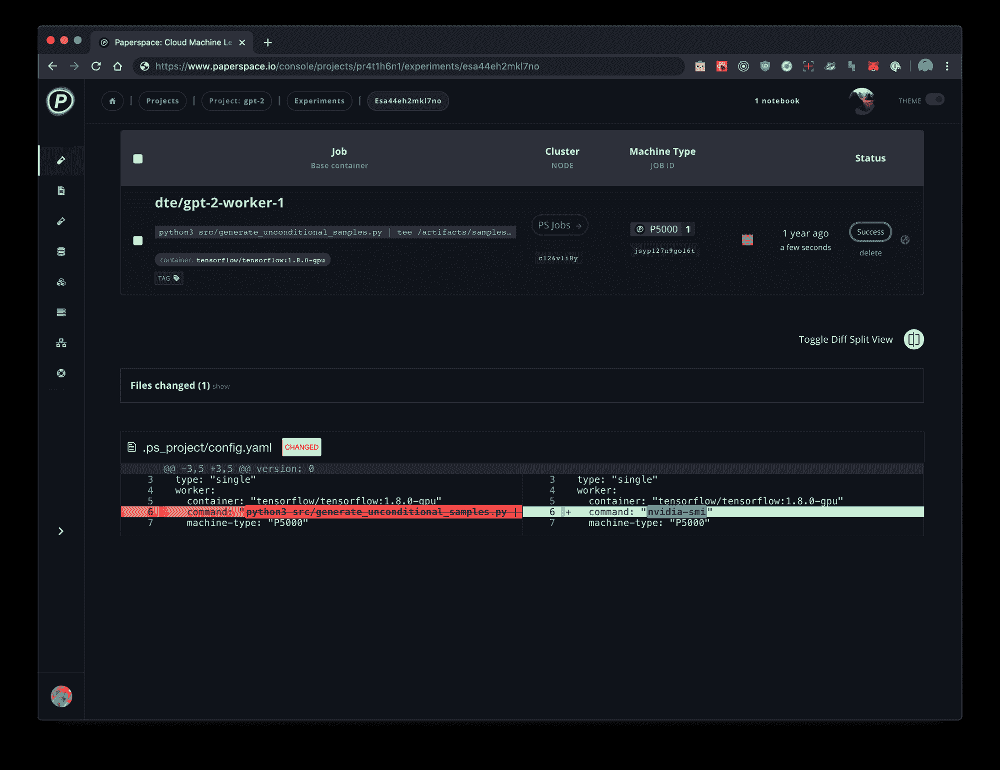
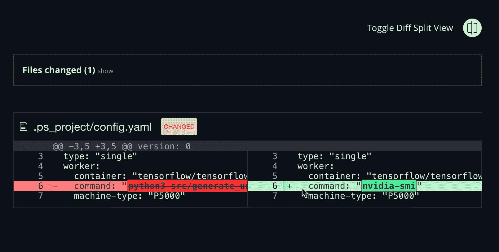

# 🎁产品更新:代码差异视图

> 原文：<https://blog.paperspace.com/product-update-code-diff-view/>

[2021 年 12 月 2 日更新:本文包含关于梯度实验的信息。实验现已被弃用，渐变工作流已经取代了它的功能。[请参见工作流程文档了解更多信息](https://docs.paperspace.com/gradient/explore-train-deploy/workflows)。]

Gradient experiments 中的代码查看器现在包括一个 visual diff 工具，面向开发人员，用于更好地可视化实验中的代码更改。

## 它是如何工作的

diff 视图帮助您比较 Gradient 中的文件、目录和版本控制项目。它提供了两个文件的双向比较，使理解代码更改更加容易。

Gradient code diffing tool

## 切换并排视图

新的比较查看器支持“**并排**”和“**逐行**”的可视化表示。使用切换按钮在两者之间切换，如下图所示:

