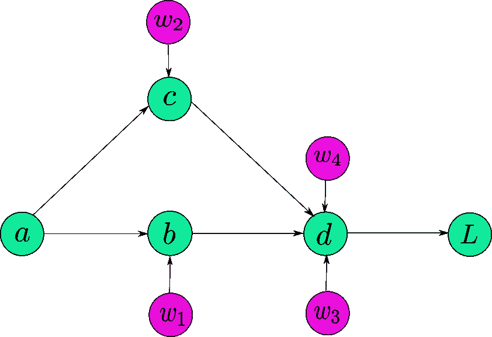
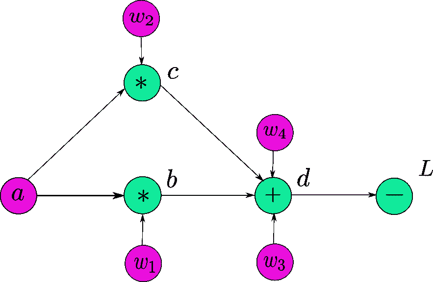
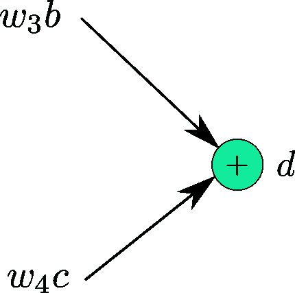
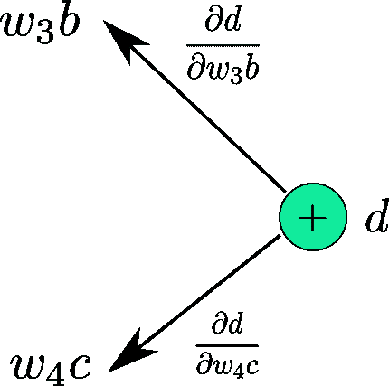
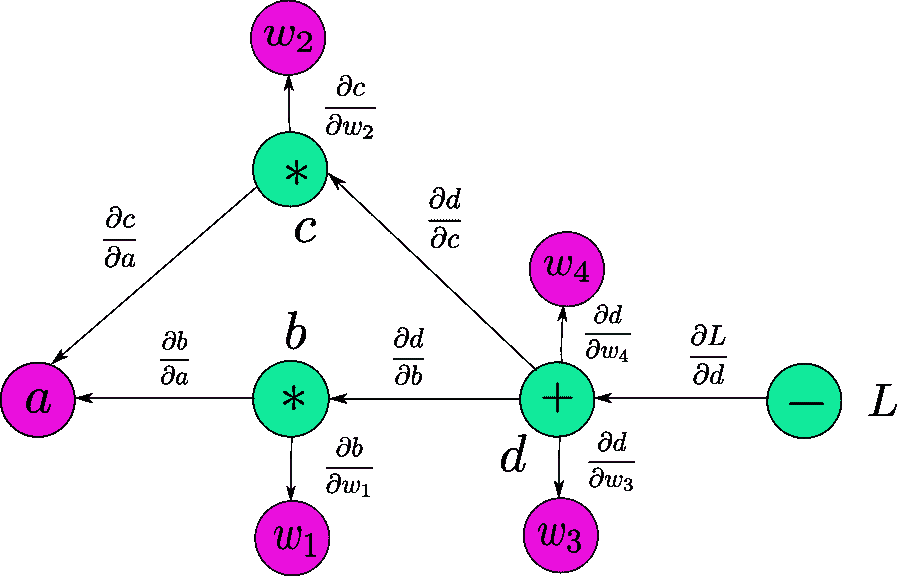
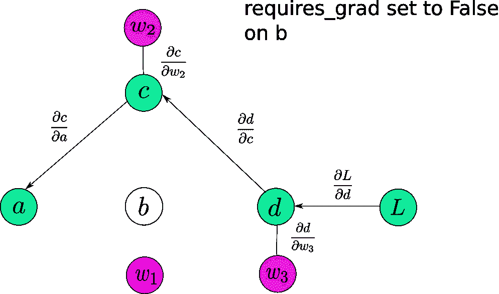

# PyTorch 101，第 1 部分:理解图形、自动微分和自动签名

> 原文：<https://blog.paperspace.com/pytorch-101-understanding-graphs-and-automatic-differentiation/>

PyTorch 是最重要的 python 深度学习库之一。这是深度学习研究的首选，随着时间的推移，越来越多的公司和研究实验室正在采用这个库。

在这一系列教程中，我们将向您介绍 PyTorch，以及如何最好地利用这些库以及围绕它构建的工具生态系统。我们将首先讨论基本的构建模块，然后讨论如何快速构建定制架构的原型。最后，我们将以几篇关于如何调整代码，以及在出现问题时如何调试代码的文章来结束。

这是我们 PyTorch 101 系列的第一部分。

1.  [理解图形，自动微分和亲笔签名](https://blog.paperspace.com/pytorch-101-understanding-graphs-and-automatic-differentiation/)
2.  [建立你的第一个神经网络](https://blog.paperspace.com/pytorch-101-building-neural-networks/)
3.  [深入 PyTorch](blog.paperspace.com/pytorch-101-advanced/)
4.  [内存管理和使用多个 GPU](blog.paperspace.com/pytorch-memory-multi-gpu-debugging/)
5.  [理解挂钩](blog.paperspace.com/pytorch-hooks-gradient-clipping-debugging/)

你可以在 Github repo [这里](https://github.com/Paperspace/PyTorch-101-Tutorial-Series)获得这篇文章(以及其他文章)中的所有代码。

* * *

## 先决条件

1.  链式法则
2.  对深度学习的基本理解
3.  PyTorch 1.0

* * *

你可以在 Github repo [这里](https://github.com/Paperspace/PyTorch-101-Tutorial-Series)获得这篇文章(以及其他文章)中的所有代码。

## **自动**微分

PyTorch 上的许多系列教程都是从基本结构的初步讨论开始的。然而，我想先从讨论自动微分开始。

自动微分不仅是 PyTorch 的构造块，也是所有 DL 库的构造块。在我看来，PyTorch 的自动微分引擎，称为*亲笔签名的*是一个了解自动微分如何工作的出色工具。这不仅有助于你更好地理解 PyTorch，也有助于你理解其他的 DL 库。

现代神经网络架构可以有数百万个可学习的参数。从计算的角度来看，训练神经网络包括两个阶段:

1.  计算损失函数值的正向传递。
2.  向后传递以计算可学习参数的梯度。

向前传球非常直接。一层的输出是下一层的输入，依此类推。

反向传递稍微复杂一些，因为它要求我们使用链式法则来计算权重相对于损失函数的梯度。

## 玩具的例子

让我们以一个非常简单的仅由 5 个神经元组成的神经网络为例。我们的神经网络看起来如下。



A Very Simple Neural Network

下面的等式描述了我们的神经网络。

$ $ b = w _ 1 * a $ $ $ c = w _ 2 * a $ $ $ d = w _ 3 * b+w _ 4 * c $ $ $ L = 10-d $ $

让我们计算每个可学习参数$w$的梯度。

$ $ \ frac { \ partial { L } } { \ partial { w _ 4 } } = \ frac { \ partial { L } } * \ frac { \ partial { d } } { \ partial { w _ 4 } } $ $ $ \ frac { \ partial { L } } { \ partial { w _ 3 } } = \ frac { \ partial { L } } { \ partial { d } } * \ frac { \ partial { d } } { \ partial { w _ 3 } }。

所有这些梯度都是应用链式法则计算出来的。注意，由于梯度的*分子*是*分母的显式函数，所以上述等式右侧的所有单个梯度都可以直接计算。*

* * *

## 计算图表

我们可以手动计算网络的梯度，因为这非常简单。想象一下，如果你有一个 152 层的网络会怎么样。或者，如果网络有多个分支。

当我们设计软件来实现神经网络时，我们希望找到一种方法，使我们能够无缝地计算梯度，而不管架构类型如何，这样当网络发生变化时，程序员就不必手动计算梯度。

我们以一种叫做**计算图**的数据结构的形式激发了这个想法。计算图看起来非常类似于我们在上图中制作的图表。然而，计算图中的节点基本上是**操作符**。这些操作符基本上是数学操作符，但有一种情况除外，在这种情况下，我们需要表示用户定义变量的创建。

注意，为了清楚起见，我们在图中还表示了叶变量$ a，w_1，w_2，w_3，w_4$。然而，应该注意，它们不是计算图的一部分。在我们的图表中，它们所代表的是用户定义变量的特殊情况，我们刚刚将其作为例外情况进行了介绍。



Computation Graph for our very simple Neural Network

变量 *b、c* 和 *d* 作为数学运算的结果被创建，而变量 *a、w1、w2、w3* 和 *w4* 由用户自己初始化。因为它们不是由任何数学运算符创建的，所以与它们的创建相对应的节点由它们的名称本身来表示。对于图中的所有*叶*节点都是如此。

* * *

## 计算梯度

现在，我们准备描述我们将如何使用计算图来计算梯度。

除了叶节点之外，计算图的每个节点都可以被认为是接受一些输入并产生一个输出的函数。考虑从$ w_4c$和$w_3b$产生变量 *d* 的图的节点。因此我们可以写，

$$ d = f(w_3b，w_4c) $$



d is output of function f(x,y) = x + y

现在，我们可以很容易地计算出$f$相对于其输入值$ \ frac { \ partial { f } } { \ partial { w _ 3b } } $和$ \ frac { \ partial { f } } { \ partial { w _ 4c } } $(都是 *1* )的梯度。现在，**给进入节点**的边标上它们各自的渐变，如下图所示。



Local Gradients

我们对整个图形都这样做。图表看起来像这样。



Backpropagation in a Computational Graph

接下来，我们描述计算该图中任何节点相对于损失$L$的导数的算法。假设我们要计算导数，$ \ frac { \ partial { f } } { \ partial { w _ 4 } } $。

1.  我们首先追踪从 *d* 到$ w_4 $的所有可能路径。
2.  只有一条这样的路。
3.  我们沿着这条路径乘以所有的边。

如果你看到，这个乘积就是我们用链式法则推导出的表达式。如果从 *L* 到变量有多条路径，那么我们沿着每条路径乘边，然后把它们加在一起。例如，$ \ frac { \ partial { L } } { \ partial { a } } $的计算方法如下

$ $ \ frac { \ partial { f } } { \ partial { w _ 4 } } = \ frac { \ partial { L } } * \ frac { \ partial { d } } * \ frac { \ partial { b } } { \ partial { a } }+\ frac { \ partial { L } } { \ partial { d } } * \ frac { \ partial { d } } * \ frac { \ partial { c } } { \ partial { a } $ $

## 我的天啊

现在我们知道了什么是计算图，让我们回到 PyTorch 并理解上面的内容是如何在 PyTorch 中实现的。

### 张量

`Tensor`是一种数据结构，是 PyTorch 的基本构建模块。与 numpy 阵列非常相似，除了与 numpy 不同，tensors 被设计为利用 GPU 的并行计算能力。许多张量语法类似于 numpy 数组的语法。

```py
In [1]:  import torch

In [2]: tsr = torch.Tensor(3,5)

In [3]: tsr
Out[3]: 
tensor([[ 0.0000e+00,  0.0000e+00,  8.4452e-29, -1.0842e-19,  1.2413e-35],
        [ 1.4013e-45,  1.2416e-35,  1.4013e-45,  2.3331e-35,  1.4013e-45],
        [ 1.0108e-36,  1.4013e-45,  8.3641e-37,  1.4013e-45,  1.0040e-36]]) 
```

一个它自己的，`Tensor`就像一个 numpy `ndarray`。一个可以让你快速做线性代数选项的数据结构。如果您希望 PyTorch 创建一个对应于这些操作的图形，您必须将`Tensor`的`requires_grad`属性设置为 True。

这里的 API 可能有点混乱。PyTorch 中有多种初始化张量的方法。虽然有些方法可以让你在构造函数本身中显式定义`requires_grad`，但其他方法需要你在创建张量后手动设置它。

```py
>> t1 = torch.randn((3,3), requires_grad = True) 

>> t2 = torch.FloatTensor(3,3) # No way to specify requires_grad while initiating 
>> t2.requires_grad = True
```

`requires_grad`具有传染性。这意味着当一个`Tensor`通过操作其他`Tensor`而被创建时，如果至少一个用于创建的张量的`requires_grad`被设置为`True`，那么结果`Tensor`的`requires_grad`将被设置为`True`。

每个`Tensor`都有一个叫做`grad_fn`、*、*的属性，它是指创建变量的数学运算符。如果`requires_grad`设置为假，则`grad_fn`为无。

在我们的例子中，其中$ d = f(w_3b，w_4c) $, *d* 的 grad 函数将是加法运算符，因为 *f* 将其与输入相加。注意，加法运算符也是我们图中的节点，它输出的是 *d* 。如果我们的`Tensor`是一个叶节点(由用户初始化)，那么`grad_fn`也是 None。

```py
import torch 

a = torch.randn((3,3), requires_grad = True)

w1 = torch.randn((3,3), requires_grad = True)
w2 = torch.randn((3,3), requires_grad = True)
w3 = torch.randn((3,3), requires_grad = True)
w4 = torch.randn((3,3), requires_grad = True)

b = w1*a 
c = w2*a

d = w3*b + w4*c 

L = 10 - d

print("The grad fn for a is", a.grad_fn)
print("The grad fn for d is", d.grad_fn) 
```

如果您运行上面的代码，您会得到下面的输出。

```py
The grad fn for a is None
The grad fn for d is <AddBackward0 object at 0x1033afe48>
```

可以使用成员函数`is_leaf`来确定变量是否是叶子`Tensor`。

### 功能

PyTorch 中的所有数学运算都由*torch . nn . autograded . function*类实现。这个类有两个我们需要了解的重要成员函数。

第一个是它的 *forward* 函数，它使用输入简单地计算输出。

`backward` 函数获取来自其前方网络部分的输入梯度。如你所见，从函数 *f* 反向传播的梯度基本上是从其前面的层反向传播到 *f* 的**梯度乘以**f 的输出相对于其输入的局部梯度**。这正是`backward`函数的作用。**

让我们再次用$$ d = f(w_3b，w_4c) $$的例子来理解

1.  *d* 就是我们这里的`Tensor`。它的`grad_fn` 就是`<ThAddBackward>` *。*这基本上是加法运算，因为创建 *d* 的函数将输入相加。
2.  it's `grad_fn` 的`forward`函数接收输入$w_3b$ *和* $w_4c$并将它们相加。这个值基本上存储在 *d* 中
3.  `<ThAddBackward>` 的`backward`函数基本上以来自更远层的**输入梯度**作为输入。这基本上是$ \ frac { \ partial { L } } { \ partial { d } } $沿着从 *L* 到 *d.* 的边缘而来。该梯度也是 *L* w.r.t 到 *d* 的梯度，并存储在`d`的`grad` 属性中。可以通过调用`d.grad` *进入。*
4.  然后计算局部梯度$ \ frac { \ partial { d } } { \ partial { w _ 4c } } $和$ \ frac { \ partial { d } } { \ partial { w _ 3b } }。
5.  然后，backward 函数将传入的梯度分别与**本地计算的梯度**相乘，并且 ***"*** 通过调用其输入的`grad_fn`的 backward 方法将 ***"*** 梯度发送到其输入。
6.  比如与 *d* 关联的`<ThAddBackward>` 的`backward`函数调用$w_4*c$的 *grad_fn* 的反向函数(这里，$w_4*c$是中间张量，它的 *grad_fn* 是`<ThMulBackward>`。调用`backward`函数时，梯度$ \ frac { \ partial { L } } { \ partial { d } } * \ frac { \ partial { d } } { \ partial { w _ 4c } } $作为输入传递。
7.  现在，对于变量$w_4*c$，$ \ frac { \ partial { L } } { \ partial { d } } * \ frac { \ partial { d } } { \ partial { w _ 4c } } $成为引入的梯度，就像在步骤 3 中$ \ frac { \ partial { L } } { \ partial { d } } $对于 *$* d *$* 是，并且该过程重复。

从算法上来说，这是计算图的反向传播过程。(非实际执行，仅具有代表性)

```py
def backward (incoming_gradients):
	self.Tensor.grad = incoming_gradients

	for inp in self.inputs:
		if inp.grad_fn is not None:
			new_incoming_gradients = //
			  incoming_gradient * local_grad(self.Tensor, inp)

			inp.grad_fn.backward(new_incoming_gradients)
		else:
			pass 
```

这里的`self.Tensor`基本就是亲笔签名创造的`Tensor`。函数，在我们的例子中是 *d* 。

上面已经描述了输入梯度和局部梯度。

* * *

为了在我们的神经网络中计算导数，我们通常在代表我们损失的`Tensor`上调用`backward`。然后，我们从代表我们损失的`grad_fn`的节点开始回溯图。

如上所述，当我们回溯时，`backward`函数在图中被递归调用。有一次，我们到达一个叶节点，由于`grad_fn` 都不存在，而是停止原路返回。

这里需要注意的一点是，如果你在向量值张量上调用`backward()`，PyTorch 会给出一个错误。这意味着你只能在标量值张量上调用`backward`。在我们的例子中，如果我们假设`a`是一个向量值张量，并在 L 上调用`backward`，它将抛出一个错误。

```py
import torch 

a = torch.randn((3,3), requires_grad = True)

w1 = torch.randn((3,3), requires_grad = True)
w2 = torch.randn((3,3), requires_grad = True)
w3 = torch.randn((3,3), requires_grad = True)
w4 = torch.randn((3,3), requires_grad = True)

b = w1*a 
c = w2*a

d = w3*b + w4*c 

L = (10 - d)

L.backward()
```

运行上面的代码片段会导致以下错误。

```py
RuntimeError: grad can be implicitly created only for scalar outputs 
```

这是因为根据定义，梯度可以相对于标量值来计算。你不能精确区分一个矢量和另一个矢量。用于这种情况的数学实体称为**雅可比矩阵，**关于它的讨论超出了本文的范围。

有两种方法可以克服这一点。

如果你只是对上面的代码设置`L`做一个小小的改动，使之成为所有错误的总和，我们的问题就解决了。

```py
import torch 

a = torch.randn((3,3), requires_grad = True)

w1 = torch.randn((3,3), requires_grad = True)
w2 = torch.randn((3,3), requires_grad = True)
w3 = torch.randn((3,3), requires_grad = True)
w4 = torch.randn((3,3), requires_grad = True)

b = w1*a 
c = w2*a

d = w3*b + w4*c 

# Replace L = (10 - d) by 
L = (10 -d).sum()

L.backward() 
```

一旦完成，您就可以通过调用`Tensor`的`grad`属性来访问渐变。

第二种方法是，由于某种原因，必须绝对调用向量函数上的`backward`,你可以传递一个张量形状大小的`torch.ones`,你试图用它向后调用。

```py
# Replace L.backward() with 
L.backward(torch.ones(L.shape))
```

注意`backward`过去是如何将引入的渐变作为输入的。这样做使得`backward`认为引入的梯度只是与 L 大小相同的张量，并且它能够反向传播。

这样，我们可以为每个`Tensor`设置梯度，并且我们可以使用我们选择的优化算法来更新它们。

```py
w1 = w1 - learning_rate * w1.grad 
```

诸如此类。

## PyTorch 图与张量流图有何不同

PyTorch 创建了一个叫做**的动态计算图，这意味着这个图是动态生成的。**

**在变量的`forward`函数被调用之前，图中的`Tensor` *(* 是`grad_fn` *)* 没有节点。**

```py
`a = torch.randn((3,3), requires_grad = True)   #No graph yet, as a is a leaf

w1 = torch.randn((3,3), requires_grad = True)  #Same logic as above

b = w1*a   #Graph with node `mulBackward` is created.` 
```

**该图是调用多个*张量*的`forward`函数的结果。只有这样，为图形和中间值分配的非叶节点的缓冲区(用于以后计算梯度。当您调用`backward`时，随着梯度的计算，这些缓冲区(用于非叶变量)基本上被释放，并且图被*破坏*(在某种意义上，您不能通过它反向传播，因为保存值以计算梯度的缓冲区已经不在了)。**

**下一次，您将在同一个张量集上调用`forward`，**上一次运行的叶节点缓冲区将被共享，而非叶节点缓冲区将被再次创建。****

**如果在有非叶节点的图上多次调用`backward`,您会遇到下面的错误。**

```py
`RuntimeError: Trying to backward through the graph a second time, but the buffers have already been freed. Specify retain_graph=True when calling backward the first time.`
```

**这是因为非叶子缓冲区在第一次调用`backward()`时被破坏，因此，当第二次调用`backward`时，没有路径导航到叶子。您可以通过向`backward`函数添加`retain_graph = True`参数来撤销这种非叶缓冲区破坏行为。**

```py
`loss.backward(retain_graph = True)`
```

**如果您执行上述操作，您将能够通过同一图形再次反向传播，并且梯度将被累积，即，下一次您反向传播时，梯度将被添加到先前反向传递中已存储的梯度中。**

* * *

**这与 TensorFlow 使用的 ****静态计算图**** 不同，tensor flow 在运行程序的 之前声明了 *****。然后，通过向预定义的图形输入值来“运行”图形。*******

**动态图范例允许您在运行时对网络架构进行更改，因为只有在运行一段代码时才会创建一个图。**

**这意味着一个图可以在程序的生命周期中被重新定义，因为你不必预先定义它。**

**然而，这对于静态图形是不可能的，在静态图形中，图形是在运行程序之前创建的，只是在以后执行。**

**动态图也使调试更容易，因为它更容易定位错误的来源。**

## **一些贸易技巧**

#### **要求 _grad**

**这是`Tensor`类的一个属性。默认情况下，它是 False。当你不得不冻结一些层，并阻止他们在训练时更新参数时，这是很方便的。您可以简单地将`requires_grad`设置为 False，这些`Tensors`不会参与计算图形。**

****

**因此，没有梯度会传播到这些层，或那些依赖于这些层的梯度流`requires_grad`。当设置为真时，`requires_grad`具有传染性，即使运算的一个操作数的`requires_grad`设置为真，结果也是如此。**

### **火炬号 grad()**

**当我们计算梯度时，我们需要缓存输入值和中间要素，因为稍后可能需要它们来计算梯度。**

**$ b = w_1*a $ w.r.t 其输入$w_1$和$a$的梯度分别为$a$和$w_1$。我们需要存储这些值，以便在反向过程中进行梯度计算。这会影响网络的内存占用。**

**当我们执行推理时，我们不计算梯度，因此，不需要存储这些值。事实上，在推理过程中不需要创建图，因为这将导致无用内存消耗。**

**PyTorch 提供了一个上下文管理器，为此称为`torch.no_grad`。**

```py
`with torch.no_grad:
	inference code goes here` 
```

**没有为在此上下文管理器下执行的操作定义图形。**

### **结论**

**理解*亲笔签名的*和计算图形是如何工作的，可以让 PyTorch 的使用变得更加容易。我们的基础坚如磐石，接下来的帖子将详细介绍如何创建定制的复杂架构，如何创建定制的数据管道和更多有趣的东西。**

### **进一步阅读**

1.  **[链式法则](https://www.khanacademy.org/math/differential-calculus/dc-chain)**
2.  **[反向传播](http://neuralnetworksanddeeplearning.com/chap2.html)**