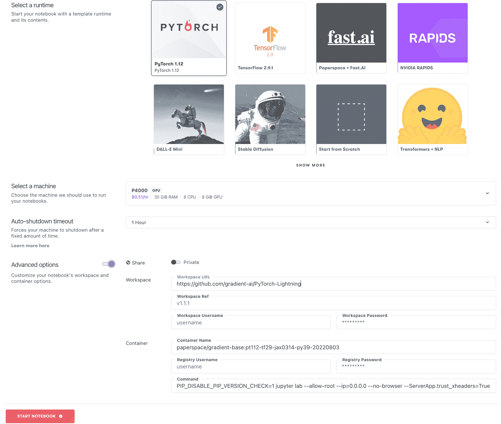
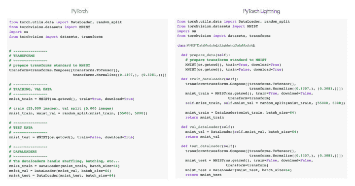
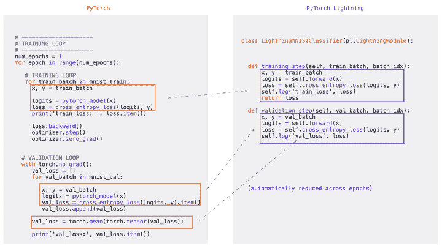
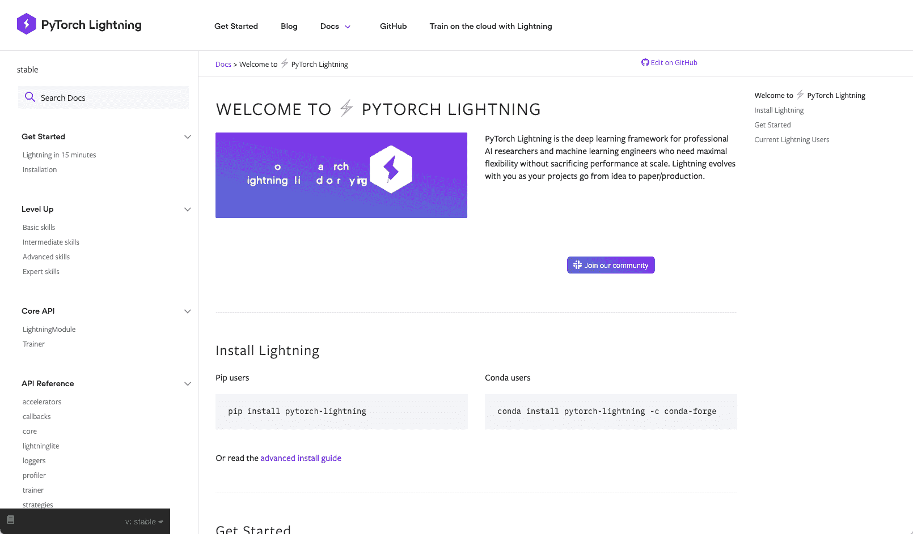

# 纸空间上的 PyTorch 闪电

> 原文：<https://blog.paperspace.com/pytorch-lightning-on-paperspace/>

PyTorch Lightning 是一个使用 PyTorch 进行研究的框架，它简化了我们的代码，而没有带走原始 PyTorch 的功能。它抽象出样板代码，并将我们的工作组织成类，例如，使数据处理和模型训练分离，否则它们会很快混合在一起，难以维护。

通过这种方式，它能够在高级项目上构建和快速迭代，并获得其他方式难以达到的结果。

结合 Paperspace 的易用性及其随时可用的 GPU 硬件，这为希望在实际项目中领先的数据科学家提供了一个绝佳的途径，而不必成为代码和基础设施的全职维护者。

## 闪电是为了谁？

在其创造者关于闪电的[博客中，他们写道](https://www.pytorchlightning.ai/blog/from-pytorch-to-pytorch-lightning-a-gentle-introduction)

> PyTorch Lightning 是为从事人工智能研究的专业研究人员和博士生创建的

这是公平的，要从它为我们的代码提供的结构中获得全部好处，需要做真实大小的项目。反过来，这要求用户已经熟悉 PyTorch、Python 类和深度学习概念。

然而，它并不比那些工具更难使用，而且在某些方面更容易。因此，对于那些正在成为数据科学家的人来说，这是一条很好的路线。

鉴于它的[文档](https://pytorch-lightning.readthedocs.io/en/stable/)，这一点尤其正确，其中包括对 Lightning 能做什么的出色概述，还包括一组介绍 PyTorch 和 Lightning 的教程。

## 闪电是如何形成的

Lightning 将我们端到端数据科学工作流的主要部分分成几个类。这将数据准备和模型训练分离开来，使事情可以重用，而不必一行一行地检查代码。例如，在新数据集上训练模型所需的更改变得更加清晰。

Lightning 中的主要类别有

*   照明模块
*   数据模块
*   运动鞋

LightningModule 通过使用 PyTorch nn.Module，使深度学习模型能够在 Lightning 中进行训练。这可以包括作为类中独立方法的训练、验证和测试。

DataModule 允许我们将特定数据集所需的所有处理放在一个地方。在现实世界的项目中，从我们的原始数据到模型就绪的东西可能是获得结果所需的全部代码和工作的很大一部分。因此，以这种方式组织它，使数据准备不与模型混合，是非常有价值的。

然后，培训师允许我们一起使用来自上述两个类的数据集和模型，而不必编写更多的工程或样板代码。

## 在图纸空间上运行闪电

要在 Paperspace 上运行 Lightning，[一旦在](https://console.paperspace.com/signup)登录，只需旋转渐变笔记本，选择一台机器，指向我们的[回购](https://github.com/gradient-ai/PyTorch-Lightning)包含示例`.ipynb`笔记本，我们就可以开始了。就这么简单！

Paperspace Gradient Notebook creation

或者，我们也可以使用下面的梯度运行按钮，只需点击一下就可以启动笔记本电脑

有关在 Gradient 上运行笔记本的更多信息，请访问我们的[笔记本教程](https://docs.paperspace.com/gradient/tutorials/notebooks-tutorial)。

## 被简化的代码示例

这两张截图来自作者介绍 Lightning 的博客条目[，展示了代码被简化的典型例子。](https://towardsdatascience.com/from-pytorch-to-pytorch-lightning-a-gentle-introduction-b371b7caaf09)

在第一幅图中，数据准备和拆分成训练/验证/测试集的特定线性排列封装在一个数据模块中。每个准备步骤都有自己的方法。

Organization and modularization of data preparation via the Lightning DataModule (from the blog entry introducing Lightning)

在第二幅图中，一屏实例化模型训练循环的样板代码被简化为不到一半长度的 LightningModule，训练和分类步骤依次变成类方法，而不是 for 和 with 循环。

Simplification of model training loop via the LightningModule (from the blog entry introducing Lightning)

虽然对于简单的例子来说，开销可能会很大，但是当全尺寸真实项目的数据准备开始占用许多屏幕的代码时，这种组织以及随之而来的模块化和可重用性只会变得更有价值。

Lightning 文档也有很棒的动画示例，通过典型的数据准备和模型训练过程更详细地展示了代码安排和简化。

## 还有很多

这篇博客文章对 Lightning 及其在 Paperspace 上的运行做了一个简单而基本的概述。有更多的功能等待着我们去探索，这些功能要么是免费的，要么是无需编写更多代码就可以轻松激活的。

*   检查点保存和加载
*   历元和批量迭代
*   多 GPU 支持
*   将实验记录到 TensorBoard
*   优化器是否单步执行、反向传播和零化梯度调用
*   模型评估期间禁用渐变
*   TPU 和 Graphcore IPU 硬件加速器
*   16 位自动混合精度(AMP)
*   导出到 ONNX 或 Torchscript 以进行模型部署
*   与 DeepSpeed 集成
*   探查器发现代码瓶颈

最后，Lightning 的一个在线伙伴 Lightning Bolts ( [网站](https://www.pytorchlightning.ai/bolts)、[文档](https://lightning-bolts.readthedocs.io/)、[回购](https://github.com/Lightning-AI/lightning-bolts))包含一系列扩展和模型，可以与 Lightning 一起使用，以进一步增加其功能。

## 文档和教程

作为一名拥有 20 多年经验的数据科学家，您的作者已经看到了许多产品和网站的文档。Lightning 的文档和教程肯定是我用过的质量最高、最全面的。所有内容都覆盖了高质量的内容，他们“获得”了我们作为数据科学家希望看到的内容。

PyTorch Lightning documentation at readthedocs

这不是一个完全面向初学者的网站，因为在第一个快速入门页面上，我们直接进入了 PyTorch 代码、Python 类和 autoencoder 深度学习模型。你不需要成为所有这些方面的专家，也可以了解正在发生的事情，但是有一些熟悉感是有帮助的。

话虽如此，还是有一套动手的例子和教程，它们和文档一样全面且呈现良好。标有 1-13 的是基于阿姆斯特丹大学深度学习课程的 2020 年版本。

教程 1-13 从介绍 PyTorch 开始，然后转到 Lightning，所以如果你对 py torch-classes-deep learning trifecta 不太熟悉，这些将是一个好去处。

所有的教程都是 Jupyter 笔记本的形式，因此可以在 Paperspace Gradient 上运行，不需要任何设置。

页面上的全套文档是

*   开始
*   升级:基础、中级、高级和专家技能
*   核心 API
*   API 参考
*   通用工作流程(逐级重新排列)
*   词汇表
*   实践示例

## 结论和后续步骤

我们已经介绍了 PyTorch Lightning，并展示了如何使用它来简化和组织我们现实世界的深度学习项目。

它假设您对 PyTorch、Python 类和深度学习有一定的了解，但是除了 Lightning 之外，它还包含了帮助我们学习 PyTorch 的优秀文档和教程。

结合 Paperspace 在开始编码方面的易用性和可用的 GPU 硬件，这让我们可以直接解决我们的数据科学问题，避免需要时间来设置和编写样板代码。

对于后续步骤，[尝试运行 Paperspace 上的教程](https://console.paperspace.com/github/gradient-ai/PyTorch-Lightning?machine=Free-GPU)，或访问以下网站了解更多信息:

*   [PyTorch 闪电主网站](https://www.pytorchlightning.ai/)
*   [文档和教程](https://pytorch-lightning.readthedocs.io/)
*   [GitHub 库](https://github.com/Lightning-AI/lightning)

除了闪电本身:

*   [闪电](https://lightning-bolts.readthedocs.io/en/latest/)
*   [闪电创造者的博客文章](https://towardsdatascience.com/from-pytorch-to-pytorch-lightning-a-gentle-introduction-b371b7caaf09)
*   [阿姆斯特丹大学深度学习课程](https://uvadlc-notebooks.readthedocs.io/en/latest/)