# PyTorch 损失函数

> 原文：<https://blog.paperspace.com/pytorch-loss-functions/>

损失函数是 ML 模型训练中的基础，并且在大多数机器学习项目中，如果没有损失函数，就没有办法驱动您的模型做出正确的预测。通俗地说，损失函数是一个数学函数或表达式，用于衡量模型在某些数据集上的表现。了解模型在特定数据集上的表现有多好，可以让开发人员在训练期间深入了解许多决策，例如使用新的、更强大的模型，甚至将损失函数本身更改为不同的类型。说到损失函数的类型，有几种损失函数是多年来发展起来的，每一种都适用于特定的训练任务。

在本文中，我们将探讨这些不同的损失函数，它们是 PyTorch 神经网络模块的一部分。我们将进一步深入研究 PyTorch 如何通过构建一个自定义的模块 API 向用户公开这些损失函数，作为其 nn 模块 API 的一部分。

现在我们已经对损失函数有了一个高层次的理解，让我们探索一些关于损失函数如何工作的更多技术细节。

# 什么是损失函数？

我们之前说过，损失函数告诉我们模型在特定数据集上的表现如何。从技术上讲，它是通过测量预测值与实际值的接近程度来做到这一点的。当我们的模型在训练和测试数据集上做出非常接近实际值的预测时，这意味着我们有一个非常稳健的模型。

虽然损失函数为我们提供了关于模型性能的关键信息，但这不是损失函数的主要功能，因为有更稳健的技术来评估我们的模型，如准确性和 F 分数。损失函数的重要性主要是在训练过程中实现的，在训练过程中，我们将模型的权重向损失最小化的方向推动。通过这样做，我们增加了我们的模型做出正确预测的概率，如果没有损失函数，这可能是不可能的。

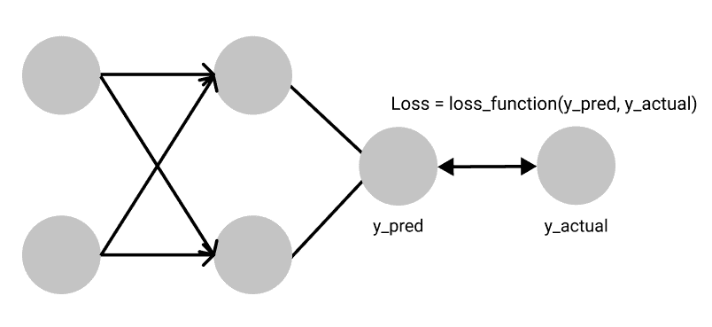

不同的损失函数适合不同的问题，每个损失函数都由研究人员精心制作，以确保训练期间稳定的梯度流。

有时，损失函数的数学表达式可能有点令人生畏，这导致一些开发人员将它们视为黑盒。我们稍后将揭示 PyTorch 的一些最常用的损失函数，但在此之前，让我们先看看在 PyTorch 的世界中我们是如何使用损失函数的。

# PyTorch 中的损失函数

PyTorch 开箱即用，提供了许多规范的损失函数和简单的设计模式，允许开发人员在培训期间快速轻松地迭代这些不同的损失函数。PyTorch 的所有损失函数都封装在 nn 模块中，nn 模块是 PyTorch 用于所有神经网络的基类。这使得在项目中添加损失函数就像添加一行代码一样简单。让我们看看如何在 PyTorch 中添加均方误差损失函数。

```py
import torch.nn as nn
MSE_loss_fn = nn.MSELoss()
```

上述代码返回的函数可用于计算预测值与实际值之间的差距，格式如下。

```py
#predicted_value is the prediction from our neural network
#target is the actual value in our dataset
#loss_value is the loss between the predicted value and the actual value
Loss_value = MSE_loss_fn(predicted_value, target)
```

现在我们已经了解了如何在 PyTorch 中使用损失函数，让我们深入到 PyTorch 提供的几个损失函数的幕后。

## PyTorch 中有哪些损失函数？

PyTorch 附带的许多损失函数大致分为 3 类——回归损失、分类损失和排序损失。

回归损失主要与连续值有关，它可以取两个极限之间的任何值。这方面的一个例子是社区房价的预测。

分类损失函数处理离散值，例如将对象分类为盒子、笔或瓶子。

排名损失预测值之间的相对距离。这种情况的一个例子是面部验证，其中我们想要知道哪些面部图像属于特定的面部，并且可以通过经由它们与目标面部扫描的相对近似程度对哪些面部属于和不属于原始面部持有者进行排序来做到这一点。

# L1 损失函数

L1 损失函数计算预测张量中的每个值和目标张量之间的平均绝对误差。它首先计算预测张量中的每个值与目标张量中的每个值之间的绝对差，并计算从每个绝对差计算返回的所有值的总和。最后，它计算这个和值的平均值，以获得平均绝对误差( *MAE* )。L1 损失函数对于处理噪声非常稳健。

[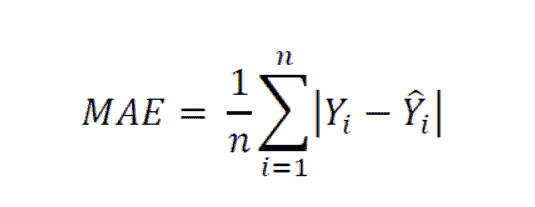](https://econbrowser.com/archives/2019/07/thems-fightin-words-futures-mean-squared-error-mean-absolute-error)

Mean Average Error Formula

```py
import torch.nn as nn

#size_average and reduce are deprecated

#reduction specifies the method of reduction to apply to output. Possible values are 'mean' (default) where we compute the average of the output, 'sum' where the output is summed and 'none' which applies no reduction to output

Loss_fn = nn.L1Loss(size_average=None, reduce=None, reduction='mean')

input = torch.randn(3, 5, requires_grad=True)
target = torch.randn(3, 5)
output = loss_fn(input, target)
print(output) #tensor(0.7772, grad_fn=<L1LossBackward>)
```

返回的单个值是维数为 3 乘 5 的两个张量之间的计算损失。

## 均方误差

均方差与平均绝对误差有一些惊人的相似之处。与平均绝对误差的情况不同，它不是计算预测张量和目标张量的值之间的绝对差，而是计算预测张量和目标张量的值之间的平方差。通过这样做，相对较大的差异被罚得更多，而相对较小的差异被罚得更少。然而，在处理异常值和噪声方面，MSE 被认为不如 MAE 稳健。

[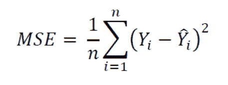](https://econbrowser.com/archives/2019/07/thems-fightin-words-futures-mean-squared-error-mean-absolute-error)

Mean Squared Error Formula

```py
import torch.nn as nn

loss = nn.MSELoss(size_average=None, reduce=None, reduction='mean')
#L1 loss function parameters explanation applies here.

input = torch.randn(3, 5, requires_grad=True)
target = torch.randn(3, 5)
output = loss(input, target)
print(output) #tensor(0.9823, grad_fn=<MseLossBackward>)
```

## 交叉熵损失

交叉熵损失用于涉及许多离散类的分类问题。它测量一组给定随机变量的两个概率分布之间的差异。通常，在使用交叉熵损失时，我们的网络的输出是一个 Softmax 层，这确保了神经网络的输出是一个概率值(0-1 之间的值)。

softmax 层由两部分组成-特定类的预测指数。

[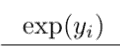](https://towardsdatascience.com/softmax-activation-function-how-it-actually-works-d292d335bd78)

*yi* 是特定类的神经网络的输出。这个函数的输出是一个接近于零的数，但如果 *yi* 大且为负，则永远不会为零，如果 *yi* 为正且非常大，则更接近于 1。

```py
import numpy as np

np.exp(34) #583461742527454.9
np.exp(-34) #1.713908431542013e-15
```

第二部分是归一化值，用于确保 softmax 层的输出始终是概率值。

[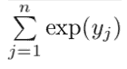](https://towardsdatascience.com/softmax-activation-function-how-it-actually-works-d292d335bd78)

这是通过将每个类值的所有指数相加得到的。softmax 的最终等式如下所示:

[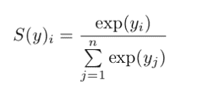](https://towardsdatascience.com/softmax-activation-function-how-it-actually-works-d292d335bd78)

在 PyTorch 的 nn 模块中，交叉熵损失将 log-softmax 和负 Log-Likelihood 损失组合成一个损失函数。

[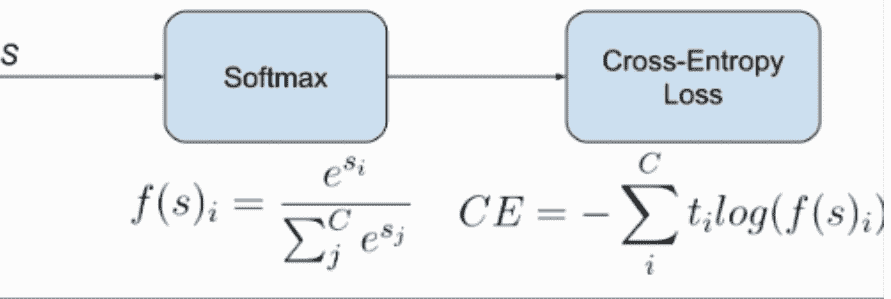](https://www.researchgate.net/post/How-to-use-Keras-classification-loss-functions)

请注意打印输出中的梯度函数是如何成为负对数似然损失(NLL)的。这实际上揭示了交叉熵损失将遮光罩下的 NLL 损失与 log-softmax 层相结合。

## 负对数似然损失

NLL 损失函数的工作方式与交叉熵损失函数非常相似。如前面交叉熵部分所述，交叉熵损失将 log-softmax 图层和 NLL 损失相结合，以获得交叉熵损失的值。这意味着通过使神经网络的最后一层是 log-softmax 层而不是正常的 softmax 层，可以使用 NLL 损失来获得交叉熵损失值。

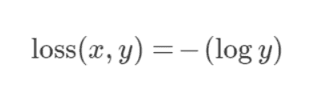

```py
m = nn.LogSoftmax(dim=1)
loss = nn.NLLLoss()
# input is of size N x C = 3 x 5
input = torch.randn(3, 5, requires_grad=True)
# each element in target has to have 0 <= value < C
target = torch.tensor([1, 0, 4])
output = loss(m(input), target)
output.backward()
# 2D loss example (used, for example, with image inputs)
N, C = 5, 4
loss = nn.NLLLoss()
# input is of size N x C x height x width
data = torch.randn(N, 16, 10, 10)
conv = nn.Conv2d(16, C, (3, 3))
m = nn.LogSoftmax(dim=1)
# each element in target has to have 0 <= value < C
target = torch.empty(N, 8, 8, dtype=torch.long).random_(0, C)
output = loss(m(conv(data)), target)
print(output) #tensor(1.4892, grad_fn=<NllLoss2DBackward>)

#credit NLLLoss — PyTorch 1.9.0 documentation
```

## 二元交叉熵损失

二进制交叉熵损失是一类特殊的交叉熵损失，用于将数据点仅分类为两类的特殊问题。这类问题的标签通常是二进制的，因此我们的目标是推动模型来预测一个接近零的零标签数和一个接近一的一个一标签数。通常当使用 BCE 损失进行二进制分类时，神经网络的输出是 Sigmoid 层，以确保输出是接近零的值或接近一的值。

[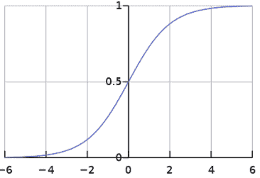](https://en.wikipedia.org/wiki/Sigmoid_function)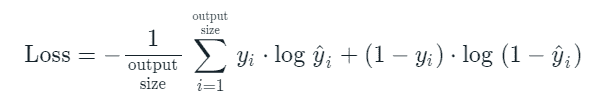

```py
import torch.nn as nn

m = nn.Sigmoid()
loss = nn.BCELoss()
input = torch.randn(3, requires_grad=True)
target = torch.empty(3).random_(2)
output = loss(m(input), target)
print(output) #tensor(0.4198, grad_fn=<BinaryCrossEntropyBackward>)
```

## 具有对数的二元交叉熵损失

我在上一节中提到，二进制交叉熵损失通常作为 sigmoid 层输出，以确保输出介于 0 和 1 之间。具有 Logits 的二进制交叉熵损失将这两层组合成一层。根据 [PyTorch 文档](https://pytorch.org/docs/stable/generated/torch.nn.BCEWithLogitsLoss.html#torch.nn.BCEWithLogitsLoss)，这是一个在数值上更加稳定的版本，因为它利用了 log-sum exp 技巧。

```py
import torch
import torch.nn as nn

target = torch.ones([10, 64], dtype=torch.float32)  # 64 classes, batch size = 10
output = torch.full([10, 64], 1.5)  # A prediction (logit)
pos_weight = torch.ones([64])  # All weights are equal to 1
criterion = torch.nn.BCEWithLogitsLoss(pos_weight=pos_weight)
loss = criterion(output, target)  # -log(sigmoid(1.5))
print(loss) #tensor(0.2014)
```

## 平滑 L1 损耗

平滑 L1 损失函数通过试探值β结合了 MSE 损失和 MAE 损失的优点。这个标准是在 [Fast R-CNN 论文](https://arxiv.org/abs/1504.08083)中介绍的。当实际值和预测值之间的绝对差值低于β时，该标准使用平方差，非常类似于 MSE 损失。MSE 损失图是一条连续的曲线，这意味着每个损失值的梯度不同，可以在任何地方得到。此外，随着损失值减小，梯度减小，这在梯度下降期间是方便的。然而，对于非常大的损失值，梯度爆炸，因此当绝对差变得大于β且潜在的梯度爆炸被消除时，标准切换到平均绝对误差，其梯度对于每个损失值几乎是恒定的。

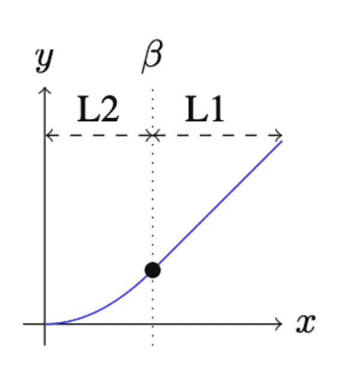

```py
import torch.nn as nn

loss = nn.SmoothL1Loss()
input = torch.randn(3, 5, requires_grad=True)
target = torch.randn(3, 5)
output = loss(input, target)

print(output) #tensor(0.7838, grad_fn=<SmoothL1LossBackward>)
```

## 铰链嵌入损耗

铰链嵌入损失主要用于半监督学习任务，以衡量两个输入之间的相似性。当有一个输入张量和一个包含值 1 或-1 的标签张量时使用。它主要用于涉及非线性嵌入和半监督学习的问题。

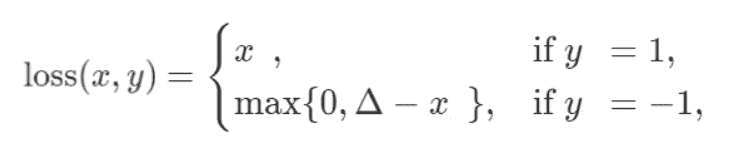

```py
import torch
import torch.nn as nn

input = torch.randn(3, 5, requires_grad=True)
target = torch.randn(3, 5)

hinge_loss = nn.HingeEmbeddingLoss()
output = hinge_loss(input, target)
output.backward()

print('input: ', input)
print('target: ', target)
print('output: ', output)

#input:  tensor([[ 1.4668e+00,  2.9302e-01, -3.5806e-01,  1.8045e-01,  #1.1793e+00],
#       [-6.9471e-05,  9.4336e-01,  8.8339e-01, -1.1010e+00,  #1.5904e+00],
#       [-4.7971e-02, -2.7016e-01,  1.5292e+00, -6.0295e-01,  #2.3883e+00]],
#       requires_grad=True)
#target:  tensor([[-0.2386, -1.2860, -0.7707,  1.2827, -0.8612],
#        [ 0.6747,  0.1610,  0.5223, -0.8986,  0.8069],
#        [ 1.0354,  0.0253,  1.0896, -1.0791, -0.0834]])
#output:  tensor(1.2103, grad_fn=<MeanBackward0>)
```

## 利润排名损失

差值排序损失属于排序损失，与其他损失函数不同，其主要目标是测量数据集中一组输入之间的相对距离。边际排名损失函数采用两个输入和一个仅包含 1 或-1 的标签。如果标签为 1，则假设第一输入应该具有比第二输入更高的等级，如果标签为-1，则假设第二输入应该具有比第一输入更高的等级。下面的等式和代码显示了这种关系。

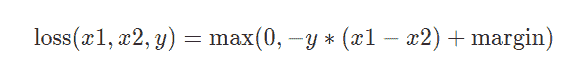

```py
import torch.nn as nn

loss = nn.MarginRankingLoss()
input1 = torch.randn(3, requires_grad=True)
input2 = torch.randn(3, requires_grad=True)
target = torch.randn(3).sign()
output = loss(input1, input2, target)
print('input1: ', input1)
print('input2: ', input2)
print('output: ', output)

#input1:  tensor([-1.1109,  0.1187,  0.9441], requires_grad=True)
#input2:  tensor([ 0.9284, -0.3707, -0.7504], requires_grad=True)
#output:  tensor(0.5648, grad_fn=<MeanBackward0>)
```

## 三重边际损失

该标准通过使用训练数据样本的三元组来测量数据点之间的相似性。所涉及的三元组是锚定样本、阳性样本和阴性样本。目标是 1)使正样本和锚之间的距离尽可能小，以及 2)使锚和负样本之间的距离大于一个差值加上正样本和锚之间的距离。通常情况下，正样本与主播属于同一类，负样本则不是。因此，通过使用该损失函数，我们旨在使用三元组边际损失来预测锚和阳性样本之间的高相似性值以及锚和阴性样本之间的低相似性值。

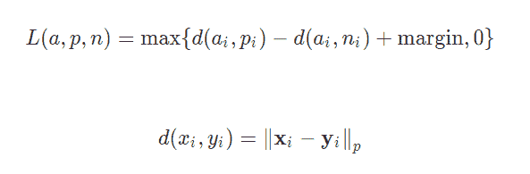

```py
import torch.nn as nn

triplet_loss = nn.TripletMarginLoss(margin=1.0, p=2)
anchor = torch.randn(100, 128, requires_grad=True)
positive = torch.randn(100, 128, requires_grad=True)
negative = torch.randn(100, 128, requires_grad=True)
output = triplet_loss(anchor, positive, negative)
print(output)  #tensor(1.1151, grad_fn=<MeanBackward0>)
```

## 余弦嵌入损失

余弦嵌入损失测量给定输入 x1、x2 和包含值 1 或-1 的标签张量 y 的损失。它用于测量两个输入相似或不相似的程度。

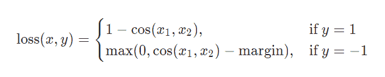

该标准通过计算空间中两个数据点之间的余弦距离来测量相似性。余弦距离与两点之间的角度相关，这意味着角度越小，输入越接近，因此它们越相似。

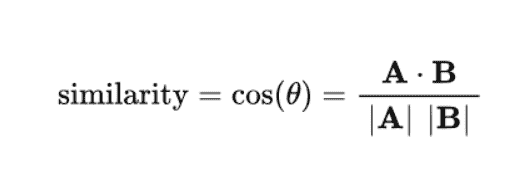

```py
import torch.nn as nn

loss = nn.CosineEmbeddingLoss()
input1 = torch.randn(3, 6, requires_grad=True)
input2 = torch.randn(3, 6, requires_grad=True)
target = torch.randn(3).sign()
output = loss(input1, input2, target)
print('input1: ', input1)
print('input2: ', input2)
print('output: ', output)

#input1:  tensor([[ 1.2969e-01,  1.9397e+00, -1.7762e+00, -1.2793e-01, #-4.7004e-01,
#         -1.1736e+00],
#        [-3.7807e-02,  4.6385e-03, -9.5373e-01,  8.4614e-01, -1.1113e+00,
#          4.0305e-01],
#        [-1.7561e-01,  8.8705e-01, -5.9533e-02,  1.3153e-03, -6.0306e-01,
#          7.9162e-01]], requires_grad=True)
#input2:  tensor([[-0.6177, -0.0625, -0.7188,  0.0824,  0.3192,  1.0410],
#        [-0.5767,  0.0298, -0.0826,  0.5866,  1.1008,  1.6463],
#        [-0.9608, -0.6449,  1.4022,  1.2211,  0.8248, -1.9933]],
#       requires_grad=True)
#output:  tensor(0.0033, grad_fn=<MeanBackward0>)
```

## 库尔巴克-莱布勒发散损失

给定两种分布，P 和 Q，Kullback Leibler 散度(KLD)损失测量当 P(假定为真实分布)被 Q 替换时损失了多少信息。通过测量当我们使用 Q 逼近 P 时损失了多少信息，我们能够获得 P 和 Q 之间的相似性，从而驱动我们的算法产生非常接近真实分布 P 的分布。当使用 Q 逼近 P 时的信息损失与使用 P 逼近 Q 时的信息损失不同，因此 KL 散度是不对称的。

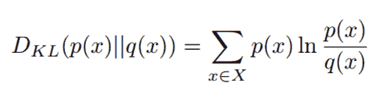

```py
import torch.nn as nn

loss = nn.KLDivLoss(size_average=None, reduce=None, reduction='mean', log_target=False)
input1 = torch.randn(3, 6, requires_grad=True)
input2 = torch.randn(3, 6, requires_grad=True)
output = loss(input1, input2)

print('output: ', output) #tensor(-0.0284, grad_fn=<KlDivBackward>)
```

# 构建您自己的定制损失函数

PyTorch 为我们提供了两种流行的方法来建立我们自己的损失函数，以适应我们的问题；即使用类实现和使用函数实现。让我们从函数实现开始，看看如何实现这两种方法。

## 函数的自定义丢失

这是编写自定义损失函数最简单的方法。这就像创建一个函数一样简单，向它传递所需的输入和其他参数，使用 PyTorch 的核心 API 或函数 API 执行一些操作，然后返回值。让我们来看一个自定义均方误差的演示。

```py
def custom_mean_square_error(y_predictions, target):
  square_difference = torch.square(y_predictions - target)
  loss_value = torch.mean(square_difference)
  return loss_value
```

在上面的代码中，我们定义了一个自定义损失函数来计算给定预测张量和目标传感器的均方误差

```py
y_predictions = torch.randn(3, 5, requires_grad=True);
target = torch.randn(3, 5)
pytorch_loss = nn.MSELoss();
p_loss = pytorch_loss(y_predictions, target)
loss = custom_mean_square_error(y_predictions, target)
print('custom loss: ', loss)
print('pytorch loss: ', p_loss)

#custom loss:  tensor(2.3134, grad_fn=<MeanBackward0>)
#pytorch loss:  tensor(2.3134, grad_fn=<MseLossBackward>)
```

我们可以使用我们的自定义损失函数和 PyTorch 的 MSE 损失函数来计算损失，观察我们已经获得了相同的结果。

## Python 类的自定义丢失

这种方法可能是 PyTorch 中定义自定义损耗的标准和推荐方法。通过对 nn 模块进行子类化，损失函数被创建为神经网络图中的节点。这意味着我们的自定义损失函数是 PyTorch 层，与卷积层完全相同。让我们来看一个演示，看看这是如何处理定制 MSE 损失的。

```py
class Custom_MSE(nn.Module):
  def __init__(self):
    super(Custom_MSE, self).__init__();

  def forward(self, predictions, target):
    square_difference = torch.square(predictions - target)
    loss_value = torch.mean(square_difference)
    return loss_value

  # def __call__(self, predictions, target):
  #   square_difference = torch.square(y_predictions - target)
  #   loss_value = torch.mean(square_difference)
  #   return loss_value
```

我们可以在“forward”函数调用或“__call__”内部定义损失的实际实现。[查看 IPython 笔记本上的 Gradient，了解实践中使用的自定义 MSE 函数](https://console.paperspace.com/ml-showcase/notebook/rdwnmaulrwtsn1o?file=pytorch-loss-custom.ipynb)。

# 最后的想法

我们已经讨论了很多 PyTorch 中可用的损失函数，并且深入研究了这些损失函数的内部工作原理。为特定问题选择正确的损失函数可能是一项艰巨的任务。希望本教程和 PyTorch 官方文档可以作为理解哪种损失函数更适合您的问题的指南。