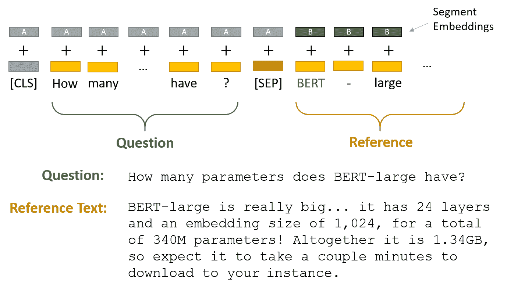

# 问答模型的比较

> 原文：<https://blog.paperspace.com/question-answering-models-a-comparison/>

自然语言处理中的问题回答子域由于在用参考文档回答问题方面的广泛应用而受到欢迎。这个问题的解决方案是通过使用由输入文本、查询和包含查询答案的输入文本的文本片段或范围组成的数据集来解决的。在深度学习模型的帮助下，从数据中实现人类水平的预测有了显著的提高。

在本教程中，我们将涵盖:

*   变压器架构
*   流行的数据集和评估指标
*   来自变压器的双向编码器表示
*   艾伯特:一点伯特
*   伊利克特拉
*   BART
*   使用标准模型的长文档问答的问题
*   LONGFORMER:长文档转换器

您可以从 [ML Showcase](https://ml-showcase.paperspace.com/projects/question-answering-models) 的免费 GPU 上运行本教程的完整代码。

## 变压器架构

论文[中提出了变压器架构](https://arxiv.org/abs/1706.03762)你所需要的就是注意力。编码器对输入文本进行编码，解码器处理编码以理解序列背后的上下文信息。堆栈中的每个编码器和解码器使用注意机制来处理每个输入以及每个其他输入，以衡量它们的相关性，并在解码器的帮助下生成输出序列。这里的注意机制能够动态突出显示和理解输入文本中的特征。《变形金刚》中的自我关注机制可以用一个例句来说明。

`A dog came running at me. It had cute eyes`。

这里自我注意机制允许单词`It`与单词`dog`相关联，并且理解`It`并不指代单词`me`。这是因为序列中的其他输入被加权，并且为这两个单词分配了更高的相关性概率。

## 流行的数据集和评估指标

在本文中，我们将遵循最常见的问答模型和数据集，它们是在 transformer 架构的帮助下预先训练的。最受欢迎的问答数据集包括[小队](https://rajpurkar.github.io/SQuAD-explorer/)、 [CoQA](https://stanfordnlp.github.io/coqa/) 等。这些数据集得到了很好的维护和定期更新，从而使它们适合通过最先进的模型进行训练。数据集由输入问题、参考文本和目标组成。

在 F1 和 EM 分数的帮助下完成评估。这些是使用精度和召回率计算的。精度是真阳性的数量除以真阳性和假阳性的数量。召回率是真阳性的数量除以真阳性和假阴性的数量。F1 的分数是:

```py
 2*((precision*recall)/(precision+recall))
```

EM(精确匹配)分数衡量与任何一个基本事实答案精确匹配的预测的百分比。这里的基本事实是数据集中的目标标注。

## 来自变压器的双向编码器表示

[huggingface](https://huggingface.co/) `transformers`库提供了包装良好的实现供我们试验。让我们开始我们的实验，首先进入一个 BERT 模型来理解它的性能。

Google Research 的 BERT 基于 [transformer](http://jalammar.github.io/illustrated-transformer/) 架构，具有在维基百科和[图书语料库](https://arxiv.org/pdf/1506.06724.pdf)上训练的编码器-解码器堆栈，后者是一个包含 10，000 多本不同流派图书的数据集。

SQuAD 数据集仅包含大约 150，000 个问题。我们将对这些方面的预训练模型进行微调，因为迁移学习被证明可以在有限的数据下提高性能。当 BERT 在 SQuAD 上接受训练时，输入问题和参考文本使用一个`[sep]`标记分开。概率分布用于从参考文本中确定`start` 和`end` 记号，其中包含答案的跨度由`start`和`end`记号的位置确定。



Tokenization in BERT ([source](http://mccormickml.com/assets/BERT/SQuAD/input_formatting.png))

```py
!pip install torch
!pip install transformers
!pip install sentencepiece 
```

```py
from transformers import BertTokenizer,AlbertTokenizer,AutoTokenizer, AutoModelForQuestionAnswering ,BertForQuestionAnswering
import torch

model_name='bert-large-uncased-whole-word-masking-finetuned-squad'
model = BertForQuestionAnswering.from_pretrained(model_name) 
```

这里我们加载了标准的`bert-large-uncased-whole-word-masking-finetuned-squad`，大小在 1.34 GB 左右。接下来，我们将看到相同标记的标记器如何标记我们的输入。

```py
from transformers import BertTokenizer
tokenizer = BertTokenizer.from_pretrained(model_name)
question = "How heavy is Ever Given?"
answer_text = "The Ever Given is 400m-long (1,312ft) and weighs 200,000 tonnes, with a maximum capacity of 20,000 containers. It is currently carrying 18,300 containers."
input_ids = tokenizer.encode(question, answer_text)
tokens = tokenizer.convert_ids_to_tokens(input_ids)
print(tokens)
```

```py
Output:

['[CLS]', 'how', 'heavy', 'is', 'ever', 'given', '?', '[SEP]', 'the', 'ever', 'given', 'is', '400', '##m', '-', 'long', '(', '1', ',', '312', '##ft', ')', 'and', 'weighs', '200', ',', '000', 'tonnes', ',', 'with', 'a', 'maximum', 'capacity', 'of', '20', ',', '000', 'containers', '.', 'it', 'is', 'currently', 'carrying', '18', ',', '300', 'containers', '.', '[SEP]']
```

问题和答案文本由一个`[sep]`标记分隔，`"##"`表示标记的其余部分应该附加到前一个标记上，没有空格(用于解码或标记化的反转)。`"##"`的使用确保了带有这个符号的记号与它前面的记号直接相关。

接下来，我将把我们的问答实现封装在一个函数中，这样我们就可以重用它来尝试这个例子中的不同模型，只需要对代码做很小的修改。

```py
def qa(question,answer_text,model,tokenizer):
  inputs = tokenizer.encode_plus(question, answer_text, add_special_tokens=True, return_tensors="pt")
  input_ids = inputs["input_ids"].tolist()[0]

  text_tokens = tokenizer.convert_ids_to_tokens(input_ids)
  print(text_tokens)
  outputs = model(**inputs)
  answer_start_scores=outputs.start_logits
  answer_end_scores=outputs.end_logits

  answer_start = torch.argmax(
      answer_start_scores
  )  # Get the most likely beginning of answer with the argmax of the score
  answer_end = torch.argmax(answer_end_scores) + 1  # Get the most likely end of answer with the argmax of the score

  answer = tokenizer.convert_tokens_to_string(tokenizer.convert_ids_to_tokens(input_ids[answer_start:answer_end]))

  # Combine the tokens in the answer and print it out.""
  answer = answer.replace("#","")

  print('Answer: "' + answer + '"')
  return answer 
```

```py
`qa(question,answer_text,model,tokenizer)`

Output:
Answer: "200 , 000 tonnes"
```

1.1 班的 BERT 的 F1 和 EM 分数分别为 91.0 和 84.3 左右。

## 艾伯特:一点伯特

对于需要更低内存消耗和更快训练速度的任务，我们可以使用 [ALBERT](https://ai.googleblog.com/2019/12/albert-lite-bert-for-self-supervised.html) 。这是一个精简版的 BERT，它使用了参数减少技术，因此在运行训练和推理时减少了参数的数量。这也有助于模型的可伸缩性。

```py
tokenizer=AlbertTokenizer.from_pretrained('ahotrod/albert_xxlargev1_squad2_512')
model=AlbertForQuestionAnswering.from_pretrained('ahotrod/albert_xxlargev1_squad2_512')
qa(question,answer_text,model,tokenizer)

Output:
Answer: "200,000 tonnes"
```

ALBERT 中的输入嵌入由相对低维度(例如 128 美元)的嵌入矩阵组成，而隐藏层维度更高(如 BERT 情况下的 768 美元或更高)。随着矩阵尺寸的减小，投影参数也减小，即可以观察到参数减小了 80%。这也伴随着性能的微小下降；一个 80.3 [的小队 2.0](https://rajpurkar.github.io/SQuAD-explorer/) 的分数，从 80.4 下降。

## 伊利克特拉

ELECTRA(有效学习准确分类令牌替换的编码器)是另一个提供预训练方法的模型，其中它通过新颖的方法破坏了 MLM(掩蔽语言建模);被称为替换令牌检测(RTD)。该方法训练两个转换器模型:生成器和鉴别器，它们都试图胜过对方。生成器试图通过替换序列中的标记来欺骗鉴别器，而鉴别器的工作是找到生成器替换的标记。由于任务是在所有记号上定义的，而不是在被屏蔽的部分上定义的，所以这种方法更有效，并且在特征提取方面优于 BERT。

```py
tokenizer = AutoTokenizer.from_pretrained("valhalla/electra-base-discriminator-finetuned_squadv1")
model = AutoModelForQuestionAnswering.from_pretrained("valhalla/electra-base-discriminator-finetuned_squadv1")

question="What is the discriminator of ELECTRA similar to?"

answer_text='As mentioned in the original paper: ELECTRA is a new method for self-supervised language representation learning. It can be used to pre-train transformer networks using relatively little compute. ELECTRA models are trained to distinguish "real" input tokens vs "fake" input tokens generated by another neural network, similar to the discriminator of a GAN. At small scale, ELECTRA achieves strong results even when trained on a single GPU. At large scale, ELECTRA achieves state-of-the-art results on the SQuAD 2.0 dataset.'

qa(question,answer_text,model,tokenizer)
```

```py
Output:
Answer: "a gan"
```

根据[论文](https://ai.googleblog.com/2020/03/more-efficient-nlp-model-pre-training.html)，ELECTRA-base 在 SQuAD 2.0 上实现了 EM 84.5 和 F1-90.8 的成绩。与 BERT 相比，预训练也更快，并且需要更少的例子来获得相同水平的性能。

## 巴特

脸书研究公司的 BART 结合了双向(如 BERT)和自回归(如 GPT 和 GPT-2)模型的能力。自回归模型从给定上下文的一组单词中预测未来单词。通过破坏一些记号或其他记号，对输入文本进行噪声处理。LM(语言模型)试图通过预测用原始标记替换损坏的标记。

```py
tokenizer = AutoTokenizer.from_pretrained("valhalla/bart-large-finetuned-squadv1")

model = AutoModelForQuestionAnswering.from_pretrained("valhalla/bart-large-finetuned-squadv1")

question="Upto how many tokens of sequences can BART handle?"

answer_text="To use BART for question answering tasks, we feed the complete document into the encoder and decoder, and use the top hidden state of the decoder as a representation for each word. This representation is used to classify the token. As given in the paper bart-large achives comparable to ROBERTa on SQuAD. Another notable thing about BART is that it can handle sequences with upto 1024 tokens."

qa(question,answer_text,model,tokenizer)
```

```py
Output:
Answer: " 1024"
```

通过结合两个世界的优点，即双向和自回归模型的特征，BART 提供了比 BERT 更好的性能(尽管参数增加了 10%)。在这里，BART-large 的 EM 得分为 88.8，F1 得分为 94.6。

## 使用标准模型的长文档问答的问题

正如本文开头所讨论的，变形金刚模型利用自我关注操作的帮助来提供有意义的结果。随着序列长度的增加，这种机制的计算规模急剧扩大。例如，看看下面给出的问题和文本:

```py
question="how many pilots did the ship have?"
answer_text="""
Tug boats had spent several hours on Monday working to free the bow of the massive vessel after dislodging the stern earlier in the day.
Marine traffic websites showed images of the ship away from the banks of the Suez Canal for the first time in seven days following an around-the-clock international effort to reopen the global shipping lane.
There are still 422 ships waiting to go through the Suez Canal, Rabie said, adding that the canal's authorities decided the ships will be able to cross the canal on a first come first serve basis, though the ships carrying livestock were permitted to cross in the first convoy of the day.
The average number of ships that transited through the canal on a daily basis before the accident was between 80 to 90 ships, according to Lloyds List; however, the head of the Suez Canal Authority said that the channel will work over 24 hours a day to facilitate the passage of almost 400 ships carrying billions of dollars in freight.
The journey to cross the canal takes 10 to 12 hours and in the event the channel operates for 24 hours, two convoys per day will be able to successfully pass through.
Still, shipping giant Maersk issued an advisory telling customers it could take "6 days or more" for the line to clear. The company said that was an estimate and subject to change as more vessels reach the blockage or are diverted.
The rescue operation had intensified in both urgency and global attention with each day that passed, as ships from around the world, carrying vital fuel and cargo, were blocked from entering the canal during the crisis, raising alarm over the impact on global supply chains.
What it&#39;s really like steering the world&#39;s biggest ships
What it's really like steering the world's biggest ships
Promising signs first emerged earlier on Monday when the rear of the vessel was freed from one of the canal's banks.
People at the canal cheered as news of Monday's progress came in.
The Panama Maritime Authority said that according to preliminary reports Ever Given suffered mechanical problems that affected its maneuverability.

The ship had two pilots on board during the transit.

However, the owner of the vessel, Japanese shipping company Shoe Kisen insists that there had been no blackout resulting in loss of power prior to the ship’s grounding.
Instead, gusting winds of 30 knots and poor visibility due to a dust storm have been identified as the likely causes of the grounding, which left the boxship stuck sideways in a narrow point of the waterway.

The incident has not resulted in any marine pollution ot injuries to the crew, only some structural damage to the ship, which is yet to be determined.
"""
```

如果我们像前面一样使用标准的 BERT 模型，将会观察到一个错误，表明长的输入序列不能被处理。

```py
from transformers import BertTokenizer,BertForQuestionAnswering
model_name='bert-large-uncased-whole-word-masking-finetuned-squad'
tokenizer = BertTokenizer.from_pretrained(model_name)
model = BertForQuestionAnswering.from_pretrained(model_name)

qa(question,answer_text,model,tokenizer)
```

```py
Output:
RuntimeError: The size of tensor a (548) must match the size of tensor b (512) at non-singleton dimension 1
```

我们需要另一个模型，它已经过预训练，包括一个更长的输入文档序列，也可以处理相同的架构。

## Longformer:长文档转换器

如果我们使用 Longformer 而不是标准的基于 transformer 的模型，较长序列的问题可以得到解决(在一定程度上)。标准的自我注意被放弃，取而代之的是局部窗口注意和任务驱动的整体注意被结合使用。预训练模型可以处理多达 4096 个标记的序列，而 BERT 中只有 512 个标记。在长文档任务中，Longformer 优于大多数其他模型，并且可以观察到在内存和时间复杂度方面的显著减少。

对于上面的问答对，我们来看看 longformer 的表现如何。

```py
tokenizer = AutoTokenizer.from_pretrained("valhalla/longformer-base-4096-finetuned-squadv1")

model = AutoModelForQuestionAnswering.from_pretrained("valhalla/longformer-base-4096-finetuned-squadv1")
qa(question,answer_text,model,tokenizer) 
```

```py
Output:
Answer: " two"
```

### 将模型转换为 Longformer

一个标准的变压器模型可以被转换成它的“长”版本。这些步骤包括将位置嵌入从$512$扩展到$4096$以及用 longformer 注意层替换标准的自我注意层。代码和解释可以在这里找到[。](https://github.com/allenai/longformer/blob/master/scripts/convert_model_to_long.ipynb)

## 结论

在本文中，我们介绍了各种基于 transformer 的问答模型，以及用于预训练它们的数据集。我们还看到了每个模型在 F1 和 EM 分数方面的不同基线。这些年来体系结构的改进导致了基线性能的提高。如果我们将这种模型转换为 Longformer 模型，那么它对于长文档的性能仍然可以得到改善。