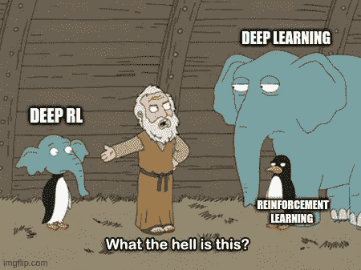
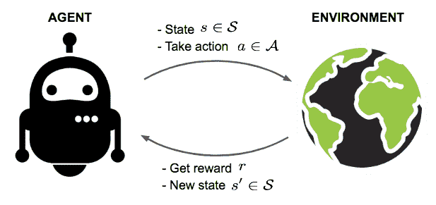
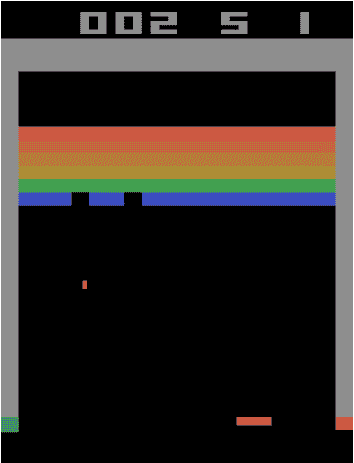
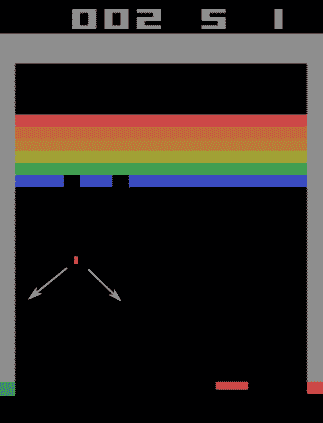
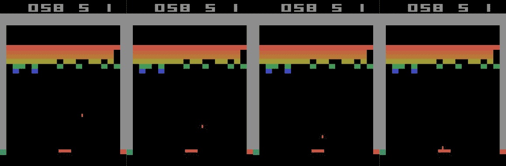
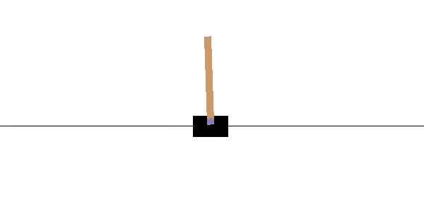
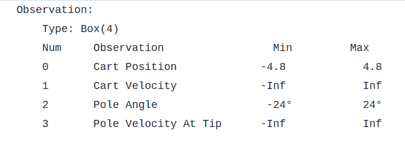

# 机器学习实践者强化学习指南:关于马尔可夫决策过程

> 原文：<https://blog.paperspace.com/reinforcement-learning-for-machine-learning-folks/>

深度强化学习是目前深度学习发展最快的子学科之一。在不到十年的时间里，研究人员已经使用深度 RL 来训练在各种游戏中表现超过专业人类玩家的代理人，从围棋等棋盘游戏到雅达利游戏和 Dota 等视频游戏。然而，强化学习的学习障碍可能会有点令人生畏，即使是对于那些之前涉足深度学习的其他子学科(如计算机视觉和自然语言处理)的人来说。

事实上，当我开始目前的工作时，那正是我发现自己的地方。有过 3 年左右从事计算机视觉工作的经历，突然投入到深度强化学习中。这看起来像是使用神经网络来做事情，但标准深度学习的大多数方法都不起作用。

差不多一年过去了，我终于开始欣赏强化学习(RL)的微妙本质，并认为写一篇帖子向来自标准机器学习经验的人介绍 RL 的概念会很好。我想以这样一种方式写这篇文章，如果有人(大约一年前，我就是这样)偶然看到它，这篇文章将成为一个很好的起点，并有助于缩短过渡时间。

所以让我们开始吧。

在本帖中，我们将介绍:

*   环境
*   国家
    *   马尔可夫性质
    *   现实生活中对马尔可夫性质的违背
    *   部分可观测性
*   马尔可夫决策过程
    *   国家
    *   行动
    *   转移函数
    *   奖励函数
*   部分可观测马尔可夫决策过程
*   基于模型的学习与无模型的学习
    *   基于模型的学习
    *   无模型学习

## 环境

切换到 RL 时遇到的第一个差异也是最基本的一个差异是，神经网络是通过与动态环境而不是静态数据集的交互来训练的。通常你会有一个由图像/句子/音频文件组成的数据集，你会一次又一次地迭代它，以更好地完成你训练的任务。

在 RL 中，你有一个采取行动的环境。每一个行动都会从环境中获得回报。神经网络(或任何其他用于确定动作的功能)被称为*代理。*代理的*寿命*可能是有限的(例如，像游戏终止的马里奥这样的游戏)，也可能是无限的(一个永远持续的游戏)。现在，我们将只关注终止的 RL 任务，这些任务也被称为*情节任务。代理具有无限生命周期的 RL 任务将在本系列的下一部分中解决。*

代理人在整个剧集中累积的累积报酬被称为*回报。*强化学习的目标就是让这个回报最大化。解决这个问题包括解决*信用分配问题*。它得名于这样一个事实，即在我们可以采取的所有可能的行动中，我们必须给每一个行动分配信用(回报),以便我们可以选择产生最大回报的行动。

> 从技术上讲，RL 代理的目标是最大化*预期收益。*但是在这里，我们不会在这方面停留太久。我们将在[的下一部分](https://blog.paperspace.com/overview-of-reinforcement-learning-universe/)更详细地讨论 RL 算法。在这一部分，我们仅限于讨论 RL 的中心问题。

* * *

一个环境的例子是 Atari 游戏，Breakout。

在中断中，座席可以向左、向右移动滑块，也可以不做任何操作。这些是代理可以执行的*动作*。当一个砖块被球击中时，环境会奖励代理人。做 RL 的目标是训练代理，让所有砖块都被摧毁。

## 国家

环境的*状态*基本上给了我们关于环境的信息。它可以是游戏的一个截图，一系列的截图，或者一堆支配环境如何运作的方程。一般来说，在每个时间步提供给代理的任何信息都有助于它采取行动。

### 马尔可夫性质

如果状态提供的信息足以确定给定任何动作的环境的未来状态，那么该状态被认为具有*马尔可夫*性质(或者在某些文献中，该状态被认为是*马尔可夫)。*这是因为我们在进行强化学习时处理的环境被建模为*马尔可夫决策过程。*我们稍后会详细介绍这些，但是现在，请理解这些环境的未来状态(对于任何操作)可以使用当前状态来确定。

想想雅达利游戏的突破。如果我们把游戏任意时刻的一张截图当做*状态*，是*马尔科夫吗？*

答案是否定的，因为根据刚才的截图，没有办法确定球的方向！考虑下面的图像。

球可能会朝两个白色箭头标记的任何一个方向运动，但我们无法判断是哪个方向。所以也许我们需要更多的信息来使状态马尔可夫化。我们把过去的 4 帧作为我们的状态，怎么样，这样我们至少对球的方向有个概念？

给定这 4 帧，我们可以计算球的速度和方向来预测未来的 4 帧(其中的后 3 帧与当前状态*的前 3 帧相同)。*

环境在本质上也可能是随机的。也就是说，假设相同的动作应用于相同的状态，结果仍然可能是不同的状态。如果所有动作的未来状态的概率分布可以仅使用当前状态和当前状态来确定，则该状态也被称为*马尔可夫*。当我们过一会儿看马尔可夫决策过程的数学公式时，这一点会变得更清楚。

### 现实生活中对马尔可夫性质的违背

考虑我们必须预测未来帧的情况。这里，我们必须预测球会以什么角度弹开。

当然，给定球的速度和角度，我们可以预测球反弹时的角度和速度。然而，只有当我们假设系统是理想的，球和圆盘之间的碰撞是纯弹性的，这才是正确的。

如果我们在现实生活中模拟这样的场景，碰撞的非弹性本质将违反状态的马尔可夫性质。然而，如果我们可以为状态添加更多细节，例如恢复系数(这将允许我们在计算中考虑碰撞的非弹性性质)，状态将再次变为马尔可夫状态，因为我们可以精确地预测球的未来位置。谢天谢地，在突破中，碰撞是纯弹性的。

为现实生活环境构建马尔可夫状态是非常困难的。第一个大障碍是传感器总是在读数中加入一些噪音，这使得正确预测(甚至测量)环境的真实状态变得不可能。第二，有许多国家的元素可能根本不为我们所知。

考虑一个经典的强化学习任务，包括平衡一根垂直的柱子。下面是真实任务的视频。

[https://www.youtube.com/embed/5Q14EjnOJZc?feature=oembed](https://www.youtube.com/embed/5Q14EjnOJZc?feature=oembed)

下面的摘录摘自巴尔托和萨顿的名著《强化学习:导论》中关于马尔可夫性质的讨论，该书谈到了极点平衡实验中状态的马尔可夫性质。

> 在前面介绍的杆平衡任务中，如果状态信号精确地指定了小车沿轨道的位置和速度、小车和杆之间的角度以及该角度变化的速率(角速度)，或者使得精确地重建该位置和速度成为可能，则该状态信号将是马尔可夫的。在理想的车-杆系统中，给定控制器采取的行动，该信息将足以准确预测车和杆的未来行为。然而，在实践中，永远不可能准确地知道这一信息，因为任何真实的传感器都会在其测量中引入一些失真和延迟。此外，在任何真实的车杆系统中，总会有其他影响，如杆的弯曲、车轮和杆轴承的温度以及各种形式的反冲，这些都会轻微影响系统的行为。如果状态信号仅仅是小车和杆子的位置和速度，这些因素将导致对马尔可夫性质的破坏。

### 部分可观测性

虽然很难有具有马尔可夫性质的状态，特别是在现实生活中，但好消息是，具有近似马尔可夫性质的近似在解决强化学习任务的实践中已经足够好了。

考虑极点平衡实验的情况。一种将车的位置分为三个区域的状态——右、左和中间——并使用类似的内在状态变量的粗略量化值(如车的速度、杆的角速度等)。)，对于通过 RL 方法解决平衡问题来说足够好。这样的状态与马尔科夫状态相去甚远，但可能会通过迫使代理忽略对解决任务毫无用处的细微差别来加速学习。

在对这种环境进行理论分析时，我们假设确实存在一种状态，通常仅称为“状态”或“真实状态”，具有我们无法观察到的马尔可夫性质。我们所能观察到的只是真实状态的一部分或更嘈杂的版本，这就叫做观察。这被称为部分可观测性，这样的环境被建模为部分可观测的马尔可夫决策过程(或简称为 POMDPs)。

请注意，在如何表示状态和观察值的文献中存在一些差异。一些文献使用单词“状态”来表示具有马尔可夫属性的真实隐藏状态，而其他文献将神经网络的输入称为状态，而将具有马尔可夫属性的隐藏状态称为“真实状态”。

现在我们已经建立了对马尔可夫性质的理解，让我们正式定义马尔可夫决策过程。

## 马尔可夫决策过程

几乎强化学习中的所有问题在理论上都被建模为在马尔可夫决策过程中最大化*回报*，或者简称为 MDP。MDP 有四个特点:

1.  $ \mathcal{S} $:代理*在与环境交互时经历的状态集*。假设状态具有马尔可夫性质。
2.  $ \mathcal{A} $:代理可以在环境中执行的一组合法操作。
3.  $ \mathcal{P} $:在给定初始状态和应用于该状态的操作的情况下，控制环境将转换到哪个状态的概率分布的转换函数。
4.  $ \mathcal{R} $:奖励函数，确定当代理使用特定动作从一种状态转换到另一种状态时将获得什么奖励。

马尔可夫决策过程通常表示为$ \ mathcal { M } = \乐浪\mathcal{S}、\mathcal{A}、\mathcal{P}、\mathcal{R} \rangle $。现在让我们更详细地研究一下它们。

### 国家

这组状态$ \mathcal{S} $，对应于我们在上一节中讨论的*状态*。状态可以是有限的，也可以是无限的。它们可以是离散的，也可以是连续的。$ \mathcal{S} $描述了 MDP 的*状态*可以采用的合法值，因此也被称为*状态空间。*

有限离散状态空间的一个例子是我们用于突围游戏的状态，即过去的 4 帧。该状态由 4 个`210 x 160`图像按通道连接而成，因此该状态是一个由`4 x 210 x 160`个整数组成的数组。每个像素可以取从`0`到`255`的值。因此，*状态空间*中可能状态的数量是$ 255^{4 * 210 * 160}。这是一个巨大但有限的状态空间。

连续状态空间的一个例子是 [OpenAI Gym](https://blog.paperspace.com/getting-started-with-openai-gym/) 中的`CartPole-v0`环境，它基于解决倒立摆任务。

CartPole-v0 environment from OpenAI Gym

该状态由 4 个内在状态变量组成:小车位置、速度、极点角度和尖端的极点速度。以下是状态变量的合法值。

State Space of the CartPole Environment of Gym

状态空间是无限的，因为连续变量可以在边界之间取任意值。

### 行动

操作空间$ \mathcal{A} $描述代理可以在 MDP 中执行的合法操作。这些动作将环境转换到一个不同的状态，在这种转换之后，代理会得到一个奖励。

就像状态空间一样，*动作空间*基本上是合法动作的范围。它们既可以像突围赛的动作空间一样离散，也就是`[NO-OP, FIRE, RIGHT, LEFT]`，让滑球什么都不做，发射球，分别向右或向左移动。连续动作空间可以是赛车游戏的空间，其中加速度是代理可以执行的动作。这个加速度可以是一个连续变量，范围从比如说$ -3 m/s^2 美元到 3 m/s^2 美元。

### 转移函数

转移函数给出了状态空间上的概率，该概率描述了给定动作$ a $应用于处于状态$ s $的环境时，环境转移到各种状态的可能性。函数$ \ mathcal { P }:\ mathcal { S } \ times \ mathcal { A } \ right arrow \ mathcal { S } $给出未来状态的概率分布。

$$ P_{ss'}^a = P(s' \vert s，a)= \ mathbb { p }[s _ { t+1 } = s ' \ vert s _ t = s，A_t = a] $$

雅达利游戏突破的未来状态的概率分布将在$ 255^{4 * 210 * 160} $个状态上定义。在实践中，计算这样的分布通常是难以处理的，我们将在这篇文章的后面看到如何处理这种情况。

转移函数的形式赋予了 MDP 状态的马尔可夫性质。该函数被定义为在给定当前状态$ s $和仅应用$ a $ **的操作**的情况下，产生未来状态$ s' $的分布。如果转移函数需要状态和动作的历史，那么状态将不再具有马尔可夫属性。

因此，马尔可夫属性也用数学术语表示如下:

$ $ \ mathbb { P }[S _ { t+1 } = S ' \ vert S _ t = S，A_t = A]= \ mathbb { P }[S _ { t+1 } = S ' \ vert S _ t，A _ t，S_{t-1}，a_{t-1}....S_0，a_0] $$

也就是说，您只需要当前状态和动作来定义未来状态的分布，而不考虑代理访问的状态和采取的动作的历史。

### 奖励函数

奖励函数告诉我们，如果代理在状态$ s_t $中采取行动$a$将会得到什么奖励。函数$ \ mathcal { R }:\ mathcal { S } \ times \ mathcal { A } \ right arrow \ mathbb { R } $为我们提供了代理在特定状态下执行特定操作的报酬。

$$ R(s，A)= \ mathbb { E }[R _ { t+1 } \ vert S _ t = S，A_t = a] $$

## 部分可观测马尔可夫决策过程

不难扩展 MDPs 的理论框架来定义部分可观测的 MDP，或 POMDP。POMDP 被定义为$ \ mathcal { M } = \乐浪\mathcal{S}、\mathcal{A}、\mathcal{P}、\mathcal{R}、\Omega、\mathcal{O} \rangle $。

除了$\mathcal{S}、\mathcal{A}、\mathcal{P}、\mathcal{R}、$我们还定义了:

1.  $ \Omega $，描述观察值的合法值的集合。
2.  条件观察函数$ O (s '，a) $告诉我们，如果代理采取行动$ a $转换到新状态$ s' $时，代理将接收到的观察分布。

## 模型 v/s 模型自由学习

正如我们所讨论的，对于游戏的突破，我们的状态是一个非常高的维度，维度为 255 美元^ {4 * 210 * 160}。对于如此高的状态，转换函数需要输出这些状态的分布。正如您可能已经发现的那样，在当前的硬件能力下，做到这一点是很困难的，记住，每一步都需要计算转移概率。

有几种方法可以避开这个问题。

### 基于模型的学习

我们可以努力学习突破游戏本身的模型。这将涉及使用深度学习来学习转换函数$ /mathcal{P} $和奖励函数$ \mathcal{R} $。我们可以将状态建模为一个`4 x 210 x 160`维的连续空间，其中每个维度的范围从 0 到 255，并提出一个生成模型。

当我们学习这些东西时，据说我们正在学习环境的*模型*。我们使用这个模型来学习一个名为*策略的函数，*$ \ pi:\ mathcal { S } \ times \ mathcal { A } \ right arrow[0，1] $，它基本上为我们提供了代理在经历状态$ s $时要采取的操作$ a$的概率分布$ \pi(s，a) $。

一般来说，当你有一个环境模型时，学习一个最优策略(一个最大化回报的策略)被称为*计划。*学习环境模型以达到最优策略的 RL 方法被归类于*基于模型的强化学习*。

### 无模型学习

或者，我们可能会发现底层环境太难建模，也许直接从经验中学习比之前试图学习环境的模型更好。

这与人类学习大部分任务的方式相似。汽车驾驶员实际上并没有学到控制汽车的物理定律，而是学会了根据他对汽车如何对不同动作做出反应的经验做出决定(如果你试图加速太快，汽车就会打滑等等)。

我们也可以这样训练我们的策略$ \pi $。这样的任务被称为*控制*任务。试图直接从经验中学习控制任务的最优策略的 RL 方法被归类为*无模型强化学习。*

## 包扎

这部分到此为止。这部分是关于设置问题，试图给你一个我们在强化学习中处理问题的框架的感觉，首先通过直觉，然后通过数学。

在[下一部分](https://blog.paperspace.com/overview-of-reinforcement-learning-universe/)中，我们将探讨如何解决这些任务，以及在应用从标准深度学习中借鉴的技术时我们面临的挑战。在那之前，这里有一些资源可以用来进一步深化这篇文章中的内容！

1.  第三章， *[强化学习:巴尔托&萨顿](https://web.stanford.edu/class/psych209/Readings/SuttonBartoIPRLBook2ndEd.pdf)简介。*
2.  [David Silver 的 RL 课程——第 2 讲:马尔可夫决策过程](https://www.youtube.com/watch?v=lfHX2hHRMVQ&list=PLe_NF20OA8cg7aiH0PYtc8UzLtj7uCao_&t=0s&index=3&app=desktop)