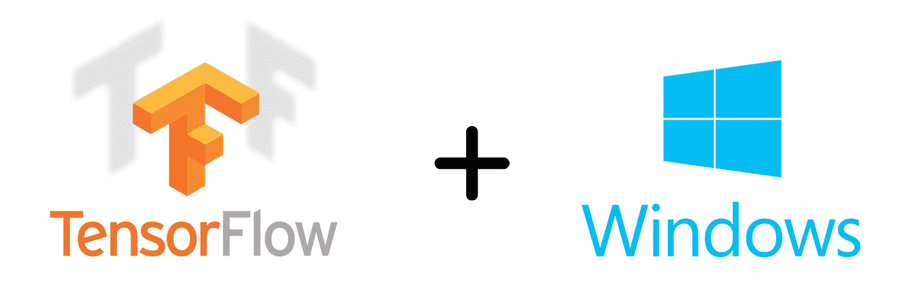
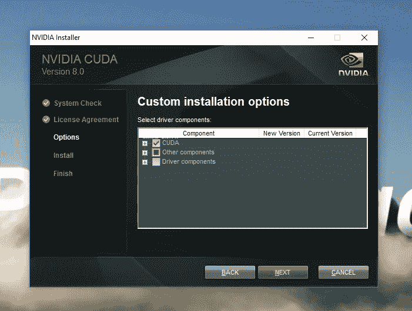
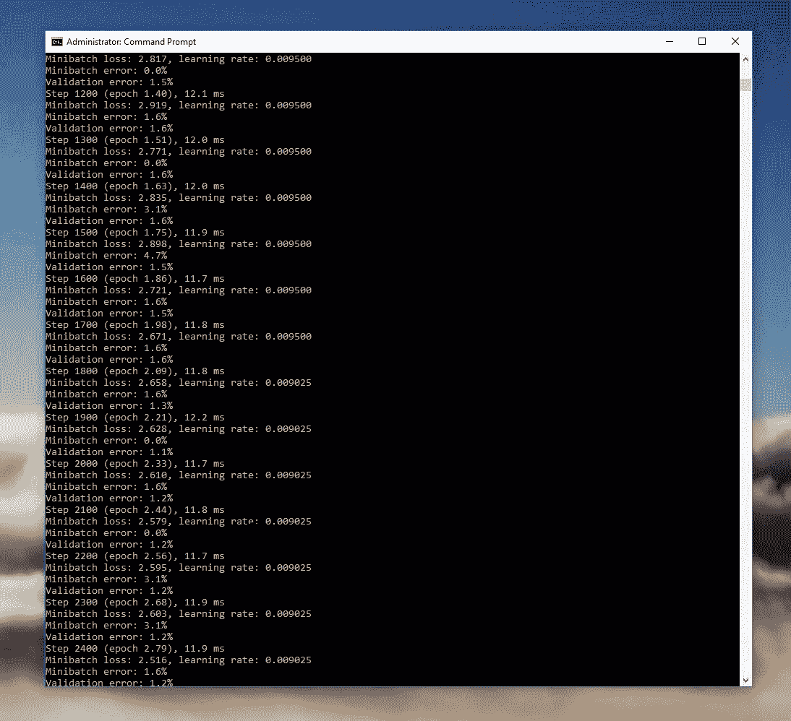
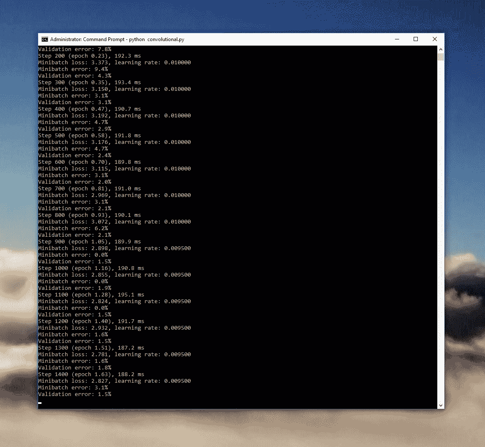
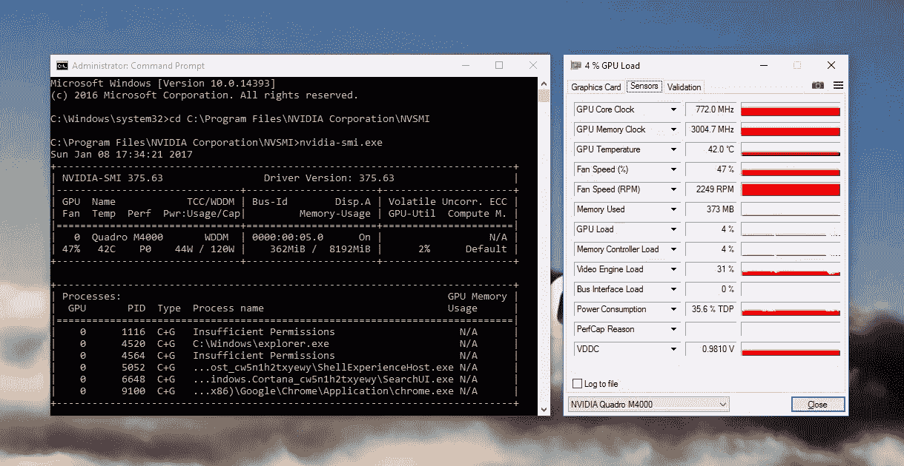

# 在 Windows 上运行 TensorFlow

> 原文：<https://blog.paperspace.com/running-tensorflow-on-windows-with-paperspace/>



以前，可以通过使用 Docker 容器在 Windows 环境中运行 [TensorFlow](https://www.tensorflow.org/) 。这种方法有很多缺点，其中最重要的是缺乏 GPU 支持。由于 GPU 通常比 CPU 的性能提升超过[10 倍](https://devblogs.nvidia.com/parallelforall/accelerate-machine-learning-cudnn-deep-neural-network-library/)，难怪人们对在完全 GPU 支持下本地运行 TensorFlow 感兴趣。截至 2016 年 12 月，这已经成为可能。最棒的是，设置只需 5 分钟:

##### 先决条件:

#### GPU+机器

TensorFlow 依赖于 NVIDIA 开发的一项名为 CUDA 的技术。GPU+机器包括一个支持 CUDA 的 GPU，非常适合 TensorFlow 和一般的机器学习。不使用 GPU(使用 CPU)也可以运行 TensorFlow，但是您将在下面看到使用 GPU 的性能优势。

#### 库达

[下载链接](https://developer.nvidia.com/cuda-downloads)
推荐版本: *Cuda 工具包 8.0*

安装将提供安装 NVIDIA 驱动程序。这已经安装，所以取消选中此框跳过这一步。

需要重新启动才能完成安装。

#### cuDNN

[下载链接](https://developer.nvidia.com/rdp/cudnn-download)
推荐版本: *cuDNN v5.1*

在 Windows 上，cuDNN 以 zip 存档的形式分发。提取它并添加 Windows 路径。我将它提取到`C:\tools\cuda\bin`并运行:

```py
set PATH=%PATH%;C:\tools\cuda\bin 
```

#### 计算机编程语言

[下载链接](https://repo.continuum.io/archive/Anaconda3-4.2.0-Windows-x86_64.exe)

如果您还没有安装 Python，Anaconda 的 Python 3.5 很容易安装。这是一个相当大的安装，所以需要几分钟。TensorFlow 目前需要 Python 2.7、3.4 或 3.5。

#### 安装 TensorFlow

首先，我们将为我们的项目创建一个虚拟环境:

```py
conda create --name tensorflow-gpu python=3.5 
```

然后激活或切换到这个虚拟环境:

```py
activate tensorflow-gpu 
```

最后，安装带 GPU 支持的 TensorFlow:

```py
pip install tensorflow-gpu 
```

测试 TensorFlow 安装

```py
python
...
>>> import tensorflow as tf
>>> hello = tf.constant('Hello, TensorFlow!')
>>> sess = tf.Session()
>>> print(sess.run(hello))
Hello, TensorFlow!
>>> a = tf.constant(10)
>>> b = tf.constant(32)
>>> print(sess.run(a + b))
42
>>> 
```

安装完成后，我们就可以运行我们的第一个模型了。

* * *

##### 让我们运行一个模型！

#### 运行 TensorFlow 演示模型

现在是有趣的部分。TensorFlow 附带了一些演示模型。我们将导航到它们所在的目录，并运行一个简单的模型来对来自 *MNIST* 数据集的手写数字进行分类:

```py
cd C:\Users\Paperspace\Anaconda3\envs\tensorflow-gpu\Lib\site-packages\tensorflow\models\image\mnist
python convolutional.py 
```

如果一切都配置正确，您应该在您的窗口中看到类似的内容:

您可以看到每一行大约需要 11-12 毫秒来运行。真是令人印象深刻。为了了解 GPU 带来的巨大差异，我将停用它并运行相同的模型。

```py
conda create --name tensorflow python=3.5
activate tensorflow
pip install tensorflow 
```


如您所见，每一行大约需要 190 毫秒。利用 **GPU 可以实现 17 倍的性能提升！**

值得一提的是，我们是在强大的 8 核英特尔至强处理器上运行的 GPU 加速通常会超过这些结果。

* * *

##### 总结:

#### 监控 GPU 利用率

最后，我有两种方法可以监控我的 GPU 使用情况:

**英伟达-SMI**

NVIDIA-SMI 是一个内置在 NVIDIA 驱动程序中的工具，可以直接在命令提示符下显示 GPU 的使用情况。导航到它的位置并运行它。

```py
cd C:\Program Files\NVIDIA Corporation\NVSMI
nvidia-smi.exe 
```

**GPU-Z**

TechPowerUp 开发了一个非常流行的 GPU 监控工具，叫做 GPU-Z，使用起来更加友好。在这里下载[。](https://www.techpowerup.com/gpuz/)



NVIDIA-SMI 和 GPU-Z 并行运行

就是这样。让我们知道你的想法！