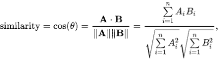

# PyTorch 闪电的句子嵌入

> 原文：<https://blog.paperspace.com/sentence-embeddings-pytorch-lightning/>

在本文中，您将了解 NLP 世界中句子嵌入的相关性，并学习如何使用 PyTorch 的 lightning-flash；一个快速有效的工具，帮助您轻松构建和缩放人工智能模型。

在本文中，我们将简要介绍以下内容:

*   两个向量之间的余弦相似性
*   单词嵌入与句子嵌入
*   变形金刚 API
*   PyTorch 闪电框架

## 两个向量之间的余弦相似性

假设你有两个向量，每个向量都有不同的方向和大小。如果这是真实世界的物理学，你可以通过取向量之间角度的余弦来计算向量之间的相似性。在计算机科学的上下文中，向量是由整数值或浮点值的数组组成的表示。为了计算这种阵列之间的相似性，我们可以使用余弦相似性度量。



The equation for cosine similarity ([source](https://www.kaggle.com/cdabakoglu/word-vectors-cosine-similarity))

输出是范围在 0 和 1 之间的相似性分数。下面是一个示例 python 函数，其中有两个向量`x`和`y`作为输入，返回输入的余弦相似性得分作为结果。

```py
import numpy as np

def cos_sim(x, y):
  """
  input: Two numpy arrays, x and y
  output: similarity score range between 0 and 1
  """"
	 #Taking dot product for obtaining the numerator
    numerator = np.dot(x, y)

	#Taking root of squared sum of x and y
    x_normalised = np.sqrt(np.sum(x**2))
    y_normalised = np.sqrt(np.sum(y**2))

    denominator = x_normalised * y_normalised
    cosine_similarity = numerator / denominator
    return cosine_similarity 
```

## 单词嵌入与句子嵌入

自然语言处理领域从单词嵌入的出现中获益良多。在解决自然语言处理问题时，单词嵌入的使用有助于更好地理解自然语言的语境，并有助于其在各种监督和非监督任务中的使用。

单词嵌入被定义为一个单词的固定大小的向量，使得一种语言中的每个单词都可以根据自然语言空间中的语义上下文来更好地表示。这种表示允许单词嵌入用于数学计算、训练神经网络等任务。Word2Vec 和 Glove 是两种最流行的早期单词嵌入模型。

后来，当基于 BERT 的模型随着 Huggingface API 流行起来时，对上下文理解的标准甚至上升到了更高的水平。但是这也导致了缩放形式的另一个问题。由于基于 BERT 的模型提供了更复杂的向量，计算速度发生了巨大的变化。此外，在需要理解句子意图的任务中，以向量表示形式对整个句子进行更广泛的理解被证明更有用。一个这样的任务的例子是句子相似性(STS)，其目标是预测两个句子是否在语义上彼此相似。当这两个句子被输入到 BERT 提供的复杂神经网络模型中时，就会产生巨大的计算过载。据发现，一个具有 10，000 个句子对的数据集的任务将需要近 65 个小时的时间，因为它需要大约 5000 万次推理计算([源](https://aclanthology.org/D19-1410.pdf))。这将是扩展深度学习模型用于 STS 和其他无监督任务(如聚类)时的一个主要缺点。让我们看一个示例代码，看看 Huggingface 的基于 BERT 的单词嵌入模型如何解决 STS 任务:

```py
from transformers import BertTokenizer, TFBertModel
model_name="prajjwal1/bert-small"
tokenizer=BertTokenizer.from_pretrained(model_name)
model = TFBertModel.from_pretrained(model_name,from_pt=True)
def encode_sentences(sentences):
  encoded = tokenizer.batch_encode_plus(
                      [sentences],
                      max_length=512,
                      pad_to_max_length=False,
                      return_tensors="tf",
                  )

  input_ids = np.array(encoded["input_ids"], dtype="int32")
  output = model(
      input_ids
  )
  sequence_output, pooled_output = output[:2]
  return pooled_output[0]

sentence1="There is a cat playing with a ball"
sentence2="Can you see a cat with a ball over the fence?"
embed1=encode_sentences(sentence1)
embed2=encode_sentences(sentence2)

cosine_similarity= cos_sim(embed1,embed2)
print("Cosine similarity Score {}".format(cosine_similarity))
```

句子转换器在这里提供了一个易于使用的 API 来为输入生成有意义的句子嵌入，以这种方式，两个句子对之间的关系可以通过常见的度量标准(如余弦相似度)轻松计算出来。基于句子变形器的 BERT 嵌入可以将上述类似任务的时间从 65 小时减少到仅仅 5 秒。除了 STS 任务之外，这些嵌入还被证明对其他任务有用，如自然语言推理(NLI)，下一句预测等。

## 变形金刚 API

句子转换器是一个 Python API，其中有来自 100 多种语言的句子嵌入。代码针对快速计算进行了很好的优化。API 中还提供了不同的度量标准来计算和查找相似的句子，进行释义挖掘，并帮助进行语义搜索。

让我们看看如何在句子转换器 API 中编码句子，并使用其内置的 API 计算句子对之间的余弦相似度。

在我们开始之前，我们需要从 pip 安装这个包:

`pip install sentence_transformers`

现在让我们编码:

```py
from sentence_transformers import SentenceTransformer, util
model = SentenceTransformer('all-MiniLM-L6-v2') #using a relatively smaller size model from the api

#two columns with indexes corresponding to pairs
col1=["I like to watch tv","The cat was running after the butterfly"]
col2=["Watching Television is my favorite time pass","It is so windy today"]

#Compute encodings for both lists
vectors1 = model.encode(col1, convert_to_tensor=True)
vectors2 = model.encode(col2, convert_to_tensor=True)

#Computing the cosine similarity for every pair
cosine_scores = util.cos_sim(vectors1, vectors2)

#Display cosine similarity score for the computed embeddings

for i,(sent1,sent2) in enumerate(zip(col1,col2)):
    if cosine_scores[i][i]>=0.5:
      label="Similar"
    else:
      label="Not Similar"
    print("sentence 1:{} | sentence 2:{}| prediction: {}".format(sent1,sent2,label)) 
```

输出:

`sentence 1:I like to watch tv | sentence 2:Watching Television is my favorite time pass| prediction: Similar`

`sentence1:The cat was running after the butterfly | sentence 2:It is so windy today| prediction: Not Similar`

正如您从输出中看到的，句子转换 API 能够快速准确地评估示例字符串之间的相似性，第一个正确地被声明为相似，第二个正确地被声明为不相似。

## Pytorch-lightning 框架

到目前为止，我们已经了解了如何编写代码来计算句子相似度。但是当涉及到扩展模型或在生产中使用它时，编写笔记本风格的代码通常是不够的。如果您使用 PyTorch，您将处理一个训练循环、一个验证循环、一个测试循环、优化器和其他配置。Pytorch-lightning 通过简单地提供一个框架，可以轻松地以一种可伸缩、易于使用的方式包装所有这些模块，为您省去所有这些麻烦。

让我们熟悉一些在 lightning 模块上使用的概念和工具包，以进一步理解如何处理我们的文本数据。

### 数据模块

`Datamodule`从云/本地存储中获取数据，应用其他预处理/转换，如清理、标记化等，并将其包装在`DataLoader`对象中。这有助于为数据创建有组织的管理，而不是读取和预处理分布在几个文件或位置的数据。`Dataloader`也有助于将数据分割成列车测试和验证。

### 运动鞋

`Trainer`通过培训所需的必要功能，帮助您实现管道自动化。这意味着处理整个训练循环，管理超参数，加载模型和数据加载器，处理批处理和回调，根据给定的测试数据进行预测，最后保存模型检查点。培训师为您抽象出所有这些方面，无需任何额外的 PyTorch 代码。

### 闪电

随着人工智能迎接在每个领域工作的挑战，不同的框架每天都在涌现，在某个时间点，我们可能希望所有这些都在一个框架中可用。这就是闪电的本质目标。

Flash 是 PyTorch Lightning 团队提供给你的一个子项目，作为你大部分机器学习问题的一站式工具包。Flash 将其任务包装在一个 lightning 模块中，适当使用`Trainer`和`Datamodule`来利用 PyTorch 必须提供的每一个功能。可以用这种方式分析的一些流行的领域和任务包括音频、文本、图像、图形、结构化数据等。

让我们试用一个来自 lightning-flash 的文本分类示例来回顾一下上面的概念，`Trainer`和`Dataloader`，以及它们的实现。训练数据来自 Kaggle 的[垃圾短信分类](https://www.kaggle.com/team-ai/spam-text-message-classification)任务。

如果您在创建笔记本时输入这个 [Github 链接](https://github.com/gradient-ai/lightning-flash-sentence-embeddings-tutorial)作为您的工作区 URL，它将与运行该演示所需的笔记本和 Python 脚本一起预上传到您的渐变实例中。您还可以通过该链接访问和分叉该笔记本的公共版本。

```py
 import torch

import flash
from flash.text import TextClassificationData, TextClassifier
#using the SPAM text message classification from kaggle: https://www.kaggle.com/team-ai/spam-text-message-classification
datamodule = TextClassificationData.from_csv(
    "Message", #source column
    "Category", #target column : The data does not even need to be integer encoded!
    train_file="/content/SPAM text message 20170820 - Data.csv",
    batch_size=8,
)

# The Model is  loaded with a huggingface backbone
model = TextClassifier(backbone="prajjwal1/bert-small", num_classes=datamodule.num_classes)

# A trainer object is created with the help of pytorch-lightning module and the task is finetuned
trainer = flash.Trainer(max_epochs=2, gpus = 1)
trainer.finetune(model, datamodule=datamodule, strategy="freeze")

# few data for predictions
datamodule = TextClassificationData.from_lists(
    predict_data=[
        "Can you spill the secret?",
        "Camera - You are awarded a SiPix Digital Camera! call 09061221066 fromm landline. Delivery within 28 days.",
        "How are you? We have reached India.",
    ],
    batch_size=8,
)
predictions = trainer.predict(model, datamodule=datamodule)
print(predictions)
# >>>[['ham', 'spam', 'ham']]

# Finally, we save the model
trainer.save_checkpoint("spam_classification.pt")
```

上面的示例显示了一个下游任务，其中模型根据给定的垃圾邮件与垃圾邮件数据进行了微调。当涉及到使用句子嵌入时，当涉及到与句子相似性相关的任务时，我们不需要微调，即，生成的句子嵌入可以直接与来自句子转换器 API 的度量一起使用，以容易地计算相似性。

让我们看一个例子，看看 lightning-flash 如何帮助我们计算句子嵌入，并尝试解决句子相似性任务，而实际上不需要对下游任务进行微调，并使用无监督的方法。

```py
 import torch

import flash
from flash.text import TextClassificationData, TextEmbedder
from sentence_transformers import util
predict_data=["I like to watch tv","Watching Television is my favorite time pass","The cat was running after the butterfly","It is so windy today"]
# Wrapping the prediction data inside a datamodule
datamodule = TextClassificationData.from_lists(
    predict_data=predict_data,
    batch_size=8,
)

# We are loading a pre-trained SentenceEmbedder
model = TextEmbedder(backbone="sentence-transformers/all-MiniLM-L6-v2")

trainer = flash.Trainer(gpus=1)

#Since this task is tackled unsupervised, the predict method generates sentence embeddings using the prediction input
embeddings = trainer.predict(model, datamodule=datamodule)

for i in range(0,len(predict_data),2):
  embed1,embed2=embeddings[0][i],embeddings[0][i+1]
  # we are using cosine similarity to compute the similarity score
  cosine_scores = util.cos_sim(embed1, embed2)
  if cosine_scores>=0.5:
      label="Similar"
  else:
      label="Not Similar"
  print("sentence 1:{} | sentence 2:{}| prediction: {}".format(predict_data[i],predict_data[i+1],label)) 
```

如您所见，我们不需要像之前的文本分类任务那样进行微调。Lightning-flash 的功能将有助于通过`Datamodule`输入数据，并借助来自`Trainer`对象的`predict`方法生成嵌入。

# 结论

在本文中，我们已经介绍了句子转换器的基础知识以及使用句子转换器解决句子相似性问题。对于这样的任务，我们还评估了句子嵌入相对于单词嵌入的优势。通过查看 pytorch-lightning 实现句子转换器的示例，我们学会了为生产就绪的应用程序扩展代码，现在我们可以通过避免样板代码来简化编写 pytorch 训练循环所需的管道。