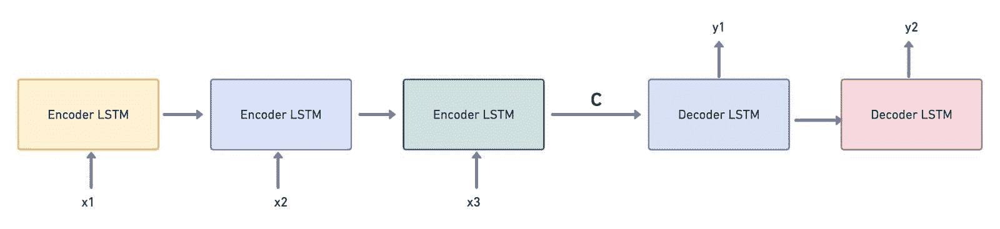
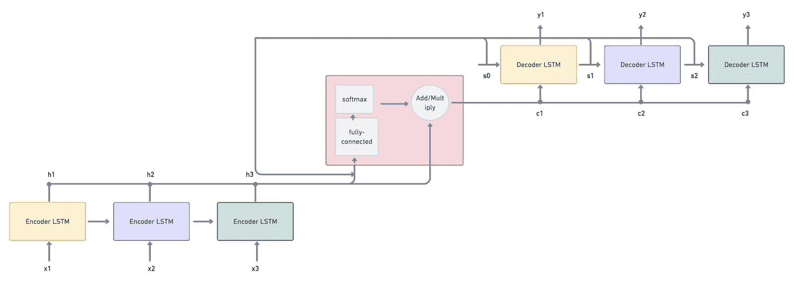
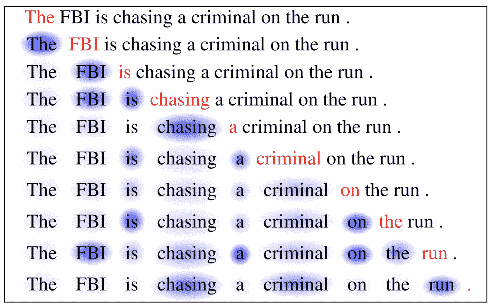
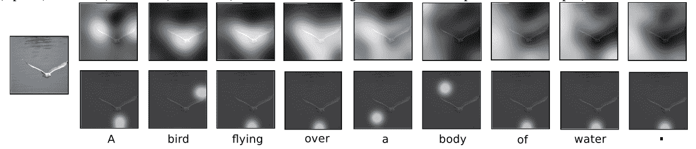
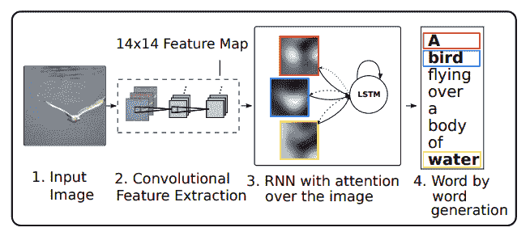
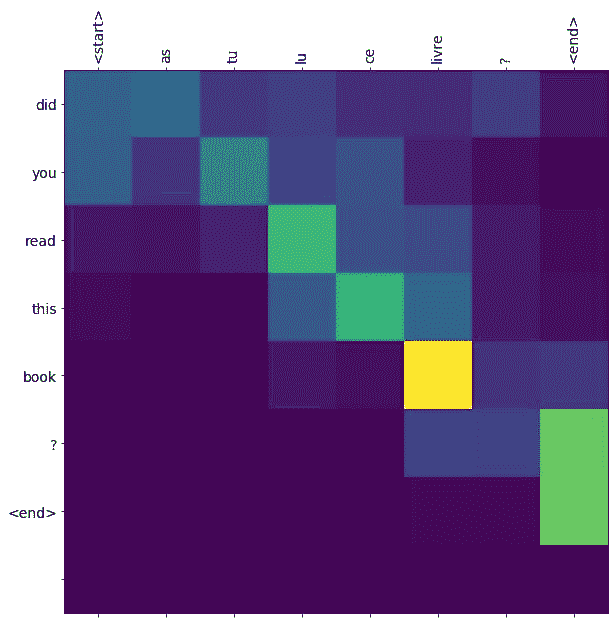
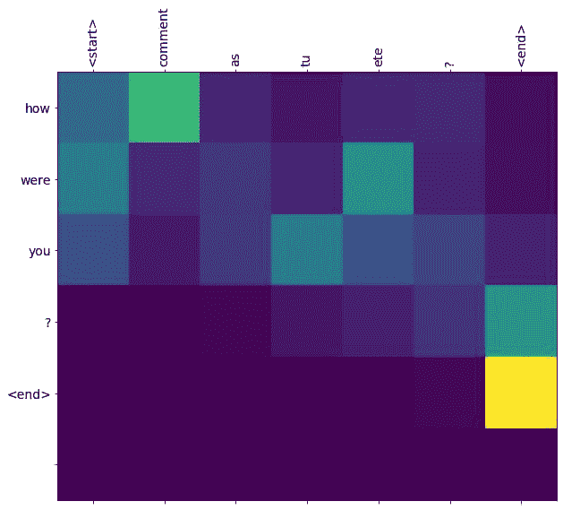

# 具有 Keras 的递归神经网络的注意机制

> 原文：<https://blog.paperspace.com/seq-to-seq-attention-mechanism-keras/>

在本教程中，我们将介绍 RNNs 中的注意机制:它们如何工作，网络架构，它们的应用，以及如何使用 Keras 实现注意机制。

具体来说，我们将涵盖:

*   用于神经机器翻译的序列到序列模型的问题
*   注意力机制导论
*   注意机制的类别
*   注意机制的应用
*   使用具有注意机制的 RNN 的神经机器翻译
*   结论

你可以从 [Gradient 社区笔记本](https://ml-showcase.paperspace.com/projects/neural-machine-translation-with-keras)的免费 GPU 上运行本教程中的所有代码。

我们开始吧！

*注意:本系列中的所有例子(高级 RNNs)都是在 **TensorFlow 2.x** 上训练的。*

## 用于神经机器翻译的序列到序列模型的问题

机器翻译问题促使我们发明了“注意力机制”。机器翻译是从一种语言到另一种语言的自动转换。这种转换必须使用计算机程序进行，该程序必须具有将文本从一种语言转换成另一种语言的智能。当神经网络执行这项工作时，它被称为“*神经机器翻译*”。

由于人类语言的模糊性和复杂性，机器翻译是人工智能中最具挑战性的问题之一。

尽管很复杂，我们已经看到了许多解决这个问题的方法。

神经网络在设计机器翻译过程自动化的方法中发挥了至关重要的作用。第一个适合这种应用的神经网络是序列对序列模型。

如 *[编码器-解码器序列到序列模型介绍(Seq2Seq)](https://blog.paperspace.com/introduction-to-seq2seq-models/) ，*所示，序列到序列模型包括编码器和解码器，其中编码器产生上下文向量(编码表示)作为副产品。这个向量被提供给解码器，然后开始产生输出。

有趣的是，这就是通常的翻译过程。



A sequence-to-sequence model with ‘c’ as the encoded (context) vector

编码器-解码器序列到序列模型本身类似于当前的翻译过程。它包括将源语言编码成合适的表示形式，然后将其解码成目标语言，其中输入和输出向量不必大小相同。然而，这种模式也存在一些问题:

*   **上下文向量具有固定长度**。假设有一个很长的序列需要被编码。由于编码向量的大小不变，网络很难定义长序列的编码表示。通常，它可能会忘记序列的早期部分，导致重要信息的丢失。
*   **序列到序列模型将** **编码器的最终状态视为要传递给解码器**的上下文向量。换句话说，它不检查编码过程中生成的中间状态。如果涉及长序列的输入数据，这也会导致信息丢失。

这两个因素会成为提高序列到序列模型性能的瓶颈。为了根除这个问题，我们可以通过使模型能够软搜索输入来过滤其中的相关位置，从而扩展这个架构。然后，它可以基于相对上下文向量和所有先前生成的输出单词来预测输出。

这正是注意力机制所做的！

## 注意力机制导论

按照典型的英语词汇，“注意力”指的是将你的注意力集中在某件事情上。如果我们考虑神经机器翻译的例子，你认为“注意力”在哪里？

注意机制旨在解决我们在用序列到序列模型训练神经机器翻译模型时讨论的两个问题。首先，当存在注意力整合时，该模型不需要将编码输出压缩到单个上下文向量中。相反，它将输入序列编码成向量序列，并根据解码器的隐藏状态选择这些向量的子集。简而言之，注意力被用来选择什么是必要的，而不会放过其他必要的信息。

这就是带有注意力机制的 RNN 模型的样子:



An RNN Model with “Attention Mechanism”

下面是如何使用注意力机制解决机器翻译问题的一步一步的过程:

*   首先，输入序列$ x1，x2，x3 $被提供给编码器 LSTM。矢量$ h1，H2，H3 $由编码器从给定的输入序列中计算出来。这些向量是给予注意力机制的输入。随后，解码器输入第一状态向量$s_0$，该向量也作为注意机制的输入。我们现在有$s_0$和$h_1，h_2，h_3$作为输入。
*   注意机制模式(用红框表示)接受输入，并通过全连接网络和 softmax 激活功能传递它们，从而生成“注意权重”。
*   然后计算编码器输出向量的加权和，得到上下文向量$c_1$。这里，向量根据注意力权重进行缩放。
*   现在，解码器的工作是处理状态和上下文向量，以生成输出向量$y_1$。
*   解码器还产生结果状态向量$s_1$，它与编码器的输出一起再次提供给注意机制模型。
*   这产生了加权和，产生了上下文向量$c_2$。
*   这个过程继续进行，直到所有的解码器都产生了输出向量$y_1，y_2，y_3$。

> 注意机制模型的问题在于，上下文向量使解码器能够只关注其输入的某些部分(事实上，上下文向量是从编码器的输出中生成的)。通过这种方式，模型会关注它认为对确定输出至关重要的所有输入。

## 注意机制的类别

我们可以将注意机制大致分为三类:自我注意、软注意和硬注意机制。

### 自我关注

自我关注有助于模型内部的互动。用于机器阅读论文的[长短期记忆网络使用自我关注。学习过程如下例所示:](https://arxiv.org/pdf/1601.06733.pdf)



The word in red is the current word being read. The blue colour indicates the activation level (memories). [[Source](https://arxiv.org/pdf/1601.06733.pdf)]

这里的注意力是在相同的序列内计算的。换句话说，自我注意使输入元素能够相互作用。

### 柔和的注意力

软注意“柔和地”将注意力权重放在输入(图像/句子)的所有块上，即，它采用加权平均机制。它测量关于输入的各种组块的注意力，并输出加权的输入特征。它通过给与手头任务无关的区域分配较低的权重来抹黑它们。这样，软注意就不会把注意力局限在图像或句子的特定部分；而是不断学习。

软注意是一种完全可微分的注意机制，其中梯度可以在反向传播期间自动传播。

### 强烈的关注

“硬”，顾名思义，只针对图像/句子的特定部分。在反向传播过程中，为了估计所有其他状态的梯度，我们需要使用蒙特卡罗方法进行采样并对结果进行平均。



Soft (top row) vs Hard (bottom row) Attention [[Source](https://arxiv.org/pdf/1502.03044.pdf)]

## 注意机制的应用

注意力机制的几个应用包括:

*   图像字幕
*   语音识别
*   机器翻译
*   无人驾驶汽车
*   文档摘要



Image Captioning Model using Attention Mechanism [[Source](https://arxiv.org/pdf/1502.03044.pdf)]

## 使用具有注意机制的 RNN 的神经机器翻译

RNN 可以用来实现机器翻译。一般来说，一个简单的 RNN 加上一个编码器-解码器序列到序列模型就可以完成这项工作。然而，如章节“*神经机器翻译的序列到序列模型的问题*中所述，编码输出的压缩表示可能会忽略翻译过程所需的重要特征。为了根除这个问题，当我们用编码器-解码器序列到序列模型嵌入注意机制时，当涉及长的文本序列时，我们不必在信息损失上妥协。

注意力机制集中在所有的输入上，这些输入是产生输出所真正需要的。这里不涉及压缩。相反，它会考虑编码器的所有输出，并根据解码器的隐藏状态为它们分配重要性。

下面是一个使用 RNN 模型(带注意机制的编码器-解码器序列到序列)进行法语到英语翻译的逐步过程。

不要忘记，你可以跟随代码，并从[渐变社区笔记本](https://ml-showcase.paperspace.com/projects/neural-machine-translation-with-keras)的免费 GPU 上运行它。

### 步骤 1:导入数据集

首先，导入英语到法语的数据集([下载链接](http://www.manythings.org/anki/fra-eng.zip))。它有大约 185，583 个语言翻译对。

解包数据集并存储`txt`文件路径。

```py
# Untar the dataset
!unzip 'fra-eng.zip'

# Get the txt file which has English -> French translation
path_to_file = "fra.txt"
```

### 步骤 2:预处理数据集

数据集包含 Unicode 字符，必须对其进行规范化。

此外，必须使用正则表达式库清理序列中的所有标记。

删除不需要的空格，在每个单词和其后的标点符号之间包含一个空格(以区分两者)，用空格替换不需要的字符，并添加`<start>`和`<end>`标记来指定序列的开始和结束。

将 unicode 转换封装在函数`unicode_to_ascii()`中，将序列预处理封装在函数`preprocess_sentence()`中。

```py
import unicodedata

import re

# Convert the unicode sequence to ascii
def unicode_to_ascii(s):

  # Normalize the unicode string and remove the non-spacking mark
  return ''.join(c for c in unicodedata.normalize('NFD', s)
      if unicodedata.category(c) != 'Mn')

# Preprocess the sequence
def preprocess_sentence(w):

  # Clean the sequence
  w = unicode_to_ascii(w.lower().strip())

  # Create a space between word and the punctuation following it
  w = re.sub(r"([?.!,¿])", r" \1 ", w)
  w = re.sub(r'[" "]+', " ", w)

  # Replace everything with space except (a-z, A-Z, ".", "?", "!", ",")
  w = re.sub(r"[^a-zA-Z?.!,¿]+", " ", w)

  w = w.strip()

  # Add a start and stop token to detect the start and end of the sequence
  w = '<start> ' + w + ' <end>'
  return w
```

### 步骤 3:准备数据集

接下来，从我们拥有的原始数据中准备一个数据集。将英语序列和它们相关的法语序列组合起来，创建单词对。

```py
import io

# Create the Dataset
def create_dataset(path, num_examples):
  lines = io.open(path, encoding='UTF-8').read().strip().split('\n')

  # Loop through lines (sequences) and extract the English and French sequences. Store them as a word-pair
  word_pairs = [[preprocess_sentence(w) for w in l.split('\t', 2)[:-1]]  for l in lines[:num_examples]]
  return zip(*word_pairs)
```

检查数据集是否已正确创建。

```py
en, fra = create_dataset(path_to_file, None)
print(en[-1])
print(fra[-1])
```

```py
# Output
<start> if someone who doesn t know your background says that you sound like a native speaker , it means they probably noticed something about your speaking that made them realize you weren t a native speaker . in other words , you don t really sound like a native speaker . <end>
<start> si quelqu un qui ne connait pas vos antecedents dit que vous parlez comme un locuteur natif , cela veut dire qu il a probablement remarque quelque chose a propos de votre elocution qui lui a fait prendre conscience que vous n etes pas un locuteur natif . en d autres termes , vous ne parlez pas vraiment comme un locuteur natif . <end> 
```

现在标记序列。记号化是创建包括英语和法语记号(即单词)的内部词汇表、将记号(或者一般来说，序列)转换成整数、并填充它们以使序列具有相同长度的机制。总而言之，标记化促进了模型训练过程。

创建一个函数`tokenize()`来封装上述所有需求。

```py
import tensorflow as tf

# Convert sequences to tokenizers
def tokenize(lang):
  lang_tokenizer = tf.keras.preprocessing.text.Tokenizer(
      filters='')

  # Convert sequences into internal vocab
  lang_tokenizer.fit_on_texts(lang)

  # Convert internal vocab to numbers
  tensor = lang_tokenizer.texts_to_sequences(lang)

  # Pad the tensors to assign equal length to all the sequences
  tensor = tf.keras.preprocessing.sequence.pad_sequences(tensor,
                                                         padding='post')

  return tensor, lang_tokenizer
```

通过调用`create_dataset()`和`tokenize()`函数加载标记化的数据集。

```py
# Load the dataset
def load_dataset(path, num_examples=None):

  # Create dataset (targ_lan = English, inp_lang = French)
  targ_lang, inp_lang = create_dataset(path, num_examples)

  # Tokenize the sequences
  input_tensor, inp_lang_tokenizer = tokenize(inp_lang)
  target_tensor, targ_lang_tokenizer = tokenize(targ_lang)

  return input_tensor, target_tensor, inp_lang_tokenizer, targ_lang_tokenizer
```

减少训练模型所需的数据样本数量。使用整个数据集将消耗更多的时间来训练模型。

```py
# Consider 50k examples
num_examples = 50000
input_tensor, target_tensor, inp_lang, targ_lang = load_dataset(path_to_file, num_examples)

# Calculate max_length of the target tensors
max_length_targ, max_length_inp = target_tensor.shape[1], input_tensor.shape[1]
```

输入和目标张量的`max_length`对于确定每个序列的最大填充长度至关重要。

### 步骤 4:创建数据集

分离训练和验证数据集。

```py
!pip3 install sklearn

from sklearn.model_selection import train_test_split

# Create training and validation sets using an 80/20 split
input_tensor_train, input_tensor_val, target_tensor_train, target_tensor_val = train_test_split(input_tensor, target_tensor, test_size=0.2)

print(len(input_tensor_train), len(target_tensor_train), len(input_tensor_val), len(target_tensor_val))
```

```py
# Output
40000 40000 10000 10000
```

验证在序列的标记和索引之间创建的映射。

```py
# Show the mapping b/w word index and language tokenizer
def convert(lang, tensor):
  for t in tensor:
    if t != 0:
      print ("%d ----> %s" % (t, lang.index_word[t]))

print ("Input Language; index to word mapping")
convert(inp_lang, input_tensor_train[0])
print ()
print ("Target Language; index to word mapping")
convert(targ_lang, target_tensor_train[0])
```

```py
# Output
Input Language; index to word mapping
1 ----> <start>
140 ----> quel
408 ----> idiot
3 ----> .
2 ----> <end>

Target Language; index to word mapping
1 ----> <start>
33 ----> what
86 ----> an
661 ----> idiot
36 ----> !
2 ----> <end> 
```

### 步骤 5:初始化模型参数

有了数据集，开始初始化模型参数。

*   `BUFFER_SIZE`:输入/目标样本总数。在我们的模型中，它是 40，000。
*   `BATCH_SIZE`:训练批次的长度。
*   `steps_per_epoch`:每个历元的步数。通过将`BUFFER_SIZE`除以`BATCH_SIZE`来计算。
*   `embedding_dim`:嵌入层的节点数。
*   `units`:网络中的隐藏单元。
*   `vocab_inp_size`:输入(法语)词汇的长度。
*   `vocab_tar_size`:输出(英语)词汇的长度。

```py
# Essential model parameters
BUFFER_SIZE = len(input_tensor_train)
BATCH_SIZE = 64
steps_per_epoch = len(input_tensor_train)//BATCH_SIZE
embedding_dim = 256
units = 1024
vocab_inp_size = len(inp_lang.word_index) + 1
vocab_tar_size = len(targ_lang.word_index) + 1
```

接下来，调用`tf.data.Dataset` API 并创建一个合适的数据集。

```py
dataset = tf.data.Dataset.from_tensor_slices((input_tensor_train, target_tensor_train)).shuffle(BUFFER_SIZE)
dataset = dataset.batch(BATCH_SIZE, drop_remainder=True)
```

验证新创建的数据集的输入批次和目标批次的形状。

```py
# Size of input and target batches
example_input_batch, example_target_batch = next(iter(dataset))
example_input_batch.shape, example_target_batch.shape
```

```py
# Output
(TensorShape([64, 19]), TensorShape([64, 11])) 
```

`19`和`11`表示输入(法语)和目标(英语)序列的最大填充长度。

### 步骤 6:编码器类

创建编码器-解码器序列到序列模型(具有注意机制)的第一步是创建编码器。对于手头的应用程序，创建一个编码器，其嵌入层后跟一个 GRU(门控递归单元)层。输入首先通过嵌入层，然后进入 GRU 层。GRU 层输出编码器网络输出和隐藏状态。

将模型的`__init__()`和`call()`方法放在一个类`Encoder`中。

在方法`__init__()`中，初始化批量大小和编码单位。添加一个嵌入层，接受`vocab_size`作为输入维度，接受`embedding_dim`作为输出维度。另外，添加一个接受`units`(输出空间的维度)和第一个隐藏维度的 GRU 层。

在方法`call()`中，定义必须通过编码器网络发生的正向传播。

此外，定义一个方法`initialize_hidden_state()`，用维度`batch_size`和`units`初始化隐藏状态。

添加以下代码作为您的`Encoder`类的一部分。

```py
# Encoder class
class Encoder(tf.keras.Model):
  def __init__(self, vocab_size, embedding_dim, enc_units, batch_sz):
    super(Encoder, self).__init__()
    self.batch_sz = batch_sz
    self.enc_units = enc_units

    # Embed the vocab to a dense embedding 
    self.embedding = tf.keras.layers.Embedding(vocab_size, embedding_dim)

    # GRU Layer
    # glorot_uniform: Initializer for the recurrent_kernel weights matrix, 
    # used for the linear transformation of the recurrent state
    self.gru = tf.keras.layers.GRU(self.enc_units,
                                   return_sequences=True,
                                   return_state=True,
                                   recurrent_initializer='glorot_uniform')

  # Encoder network comprises an Embedding layer followed by a GRU layer
  def call(self, x, hidden):
    x = self.embedding(x)
    output, state = self.gru(x, initial_state=hidden)
    return output, state

  # To initialize the hidden state
  def initialize_hidden_state(self):
    return tf.zeros((self.batch_sz, self.enc_units))
```

调用 encoder 类来检查编码器输出的形状和隐藏状态。

```py
encoder = Encoder(vocab_inp_size, embedding_dim, units, BATCH_SIZE)

sample_hidden = encoder.initialize_hidden_state()
sample_output, sample_hidden = encoder(example_input_batch, sample_hidden)

print ('Encoder output shape: (batch size, sequence length, units) {}'.format(sample_output.shape))
print ('Encoder Hidden state shape: (batch size, units) {}'.format(sample_hidden.shape))
```

```py
# Output
Encoder output shape: (batch size, sequence length, units) (64, 19, 1024)
Encoder Hidden state shape: (batch size, units) (64, 1024) 
```

### 第七步:注意机制类

这一步抓住了注意力机制。

*   计算编码器输出和解码器状态的和(或积)。
*   通过完全连接的网络传递生成的输出。
*   对输出应用 softmax 激活。这赋予了注意力权重。
*   通过计算注意力权重和编码器输出的加权和来创建上下文向量。

到目前为止，所有的东西都需要被捕获到一个类`BahdanauAttention`中。 **Bahdanau 注意力**也被称为“加法注意力”，一种软注意力技术。由于这是附加注意，我们做编码器的输出和解码器隐藏状态的总和(如第一步所述)。

这个类必须有`__init__()`和`call()`方法。

在`__init__()`方法中，初始化三个`Dense`层:一个用于解码器状态(“单位”是大小)，另一个用于编码器的输出(“单位”是大小)，另一个用于全连接网络(一个节点)。

在`call()`方法中，通过获取最终的编码器隐藏状态来初始化解码器状态($s_0$)。将生成的解码器隐藏状态通过一个密集层。此外，通过另一个密集层插入编码器的输出。将两个输出相加，将它们封装在一个`tanh`激活中，并将它们插入全连接层。这个全连接层有一个节点；因此，最终输出的尺寸为`batch_size * max_length of the sequence * 1`。

稍后，对全连接网络的输出应用 softmax 以生成注意力权重。

通过对注意力权重和编码器的输出进行加权求和来计算`context_vector`。

```py
# Attention Mechanism
class BahdanauAttention(tf.keras.layers.Layer):
  def __init__(self, units):
    super(BahdanauAttention, self).__init__()
    self.W1 = tf.keras.layers.Dense(units)
    self.W2 = tf.keras.layers.Dense(units)
    self.V = tf.keras.layers.Dense(1)

  def call(self, query, values):
    # query hidden state shape == (batch_size, hidden size)
    # values shape == (batch_size, max_len, hidden size)

    # we are doing this to broadcast addition along the time axis to calculate the score
    # query_with_time_axis shape == (batch_size, 1, hidden size)
    query_with_time_axis = tf.expand_dims(query, 1)

    # score shape == (batch_size, max_length, 1)
    # we get 1 at the last axis because we are applying score to self.V
    # the shape of the tensor before applying self.V is (batch_size, max_length, units)
    score = self.V(tf.nn.tanh(
        self.W1(query_with_time_axis) + self.W2(values)))

    # attention_weights shape == (batch_size, max_length, 1)
    attention_weights = tf.nn.softmax(score, axis=1)

    # context_vector shape after sum == (batch_size, hidden_size)
    context_vector = attention_weights * values
    context_vector = tf.reduce_sum(context_vector, axis=1)

    return context_vector, attention_weights
```

验证注意力权重的形状及其输出。

```py
attention_layer = BahdanauAttention(10)
attention_result, attention_weights = attention_layer(sample_hidden, sample_output)

print("Attention result shape: (batch size, units) {}".format(attention_result.shape))
print("Attention weights shape: (batch_size, sequence_length, 1) {}".format(attention_weights.shape))
```

```py
# Output
Attention result shape: (batch size, units) (64, 1024)
Attention weights shape: (batch_size, sequence_length, 1) (64, 19, 1) 
```

`sample_hidden`这里是编码器的隐藏状态，`sample_output`表示编码器的输出。

### 步骤 8:解码器类

这一步封装了解码机制。这个`Decoder`类必须有两个方法:`__init__()`和`call()`。

在`__init__()`方法中，初始化批量大小、解码器单元、嵌入维度、GRU 层和密集层。另外，创建一个`BahdanauAttention`类的实例。

在`call()`方法中:

*   调用注意力向前传播并捕获上下文向量和注意力权重。
*   通过嵌入层发送目标令牌。
*   连接嵌入的输出和上下文向量。
*   将输出插入 GRU 层，然后插入全连接层。

添加以下代码来定义`Decoder`类。

```py
# Decoder class
class Decoder(tf.keras.Model):
  def __init__(self, vocab_size, embedding_dim, dec_units, batch_sz):
    super(Decoder, self).__init__()
    self.batch_sz = batch_sz
    self.dec_units = dec_units
    self.embedding = tf.keras.layers.Embedding(vocab_size, embedding_dim)
    self.gru = tf.keras.layers.GRU(self.dec_units,
                                   return_sequences=True,
                                   return_state=True,
                                   recurrent_initializer='glorot_uniform')
    self.fc = tf.keras.layers.Dense(vocab_size)

    # Used for attention
    self.attention = BahdanauAttention(self.dec_units)

  def call(self, x, hidden, enc_output):
    # x shape == (batch_size, 1)
    # hidden shape == (batch_size, max_length)
    # enc_output shape == (batch_size, max_length, hidden_size)

    # context_vector shape == (batch_size, hidden_size)
    # attention_weights shape == (batch_size, max_length, 1)
    context_vector, attention_weights = self.attention(hidden, enc_output)

    # x shape after passing through embedding == (batch_size, 1, embedding_dim)
    x = self.embedding(x)

    # x shape after concatenation == (batch_size, 1, embedding_dim + hidden_size)
    x = tf.concat([tf.expand_dims(context_vector, 1), x], axis=-1)

    # passing the concatenated vector to the GRU
    output, state = self.gru(x)

    # output shape == (batch_size * 1, hidden_size)
    output = tf.reshape(output, (-1, output.shape[2]))

    # output shape == (batch_size, vocab)
    x = self.fc(output)

    return x, state, attention_weights
```

验证解码器输出形状。

```py
decoder = Decoder(vocab_tar_size, embedding_dim, units, BATCH_SIZE)

sample_decoder_output, _, _ = decoder(tf.random.uniform((BATCH_SIZE, 1)),
                                      sample_hidden, sample_output)

print ('Decoder output shape: (batch_size, vocab size) {}'.format(sample_decoder_output.shape))
```

```py
# Output
Decoder output shape: (batch_size, vocab size) (64, 5892)
```

### 步骤 9:优化器和损失函数

定义优化器和损失函数。

由于输入序列是用零填充的，所以当`real`值为零时，可以消除损失。

```py
# Initialize optimizer and loss functions
optimizer = tf.keras.optimizers.Adam()

loss_object = tf.keras.losses.SparseCategoricalCrossentropy(
    from_logits=True, reduction='none')

# Loss function
def loss_function(real, pred):

  # Take care of the padding. Not all sequences are of equal length.
  # If there's a '0' in the sequence, the loss is being nullified
  mask = tf.math.logical_not(tf.math.equal(real, 0))
  loss_ = loss_object(real, pred)

  mask = tf.cast(mask, dtype=loss_.dtype)
  loss_ *= mask

  return tf.reduce_mean(loss_)
```

### 步骤 10:训练模型

在训练期间检查你的模型的重量。这有助于在评估模型时自动检索权重。

```py
import os

checkpoint_dir = './training_checkpoints'
checkpoint_prefix = os.path.join(checkpoint_dir, "ckpt")
checkpoint = tf.train.Checkpoint(optimizer=optimizer,
                                 encoder=encoder,
                                 decoder=decoder)
```

接下来，定义培训程序。首先，调用编码器类并获取编码器输出和最终隐藏状态。初始化解码器输入，使`<start>`令牌分布在所有输入序列上(使用`BATCH_SIZE`指示)。使用*教师强制技术*通过将目标作为下一个输入来迭代所有解码器状态。这个循环一直持续到目标序列(英语)中的每个标记都被访问。

用解码器输入、解码器隐藏状态和编码器输出调用解码器类。获取解码器输出和隐藏状态。通过比较目标的实际值和预测值来计算损失。获取目标令牌并将其馈送到下一个解码器状态(关于后续目标令牌)。此外，请注意，目标解码器隐藏状态将是下一个解码器隐藏状态。

教师强制技术完成后，计算批量损失，并运行优化器来更新模型的变量。

```py
@tf.function
def train_step(inp, targ, enc_hidden):
  loss = 0

  # tf.GradientTape() -- record operations for automatic differentiation
  with tf.GradientTape() as tape:
    enc_output, enc_hidden = encoder(inp, enc_hidden)

    # dec_hidden is used by attention, hence is the same enc_hidden
    dec_hidden = enc_hidden

    # <start> token is the initial decoder input
    dec_input = tf.expand_dims([targ_lang.word_index['<start>']] * BATCH_SIZE, 1)

    # Teacher forcing - feeding the target as the next input
    for t in range(1, targ.shape[1]):

      # Pass enc_output to the decoder
      predictions, dec_hidden, _ = decoder(dec_input, dec_hidden, enc_output)

      # Compute the loss
      loss += loss_function(targ[:, t], predictions)

      # Use teacher forcing
      dec_input = tf.expand_dims(targ[:, t], 1)

  # As this function is called per batch, compute the batch_loss
  batch_loss = (loss / int(targ.shape[1]))

  # Get the model's variables
  variables = encoder.trainable_variables + decoder.trainable_variables

  # Compute the gradients
  gradients = tape.gradient(loss, variables)

  # Update the variables of the model/network
  optimizer.apply_gradients(zip(gradients, variables))

  return batch_loss
```

现在初始化实际的训练循环。运行指定次数的循环。首先，使用方法`initialize_hidden_state()`初始化编码器隐藏状态。一次循环一批数据集(每个历元)。每批调用`train_step()`方法，计算损耗。继续进行，直到覆盖了所有的时期。

```py
import time

EPOCHS = 30

# Training loop
for epoch in range(EPOCHS):
  start = time.time()

  # Initialize the hidden state
  enc_hidden = encoder.initialize_hidden_state()
  total_loss = 0

  # Loop through the dataset
  for (batch, (inp, targ)) in enumerate(dataset.take(steps_per_epoch)):

    # Call the train method
    batch_loss = train_step(inp, targ, enc_hidden)

    # Compute the loss (per batch)
    total_loss += batch_loss

    if batch % 100 == 0:
      print('Epoch {} Batch {} Loss {:.4f}'.format(epoch + 1,
                                                   batch,
                                                   batch_loss.numpy()))
  # Save (checkpoint) the model every 2 epochs
  if (epoch + 1) % 2 == 0:
    checkpoint.save(file_prefix = checkpoint_prefix)

  # Output the loss observed until that epoch
  print('Epoch {} Loss {:.4f}'.format(epoch + 1,
                                      total_loss / steps_per_epoch))

  print('Time taken for 1 epoch {} sec\n'.format(time.time() - start))
```

```py
# Output
Epoch 1 Batch 0 Loss 0.0695
Epoch 1 Batch 100 Loss 0.0748
Epoch 1 Batch 200 Loss 0.0844
Epoch 1 Batch 300 Loss 0.0900
Epoch 1 Batch 400 Loss 0.1104
Epoch 1 Batch 500 Loss 0.1273
Epoch 1 Batch 600 Loss 0.1203
Epoch 1 Loss 0.0944
Time taken for 1 epoch 113.93592977523804 sec

Epoch 2 Batch 0 Loss 0.0705
Epoch 2 Batch 100 Loss 0.0870
Epoch 2 Batch 200 Loss 0.1189
Epoch 2 Batch 300 Loss 0.0995
Epoch 2 Batch 400 Loss 0.1375
Epoch 2 Batch 500 Loss 0.0996
Epoch 2 Batch 600 Loss 0.1054
Epoch 2 Loss 0.0860
Time taken for 1 epoch 115.66511249542236 sec

Epoch 3 Batch 0 Loss 0.0920
Epoch 3 Batch 100 Loss 0.0709
Epoch 3 Batch 200 Loss 0.0667
Epoch 3 Batch 300 Loss 0.0580
Epoch 3 Batch 400 Loss 0.0921
Epoch 3 Batch 500 Loss 0.0534
Epoch 3 Batch 600 Loss 0.1243
Epoch 3 Loss 0.0796
Time taken for 1 epoch 114.04204559326172 sec

Epoch 4 Batch 0 Loss 0.0847
Epoch 4 Batch 100 Loss 0.0524
Epoch 4 Batch 200 Loss 0.0668
Epoch 4 Batch 300 Loss 0.0498
Epoch 4 Batch 400 Loss 0.0776
Epoch 4 Batch 500 Loss 0.0614
Epoch 4 Batch 600 Loss 0.0616
Epoch 4 Loss 0.0734
Time taken for 1 epoch 114.43488264083862 sec

Epoch 5 Batch 0 Loss 0.0570
Epoch 5 Batch 100 Loss 0.0554
Epoch 5 Batch 200 Loss 0.0731
Epoch 5 Batch 300 Loss 0.0668
Epoch 5 Batch 400 Loss 0.0510
Epoch 5 Batch 500 Loss 0.0630
Epoch 5 Batch 600 Loss 0.0809
Epoch 5 Loss 0.0698
Time taken for 1 epoch 114.07995843887329 sec

Epoch 6 Batch 0 Loss 0.0842
Epoch 6 Batch 100 Loss 0.0489
Epoch 6 Batch 200 Loss 0.0540
Epoch 6 Batch 300 Loss 0.0809
Epoch 6 Batch 400 Loss 0.0807
Epoch 6 Batch 500 Loss 0.0590
Epoch 6 Batch 600 Loss 0.1161
Epoch 6 Loss 0.0684
Time taken for 1 epoch 114.42468786239624 sec
…
Epoch 29 Batch 0 Loss 0.0376
Epoch 29 Batch 100 Loss 0.0478
Epoch 29 Batch 200 Loss 0.0489
Epoch 29 Batch 300 Loss 0.0251
Epoch 29 Batch 400 Loss 0.0296
Epoch 29 Batch 500 Loss 0.0385
Epoch 29 Batch 600 Loss 0.0638
Epoch 29 Loss 0.0396
Time taken for 1 epoch 114.00363779067993 sec

Epoch 30 Batch 0 Loss 0.0196
Epoch 30 Batch 100 Loss 0.0246
Epoch 30 Batch 200 Loss 0.0296
Epoch 30 Batch 300 Loss 0.0204
Epoch 30 Batch 400 Loss 0.0269
Epoch 30 Batch 500 Loss 0.0598
Epoch 30 Batch 600 Loss 0.0290
Epoch 30 Loss 0.0377
Time taken for 1 epoch 114.20779871940613 sec 
```

### 步骤 11:测试模型

现在定义您的模型评估过程。首先，考虑用户给出的句子。这必须用法语给出。该模型现在必须将句子从法语转换成英语。

用 Y 轴上的`max_length_target`和 X 轴上的`max_length_input`初始化稍后要绘制的空白注意力图。

对句子进行预处理，转换成张量。

然后把句子代入模型。

初始化一个空的隐藏状态，该状态将在初始化编码器时使用。通常，编码器类中的`initialize_hidden_state()`方法给出了维度为`batch_size * hidden_units`的隐藏状态。现在，由于批处理大小为$1$，初始隐藏状态必须手动初始化。

调用编码器类并获得编码器输出和最终隐藏状态。

通过循环遍历`max_length_targ`，调用解码器类，其中`dec_input`是`<start>`令牌，`dec_hidden`状态是编码器隐藏状态，`enc_out`是编码器的输出。获取解码器输出、隐藏状态和注意力权重。

使用注意力权重创建一个图。获取最受关注的预测令牌。将标记附加到结果中，继续执行，直到到达`<end>`标记。

下一个解码器输入将是先前预测的索引(关于令牌)。

添加以下代码作为`evaluate()`函数的一部分。

```py
import numpy as np

# Evaluate function -- similar to the training loop
def evaluate(sentence):

  # Attention plot (to be plotted later on) -- initialized with max_lengths of both target and input
  attention_plot = np.zeros((max_length_targ, max_length_inp))

  # Preprocess the sentence given
  sentence = preprocess_sentence(sentence)

  # Fetch the indices concerning the words in the sentence and pad the sequence
  inputs = [inp_lang.word_index[i] for i in sentence.split(' ')]
  inputs = tf.keras.preprocessing.sequence.pad_sequences([inputs],
                                                         maxlen=max_length_inp,
                                                         padding='post')
  # Convert the inputs to tensors
  inputs = tf.convert_to_tensor(inputs)

  result = ''

  hidden = [tf.zeros((1, units))]
  enc_out, enc_hidden = encoder(inputs, hidden)

  dec_hidden = enc_hidden
  dec_input = tf.expand_dims([targ_lang.word_index['<start>']], 0)

  # Loop until the max_length is reached for the target lang (ENGLISH)
  for t in range(max_length_targ):
    predictions, dec_hidden, attention_weights = decoder(dec_input,
                                                         dec_hidden,
                                                         enc_out)

    # Store the attention weights to plot later on
    attention_weights = tf.reshape(attention_weights, (-1, ))
    attention_plot[t] = attention_weights.numpy()

    # Get the prediction with the maximum attention
    predicted_id = tf.argmax(predictions[0]).numpy()

    # Append the token to the result
    result += targ_lang.index_word[predicted_id] + ' '

    # If <end> token is reached, return the result, input, and attention plot
    if targ_lang.index_word[predicted_id] == '<end>':
      return result, sentence, attention_plot

    # The predicted ID is fed back into the model
    dec_input = tf.expand_dims([predicted_id], 0)

  return result, sentence, attention_plot
```

### 第十二步:计划和预测

定义`plot_attention()`函数来绘制注意力统计数据。

```py
import matplotlib.pyplot as plt
import matplotlib.ticker as ticker

# Function for plotting the attention weights
def plot_attention(attention, sentence, predicted_sentence):
  fig = plt.figure(figsize=(10,10))
  ax = fig.add_subplot(1, 1, 1)
  ax.matshow(attention, cmap='viridis')

  fontdict = {'fontsize': 14}

  ax.set_xticklabels([''] + sentence, fontdict=fontdict, rotation=90)
  ax.set_yticklabels([''] + predicted_sentence, fontdict=fontdict)

  ax.xaxis.set_major_locator(ticker.MultipleLocator(1))
  ax.yaxis.set_major_locator(ticker.MultipleLocator(1))

  plt.show()
```

定义一个函数`translate()`，它在内部调用`evaluate()`函数。

```py
# Translate function (which internally calls the evaluate function)
def translate(sentence):
  result, sentence, attention_plot = evaluate(sentence)

  print('Input: %s' % (sentence))
  print('Predicted translation: {}'.format(result))

  attention_plot = attention_plot[:len(result.split(' ')), :len(sentence.split(' '))]
  plot_attention(attention_plot, sentence.split(' '), result.split(' '))
```

将保存的检查点恢复到`model`。

```py
# Restore the latest checkpoint in checkpoint_dir
checkpoint.restore(tf.train.latest_checkpoint(checkpoint_dir))
```

```py
# Output
<tensorflow.python.training.tracking.util.CheckpointLoadStatus at 0x7fb0916e32d0> 
```

通过输入几个法语句子来调用`translate()`函数。

```py
translate(u"As tu lu ce livre?")
```

```py
# Output
Input: <start> as tu lu ce livre ? <end>
Predicted translation: did you read this book ? <end> 
```



实际翻译过来就是“你读过这本书吗？”

```py
translate(u"Comment as-tu été?")
```

```py
# Output
Input: <start> comment as tu ete ? <end>
Predicted translation: how were you ? <end> 
```



实际的翻译是“你过得怎么样？”

可以推断，预测的翻译接近实际翻译。

## 结论

这是我的 RNNs 系列的最后一部分。在本教程中，你已经了解了注意力机制是怎么回事。您已经了解了它如何优于一般的编码器-解码器序列到序列模型。你还训练了一个神经机器翻译模型，将句子从法语翻译成英语。您可以进一步调整模型的超参数来衡量模型的表现。

我希望你喜欢阅读这个系列！

*参考: [TensorFlow 教程](https://www.tensorflow.org/tutorials/text/nmt_with_attention)*