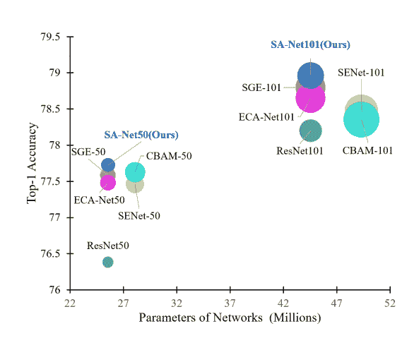
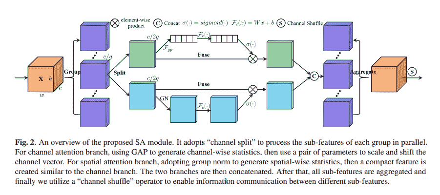
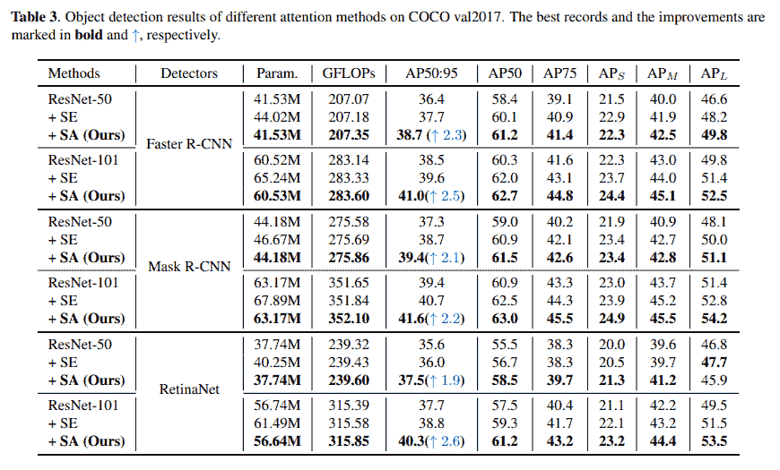
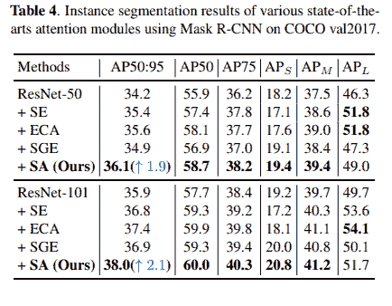
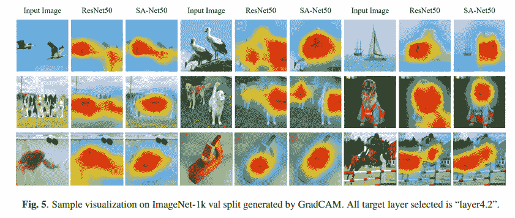

# 深度卷积神经网络(SA-Net)的混洗注意

> 原文：<https://blog.paperspace.com/shuffle-attention-sanet/>

如果一位来自前十年的深度学习研究人员穿越时间来到今天，并询问当前大多数研究都集中在什么主题上，可以很有把握地说*注意力机制*将位于该列表的首位。注意机制在自然语言处理(NLP)和计算机视觉(CV)中都占据了主导地位。在 NLP 中，重点是让类似 transformer 的架构更加高效，而在 CV 中，则更多的是通过即插即用模块来推动 SOTA。

这篇文章的主题也是为了同样的目的。我们正在谈论 ICASSP 2021 年题为 [SA-Net:深度卷积神经网络](https://arxiv.org/pdf/2102.00240.pdf)的 Shuffle Attention。



该论文提出了一种称为 ***混洗注意力*** 的新颖注意力机制，该机制可用于传统骨干网，以最小的计算成本提高性能。在本文中，我们将通过讨论随机注意力背后的动机来开始这一仪式，然后是对网络的结构性剖析，最后以论文中展示的结果及其代码来结束本文。

## 目录

1.  动机
2.  转移注意力
3.  密码
4.  结果
5.  结论
6.  参考

## 论文摘要

> 注意机制使神经网络能够准确地关注输入的所有相关元素，已经成为提高深度神经网络性能的必要组件。在计算机视觉研究中，主要有两种广泛使用的注意机制，空间注意和通道注意，它们分别旨在捕捉像素级的成对关系和通道依赖性。虽然将它们融合在一起可能比它们单独的实现获得更好的性能，但这将不可避免地增加计算开销。本文提出了一种有效的混洗注意模块来解决这个问题，该模块采用混洗单元来有效地结合两种注意机制。具体来说，SA 首先将通道维度分组为多个子特征，然后并行处理它们。然后，对于每个子特征，SA 利用混洗单元来描述空间和通道维度上的特征依赖性。之后，所有子特征被聚集，并且采用“信道混洗”算子来实现不同子特征之间的信息通信。所提出的 SA 模块是高效且有效的，例如，针对主干 ResNet50 的 SA 的参数和计算分别是 300 对 25.56M 和 2.76e-3 GFLOPs 对 4.12 GFLOPs，并且就 Top-1 准确度而言，性能提升超过 1.34%。在常用基准(包括用于分类的 ImageNet-1k、用于对象检测的 MS COCO 和实例分割)上的大量实验结果表明，所提出的模拟退火算法通过实现更高的精度和更低的模型复杂度而显著优于当前的 SOTA 方法。

## 动机

在过去的几年里，注意力机制吸引了深度学习领域许多研究人员的注意，并在今天的研究社区中占据了主导地位。在计算机视觉领域(主要在图像分类和物体识别领域)，像[挤压和激励网络](https://blog.paperspace.com/channel-attention-squeeze-and-excitation-networks/)这样的即插即用模块已经成为更多关注机制的基础。从 [CBAM](https://blog.paperspace.com/attention-mechanisms-in-computer-vision-cbam/) 到 [ECA-Net](https://blog.paperspace.com/attention-mechanisms-in-computer-vision-ecanet/) ，目标一直是提供一个低成本的模块来增加更具代表性的能力，以提高深度卷积神经网络的性能。这些注意机制大多分为两个不同的类别:通道注意和空间注意。前者在特征映射张量的通道维度上聚集特征，而后者在特征映射张量中在每个通道的空间维度上聚集信息。然而，这些类型的注意机制没有充分利用空间和通道注意之间的相关性，这使得它们的效率较低。

本文旨在回答以下问题:

> 我们能不能以一种更轻但更有效的方式融合不同的注意力模块？

作者从三个基本概念中获得灵感，回答了上述问题:

1.  多分支架构
2.  分组特征
3.  注意机制

### 多分支架构

作者从流行的 ShuffleNet v2 架构中获得灵感，该架构有效地构建了多分支结构并并行处理不同的分支。确切地说，输入被分成两个分支，每个分支有$\frac{c}{2}$个通道，其中$c$是通道总数。然后，这两个分支在通过级联合并形成最终输出之前，经过后续卷积层。

### 分组特征

作者依赖于[空间分组增强(SGE)](https://arxiv.org/abs/1905.09646) 注意机制的思想，该机制引入了一种分组策略，该策略将输入特征图张量沿通道维度划分成组。然后，通过一系列操作并行增强这些组。

### 注意机制

与其说是灵感，不如说是文献综述，作者们依次回顾了现有的将通道和空间注意相结合的注意机制，如 [CBAM](https://blog.paperspace.com/attention-mechanisms-in-computer-vision-cbam/) 、GCNet 和 SGE。

## 转移注意力



把无序注意力看作是来自 [SE 通道注意力](https://blog.paperspace.com/channel-attention-squeeze-and-excitation-networks/)、来自 [CBAM](https://blog.paperspace.com/attention-mechanisms-in-computer-vision-cbam/) 的空间注意力和来自 SGE 的通道分组的混合体。随机注意力有四个组成部分:

1.  特征分组
2.  渠道关注
3.  空间注意力
4.  聚合

### 特征分组

随机注意力(SA)中的功能分组属性是两级层次结构。假设注意模块的输入张量是＄\ textbf { x } \ in \mathbb{r}^{c \ ast h \ ast w } ＄,其中＄c＄表示通道维度，而＄h \ ast w＄表示每个特征图的空间维度，则 SA 首先沿着通道维度将＄\ textbf { x }＄分成＄g＄组，使得每个组现在变成＄\ tilde { \ textbf { x } } \ in \mathbb{r}^{\frac{c}{g} \ ast h \ ast w }＄。这些特征组然后被传递到注意模块，在那里它们沿着通道维度被进一步分成两组，每组用于空间和通道注意分支。因此，通过每个空间或通道注意分支的子特征组可以用＄\ hat { \ textbf { x } } \ in \mathbb{r}^{\frac{c}{2g} \ ast h \ ast w }＄表示。

### 渠道关注

对于渠道关注分支，SA 首先通过应用全球平均池(GAP)层将$\hat{\textbf{X}}$减少到${\frac{C}{2G} \ast 1 \ast 1}。简单的选通机制使用一个紧凑的功能来实现精确和自适应选择的指导，然后是一个 sigmoid 激活功能。这可以用下面的数学公式来表示:

$ = \ sigma(\ \ mathematical { f } _ { c })\ CDO \ hat { \ textf { x } = \ sigma(w _ { 1s }+b _ { 1 })\ CDO \ hat { \ textf { x } $。

其中，$ w _ { 1 } \在\mathbb{r}^{\frac{c}{2g} \ ast 1 \ ast 1 } $和$ b _ { 1 } \在\mathbb{r}^{\frac{c}{2g} \ ast 1 \ ast 1 } $是用于缩放和移动间隙的参数($\hat{\textbf{X}}$)。

### 空间注意力

对于空间注意力，输入$\hat{\textbf{X}}$被减少组范数以获得空间方面的统计。随后，$\mathcal{F}_{c}(\cdot)$用于增强约化张量的表示。这可以用下面的数学公式来表示:

= \ sigma(w _ { 2 } \ CDO gn(\ \ hat { \ textf { x })+b _ 2)\ CDO \ hat { \ textf { x } $)

### 聚合

空间注意和通道注意分支的输出首先被连接。与 ShuffleNet v2 类似，在级联之后，采用信道混洗策略来实现沿着信道维度的跨组信息流。因此，最终输出与 SA 层的输入张量具有相同的维数。

## 密码

以下代码片段提供了 PyTorch 中 SA 层的结构定义。

```py
import torch
import torch.nn as nn
from torch.nn.parameter import Parameter

class sa_layer(nn.Module):
    """Constructs a Channel Spatial Group module.
    Args:
        k_size: Adaptive selection of kernel size
    """

    def __init__(self, channel, groups=64):
        super(sa_layer, self).__init__()
        self.groups = groups
        self.avg_pool = nn.AdaptiveAvgPool2d(1)
        self.cweight = Parameter(torch.zeros(1, channel // (2 * groups), 1, 1))
        self.cbias = Parameter(torch.ones(1, channel // (2 * groups), 1, 1))
        self.sweight = Parameter(torch.zeros(1, channel // (2 * groups), 1, 1))
        self.sbias = Parameter(torch.ones(1, channel // (2 * groups), 1, 1))

        self.sigmoid = nn.Sigmoid()
        self.gn = nn.GroupNorm(channel // (2 * groups), channel // (2 * groups))

    @staticmethod
    def channel_shuffle(x, groups):
        b, c, h, w = x.shape

        x = x.reshape(b, groups, -1, h, w)
        x = x.permute(0, 2, 1, 3, 4)

        # flatten
        x = x.reshape(b, -1, h, w)

        return x

    def forward(self, x):
        b, c, h, w = x.shape

        x = x.reshape(b * self.groups, -1, h, w)
        x_0, x_1 = x.chunk(2, dim=1)

        # channel attention
        xn = self.avg_pool(x_0)
        xn = self.cweight * xn + self.cbias
        xn = x_0 * self.sigmoid(xn)

        # spatial attention
        xs = self.gn(x_1)
        xs = self.sweight * xs + self.sbias
        xs = x_1 * self.sigmoid(xs)

        # concatenate along channel axis
        out = torch.cat([xn, xs], dim=1)
        out = out.reshape(b, -1, h, w)

        out = self.channel_shuffle(out, 2)
        return out
```

## 结果

### ImageNet-1k 分类


### MS-COCO 对象检测



### MS-COCO 实例分割



### GradCAM 可视化



## 结论

无序注意力可能是最接近于在注意力机制提供的计算开销和性能提升之间实现正确平衡的方式。该文件提供了坚实的重要结果以及良好的背景直觉，以支持设计选择。看到 SA 层在更复杂和困难的任务中接受测试将会很有趣。

## 参考

1.  [SA-Net:深度卷积神经网络的注意力转移](https://arxiv.org/pdf/2102.00240.pdf)
2.  [SA-Net 官方 GitHub 资源库](https://github.com/wofmanaf/SA-Net)