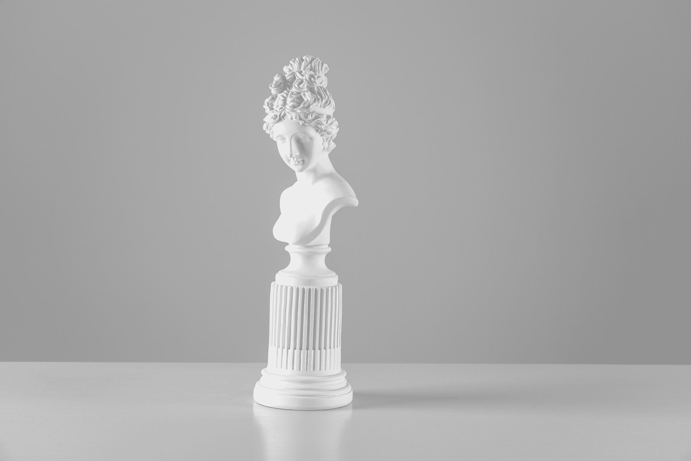
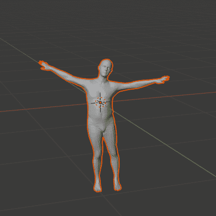
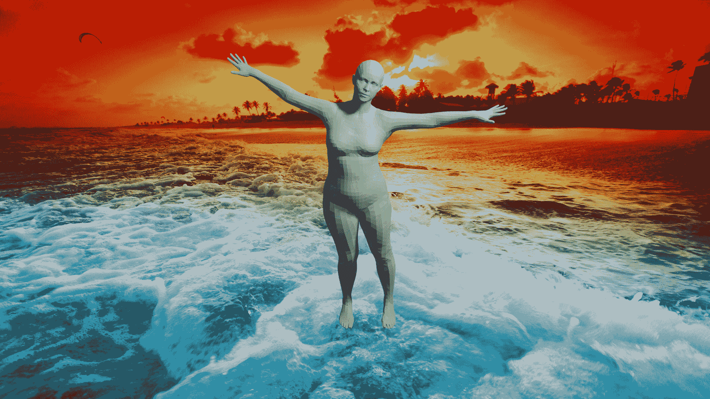
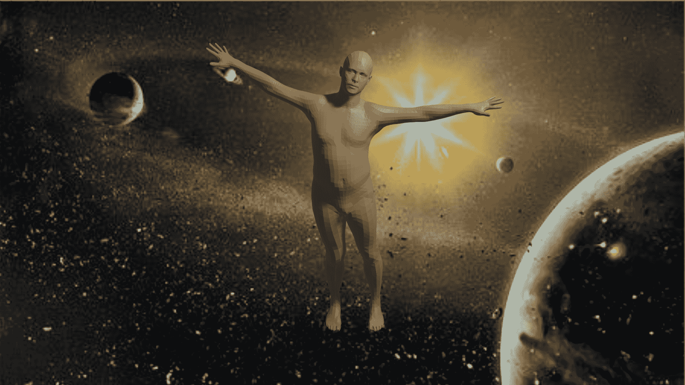
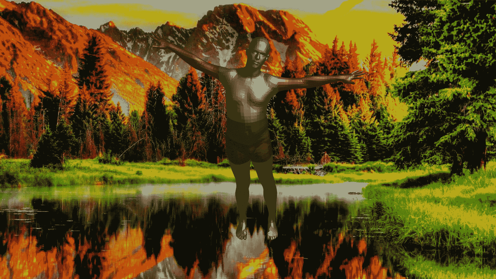
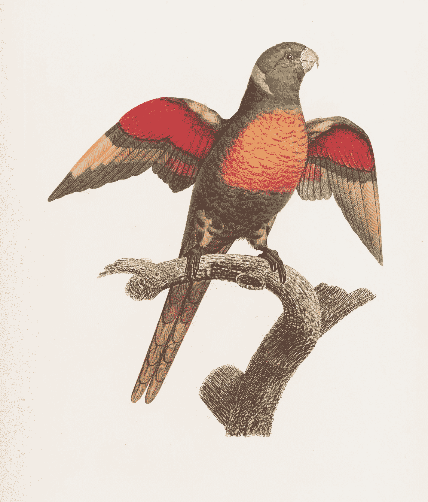

# 用搅拌机制作 SMPL 模型

> 原文：<https://blog.paperspace.com/smpl-models-with-blender/>



Photo by [Ellen Qin](https://unsplash.com/@ellenqin?utm_source=ghost&utm_medium=referral&utm_campaign=api-credit) / [Unsplash](https://unsplash.com/?utm_source=ghost&utm_medium=referral&utm_campaign=api-credit)

对于不同类型的图形设计，人体模型有很多解释。为现有的软件和图形管道构建类似于更人性化的模型的 3d 结构是设计的主要方面之一。蒙皮多人线性(SMPL)模型是一个基于蒙皮顶点的模型，它精确地表示自然人体姿态中的各种身体形状。SMPL 模型代表了现实人类模型的一些最佳作品，因为它们与当前用于图形生成的大多数流行平台兼容，如 Blender、Maya、Unreal Engine 和 Unity。这种高度的兼容性使得许多成功的工作有可能用这些 SMPL 模型来完成。

在之前关于使用 Blender 进行 3d 建模的文章中，我们了解了 Blender 的大部分基本方面，例如众多的工具、代码、功能、属性和其他重要主题。我们还探索了向特定模型分配和添加背景图像的领域。除了添加各自的背景，我们还学习了添加理想纹理的过程，以使我们的模型看起来更具视觉吸引力和美感。我们将利用这些先前概念的知识，并将它们应用到当前的 SMPL 模型理论中。

在上一篇关于 3d 建模的文章中，我们也详细讨论了模型的动画。然而，我们不会把重点放在 SMPL 模型的动画方面。我们将学习导入皮肤的多人线性模型到 Blender 环境中，并做相应的添加。下面是我们将在本文中涉及的主题类型的目录列表。查看它以理解我们将在这篇文章中学习的关于使用*“带搅拌机的 SMPL 模型”*的基本概念。

### 目录:

*   介绍
*   创建和生成 SMPL 模型
*   了解如何在 Blender 中使用 SMPL 模型
*   使用 Python 和 Blender
    1 执行大量任务。进口 SMPL 车型
    2。给相应的模型
    3 添加背景图片。添加理想的纹理
    4。渲染图像
    5。添加多摄像机视图
*   在 Blender 中添加多个纹理
*   结论

## 简介:

蒙皮多人线性(SMPL)是一个真实的三维人体模型，它基于从数千次三维人体扫描中学习到的蒙皮和形状混合。构建 SMPL 模型的主要想法是确保有一个公共平台，这些现实的人类模型可以在这个平台上找到它们的效用，即在 Blender、Maya、Unreal Engine 和 Unity 等流行软件中。为了构建这些模型，使用了混合蒙皮、自动装配、学习姿势模型、学习姿势形状和学习混合形状的概念，以确保产生最佳结果。关于这些主题和 SMPL 模型的更多信息，我建议从下面的[链接](https://files.is.tue.mpg.de/black/papers/SMPL2015.pdf)查看关于“ *SMPL:一个带皮肤的多人线性模型*”的官方研究论文。

在本文中，我们将重点介绍如何在 GitHub 参考的帮助下创建和生成 SMPL 模型，然后学习将这些模型导入 Blender 环境的过程。一旦我们完成了这些基本程序，我们将开始调整我们从以前的文章中获得的知识，并开始实现 SMPL 模型的一些背景细节，以及尝试给下面的模型添加一些纹理。我们将尝试只使用 Python 代码来执行我们讨论过的所有期望的操作。添加多个纹理的最后一个动作可以在 Blender 工具的帮助下进行，以获得更高的精度，并添加不同类型的颜色。最后，我们将看看这些模型可能实现的一些现有和未来的工作。

* * *

## 创建和生成 SMPL 模型:

要使用 SMPL 模型，您可以做的第一步是通过此[链接](https://smpl.is.tue.mpg.de/)访问以下官方网站。如果您尚未注册，请务必注册并登录网站。在这里，您将有机会下载具有不同姿势和参数的蒙皮多人线性模型的数据集。最好是找到。obj 文件或将它们从现有格式转换为。obj 格式，以确保 Blender 可以更轻松地访问这些文件。如果您在系统上成功下载或安装这些模型的过程中遇到问题，我建议您尝试本节中提到的下一种方法。

对于创建和生成 SMPL 模型，我的建议是利用以下 GitHub [链接](https://github.com/CalciferZh/SMPL)，这些链接来自开发人员，他们在解释多种格式的 SMPL 模型方面做了大量工作，使其在 numpy 版本以及 TensorFlow 深度学习框架和 PyTorch 深度学习框架中可用，用于 GPU 计算。大部分代码都是在 Ubuntu 平台上测试的。如果你使用 Windows 平台进行大部分的 Blender 操作，你可以使用一个虚拟的盒子来测试 Ubuntu 环境。GitHub 链接中提到的大多数步骤都是不言自明的，但是您需要确保您的测试设备上有 Python 的要求和 GitHub 存储库的副本。

一旦您完成了所有的安装、创建和提取 GitHub 存储库，您就可以继续创建一个虚拟环境来存储这个任务的所有基本需求。一旦创建了虚拟环境并在其中安装了所有必需的依赖项，请确保为特定任务激活了虚拟环境。将目录更改为下载 GitHub repo，首先运行预处理 Python 脚本。如果您在特定平台上没有 GPU 支持，您可以运行 smpl_np.py 脚本来相应地生成男性或女性模型。模型将在。obj 格式，现在可以导入 Blender 平台了。

```py
source ./ss_h_mesh_venv/bin/activate (In the previous folder or the directory you created your venv)

cd SMPL-master/

python preprocess.py

python smpl_np.py 
```

如果您的平台上安装了 GPU，您可以运行 TensorFlow 脚本，而不是 Numpy 变体。请注意，您可以在脚本中做一些小的改动，以获得 SMPL 模特的不同姿势。

```py
python smpl_tf.py 
```

如果你在破译这一步有困难，并且不能生成你想要的模型，将会有一个默认的男性和女性模型的附件，这样你就可以根据需要继续完成文章的其余部分。

* * *

## 了解如何在 Blender 中使用 SMPL 模型:

现在我们已经简单了解了如何创建和生成不同姿态的 SMPL 模型，我们可以继续了解如何导入 SMPL 模型。我们知道这些文件保存为。系统中的 obj 文件。在 Windows 平台上，您会注意到这些文件被保存为 3D 对象，单击属性时，特定格式显示为. obj 文件。本文的大部分内容将集中在如何使用 Python 脚本来处理 SMPL 模型。然而，对于导入模型和其他类似的步骤，我们还将介绍如何通过使用 Blender 平台及其提供的众多功能来完成以下步骤。

首先，让我们了解借助 Python 脚本将 SMPL 模型导入 Blender 平台的代码结构。下面的代码块解释了如何实现下面的任务。在文本编辑器部分，我们用格式。py 并继续导入必要的库，如 bpy 和数学库，它们将帮助我们完成本文中几乎所有的必要任务。第一步是删除搅拌机屏幕的默认立方体。这个过程有两种可能。注释行根据需要执行操作，但是如果您试图多次运行该脚本，您更愿意检查是否有要删除的多维数据集，并且只在存在多维数据集时才删除它。导入所需 SMPL 模型的最后一步非常简单，因为您需要指定将代码连接到男性或女性模型的存储位置的路径。

```py
import bpy
from bpy import context, data, ops
import math

###  Remove The Default Cude Object
# bpy.ops.object.delete(use_global=False)

for o in bpy.context.scene.objects:
    if o.name == "Cube":
        bpy.ops.object.delete(use_global=False)

### Import The SMPL Model
file_loc = 'Your Path to smpl_male.obj or smpl_female.obj'
imported_object = bpy.ops.import_scene.obj(filepath=file_loc)
obj_object = bpy.context.selected_objects[0] 
print('Imported name: ', obj_object.name)
```

如果您想将模型直接导入到您的 Blender 环境中，那么这个过程也非常简单，只要您知道存储特定模型的位置或路径。进入 Blender 平台并选择一个常规项目后，删除默认立方体。在以前的文章中已经多次讨论了删除的过程。请随意选择最适合你的方法。删除默认多维数据集后，从主菜单栏中选择该文件。选择要导入的选项，并从各种可用选项中选择波前(。obj)选项。浏览并选择您想要的型号，它应该会出现在 Blender 屏幕上，如下图所示。



导入的模型将需要一些重新调整和缩放。我们将在下一节介绍如何有效地执行以下步骤。

* * *

## 使用 Python 和 Blender 执行大量任务:

在本文的这一部分，我们将重点关注在 SMPL 模型上执行各种任务。首先，我们将从将 SMPL 模型导入 Blender 平台的过程开始。一旦我们成功地导入了 SMPL 模型，我们将开始为下面的模型添加一些重要的特性。我们将添加一个背景图像到相应的模型，然后继续添加一个理想的纹理。纹理很可能代表典型的肤色。

一旦我们完成了这些任务，我们就可以从多个角度来观察我们最终的渲染图像。在多个摄像机视图的帮助下，这一任务是可能的。本文的这一部分更侧重于在代码的帮助下完成预期的任务。然而，我将简单地介绍一下如何利用现有的 Blender 工具来完成这些任务。但是问题是你不能复制和构建许多不同结构的模型，因为没有代码的工作的复杂性会显著增加。

### 导入 SMPL 模型:

在上一节中，我们已经详细介绍了如何将 SMPL 模型导入 Blender 平台。代码摘要如下面的代码片段所示。

```py
import bpy
from bpy import context, data, ops
import math

###  Remove The Default Cude Object
# bpy.ops.object.delete(use_global=False)

for o in bpy.context.scene.objects:
    if o.name == "Cube":
        bpy.ops.object.delete(use_global=False)

### Import The SMPL Model
file_loc = 'Your Path to smpl_male.obj or smpl_female.obj'
imported_object = bpy.ops.import_scene.obj(filepath=file_loc)
obj_object = bpy.context.selected_objects[0] 
print('Imported name: ', obj_object.name)
```

下一个重要步骤是调整模型的位置，相应地旋转模型以匹配相机的最佳视图，最后将模型缩放到合适的大小，以便我们可以清楚地查看模型。在 Python 脚本的帮助下，可以轻松执行以下操作。需要选择分配给模型的创建对象，我们可以相应地改变所有需要的参数。位置、旋转欧拉角和缩放参数在 x 轴、y 轴和 z 轴上都是可变的。一旦您在特定的轴上改变了这些属性，您将会得到一个更加令人满意的 SMPL 的修改，这对于我们在本文中试图完成的大多数任务来说都是非常有用的。

```py
# Locations
obj_object.location.x = 0
obj_object.location.y = 0
obj_object.location.z = 0.5

# Rotations
obj_object.rotation_euler[0] = math.radians(90)
obj_object.rotation_euler[1] = math.radians(-0)
obj_object.rotation_euler[2] = math.radians(60)

# Scale
obj_object.scale.x = 2
obj_object.scale.y = 2
obj_object.scale.z = 2
```

如果你试图用 Blender 中分配的工具来完成下面的步骤，这个过程非常简单。在屏幕上选择 SMPL 模型后，转到属性布局。默认情况下，应选择对象属性。但是，如果不是，您可以相应地调整位置、旋转和缩放的所有参数。您可以借助鼠标手动调整模型的位置，借助键盘上的' *R* 键沿所需轴调整旋转角度，或借助键盘上的' *S* 键调整模型的比例，并沿所有轴均匀缩放。

### 向相应的模型添加背景图像:



我们将关注的下一步是给相应的模型添加一个背景图像。完成以下过程的步骤在我之前的一篇文章中有详细介绍，这篇文章讲述了向 3d 模型添加背景图像和纹理的基础知识。即使是 SMPL 模式，过程也基本相同。让我们重温下面的代码片段，以便更好地理解这个概念。

为了给图像添加所需的背景，第一步是选择我们将用来观看 SMPL 模型的摄像机。一旦选择了摄像机，我们就可以指定包含男性或女性模特位置的路径。一旦我们将背景图像赋给一个变量，我们就可以开始堆肥的过程了。我们已经在以前的一篇关于 3d 建模的文章中广泛地讨论了这个主题。将 UI 类型的区域设置为合成器节点树。这一步将布局更改到我们可以构建节点来相应地连接我们想要的功能的地方。删除所有默认节点，并开始构建具有适当连接的新节点。每个节点的位置不是强制性的。然而，当观察任何不匹配时，下面的放置看起来更美观。观察下面的代码片段，以防您陷入编码过程。

```py
### Background Image
cam = bpy.context.scene.camera
filepath = "background image path"

img = bpy.data.images.load(filepath)
cam.data.show_background_images = True
bg = cam.data.background_images.new()
bg.image = img
bpy.context.scene.render.film_transparent = True

### Composting

bpy.context.area.ui_type = 'CompositorNodeTree'

#scene = bpy.context.scene
#nodetree = scene.node_tree
bpy.context.scene.use_nodes = True
tree = bpy.context.scene.node_tree

for every_node in tree.nodes:
    tree.nodes.remove(every_node)

RenderLayers_node = tree.nodes.new('CompositorNodeRLayers')   
RenderLayers_node.location = -300,300

comp_node = tree.nodes.new('CompositorNodeComposite')   
comp_node.location = 400,300

AplhaOver_node = tree.nodes.new(type="CompositorNodeAlphaOver")
AplhaOver_node.location = 150,450

Scale_node = tree.nodes.new(type="CompositorNodeScale")
bpy.data.scenes["Scene"].node_tree.nodes["Scale"].space = 'RENDER_SIZE'
Scale_node.location = -150,500

Image_node = tree.nodes.new(type="CompositorNodeImage")
Image_node.image = img  
Image_node.location = -550,500

links = tree.links
link1 = links.new(RenderLayers_node.outputs[0], AplhaOver_node.inputs[2])
link2 = links.new(AplhaOver_node.outputs[0], comp_node.inputs[0])
link3 = links.new(Scale_node.outputs[0], AplhaOver_node.inputs[1])
link4 = links.new(Image_node.outputs[0], Scale_node.inputs[0])

bpy.context.area.ui_type = 'TEXT_EDITOR'
```

一旦所有的连接都按讨论的那样完成，就必须将 UI 布局的区域从合成部分转换回文本编辑器，以继续本部分中所有剩余任务的 Python 脚本编写过程。您可以按键盘上的“ *Numpad 0* ”在各自的相机视图中查看 SMPL 模型。借助 Python 脚本执行的所有步骤也可以用必要的 Blender 工具复制，以获得理想的结果。然而，每次您想要构建一个模型而不是复制粘贴一个脚本或代码片段时，构建这些步骤的复杂性更加麻烦。让我们继续分析如何给我们的 SMPL 模型添加纹理。

### 添加理想的纹理:



既然我们已经成功地导入了模型并添加了背景，那么给模型添加一个新的纹理使它看起来更真实就变得非常重要了。借助 Python 脚本添加单个纹理的过程非常简单。您可以创建材质的名称并将其存储为所需的变量，然后继续创建节点来定义您的特定属性。您还可以选择下载您认为最适合您的 SMPL 模型的自定义皮肤颜色，并创建相应的节点链接来映射它们。整个模型将使用下面代码片段中提到的代码块导入您在本节中添加的纹理。您可以相应地随意修改、更改和试验代码！

```py
### Adding Textures

mat = bpy.data.materials.new(name="New_Mat")
mat.use_nodes = True
bsdf = mat.node_tree.nodes["Principled BSDF"]
texImage = mat.node_tree.nodes.new('ShaderNodeTexImage')
texImage.image = bpy.data.images.load("Any texture like a skin color")
mat.node_tree.links.new(bsdf.inputs['Base Color'], texImage.outputs['Color'])

#ob = context.view_layer.objects.active

# Assign it to object
if obj_object.data.materials:
    obj_object.data.materials[0] = mat
else:
    obj_object.data.materials.append(mat)

# Change the ViewPort Shading to RENDERED    
for area in bpy.context.screen.areas: 
    if area.type == 'VIEW_3D':
        for space in area.spaces: 
            if space.type == 'VIEW_3D':
                space.shading.type = 'RENDERED'
```

要在不使用任何代码的情况下完成以下步骤，您可以保持对象处于选中状态，并将属性部分更改为材质属性布局，然后通过指定所需的材质来添加所需的皮肤位置或您选择的任何其他颜色。要查看指定的颜色，需要将视口视图从实心状态切换到材质预览模式或渲染模式。所有其他属性都可以根据用户的需要进行操作和更改。然而，正如上一节所讨论的，我们可以注意到，对于创建多个模型来说，手动计算这些步骤而不是使用 Python 脚本可能非常复杂。现在让我们继续了解如何渲染 SMPL 模型，并将其保存在所需的路径位置。

### 渲染图像:

创建模型并将其保存在所需位置的最后一步是渲染过程。在之前的文章中，我们已经多次讨论过渲染过程。定义渲染上下文，并在相应的变量中缩放分辨率百分比。在下一步中，我们可以定义保存相应模型的路径。确保图像的格式是常用的格式之一，如。png 或. jpg。当我们完成图像渲染后，我们可以将图像保存为所需的格式，并恢复之前的路径，以便进一步编写脚本和进行计算。

```py
### Rendering Procedure
render = bpy.context.scene.render
scale = render.resolution_percentage / 100

FILE_NAME = "figure2.png"
FILE_PATH = "Save Path"

# Save Previous Path
previous_path = bpy.context.scene.render.filepath

# Render Image
bpy.context.scene.render.filepath = FILE_PATH
bpy.ops.render.render(write_still=True)

# Restore Previous Path
bpy.context.scene.render.filepath = previous_path
```

您也可以选择使用 Blender 平台中提供的工具直接渲染图像，方法是在主菜单栏中选择要渲染的选项，然后单击渲染图像选项。确保选择相应的摄像机来执行渲染操作。也可以直接点击键盘上的 *F12* 按钮渲染图像。但是，如果您有多个摄像机，这个过程会非常复杂，因为您在摄像机切换过程中的工作量会增加。要在多台摄像机之间切换并拥有多摄像头视图，请选择所需的摄像机，然后单击键盘上的“*ctrl*”+“*numpad 0*”。值得注意的是，创建多个这样的项目的脚本过程非常简单。

### 添加多摄像机视图:

在本文的最后一节，我们将学习如何创建多摄像头视图，并查看 SMPL 模型以及相应的背景细节和纹理。要创建新的摄像机，选择摄像机角度，并给它一个您选择的名称。根据所需的值设置镜头，并创建您的对象。您可以设置位置、旋转角度，并将所有对象链接到创建的相机。渲染过程也可以再次完成，类似于上一节中提到的步骤。您可以在不同的位置创建多个这样的相机，并捕捉模型的许多视图和透视图。按照下面显示的代码块，可以相应地更改摄像机的变量和名称。

```py
### Creating A New Camera Angle
scn = bpy.context.scene

# create the second camera
cam2 = bpy.data.cameras.new("Camera 2")
cam2.lens = 50

# create the second camera object
cam_obj2 = bpy.data.objects.new("Camera 2", cam2)

# Set Location 
cam_obj2.location.x = -1.43
cam_obj2.location.y = -11
cam_obj2.location.z = 6.46

# Set Angles
cam_obj2.rotation_euler[0] = math.radians(62)
cam_obj2.rotation_euler[1] = math.radians(-0.01)
cam_obj2.rotation_euler[2] = math.radians(-6.89)

scn.collection.objects.link(cam_obj2)

### Rendering Procedure
render = bpy.context.scene.render
scale = render.resolution_percentage / 100

FILE_NAME = "24.png"
FILE_PATH = "Save Path"

# Save Previous Path
previous_path = bpy.context.scene.render.filepath

# Render Image
bpy.context.scene.render.filepath = FILE_PATH
bpy.ops.render.render(write_still=True)

# Restore Previous Path
bpy.context.scene.render.filepath = previous_path

# Set the Camera 2 to active camera
bpy.context.scene.camera = bpy.data.objects["Camera 2"]

cam2 = bpy.context.scene.camera
filepath = "Background Path"

img = bpy.data.images.load(filepath)
cam2.data.show_background_images = True
bg = cam2.data.background_images.new()
bg.image = img
bpy.context.scene.render.film_transparent = True
```

现在，我们已经介绍了如何在 Blender 中处理 SMPL 模型的几乎所有重要的基本方面，您可以发现和探索更多的实验，以更好地理解如何使用这些模型。在本文的下一节中，我们将研究这样一种改进，您可以通过向模型添加多种纹理来对 SMPL 模型进行改进，以获得更好的美学外观。

* * *

## 在 Blender 中添加多个纹理:



在本文的这一部分中，我们将研究一些可以添加到我们的 SMPL 模型中的额外改进。我们可以做的一个改进是添加许多不同类型的纹理。我们可以将多种皮肤颜色(如上图所示)或不同种类的纹理结合到 SMPL 模型中，以达到多种目的。以下任务也可以通过 UV 映射在编码和 Python 脚本的帮助下完成，但您也可以在 Blender 工具的帮助下完成以下任务。

为了精确计算添加多个纹理的后续部分，我建议切换 Blender 布局屏幕右上角的 x 射线模式，并从实体视口材质预览切换到渲染状态。在左上角的屏幕上，从对象模式切换到编辑模式，这样你就可以开始对你的 SMPL 模型的纹理做一些改变。下一步是在材质属性布局中添加你选择的多种纹理和颜色阴影。你可以使用默认的颜色阴影，或者你已经下载的皮肤/其他纹理。

现在，您可以继续用鼠标选择特定区域，并为这些特定区域和部分指定您选择的纹理或颜色。确保放大 SMPL 模型，以便可以更近距离地看到这些区域，然后可以更精确地选择所需的区域。这种多纹理模型的一个例子如上图所示。您可以使用这些模型进行许多实验，强烈建议您尝试它们的各种变体。

* * *

## 结论:



Photo by [The New York Public Library](https://unsplash.com/@nypl?utm_source=ghost&utm_medium=referral&utm_campaign=api-credit) / [Unsplash](https://unsplash.com/?utm_source=ghost&utm_medium=referral&utm_campaign=api-credit)

为了获得适用于众多软件设计平台的最佳架构类型，已经有了一些人类模型的创造。对于生成逼真的人体模型，诸如混合蒙皮、自动装配、学习姿势模型、学习姿势形状和学习混合形状等主题具有重要意义。有了这些概念的绝对理论和实践知识，就可以生成现实的人体模型结构。这些生成的人体模型有助于创建各种逼真和似是而非的人体形状和结构，这些形状和结构在许多作品和项目中有很大的用途。

在本文中，我们讨论了与多人线性(SMPL)模型相关的大部分次要方面。我们理解创建和生成具有真实人体结构的 SMPL 模型的概念，以便它们可以用于许多训练过程。然后我们理解了用代码或者直接通过 Blender 中可用的工具将 SMPL 模型导入 Blender 平台的基本过程。我们还探索了为这些 SMPL 模型添加背景和添加独特纹理的基础知识，以使模型看起来更符合人体。最后，我们探索了在同一个模型中添加多种纹理的领域，并对这些模型未来可能的工作类型进行了简短的讨论。

最后一步，我再次强烈推荐阅读更多的研究论文，自己探索这个话题。在未来的文章中，我们将回到更多的深度学习内容，并致力于与 GANs 相关的众多项目和与神经网络相关的其他主题。