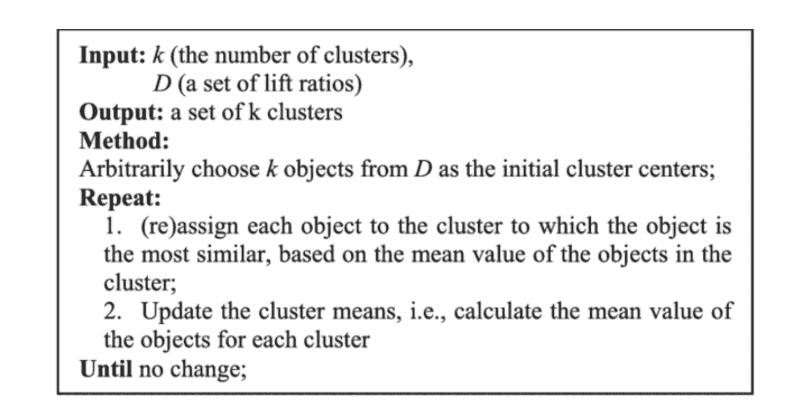
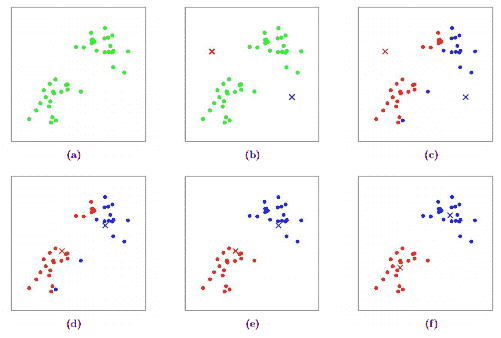
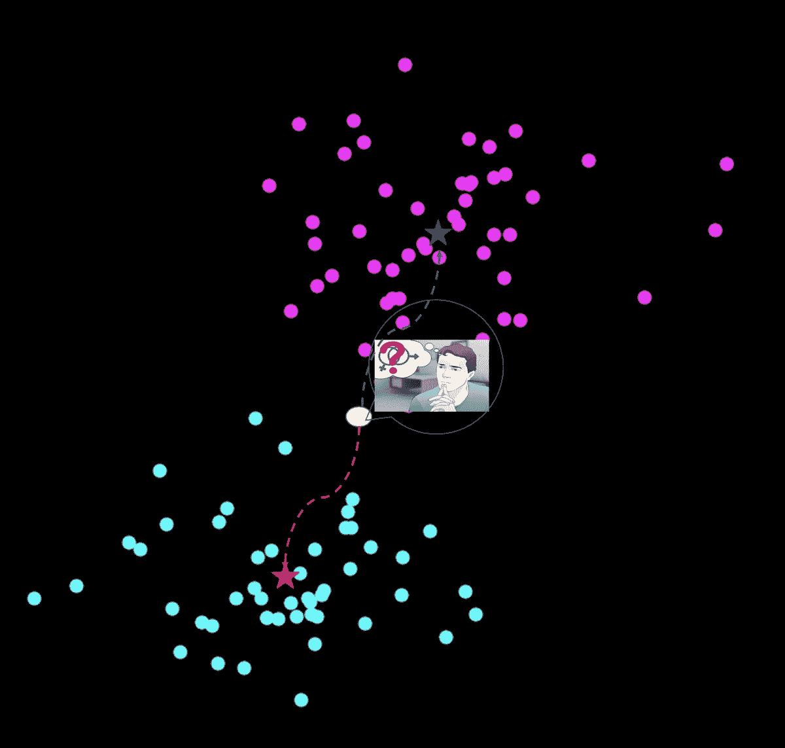
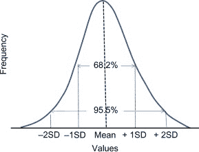
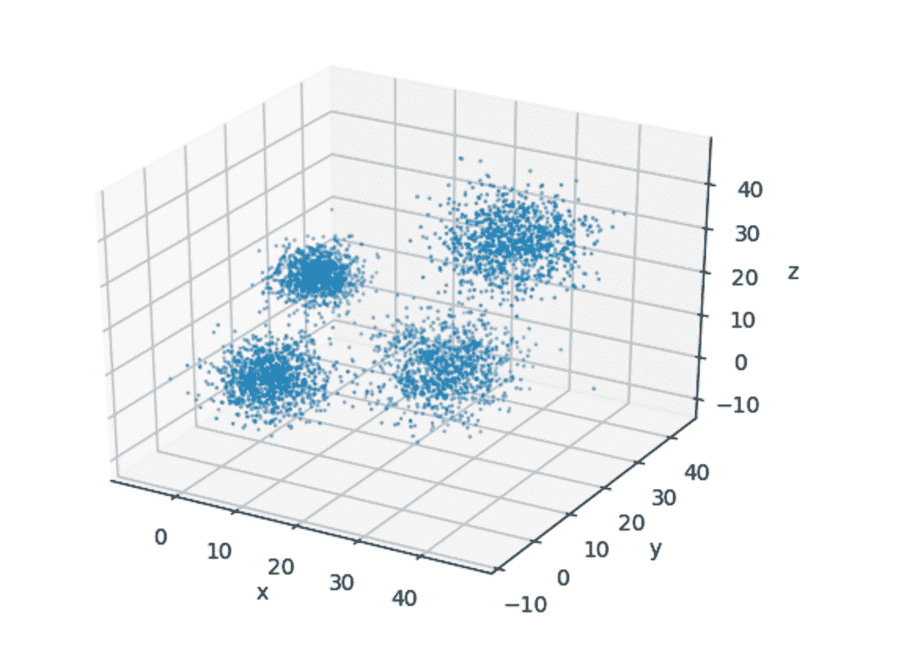

# NumPy 优化的基本要素第 2 部分:将 K-Means 聚类速度提高 70 倍

> 原文：<https://blog.paperspace.com/speed-up-kmeans-numpy-vectorization-broadcasting-profiling/>

在关于如何使用 NumPy 编写高效代码的系列文章的第 1 部分中，我们讨论了矢量化和广播的重要主题。在这一部分中，我们将通过使用 NumPy 实现 K-Means 聚类算法的有效版本来实践这些概念。我们将把它与一个完全使用 Python 循环实现的简单版本进行比较。最后我们会看到 NumPy 版本比简单循环版本快大约 70 倍。

确切地说，在本帖中，我们将涉及:

1.  了解 K-均值聚类
2.  实现 K-意味着使用循环
3.  使用 cProfile 查找代码中的瓶颈
4.  使用 NumPy 优化 K-Means

我们开始吧！

## 了解 K-均值聚类

在本帖中，我们将优化 k-means 聚类算法的实现。因此，我们必须至少对算法的工作原理有一个基本的了解。当然，详细的讨论也超出了本文的范围；如果你想深入研究 k-means，你可以在下面找到几个推荐链接。

### K-Means 聚类算法有什么作用？

简而言之，k-means 是一种无监督的学习算法，它根据相似性将数据分成不同的组。由于这是一个无监督的算法，这意味着我们没有数据标签。

k-means 算法最重要的超参数是聚类数，即 *k.* 一旦我们决定了 *k* 的值，算法的工作方式如下。

1.  从数据中随机初始化 *k* 个点(对应于 *k* 个簇)。我们称这些点为*形心。*
2.  对于每个数据点，测量距质心的 L2 距离。将每个数据点分配给距离最短的质心。换句话说，给每个数据点分配最近的质心。
3.  现在，分配给质心的每个数据点形成一个单独的聚类。对于 *k* 个质心，我们将有 *k* 个簇。通过该特定聚类中存在的所有数据点的平均值来更新每个聚类的质心值。
4.  重复步骤 1-3，直到每次迭代的质心的最大变化低于阈值，或者聚类误差收敛。

这是算法的伪代码。



Pseudo-code for the K-Means Clustering Algorithm

我要离开 K-Means。这足以帮助我们编写算法。然而，还有更多，如如何选择一个好的值 *k，*如何评估性能，可以使用哪些距离度量，预处理步骤，以及理论。如果你想深入研究，这里有几个链接供你进一步研究。

[](https://stanford.edu/~cpiech/cs221/handouts/kmeans.html)[CS221Stanford CS221](https://stanford.edu/~cpiech/cs221/handouts/kmeans.html)[K-means Clustering: Algorithm, Applications, Evaluation Methods, and DrawbacksClustering is one of the most common exploratory data analysis technique used to get an intuition about the structure of the data. It can be defined as the task of identifying subgroups in the data…Towards Data ScienceImad Dabbura](https://towardsdatascience.com/k-means-clustering-algorithm-applications-evaluation-methods-and-drawbacks-aa03e644b48a)

现在，让我们继续算法的实现。

## 实现 K-意味着使用循环

在本节中，我们将使用 Python 和 loops 实现 K-Means 算法。我们不会为此使用 NumPy。这段代码将作为我们优化版本的基准。

### 生成数据

要执行聚类，我们首先需要我们的数据。虽然我们可以从多个在线数据集进行选择，但让事情保持简单和直观。我们将通过从多个高斯分布中采样来合成一个数据集，这样对我们来说可视化聚类就很容易了。

如果你不知道什么是高斯分布，那就去看看吧！

[](https://www.sciencedirect.com/topics/biochemistry-genetics-and-molecular-biology/gaussian-distribution#:~:text=Gaussian%20distribution%20(also%20known%20as,and%20below%20the%20mean%20value.)[Gaussian Distribution - an overview | ScienceDirect TopicsScienceDirect TopicsScienceDirect](https://www.sciencedirect.com/topics/biochemistry-genetics-and-molecular-biology/gaussian-distribution#:~:text=Gaussian%20distribution%20(also%20known%20as,and%20below%20the%20mean%20value.)

我们将从四个具有不同平均值和分布的高斯分布中创建数据。

```py
import numpy as np 
# Size of dataset to be generated. The final size is 4 * data_size
data_size = 1000
num_iters = 50
num_clusters = 4

# sample from Gaussians 
data1 = np.random.normal((5,5,5), (4, 4, 4), (data_size,3))
data2 = np.random.normal((4,20,20), (3,3,3), (data_size, 3))
data3 = np.random.normal((25, 20, 5), (5, 5, 5), (data_size,3))
data4 = np.random.normal((30, 30, 30), (5, 5, 5), (data_size,3))

# Combine the data to create the final dataset
data = np.concatenate((data1,data2, data3, data4), axis = 0)

# Shuffle the data
np.random.shuffle(data) 
```

为了有助于我们的可视化，让我们在三维空间中绘制这些数据。

```py
import matplotlib.pyplot as plt 
from mpl_toolkits.mplot3d import Axes3D 

fig = plt.figure()
ax = fig.add_subplot(111, projection='3d')
ax.set_xlabel('x')
ax.set_ylabel('y')
ax.set_zlabel('z')

ax.scatter(data[:,0], data[:,1], data[:,2], s= 0.5)
plt.show()
```



3-D Visualization of the Dataset

在上图中很容易看到四组数据。首先，这使得我们可以轻松地为我们的实现选择一个合适的值 *k* 。这符合尽可能保持算法细节简单的精神，因此我们可以专注于实现。

### 助手功能

我们首先初始化我们的质心，以及一个记录每个数据点被分配到哪个质心的列表。

```py
# Set random seed for reproducibility 
random.seed(0)

# Initialize the list to store centroids
centroids = []

# Sample initial centroids
random_indices = random.sample(range(data.shape[0]), 4)
for i in random_indices:
    centroids.append(data[i])

# Create a list to store which centroid is assigned to each dataset
assigned_centroids = [0] * len(data)
```

在实现我们的循环之前，我们将首先实现几个助手函数。

`compute_l2_distance`取两个点(比如说`[0, 1, 0]`和`[4, 2, 3]`)并根据以下公式计算它们之间的 L2 距离。

$$ L2(X_1，x _ 2)= \sum_{i}^{dimensions(x_1)}(x _ 1[I]-x_2[i])^2 $ $

```py
def compute_l2_distance(x, centroid):
    # Initialize the distance to 0
    dist = 0

    # Loop over the dimensions. Take squared difference and add to 'dist' 
    for i in range(len(x)):
        dist += (centroid[i] - x[i])**2

    return dist
```

我们实现的另一个助手函数叫做`get_closest_centroid`，这个名字不言自明。该函数接受一个输入`x`和一个列表`centroids`，并返回与最接近`x`的质心相对应的列表`centroids`的索引。

```py
def get_closest_centroid(x, centroids):
    # Initialize the list to keep distances from each centroid
    centroid_distances = []

    # Loop over each centroid and compute the distance from data point.
    for centroid in centroids:
        dist = compute_l2_distance(x, centroid)
        centroid_distances.append(dist)

    # Get the index of the centroid with the smallest distance to the data point 
    closest_centroid_index =  min(range(len(centroid_distances)), key=lambda x: centroid_distances[x])

    return closest_centroid_index
```

然后我们实现函数`compute_sse`，它计算 SSE 或误差平方和。这个度量用于指导我们必须做多少次迭代。一旦这个值收敛，我们就可以停止训练了。

```py
def compute_sse(data, centroids, assigned_centroids):
    # Initialise SSE 
    sse = 0

    # Compute the squared distance for each data point and add. 
    for i,x in enumerate(data):
    	# Get the associated centroid for data point
        centroid = centroids[assigned_centroids[i]]

        # Compute the distance to the centroid
        dist = compute_l2_distance(x, centroid)

        # Add to the total distance
        sse += dist

    sse /= len(data)
    return sse
```

### 主循环

现在，让我们写主循环。参考上面提到的伪代码，以供参考。我们仅仅循环 50 次迭代，而不是循环直到收敛。

```py
# Number of dimensions in centroid
num_centroid_dims = data.shape[1]

# List to store SSE for each iteration 
sse_list = []

tic = time.time()

# Loop over iterations
for n in range(num_iters):

    # Loop over each data point
    for i in range(len(data)):
        x = data[i]

        # Get the closest centroid
        closest_centroid = get_closest_centroid(x, centroids)

        # Assign the centroid to the data point.
        assigned_centroids[i] = closest_centroid

    # Loop over centroids and compute the new ones.
    for c in range(len(centroids)):
        # Get all the data points belonging to a particular cluster
        cluster_data = [data[i] for i in range(len(data)) if assigned_centroids[i] == c]

        # Initialize the list to hold the new centroid
        new_centroid = [0] * len(centroids[0])

        # Compute the average of cluster members to compute new centroid
        # Loop over dimensions of data
        for dim in range(num_centroid_dims): 
            dim_sum = [x[dim] for x in cluster_data]
            dim_sum = sum(dim_sum) / len(dim_sum)
            new_centroid[dim] = dim_sum

        # assign the new centroid
        centroids[c] = new_centroid

    # Compute the SSE for the iteration
    sse = compute_sse(data, centroids, assigned_centroids)
    sse_list.append(sse)
```

完整的代码可以在下面看到。