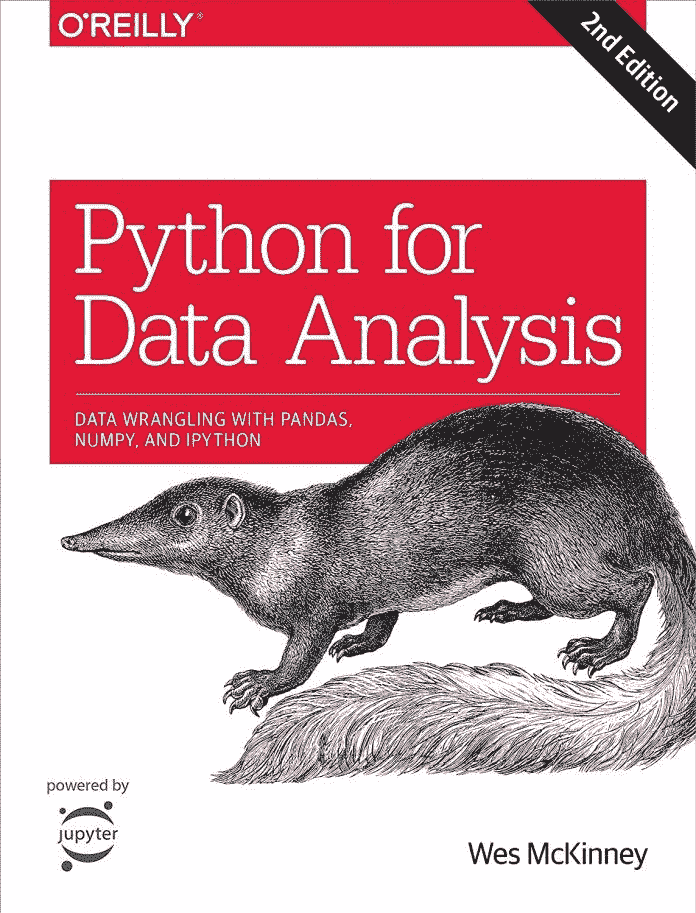
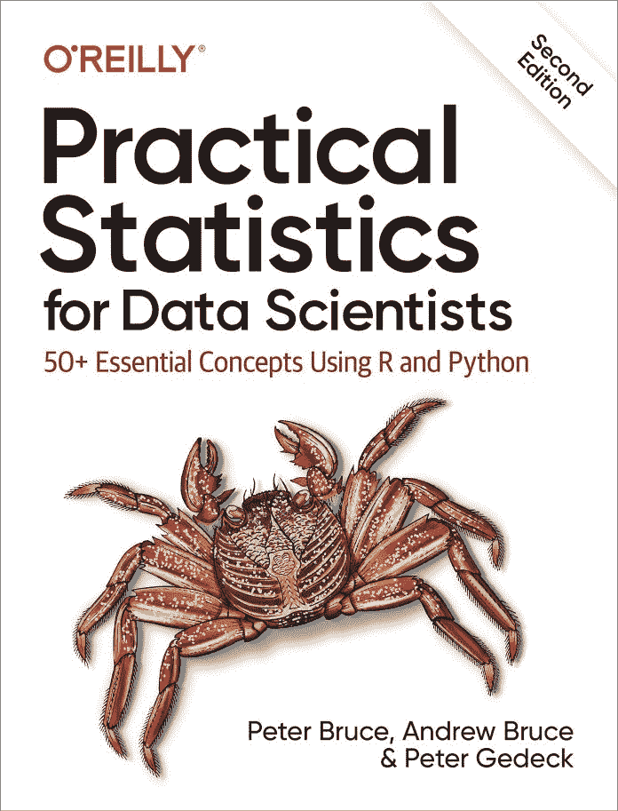

# 2 本书来加强你对 Python 机器学习的掌握

> 原文：<https://blog.paperspace.com/strengthen-your-python-machine-learning/>

*这篇文章是[“人工智能教育”](https://bdtechtalks.com/tag/ai-education/)的一部分，这是一系列评论和探索数据科学和机器学习教育内容的文章。*

掌握机器学习并不容易，即使你是一个优秀的程序员。我见过许多人有着编写不同领域(游戏、网络、多媒体等)软件的坚实背景。)认为将[机器学习](https://bdtechtalks.com/2017/08/28/artificial-intelligence-machine-learning-deep-learning/)添加到他们的技能列表中是另一件轻松的事情。不是的。他们每个人都很沮丧。

我认为机器学习的挑战被误解有两个原因。首先，顾名思义，机器学习是一种自我学习的软件，而不是由开发人员来指导[每一条规则。这是一种过于简化的说法，许多对编写机器学习算法的实际挑战知之甚少或一无所知的媒体在谈到 ML 交易时经常使用这种说法。](https://bdtechtalks.com/2019/11/18/what-is-symbolic-artificial-intelligence/)

第二个原因，在我看来，是许多书籍和课程承诺用几百页的篇幅教你机器学习的来龙去脉(以及 YouTube 上的广告承诺，如果你通过在线课程，就能获得一份机器学习工作)。现在，我不想诋毁任何这些书和课程。我已经[回顾了其中的几篇](https://bdtechtalks.com/2020/06/03/python-machine-learning-3rd-edition-review/)(接下来几周还会再回顾一些)，我认为它们是成为优秀机器学习开发者的无价资源。

但这还不够。机器学习既需要良好的编码和数学技能，也需要对各种类型的算法有深刻的理解。如果你在做 Python 机器学习，你必须对许多库有深入的了解，还要掌握这门语言的许多编程和内存管理技术。而且，与一些人所说的相反，你无法逃避数学。

而这一切都不是几百页就能概括的。完整的机器学习指南可能会像唐纳德·克努特著名的《计算机编程的艺术》系列一样，而不是一本书。

那么，这些长篇大论是为了什么？在我探索数据科学和机器学习的过程中，我总是在寻找那些深入探究更一般、包罗万象的书籍所跳过的主题的书籍。

在这篇文章中，我将看看 *Python for Data Analysis* 和*Practical Statistics for Data Scientists*，这两本书将有助于加深您对掌握 Python 机器学习和数据科学所需的编码和数学技能的掌握。

## 用于数据分析的 Python

*[Python for Data Analysis，第二版](https://www.oreilly.com/library/view/python-for-data/9781491957653/)，*由熊猫的创造者 Wes McKinney 编写，熊猫是 Python 机器学习中使用的关键库之一。在 Python 中进行机器学习包括在将数据输入到模型之前加载和预处理 pandas 中的数据。

大多数关于机器学习的书籍和课程都介绍了主要的 pandas 组件，如数据帧和系列，以及一些关键功能，如从 CSV 文件加载数据和清除丢失数据的行。但是熊猫的力量比你在大多数书中看到的一章代码样本要广泛和深刻得多。

Python for Data Analysis

在《用于数据分析的 Python》中，McKinney 带你了解 pandas 的全部功能，并设法做到了这一点，而没有让它读起来像一本参考手册。有很多有趣的例子，它们相互叠加，帮助你理解熊猫的不同功能是如何相互联系的。您将深入了解清洗、连接和可视化数据集等内容，这些主题在大多数机器学习书籍中通常只是简单讨论。

您还将探索一些非常重要的挑战，例如内存管理和代码优化，当您在机器学习中处理非常大的数据集时(您经常这样做)，这可能会变得很重要。

我喜欢这本书的另一点是，它在选择 500 页的主题时所采用的技巧。虽然这本书的大部分内容是关于熊猫的，但 McKinney 非常注意用关于其他重要 Python 库和主题的材料来补充。您将很好地了解 numpy 的面向数组编程，numpy 是另一个重要的 Python 库，经常与 pandas 一起用于机器学习，以及一些使用 Jupyter 笔记本的重要技术，Jupyter 笔记本是许多数据科学家的首选工具。

说了这么多，不要指望 *Python for Data Analysis* 是一本很好玩的书。它可能会变得很无聊，因为它只是讨论如何处理数据(这恰好是机器学习中最无聊的部分)。不会有任何端到端的例子让你看到训练和使用机器学习算法或在实际应用中集成你的模型的结果。

**我的建议:**在浏览完一本关于数据科学或机器学习的[入门或高级书籍后，你可能会选择 *Python 进行数据分析*。拥有使用 Python 机器学习库的介绍性背景将有助于您更好地掌握书中介绍的技术。](https://bdtechtalks.com/2020/01/27/data-science-machine-learning-book-reviews/)

## 数据科学家实用统计学

虽然用于数据分析的*Python*提高了你的数据处理和操作编码技能，但我们要看的第二本书 *[数据科学家实用统计，第二版](https://www.oreilly.com/library/view/practical-statistics-for/9781492072935/)，*将是加深你对许多关键算法和概念背后的核心数学逻辑的理解的完美资源，这些算法和概念是你在进行数据科学和机器学习时经常处理的。

这本书从简单的概念开始，如不同类型的数据，均值和中位数，标准差和百分位数。然后，它将逐步带你了解更高级的概念，如不同类型的分布、抽样策略和显著性检验。这些都是你可能在数学课上学过或者在数据科学和机器学习书籍中读到过的概念。

但是，这里的关键是专业化。

Practical Statistics for Data Scientists

一方面,*为数据科学家*带来的实用统计学对这些主题的深度比你在机器学习书籍中找到的要大。另一方面，每个主题都介绍了 Python 和 R 语言的编码示例，这使得它比经典的统计学教科书更适合统计学。此外，作者在消除数据科学和其他领域中不同术语的歧义方面做了大量工作。每个主题都附有一个框，提供了所有流行术语的不同同义词。

随着你对这本书的深入，你会深入到机器学习算法的数学中，如线性和逻辑回归，K-最近邻，树和森林，以及 K-均值聚类。在每种情况下，就像这本书的其余部分一样，人们更多地关注算法背后发生的事情，而不是将其用于应用程序。但作者再次确保这些章节读起来不像经典的数学教科书，公式和方程附有漂亮的编码示例。

就像*用于数据分析的 Python，* *用于数据科学家的实用统计学*如果你从头到尾读，可能会有点无聊。没有令人兴奋的应用程序，也没有一个连续的过程让你一章一章地编写代码。但是从另一方面来说，这本书的结构是这样的，你可以独立地阅读任何一个章节，而不需要阅读前面的章节。

**我的推荐:**在浏览了一本关于数据科学和机器学习的入门书籍后，阅读*数据科学家实用统计学*。我绝对推荐读一遍整本书，尽管为了让它更有趣，在你探索其他机器学习课程的过程中逐个主题地进行。也要放在手边。你可能会不时重温一些章节。

## 一些结束语

我肯定会把*用于数据分析的 Python*和*用于数据科学家的实用统计学*作为任何正在学习数据科学和机器学习的人的必读书目。虽然它们可能不像一些更实用的书那样令人兴奋，但你会欣赏它们对你的编码和数学技能的深度。