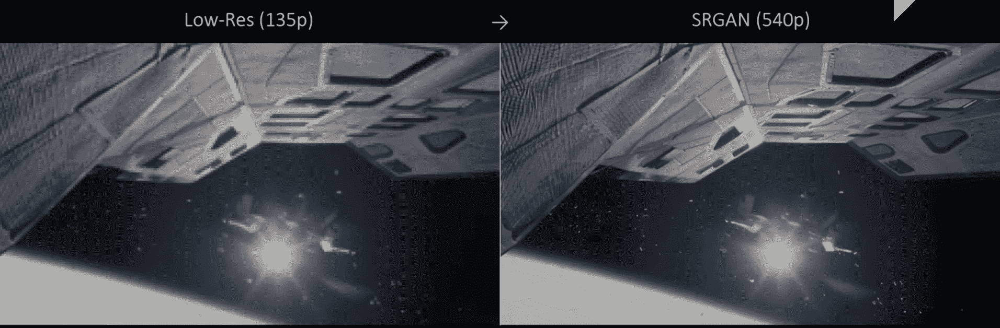
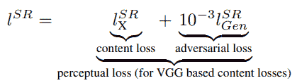
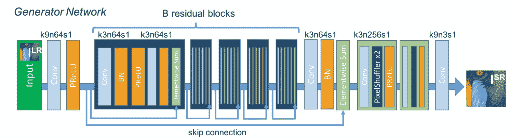
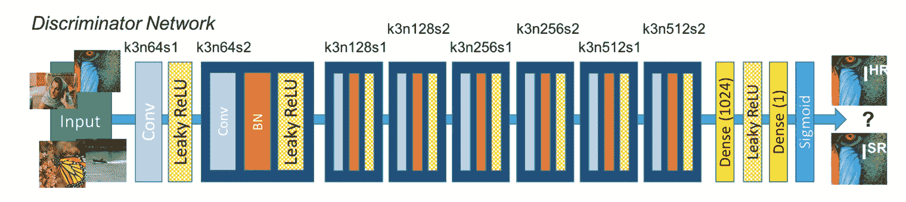
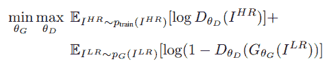
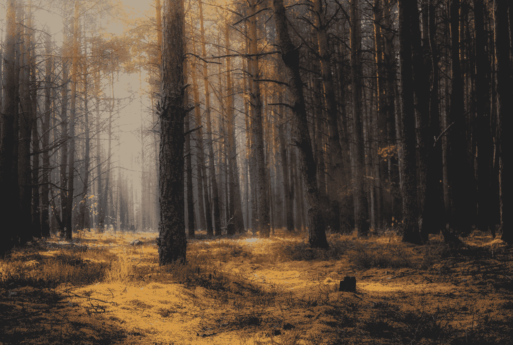

# SRGAN:超分辨率生成对抗网络

> 原文：<https://blog.paperspace.com/super-resolution-generative-adversarial-networks/>


Photo by [Karim MANJRA](https://unsplash.com/@karim_manjra?utm_source=ghost&utm_medium=referral&utm_campaign=api-credit) / [Unsplash](https://unsplash.com/?utm_source=ghost&utm_medium=referral&utm_campaign=api-credit)

如今，高分辨率图像和高清视频是人们享受 R&R 时最流行的必需品。特定图像或视频的质量越高，观众的整体观看体验就变得越愉快和值得关注。当今世界开发的每一项现代化视觉技术都旨在满足高质量视频和音频性能的要求。随着这些图像和视频质量的快速提高，这些产品的供应和需求也在快速增长。然而，由于正当程序中面临的技术限制，可能并不总是能够获得或生成最高质量的图像或视频。

超分辨率生成对抗网络(SRGANs)提供了对由于技术约束或导致这些限制的任何其他原因而遇到的这些问题的解决方案。借助这些巨大的 GAN 架构，您可以将许多低分辨率图像或视频内容升级为高分辨率实体。

在本文中，我们的主要目标是使用这些 SRGAN 模型架构来实现从较低质量图像获得超分辨率图像的目标。我们将探索这个架构，并用 SRGANs 网络构建一个简单的项目。我建议看看我之前的两部作品，以了解这篇文章的最新内容。要开始使用 GANs，请查看以下链接-“[](https://blog.paperspace.com/complete-guide-to-gans/)*”生成性对抗网络(GANs)完全指南；要进一步了解 DCGANs，请查看以下链接-“[*开始使用 DCGANs*](https://blog.paperspace.com/getting-started-with-dcgans/) ”*

*在本文中，我们将涵盖与理解如何在 SRGANs 的帮助下将低分辨率图像转换为超分辨率图像相关的大多数基本内容。在简要介绍了众多的分辨率频谱并理解了 SRG an 的基本概念后，我们将开始实现 SRG an 的架构。我们将构建生成器和鉴别器模型，我们可以利用它们来构建许多与 SRGAN 相关的项目。我们将最终用这些架构开发一个项目，并进一步了解它们的实现是如何工作的。如果您的本地系统无法访问高质量的 GPU，强烈建议您利用 Paperspace 上的 Gradient Platform 来为我们开发的项目产生最有效的结果。*

## *简介:*

*

[Image Source](https://www.youtube.com/watch?v=sUhbIdSd6dc)* 

*在我们进一步探讨超分辨率图像这个话题之前，让我们先了解一下现代世界中常见的各种视频质量。在线观看视频时，典型的较低质量是 144p、240p 或 360p。这些分辨率描述了您可以流化或观看特定视频或查看图像的较低质量。在如此低的分辨率下，特定视觉表示的一些更精细的细节和更适当的关注点可能无法被人眼察觉。因此，观众的整体体验可能不如预期的那样美观。*

*480p 分辨率是大多数观看格式的最低标准分辨率。该分辨率支持 640 X 480 像素大小的质量，并且是早期计算中的典型标准。观看视觉表示的这个标准定义(SD)具有 4:3 的纵横比，并且被认为是大多数表示的规范。从 720p 开始，更进一步的是高清晰度(HD ),通常像素大小约为 1280 x 720。*

*然后，我们有 1080p 短格式的全高清(FHD ),代表 1920x1080 的像素大小，还有 1440p 短格式的四高清(QHD ),代表 2560x1440 的像素大小。所有这三种比例都具有 16:9 的纵横比，并且是大多数普通计算引擎更广泛使用的一些比例。最终的缩放范围包括 2K、4K 和 8K 分辨率的更现代的可视化光谱。随着技术进步的改善，目标是进一步改善这些图像和视频质量，以便观众或观众能够获得最佳体验。*

*但是，我们可能会注意到，有时我们没有获得我们想要的图像质量或视频质量。这些原因可能是相机镜头类型、缩放功能、缺乏高效技术、无效编辑、模糊背景捕捉或任何其他类似因素。虽然一些软件可能有助于解决这个问题，但解决这些问题的最佳高级解决方案之一是借助深度学习神经网络，即超分辨率生成对抗网络(SRGANs)架构，将这些低分辨率图像(或视频)转换为更高质量的内容。*

*在上面的 GIF 表示中，我们可以注意到视频的较低图像分辨率在 135p 的观看范围内，并且它缺少图像中一些非常重要的细节。内容的整体质量，如较细的岩石颗粒的飞行和宇宙飞船的整体视图，看起来相当模糊。然而，通过使用 SRGANs，视频被转换为 540p 格式，使观众能够更好地了解电影的复杂细节。我推荐查看下面的图片来源剪辑，因为它展示了一个从低分辨率到高分辨率的星际电影场景转换的伟大工作。现在让我们对 SRGANs 有一个概念性的了解，然后根据所获得的知识相应地实现它们。*

* * *

## *了解 SRGANs:*

*SRGANs 的概念是最早的技术之一，它允许模型对大多数图像视觉效果实现近 4 倍的放大系数。从低分辨率图像估计并生成高分辨率图像的想法是一项极具挑战性的任务。CNN 早期用于制作高分辨率图像，训练速度更快，精确度更高。然而，在某些情况下，它们无法恢复更精细的细节，并且经常生成模糊的图像。提出的 SRGAN 架构解决了这些问题中的大部分，用于生成高质量、最先进的图像。*

*大多数处理超分辨率的监督算法利用所获取的高分辨率图像和特定图像的地面真实情况之间的均方误差损失。这种方法被证明是方便的，因为最小化均方误差自动最大化峰值信噪比(PSNR)。PSNR 是用于评估超分辨率图像的最常用术语之一。然而，这些术语更倾向于寻找每个单独像素的特征，而不是更多的视觉感知属性，例如特定图片的高纹理细节。*

*因此，下面的关于使用生成对抗网络生成*照片级真实单幅图像超分辨率的[研究论文](https://arxiv.org/pdf/1609.04802.pdf)提出了一种损失，该损失被确定为借助于新引入的称为感知损失的损失来对抗更多面向感知的特征。VGG 损失是在实时风格传输的感知损失和超分辨率超分辨率和风格传输框架中引入的一种内容损失。感知损失是对抗性损失和内容损失的结合。这一损失的提法可以用以下解释来解释。**

**

*这种损失优于均方误差损失，因为我们不关心图像的逐像素比较。我们最关心的是图像质量的提高。因此，通过在 SRGAN 模型中使用该损失函数，我们能够获得更理想的结果。*

 ** * *

## 分解 SRGAN 架构:

在本文的这一部分，我们将更详细地了解 SRGAN 体系结构的构造。我们将分别探讨生成器和鉴别器架构，并理解它们是如何工作的。生成器架构基本上是用于生成高质量超分辨率图像的全卷积 SRRESNET 模型。作为图像分类器的鉴别器模型的添加被构造成确保整体架构根据图像的质量进行调整，并且所得到的图像更加优化。SRGAN 架构可生成具有高感知质量的逼真自然图像。

### 发电机:



[Image Source](https://arxiv.org/pdf/1609.04802.pdf)

SRRESNET 生成器网络的生成器架构由低分辨率输入组成，该输入通过 9×9 内核和 64 个特征映射的初始卷积层，然后是参数 ReLU 层。值得注意的是，整个发生器架构利用参数 ReLU 作为主要激活功能。选择参数 ReLU 的原因是因为它是将低分辨率图像映射到高分辨率图像这一特定任务的最佳非线性函数之一。

像 ReLU 这样的激活函数也可以执行以下任务，但是当小于零的值被直接映射到零时，由于死神经元的概念，可能会出现一些问题。另一种选择是 Leaky ReLU，其中小于零的值被映射到用户设置的数字。然而，在参数 ReLU 的情况下，我们可以让神经网络自己选择最佳值，因此在这种情况下是首选的。

前馈全卷积 SRRESNET 模型的下一层利用了一堆残余块。每个残差块包含一个 3×3 内核和 64 个特征映射的卷积层，随后是一个批量归一化层、一个参数化 ReLU 激活函数、另一个批量归一化的卷积层和一个最终的逐元素求和方法。逐元素求和方法使用前馈输出和跳过连接输出来提供最终的结果输出。

关于下面的神经网络体系结构，需要注意的一个关键方面是，每个卷积层都使用相似的填充，因此下面的输入和输出的大小不会改变。不像 U-Net 架构这样的完全卷积网络，你可以从下面的[链接](https://blog.paperspace.com/unet-architecture-image-segmentation/)查看，通常利用池层来减少图像大小。但是，我们不要求我们的 SRGAN 模型满足以下条件，因为图像大小不需要减小。相反，这与我们希望实现的目标恰恰相反。

一旦构建了残差块，就构建了生成器模型的其余部分，如上图所示。在卷积层的 4x 上采样之后，我们利用该生成器模型架构中的像素混洗器来产生超分辨率图像。像素混洗器从通道维度获取值，并将它们粘贴到高度和宽度维度中。在这种情况下，高度和宽度都乘以 2，而通道除以 2。本文的下一部分将详细介绍生成器架构构建的代码。

### 鉴别器:



[Image Source](https://arxiv.org/pdf/1609.04802.pdf)

鉴频器架构以支持典型 GAN 程序的最佳方式构建。生成器和鉴别器都在相互竞争，同时都在改进。当鉴别器网络试图找到假图像时，发生器试图产生真实的图像，以便它可以逃避鉴别器的检测。在 SRGANs 的情况下工作也是类似的，其中生成模型 *G* 的目标是欺骗一个可微分的鉴别器 *D* ，该鉴别器被训练来区分超分辨率图像和真实图像。

因此，上图所示的鉴别器架构可以区分超分辨率图像和真实图像。所构造的鉴别器模型旨在解决对立的极小极大问题。这个方程的公式的一般思想可以解释如下:



构造的鉴别器体系结构非常直观，易于理解。我们利用一个初始卷积层，后面跟着一个泄漏 ReLU 激活函数。对于该结构，泄漏 ReLU 的 alpha 值被设置为 0.2。然后我们有一堆卷积层的重复块，后面是批量归一化层和泄漏 ReLU 激活函数。一旦有了五个这样的重复块，我们就有了致密层，然后是用于执行分类动作的 sigmoid 激活功能。请注意，初始起始卷积大小为 64 x 64，在两个完整的块之后乘以 2，直到我们达到 512 x 512 的 8 倍放大因子。这个鉴别器模型帮助生成器更有效地学习并产生更好的结果。

* * *

## 与 SRGANs 一起开发项目:

在本文的这一部分，我们将与 SRGANs 一起开发一个项目。有许多数据集可用于完成这项任务。该研究论文利用了来自 ImageNet 数据集的 35 万幅图像的随机样本。然而，ImageNet 数据集的大小约为 150 GB，训练这样一个模型将花费大量时间。因此，对于这个项目，我们将在多样化的 2k (div2k)数据中使用一个更方便、更小的数据集，大约 5GB。

对于这个项目，我们将利用 TensorFlow 和 Keras 深度学习框架来构建 SRGAN 模型，并根据需要对其进行训练。如果你对这两个库都不熟悉，我建议你看看下面的[指南](https://blog.paperspace.com/absolute-guide-to-tensorflow/)来了解 TensorFlow，以及这个[链接](https://blog.paperspace.com/the-absolute-guide-to-keras/)来开始使用 Keras。用于构建这个项目的大部分代码来自下面的 [GitHub 库](https://github.com/jlaihong/image-super-resolution)，我强烈推荐查看。事实上，我建议将 datasets 和 utils 文件夹下载到您的工作目录中，因为这将简化提取数据的工作，并且我们可以专注于构建和训练 SRGANs 架构模型。

### 导入基本库:

开始 SRGAN 项目的第一步是实现执行以下任务所需的所有基本库。确保您的设备上启用了 TensorFlow 的 GPU 版本，并导入以下代码块中提到的所有必需的库。损耗、优化器、层、VGG16 损耗的 VGG19 架构和其他必要的库。其他重要的导入是从前面提到的 GitHub 链接的下载文件夹中直接导入。确保数据集和实用程序文件夹位于您的工作目录中。这些将用于简化数据集准备，并减少训练模型的工作量。

```py
import tensorflow as tf
from tensorflow.keras.optimizers import Adam
from tensorflow.keras.optimizers.schedules import PiecewiseConstantDecay
from tensorflow.keras.losses import MeanSquaredError, BinaryCrossentropy, MeanAbsoluteError
from tensorflow.keras.layers import Input, Conv2D, BatchNormalization, Add, Lambda, LeakyReLU, Flatten, Dense
from tensorflow.python.keras.layers import PReLU
from tensorflow.keras.applications.vgg19 import VGG19, preprocess_input
from tensorflow.keras.models import Model
from tensorflow.keras.metrics import Mean
from PIL import Image
import time
import os

from datasets.div2k.parameters import Div2kParameters 
from datasets.div2k.loader import create_training_and_validation_datasets
from utils.normalization import normalize_m11, normalize_01, denormalize_m11
from utils.dataset_mappings import random_crop, random_flip, random_rotate, random_lr_jpeg_noise
from utils.metrics import psnr_metric
from utils.config import config
from utils.callbacks import SaveCustomCheckpoint
```

### 准备数据集:

多样化的 2K 数据集包含许多分辨率的高质量图像，这对于我们想要构建的 SRGANs 模型来说是完美的。你可以从下面的[网站](https://data.vision.ee.ethz.ch/cvl/DIV2K/)下载数据集。为了阅读本文的其余部分，我建议您下载下面代码片段中提到的四个单独的 zip 文件。这四个文件包含低分辨率和高分辨率图像的训练和验证文件。下载完成后，您可以相应地提取它们。

确保创建一个标记为 div2k 的新目录，并将所有提取的文件放在新创建的目录中。我们有低分辨率图像及其对应的高分辨率图像，我们的模型将利用这些图像进行训练。在研究论文中，他们使用了 96 x 96 大小的随机作物，因此我们将在训练方法中使用相同的作物。低分辨率图像的每个样本将被相应地裁剪成其对应的高分辨率面片。

```py
# Dataset Link - https://data.vision.ee.ethz.ch/cvl/DIV2K/
# http://data.vision.ee.ethz.ch/cvl/DIV2K/DIV2K_train_LR_bicubic_X4.zip
# https://data.vision.ee.ethz.ch/cvl/DIV2K/DIV2K_valid_LR_bicubic_X4.zip
# http://data.vision.ee.ethz.ch/cvl/DIV2K/DIV2K_train_HR.zip
# http://data.vision.ee.ethz.ch/cvl/DIV2K/DIV2K_valid_HR.zip

dataset_key = "bicubic_x4"
data_path = config.get("data_path", "") 
div2k_folder = os.path.abspath(os.path.join(data_path, "div2k"))

dataset_parameters = Div2kParameters(dataset_key, save_data_directory=div2k_folder)

hr_crop_size = 96

train_mappings = [
    lambda lr, hr: random_crop(lr, hr, hr_crop_size=hr_crop_size, scale=dataset_parameters.scale), 
    random_flip, 
    random_rotate, 
    random_lr_jpeg_noise]

train_dataset, valid_dataset = create_training_and_validation_datasets(dataset_parameters, train_mappings)

valid_dataset_subset = valid_dataset.take(10)
```

### 构建 SRRESNET 生成器架构:

SRRESNET 生成器体系结构的构建与上一节中详细讨论的完全相同。该模型的体系结构被划分为几个功能，以便结构的整体大小变得更容易构建。我们将定义一个像素混合块和相应的函数，该函数将对我们的数据和像素混合层进行上采样。我们将为残差块定义另一个函数，该函数包含 3×3 内核的卷积层和 64 个特征映射的连续组合，其后是批量归一化层、参数化 ReLU 激活函数、具有批量归一化的另一个卷积层以及最终的逐元素求和方法，该方法相应地使用前馈和跳过连接。

```py
upsamples_per_scale = {
    2: 1,
    4: 2,
    8: 3
}

pretrained_srresnet_models = {
    "srresnet_bicubic_x4": {
        "url": "https://image-super-resolution-weights.s3.af-south-1.amazonaws.com/srresnet_bicubic_x4/generator.h5",
        "scale": 4
    }
}

def pixel_shuffle(scale):
    return lambda x: tf.nn.depth_to_space(x, scale)

def upsample(x_in, num_filters):
    x = Conv2D(num_filters, kernel_size=3, padding='same')(x_in)
    x = Lambda(pixel_shuffle(scale=2))(x)
    return PReLU(shared_axes=[1, 2])(x)

def residual_block(block_input, num_filters, momentum=0.8):
    x = Conv2D(num_filters, kernel_size=3, padding='same')(block_input)
    x = BatchNormalization(momentum=momentum)(x)
    x = PReLU(shared_axes=[1, 2])(x)
    x = Conv2D(num_filters, kernel_size=3, padding='same')(x)
    x = BatchNormalization(momentum=momentum)(x)
    x = Add()([block_input, x])
    return x

def build_srresnet(scale=4, num_filters=64, num_res_blocks=16):
    if scale not in upsamples_per_scale:
        raise ValueError(f"available scales are: {upsamples_per_scale.keys()}")

    num_upsamples = upsamples_per_scale[scale]

    lr = Input(shape=(None, None, 3))
    x = Lambda(normalize_01)(lr)

    x = Conv2D(num_filters, kernel_size=9, padding='same')(x)
    x = x_1 = PReLU(shared_axes=[1, 2])(x)

    for _ in range(num_res_blocks):
        x = residual_block(x, num_filters)

    x = Conv2D(num_filters, kernel_size=3, padding='same')(x)
    x = BatchNormalization()(x)
    x = Add()([x_1, x])

    for _ in range(num_upsamples):
        x = upsample(x, num_filters * 4)

    x = Conv2D(3, kernel_size=9, padding='same', activation='tanh')(x)
    sr = Lambda(denormalize_m11)(x)

    return Model(lr, sr)
```

### 构建鉴别器模型和 SRGAN 架构:

鉴别器架构的构建与上一节中详细讨论的完全相同。我们利用卷积层，然后是泄漏 ReLU 激活函数，它使用 0.2 的α值。我们为第一块添加一个卷积层和一个泄漏 ReLU 激活函数。鉴别器架构的其余五个模块利用卷积层，然后是批量归一化层，最后是添加的泄漏 ReLU 激活功能层。该架构的最后几层是 1024 个参数的全连接节点、一个泄漏 ReLU 层，以及具有用于分类目的的 sigmoid 激活函数的最终全连接密集节点。有关构建鉴别器架构的完整代码片段，请参考下面的代码块。

```py
def discriminator_block(x_in, num_filters, strides=1, batchnorm=True, momentum=0.8):
    x = Conv2D(num_filters, kernel_size=3, strides=strides, padding='same')(x_in)
    if batchnorm:
        x = BatchNormalization(momentum=momentum)(x)
    return LeakyReLU(alpha=0.2)(x)

def build_discriminator(hr_crop_size):
    x_in = Input(shape=(hr_crop_size, hr_crop_size, 3))
    x = Lambda(normalize_m11)(x_in)

    x = discriminator_block(x, 64, batchnorm=False)
    x = discriminator_block(x, 64, strides=2)

    x = discriminator_block(x, 128)
    x = discriminator_block(x, 128, strides=2)

    x = discriminator_block(x, 256)
    x = discriminator_block(x, 256, strides=2)

    x = discriminator_block(x, 512)
    x = discriminator_block(x, 512, strides=2)

    x = Flatten()(x)

    x = Dense(1024)(x)
    x = LeakyReLU(alpha=0.2)(x)
    x = Dense(1, activation='sigmoid')(x)

    return Model(x_in, x)
```

### 训练 SRGAN 模型:

既然我们已经成功地完成了 SRGAN 体系结构的构建，我们就可以开始训练模型了。将生成器模型和鉴别器模型存储在它们各自的模型中。定义 VGG 模型，以解释我们将在该模型中使用的永久损失。创建您的检查点，并为生成器和鉴别器网络定义优化器。完成以下步骤后，我们就可以开始训练 SRGAN 模型了。

```py
generator = build_srresnet(scale=dataset_parameters.scale)
generator.load_weights(weights_file)
discriminator = build_discriminator(hr_crop_size=hr_crop_size)

layer_5_4 = 20
vgg = VGG19(input_shape=(None, None, 3), include_top=False)
perceptual_model = Model(vgg.input, vgg.layers[layer_5_4].output)

binary_cross_entropy = BinaryCrossentropy()
mean_squared_error = MeanSquaredError()

learning_rate=PiecewiseConstantDecay(boundaries=[100000], values=[1e-4, 1e-5])
generator_optimizer = Adam(learning_rate=learning_rate)
discriminator_optimizer = Adam(learning_rate=learning_rate)

srgan_checkpoint_dir=f'./ckpt/srgan_{dataset_key}'

srgan_checkpoint = tf.train.Checkpoint(step=tf.Variable(0),
                                       psnr=tf.Variable(0.0),
                                       generator_optimizer=Adam(learning_rate),
                                       discriminator_optimizer=Adam(learning_rate),
                                       generator=generator,
                                       discriminator=discriminator)

srgan_checkpoint_manager = tf.train.CheckpointManager(checkpoint=srgan_checkpoint,
                           directory=srgan_checkpoint_dir,
                           max_to_keep=3)

 if srgan_checkpoint_manager.latest_checkpoint:
    srgan_checkpoint.restore(srgan_checkpoint_manager.latest_checkpoint)
    print(f'Model restored from checkpoint at step {srgan_checkpoint.step.numpy()} with validation PSNR {srgan_checkpoint.psnr.numpy()}.')
```

使用充当装饰器的@tf.function，我们的 Python 命令被转换成张量流图的形式。我们将根据需要利用梯度带函数来编译和训练模型。我们将同时训练发生器和鉴别器网络，因为我们希望这两种模型架构同步改进。我们将利用前面讨论过的永久损失函数。如果读者已经阅读了我以前的一些 GANs 文章，我们在这些文章中更广泛地讨论了训练过程，那么训练过程的代码看起来一定非常直观。下面是开始 SRGANs 模型的训练过程的代码片段。

```py
@tf.function
def train_step(lr, hr):
    with tf.GradientTape() as gen_tape, tf.GradientTape() as disc_tape:
        lr = tf.cast(lr, tf.float32)
        hr = tf.cast(hr, tf.float32)

        sr = srgan_checkpoint.generator(lr, training=True)

        hr_output = srgan_checkpoint.discriminator(hr, training=True)
        sr_output = srgan_checkpoint.discriminator(sr, training=True)

        con_loss = calculate_content_loss(hr, sr)
        gen_loss = calculate_generator_loss(sr_output)
        perc_loss = con_loss + 0.001 * gen_loss
        disc_loss = calculate_discriminator_loss(hr_output, sr_output)

    gradients_of_generator = gen_tape.gradient(perc_loss, srgan_checkpoint.generator.trainable_variables)
    gradients_of_discriminator = disc_tape.gradient(disc_loss, srgan_checkpoint.discriminator.trainable_variables)

    generator_optimizer.apply_gradients(zip(gradients_of_generator, srgan_checkpoint.generator.trainable_variables))
    discriminator_optimizer.apply_gradients(zip(gradients_of_discriminator, srgan_checkpoint.discriminator.trainable_variables))

    return perc_loss, disc_loss

@tf.function
def calculate_content_loss(hr, sr):
    sr = preprocess_input(sr)
    hr = preprocess_input(hr)
    sr_features = perceptual_model(sr) / 12.75
    hr_features = perceptual_model(hr) / 12.75
    return mean_squared_error(hr_features, sr_features)

def calculate_generator_loss(sr_out):
    return binary_cross_entropy(tf.ones_like(sr_out), sr_out)

def calculate_discriminator_loss(hr_out, sr_out):
    hr_loss = binary_cross_entropy(tf.ones_like(hr_out), hr_out)
    sr_loss = binary_cross_entropy(tf.zeros_like(sr_out), sr_out)
    return hr_loss + sr_loss
```

一旦您成功地完成了上述代码块的运行，您就可以继续下一个代码片段，如下所示。请注意，训练过程可能需要相当长的时间，建议您根据您的系统类型让模型训练几个小时到几天，以获得最佳结果和我们开发的 SRGANs 生成的高分辨率图像。每个时期结束时生成的图像将保存在 monitor training 文件夹中，您可以相应地查看每个时期结束时生成的结果。由于我们之前创建的检查点回调，也保存了最佳权重。

```py
perceptual_loss_metric = Mean()
discriminator_loss_metric = Mean()

step = srgan_checkpoint.step.numpy()
steps = 200000

monitor_folder = f"monitor_training/srgan_{dataset_key}"
os.makedirs(monitor_folder, exist_ok=True)

now = time.perf_counter()

for lr, hr in train_dataset.take(steps - step):
    srgan_checkpoint.step.assign_add(1)
    step = srgan_checkpoint.step.numpy()

    perceptual_loss, discriminator_loss = train_step(lr, hr)
    perceptual_loss_metric(perceptual_loss)
    discriminator_loss_metric(discriminator_loss)

    if step % 100 == 0:
        psnr_values = []

        for lr, hr in valid_dataset_subset:
            sr = srgan_checkpoint.generator.predict(lr)[0]
            sr = tf.clip_by_value(sr, 0, 255)
            sr = tf.round(sr)
            sr = tf.cast(sr, tf.uint8)

            psnr_value = psnr_metric(hr, sr)[0]
            psnr_values.append(psnr_value)
            psnr = tf.reduce_mean(psnr_values)

        image = Image.fromarray(sr.numpy())
        image.save(f"{monitor_folder}/{step}.png" )

        duration = time.perf_counter() - now

        now = time.perf_counter()

        print(f'{step}/{steps}, psnr = {psnr}, perceptual loss = {perceptual_loss_metric.result():.4f}, discriminator loss = {discriminator_loss_metric.result():.4f} ({duration:.2f}s)')

        perceptual_loss_metric.reset_states()
        discriminator_loss_metric.reset_states()

        srgan_checkpoint.psnr.assign(psnr)
        srgan_checkpoint_manager.save()
```

请注意，根据您在此过程中使用的系统类型，培训过程可能会很长。我建议查看 Paperspace 上的 Gradient 平台，它为大多数深度学习任务提供了一些最好的支持。将提供运行以下问题的基本要求。在从训练过的 SRGAN 模型产生大量图像结果的同时，可以自由地探索和深入到生成神经网络的世界。

* * *

## 结论:



Photo by [Roman Melnychuk](https://unsplash.com/@chamooomile0?utm_source=ghost&utm_medium=referral&utm_campaign=api-credit) / [Unsplash](https://unsplash.com/?utm_source=ghost&utm_medium=referral&utm_campaign=api-credit)

特定可视化中所有基本特征和属性的整体加权组合有助于对表示的图像质量进行分类。较低的分辨率不能突出特定图片或视频内容中的一些更精细和关键的细节，这可以通过提高分辨率和指定实体的整体质量来解决。我们更喜欢以最高质量消费现代世界中的大多数可视化内容，以便我们作为观众和观众可以从特定内容中获得最佳体验。因此，超分辨率是一个在现代世界中具有重要意义的重要概念，也是我们在本文中通过生成神经网络来实现的目标。

在本文中，我们讨论了开始处理图像分辨率的大部分基本方面。我们理解分辨率的不同尺度以及获得高分辨率光谱而不是使用较低分辨率的重要性。在简要了解了图像和视频分辨率的概念后，我们进一步了解了 SRGANs 的概念。然后，我们通过查看相应的发生器和鉴别器模块，详细探讨了该网络的架构。最后，我们开发了一个项目来理解这些生成神经网络的意义以及它们在自然界中是如何工作的。

在未来的文章中，我们将尝试探索更多的 GAN 架构，并了解更多关于不同类型的生成网络的信息，这些网络在最近不断获得巨大的流行。我们还将探索神经类型转移的概念，并进一步详细讨论强化学习等主题。在那之前，继续学习和享受神经网络以及人工智能所提供的一切吧！*