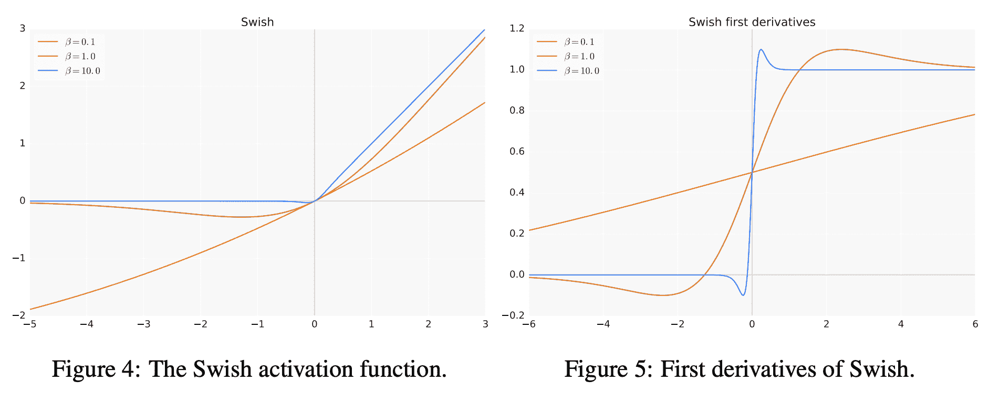
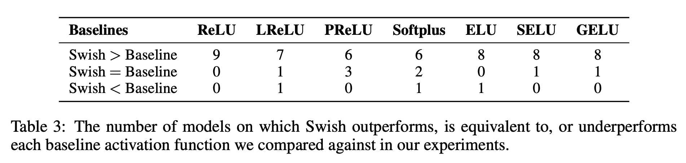
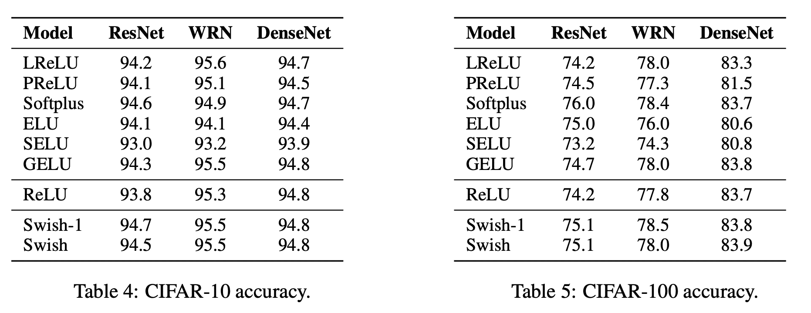
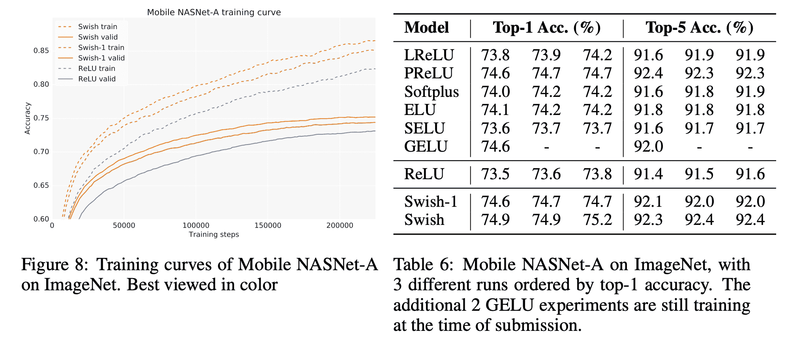
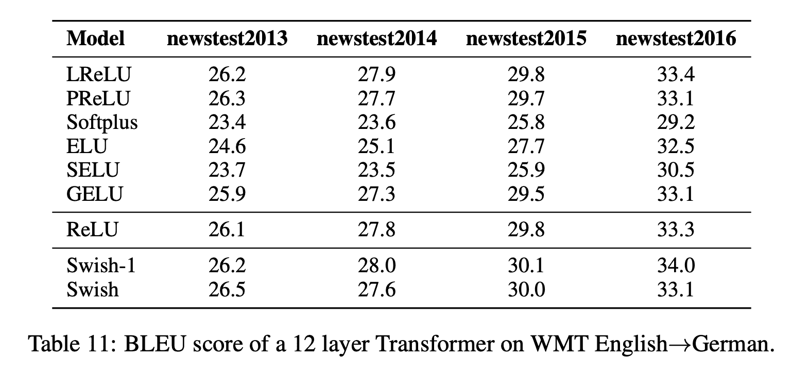
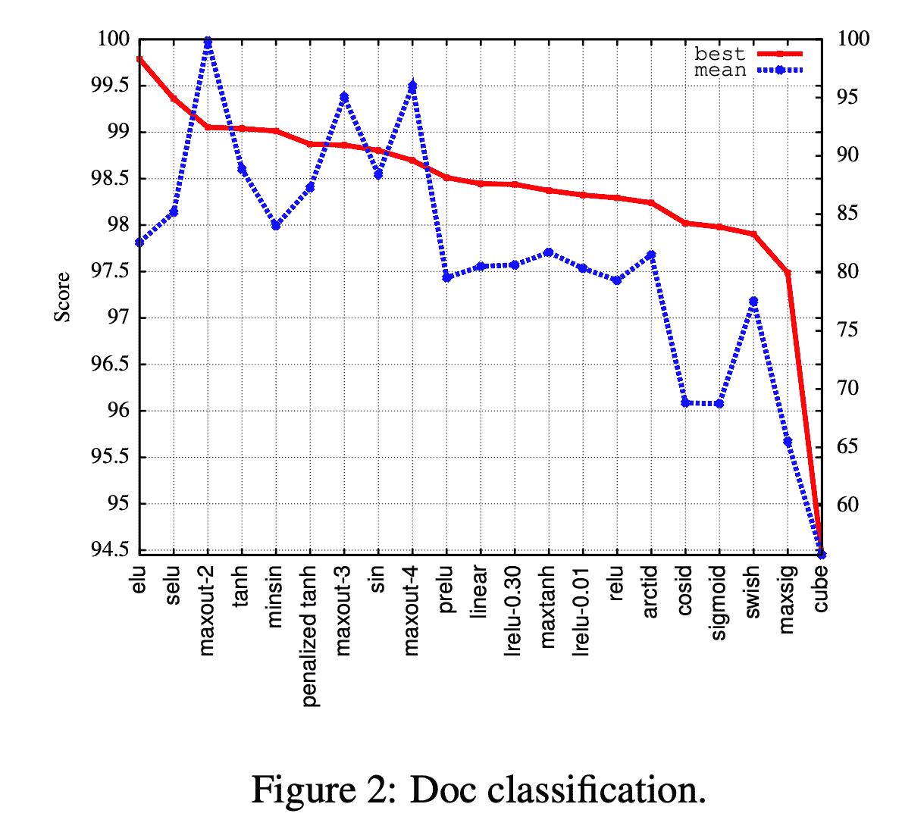
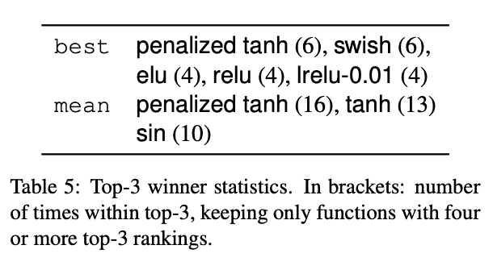

# Swish 激活功能

> 原文：<https://blog.paperspace.com/swish-activation-function/>

在深度神经网络的数百层和数百万个参数的宏伟计划中，激活函数可能看起来是一个非常小的组件，但它们的重要性是至关重要的。激活函数不仅通过引入非线性来帮助训练，而且还有助于网络优化。自从感知器出现以来，激活函数一直是影响神经网络训练动态的关键因素。从早期的阶跃函数到目前大多数领域的默认激活，ReLU，激活函数一直是研究的重点领域。

ReLU(整流线性单元)已被广泛接受为训练深度神经网络的默认激活函数，因为它在不同任务域和网络类型中的通用性，以及在计算复杂性方面极其廉价的成本(考虑到公式本质上是$max(0，x)$)。然而，在这篇博文中，我们看一看谷歌大脑在 2018 年提出的一篇题为“[搜索激活功能](https://arxiv.org/pdf/1710.05941.pdf)的论文，这篇论文激发了对不同类型激活功能的作用的新一轮研究。该论文提出了一种称为 Swish 的新型激活函数，它是使用神经架构搜索(NAS)方法发现的，与 ReLU 或 Leaky ReLU 等标准激活函数相比，在性能上表现出显著的改善。然而，这篇博客文章不仅基于上面指定的论文，还基于 EMNLP 发表的另一篇论文，题为“[是时候嗖嗖了吗？跨 NLP 任务比较深度学习激活功能](https://arxiv.org/abs/1901.02671)”。本文本质上是对 Swish 在各种以自然语言处理为中心的任务上的经验评估。注意，在这篇博文中，我们将讨论 Swish 本身，而不是作者用来发现它的 NAS 方法。

我们将首先看看这篇论文背后的动机，然后剖析 Swish 的结构及其与 SILU (Sigmoid 加权线性单元)的相似之处。然后，我们将浏览前面提到的两篇论文的结果，最后提供一些结论性的评论和 PyTorch 代码，用 Swish 训练你自己的深度神经网络。

### 目录

1.  动机
2.  嗖嗖
3.  PyTorch Code
4.  显著的成果
5.  结论
6.  参考

## 摘要

### 搜索激活功能

> 深度网络中激活函数的选择对训练动态和任务绩效有重要影响。目前，最成功和最广泛使用的激活函数是整流线性单元(ReLU)。尽管已经提出了各种手工设计的 ReLU 替代物，但是由于不一致的增益，没有一个能够成功地替代它。在这项工作中，我们提出利用自动搜索技术来发现新的激活功能。使用基于穷举和强化学习的搜索的组合，我们发现了多个新的激活功能。我们通过使用最佳发现的激活函数进行经验评估来验证搜索的有效性。我们的实验表明，最好的激活函数$f(x) = x sigmoid(\beta x)$我们称之为 Swish，在许多具有挑战性的数据集上，它往往比 ReLU 更好地工作。例如，简单地用 Swish 单元替换 ReLUs，对于 Mobile NASNet-A 和 Inception-ResNet-v2，ImageNet 上的 top-1 分类精度分别提高了 0.9%和 0.6%。Swish 的简单性和它与 ReLU 的相似性使得从业者很容易在任何神经网络中用 Swish 单元替换 ReLU。

### 是时候换衣服了吗？跨 NLP 任务比较深度学习激活函数

> 激活函数在神经网络中起着至关重要的作用，因为它们是被归因于深度学习成功故事的非线性。目前最流行的激活功能之一是 ReLU，但最近已经提出或“发现”了几个竞争对手，包括 LReLU 功能和 swish。虽然大多数工作在少数任务(通常来自图像分类)和少数竞争对手(通常是 ReLU)上比较新提出的激活函数，但我们在八个不同的 NLP 任务上对 21 个激活函数进行了第一次大规模比较。我们发现一个很大程度上未知的激活函数在所有任务中表现最稳定，即所谓的惩罚双曲正切函数。我们还表明，它可以成功地取代 LSTM 细胞中的 sigmoid 和 tanh 门，导致在具有挑战性的 NLP 任务中比标准选择提高 2 个百分点(pp)。

## 动机

激活函数是理解神经网络训练动力学的主要研究领域。虽然激活函数的作用是巨大的，但它们在应用前景中仅被视为一个组成部分，而在像平均场理论(MFT)这样的理论领域中，围绕激活函数的争论更加激烈。虽然 ReLU 和 Leaky ReLU 因其在公式和计算复杂性方面的简单性而占据了主导地位，但许多人已经提出了更平滑的变体来改善优化和信息传播，如 eLU 和 Softplus，但它们都只是一夜之间的奇迹，未能取代曾经如此通用的 ReLU。

> 在这项工作中，我们使用自动搜索技术来发现新的激活功能。我们致力于寻找新的标量激活函数，它接受一个标量作为输入，输出一个标量，因为标量激活函数可以用来代替 ReLU 函数而不改变网络结构。使用穷举和基于强化学习的搜索相结合，我们发现了一些新的激活函数，表现出良好的性能。为了进一步验证使用搜索来发现标量激活函数的有效性，我们根据经验评估了最佳发现的激活函数。最好发现的激活函数，我们称之为 Swish，是$f(x) = x sigmoid(\beta x)$其中$\beta$是一个常量或可训练参数。我们的大量实验表明，Swish 在应用于各种挑战性领域(如图像分类和机器翻译)的深度网络上始终匹配或优于 ReLU。

## 嗖嗖



简单来说，Swish 是 SILU 激活函数的扩展，该函数是在论文“[Sigmoid-Weighted Linear Units for Neural Network Function Approximation in Reinforcement Learning](https://arxiv.org/pdf/1702.03118.pdf#:~:text=tion%20(dSiLU).-,The%20activation%20of%20the%20SiLU%20is%20computed%20by%20the%20sigmoid,version%20of%20the%20sigmoid%20function.)”中提出的。e^{-x}}$.的公式是＄f(x)= x \ ast sigmoid(x)＄,其中＄sigmoid(x)= \ frac { 1 } { 1 在 Swish 公式中所做的微小修改是添加了一个可训练的$ beta $参数，使其成为$f(x) = x \ast sigmoid(\beta x)$参数。如上图所示，它有几个关键的独特属性，这些属性使它不同于 ReLU，并且比 ReLU 更好。首先，Swish 是一个光滑的连续函数，不像 ReLU 是一个分段线性函数。Swish 允许传播少量负权重，而 ReLU 将所有负权重的阈值设置为零。这是一个极其重要的性质，对于非单调平滑激活函数的成功至关重要，如 Swish，当用于越来越深的神经网络时。最后，可训练参数允许更好地调整激活函数以最大化信息传播并推动更平滑的梯度，这使得景观更容易优化，从而更好更快地概化。Swish 也是一种自门控激活功能，因为它通过将输入用作与自身的 sigmoid 相乘的门来调制输入，这是首次在长短期记忆(LSTMs)中引入的概念。

## PyTorch Code

以下代码片段提供了 Swish 的 PyTorch 实现，其中＄\ beta = 1 ＄,这是 SILU，因为这是使用最广泛的变体。

```py
import torch
import torch.nn as nn

class Swish(nn.Module):
    def __init__(
        self,
    ):
        """
        Init method.
        """
        super(Swish, self).__init__()

    def forward(self, input):
        """
        Forward pass of the function.
        """
        return input * torch.sigmoid(input)
```

要在 CIFAR 数据集上运行配备有 Swish 激活功能的 ResNet 模型(例如 ResNet-18 ),请使用以下命令。

**CIFAR-10**

```py
python train_cifar_full.py --project Swish --name swish1 --version 1 --arch 1
```

**CIFAR-100**

```py
python train_cifar100_full.py --project Swish --name swish --version 1 --arch 1
```

注意:您需要一个 Weights & Biases 帐户来启用 WandB Dashboard 记录。

## 显著的成果



## 结论

虽然 Swish 是一篇非常有影响力的论文，促进了对激活函数的更多研究，但激活函数 Swish 本身还不能取代 ReLU，因为与它相关的计算复杂性增加了。虽然几乎不可能推广到像 ReLU 一样具有成本效益的激活函数，但随着更平滑的激活函数变体的出现，只有时间才能证明 ReLU 是否会被淘汰。

## 参考

1.  [搜索激活功能](https://arxiv.org/pdf/1710.05941.pdf)
2.  是时候换衣服了吗？跨 NLP 任务比较深度学习激活功能