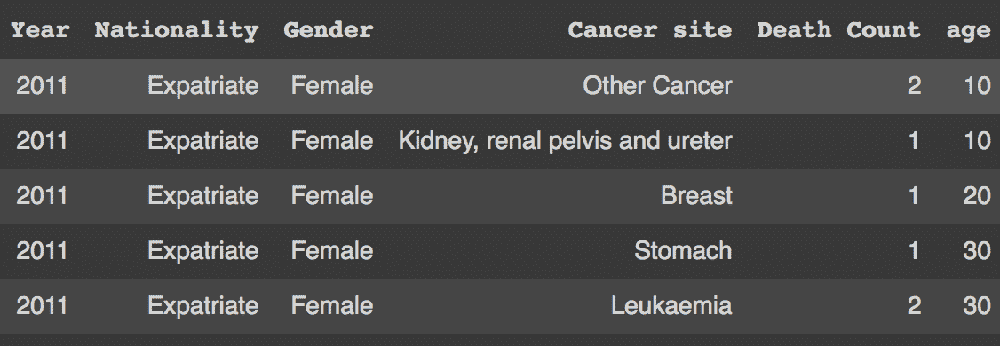

# 解决表格数据问答的比较

> 原文：<https://blog.paperspace.com/tapas-question-answering/>

本文对表格数据的自然语言问答问题进行了详细的研究。我们将介绍一些使用深度学习的方法，深入研究所用的架构和数据集，并使用合适的评估指标比较它们的性能。

回答表格数据上的问题是自然语言处理中的一个研究问题，有许多方法可以解决。有些涉及一种启发式方法来分解自然语言输入，并将其翻译为结构化查询语言可以理解的语言，而其他一些则涉及训练深度学习模型。

一个好的解决方案包括以下内容:

*   了解列和值之间的关系
*   对自然语言查询有很好的语义理解
*   保持性能、内存和跨域可解释性的效率

这就是我们在本教程中试图完成的。我们还将涵盖以下内容:

*   使用启发式方法理解表格数据
*   人工智能辅助工具与预训练模型
*   TableQA:一个人工智能辅助的表格数据问答工具
*   预训练模型的流行数据集
*   塔帕斯
*   选择最佳解决方案
*   结论

# 使用启发式方法理解表格数据

表格数据是由行和列构成的数据。由于数据可能很大，在给定一个条件或一组条件的情况下，手动提取特定用户查询的答案并不容易。表格数据也可以在关系数据库中找到。

虽然结构化查询语言(SQL)查询通常用于从数据库中提取特定信息，但是个人对 SQL 查询的了解可能是有限的。一个更通用的解决方案是使用自然语言查询表格数据。

LN2SQL 是一种使用启发式方法将自然语言转换成 SQL 查询的方法。一组解析器用于将自然语言结构分解成各自的 SQL 组件。同义词库用于改进关键字过滤，使特定实体(如列名、SQL 关键字等)的翻译更加容易。然后将查询 SQL 输出以获取结果。

# 人工智能辅助工具与预训练模型

神经网络有助于以多种方式理解表格数据。例如，预先训练的模型可以预测将自然语言查询的复杂结构与表格数据相连接的模式，方法是嵌入它们并通过神经网络模型。

其他解决方案没有在包含表格信息的数据集上预先训练，而是使用人工智能和一些启发式算法来得出解决方案。这些被称为人工智能辅助工具。下面我们就来看看这样一个工具。

# TableQA:一个人工智能辅助的表格数据问答工具

正如我们前面看到的，将自然语言分解成更小组件的一种方法是将它们转换成 SQL 查询。一个 SQL 查询是由几个包含条件、聚合操作等的组成语句构建而成的。

[TableQA](https://github.com/abhijithneilabraham/tableQA) 以这种方式将自然语言查询转换成 SQL 查询。让我们来看一个如何使用这个工具查询从[阿布扎比开放平台](https://addata.gov.ae/)获得的[癌症死亡数据](https://github.com/abhijithneilabraham/tableQA/blob/master/tableqa/cleaned_data/Cancer Death - Data.csv)的演示。

首先，安装软件包和需求。通过 pip 安装模块:

`!pip install tableqa`

接下来，我们将从存储库中访问样本数据。

```py
!git clone https://github.com/abhijithneilabraham/tableQA/

%cd tableQA/tableqa/
```

现在我们先来看看数据。

```py
import pandas as pd

df = pd.read_csv("cleaned_data/Cancer Death - Data.csv")
# A first look at data
df.head()
```



Cancer death data

您可以看到我们试图查询的文件是一个 CSV(逗号分隔值)文件，其中包含诸如年份、国籍、性别、癌症部位、死亡人数和年龄等列。让我们试着从这个数据集中回答一些问题。

```py
from tableqa.agent import Agent

agent = Agent(df)

#Ask a question
agent.query_db("how many deaths of age below 40 had stomach cancer?")
```

`>>> [(24,)]`

我们还可以查看与相同内容相关联的 SQL 查询。

`agent.get_query("how many deaths of age below 40 had stomach cancer?")`

`>>> SELECT COUNT(death_count) FROM dataframe WHERE age  < 40 AND cancer_site = "Stomach"`

正如您在这里看到的，在列`Death Count`上有一个计数操作，条件是`age<40`和`Cancer Site="Stomach"`。

TableQA 使用支持深度学习的实体提取器和聚合子句分类器的组合来构建 SQL 查询。实体提取器通过将列映射到它们各自的值(如果问题中有值的话)来匹配条件。它使用在[班](https://rajpurkar.github.io/SQuAD-explorer/)上训练的预先训练的问题回答模型来帮助容易地从输入问题中定位列的值。

aggregate clause 分类器是一个两层深度学习模型，它有助于在以下任何方面对输入问题的性质进行分类:

*   挑选
*   数数
*   最高的
*   最低限度
*   平均的
*   总和

将实体提取和子句分类与一些试探法的帮助相结合将生成 SQL 查询，然后使用该查询来查询数据。这种方法的一个可能的优势是，添加任何新功能都不需要重新培训——一些定制修复可以通过修改代码，用更精确的模型替换内部的人工智能模型等来完成。

# 预训练模型的流行数据集

使用启发式的解决方案有其自身的局限性。问题复杂性的增加不容易用显式编程来解决。

例如，我们需要能够回答需要多个步骤的重要问题，比如:“今年的 F1 锦标赛谁获得了第一名？”或者“明天早上出发的最便宜的交通方式是什么？”

用包含这种问题的数据集预训练的模型可以用在需要类似人类的推理的情况下。

WikiTableQuestions 是一个数据集，由复杂的问题和维基百科的表格组成。该数据集包含来自各种主题的 2108 个表格(涵盖更多领域知识)和不同复杂性的 22033 个问题。

微软提供了一个顺序问答数据集，也被称为 [SQA](https://www.microsoft.com/en-us/download/details.aspx?id=54253) 。回答一系列问题的任务是在 HTML 表格上完成的。SQA 是通过分解来自维基问答(WTQ)的 2022 个问题创建的。每个 WTQ 问题被分解成三个，产生一个 6，066 个序列的数据集，总共包含 17，553 个问题。每个问题还与表格中单元格位置形式的答案相关联。

这项任务的另一个流行数据集是 [WikiSQL](https://github.com/salesforce/WikiSQL) ，这是一个由 80654 对人工注释的问题和 SQL 查询组成的数据集，分布在维基百科的 24241 个表中。与上面的其他数据集不同，WikiSQL 包含从带有注释组件的问题映射而来的 SQL 查询。

# TAPAS:通过预训练的弱监督表解析

2020 年，谷歌研究开源了一个流行的深度学习模型，用于查询表格数据，而不生成逻辑表单，称为 TAPAS。它将屏蔽语言建模(MLM)方法扩展到结构化数据。

像 BERT 一样，TAPAS 使用必须对表格输入进行编码的特性。然后，它初始化对端到端训练的文本序列和表格的联合预训练，并且能够成功地恢复被屏蔽的单词和表格单元。它可以通过选择表格单元格的子集从查询中进行推断。如果可用，聚合操作也在它们之上执行。使用 TAPAS 对各种数据集进行了基准测试，包括 WTQ、SQA 和 WIKISQL。

让我们看一个例子。

首先，安装要求:

`!pip install tapas-table-parsing`

将模型文件从云中复制到我们的机器上:

`!gsutil cp gs://tapas_models/2020_04_21/tapas_sqa_base.zip . && unzip tapas_sqa_base.zip`

我们将创建一个 predict()函数，以数据帧的形式输入表格:

```py
import tensorflow.compat.v1 as tf
import os 
import shutil
import csv
import pandas as pd
import IPython

tf.get_logger().setLevel('ERROR')
from tapas.utils import tf_example_utils
from tapas.protos import interaction_pb2
from tapas.utils import number_annotation_utils
from tapas.scripts import prediction_utils

os.makedirs('results/sqa/tf_examples', exist_ok=True)
os.makedirs('results/sqa/model', exist_ok=True)
with open('results/sqa/model/checkpoint', 'w') as f:
  f.write('model_checkpoint_path: "model.ckpt-0"')
for suffix in ['.data-00000-of-00001', '.index', '.meta']:
  shutil.copyfile(f'tapas_sqa_base/model.ckpt{suffix}', f'results/sqa/model/model.ckpt-0{suffix}')

max_seq_length = 512
vocab_file = "tapas_sqa_base/vocab.txt"
config = tf_example_utils.ClassifierConversionConfig(
    vocab_file=vocab_file,
    max_seq_length=max_seq_length,
    max_column_id=max_seq_length,
    max_row_id=max_seq_length,
    strip_column_names=False,
    add_aggregation_candidates=False,
)
converter = tf_example_utils.ToClassifierTensorflowExample(config)

def convert_interactions_to_examples(tables_and_queries):
  """Calls Tapas converter to convert interaction to example."""
  for idx, (table, queries) in enumerate(tables_and_queries):
    interaction = interaction_pb2.Interaction()
    for position, query in enumerate(queries):
      question = interaction.questions.add()
      question.original_text = query
      question.id = f"{idx}-0_{position}"
    for header in table[0]:
      interaction.table.columns.add().text = header
    for line in table[1:]:
      row = interaction.table.rows.add()
      for cell in line:
        row.cells.add().text = cell
    number_annotation_utils.add_numeric_values(interaction)
    for i in range(len(interaction.questions)):
      try:
        yield converter.convert(interaction, i)
      except ValueError as e:
        print(f"Can't convert interaction: {interaction.id} error: {e}")

def write_tf_example(filename, examples):
  with tf.io.TFRecordWriter(filename) as writer:
    for example in examples:
      writer.write(example.SerializeToString())

def predict(table_data, queries):
  table=[list(table_data.columns)]+table_data.values.tolist()
  examples = convert_interactions_to_examples([(table, queries)])
  write_tf_example("results/sqa/tf_examples/test.tfrecord", examples)
  write_tf_example("results/sqa/tf_examples/random-split-1-dev.tfrecord", [])

  ! python -m tapas.run_task_main \
    --task="SQA" \
    --output_dir="results" \
    --noloop_predict \
    --test_batch_size={len(queries)} \
    --tapas_verbosity="ERROR" \
    --compression_type= \
    --init_checkpoint="tapas_sqa_base/model.ckpt" \
    --bert_config_file="tapas_sqa_base/bert_config.json" \
    --mode="predict" 2> error

  results_path = "results/sqa/model/test_sequence.tsv"
  all_coordinates = []
  df = pd.DataFrame(table[1:], columns=table[0])
  display(IPython.display.HTML(df.to_html(index=False)))
  print()
  with open(results_path) as csvfile:
    reader = csv.DictReader(csvfile, delimiter='\t')
    for row in reader:
      coordinates = prediction_utils.parse_coordinates(row["answer_coordinates"])
      all_coordinates.append(coordinates)
      answers = ', '.join([table[row + 1][col] for row, col in coordinates])
      position = int(row['position'])
      print(">", queries[position])
      print(answers)
  return all_coordinates 
```

现在，让我们使用一个示例表，并将其作为 dataframe 加载。它由包含演员姓名和他们出演的电影数量的列组成。

```py
data = {'Actors': ["Brad Pitt", "Leonardo Di Caprio", "George Clooney"], 'Number of movies': ["87", "53", "69"]}
queries = ["Who played less than 60 movies", "How many movies has George Clooney played in?"]
table = pd.DataFrame.from_dict(data)
result = predict(table, queries)
```

从表中可以看出模型推断如下:

```py
> Who played less than 60 movies
Leonardo Di Caprio
> How many movies has George Clooney played in?
69
```

然而，使用 TAPAS 有一定的限制。它将单个表作为上下文来处理，这些表可以放在内存中。这使得它不适合大型数据集或多个数据库。此外，需要多个聚合操作的问题是不可能的，例如:“有多少演员的平均电影数高于 10？”

# 选择最佳解决方案

这个任务的好的解决方案取决于各种因素和用户偏好。

使用试探法的非深度学习解决方案是最快的，但它们的代价是语义理解能力差。

像 TAPAS 这样的深度学习模型可以帮助理解自然语言问题和表格结构的复杂语义，但是它会带来内存问题和昂贵的计算要求。

像 TableQA 这样的人工智能辅助解决方案在使用启发式方法方面具有优势，因为在大多数情况下，可以修改启发式方法以提高解决方案的性能，而不必重新训练深度学习模型。但是随着自然语言变得越来越复杂，从表中检索信息时会出现更多的错误。

# 结论

在本文中，我们介绍了针对表格数据问答的各种解决方案。我们还看到了不同的解决方案，它们使用启发式和深度学习从语义上解析从表格数据和自然语言问题中组合的信息。选择最佳解决方案需要考虑各种因素:速度、理解自然语言的能力以及记忆。