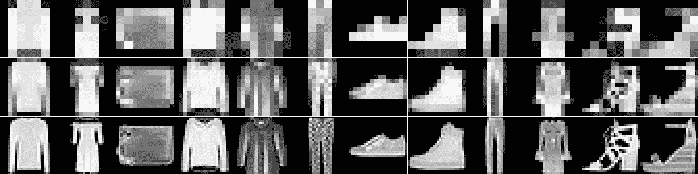
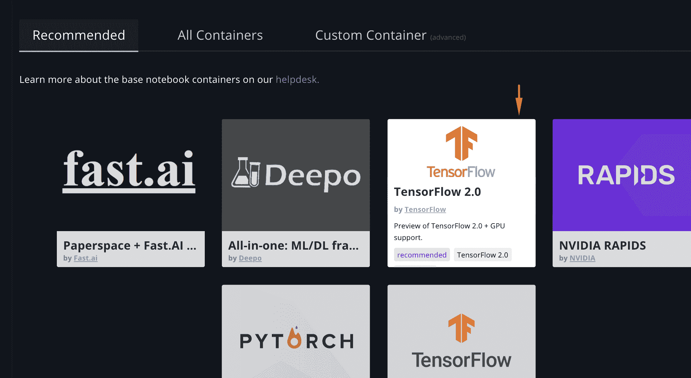

# TensorFlow 2.0 in Action

> 原文：<https://blog.paperspace.com/tensorflow-2-0-in-practice/>

TensorFlow 是用于深度学习项目的最受欢迎的框架之一，即将推出一个主要的新版本- TensorFlow 2.0。幸运的是，我们不必等待官方发布。测试版可在官方网站[上进行测试，您也可以在 Paperspace Gradient 上使用预配置的模板。在本教程中，我们将介绍 TensorFlow 2.0 中的一些新的主要功能，以及如何在深度学习项目中利用它们。这些特性是急切执行、tf.function 装饰器和新的分布接口。本教程假设您熟悉 TensorFlow、Keras API 和创成式模型。](https://www.tensorflow.org/install)

为了演示 TensorFlow 2.0 的功能，我们将实现一个 GAN 模型。我们将在这里实现的 GAN 论文是 [MSG-GAN](https://arxiv.org/pdf/1903.06048.pdf) :用于稳定图像合成的多尺度梯度 GAN。这里，发生器产生多个不同分辨率的图像，鉴别器决定给予它的多个分辨率。通过让生成器生成多分辨率图像，我们确保整个网络中的潜在特征与输出图像相关。

## 数据集设置

训练网络的第一步是启动数据管道。这里，我们将使用时尚 MNIST 数据集，并使用已建立的数据集 API 来创建张量流数据集。

```py
def mnist_dataset(batch_size):
    #fashion MNIST is a drop in replacement for MNIST that is harder to solve 
    (train_images, _), (_, _) = tf.keras.datasets.fashion_mnist.load_data()
    train_images = train_images.reshape([-1, 28, 28, 1]).astype('float32')
    train_images = train_images/127.5  - 1
    dataset = tf.data.Dataset.from_tensor_slices(train_images)
    dataset = dataset.map(image_reshape)
    dataset = dataset.cache()
    dataset = dataset.shuffle(len(train_images))
    dataset = dataset.batch(batch_size, drop_remainder=True)
    dataset = dataset.prefetch(1)
    return dataset

#Function for reshaping images into the multiple resolutions we will use
def image_reshape(x):
    return [
        tf.image.resize(x, (7, 7)),
        tf.image.resize(x, (14, 14)),
        x
    ] 
```

TensorFlow 2.0 中实现的急切执行消除了初始化变量和创建会话的需要。有了热切的执行，我们现在可以以更 pythonic 化的方式使用 TensorFlow，并随时进行调试。这扩展到了 TensorFlow 中的数据集 api，使我们能够通过迭代与数据管道交互。

```py
# use matplotlib to plot a given tensor sample
def plot_sample(sample):
    import matplotlib.pyplot as plt
    import matplotlib.gridspec as gridspec
    num_samples = min(NUM_EXAMPLES, len(sample[0]))

    grid = gridspec.GridSpec(num_res, num_samples)
    grid.update(left=0, bottom=0, top=1, right=1, wspace=0.01, hspace=0.01)
    fig = plt.figure(figsize=[num_samples, 3])
    for x in range(3):
        images = sample[x].numpy() #this converts the tensor to a numpy array
        images = np.squeeze(images)
        for y in range(num_samples):
            ax = fig.add_subplot(grid[x, y])
            ax.set_axis_off()
            ax.imshow((images[y] + 1.0)/2, cmap='gray')
    plt.show()

# now lets plot a sample
dataset =  mnist_dataset(BATCH_SIZE)
for sample in dataset: # the dataset has to fit in memory with eager iteration
    plot_sample(sample) 
```



Random Sample of the Fashion MNIST Dataset

* * *

## 模型设置

既然数据集已经制作并验证完毕，我们就可以继续创建生成器和鉴别器模型了。在 2.0 中，Keras 接口是所有深度学习的接口。这意味着发生器和鉴别器是像任何其他 Keras 模型。这里我们将制作一个标准的生成器模型，它有一个噪声向量输入和三个输出图像，从最小到最大排序。

```py
def generator_model():
    outputs = []

    z_in = tf.keras.Input(shape=(NOISE_DIM,))
    x = layers.Dense(7*7*256)(z_in)
    x = layers.BatchNormalization()(x)
    x = layers.LeakyReLU()(x)
    x = layers.Reshape((7, 7, 256))(x)

    for i in range(3):
        if i == 0:
            x = layers.Conv2DTranspose(128, (5, 5), strides=(1, 1),
                padding='same')(x)
            x = layers.BatchNormalization()(x)
            x = layers.LeakyReLU()(x)
        else:
            x = layers.Conv2DTranspose(128, (5, 5), strides=(2, 2),
                padding='same')(x)
            x = layers.BatchNormalization()(x)
            x = layers.LeakyReLU()(x)

        x = layers.Conv2D(128, (5, 5), strides=(1, 1), padding='same')(x)
        x = layers.BatchNormalization()(x)
        x = layers.LeakyReLU()(x)

        outputs.append(layers.Conv2DTranspose(1, (5, 5), strides=(1, 1),
            padding='same', activation='tanh')(x))

    model = tf.keras.Model(inputs=z_in, outputs=outputs)
    return model 
```

接下来，我们制作鉴别器模型。

```py
def discriminator_model():
    # we have multiple inputs to make a real/fake decision from
    inputs = [
        tf.keras.Input(shape=(28, 28, 1)),
        tf.keras.Input(shape=(14, 14, 1)),
        tf.keras.Input(shape=(7, 7, 1))
    ]

    x = None
    for image_in in inputs:
        if x is None:
            # for the first input we don't have features to append to
            x = layers.Conv2D(64, (5, 5), strides=(2, 2),
                padding='same')(image_in)
            x = layers.LeakyReLU()(x)
            x = layers.Dropout(0.3)(x)
        else:
            # every additional input gets its own conv layer then appended
            y = layers.Conv2D(64, (5, 5), strides=(2, 2),
                padding='same')(image_in)
            y = layers.LeakyReLU()(y)
            y = layers.Dropout(0.3)(y)
            x = layers.concatenate([x, y])

        x = layers.Conv2D(128, (3, 3), strides=(1, 1), padding='same')(x)
        x = layers.LeakyReLU()(x)
        x = layers.Dropout(0.3)(x)

        x = layers.Conv2D(64, (5, 5), strides=(2, 2), padding='same')(x)
        x = layers.LeakyReLU()(x)
        x = layers.Dropout(0.3)(x)

    x = layers.Flatten()(x)
    out = layers.Dense(1)(x)
    inputs = inputs[::-1] # reorder the list to be smallest resolution first
    model = tf.keras.Model(inputs=inputs, outputs=out)
    return model

# create the models and optimizers for later functions
generator = generator_model()
discriminator = discriminator_model()
generator_optimizer = tf.keras.optimizers.Adam(1e-3)
discriminator_optimizer = tf.keras.optimizers.Adam(1e-3) 
```

* * *

## 用 tf.functions 训练

创建了生成器和鉴别器模型后，进行训练的最后一步是构建我们的训练循环。我们不会在这里使用 Keras 模型拟合方法来展示定制训练循环如何与 tf.functions 和分布式训练一起工作。tf.function 装饰器是 TensorFlow 2.0 中最有趣的工具之一。Tf.functions 获取给定的本机 python 函数，并将其签名到 TensorFlow 执行图上。与使用传统的 python 函数相比，这提供了性能提升，传统的 python 函数必须使用上下文切换，而不能利用图优化。要获得这种性能提升，有许多注意事项。性能下降最大的是将 python 对象作为参数传递，而不是 TensorFlow 类。考虑到这一点，我们可以使用函数装饰器创建自定义的训练循环和损失函数。

```py
# this is the custom training loop
# if your dataset cant fit into memory, make a train_epoch tf.function
#    this avoids the dataset being iterarted eagarly which can fill up memory
def train(dataset, epochs):
     for epoch in range(epochs):
         for image_batch in dataset:
             gen_loss, dis_loss = train_step(image_batch)

# prediction of 0 = fake, 1 = real
@tf.function
def discriminator_loss(real_output, fake_output):
    real_loss = tf.nn.sigmoid_cross_entropy_with_logits(
        tf.ones_like(real_output), real_output)
    fake_loss = tf.nn.sigmoid_cross_entropy_with_logits(
        tf.zeros_like(fake_output), fake_output)
    return tf.nn.compute_average_loss(real_loss + fake_loss)

@tf.function
def generator_loss(fake_output):
    loss = tf.nn.sigmoid_cross_entropy_with_logits(
        tf.ones_like(fake_output), fake_output)
    return tf.nn.compute_average_loss(loss)

@tf.function
def train_step(images):
    noise = tf.random.normal([BATCH_SIZE, NOISE_DIM])

    #gradient tapes keep track of all calculations done in scope and create the
    #    gradients for these
    with tf.GradientTape() as gen_tape, tf.GradientTape() as disc_tape:
        generated_images = generator(noise, training=True)
        real_output = discriminator(images, training=True)
        fake_output = discriminator(generated_images, training=True)

        gen_loss = generator_loss(fake_output)
        dis_loss = discriminator_loss(real_output, fake_output)

    gradients_of_generator = gen_tape.gradient(gen_loss,
        generator.trainable_variables)
    gradients_of_discriminator = disc_tape.gradient(dis_loss,
        discriminator.trainable_variables)

    generator_optimizer.apply_gradients(zip(gradients_of_generator,
        generator.trainable_variables))
    discriminator_optimizer.apply_gradients(zip(gradients_of_discriminator,
        discriminator.trainable_variables))

    return gen_loss, dis_loss

# lets train
train(dataset, 300) 
```


MSG-GAN Training for 300 Epochs

* * *

## 2.0 中的分布

在我们的自定义训练循环建立之后，是时候将它分布在多个 GPU 上了。在我看来，新的专注于策略的分布式 API 是 2.0 中最令人兴奋的特性。这也是最具实验性的，并不是所有的发行版特性目前都被每个场景所支持。使用分布式 API 很简单，只需要对当前代码做一些修改。首先，我们必须选择我们想要用于分布式培训的策略。这里我们将使用镜像策略。这种策略将工作分配给单台机器上的可用 GPU。还有其他策略在工作中，但这是目前唯一支持自定义训练循环的策略。使用策略很简单；选择策略，然后将代码放入范围内。

```py
strategy = tf.distribute.MirroredStrategy()
with strategy.scope():
    # move all code we want to distribute in scope
    #    model creation, loss function, train functions 
```

这个界面很好用，这是使用 Keras fit 方法训练时唯一需要做的改动。我们正在使用一个自定义的训练循环，所以我们仍然有一些修改要做。首先需要修复数据集。数据集创建的每个训练批次将被拆分到每个 GPU 上。分布在 4 个 GPU 上的批量大小为 256 的数据集将在每个 GPU 上放置批量大小为 64 的数据。我们需要调整数据集的批处理大小，以使用全局批处理大小，而不是我们想要的每个 GPU 的批处理大小。还需要使用一个实验函数来准备用于分发的数据集。

```py
NUM_GPUS = strategy.num_replicas_in_sync
dataset =  mnist_dataset(BATCH_SIZE * NUM_GPUS)
# we have to use this experimental method to make the dataset distributable
dataset = strategy.experimental_distribute_dataset(dataset) 
```

最后一步是用分布式训练函数包装训练阶跃函数。这里我们必须使用另一个实验函数。这个需要我们给它一个非 tf.function 来分配。

```py
@tf.function
def distributed_train(images):
    gen_loss, dis_loss = strategy.experimental_run_v2(
        # remove the tf functions decorator for train_step
        train_step, args=(images,))
    # this reduces the return losses onto one device
    gen_loss = strategy.reduce(tf.distribute.ReduceOp.MEAN, gen_loss, axis=None)
    dis_loss = strategy.reduce(tf.distribute.ReduceOp.MEAN, dis_loss, axis=None)
    return gen_loss, dis_loss

# also change train() to use distributed_train instead of train_step
def train(dataset, epochs):
     for epoch in range(epochs):
         for image_batch in dataset:
             gen_loss, dis_loss = distributed_train(image_batch) 
```

现在，当我运行分配程序时，我得到了以下 1070 的数字。

*   1 个 GPU:平均 200.26 毫秒/图像
*   3 个 GPU:平均 39.27 毫秒/图像

我们预计性能会提高 3 倍，而不是 5 倍，但是，嘿，这只是测试版。

现在，我们已经使用了急切执行来检查数据管道，使用 tf.functions 进行训练，并使用带有自定义丢失函数的新分布式 api。

享受探索和使用 TensorFlow 2.0 的乐趣。提醒一下，您可以使用 TensorFlow 2.0 和所有必要的库、驱动程序(CUDA、cuDNN 等)启动一个支持 GPU 的实例。)只需点击几下鼠标。



Launching a TensorFlow 2.0 instance in Gradient