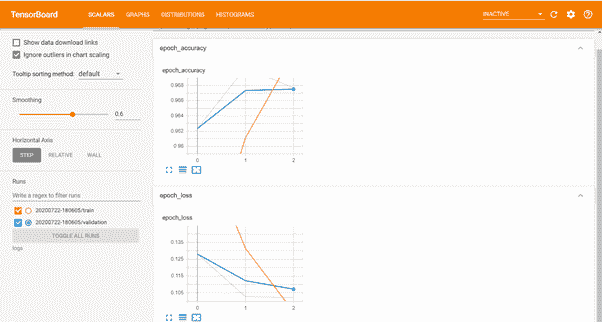
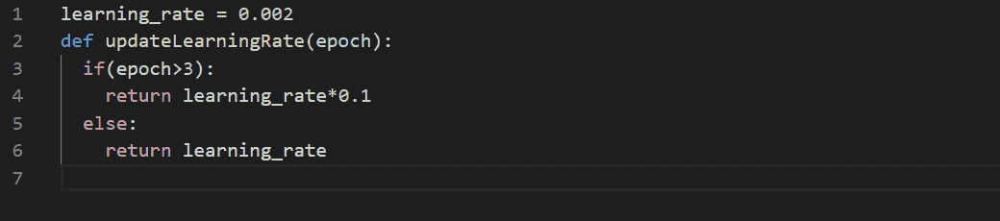
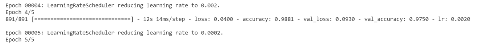
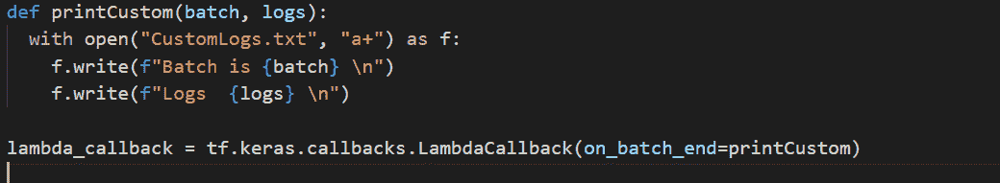
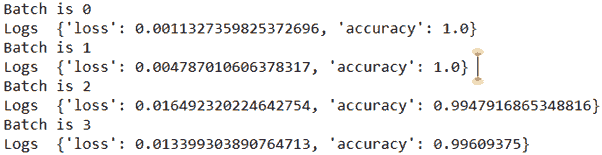
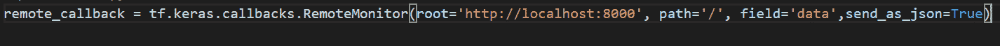
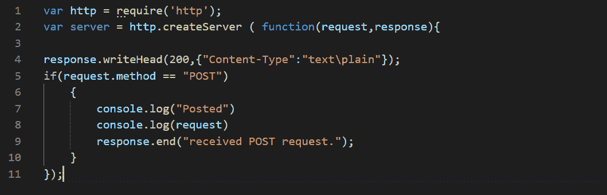
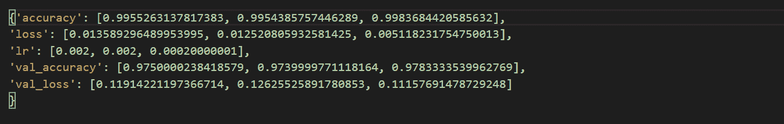

# TensorFlow 回调指南

> 原文：<https://blog.paperspace.com/tensorflow-callbacks/>

如果你正在建立深度学习模型，你可能需要坐几个小时(甚至几天)才能看到任何真正的结果。您可能需要停止模型训练以更改学习率，将训练日志推送到数据库以备将来使用，或者在 TensorBoard 中显示训练进度。看起来我们可能需要做很多工作来完成这些基本任务——这就是 TensorFlow 回调的作用。

在本文中，我们将介绍 TensorFlow 回调的细节、用法和示例。这篇文章的大纲如下:

*   什么是回调函数？
*   当回调被触发时
*   TensorFlow 2.0 中可用的回调
*   结论

你也可以在 ML Showcase 上运行完整的代码[。](https://ml-showcase.paperspace.com/projects/tensorflow-callback-functions)

# 什么是回调函数？

简单地说，回调是在训练过程的给定阶段训练期间执行的特殊实用程序或函数。回调可以帮助你防止过度拟合，可视化训练进度，调试你的代码，保存检查点，生成日志，创建一个 [TensorBoard](https://docs.paperspace.com/machine-learning/wiki/tensorboard) 等等。TensorFlow 中有许多回调函数，您可以使用多个。我们将看看不同的回调函数以及它们的使用示例。

## 当回调被触发时

当某个事件被触发时，回调被调用。在训练期间有几种类型的事件可以导致回调的触发，例如:
`on_epoch_begin`:顾名思义，当一个新的纪元开始时，该事件被触发。
`on_epoch_end`:当一个时期结束时触发。
`on_batch_begin`:新一批通过训练时触发。
`on_batch_end`:当一批训练结束。
`on_train_begin`:训练开始时。
`on_train_end`:训练结束时。

要在模型训练中使用任何回调，您只需要在`model.fit`调用中传递回调对象，例如:

```py
model.fit(x, y, callbacks=list_of_callbacks)
```

## TensorFlow 2.0 中可用的回调

让我们看看`tf.keras.callbacks`模块下可用的回调。

### 1.提前停止

这个回调用的很频繁。这允许我们监控我们的度量，并且当它停止改进时停止模型训练。比如，假设你想在精度没有提高 0.05 的情况下停止训练；您可以使用这个回调来实现这一点。在某种程度上，这有助于防止模型过度拟合。

```py
tf.keras.callbacks.EarlyStopping(monitor='val_loss', 
                                min_delta=0, 
                                patience=0, 
                                verbose=0, 
                                mode='auto', 
                                baseline=None, 
                                restore_best_weights=False)
```

`monitor`:我们想要监控的指标的名称。
`min_delta`:我们在每个纪元中期望的最小改进量。
`patience`:停止训练前等待的历元数。
`verbose`:是否打印附加日志。
`mode`:定义被监控的指标是增加、减少，还是从名称中推断；可能的值有`'min'`、`'max'`或`'auto'`。
`baseline`:被监控指标的值。
否则，它将获得最后一个纪元的权重。

通过用于训练的`on_epoch_end`触发器执行`EarlyStopping`回调。

### 2.模型检查点

这个回调允许我们在训练期间定期保存模型。这在训练需要长时间训练的深度学习模型时尤其有用。这个回调监视训练，并根据度量定期保存模型检查点。

```py
tf.keras.callbacks.ModelCheckpoint(filepath, 
                                     monitor='val_loss', 
                                     verbose=0, 
                                     save_best_only=False,
                                     save_weights_only=False, 
                                     mode='auto', 
                                     save_freq='epoch')
```

`filepath`:保存模型的路径。你可以用格式选项传递文件路径，比如`model-{epoch:02d}-{val_loss:0.2f}`；这将使用名称中提到的值保存模型。
`monitor`:要监视的度量的名称。
`save_best_only`:如果`True`，最佳模型不会被覆盖。
`mode`:定义被监控的指标是增加、减少还是从名称中推断；可能的值有`'min'`、`'max'`或`'auto'`。
`save_weights_only`:如果`True`，则只保存模型的重量。否则将保存整个模型。
`save_freq`:如果`'epoch'`，模型将在每个历元后保存。如果传递了一个整数值，模型将在整数个批次之后保存(不要与 epochs 混淆)。

通过训练的`on_epoch_end`触发器执行`ModelCheckpoint`回调。

### 3.张量板

如果您想要可视化您的模型的培训总结，这是最好的回调之一。这个回调为 TensorBoard 生成日志，您可以稍后启动它来可视化您的训练进度。我们将在另一篇文章中详细介绍 TensorBoard。

```py
> tf.keras.callbacks.TensorBoard(log_dir='logs',
                                 histogram_freq=0, 
                                 write_graph=True, 
                                 write_images=False,    
                                 update_freq='epoch', 
                                 profile_batch=2, 
                                 embeddings_freq=0,    
                                 embeddings_metadata=None, 
                                 **kwargs)
```

现在我们将只看到一个参数`log_dir`，它是您需要存储日志的文件夹的路径。要启动 TensorBoard，您需要执行以下命令:

```py
tensorboard --logdir=path_to_your_logs
```

您可以在开始训练之前或之后启动 TensorBoard。



TensorBoard

TensorBoard 回调也在`on_epoch_end`触发。

### 4.学习率计划程序

在用户希望随着训练的进行更新学习率的情况下，这个回调非常方便。例如，随着训练的进行，你可能想在一定数量的时期后降低学习率。`LearningRateScheduler`会让你做到这一点。

```py
tf.keras.callbacks.LearningRateScheduler(schedule, verbose=0)
```

`schedule`:这是一个采用纪元索引并返回新学习率的函数。
`verbose`:是否打印附加日志。

下面是一个如何在三个纪元后降低学习率的例子。



Function to pass to the 'schedule' parameter for the LearningRateScheduler callback

正如您在下面的输出中所看到的，在第四个纪元之后，学习率已经降低。`verbose`已被设置为`1`以跟踪学习率。



In epoch 5 learning rate drops to 0.0002 from 0.002 

该回调也在`on_epoch_end`触发。

### 5.CSVLogger

顾名思义，这个回调将训练细节记录在一个 CSV 文件中。记录的参数有`epoch`、`accuracy`、`loss`、`val_accuracy`和`val_loss`。需要记住的一点是，在编译模型时，您需要将`accuracy`作为一个度量传递，否则您将得到一个执行错误。

```py
tf.keras.callbacks.CSVLogger(filename, 
                             separator=',', 
                             append=False)
```

记录器接受`filename`、`separator`和`append`作为参数。`append`定义是否追加到现有文件，或写入新文件。

通过训练的`on_epoch_end`触发器执行`CSVLogger`回调。因此，当一个时期结束时，日志被放入一个文件中。

### 6.LambdaCallback

当您需要在任何事件上调用一些自定义函数时，这个回调是必需的，而提供的回调是不够的。例如，假设您想将日志放入数据库。

```py
tf.keras.callbacks.LambdaCallback(on_epoch_begin=None, 
                                  on_epoch_end=None, 
                                  on_batch_begin=None, 
                                  on_batch_end=None,    
                                  on_train_begin=None, 
                                  on_train_end=None, 
                                  **kwargs)
```

这个回调函数的所有参数都需要一个函数，它接受这里指定的参数:
`on_epoch_begin`和`on_epoch_end`:历元、日志
`on_batch_begin`和`on_batch_end`:批处理、日志
`on_train_begin`和`on_train_end`:日志

让我们看一个例子:



Function to put logs in a file at end of a batch

该回调将在批处理后将日志放入一个文件中。您可以在文件中看到的输出是:



Logs generated

所有事件都会调用这个回调，并根据传递的参数执行自定义函数。

### 7.ReduceLROnPlateau

当指标停止改善时，如果您想要更改学习率，可以使用这个回调。与`LearningRateScheduler`相反，它将减少基于度量(而不是纪元)的学习。

```py
tf.keras.callbacks.ReduceLROnPlateau(monitor='val_loss', 
                                     factor=0.1, 
                                     patience=10, 
                                     verbose=0, 
                                     mode='auto',    
                                     min_delta=0.0001, 
                                     cooldown=0, 
                                     min_lr=0, 
                                     **kwargs)
```

许多参数与`EarlyStoppingCallback`相似，所以让我们把重点放在那些不同的参数上。
`monitor`、`patience`、`verbose`、`mode`、`min_delta`:这些与`EarlyStopping`类似。
`factor`:学习率应该减少的因子(新学习率=旧学习率*因子)。
`cooldown`:重新开始监视度量之前等待的时期数。
`min_lr`:学习率的最小界限(学习率不能低于此)。

这个回调也在`on_epoch_end`事件中被调用。

### 8.远程监控

当您想要将日志发布到 API 时，这个回调非常有用。这个回调也可以使用`LambdaCallback`来模拟。

```py
tf.keras.callbacks.RemoteMonitor(root='http://localhost:9000',                
                                   path='/publish/epoch/end/', 
                                   field='data',
                                   headers=None, 
                                   send_as_json=False)
```

`root`:这是网址。
`path`:这是端点名称/路径。
`field`:这是拥有所有日志的键的名字。
`header`:需要发送的表头。
`send_as_json`:如果`True`，数据将以 JSON 格式发送。

例如:



Callback

要查看回调的工作情况，您需要在 localhost:8000 上托管一个端点。您可以使用 Node.js 来做到这一点。将代码保存在文件 server.js 中:



然后通过键入`node server.js` 启动服务器(您应该已经安装了 node)。在纪元结束时，您将在节点控制台中看到日志。如果服务器没有运行，那么您将在 epoch 结束时收到警告。

这个回调也在`on_epoch_end`事件中被调用。

### 9.基线日志和历史

这两个回调自动应用于所有 Keras 模型。`history`对象由`model.fit`返回，并且包含一个字典，该字典具有各时期的平均准确度和损失。`parameters`属性包含带有用于训练的参数的字典(`epochs`、`steps`、`verbose`)。如果你有一个改变学习率的回调函数，那么它也是历史对象的一部分。



Output of model_history.history

`BaseLogger`累积各个时期的平均指标。因此，您在时段末尾看到的指标是所有批次的所有指标的平均值。

### 10.终结之南

如果损失变成`NaN`，则该回调终止训练。

```py
tf.keras.callbacks.TerminateOnNaN()
```

## 结论

您可以根据自己的需要使用这些回调函数。使用多个回调通常是好的(甚至是必要的)，比如用`TensorBoard`来监控进度，用`EarlyStopping`或`LearningRateScheduler`来防止过度拟合，用`ModelCheckpoint`来保存你的训练进度。

请记住，您可以在渐变上免费运行`tensorflow.keras`中所有可用回调的代码[。我希望这有助于你训练你的模型。](https://ml-showcase.paperspace.com/projects/tensorflow-callback-functions)

快乐深度学习。