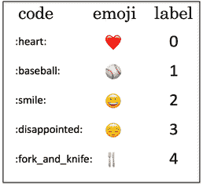
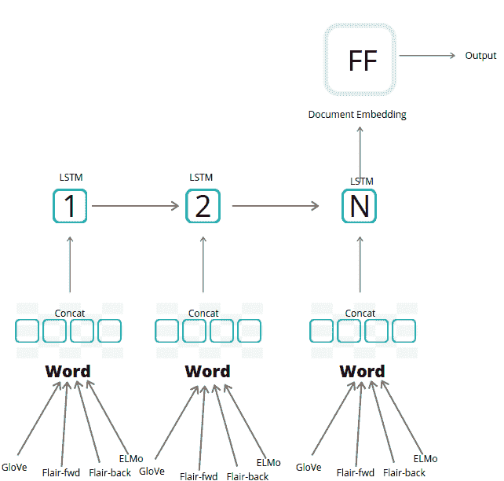
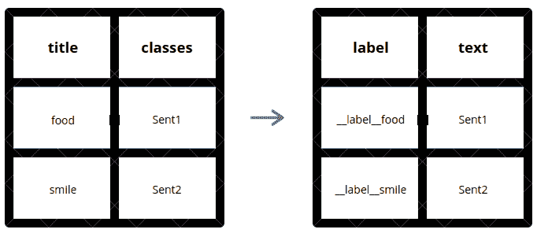
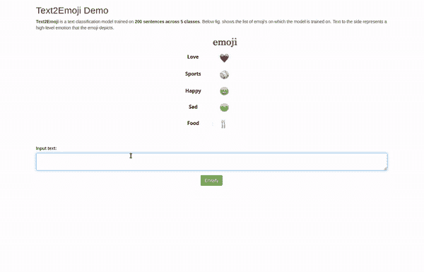
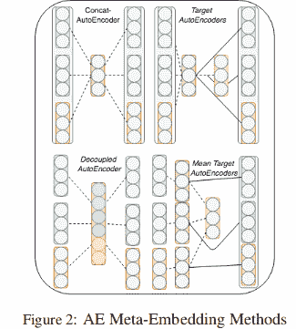

# 使用 Flair 框架进行堆叠嵌入的 text 2 表情预测器

> 原文：<https://blog.paperspace.com/text2emoji/>


Photo by [Domingo Alvarez E](https://unsplash.com/@domingoalvarze?utm_source=ghost&utm_medium=referral&utm_campaign=api-credit) / [Unsplash](https://unsplash.com/?utm_source=ghost&utm_medium=referral&utm_campaign=api-credit)

与以前不同，表情符号现在已经成为几乎任何以文本形式表达情绪和感受的对话的一个组成部分。多年来，表情符号的使用和表达已经发展并获得了广泛的流行。表情符号还可以作为一种独立的非语言来传达大多数情绪，并通过增强其情商来补充书面文本。最近，手机的内置键盘已经更新，可以在你输入时为给定的单词/短语建议表情符号。这种功能为用户提供了表达情绪的媒介，而不必痛苦地从表情湖中搜索相关的表情符号。

> *最新研究表明，表情符号的吸引力远不止是年轻用户一个人——事实上，超过 80%的英国 T2 成年人现在在短信中使用表情符号，而高达 40%的人承认自己创造了一条完全由表情符号组成的信息。- [来源](https://www.socialmediatoday.com/social-networks/emojis-why-we-love-them-so-much-and-what-they-mean-0)*

快速建立原型的基本方法之一是拥有一个大型单词数据库及其各自的表情映射，并在需要时查询该数据库以获得一个单词及其可能的拼写变化。

在这篇博客中，我们将为短句而不仅仅是一个单词建立一个表情符号建议系统。我们还构建了一个界面来展示整个系统。

## 资料组

我们将在这里使用来自[的数据集](https://github.com/prakhar21/Text2Emoji/blob/master/data/emoji_train.csv)。我们的数据包含以相关表情符号作为类别标签的短句。标签标记为 0-4 之间的数字，从下表中可以看到实际表情符号的映射—



Dataset Label Mapping

鉴于我们的训练数据非常有限(200 个句子)，对于我们来说，利用预训练的[单词嵌入](https://machinelearningmastery.com/what-are-word-embeddings/)来完成这项任务变得非常重要。这些是基于单词在非常大的语料库中出现的上下文训练的单词的一些通用表示。对于这个博客，我们将使用多个单词嵌入的堆栈来表示一个单词。我们将在 ****方法论**** 一节中看到更多关于该方法及其细节。为了形式化，这是一个[多类分类](https://en.wikipedia.org/wiki/Multiclass_classification)问题，其中对于给定的话语，我们需要预测最合适的表情符号。

## 方法学

如上所述，这项任务的核心思想是建立一个多类分类器。我们首先用一些预先训练的语义单词向量来表示句子中的每个单词，希望它们经过足够的训练来捕捉该单词不同的可能语义。为了说明每种预训练方法的优势，我们将一个单词表示为多个单词嵌入的堆栈。这些随后被输入到一个浅层的 LSTM 网络，该网络负责将单词按顺序关联起来，并学习它们之间的依赖关系。作为输出，我们期望得到数据中每个句子的固定长度向量表示。这个最终的句子向量稍后被馈送到跨 5 个类别的具有 [Softmax 激活](https://en.wikipedia.org/wiki/Softmax_function)功能的前馈神经网络，并且最终的标签被选择为具有最大概率的类别。

*下图显示了整个架构的图示视图—*



Architecture

这种方法的新颖之处在于我们表达句子中每个单词的方式。我们利用 4 种不同类型的预训练单词嵌入在它们的连接版本中来表示句子中的单个单词。我们使用的 4 种类型的嵌入是— [**手套**](https://www.google.com/search?client=ubuntu&channel=fs&q=glove+word+embeddings&ie=utf-8&oe=utf-8) *(无多义词层次)*、[**Flair-news-FWD**](https://github.com/flairNLP/flair/blob/master/resources/docs/embeddings/FLAIR_EMBEDDINGS.md)*(语境化人物层次)*、[**Flair-news-back**](https://github.com/flairNLP/flair/blob/master/resources/docs/embeddings/FLAIR_EMBEDDINGS.md)*(语境化人物层次)*、 [**ELMo**](https://allennlp.org/elmo) *(多义词意识)使用 4 种不同类型的嵌入的假设是，所有的嵌入都以不同的方式训练，使它们能够自由地在各自的维度上捕捉同一单词的不同语义。这也有助于处理词汇表之外的标记，尤其是在合并字符级嵌入时。*

*下面的片段显示了模型架构-*

```py
Model: "TextClassifier(
  (document_embeddings): DocumentRNNEmbeddings(
    (embeddings): StackedEmbeddings(
      (list_embedding_0): WordEmbeddings('glove')
      (list_embedding_1): FlairEmbeddings(
        (lm): LanguageModel(
          (drop): Dropout(p=0.05, inplace=False)
          (encoder): Embedding(300, 100)
          (rnn): LSTM(100, 2048)
          (decoder): Linear(in_features=2048, out_features=300, bias=True)
        )
      )
      (list_embedding_2): FlairEmbeddings(
        (lm): LanguageModel(
          (drop): Dropout(p=0.05, inplace=False)
          (encoder): Embedding(300, 100)
          (rnn): LSTM(100, 2048)
          (decoder): Linear(in_features=2048, out_features=300, bias=True)
        )
      )
      (list_embedding_3): ELMoEmbeddings(model=elmo-medium)
    )
    (word_reprojection_map): Linear(in_features=5732, out_features=256, bias=True)
    (rnn): LSTM(256, 512)
    (dropout): Dropout(p=0.5, inplace=False)
  )
  (decoder): Linear(in_features=512, out_features=5, bias=True)
  (loss_function): CrossEntropyLoss()
)"
```

## 实验

我们将使用 [**Flair NLP 框架**](https://github.com/flairNLP/flair) 来训练模型。Flair 是在[**py torch**](https://pytorch.org/)之上开发的简单 NLP 库，由[**Zalando Research**](https://research.zalando.com/)开源。



Data Transformation

*下面是执行上述数据转换的代码片段—*

```py
def segment_data(data_file):
    try:
        import pandas as pd
    except ImportError:
        raise

    data = pd.read_csv(data_file, encoding='latin-1').sample(frac=1).drop_duplicates()
    data = data[['classes', 'title']].rename(columns={"classes":"label", "title":"text"})
    data['label'] = '__label__' +data['label'].astype(str)
    data['text'] = data['text'].apply(lambda k: k.lower().strip())
    data.to_csv('./data/whole.csv', sep='\t', index = False, header = False)
    data.iloc[0:int(len(data)*0.8)].to_csv('./data/train.csv', sep='\t', index = False, header = False)
    data.iloc[int(len(data)*0.8):int(len(data)*0.9)].to_csv('./data/test.csv', sep='\t', index = False, header = False)
    data.iloc[int(len(data)*0.9):].to_csv('./data/dev.csv', sep='\t', index = False, header = False)
    return
```

Creating training, testing and validation splits

接下来，我们加载所有必要的嵌入，并返回封装它们的列表。每个单词以所有四种嵌入方案的堆叠版本作为其最终表示来嵌入。

```py
def initialize_embeddings():
    """
    Summary:
        Stacks the list of pre-trained embedding vectors to be used as word representation (in concat.)
    Return:
        list: Returns list of pretrained embeddings vectors
    """
    word_embeddings = [
			WordEmbeddings('glove'),
			FlairEmbeddings('news-forward'),
			FlairEmbeddings('news-backward'),
                        ELMoEmbeddings('medium')
		]
    return word_embeddings

word_embeddings = initialize_embeddings()
```

Embedding Stacking

在最终确定我们的单词表示之后，我们继续使用**[documentrnembeddings](https://github.com/flairNLP/flair/blob/master/resources/docs/TUTORIAL_5_DOCUMENT_EMBEDDINGS.md)**来学习上下文化的句子表示，然后用必要的超参数训练模型。你可以在这里阅读其他可能的池技术**。**

```py
document_embeddings = DocumentRNNEmbeddings(word_embeddings, hidden_size=512, reproject_words=True, reproject_words_dimension=256, rnn_type='LSTM', rnn_layers=1, bidirectional=False)

classifier = TextClassifier(document_embeddings, label_dictionary=corpus.make_label_dictionary(), multi_label=False)

trainer = ModelTrainer(classifier, corpus)

trainer.train('./model', max_epochs=20, patience=5, mini_batch_size=32, learning_rate=0.1)
```

Model Training

*你可以在[这个 github](https://github.com/prakhar21/Text2Emoji) 访问所有的原代码。*

*访问 [Gradient-AI fork](https://github.com/gradient-ai/Text2Emoji) 并点击“在 Gradient 上运行”[以访问此代码的笔记本版本](https://github.com/gradient-ai/Text2Emoji)，或使用本文中的“将此项目带入生活”链接。*

## 连接

最后，开发了一个基于 web 应用的 [**烧瓶**](https://github.com/pallets/flask) 来展示这个用例。



Text2Emoji Demo

你可以在这个 GitHub [链接](https://github.com/prakhar21/Text2Emoji/blob/master/emoji.html)访问这个演示的所有代码。

## 可能的改进

1.  针对这一特定任务微调预先训练的变形金刚模型，或者使用来自 [BERT](https://en.wikipedia.org/wiki/BERT_(language_model)) 的更高级的深度嵌入。
2.  分析结合[表情百科](https://github.com/bcongdon/python-emojipedia)(表情百科是一个表情参考网站，记录了 Unicode 标准中表情字符的含义和常见用法)和其他统计特征以及现有嵌入向量的效果。
3.  训练一个自动编码器，选取瓶颈层作为单词表示的**元嵌入**。请参考下图以供参考—



Reference 1

这就是我的博客，希望你喜欢阅读它。谢谢！

## 参考

1.  [https://arxiv.org/pdf/1808.04334.pdf](https://arxiv.org/pdf/1808.04334.pdf)