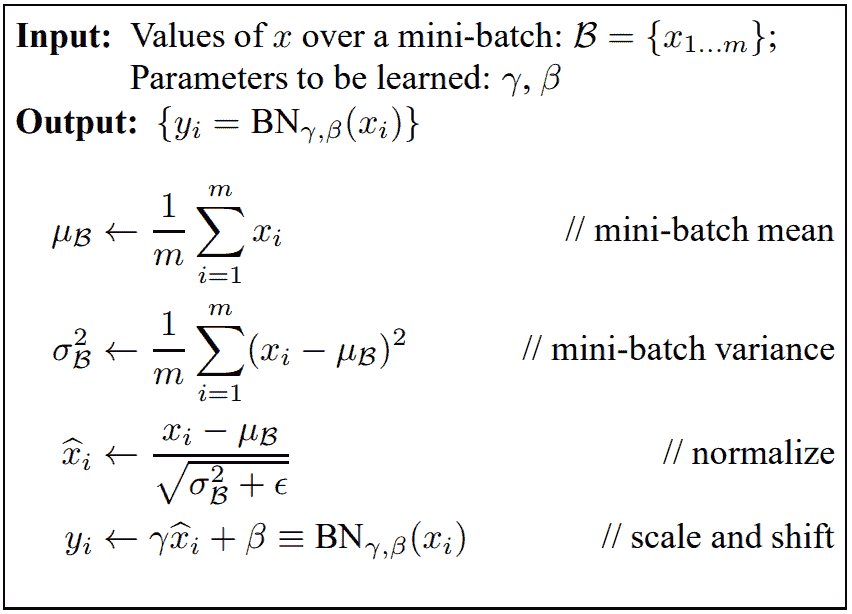
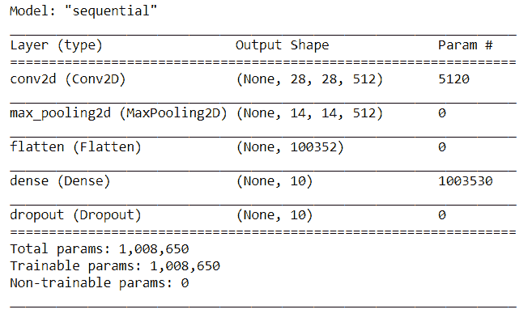
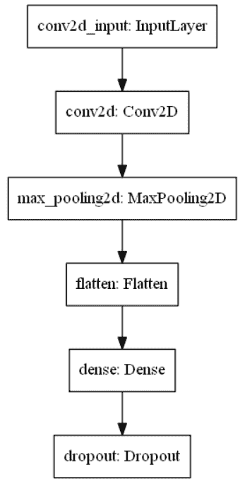
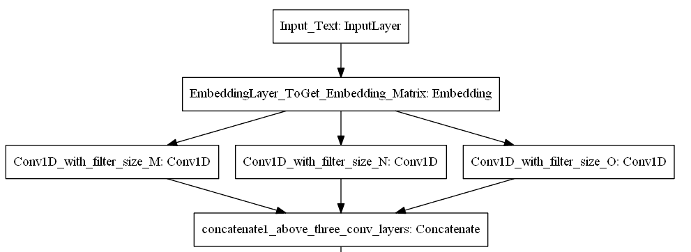
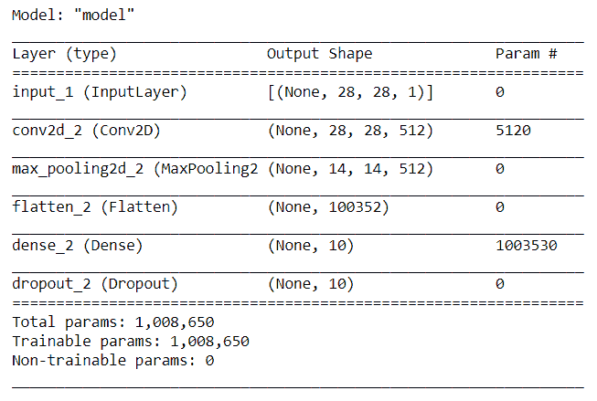
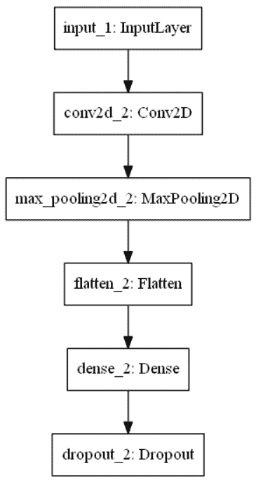
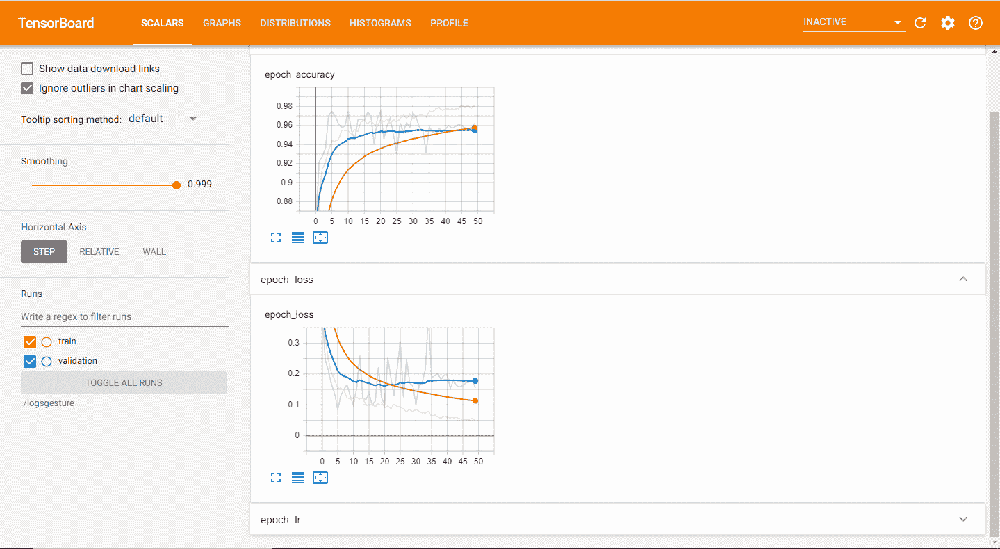

# 喀拉斯绝对指南

> 原文：<https://blog.paperspace.com/the-absolute-guide-to-keras/>

在本文中，我们将深入 TensorFlow 和 Keras 的世界。如果你还没有，我强烈推荐你先看看我以前的文章，[张量流绝对指南](https://blog.paperspace.com/absolute-guide-to-tensorflow)。它将帮助您更好地理解我们将在本文中涉及的各种概念。

快速回顾一下，到目前为止我们已经讨论了 [TensorFlow](https://blog.paperspace.com/absolute-guide-to-tensorflow) 的几个方面，包括加速器如何帮助加速计算；张量、常数和变量；反向传播、图、层、模型等。在我们深入研究 Keras 的基础知识和众多重要方面之前，让我们快速浏览一下目录。请随意进入您认为最相关的部分。

### 目录

*   Keras 简介
*   学习基础层
    1。输入层
    2。卷积和最大池层
    3。批量归一化层
    4。辍学层
    5。致密层
*   了解各种模型架构
    1。顺序型号
    2。功能 API 模型
    3。定制模型
*   回调
    1。提前停止
    2。检查站
    3。降低平稳状态下的 LR
    4。张量板
*   汇编和培训
*   结论

您可以跟随本文中的所有代码，并在 [Gradient 社区笔记本](https://ml-showcase.paperspace.com/projects/guide-to-tensorflow-and-keras)上的免费 GPU 上运行它。

## Keras 简介

TensorFlow 是一个用于开发神经网络的深度学习框架。正如我们在[上一篇文章](https://blog.paperspace.com/absolute-guide-to-tensorflow)中看到的，TensorFlow 实际上是一种低级语言，实现的整体复杂度较高，尤其是对于初学者。这个问题的解决方案是引入另一个深度学习库，它将简化 TensorFlow 的大部分复杂性。

Keras 深度学习库提供了一种更高级的构建神经网络的方法。正如他们的[官网](https://keras.io/)上描述的那样，Keras 是一个为人类设计的 API，而不是为机器设计的。这意味着该模块使人类执行编码操作变得更加简单。

使用像 Keras 这样的深度学习库的最大好处是，您的工作显著减少，因为您可以在几分钟内构建复杂的架构，而模块会考虑实际的过程。你的重点仍然是整体的架构设计，而不是错综复杂的细节。因此，对于所有级别的用户来说，Keras 可以作为一种更简单的方法来获得最佳性能。它还提供了大量有助于入门的文档。但是，在本文中，我们将涵盖您需要了解的关于 Keras 的每个重要方面。那么，事不宜迟，让我们开始吧。

## 学习基础层

Keras 模块使用户能够用称为“层”的元素构建块来构建神经网络。每一层都有其特定的功能和操作。在本文中，我们将着重于更好地理解如何使用这些层，而不会过多地讨论它们是如何工作的。

让我们来看看几个基本层，即输入层、卷积和最大池层、批量标准化层、丢弃层和密集层。虽然您可以将激活层用于激活功能，但我通常更喜欢在其他层中使用它们。我们将在下一节中讨论更多关于激活函数的内容，同时构建不同的体系结构。现在，让我们看看用于构建神经网络的一些基本层。

### 输入层

```py
from tensorflow.keras.layers import Input

input1 = Input(shape = (28,28,1)) 
```

输入层是最基本的层之一，通常用于定义模型的输入参数。正如我们将在下一节中观察到的，在顺序模型实现中，我们通常可以跳过输入层。但是，对于一些函数式 API 模型来说，它是必需的。

### 卷积层和最大池层(二维)

```py
from tensorflow.keras.layers import Convolution2D, MaxPooling2D

Convolution2D(512, kernel_size=(3,3), activation='relu', padding="same")
MaxPooling2D((2,2), strides=(2,2)) 
```

卷积层创建卷积核，该卷积核与层输入卷积以产生输出张量。max-pooling 层用于对卷积层的空间维度进行下采样，主要用于在对图像进行操作时创建位置不变性。当我们处理计算机视觉任务时，我们将在以后的文章中更详细地讨论这些层。

### 批量标准化层



[Source](https://arxiv.org/pdf/1502.03167.pdf)

上图是从头开始实现批量标准化图层的示意图。该图层的作用是通过应用一种变换来对输入进行规范化，该变换将平均输出保持在 0 美元左右，输出标准偏差保持在 1 美元左右。在训练阶段，每批输入都有单独的计算，并相应地执行归一化。然而，在预测阶段(即，在测试期间)，平均输出和标准偏差值是每批的平均值。

### 脱落层

这些层通常用于防止模型过度拟合。丢弃层将以设定的速率从隐藏节点中随机丢弃选定的部分，并在剩余节点上进行训练。测试时，我们不会丢弃任何层。

### 致密层

这些是常规的全连接层，可用于隐藏节点或输出层，以接收来自所建模型的最终预测。这些是神经网络最基本的构建模块。

## 理解各种模型架构

现在我们对 Keras 提供的层有了一个直觉，让我们也试着理解我们可以使用 Keras 构建的各种模型架构。在我们学习不同类型的模型架构之前，我们必须首先知道它们的用途。

作为一个高级库，Keras 主要提供了三种类型的模型架构，可以扩展更多的层和模块。这三种模型架构包括顺序模型、功能 API 模型和定制模型(也称为模型子类化)。这些架构中的每一个都有其特定的用例、优势和局限性。让我们从顺序模型开始，分别了解这些模型架构的更多信息。

> **注意:**我们还将简要讨论上一节中未涉及的其他层。然后，我们将了解激活函数的概念，学习一些激活函数，然后继续理解为什么以及何时应该使用它们。

### 序列模型

顺序模型是 Keras 提供的最简单的模型架构之一。一旦导入了`Sequential`类，就可以用它来堆叠我们在上一节中讨论过的许多层。序列模型由一堆层组成，其中每一层恰好有一个输入张量和一个输出张量。

顺序模型架构可以通过两种不同的方式构建。我们将在下面的代码中演示这两种方法，我们将使用这两种方法构建相同的模型架构。我们还将查看模型摘要，以更好地全面了解这些顺序模型是如何工作的。让我们从使用 Keras 库的`Sequential`类构建模型的第一种方法开始。

#### 方法一

```py
from tensorflow.keras.layers import Convolution2D, Flatten, Dense 
from tensorflow.keras.layers import Dropout, MaxPooling2D
from tensorflow.keras.models import Sequential

model = Sequential()
model.add(Convolution2D(512, kernel_size=(3,3), activation='relu', padding="same", input_shape=(28, 28, 1)))
model.add(MaxPooling2D((2,2), strides=(2,2)))
model.add(Flatten())
model.add(Dense(10, activation='relu'))
model.add(Dropout(0.5))
```

简单解释一下代码，我们可以看到我们从`layers`类中导入了所有需要的层。上面的方法是我导入层的首选方法，但是您也可以从模块中导入`layers`类，并通过调用您想要构建的特定函数和层来构建您的模型。这方面的一个例子如下:

```py
from tensorflow.keras import layers

layers.Convolution2D()
# Or:
layers.Dense()
```

我们使用`add`函数将层堆叠在彼此之上。我们首先使用指定的输入大小堆叠卷积层，然后添加一个 max-pooling 操作来对卷积层进行下采样。然后，我们添加了展平层来压缩我们所有的材料。因为我们还没有讨论展平层，让我们了解更多一点。

展平图层接受输入，并将输入的空间维度折叠为单个值。但是，它不会以任何方式影响批量大小。展平层的主要目的是在卷积层通过全连接神经网络进行计算操作之前，减少卷积层的复杂维数。

扁平化层之后，我们利用`Dense`层创建一个全连接的神经网络架构。最后，我们使用了`Dropout`层来防止过度拟合。我们还没有添加一个最终层来决定我们最终的输出是什么样子；这是因为我想首先介绍更多关于激活函数的内容。

术语“激活功能”来源于描述真实神经元在传递信息时的突触活动的生物学术语。在人工神经网络中，激活函数定义给定一个输入或一组输入的节点的输出。激活函数的完整概念非常庞大，因此出于本文的目的，我们将简要介绍您应该了解的特定激活函数。

整流线性单元(ReLU)激活函数是最流行的激活函数之一，通常在大多数神经网络层中默认使用。该激活功能有助于防止渐变爆炸或消失的问题。泄漏 ReLU 是在特定场景中表现更好的替代选择。虽然我们也有其他的激活函数，但是现在让我们把注意力集中在用于模型架构的最终密集层的最佳激活函数上。

如果在密集层中有一个节点，可以选择线性激活函数。当有两个节点时，可以添加一个 sigmoid 激活函数。最后，对于多类问题，我们使用 softmax 激活函数。在这种情况下，每个标签具有特定的概率，其中选择具有最高分配概率的类。有了对不同激活函数的基本理解，让我们来看看用 Keras 构建序列模型的第二种方法。

#### 方法二

```py
from tensorflow.keras.layers import Convolution2D, Flatten, Dense
from tensorflow.keras.layers import Dropout, MaxPooling2D
from tensorflow.keras.models import Sequential

model1 = Sequential([
    Convolution2D(512, kernel_size=(3,3), activation='relu', padding="same", input_shape=(28, 28, 1)),
    MaxPooling2D((2,2), strides=(2,2)),
    Flatten(),
    Dense(10, activation='relu'),
    Dropout(0.5)
])
```

这是不言自明的。`Sequential`构造函数用于指定的所需层。

现在让我们来看一下这两种方法的概要。下面提供的屏幕截图展示了层、它们的输出形状和参数数量。



Image by Author

让我们也简单地看一下我们刚刚构建的架构的图示。下面的代码将把一个模型保存到您的系统中，您可以在其中查看表示您的构造中的众多层的图像。注意，如果您试图在系统上本地运行下面的代码块，您可能还需要额外的安装，比如 Graphviz。

```py
from tensorflow import keras
from keras.utils.vis_utils import plot_model

keras.utils.plot_model(model, to_file='model.png', show_layer_names=True) 
```



Image by Author

对于两种构造方法，上述模型总结几乎完全相同。您可以在各自的系统上验证代码。打印两种架构的摘要并检查模型类型(在两种情况下都是连续的),并检查层的放置、输出形状以及参数。序列模型是创建神经网络最直接的方式，但它们可能并不总是最佳选择。让我们在考虑下一个模型架构时找出原因。

### 功能 API 模型

虽然序列模型易于构建，但在某些情况下，它们可能不是最佳选择。当你有一个非线性的拓扑或者需要一个分支状的架构时，那么合适的模型就不能用顺序的架构来构建。下图总结了不应使用序列模型的情况。



Image by Author

对于这种情况，我们使用函数式 API 模型，它提供了很大的灵活性，允许您构建非线性拓扑。功能 API 模型支持共享层和多输入多输出。让我们看一个简单的代码块来构建一个类似于我们在顺序模型中所做的架构。

#### 密码

```py
from tensorflow.keras.layers import Convolution2D, Flatten, Dense, Dropout
from tensorflow.keras.layers import Input, MaxPooling2D
from tensorflow.keras.models import Model

input1 = Input(shape = (28,28,1))
Conv1 = Convolution2D(512, kernel_size=(3,3), activation='relu', padding="same")(input1)
Maxpool1 = MaxPooling2D((2,2), strides=(2,2))(Conv1)
Flatten1 = Flatten()(Maxpool1)
Dense1 = Dense(10, activation='relu')(Flatten1)
Dropout1 = Dropout(0.5)(Dense1)
model = Model(input1, Dropout1)
```

模型总结如下。



Image by Author

而模型图如下。



Image by Author

通过模型总结和绘图，我们可以确定功能 API 可以用于构建类似于顺序架构以及具有独特非线性拓扑的模型。因此，函数式 API 模型具有不同的用例，并且在开发人员中被一致地用于创建复杂的神经网络架构。

### 定制模型

自定义模型(或模型子类化)是从零开始实现整个神经网络架构的地方。虽然函数式 API 非常灵活，并且最常被开发人员使用，但有时定制模型也用于特定的研究目的。您从头开始构建自己的架构，并完全控制其功能。下面显示了我的一个项目中的一个用例的实现代码块。

```py
import tensorflow as tf

class Encoder(tf.keras.Model):
    '''
    Encoder model -- That takes a input sequence and returns output sequence
    '''

    def __init__(self, inp_vocab_size, embedding_size, lstm_size, input_length):
        super(Encoder, self).__init__()

        # Initialize Embedding layer
        # Intialize Encoder LSTM layer

        self.lstm_size = lstm_size
        self.embedding = tf.keras.layers.Embedding(inp_vocab_size, embedding_size)
        self.lstm = tf.keras.layers.LSTM(lstm_size, return_sequences=True, return_state=True)

    def call(self, input_sequence, states):

        '''
          This function takes a sequence input and the initial states of the encoder.
          Pass the input_sequence input to the Embedding layer, Pass the embedding layer ouput to encoder_lstm
          returns -- All encoder_outputs, last time steps hidden and cell state
        '''

        embed = self.embedding(input_sequence)
        output, state_h, state_c = self.lstm(embed, initial_state=states)

        return output, state_h, state_c

    def initialize_states(self,batch_size):

        '''
        Given a batch size it will return intial hidden state and intial cell state.
        If batch size is 32- Hidden state shape is [32,lstm_units], cell state shape is [32,lstm_units]
        '''

        return (tf.zeros([batch_size, self.lstm_size]),
                tf.zeros([batch_size, self.lstm_size])) 
```

考虑到这三个主要的架构，你可以自由地构建你的深度学习模型来完成特定的项目或任务。也就是说，深度学习模型的旅程尚未完全完成。

我们将在下一节了解更多关于回调的内容。最后，我们将了解模型编译和训练阶段。

## 回收

回调在模型训练中起着重要的作用。回调是可以在训练的不同阶段执行操作的对象，例如在一个时期的开始、中间或结束时。它还会影响批次开始或结束时的训练。

虽然 Keras 中有很多回调可用，但我们将只关注构建深度学习模型时通常使用的几个最重要的回调。在模型的训练(或“拟合”)阶段，最常用的回调是提前停止、检查点、减少平台上的 LR 和张量板。我们将简要考虑每个回调及其各自的代码。

### 提前停止

```py
from tensorflow.keras.callbacks import EarlyStopping

early_stopping_monitor = EarlyStopping(patience=2)
```

当早期停止回调发现与先前的训练时期相比没有显著改善时，在指定的耐心之后停止训练过程。在这种情况下，在任何两个时期之后，如果确认损失没有改善，则停止训练过程。

### 模型检查点

```py
from tensorflow.keras.callbacks import ModelCheckpoint

checkpoint = ModelCheckpoint("checkpoint1.h5", monitor='accuracy', verbose=1,
                              save_best_only=True, mode='auto')
```

Keras 中的模型检查点回调保存了训练过程中获得的最佳权重。在训练时，由于过度拟合或其他因素，您的模型有可能在一些时期后开始表现不佳。无论哪种方式，您总是希望确保为任务的性能保存最佳权重。

您可以用自己选择的名称存储检查点。通常最好是监控最佳验证损失(使用`val_loss`)，但是您也可以选择监控您喜欢的任何指标。使用`ModelCheckpoint`的主要好处是存储您的模型的最佳权重，以便您可以在以后的测试或部署中使用它们。通过保存存储的重量，您还可以从该点重新开始训练程序。

### 降低平稳状态下的 LR

```py
from tensorflow.keras.callbacks import ReduceLROnPlateau

reduce = ReduceLROnPlateau(monitor='accuracy', factor=0.2, patience=10, 
                           min_lr=0.0001, verbose = 1)
```

在拟合模型时，在某个点之后，模型可能会停止改进。此时，降低学习速度通常是个好主意。`factor`决定了初始学习率必须降低的速率，即`new_lr = lr * factor`。

在等待指定数量的时期(本例中为`patience`，10)后，如果没有改进，则学习率会降低指定的系数。这种减少会持续下去，直到达到最小学习率。

回调独立工作。因此，如果您对`ReduceLROnPlateau`使用 10 的`patience`，增加您的`EarlyStopping`回调`patience`也是一个好主意。

### 张量板

```py
from tensorflow.keras.callbacks import TensorBoard

logdir='logs'
tensorboard_Visualization = TensorBoard(log_dir=logdir)
```



Image by Author

TensorBoard 回调是用户可用的最有价值的工具之一。有了它，您可以图形化地显示您的训练过程，并轻松发现模型工作的趋势。例如，通过您的分析，您可以确定在多少个历元后模型训练可以停止，以及哪个历元获得最佳结果。除此之外，它为开发人员提供了许多选项来分析和改进他们的模型。

Keras 的另一个重要方面是它提供了为特定用例创建自定义回调的能力。当我们使用它们时，我们将在以后的文章中更多地讨论这个主题。但是，如果您有兴趣了解更多关于创建自定义回调函数的信息，请随意访问下面的网站。

## 汇编和培训

构建模型架构和定义回调之后的下一个阶段是实现模型编译和训练步骤。幸运的是，在 Keras 的帮助下，这两个步骤都非常简单，只涉及很少的代码。

### 模型编译

```py
model.compile(loss='categorical_crossentropy',
              optimizer = Adam(lr = 0.001),
              metrics=['accuracy'])
```

Keras 中的编译过程为训练过程配置模型。在这一步中，您将定义一些最重要的参数，例如损失函数、优化器以及在训练模型时除“损失”之外要跟踪的指标。所使用的损失函数将因问题而异，而优化器通常是 Adam 优化器。也可以尝试其他选项(如 RMSprop ),看看什么最适合您的模型。一旦您完成了模型的编译，您就可以继续进行模型训练了。

### 拟合模型

```py
model.fit(train_generator,
          steps_per_epoch = train_samples//batch_size,
          epochs = epochs,
          callbacks = [checkpoint, reduce, tensorboard_Visualization],
          validation_data = validation_generator,
          validation_steps = validation_samples//batch_size,
          shuffle=True)
```

一旦我们完成了模型的编译，我们就可以使模型适合训练数据集。`fit`函数为固定数量的历元(数据集上的迭代)训练模型。为了更好地理解像反向传播这样的步骤是如何工作的，我强烈推荐看看这个系列的第一部分。您需要定义的基本参数是训练数据、时期数、批量大小和回调。

最后，我们使用`model.evaluate()`来评估模型的整体性能。该函数对于衡量模型的性能以及是否准备好进行部署非常有用。然后，我们可以利用`model.predict()`函数对新数据进行预测。

## 结论


Photo by [Domenico Loia](https://unsplash.com/@domenicoloia?utm_source=medium&utm_medium=referral) on [Unsplash](https://unsplash.com?utm_source=medium&utm_medium=referral)

在本文中，我们介绍了 TensorFlow 和 Keras 绝对指南的第二部分。在简介中，我们看到 Keras 是一个高级 API，它为 TensorFlow 的复杂编码需求提供了一种替代的简单方法。然后，我们获得了一种直觉，可以在 Keras 库的帮助下构建一些层。

有了 Keras 模块中一些层背后的基本直觉，理解可以构建的各种模型架构就变得更容易了。这些架构包括顺序模型、功能 API 模型和定制模型。根据特定任务的复杂性，您可以决定哪个选项最适合您的项目。我们还简要介绍了激活函数的效用及其用法。

从那里我们开始理解 Keras 提供的回调函数的重要性。除了学习一些基本的回调，我们还关注了 TensorBoard 回调，您可以使用它定期分析模型的性能。

最后，我们讲述了编译和训练过程。一旦构建了模型，您就可以保存它们，甚至可以将它们部署给广泛的受众，让他们从中受益。

这个关于 TensorFlow 和 Keras 的两部分系列应该让您对这些库的效用有一个基本的了解，以及如何使用它们来创建令人惊叹的深度学习项目。在接下来的文章中，我们将学习另一个基本的深度学习概念:迁移学习，有很多例子和代码。在那之前，享受你的编码吧！