# 图像处理中的图像概念

> 原文：<https://blog.paperspace.com/the-concept-of-images-in-image-processing/>

为了正确地掌握计算机视觉或一般图像处理中的过程或概念，理解数字图像的本质是必要的。在这篇文章中，我们将看看在数字空间中究竟是什么构成了图像，以便更好地理解和处理它们。

### 光学和数字感知

从光学角度来看，当物体反射的光进入人眼时，信号就会被发送到大脑，让我们能够感知物体的形状和颜色。另一方面，在数字环境中，计算机不具备感知形状和颜色的能力，而是将图像感知为空间平面中的数字集合。

### 数字图像的属性

当谈到数字环境中的图像时，人们通常会想到三个主要属性。分别是，维度，像素，通道。在本节中，我们将逐一介绍。

#### 尺寸

维度也称为坐标或轴，表示空间平面上的一种参考形式(因此称为空间维度)。考虑一张平面纸，将它的一边支撑起来，使它面向你。想象我们在这个平面上的任意点上，我们只能垂直(上下)、水平(左右)或两者的某种组合(成一定角度)移动。因为你在这个平面上的所有运动都可以用这两个方向来概括，为了以任何有意义的方式移动，我们需要两条参考线，一条水平的称为“x ”,另一条垂直的称为“y ”,如下图所示。更准确地说，水平参考可以称为维度 x，垂直参考维度 y。因为这两个维度足以描述这张纸上的任何运动或图形，所以我们可以说它是二维(2 维)表示。

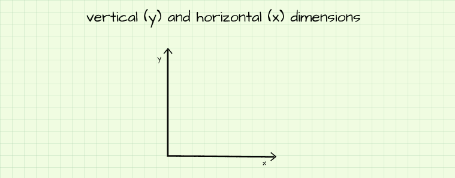

现在想象一下，如果那张纸只是一个立方体的六个表面中的一个。我们一直在这个表面上移动，表面的水平和垂直边缘分别代表 x 和 y。例如，如果我们想进入立方体的中心，我们需要另一条垂直于(90 度)当前表面的参考线。让我们称这条参考线为维度 z。突然之间，我们可以使用所有 3 个维度在这个假想的立方体内移动到任何地方，所以这个立方体被称为 3-D(3-维)表示。

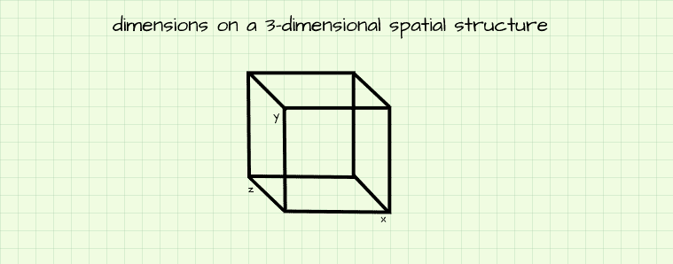

正如我们之前提到的，我们提到的所有 3 条参考线都称为尺寸。如果我们有某种数学背景，我们会发现术语 x、y 和 z 是笛卡尔坐标系中轴/维度的上下文精确描述(只是 3d 空间结构的另一个花哨名称)。在更几何学的意义上，它们被称为宽度、长度和深度，在地理学上它们是经度、纬度和高度。然而，在图像处理中(使用 Python 编程语言)，它们分别被称为尺寸/轴 1、尺寸/轴 0 和尺寸/轴 2。

##### 尺寸和位置的命名

空间平面上的任何一点都可以通过参照它在所有维度上的位置来定位。考虑 2-D 平面上位置(3，5)处的点 k，这意味着该点位于距离 x 轴上的原点 3 个单位和距离 y 轴上的原点 5 个单位处。出于命名目的，如果空间结构中的点出现在二维表示中，则命名为(x 位置，y 位置),如果出现在三维表示中，则命名为(x 位置，y 位置，z 位置)。

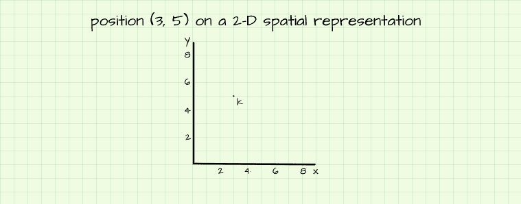

### 像素

像素是构成数字图像的数字表示。当处理浮点值时，它们的值可以从 0(无强度)到 1(最大强度)，或者当处理整数值时，从 0(无强度)到 255(最大强度)。这些像素被放在一起形成一个网格(行和列),其尺寸与上一节中提到的尺寸相同，从而形成一个二维图形。

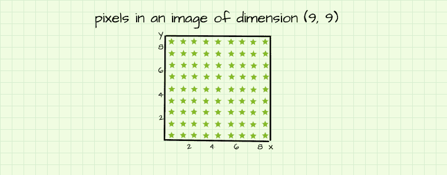

考虑我们在上一节中用于说明目的的 2-D 平面。想象这些轴被封闭起来形成一个正方形，如上图所示，那么它实际上就变成了一个 9 列 9 行的网格。当这个网格用像素填充时(为了方便起见，用绿色的星星表示)，它变成 9 行 9 列的图像，这意味着有 9 列和 9 行像素。更简洁地说，它变成了一个(9，9)像素的图像。为了确定该图像中存在的总像素数量，我们简单地将二维中存在的单元数量相乘，在本例中为 9*9 = 81 个像素。

#### 像素&位置的命名

在使用 Python 编程语言进行图像处理的情况下，将对我们一直使用的 2-D 平面进行轻微的修改。首先，平面的原点现在位于左上角，而不是左下角。其次，y 轴重命名为 dimension-0/axis-0，x 轴重命名为 dimension-1/axis-1。最后，从 0 开始计数，也就是说原点后的第一个度量是 0 而不是 1。

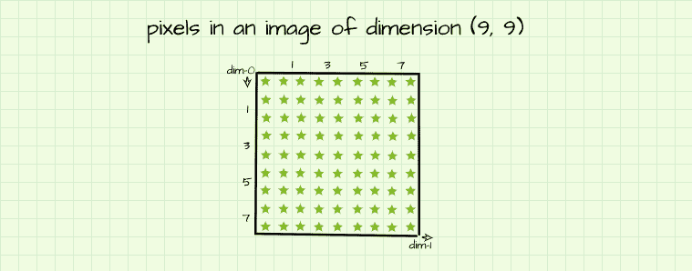

实现了所有这些更改后，我们现在有了一个标准的 Python 数组。该图像中像素的命名基本上是数组中元素的索引。右上角的像素位于索引`[0, 8]`，因为它位于第一行(行 0)和第九列(列 8)。在同一叶片中，第五行中的像素被索引为`[4]`(第 4 行)。使用`[row-number, column-number]`形式的数组索引可以定位图像中的任何像素。

#### 创建简单的图像

在数学中，有一个由行和列组成的数学公式，这个公式叫做矩阵。就像上面的示例(9，9)图像一样，矩阵由数字类型的行和列填充。在 Python 中，可以使用 NumPy 库将矩阵创建为数组，因此可以合理地说，计算机将数字图像视为像素数组。

为了证明这一点，我们不妨创建一个(9，9)零数组，并尝试将其可视化，如下所示。正如我们所看到的，由于数组中的所有元素(像素)都是 0(无强度)，所以数组在可视化时显示为一个黑色的图像。*暂时允许在 imshow()方法中使用“cmap”参数，稍后会变得更清楚。*

```py
#  import these dependencies
import numpy as np
import matplotlib.pyplot as plt
```

```py
#  creating (9, 9) array of zeros
image = np.zeros((9, 9))

#  attempting to visualize array
plt.imshow(image, cmap='gray')
```

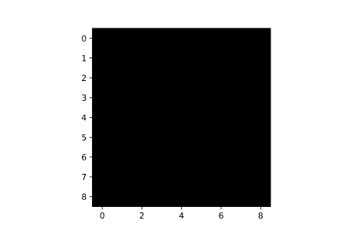

Image produced when the array is visualized.

当数组中不是所有元素都为零时会发生什么？请记住，在前面的章节中提到，当处理整数时，像素值的范围可以从 0(无强度)到 255(最大强度)。因此，从理论上讲，如果我们创建一个填充了一系列递增的整数值的数组，我们应该可以获得像素逐渐变亮的图像。让我们看看这在实践中是否成立。

```py
#  creating a 1-D array (vector) of elements ranging from 0 to 80
image = np.arange(81)
#  reshaping vector into 2-D array
image = image.reshape((9, 9))

#  attempting to visualize array
plt.imshow(image, cmap='gray')
```

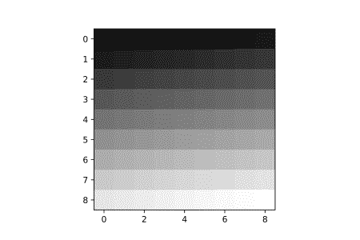

Pixels become progressively brighter.

在上面的代码块中，创建了一个元素范围从 0 到 80 的“一维数组”(实际上称为 vector)(因此总共有 81 个元素)。接下来，向量被整形为(9，9)数组，然后被可视化。显然，由于阵列中的像素(元素)从 0 增加到 80，像素强度从最暗到最亮逐渐增加，所以事实上像素强度理论证明是正确的。

```py
image

array([[ 0,  1,  2,  3,  4,  5,  6,  7,  8],
       [ 9, 10, 11, 12, 13, 14, 15, 16, 17],
       [18, 19, 20, 21, 22, 23, 24, 25, 26],
       [27, 28, 29, 30, 31, 32, 33, 34, 35],
       [36, 37, 38, 39, 40, 41, 42, 43, 44],
       [45, 46, 47, 48, 49, 50, 51, 52, 53],
       [54, 55, 56, 57, 58, 59, 60, 61, 62],
       [63, 64, 65, 66, 67, 68, 69, 70, 71],
       [72, 73, 74, 75, 76, 77, 78, 79, 80]])
```

The array created using the code block above.

##### 方差和相对像素强度

当处理图像中的像素时，每个像素的强度或亮度基于所有像素的整体性质。换句话说，像素值必须有变化，亮度才能发挥作用。例如，所有元素的值为 100 的数组将显示为涂黑的图像(类似于零数组)，因为其元素的方差为 o。

此外，当处理整数像素值时，如果所有像素都在 0 和 10 的范围内，则像素亮度将在这些值之间逐渐缩放，其中 0 为最暗，10 为最大亮度，5 为最大亮度的 5/11。但是，如果值介于 1 和 100 之间，则值为 1 的像素看起来最暗，值为 100 的像素看起来最亮，值为 10 的像素的亮度是最大值的 1/10。

##### 创造有意义的图像

很明显，通过把不同亮度的像素放在一起，可以产生一个想要的图形。仍然利用我们的(9，9)像素“画布”，让我们尝试产生如下所示的数组。

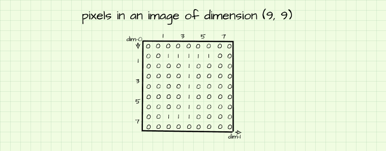

这个数组由一堆 0 和 1 组成，其中的 1 似乎突出了字母“J”的轮廓。基于我们对像素强度的了解，我们知道“零”像素没有强度(没有亮度),因此它们看起来是黑色的；我们还知道“1”像素将具有最大强度——在这种情况下是最大强度，因为 1 是最大值。不用说，这个数组在可视化时会产生一个字母“J”的图形。

```py
#  creating the array
image = np.zeros((9, 9))
image[1, 2:-2] = 1
image[1:-1, 4] = 1
image[-2, 2:4] = 1

plt.imshow(image)
```

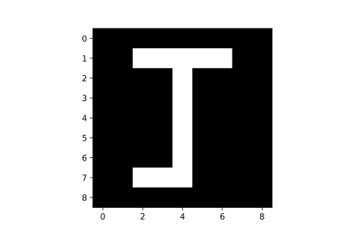

所以，是的，把不同强度的像素放在一起会产生想要的图形，如果做得足够用心的话。下一个问题是，是否可以将像素放在一起形成更复杂的图像，比如人脸图像？这个问题的答案是肯定的！当然，我们需要 81 个以上的像素，因为人脸包含很多细节，但熟练地将像素放在一起形成复杂而逼真的图像基本上就是自动编码器、生成敌对网络和 DALL-E 等生成模型所要做的。

##### 基本图像处理

随着对图像本质上是数组的认识，通过与它们的数组表示进行交互就可以简单地操作它们。适用于矩阵的任何数学运算也适用于数字图像。在同一个 vane 中，适用于 Python 数组的任何操作也可以适用于数字图像。

一个非常简单的对图像操作有重要影响的数组操作是数组索引和切片。只需对数组进行切片，就可以将图像旋转成直角。下面的代码演示了这个过程。

```py
def rotate(image_path, angle):
    """
    This function rotates images at right angles
    in a clockwise manner.
    """
    if angle % 90 != 0:
      print('can only rotate at right angles (90, 180, 270, 360)')
      pass
    else:
      #  reading image
      image = cv2.imread(image_path, cv2.IMREAD_GRAYSCALE)

      #  rotating image
      if angle == 90:
        image = np.transpose(image) #  transposing array
        image = image[:, ::-1] #  reversing columns
        plt.imshow(image, cmap='gray')
      elif angle == 180:
        image = image[::-1, :] #  reversing rows
        image = image[:, ::-1] #  reversing columns
        plt.imshow(image, cmap='gray')
      elif angle == 270:
        image = np.transpose(image) #  transposing array
        image = image[::-1, :] #  reversing rows
        plt.imshow(image, cmap='gray')
      else:
        image = image
        plt.imshow(image, cmap='gray')
    pass
```

使用上面的函数，可以以这样的方式操纵图像阵列，即重新排列它们的像素，以给出原始图像的旋转版本。

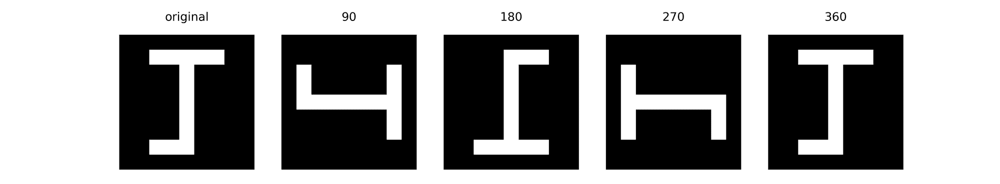

Results obtained when the above function is used.

人们也可以通过索引和分配新值来显式地改变图像中像素的值。例如，让我们假设我们想从图形‘J’生成一个图形‘T’。这是一个简单的消除“J”的尾部的问题，它是由第 7 行、第 2 和第 3 列的像素形成的。我们可以通过索引这些像素并赋予它们零值来做到这一点，因此它们没有亮度。

```py
#  indexing and assigning
image[7, 2:4] = 0
```

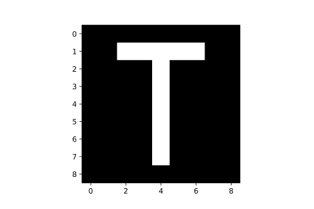

### 频道

通道是决定图像颜色的图像属性。将我们的思维拉回到维度部分中呈现的 3d 空间表示，为了正确地表示图像，我们还需要考虑 z 轴。事实证明，一个图像可能不只是由单个数组组成，它也可能由一堆数组组成。堆栈中的每个数组称为一个通道。

灰度图像只由一个阵列组成，因此它们只有一个通道，就像我们在上一节中处理的所有阵列一样。另一方面，彩色图像是由 3 个相互叠加的阵列组成的，因此它们有 3 个通道(*把这些通道想象成相互叠加的纸片*)。

#### 彩色图像中的通道

彩色图像中的每个通道代表一个像素阵列，该阵列只能产生红、绿、蓝(RGB)三种颜色中的一种。在每个彩色图像中，这些通道的排列总是相同的，第一个是红色，第二个是绿色，第三个是蓝色。

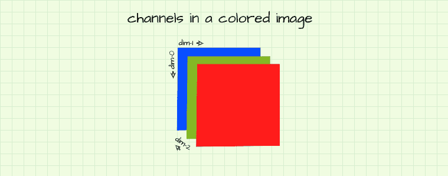

基于这三个通道上相应像素的强度，可以形成任何颜色。让我们用我们的图“J”来测试一下。我们将尝试创建它的不同变体，每个变体将有不同的颜色。

##### 黑色画布上的红色 J


如题所述，我们试图创建一个黑色背景的红色图形“J”。为了生成黑色背景，我们基本上需要背景中的所有像素都没有亮度，因此像素值为零。因为我们试图创建一个红色的图形，只有红色通道中的像素轮廓被“打开”,只允许红色通过，如上所示。

```py
#  creating a 9x9 pixel image with 3 channels
image = np.zeros((9,9,3)).astype(np.uint8)

#  switching on pixels outlining the figure j in the red channel (channel 0)
image[1, 2:-2, 0] = 255
image[1:-1, 4, 0] = 255
image[-2, 2:4, 0] = 255

plt.imshow(image)
```

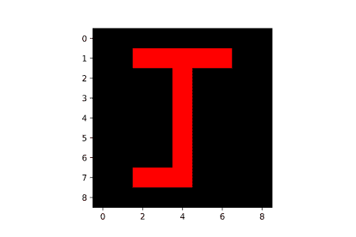

##### 黑色画布上的绿色 J

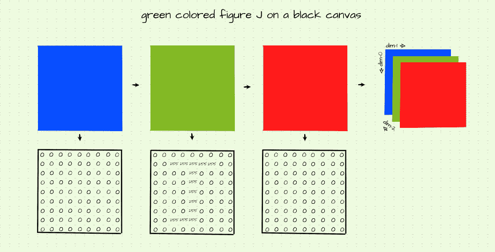

与上面生成的红色图形类似，要生成绿色图形，我们只需打开绿色通道中的轮廓像素。

```py
#  creating a 9x9 pixel image with 3 channels
image = np.zeros((9,9,3)).astype(np.uint8)

#  switching on pixels outlining the figure j in the green channel (channel 1)
image[1, 2:-2, 1] = 255
image[1:-1, 4, 1] = 255
image[-2, 2:4, 1] = 255

plt.imshow(image)
```

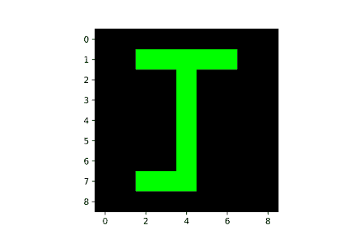

##### 黑色画布上的蓝色 J

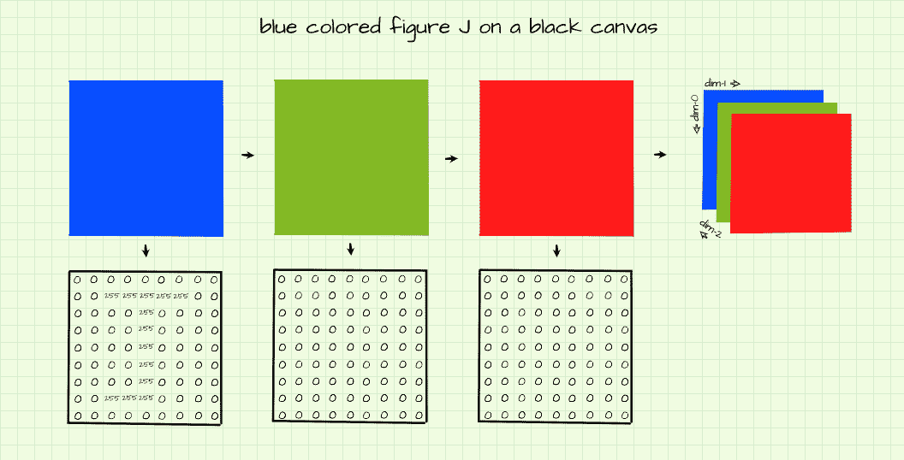

同样，为了在黑色背景上生成蓝色图形，只有蓝色通道中的轮廓像素被打开，如上所示。

```py
#  creating a 9x9 pixel image with 3 channels
image = np.zeros((9,9,3)).astype(np.uint8)

#  switching on pixels outlining the figure j in the blue channel (channel 2)
image[1, 2:-2, 2] = 255
image[1:-1, 4, 2] = 255
image[-2, 2:4, 2] = 255

plt.imshow(image)
```

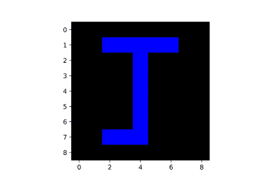

##### 酒红色画布上的蓝绿色 J


现在来看看更复杂的东西。目标是生成一个带有酒红色背景的蓝绿色图形“J”。为了产生酒红色背景，酒红色 RGB 值(128，0，32)需要在构成背景的像素的相应通道上复制。

在同一个叶片中，要生成蓝绿色的图形“J”，蓝绿色 RGB 值(0，128，128)需要分配给相应通道中的轮廓像素，如上图所示，并在下面的代码块中复制。

```py
#  creating array
image = np.zeros((9,9,3)).astype(np.uint8)

#  assigning background color in each channel
image[:,:,0] = 128
image[:,:,1] = 0
image[:,:,2] = 32

#  outlining figure j in each channel
image[1, 2:-2, 0] = 0
image[1, 2:-2, 1] = 128
image[1, 2:-2, 2] = 128

image[1:-1, 4, 0] = 0
image[1:-1, 4, 1] = 128
image[1:-1, 4, 2] = 128

image[-2, 2:4, 0] = 0
image[-2, 2:4, 1] = 128
image[-2, 2:4, 2] = 128

plt.imshow(image)
```

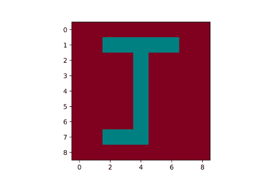

#### 彩色到灰度

由于在数字环境中区分彩色和灰度图像的唯一因素是通道的数量，理论上，如果我们能够找到一种方法，将彩色图像中的所有 3 个通道压缩为一个通道，我们就可以将彩色图像转换为灰度图像。这个理论行得通。

有几种技术可以做到这一点，但是，最简单的方法是简单地取通道间相应像素的平均值。

```py
#  computing the average value of pixels across channels
image = image.mean(axis=2)
```

#### Matplotlib 中的灰度图像

如前所述，灰度(黑白)图像只有一个通道，类似于前面章节中使用的单个阵列。然而，当可视化这些单个数组时，我们必须利用 Matplotlib 中的“cmap”参数。这样做的原因是因为 Matplotlib 不会隐式地将单通道数组识别为图像数据，因此它们不会显示为灰度，而是显示为彩色地图。

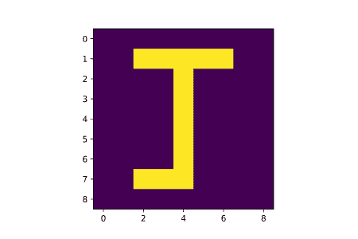

Color map produced as a result of visualizing a single array.

然而，为了生成上面图像的灰度版本(通过设置 cmap='gray ')我们需要创建一个 3 通道阵列，将背景像素设置为零，并将每个通道上的轮廓像素切换到全强度(255)，因为这将生成一个黑色背景和一个白色(255，255，255)的图形。


```py
#  creating array
image = np.zeros((9,9,3))

#  setting outline 
image[1, 2:-2, :] = 255
image[1:-1, 4, :] = 255
image[-2, 2:4, :] = 255

plt.imshow(image)
```


### 结束语

在这篇文章中，我们已经能够对构成数字图像的基本元素形成一种直觉。我们从空间结构中作为参考点的维度讨论到像素，利用亮度形成图像的数字类型，最后是通道，通过组合不同强度的红色、蓝色和绿色来形成颜色。