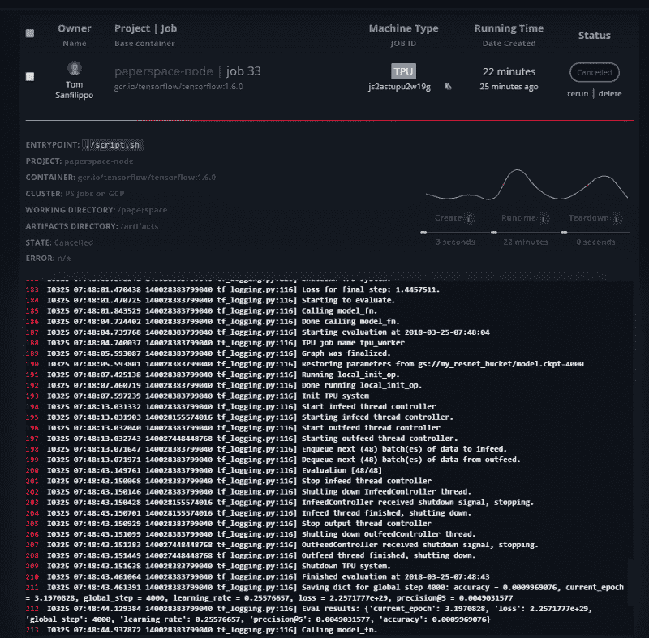

# 动手操作 Google TPUv2

> 原文：<https://blog.paperspace.com/the-tpu-is-weird-but-its-going-to-change-everything/>

## 谷歌的张量处理单元(TPU) 已经在人工智能/人工智能社区引起了轰动，原因有很多。

### 目前，训练深度学习模型需要巨大的计算能力(和大量的能量)。毫无疑问，英伟达已经成为训练深度学习模型的黄金标准，大多数框架都建立在 CUDA 之上。新 TPUv2 的发布已经开始改变这种对话。

* * *

在过去一年左右的时间里，我们看到了人工智能芯片领域的许多新发展。像[英特尔](https://ai.intel.com/intel-nervana-neural-network-processors-nnp-redefine-ai-silicon/)、 [Graphcore](https://www.graphcore.ai/) 、[脑波强化系统](https://www.barrons.com/articles/cerebras-founder-feldman-contemplates-the-a-i-chip-age-1506629165)、 [Vathys](http://vathys.ai/) 等公司一直在竞相开发更新的硬件架构，这些架构承诺采用 GPU 的通用计算模型，并专门为训练和部署深度学习模型的任务而构建。

在过去的几周里，我们一直在努力将新的 TPUv2 集成到我们的[机器学习套件和名为 Gradient](https://www.paperspace.com/gradient) 的人工智能工具中。一路走来，我们对这种新硬件了解了很多，更重要的是，机器学习硬件的未来是什么样子。让我们开始吧。

## TPU 概述

TPU 是这些新芯片中第一个公开上市的，我们刚刚开始看到现实世界的性能基准。RiseML 的团队最近发布了一项[基准测试](https://blog.riseml.com/benchmarking-googles-new-tpuv2-121c03b71384)，将 TPU 与英伟达 P100 和 V100 芯片组进行了比较，第一批结果至少可以说是令人兴奋的。

TPUv2 在几个方面不同于传统的 GPU。每个芯片实际上结合了 4 个 TPU 芯片，每个都有 16GB 的高性能内存。TPUv2 能够寻址高达 2，400GB/s 的内存带宽，像 GPU 一样，它旨在连接到多个 TPU 节点，以实现更快的并行计算。

也就是说，有几个关键限制值得注意:

*   TPU 目前只支持 TensorFlow，尽管还有[工作正在进行以支持 PyTorch](https://twitter.com/soumithchintala/status/963072442510974977?lang=en) 。
*   TPU 很贵。节点本身为 6.50 美元/小时，您还需要一个计算节点来连接它，因此实际上您正在考虑使用 TPU 时为 7.00 美元/小时。也就是说，凭借出色的性能，在正常的性价比范围内，它实际上可能比其他 GPU 选项更具成本效益。
*   它还没有完全公开。这可能会很快改变，但就目前情况来看，你仍然需要申请成为测试计划的一部分，才能获得 TPU。

## TPU 存储模型

在 GPU 和 TPU 上运行时，机器学习任务使用存储的方式有一些关键差异。对于传统的 GPU 支持的训练，GPU 必须依靠运行在 CPU 上的主机进程将数据从本地文件系统或其他存储源拉入 CPU 的内存，并将该内存传输到 GPU 以供进一步处理。

我们依靠 [nvidia-docker](https://github.com/NVIDIA/nvidia-docker) 容器来管理硬件依赖性，并为 GPU 提供本地存储访问。此外，每个渐变 GPU 作业的基础是一个共享的持久数据存储，它会自动挂载到`/storage`，也可以用作基于 GPU 的培训的主要存储源。

在深度学习任务中，IO 可能会很快成为瓶颈，我们已经对梯度存储架构进行了大量优化，以便能够通过多个任务处理单个数据源来充分饱和 GPU 培训工作。

TPU 存储访问与 GPU 完全不同。TPU 目前利用分布式 Tensorflow 框架来为培训课程拉和推数据流。这个框架支持几种不同的文件系统插件，但是 Google 选择 Google 云存储作为目前唯一支持的 TPU 存储模型。

在 TPU 上，在“计算节点”上运行任何代码都被认为是次优的——理想情况下，您可以使用 [XLA(加速线性代数)架构](https://www.tensorflow.org/performance/xla/)将尽可能多的 TensorFlow 代码编译成可执行单元。这需要对大多数现有代码进行轻微的修改，以使用一些核心张量流算法的 TPU 特定版本。反过来，这些 TPU 特有的例程需要使用谷歌云存储中的数据源和接收器来运行。

对于 TPU 的梯度访问，我们会自动为您的机器学习作业自动提供一块谷歌云存储。在 TPU 张量流作业中，输入数据流位置通常称为 dataflow_dir，输出位置为 model_dir。在训练作业完成时，TPU 输出被自动加载到可通过网络访问的工件目录中，以供下载和浏览。

## 作为网络设备的 TPU

TPU 和 GPU 之间的另一个主要区别是，TPU 是作为网络可寻址设备提供的，而 GPU 通常是 PCI 总线上本地连接的硬件设备。TPU 监听 IP 地址和端口，以执行 XLA 指令和操作。

在谷歌目前的 TPU 部署模式中，这些网络设备驻留在谷歌定义的 TPU 项目和网络中，与你的个人或企业谷歌云资源相分离。TPU 项目和网络特定于您的帐户，但您不能通过 Google 的控制台或 API 直接访问它们。

要在这个独立的环境中使用 TPU，您必须首先在您的网络资源和谷歌管理的 TPU 项目和网络之间建立各种信任关系，包括设置具有特定服务帐户角色的虚拟机实例，并授予 TPU 访问谷歌云存储桶的权限。Gradient 的 job runner 通过自动管理所有这些关系简化了这一过程，从而避免了大量复杂的手动设置和配置。

## TPU 名称解析

TPU 在谷歌的云中也有人类可读的名称，类似于 DNS 名称。Google 提供了一个基本的名称解析库，用于将 TPU 名称转换为网络地址和端口(实际上是一个 TPU gRPC URL，即`grpc://${TPU_IP}:8470`)，这样您的代码就不必对这些信息进行硬编码。

TensorFlow 1.6 中包含该库的一个版本，但我们已经看到它在 TensorFlow 1.7 中出现了一些突破性的变化。我们还发现，TPU 域名解析库需要更高级别的权限才能访问所需的 Google Cloud APIs 并正常运行。

由于我们一直在努力将 TPU 整合到梯度中，我们试图通过预先解析 TPU 名称并在 TensorFlow 容器中提供一个可用的`TPU_GRPC_URL`作为环境变量来解决这些问题。Gradient 还提供了一些补充的 docker 映像，这些映像为想要使用这些功能的用户预装了所需的 TPU 名称解析依赖项。

## 在 TPU 上运行代码

TPU 很奇怪，因为它要求你对传统深度学习任务的看法略有改变。目前，TPU 仅支持 TensorFlow 代码，将现有代码移植到新架构有一些要求。

在高层次上，TPU 文档推荐使用新的`TPUEstimator`类，它抽象了在 TPU 上运行的一些实现细节。对于大多数 TensorFlow 开发人员来说，这是众所周知的最佳实践。

```py
my_tpu_estimator = tf.contrib.tpu.TPUEstimator(
    model_fn=my_model_fn,
    config=tf.contrib.tpu.RunConfig()
    use_tpu=False) 
```

你可以在这里查看更多:[https://www.tensorflow.org/programmers_guide/using_tpu](https://www.tensorflow.org/programmers_guide/using_tpu)

## 今天就试试吧

有了 Gradient，您现在就可以轻松体验 TPU(视需求和供应情况而定)！

当你在 www.paperspace.com/account/signup 创建了一个账户并安装了我们的客户端后，你现在可以在云端的 TPU 上训练一个模型了。

首先，将位于[https://github.com/Paperspace/tpu-test](https://github.com/Paperspace/tpu-test)和`cd tpu-test`的示例回购克隆到新目录中。

使用`paperspace project init`初始化项目名称空间。现在，只需一行代码，您就可以将项目提交给运行在 Gradient 上的 TPU。

`paperspace jobs create --machineType TPU --container gcr.io/tensorflow/tensorflow:1.6.0 --command “python main.py”`

如果您转到控制台，您将看到生成的作业和日志:


就是这样！你在 TPU 执行任务。想试试更先进的型号吗？检查[我们在 TPU 上培训 Resnet-50 的回购](https://github.com/Paperspace/tpu-resnet)

*注意:ResNet-50 示例可能是一个长时间运行的作业，可能需要 20 个小时才能完成。*

## 并行计算架构的未来

我们正在进入云机器学习的黄金时代。作为一家专注于为所有开发人员提供生产机器学习技术的公司，我们对新硬件加速器的爆炸式增长以及它们对最终用户的意义感到无比兴奋。

虽然 GPU 不会去任何地方，TPU 是第一个真正的竞争对手，它指出了一个未来，开发者将有他们选择的硬件和软件。

[今天试试梯度上的 TPU。](https://www.paperspace.com/gradient)

> 最佳形象艺人:朱莉·梅赫雷斯图