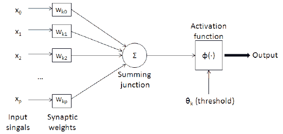
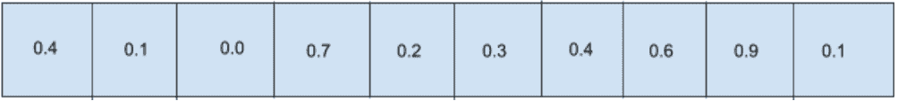

# 用遗传算法开发井字游戏代理:用遗传算法和 JavaScript 优化神经网络(第二部分)

> 原文：<https://blog.paperspace.com/tic-tac-toe-genetic-algorithm-part-2/>

### 介绍

欢迎阅读我的教程系列的第二篇文章，在这篇文章中，我试图解释遗传算法背后的概念，它们是如何工作的，并使用它们来解决有趣的问题，在我们的例子中，我们希望能够构建一个简单的代理来玩井字游戏。

## 概述

[在我们之前的文章](https://blog.paperspace.com/tic-tac-toe-genetic-algorithm-part-1/)《遗传算法入门》中，我们解释了什么是遗传算法以及它背后的简单逻辑(可能，没那么简单)。然后，我们能够将其分解为包括以下步骤

*   创造人口
*   选择
*   交叉
*   变化

重复执行步骤 2 到 4 有助于我们为我们定义的问题集创建一个最佳答案，这只是重新创建一个传递给函数的短语。在本文中，我们将通过使用遗传算法来优化神经网络，从而稍微提高一点。

### 我们的测试或示例问题

我们还没有开始构建我们的井字游戏:我们需要先了解基础知识，以及它们如何解决简单的问题，然后将它们扩展到更大的问题。我希望这是一个教程系列，从初级水平的个人掌握遗传算法如何工作的理解。为此，我们将解决一个简单的问题，将两个数字相加，以展示遗传算法如何优化神经网络。

### 什么是神经网络

神经网络或人工神经网络是受生物大脑启发的简单基本计算系统。它们代表由称为神经元的更小单元组成的一组逻辑连接，神经元也是从生物大脑中模拟出来的。它们解决简单到复杂问题的能力是通过从输入层接收信息，在隐藏层中处理它们，并将结果作为输出传递到输出层来实现的。我们的网络可以有多层(由用户定义)，每层都有权重和偏差。

### 砝码

权重是节点之间连接强度的数字表示，较大的数字表示较强的连接，较小的数字表示较弱的连接。

### 偏见

偏差也可以被视为一系列不正确，这意味着我们的答案有多可能是错误的，并被添加到我们每一层的加权和中。

我们在这里使用遗传算法的目的是优化神经网络的权重和偏差值。在多次迭代或世代中重复这样做，我们可以调整我们的 ANN 模型的值，使它更适合解决我们的问题任务。

我们称这种相互作用的数学表示为激活函数。

> 输出=激活功能(输入*权重+偏差)



### 激活功能

这是一个添加到图层末尾的功能。它将输入和权重的乘积加上偏差，并决定传递给下一层的内容。它通过发射大量的信号来通知下一层这个神经元是否值得听，或者通过发射较小的信号来告诉下一层忽略它。

### 优化神经网络

当我们的神经网络创建时，它是用随机权重和偏差初始化的。对他们来说，一开始工作得不好是可以的，因为我们要实现优化算法，以便能够调整我们的权重，并随着时间的推移减少我们的平均损失，从而改进模型。我们可以通过实现一些算法来做到这一点，比如

*   梯度下降
*   动力
*   Adagrad 自适应梯度算法
*   均方根传播，

其中最流行的是梯度下降或随机梯度下降，这是一种寻找定义的可微函数或损失函数的全局最小值/最大值的方法。

如果您想了解更多，请查看 Paperspace 博客中的一些重要故障:

*   [深度学习中的梯度下降和优化](https://blog.paperspace.com/optimization-in-deep-learning/)
*   [在 Python 中实现梯度下降，第 1 部分:向前和向后传递](https://blog.paperspace.com/part-1-generic-python-implementation-of-gradient-descent-for-nn-optimization/)
*   [深度学习中的优化介绍:梯度下降](https://blog.paperspace.com/intro-to-optimization-in-deep-learning-gradient-descent/)

### 作为优化算法的遗传算法

遗传算法在几个方面不同于传统的优化算法

*   该算法几乎所有可能的值都已经在初始种群中定义了，因此与梯度下降等算法不同，我们已经有了一个有限的搜索空间(一个非常大的有限搜索空间)。
*   遗传算法不需要太多关于这个问题的信息。它只需要一个精确的适应度函数来处理和选择问题的最佳候选。这消除了获取培训数据的需要。
*   遗传算法是概率性的，而其他算法通常是随机的。

### 优势

*   遗传算法可以避免局部最大值并达到全局最大值
*   适用于现实世界的问题
*   能够训练模型，我们没有数据，但我们知道它们是如何工作的
*   较少数学方法

### 更多 recap🧢

到目前为止，我们在上一篇文章中所做的是能够构建一个遗传算法来生成一个短语

我们能够优化我们的人口，直到我们所有的成员都等于我们的目标短语。

### 使用我们的代码库来优化神经网络

优化神经网络几乎是相同的原理，但解决问题的方法不同。在我们到达那里之前，让我们看一些我们需要理解的东西。

### 精英主义

是的，即使是软件也可能倾向于对某些实例进行更好的处理。精英主义的概念是随着时间的推移从我们的人口中保存我们最好的表现实例。这个列表永远不会被清除，它的规模通常比人口规模小得多(我建议是 20%到 30%)。只有当我们发现一个元素的适应度高于数组中性能最低的元素时，它才会被更新，这样做可以确保我们在基因库中始终有最好的候选元素可供选择。让我们看一个代码实现:

```py
 amIElite(object) {
        const smallest = this.elites[0]
        if (this.elittSize > this.elites.length) {
            this.elites.push(object)///elites not yet enough
        } 
        else if (parseInt(object.fitness) > parseInt(smallest.fitness)) {///check if am bigger than the smallest
            ///bigger than this guy so am going to replace him
            this.elites.shift()
            this.elites.push(object)
        }

        this.elites = this.elites.sort((a, b) => a.fitness - b.fitness);///sort from smallest to biggest every time i add a new smallest
    }
```

## 还有什么变化？

### 染色体

在我们之前的例子中，组成短语的字母所在的染色体。这里我们的染色体是我们权重的值，让我们看一个例子



为了实现这一点，我们首先将我们的神经网络权重(最初由 M * N * O 矩阵表示)平坦化为平坦矩阵，例如

```py
[
[3,2],
[3,3]],   ===>[3,2,3,3,,5,2]
[5,2]]
]
```

这让我们可以轻松地操纵我们的数据，并执行基本操作，如杂交亲本和变异。

### 适应度函数

我们的适应度函数是遗传算法的关键组成部分，我不能过分强调这一点，它会改变以适应我们当前的示例问题。

我们的示例问题是优化神经网络的遗传算法，以找到传递给它的两个数的和，数学表示是

$T = x + y$

我们的适应度函数是 x + y -T 的倒数，也就是 1 / (x + y -T)，让我们看一个简单的例子

$X = 20 美元

Y = 40 美元

如果我们预测 T 为 25，

把所有的东西都放进去，我们会得到 1/((20+40)-25)= 1/35 = 0.0022857 美元

0.02 被认为是神经网络的这个实例的准确度或适合度，如果我们将这些值调整得多一点，并且预测 T 为 55，我们将有 0.2 作为我们的准确度或适合度。

让我们看看代码。

```py
 /// The code bellow calculates the fitness function of the model
 /// ANN model by attempting to perform a calculation 5 times, and gets
 /// the average fiteness

 let fit = 0

            for (let i = 0; i < 5; i++) {
                 const number1 = Math.floor(Math.random() * 100)
                const number2 = Math.floor(Math.random() * 100)

                const numberT = object.chromosomes.predict([number1, number2])[0]

                ////number T found 
                let score = (1 / (number1 + number2 - numberT)) || 1 ///if it evaluates as 0 then make it 1 do thee math u would understand y

                if (score > 1) {
                    score = 1 //// if  x + y - t eevaluates as 0.5 orr anything less than 1 theen score becomess 2 which may not bee a bad thing would ttest
                }

                if (score < 0) {
                    score = score * -1 //// acceptting negativee numbers should check 
                }

                ///multiply by 100 and parse as int ///test values between 10 and 1000
                 fit = fit + score
             }
            object.fitness =  parseInt(fit/5)
```

我们实际上尝试预测该值 5 次，并使用总平均值作为该神经网络实例的适应度函数。这是因为它可能足够幸运地计算 2 个随机数的值，但这并不能保证它有能力计算另一组随机数的值。

### 杂交父母

这类似于我们之前的例子，我们在一个数组中有一个简单的元素列表，猜测一个随机位置，在该点上划分两个父元素，然后使用该位置再创建两个子元素。

我们将该层的组件解构为一个用于权重和偏差的平面矩阵，然后执行交叉操作，然后再次重建它们。

现在让我们看看我们正在使用的神经网络的代码

## Matrix.js

matrix.js 文件用于为我们的神经网络执行矩阵计算，如加法和乘法。

```py
 class Matrix {

  ///initialize our object
    constructor(data) {
      const {outputLayer, inputLayer,init} = data
      if(init){
     this.data = init
     this.shape = [init.length,Array.isArray(init[0])?init[0].length: 1 ]
      }
     else{
        this.data = Array.from(Array(inputLayer), () => new Array(outputLayer).fill(0));

      this.shape = [inputLayer, outputLayer]
     }
    }

    /*
    	Function to perform multiplication of a matrix 
    */
    multiply(matrix) {
      ///simple check to see if we can multiply this
      if (!matrix instanceof Matrix) {
        throw new Error('This is no Matrix')
      }

      if (this.shape[1] !== matrix.shape[0]) {
        throw new Error(`Can not multiply this two matrices. the object:${JSON.stringify(this.shape)} multipleidBy:${JSON.stringify(matrix.shape)}`)
      }

      const newMatrice = new Matrix({

        inputLayer : this.shape[0],
        outputLayer: matrix.shape[1]

      })

      for (let i = 0; i < newMatrice.shape[0]; i++) {
        for (let j = 0; j < newMatrice.shape[1]; j++) {
          let sum = 0;
          for (let k = 0; k < this.shape[1]; k++) {
            sum += this.data[i][k] * matrix.data[k][j];
          }
          newMatrice.data[i][j] = sum;
        }
      }

      return newMatrice

    }

    /*
    	Function to perform addition of a matrix 
    */
    add(matrix) {
     const newMatrice = new Matrix({

        inputLayer : this.shape[0],
        outputLayer: matrix.shape[1]

      })
       if (!(matrix instanceof Matrix)) {
        for (let i = 0; i < this.shape[0]; i++)
          for (let j = 0; j < this.shape[1]; j++) {
             newMatrice.data[i][j] = this.data[i][j] + matrix;
          }

      }

      else {
        for (let i = 0; i < matrix.shape[0]; i++) {
          for (let j = 0; j < this.shape[1]; j++) {
            newMatrice.data[i][j] = matrix.data[i][j] + this.data[i][j];

          }

        }
      }
      this.data = newMatrice.data
      this.shape = newMatrice.shape
      return newMatrice
    }

      /*
     	 Function to perform subtraction of a matrix 
      */
    subtract(matrix) {
       const newMatrice = new Matrix(this.shape[0], this.shape[1])
       if (!(matrix instanceof Matrix)) {
        for (let i = 0; i < this.shape[0]; i++)
          for (let j = 0; j < this.shape[1]; j++) {
             newMatrice.data[i][j] = this.data[i][j] - matrix;
          }

      }

      else {
        for (let i = 0; i < matrix.shape[0]; i++) {
          for (let j = 0; j < this.shape[1]; j++) {
            newMatrice.data[i][j] = matrix.data[i][j] - this.data[i][j];

          }

        }
      }

      return newMatrice
    }

     map(func) {
      // Applys a function to every element of matrix
      for (let i = 0; i < this.shape[0]; i++) {
        for (let j = 0; j < this.shape[1]; j++) {
          let val = this.data[i][j];
          this.data[i][j] = func(val);
        }
      }
    }

  /*
  Function to generate random values in the matrix 
  */
   randomize(){
          for(let i = 0; i < this.shape[0]; i++)     
              for(let j = 0; j < this.shape[1]; j++)
                  this.data[i][j] = (Math.random()*2) - 1;  //between -1 and 1
      }

  };

  module.exports = Matrix
```

## 神经网络

这个文件帮助我们创建带有类的 ANN 模型，这意味着我们可以创建多个 ANN 模型并添加到我们的群体中。每个模型都有自己的状态，如权重和偏差。

```py
const Matrix = require('./matrix.js')

/*
	Layerlink is our individual network layer
*/
class LayerLink {
  constructor(prevNode_count, node_count) {

    this.weights = new Matrix({ outputLayer: node_count, inputLayer: prevNode_count });
    this.bias = new Matrix({ outputLayer: node_count, inputLayer: 1 });
    this.weights.randomize()
    this.bias.randomize()
    this.weights.flat = this.flatenMatrix(this.weights)
    this.bias.flat = this.flatenMatrix(this.bias)

   }
  updateWeights(weights) {
    this.weights = weights;
  }
  getWeights() {
    return this.weights;
  }
  getBias() {
    return this.bias;
  }

	/*
    Function to flatten matrix
    */
  flatenMatrix({data}){
    ///flaten matrix
    let flattened = []
    data.forEach(dataRow => {
        flattened = flattened.concat(dataRow)
    });

    return flattened
  }
}

/*
NeuralNetwork model
*/
class NeuralNetwork {
  constructor(layers, options) {
    this.id = Math.random()
    this.fitness = 0
    this.weightsFlat = []
    this.biasFlat =[]

    if (layers.length < 2) {
      console.error("Neural Network Needs Atleast 2 Layers To Work.");
      return { layers: layers };
    }
    this.options = {
      activation: function(x) {
        return 1 / (1 + Math.exp(-x))
      },
      derivative: function(y) {
        return (y * (1 - y));
      },
      relu:(x)=>{
        return  Math.max(0, x);
      }
    }
    this.learning_rate = 0.1;

    this.layerCount = layers.length - 1;   // Ignoring Output Layer.
    this.inputs = layers[0];
    this.output_nodes = layers[layers.length - 1];
    this.layerLink = [];
    for (let i = 1, j = 0; j < (this.layerCount); i++ , j++) {
      if (layers[i] <= 0) {
        console.error("A Layer Needs To Have Atleast One Node (Neuron).");
        return { layers: layers };
      }
      this.layerLink[j] = new LayerLink(layers[j], layers[i]);    // Previous Layer Nodes & Current Layer Nodes
      this.weightsFlat = this.weightsFlat.concat(this.layerLink[j].weights.flat)
      this.biasFlat = this.biasFlat.concat(this.layerLink[j].bias.flat)
    }

   }
/*
Function to perform prediction with model, takes in input arrray
*/
    predict(input_array) {
    if (input_array.length !== this.inputs) {
      throw new Error('Sorry the input can not be evaluated')
    }

    let result = new Matrix({ init: [input_array] })
    for (let i = 0; i < this.layerLink.length; i++) {
      result = result.multiply(this.layerLink[i].getWeights())
      result = result.add(this.layerLink[i].getBias())
      // console.log('old===> ',i,result.data[0])
      const newR = result.data[0].map(this.options.relu)
      // console.log('new====> ',i,newR)

      result.data = [newR]

    }

    return result.data[0]

  }

    /*
    	Reconstructs a matrix from a flat array to a M * N arrray with the shape passed to it
    */
  reconstructMatrix(data,shape){
      const result = []
      try {
            for(let i = 0;i< shape[0];i++){  
                result.push(data.slice(i*shape[1], shape[1] + (i*shape[1])))
            }
      } catch (error) {
          console.log(error,this)
          throw new Error('')
      }
      return result
  }

    /*
    	Reconstructs the weight values from the weightsFlat matrix to match the shape of the matrix 
    */
  reconstructWeights(){
    ///reconstruct weights
    let start = 0;
    for (let i = 0; i < this.layerLink.length; i++) {
        const layer = this.layerLink[i];
         const shape =  layer.weights.shape
         const total = shape[0] * shape[1]
        const array = this.weightsFlat.slice(start, start + total)
        start = start + total
        const weightMatrix = this.reconstructMatrix(array,shape)
        this.layerLink[i].weights.data = weightMatrix
     }
  }

 /*
    	Reconstructs the bias values from the biasFlat matrix to match the shape of the matrix 
    */
  reconstructBias(){
    ///reconstruct bias
    let start = 0;
    for (let i = 0; i < this.layerLink.length; i++) {
        const layer = this.layerLink[i];
         const shape =  layer.bias.shape
         const total = shape[0] * shape[1]
        const array = this.biasFlat.slice(start, start + total)
        start = start + total
        const biasMatrix = this.reconstructMatrix(array,shape)
        this.layerLink[i].bias.data = biasMatrix
     }
  }

}

module.exports = NeuralNetwork
```

现在我们已经建立了自定义的神经网络，让我们看看新版本的遗传算法。

## 中国地质大学

遗传算法文件包含我们在当前和以前的文章中讨论的遗传算法函数，我们的主要入口点是 solve 函数，它试图在 1000 代之后优化 ANN 模型。

```py
const NeuralNetwork = require('./nn.js')

class GNN {
    constructor(number,) {
        this.population = []
        this.genePool = []
        this.numnber = number
        this.mostFit = { fitness: 0 }
        this.initializePopulation()
        this.elittSize = 40
        this.elites = []
        this.soFar = {}
    }

    /*
    	Initialize a population of N amount of individuals into our geenetic algorithm
    */
    initializePopulation() {
        for (let i = 0; i < this.numnber; i++) this.population.push({ chromosomes: this.makeIndividual(), fitness: 0 })
    }

    /*
    	Entry point into our genetic algorithm  goes through our 3 step process
    */
    solve() {
        for (var i = 0; i < 1000; i++) {
            this.calcFitnessAll()
            this.crossParents()
            this.mutate()
        }

    }

/*
	Mutate data in our flatttened weights then reconstruct them back
*/
    mutate() {
        this.population.forEach((object) => {
            const shouldIMutateChromosome = Math.random() < 0.3
            if (shouldIMutateChromosome) {

                    const layer = object.chromosomes
                    for (var j = 0; j < layer.weightsFlat.length; j++) {////going through all the layers
                        const shoulIMutateGene = Math.random() < 0.05
                        if (shoulIMutateGene) {
                            ///mutate the item in the array
                            layer.weightsFlat[j] = (Math.random() * 2) - 1;  //between -1 and 1
                        }
                    }
                    layer.reconstructWeights()

                ////recontruct the array 
            }
        })

    }
 /*
 	Calcualate the fittness function of all the individuals in the model
 */
    calcFitnessAll() {
        this.population.forEach((object) => {
            ////task is to join 2 numbers 
            //// x + y = t
            ////fitness function  is  (1/x + y - t )basically how close it is to 1
            let fit = 0

            for (let i = 0; i < 5; i++) {
                 const number1 = Math.floor(Math.random() * 100)
                const number2 = Math.floor(Math.random() * 100)

                const numberT = object.chromosomes.predict([number1, number2])[0]

                ////number T found 
                let score = (1 / (number1 + number2 - numberT)) || 1 ///if it evaluates as 0 then make it 1 do thee math u would understand y

                if (score > 1) {
                    score = 1 //// if  x + y - t eevaluates as 0.5 orr anything less than 1 theen score becomess 2 which may not bee a bad thing would ttest
                }

                if (score < 0) {
                    score = score * -1 //// acceptting negativee numbers should check 
                }

                ///multiply by 100 and parse as int ///test values between 10 and 1000
                 fit = fit + score
             }
            object.fitness =  parseInt(fit/5)

            for (let i = 0; i < fit; i++) {
                this.genePool.push(object.chromosomes)
            }

            this.amIElite([object].filter(()=>true)[0])
        })

        const getBeestElite = this.elites[39]
        ///run test
        const number1 = Math.floor(Math.random() * 100)
        const number2 = Math.floor(Math.random() * 100)

        const numberT = getBeestElite.chromosomes.predict([number1, number2])[0]

        console.log(`Beest item soo far numbers are  ${number1} and ${number2} and the prediction is ${numberT}  fittness is ${getBeestElite.fitness} `)

    }

    /*
    	Function to cheeck if our model is actually eligible to become an elite and maintians the top perfrooming models over a constant period of time
    */
    amIElite(object) {
        const smallest = this.elites[0]
        if (this.elittSize > this.elites.length) {
            this.elites.push(object)///elites not yet enough
        } 
        else if (parseInt(object.fitness) > parseInt(smallest.fitness)) {///check if am bigger than the smallest
            ///bigger than this guy so am going to replace him
            this.elites.shift()
            this.elites.push(object)
        }

        this.elites = this.elites.sort((a, b) => a.fitness - b.fitness);///sort from smallest to biggest every time i add a new smallest
    }

    /*
    	Function to cross 2 rrandomly selected parents into 2 children, can be more but i dont see a need to
    */
    crossParents() {
        let newPopulation = [];
        const pool = this.genePool

        while (this.population.length - this.elites.length !== newPopulation.length) {
            const parent1 = pool[Math.floor(Math.random() * pool.length)];

            const parent2 = pool[Math.floor(Math.random() * pool.length)];
            const newKid = this.makeIndividual()
            const newKid2 = this.makeIndividual()
            ////select a crossSection

            const items = ['', '']

            const crossSection = Math.floor(Math.random() * parent1.weightsFlat.length)

            ////kid 1

            const layerParent1 = parent1.weightsFlat.filter(() => true)
            const layerParent2 = parent2.weightsFlat.filter(() => true)

            const layerParent1bias = parent1.weightsFlat.filter(() => true)
            const layerParent2bias = parent2.weightsFlat.filter(() => true)

            const newKidWeights = layerParent1.slice(0, crossSection).concat(layerParent2.slice(crossSection, layerParent2.length))
            const newKid2Weights = layerParent2.slice(0, crossSection).concat(layerParent2.slice(crossSection, layerParent1.length))

            newKid.weightsFlat = newKidWeights
            newKid.reconstructWeights()

            newKid2.weightsFlat = newKid2Weights
            newKid2.reconstructWeights()

            const crossSectionBias = Math.floor(Math.random() * layerParent2bias.length)
            const newKidBias = layerParent1bias.slice(0, crossSectionBias).concat(layerParent2bias.slice(crossSectionBias, layerParent2bias.length))
            const newKidBias2 = layerParent2bias.slice(0, crossSectionBias).concat(layerParent1bias.slice(crossSectionBias, layerParent2bias.length))

            newKid.biasFlat = newKidBias
            newKid.reconstructBias()

            newKid2.biasFlat = newKidBias2
            newKid2.reconstructBias()
            newPopulation.push({ chromosomes: newKid, fitness: 0 })
            newPopulation.push({ chromosomes: newKid2, fitness: 0 })

        }
        newPopulation = newPopulation.concat(this.elites)///making sure we pass on elites

        this.population = newPopulation
        this.genePool = []///clear genepool

    }

    makeIndividual() {
        return new NeuralNetwork([2, 8,8, 1]);
    }
}

const gnn = new GNN(4000)
gnn.solve()
```

让我们看看这些训练

```py
Beest item soo far numbers are  13 and 24 and the prediction is 25.28607491037004  fittness is 4 
Beest item soo far numbers are  6 and 23 and the prediction is 26.32267394133354  fittness is 13 
Beest item soo far numbers are  50 and 7 and the prediction is 62.49884171193919  fittness is 83 
Beest item soo far numbers are  49 and 98 and the prediction is 146.41341907285596  fittness is 121 
Beest item soo far numbers are  72 and 9 and the prediction is 83.4678176435441  fittness is 563 
Beest item soo far numbers are  14 and 93 and the prediction is 106.26071461398661  fittness is 2743 
Beest item soo far numbers are  86 and 18 and the prediction is 110.79668473593276  fittness is 1112 
Beest item soo far numbers are  88 and 0 and the prediction is 103.38716156007081  fittness is 2739 
Beest item soo far numbers are  43 and 36 and the prediction is 79.17631973457603  fittness is 1111 
Beest item soo far numbers are  1 and 24 and the prediction is 24.314085857021304  fittness is 1110 
Beest item soo far numbers are  34 and 20 and the prediction is 54.326947949897615  fittness is 1111 
Beest item soo far numbers are  65 and 40 and the prediction is 105.26124354533928  fittness is 1112 
Beest item soo far numbers are  83 and 79 and the prediction is 161.86964868039985  fittness is 1128 
Beest item soo far numbers are  85 and 24 and the prediction is 112.87455742664426  fittness is 2741 
Beest item soo far numbers are  95 and 22 and the prediction is 116.77612736073525  fittness is 2740 
Beest item soo far numbers are  18 and 88 and the prediction is 105.35006857127684  fittness is 2747 
Beest item soo far numbers are  79 and 66 and the prediction is 145.0125935541571  fittness is 1112 
Beest item soo far numbers are  72 and 87 and the prediction is 158.69813186888078  fittness is 2740 
Beest item soo far numbers are  25 and 23 and the prediction is 48.23237184355801  fittness is 2740 
Beest item soo far numbers are  4 and 32 and the prediction is 35.98588328087144  fittness is 2743 
Beest item soo far numbers are  72 and 47 and the prediction is 119.21435149343066  fittness is 2740 
Beest item soo far numbers are  46 and 49 and the prediction is 95.02716823476345  fittness is 2742 
Beest item soo far numbers are  28 and 55 and the prediction is 82.83801602208422  fittness is 2740 
Beest item soo far numbers are  13 and 18 and the prediction is 31.22241978396226  fittness is 2741 
Beest item soo far numbers are  18 and 48 and the prediction is 65.86628819582671  fittness is 2742 
Beest item soo far numbers are  83 and 50 and the prediction is 133.2439079081985  fittness is 2740 
Beest item soo far numbers are  5 and 17 and the prediction is 22.305395227971694  fittness is 54194 
Beest item soo far numbers are  81 and 97 and the prediction is 179.5644485790281  fittness is 54237 
```

我们可以看到我们的模型的训练进度，以及神经网络如何在第一次尝试中完全错误，但能够随着时间的推移进行优化，以解决我们的简单加法问题。

### 结论

我们学习了神经网络的基础知识，我们能够理解如何使用遗传算法来优化神经网络，在我们的下一篇文章中，我们将查看代码库，并了解如何将我们的概念实现到工作代码中。