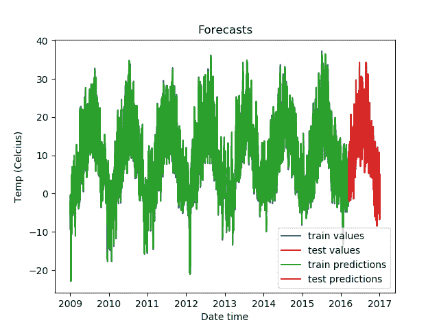
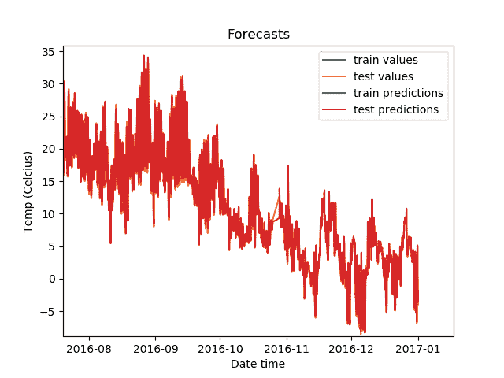
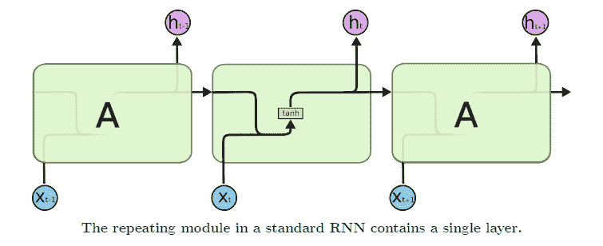
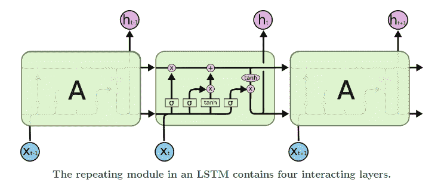
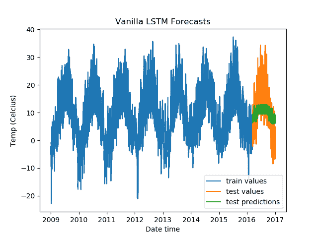
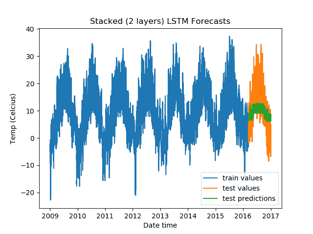
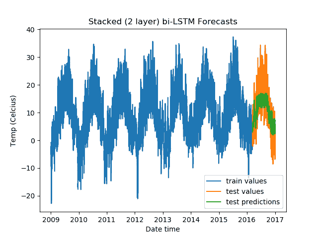
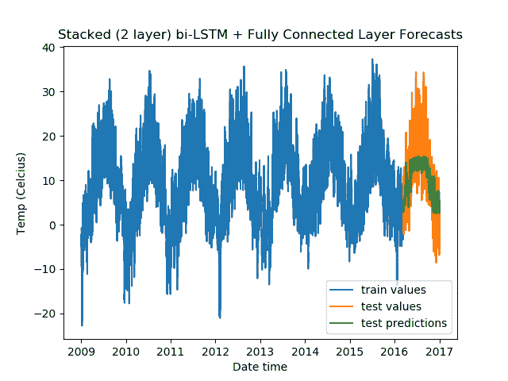
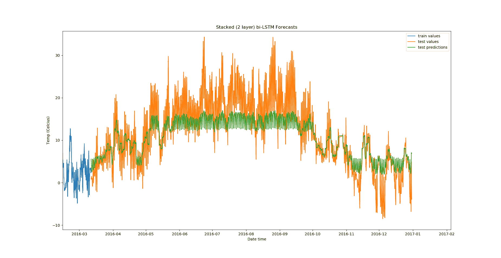

# 时间序列预测导论:回归和 LSTMs

> 原文：<https://blog.paperspace.com/time-series-forecasting-regression-and-lstm/>

在本系列的第一部分，[时间序列分析简介](https://blog.paperspace.com/introduction-time-series-analysis/)，我们介绍了时间序列的不同属性，自相关、偏自相关、平稳性、平稳性测试和季节性。

第二部分我们介绍了[时间序列预测](https://blog.paperspace.com/time-series-forecasting-autoregressive-models-smoothing-methods/)。我们研究了如何建立预测模型，以获取时间序列并预测该序列在未来的变化。具体来说，我们研究了自回归模型和指数平滑模型。

在本系列的最后一部分，我们将研究用于时间序列预测的机器学习和深度学习算法，包括线性回归和各种类型的 LSTMs。

你可以在 [ML Showcase](http://ml-showcase.paperspace.com/) 的[渐变社区笔记本](https://ml-showcase.paperspace.com/projects/time-series-analysis-and-forecasting)上找到这个系列的代码并免费运行。

## 介绍

在我们的实验中，我们将使用在以前的文章中使用的相同数据，即来自德国耶拿的天气数据。您可以使用以下命令下载它。

```py
wget https://storage.googleapis.com/tensorflow/tf-keras-datasets/jena_climate_2009_2016.csv.zip
```

打开 zip 文件并将数据加载到 Pandas 数据框架中。

```py
import pandas as pd

df = pd.read_csv('jena_climate_2009_2016.csv')

time = pd.to_datetime(df.pop('Date Time'), format='%d.%m.%Y %H:%M:%S')
series = df['T (degC)'][5::6]
series.index = time[5::6]
```

在我们能够建立我们的模型之前，我们将不得不做一些基本的特征工程。我们使用特定长度的窗口从时间序列中创建滞后值矩阵。假设窗口长度为 4。那么你的数组看起来会像这样:

$ $ \ begin { v matrix } x _ { t } & x _ { t-1 } & x _ { t-2 } & x _ { t-3 } \ \ x _ { t-1 } & x _ { t-2 } & x _ { t-3 } & x _ { t-4 } \ \..&..&..&..\\ ..&..&..&..\ \ x _ { 4 } & x _ { 3 } & x _ { 2 } & x _ { 1 } \ \ x _ { 3 } & x _ { 2 } & x _ { 1 } & x _ { 0 } \ end { v matrix } $ $

在我们的预测模型中，最后一列将作为标签，其余列作为预测值。

在我们的例子中，由于每日数据的季节性，选择一天的窗口大小是有意义的。

```py
import numpy as np

# function for generating the lagged matrix
def split_sequence(sequence, window_size):
    X = []
    y = []
    # for all indexes
    for i in range(len(sequence)):
        end_idx = i + window_size
        # exit condition
        if end_idx > len(sequence) - 1:
            break
        # get X and Y values
        seq_x, seq_y = sequence[i:end_idx], sequence[end_idx]
        X.append(seq_x)
        y.append(seq_y)
    return np.array(X), np.array(y)

train = series[:-int(len(series)/10)]
test = series[-int(len(series)/10):]
X_train, y_train = split_sequence(train, window_size=24)
```

## 使用回归对时间序列建模

回归算法试图找到给定数据集的最佳拟合线。线性回归算法试图最小化观察值和预测值之间的差的平方和的值。OLS 回归有几个被称为[高斯-马尔可夫假设](https://en.wikipedia.org/wiki/Gauss%E2%80%93Markov_theorem#:~:text=In%20statistics%2C%20the%20Gauss%E2%80%93Markov,have%20equal%20variances%20and%20expectation)的基本假设。横截面数据的高斯-马尔可夫假设包括以下内容:

1.  参数(例如，双变量回归线中最佳拟合线的斜率值)应该是线性的。
2.  $X$和$Y$应该是随机变量。
3.  多个独立变量之间没有完美的共线性。
4.  残差项和自变量的协方差应该是$0$，或者换句话说，残差项是内生的。
5.  剩余项的同方差，即剩余项的方差不应随着自变量的变化而变化。
6.  剩余项没有自相关。

对于时间序列数据，我们不能满足自变量都是随机变量的假设，因为不同的列来自同一过程。为了弥补这一点，对自相关性、同方差性和内生性的假设更加严格。

让我们看看一个简单的回归模型能给我们带来什么。

```py
import statsmodels.api as sm

# train Ordinary Least Squares model
X_train = sm.add_constant(X_train)
model = sm.OLS(y_train, X_train)
result = model.fit()

print(result.summary())
```

模型摘要如下所示:

```py
 OLS Regression Results                            
==============================================================================
Dep. Variable:                      y   R-squared:                       0.992
Model:                            OLS   Adj. R-squared:                  0.992
Method:                 Least Squares   F-statistic:                 3.376e+05
Date:                Fri, 22 Jan 2021   Prob (F-statistic):               0.00
Time:                        13:53:01   Log-Likelihood:                -70605.
No. Observations:               63058   AIC:                         1.413e+05
Df Residuals:                   63033   BIC:                         1.415e+05
Df Model:                          24                                         
Covariance Type:            nonrobust                                         
==============================================================================
                 coef    std err          t      P>|t|      [0.025      0.975]
------------------------------------------------------------------------------
const          0.0317      0.005      6.986      0.000       0.023       0.041
x1            -0.1288      0.004    -32.606      0.000      -0.137      -0.121
x2             0.0669      0.007     10.283      0.000       0.054       0.080
x3             0.0571      0.007      8.707      0.000       0.044       0.070
x4             0.0381      0.007      5.793      0.000       0.025       0.051
x5             0.0081      0.007      1.239      0.216      -0.005       0.021
x6             0.0125      0.007      1.905      0.057      -0.000       0.025
x7            -0.0164      0.007     -2.489      0.013      -0.029      -0.003
x8             0.0062      0.007      0.939      0.348      -0.007       0.019
x9            -0.0069      0.007     -1.056      0.291      -0.020       0.006
x10            0.0148      0.007      2.256      0.024       0.002       0.028
x11            0.0029      0.007      0.436      0.663      -0.010       0.016
x12            0.0129      0.007      1.969      0.049    5.75e-05       0.026
x13           -0.0018      0.007     -0.272      0.786      -0.015       0.011
x14           -0.0033      0.007     -0.502      0.616      -0.016       0.010
x15           -0.0180      0.007     -2.731      0.006      -0.031      -0.005
x16           -0.0029      0.007     -0.437      0.662      -0.016       0.010
x17            0.0157      0.007      2.382      0.017       0.003       0.029
x18           -0.0016      0.007     -0.239      0.811      -0.014       0.011
x19           -0.0006      0.007     -0.092      0.927      -0.013       0.012
x20           -0.0062      0.007     -0.949      0.343      -0.019       0.007
x21           -0.0471      0.007     -7.163      0.000      -0.060      -0.034
x22           -0.0900      0.007    -13.716      0.000      -0.103      -0.077
x23           -0.2163      0.007    -33.219      0.000      -0.229      -0.204
x24            1.3010      0.004    329.389      0.000       1.293       1.309
==============================================================================
Omnibus:                    11270.669   Durbin-Watson:                   2.033
Prob(Omnibus):                  0.000   Jarque-Bera (JB):           181803.608
Skew:                          -0.388   Prob(JB):                         0.00
Kurtosis:                      11.282   Cond. No.                         197.
============================================================================== 
```

大于 2 的 [Durbin-Watson](https://en.wikipedia.org/wiki/Durbin%E2%80%93Watson_statistic) 值表明我们的序列没有自相关。

可以通过以下测试来检查正常性:

1.  [Jarque-Bera 测试](https://en.wikipedia.org/wiki/Jarque%E2%80%93Bera_test)
2.  [夏皮罗-维尔克检验](https://en.wikipedia.org/wiki/Shapiro%E2%80%93Wilk_test)
3.  [科洛莫罗夫-斯米尔诺夫试验](https://en.wikipedia.org/wiki/Kolmogorov%E2%80%93Smirnov_test)

```py
from scipy import stats

# get values of the residuals
residual = result.resid

# run tests and get the p values
print('p value of Jarque-Bera test is: ', stats.jarque_bera(residual)[1])
print('p value of Shapiro-Wilk test is: ', stats.shapiro(residual)[1])
print('p value of Kolmogorov-Smirnov test is: ', stats.kstest(residual, 'norm')[1])
```

我们得到以下结果:

```py
p value of Jarque-Bera test is:  0.0
p value of Shapiro-Wilk test is:  0.0
p value of Kolmogorov-Smirnov test is:  0.0
```

假设显著性水平为 0.05，所有三个测试都表明我们的系列不是正态分布的。

对于异方差性，我们将使用以下测试:

1.  [布鲁赫-帕甘试验](https://en.wikipedia.org/wiki/Breusch%E2%80%93Pagan_test)
2.  [白色测试](https://en.wikipedia.org/wiki/White_test)

```py
import statsmodels.stats.api as sms

print('p value of Breusch–Pagan test is: ', sms.het_breuschpagan(result.resid, result.model.exog)[1])
print('p value of White test is: ', sms.het_white(result.resid, result.model.exog)[1])
```

我们得到以下结果:

```py
p value of Breusch–Pagan test is:  2.996182722643564e-246
p value of White test is:  0.0 
```

假设显著性水平为 0.05，两个测试表明我们的系列是异方差的。

我们的级数既不是齐次的，也不是正态分布的。幸运的是，与 OLS 不同，广义最小二乘法解释了这些残余误差。

```py
import statsmodels.api as sm

# train Ordinary Least Squares model
X_train = sm.add_constant(X_train)
model = sm.GLS(y_train, X_train)
result = model.fit()

print(result.summary())
```

结果摘要如下所示。

```py
 GLS Regression Results                            
==============================================================================
Dep. Variable:                      y   R-squared:                       0.992
Model:                            GLS   Adj. R-squared:                  0.992
Method:                 Least Squares   F-statistic:                 3.376e+05
Date:                Fri, 22 Jan 2021   Prob (F-statistic):               0.00
Time:                        13:25:24   Log-Likelihood:                -70605.
No. Observations:               63058   AIC:                         1.413e+05
Df Residuals:                   63033   BIC:                         1.415e+05
Df Model:                          24                                         
Covariance Type:            nonrobust                                         
==============================================================================
                 coef    std err          t      P>|t|      [0.025      0.975]
------------------------------------------------------------------------------
const          0.0317      0.005      6.986      0.000       0.023       0.041
x1            -0.1288      0.004    -32.606      0.000      -0.137      -0.121
x2             0.0669      0.007     10.283      0.000       0.054       0.080
x3             0.0571      0.007      8.707      0.000       0.044       0.070
x4             0.0381      0.007      5.793      0.000       0.025       0.051
x5             0.0081      0.007      1.239      0.216      -0.005       0.021
x6             0.0125      0.007      1.905      0.057      -0.000       0.025
x7            -0.0164      0.007     -2.489      0.013      -0.029      -0.003
x8             0.0062      0.007      0.939      0.348      -0.007       0.019
x9            -0.0069      0.007     -1.056      0.291      -0.020       0.006
x10            0.0148      0.007      2.256      0.024       0.002       0.028
x11            0.0029      0.007      0.436      0.663      -0.010       0.016
x12            0.0129      0.007      1.969      0.049    5.75e-05       0.026
x13           -0.0018      0.007     -0.272      0.786      -0.015       0.011
x14           -0.0033      0.007     -0.502      0.616      -0.016       0.010
x15           -0.0180      0.007     -2.731      0.006      -0.031      -0.005
x16           -0.0029      0.007     -0.437      0.662      -0.016       0.010
x17            0.0157      0.007      2.382      0.017       0.003       0.029
x18           -0.0016      0.007     -0.239      0.811      -0.014       0.011
x19           -0.0006      0.007     -0.092      0.927      -0.013       0.012
x20           -0.0062      0.007     -0.949      0.343      -0.019       0.007
x21           -0.0471      0.007     -7.163      0.000      -0.060      -0.034
x22           -0.0900      0.007    -13.716      0.000      -0.103      -0.077
x23           -0.2163      0.007    -33.219      0.000      -0.229      -0.204
x24            1.3010      0.004    329.389      0.000       1.293       1.309
==============================================================================
Omnibus:                    11270.669   Durbin-Watson:                   2.033
Prob(Omnibus):                  0.000   Jarque-Bera (JB):           181803.608
Skew:                          -0.388   Prob(JB):                         0.00
Kurtosis:                      11.282   Cond. No.                         197.
============================================================================== 
```

我们可以得到我们的预测如下:

```py
X_test = sm.add_constant(X_test)

y_train_preds = result.predict(X_train)
y_test_preds = result.predict(X_test)

from matplotlib import pyplot as plt

# indexes start from 24 due to the window size we chose
plt.plot(pd.Series(y_train, index=train[24:].index), label='train values')
plt.plot(pd.Series(y_test, index=test[24:].index), label='test values')
plt.plot(pd.Series(y_train_preds, index=train[24:].index), label='train predictions')
plt.plot(pd.Series(y_test_preds, index=test[24:].index), label='test predictions')
plt.xlabel('Date time')
plt.ylabel('Temp (Celcius)')
plt.title('Forecasts')
plt.legend()
plt.show()
```

我们的预测是这样的:



放大后，测试集上的预测看起来像这样。



预测看起来非常准确！

现在，我们将看看时间序列的一些其他方法，看看它们的表现是否和回归一样好。

## 用递归网络模拟时间序列

RNNs，或[递归神经网络](https://blog.paperspace.com/bidirectional-rnn-keras/)，有一个隐藏层，作为一个记忆功能，在计算序列中的下一个值(当前时间步)时，考虑到先前的时间步。



[Source](https://stats.stackexchange.com/a/247443)

递归网络会遭遇消失和爆炸梯度等问题。为了解决这些问题，LSTMs 应运而生。他们增加了多个门，如输入门和遗忘门，以避免渐变爆炸或消失的问题。



[Source](https://stats.stackexchange.com/a/247443)

处理该问题的其他方法包括梯度裁剪和身份初始化。

我们将研究不同的基于 LSTM 的时间序列预测架构。我们将使用 PyTorch 来实现。

我们将测试普通 lstm、堆叠 lstm、双向 lstm 和 lstm，然后是全连接层。

在此之前，让我们准备好张量数据集和 [`dataloaders`](https://blog.paperspace.com/dataloaders-abstractions-pytorch/) 。

首先我们加载数据。

```py
df = pd.read_csv('jena_climate_2009_2016.csv')

time_vals = pd.to_datetime(df.pop('Date Time'), format='%d.%m.%Y %H:%M:%S')
series = df['T (degC)'][5::6]
series.index = time_vals[5::6] 
```

然后，我们创建测试和训练分割。

```py
# train test split
train = series[:-int(len(series)/10)]
train_idx = train.index
test = series[-int(len(series)/10):]
test_idx = test.index
```

我们使用 scikit-learn 中的`StandardScaler`来扩展我们的数据。

```py
from sklearn.preprocessing import StandardScaler

scaler = StandardScaler()
train = pd.Series(scaler.fit_transform(train.values.reshape(-1, 1))[:, 0], index=train_idx)
test = pd.Series(scaler.transform(test.values.reshape(-1, 1))[:, 0], index=test_idx)
```

我们使用之前定义的滞后矩阵生成函数来创建测试和训练数据集。

```py
window_size = 24

X_train, y_train = split_sequence(train, window_size=window_size)
X_test, y_test = split_sequence(test, window_size=window_size) 
```

然后，我们将所有这些数据转换成张量，随后是火炬`TensorDataset`和`DataLoaders`。

```py
import torch
from torch.utils.data import TensorDataset, DataLoader

# convert train and test data to tensors
X_train = torch.tensor(X_train, dtype=torch.float)
y_train = torch.tensor(y_train, dtype=torch.float)
X_test = torch.tensor(X_test, dtype=torch.float)
y_test = torch.tensor(y_test, dtype=torch.float)

# use torch tensor datasets
train_data = TensorDataset(X_train, y_train)
test_data = TensorDataset(X_test, y_test)

# get data loaders
batch_size = 32
train_dataloader = DataLoader(train_data, shuffle=True, batch_size=batch_size)
test_dataloader = DataLoader(test_data, shuffle=False, batch_size=batch_size) 
```

让我们定义我们将用来定义我们的神经网络架构的模块。我们将提供:

*   香草 LSTM
*   Stacked LSTM
*   双向 LSTM
*   LSTM 之后的一个全连接层

```py
from torch import nn

class DenseLSTM(nn.Module):
    def __init__(self, input_dim, hidden_dim, lstm_layers=1, bidirectional=False, dense=False):
        super(DenseLSTM, self).__init__()
        self.input_dim = input_dim
        self.hidden_dim = hidden_dim
        self.layers = lstm_layers
        self.bidirectional = bidirectional
        self.dense = dense
        # define the LSTM layer
        self.lstm = nn.LSTM(input_size=self.input_dim, 
                            hidden_size=self.hidden_dim, 
                            num_layers=self.layers,
                            bidirectional=self.bidirectional)
        self.act1 = nn.ReLU()
        # change linear layer inputs depending on if lstm is bidrectional
        if not bidirectional:
            self.linear = nn.Linear(self.hidden_dim, self.hidden_dim)
        else:
            self.linear = nn.Linear(self.hidden_dim * 2, self.hidden_dim)
        self.act2 = nn.ReLU()
        # change linear layer inputs depending on if lstm is bidrectional and extra dense layer isn't added
        if bidirectional and not dense:
            self.final = nn.Linear(self.hidden_dim * 2, 1)
        else:
            self.final = nn.Linear(self.hidden_dim, 1)

    def forward(self, inputs, labels=None):
        out = inputs.unsqueeze(1)
        out, h = self.lstm(out)
        out = self.act1(out)
        if self.dense:
            out = self.linear(out)
            out = self.act2(out)
        out = self.final(out)
        return out 
```

现在是训练功能。

```py
import time

def fit(model, optimizer, criterion):
    print("{:<8} {:<25} {:<25} {:<25}".format('Epoch', 
                                          'Train Loss', 
                                          'Test Loss', 
                                          'Time (seconds)'))
    for epoch in range(epochs):
        model.train()
        start = time.time()
        epoch_loss = []
        # for batch in train data
        for step, batch in enumerate(train_dataloader):
            # make gradient zero to avoid accumulation
            model.zero_grad()
            batch = tuple(t.to(device) for t in batch)
            inputs, labels = batch
            # get predictions
            out = model(inputs)
            out.to(device)
            # get loss
            loss = criterion(out, labels)
            epoch_loss.append(loss.float().detach().cpu().numpy().mean())
            # backpropagate
            loss.backward()
            optimizer.step()
        test_epoch_loss = []
        end = time.time()
        model.eval()
        # for batch in validation data
        for step, batch in enumerate(test_dataloader):
            batch = tuple(t.to(device) for t in batch)
            inputs, labels = batch
            # get predictions
            out = model(inputs)
            # get loss
            loss = criterion(out, labels)     
            test_epoch_loss.append(loss.float().detach().cpu().numpy().mean())
        print("{:<8} {:<25} {:<25} {:<25}".format(epoch+1, 
                                                  np.mean(epoch_loss), 
                                                  np.mean(test_epoch_loss), 
                                                  end-start)) 
```

现在我们可以开始训练了。我们定义隐藏层的大小，时期，损失函数，以及我们将使用的优化器。然后我们训练模型并绘制预测图。

```py
device = torch.device(type='cuda')

hidden_dim = 32
epochs = 5

# vanilla LSTM
model = DenseLSTM(window_size, hidden_dim, lstm_layers=1, bidirectional=False, dense=False)
model.to(device)

# define optimizer and loss function
optimizer = torch.optim.Adam(model.parameters())
criterion = nn.MSELoss()

# initate training
fit(model, optimizer, criterion)

# get predictions on validation set
model.eval()
preds = []
for step, batch in enumerate(test_dataloader):
    batch = tuple(t.to(device) for t in batch)
    inputs, labels = batch
    out = model(inputs)
    preds.append(out)

preds = [x.float().detach().cpu().numpy() for x in preds]
preds = np.array([y for x in preds for y in x])

# plot data and predictions and applying inverse scaling on the data
plt.plot(pd.Series(scaler.inverse_transform(y_train.float().detach().cpu().numpy().reshape(-1, 1))[:, 0], index=train[window_size:].index), label='train values')
plt.plot(pd.Series(scaler.inverse_transform(y_test.float().detach().cpu().numpy().reshape(-1, 1))[:, 0], index=test[:-window_size].index), label='test values')
plt.plot(pd.Series(scaler.inverse_transform(preds.reshape(-1, 1))[:, 0], index=test[:-window_size].index), label='test predictions')
plt.xlabel('Date time')
plt.ylabel('Temp (Celcius)')
plt.title('Vanilla LSTM Forecasts')
plt.legend()
plt.show() 
```

我们得到以下结果。

```py
Epoch    Train Loss                Test Loss                 Time (seconds)       
1        0.9967056512832642        0.7274604439735413        4.000955820083618        
2        0.990510106086731         0.566585123538971         4.1188554763793945       
3        0.9876610636711121        0.653666079044342         4.1249611377716064       
4        0.9871518015861511        0.6488878726959229        4.147826910018921        
5        0.9848467707633972        0.5858491659164429        4.120056867599487 
```



为了测试其他 LSTM 架构，您只需要修改一行代码(除了图的标题之外)。在带有免费 GPU 的[渐变社区笔记本](http://ml-showcase.paperspace.com/)上进行测试。但是一定要确保重用整个代码片段，因为每次训练一个新的模型时，您都需要创建一个新的优化器和损失函数实例。

对于堆叠 LSTMs:

```py
model = DenseLSTM(window_size, hidden_dim, lstm_layers=2, bidirectional=False, dense=False) 
```

结果是:

```py
 Epoch    Train Loss                Test Loss                 Time (seconds)           
1        0.9966062903404236        0.7322613000869751        5.929869890213013        
2        0.9892004728317261        0.6665323376655579        5.805717945098877        
3        0.9877941608428955        0.650715172290802         5.973452806472778        
4        0.9876391291618347        0.6218239665031433        6.097705602645874        
5        0.9873654842376709        0.6142457127571106        6.03947639465332 
```



对于堆叠双向 LSTMs:

```py
model = DenseLSTM(window_size, hidden_dim, lstm_layers=2, bidirectional=True, dense=False) 
```

结果是:

```py
Epoch    Train Loss                Test Loss                 Time (seconds)           
1        0.9923199415206909        0.5472036004066467        9.600639343261719        
2        0.9756425023078918        0.37495505809783936       9.447819471359253        
3        0.9717859625816345        0.3349926471710205        9.493505001068115        
4        0.9706487655639648        0.3027298152446747        9.554434776306152        
5        0.9707987308502197        0.3214375674724579        9.352233409881592 
```



对于具有全连接层的堆叠双向 LSTMs:

```py
model = DenseLSTM(window_size, hidden_dim, lstm_layers=2, bidirectional=True, dense=True) 
```

结果是:

```py
Epoch    Train Loss                Test Loss                 Time (seconds)           
1        0.9940553903579712        0.5763574838638306        10.142680883407593       
2        0.9798027276992798        0.44453883171081543       10.641068458557129       
3        0.9713742733001709        0.39177998900413513       10.410093069076538       
4        0.9679638147354126        0.35211560130119324       10.61124324798584        
5        0.9688050746917725        0.3617672920227051        10.218038082122803 
```



从验证损失来看，我们发现我们尝试的第三个模型(两层堆叠双向 LSTM)具有最低的损失，因此证明是我们测试的模型中最好的。

放大后，预测看起来像这样:



除了这些，你还可以做很多其他的实验:

*   为更多的时代而训练。
*   测试不同的优化器。
*   改变我们 LSTM 建筑的超参数。
*   添加更密集的层。
*   在 LSTM 之前添加一个一维卷积层。
*   在层之间使用批量标准化。
*   测试除 MSE 和 MAE 之外的损失函数。

在这些实验之后，我们仍然发现我们的回归模型比我们尝试的任何其他方法都要好得多。

## 结论

这是我们时间序列分析和预测系列的最后一部分。首先我们看了[分析](https://blog.paperspace.com/introduction-time-series-analysis/):平稳性测试，使时间序列平稳，自相关和偏自相关，频率分析等。[在第 2 部分](https://blog.paperspace.com/time-series-forecasting-autoregressive-models-smoothing-methods/)中，我们研究了 AR、MA、ARIMA、SARIMA 等预测方法，以及简单平滑和霍尔特指数平滑等平滑方法。在本文中，我们介绍了使用回归和递归网络的预测方法，如 LSTMs。

在这个系列的过程中，我们发现对于我们使用的数据，回归模型表现最好。

我希望你喜欢这些文章！