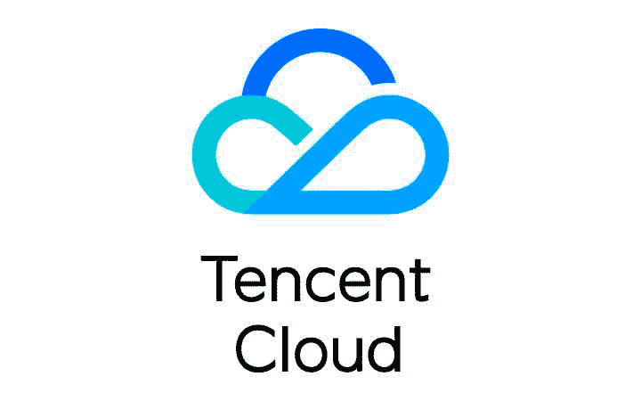
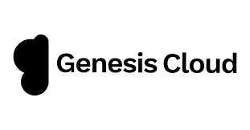
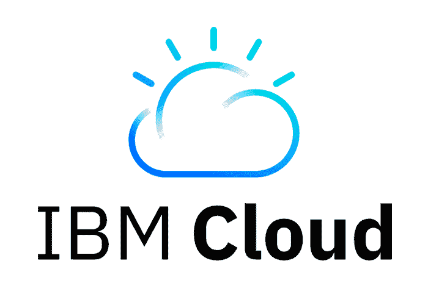
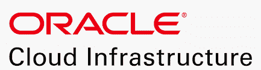
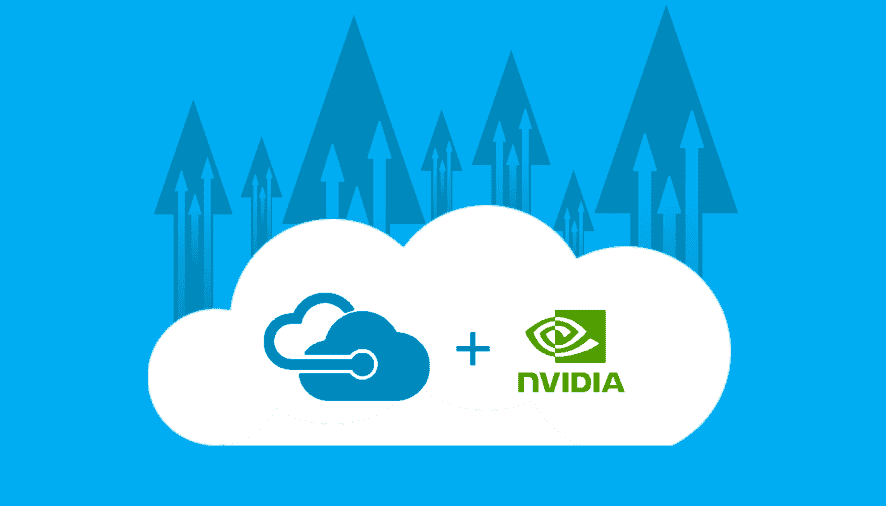
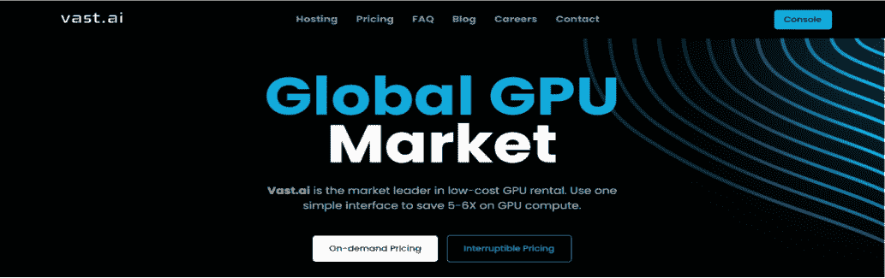
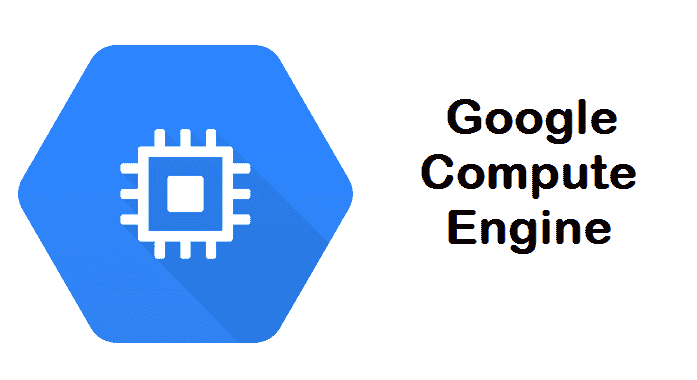
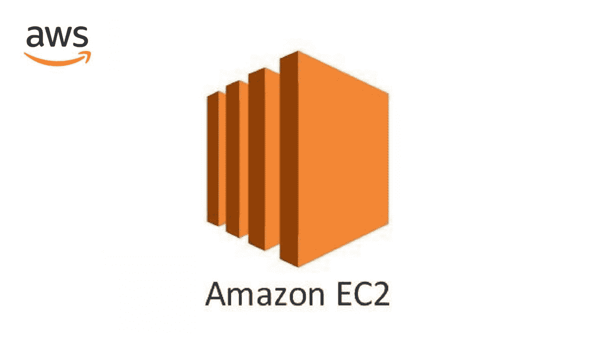

# 深度学习的十大云 GPU 平台

> 原文：<https://blog.paperspace.com/top-ten-cloud-gpu-platforms-for-deep-learning/>

Photo by [Macrovector](https://www.freepik.com/author/macrovector) / [Freepik](https://www.freepik.com/free-vector/cloud-services-isometric-composition-with-big-cloud-computing-infrastructure-elements-connected-with-dashed-lines-vector-illustration_7199787.htm#query=cloud%20computing&position=0&from_view=author)

您是否需要额外的计算资源来加速密集计算，并考虑如何利用云 GPU？

您是否不确定要使用的正确平台，或者您是否正在权衡选择更好的云 GPU 平台，这些平台完全符合您的预算，并且与您的业务目标和预算兼容？

那么这篇文章正适合你。在本文中，我们将分析使用每个平台的优点和缺点，以便您可以为您的用例选择最佳平台。

## 什么是 GPU？

这些年来，深度学习、图形渲染和其他计算量大的领域的技术有了很大的改进，对应用程序的速度、准确性和分辨率的要求也有了显著的提高。这些改进依赖于计算资源的可用性，这些资源能够运行支持大规模和长时间应用的进程。

例如，现代游戏需要更大的存储容量来容纳额外的视觉元素。还需要更高的处理速度来支持日益高清的视觉效果和后台操作，以获得更好的游戏体验。

简而言之，我们需要更高的计算资源来运行支持现代计算密集型应用所需的大量操作。

就计算速度而言，CPU 的出现和处理器体系结构的进一步发展产生了更快的 CPU，使得运行大多数计算机操作所需的速度成为可能。但是，由于需要更快地处理更密集的操作，因此需要一种技术来为这种密集计算提供更快、更高效的可能性。这导致了 GPU 的发展。

**图形处理单元**GPU 是一种微处理器，它利用并行处理能力和更高的内存带宽来执行专门的任务，例如加速图形创建和同时计算。它们已经成为游戏、3D 成像、视频编辑、加密挖掘和机器学习等应用中所需的密集计算的基本要素。众所周知，在运行 CPU 速度极慢的密集计算时，GPU 速度更快、效率更高。

对于深度学习操作，GPU 比 CPU 快得多，因为训练阶段是相当资源密集型的。由于大量的卷积和密集运算，这种运算需要大量的数据点处理。这些涉及张量、权重和层之间的若干矩阵运算，用于大规模输入数据和表征深度学习项目的深度网络。

GPU 由于其众多的内核而能够更快地运行这些多重张量运算，并且由于其更高的内存带宽而能够容纳更多的数据，这使得它在运行深度学习过程中比 CPU 更高效。在 CPU 上需要 50 分钟的密集操作在低端 GPU 上可能只需要一分钟。

## 为什么要用云 GPU？

为什么不呢？

虽然一些用户选择拥有本地 GPU，但云 GPU 在数据科学社区中的受欢迎程度仍在持续增长。拥有内部部署的 GPU 通常需要在定制安装、管理、维护和最终升级方面投入前期费用和时间。相比之下，云平台提供的 GPU 实例只需要用户使用服务，而不需要任何技术操作，并且服务费用可以承受。

这些平台提供利用 GPU 进行计算所需的所有服务，并负责 GPU 基础设施的整体管理。

去除自我管理内部部署 GPU 所需的技术流程后，用户可以专注于自己的业务专长。从而简化业务操作并提高生产率。

除了消除管理内部 GPU 的复杂性，利用云 GPU 还可以节省时间，并且比投资和维护现场基础架构更具成本效益。这有利于较小的企业，因为它将安装和管理此类计算资源所需的资本支出转化为使用云 GPU 服务的运营成本，从而降低了他们构建深度学习基础设施的障碍。

云平台还提供其他好处，如数据迁移、可访问性、集成、存储、安全性、升级、可扩展性、协作、控制以及对无压力和高效计算的支持。

就像厨师和他们的助手一样，让其他人提供必要的配料是非常合理的，这样你就可以专注于准备食物。

## 云 GPU 怎么入门？

随着云平台为客户设计更加用户友好的界面，云 GPU 的入门变得越来越容易。

使用云 GPU 的第一步是选择云平台。根据各自的服务对平台进行比较，对于做出符合您需求的明智选择非常重要。虽然我在本文中对深度学习工作负载的最佳可用云 GPU 平台和实例提出了一些建议，但您可以自行探索其他选项，找到最适合您需求的选项。

选择平台后的下一步是熟悉它的界面和基础设施。在这种情况下，熟能生巧。有大量的文档、教程视频和博客可以学习如何使用大多数云平台。这些为用户提供了指南。

一些其他平台(如 Google、Amazon、IBM 和 Azure)为其服务提供学习路径和认证，以获得更好的学习体验和利用率。

如果你是云计算数据科学的绝对初学者，我建议你从 Gradient 笔记本上提供的免费、无限制的 GPU 访问开始。这将有助于您在转向更多企业平台之前获得一些实践经验。

## 我该如何选择合适的平台和方案？

是的，选择合适的云 GPU 平台用于多样化的个人和商业计算是一个悖论。做出选择可能会令人生畏，尤其是在可用的云平台和计划越来越多的情况下。

对于深度学习操作，云 GPU 平台的选择应该取决于其 GPU 实例的规格、基础设施、设计、定价、可用性和客户支持。特定计划的选择取决于特定的用例、数据大小、预算和工作负载。

以下是您可以利用来满足个人或商业需求的最佳云 GPU 平台列表。

### 10.[腾讯云](https://intl.cloud.tencent.com/):

[腾讯云](https://intl.cloud.tencent.com/)通过各种渲染实例提供快速、稳定和弹性的云 GPU 计算，这些渲染实例利用了 NVIDIA A10、特斯拉 T4、特斯拉 P4、特斯拉 T40、特斯拉 V100 和英特尔 SG1 等 GPU。他们的服务遍及亚洲的广州、上海、北京和新加坡地区。

腾讯云平台上的 GN6s、GN7、GN8、GN10X 和 GN10XP GPU 实例支持深度学习训练和推理。他们提供按需付费的实例，可以在他们的虚拟私有云上启动，并允许连接到其他服务，无需额外费用。

该平台只允许高达 256GB 的内存大小，根据所需的资源，支持 GPU 的实例的价格在 1.72 美元/小时到 13.78 美元/小时之间。

****规格及定价为** NVIDIA **特斯拉 V100 GPU 实例上腾讯云。****

| ******实例** |  | **GPU 内存** |  | **记忆** | 按需定价 |
| 特斯拉 V100T3 | 13 | 32 GB | 十核 | 40 GB | 1.72 美元/小时 |
| 特斯拉 V100T3 | 2 | 64 GB | 20 核 | 80 GB | 3.44 美元/小时 |
| 特斯拉 V100T3 | 4 | 128 GB | 40 核 | 160 GBT2 | 6.89 美元/小时 |
| 特斯拉 V100T3 | 8 | 256 GB | 80 核 | 320 GBT2 | 13.78 美元/小时 |

### 9.[创世纪云](https://www.google.com/aclk?sa=l&ai=DChcSEwjd4bPeweX4AhVJJ0wKHdPKA1wYABAAGgJvYQ&ae=2&sig=AOD64_2iOBwKvg101bK8yHw_DHkfHV9ZSw&q&adurl&ved=2ahUKEwiXm6veweX4AhWsmWoFHTS5DPcQ0Qx6BAgCEAE):

[Genesis](https://www.google.com/aclk?sa=l&ai=DChcSEwjd4bPeweX4AhVJJ0wKHdPKA1wYABAAGgJvYQ&ae=2&sig=AOD64_2iOBwKvg101bK8yHw_DHkfHV9ZSw&q&adurl&ved=2ahUKEwiXm6veweX4AhWsmWoFHTS5DPcQ0Qx6BAgCEAE) cloud 采用最新技术，以合理的价格为机器学习、视觉处理和其他高性能计算工作负载提供高性能云 GPU。

他们的云 GPU 实例利用英伟达 GeForce RTX 3090、RTX 3080、RTX 3060 Ti 和 GTX 1080 Ti 等技术来加速计算。

它的计算仪表板界面简单，价格比大多数类似资源的平台都要便宜。他们还提供免费注册积分、长期计划折扣、公共 API 以及对 PyTorch 和 TensorFlow 框架的支持。

它们允许以按需和长期价格提供高达 192Gb 的内存和 80Gb 的磁盘存储。

### 8.[拉姆达实验室云](https://lambdalabs.com/service/gpu-cloud):

[Lambda Labs](https://lambdalabs.com/service/gpu-cloud) 提供云 GPU 实例，用于从单台机器到众多虚拟机的训练和扩展深度学习模型。

他们的虚拟机预装了主要的深度学习框架、CUDA 驱动程序，并可以访问专用的 Jupyter 笔记本。通过云仪表板中的 web 终端或直接通过提供的 SSH 密钥连接到实例。

这些实例支持高达 10Gbps 的节点间带宽，用于跨众多 GPU 的分布式培训和可扩展性，从而减少了模型优化的时间。他们提供按需定价和长达 3 年的保留定价实例。

该平台上的 GPU 实例包括英伟达 RTX 6000、夸德罗 RTX 6000 和特斯拉 V100s。

****在** Lambda-labs **云上** NVIDIA GPU **实例的规格和定价。****

| ******GPU 实例** |  | **GPU 内存** |  | **记忆** | 按需定价 |
| RTX a 6000T2 | 13 | 48 GB | 十四核 | 200 GBT2 | 1.45 美元/小时 |
| RTX a 6000T2 | 2 | 96 GB | 28 核 | 1tbT2 | 2.90 美元/小时 |
| RTX a 6000T2 | 4 | 192 GB | 56 核 | 1tbT2 | 5.80 美元/小时 |
| 当 RTX 6000 方块时 | 13 | 24 GB | 6 核 | 685 GB | 1.25 美元/小时 |
| 当 RTX 6000 方块时 | 2 | 48 GB | 12 内核T5 | 1.38 TB | 2.50 美元/小时 |
| 当 RTX 6000 方块时 | 4 | 96 GB | 24 内核T5 | 2.78 TB | 5.00 美元/小时 |
| 特斯拉 V100T3 | 8 | 128 GB | 92 内核T5 | 5.9 TB | 6.80 美元/小时 |

**7。 **[IBM 云](https://www.ibm.com/cloud)** GPU **:****

[IBM Cloud](https://www.ibm.com/cloud)GPU 通过全球分布式数据中心网络，提供灵活的服务器选择流程以及与 IBM Cloud 架构、API 和应用的无缝集成。

其产品包括裸机服务器 GPU 选项和英特尔至强 4210、至强 5218 和至强 6248 GPU 实例。裸机实例允许客户直接在服务器硬件上运行高性能、延迟敏感、专业和传统的工作负载，就像使用本地 GPU 一样。

他们还为其裸机服务器选项提供了高达 40 核的英伟达 T4 GPU 和英特尔至强的实例，并为其虚拟服务器选项提供了英伟达 V100 和 P100 型号的实例。

虚拟服务器选项的价格从 1.95 美元/小时起，裸机服务器 GPU 选项的价格至少为 819 美元/月。

****在** IBM **云上** NVIDIA GPU **实例的规格和定价。****

| **GPU 实例** | **GPU 分配** |  | **记忆** | 按需定价 |
| 特斯拉 | 13 | 8 核 | 60 GB | 1.95/小时 |
| 特斯拉 V100T3 | 13 | 8 核 | 20 GB | 3.06/小时 |
| 特斯拉 V100T3 | 13 | 8 核 | 64 GB | 2.49/小时 |
| 特斯拉 V100T3 | 2 | 16 内核T5 | 128 GB | 4.99/小时 |
| 特斯拉 V100T3 | 2 | 32 内核T5 | 256 GB | 5.98/小时 |
| 特斯拉 V100T3 | 13 | 8 核 | 60 GB | $2233/月 |

**6。 [**甲骨文云**基础设施](https://www.oracle.com/cloud/)** :

[Oracle](https://www.oracle.com/cloud/) 提供裸机和虚拟机 GPU 实例，实现快速、廉价和高性能的计算。他们的 GPU 实例包括 NVIDIA Tesla V100、P100 和 A100，它们利用了低延迟网络。这允许用户按需大规模托管 500 多个 GPU 集群。

像 IBM cloud 一样，Oracle 的裸机实例允许客户运行需要在非虚拟化环境中运行的工作负载。这些实例可在美国、德国和英国地区使用，并可通过按需和可抢占的定价选项获得。

****NVIDIA GPU**实例在** Oracle **云**基础设施**上的规格和定价。******

| **GPU 实例** |  | **GPU 内存** |  | **记忆** | 按需定价 |
| 特斯拉 | 13 | 16 GB | 十二核 | 72 GB | 1.275/小时 |
| 特斯拉 | 2 | 32 GB | 28 核 | 192 GB | 1.275/小时 |
| 特斯拉 V100T3 | 13 | 16 GB | 6 核 | 90 GB | 2.95/小时 |
| 特斯拉 V100T3 | 2 | 32 GB | 十二核 | 180 GBT2 | 2.95/小时 |
| 特斯拉 V100T3 | 4 | 64 GB | 24 核 | 360 GBT2 | 2.95/小时 |
| 特斯拉 V100T3 | 8 | 128 GB | 52 核 | 768 GB | 2.95/小时 |

****5。 **[蔚蓝 N 系列](https://docs.microsoft.com/en-us/azure/virtual-machines/sizes-gpu)** **:******

****

**Azure N 系列是一系列支持 NVIDIA GPU 的虚拟机，旨在用于模拟、深度学习、图形渲染、视频编辑、游戏和远程可视化。**

**N 系列有三(3)个子部分，设计用于不同的工作负载。**

**NC 系列使用 NVIDIA Tesla V100 处理一般高性能计算和机器学习工作负载。ND 系列使用英伟达特斯拉 P40 GPU，专门用于深度学习训练和推理工作负载。NV 系列使用 NVIDIA Tesla M60 GPU，更适合图形密集型应用。NC 和 nd 虚拟机还提供可选的 InfiniBand 互连，以支持纵向扩展性能。**

**价格从每月 657 美元起，1 至 3 年的预订付款计划有折扣。**

****Azure ND 系列实例的规格和定价****

| **GPU 实例** |  |  | **记忆** | 按需定价 |
| 特斯拉 P40 | 13 | 6 核 | 112 GB | $ 1511.10/月 |
| 特斯拉 P40 | 2 | 十二核 | 224 GB | $ 3022.20/月 |
| 特斯拉 P40 | 4 | 24 颗 | 448 GB | $ 6648.84/月 |
| 特斯拉 P40 | 4 | 24 核 | 448 GB | $ 6044.40/月 |
| 特斯拉 V100T3 | 2 | 12 内核T5 | 224 GB | $ 4467.60/月 |
| 特斯拉 A100T3 | 8 | 96 核 | 900 GBT2 | $ 19853.81/月 |
| 特斯拉 A100T3 | 8 | 96 核 | 1900 国标 | $ 23922.10/月 |

****4。 **[浩瀚艾](https://www.google.com/aclk?sa=l&ai=DChcSEwjZ9fKIweX4AhVYFNQBHc2oAm0YABAAGgJvYQ&ae=2&sig=AOD64_13B_o-QSV7rY90_wdYzsWtZGTJMg&q&adurl&ved=2ahUKEwjil-mIweX4AhVVmWoFHc55DYcQ0Qx6BAgEEAE)** **:******

****

**[Vast AI](https://www.google.com/aclk?sa=l&ai=DChcSEwjZ9fKIweX4AhVYFNQBHc2oAm0YABAAGgJvYQ&ae=2&sig=AOD64_13B_o-QSV7rY90_wdYzsWtZGTJMg&q&adurl&ved=2ahUKEwjil-mIweX4AhVVmWoFHc55DYcQ0Qx6BAgEEAE) 是一个租用低成本 GPU 进行高性能计算的全球市场。**

**它们通过允许主机出租其 GPU 硬件来降低计算密集型工作负载的价格，从而允许客户使用其 web 搜索界面根据需求找到最佳计算交易，并运行命令或启动 SSH 会话。**

**它们有一个简单的界面，并提供 SSH 实例、带有 Jupyter GUI 的 Jupyter 实例或纯命令实例。它们还提供深度学习性能函数(DLPerf ),该函数预测深度学习任务的近似性能。**

**Vast AI 不提供远程桌面，其系统基于 Ubuntu。它们还运行按需实例，由主机设定固定价格。只要客户端需要，这些实例就会运行。它们还提供了可中断的实例，在这些实例中，客户端为它们的实例设置投标价格，当前最高的投标运行，而其他投标暂停。**

****3。 **[谷歌计算引擎](https://cloud.google.com/compute) (GCE):******

****

**[谷歌计算引擎](https://cloud.google.com/compute) (GCE)为计算密集型工作负载提供高性能 GPU 服务器。**

**GCE 使用户能够将 GPU 实例附加到新的和现有的虚拟机，并提供 TensorFlow 处理(TPU)以实现更快的经济高效的计算。**

**其主要产品包括广泛的 GPU 类型，如英伟达的 V100、特斯拉 K80、特斯拉 P100、特斯拉 T4、特斯拉 P4 和 A100，以满足不同的成本和性能需求，每秒计费，简单的界面，更容易与其他相关技术集成。**

**GCE 的定价因地区和所需的计算资源而异。**

****2。 **[【亚马逊弹性计算(EC2)](https://aws.amazon.com/pm/ec2/?trk=36c6da98-7b20-48fa-8225-4784bced9843&sc_channel=ps&sc_campaign=acquisition&sc_medium=ACQ-P|PS-GO|Brand|Desktop|SU|Compute|EC2|US|EN|Text&s_kwcid=AL!4422!3!467723097970!e!!g!!amazon%20ec2&ef_id=Cj0KCQjw5ZSWBhCVARIsALERCvzydCVbD8hWq80NdQpz2zqOLm5Cl2rdCRGRBgRu3P2AhjyWssTFGogaArj7EALw_wcB:G:s&s_kwcid=AL!4422!3!467723097970!e!!g!!amazon%20ec2)** **:******

****

**Amazon [EC2](https://aws.amazon.com/pm/ec2/?trk=36c6da98-7b20-48fa-8225-4784bced9843&sc_channel=ps&sc_campaign=acquisition&sc_medium=ACQ-P|PS-GO|Brand|Desktop|SU|Compute|EC2|US|EN|Text&s_kwcid=AL!4422!3!467723097970!e!!g!!amazon%20ec2&ef_id=Cj0KCQjw5ZSWBhCVARIsALERCvzydCVbD8hWq80NdQpz2zqOLm5Cl2rdCRGRBgRu3P2AhjyWssTFGogaArj7EALw_wcB:G:s&s_kwcid=AL!4422!3!467723097970!e!!g!!amazon%20ec2) 为虚拟机提供预配置的模板，带有支持 GPU 的实例，用于加速深度学习计算。**

**支持 EC2 GPU 的实例被称为 P3、P4、G3、G4、G5 和 G5g。它们允许多达 4 或 8 个实例大小。亚马逊 EC2 上可用的 GPU 有英伟达特斯拉 V100、特斯拉 A100、特斯拉 M60、T4 和 A10 G 型号。**

**亚马逊 EC2 实例还允许轻松访问其他亚马逊网络服务，如用于将低成本 GPU 选项附加到实例的弹性图形，用于构建、培训、部署和企业扩展 ML 模型的 SageMaker，用于培训和托管工作流的虚拟私有云(VPC)以及用于存储培训数据的简单存储服务(亚马逊 S3)。**

**Amazon EC2 实例的定价可按需提供，并有预订计划。**

******亚马逊 EC2 P3 实例的规格和定价**。****

| **GPU** |  | **GPU 内存** | **vcpu** | 按需定价 |
| 特斯拉 V100T3 | 13 | 16 国标 | 8 核 | /HR |
| 特斯拉 V100T3 | 4 | 64GBT2 | 32 核 | /HR |
| 特斯拉 V100T3 | 8 | 128 GBT2 | 64 核 | /HR |
| 特斯拉 V100T3 | 8 | 256 GBT2 | 96 核 | /HR |

****1。**:******

****

**[CORE](https://www.paperspace.com/core) 是由 Paperspace 构建的完全托管的云 GPU 平台，可为一系列应用提供简单、经济且加速的计算。**

**它的独特之处在于其简单易用的管理控制台、强大的 API 以及针对 Windows 和 Linux 系统的桌面访问。它还提供了出色的协作工具和无限的计算能力，用于运行要求最苛刻的深度学习工作负载。**

**它提供了[最广泛的价格合理的高性能 NVIDIA GPU](https://www.paperspace.com/gpu-cloud-comparison)，这些 GPU 连接到虚拟机并预装了机器学习框架，可轻松快速地进行计算。**

**GPU 实例按秒计费，每小时和每月的价格较低，确保用户只使用他们使用的资源。它还提供折扣和各种实例来满足所有计算需求。**

**该平台旨在为用户提供最佳的简单性、性能和经济性。这使得它非常适合构建个人项目或企业应用程序。**

**他们的 ML Ops 平台 [Gradient](https://gradient.run/) 也内置了许多这些功能，可以增强您构建端到端深度学习应用的体验。**

******paper space 核心 GPU 实例的规格和定价******

| **GPU 实例** | **vcpu** | **记忆** | 按需定价 |
| m 4000T2 | 8 核 | 30GBT2 | /HR |
| p 4000T2 | 8 核 | 30GBT2 | $0.51/HR |
| p 5000T3 | 8 核 | 30GBT2 | /HR |
| P6000 | 8 核 | 30GBT2 | /HR |
| 特斯拉 V100T3 | 8 核 | 30GBT2 | /HR |
| RTX 4000T2 | 8 核 | 30GBT2 | /HR |
| RTX 5000T2 | 8 核 | 30GBT2 | $ 0.82/小时 |
| a 4000T3 | 8 核 | 45GBT2 | $ 0.76/小时 |
| A5000 | 8 核 | 45GBT2 | $ 1.38/小时 |
| a 6000T3 | 8 核 | 45GBT2 | $ 1.89/小时 |
| 特斯拉 A100T3 | 十二核 | 90GBT2 | $ 3.09/小时 |

******结论******

**在这篇博文中，我们考虑了使用云 GPU 来运行密集计算，并且我提出了用于深度学习操作的最佳云 GPU 平台的论点。我展示了 GPU 对于提高机器学习工作负载的性能和速度是必不可少的，以及如何利用云 GPU 比本地 GPU 更容易、更具成本效益、更省时，特别是对于小型企业和个人。**

**特定云 GPU 平台的选择主要取决于您的特定需求和预算。您还应该考虑这样一个平台的基础设施、定价、性能、设计和支持以及可用性。**

**NVIDIA Tesla A100、Tesla V100 和 Tesla P100 适用于大多数大规模深度学习工作负载，而 Tesla A4000、Tesla A5000 和 A6000 适用于几乎所有其他深度学习任务。提供这些 GPU 的平台应该优先覆盖您的所有工作负载。考虑这些平台的位置和可用性也很重要，以避免位置限制和高成本，这样您就可以以可承受的成本运行几次长时间的迭代。**

**基于这些因素和更多因素，Paperspace Core 在我的最佳云 GPU 平台列表中名列榜首。亚马逊 EC2 实例和谷歌计算引擎也是可靠计算的可行选择，而在广阔的人工智能市场上租用的 GPU 也可以为用户的个人项目服务。也欢迎读者探索其他选择。查看此[链接，了解不同平台在纯数字方面的表现](https://www.paperspace.com/gpu-cloud-comparison)。**