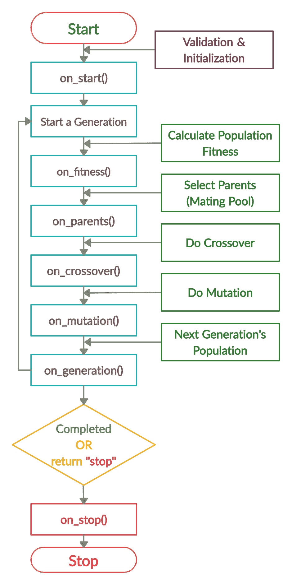
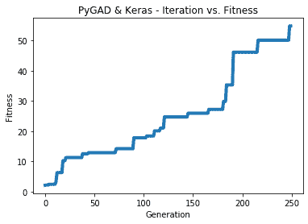

# 如何用 PyGAD 遗传算法训练 Keras 模型

> 原文：<https://blog.paperspace.com/train-keras-models-using-genetic-algorithm-with-pygad/>

PyGAD 是一个开源 Python 库，用于构建遗传算法和训练机器学习算法。它提供了广泛的参数来定制遗传算法，以处理不同类型的问题。

PyGAD 有自己的模块，支持构建和训练神经网络(NNs)和卷积神经网络(CNN)。尽管这些模块运行良好，但它们是在 Python 中实现的，没有任何额外的优化措施。这导致即使是简单的问题也需要相对较长的计算时间。

最新的 PyGAD 版本 2 . 8 . 0(2020 年 9 月 20 日发布)支持训练 Keras 模型的新模块。尽管 Keras 是用 Python 构建的，但速度很快。原因是 Keras 使用 TensorFlow 作为后端，TensorFlow 高度优化。

本教程讨论了如何使用 PyGAD 训练 Keras 模型。讨论内容包括使用顺序模型或函数式 API 构建 Keras 模型、构建 Keras 模型参数的初始群体、创建合适的适应度函数等等。

您也可以跟随本教程中的代码，并在来自 [ML Showcase](https://ml-showcase.paperspace.com/projects/genetic-algorithm-with-pygad) 的渐变社区笔记本上免费运行它。完整的教程大纲如下:

*   PyGAD 入门
*   `pygad.kerasga`模块
*   使用 PyGAD 训练 Keras 模型的步骤
*   确定问题类型
*   创建 Keras 模型
*   实例化`pygad.kerasga.KerasGA`类
*   准备培训数据
*   损失函数
*   适应度函数
*   生成回调函数(可选)
*   创建一个`pygad.GA`类的实例
*   运行遗传算法
*   健身与世代图
*   有关已定型模型的统计信息
*   回归的完整代码
*   使用 CNN 分类的完整代码

让我们开始吧。

## 【PyGAD 入门

要开始本教程，安装 PyGAD 是必不可少的。如果您已经安装了 PyGAD，检查`__version__`属性以确保至少安装了 PyGAD 2.8.0。

```py
import pygad

print(pygad.__version__)
```

PyGAD 可以在 [PyPI (Python 包索引)](https://pypi.org/project/pygad)上获得，并且可以使用`pip`安装程序进行安装。如果您还没有安装 PyGAD，请确保安装 PyGAD 2.8.0 或更高版本。

```py
pip install pygad>=2.8.0
```

你可以在[阅读文档](https://pygad.readthedocs.io)上找到 PyGAD 文档，包括一些示例问题。下面是一个如何解决简单问题的示例，即优化线性模型的参数。

```py
import pygad
import numpy

function_inputs = [4,-2,3.5,5,-11,-4.7]
desired_output = 44 

def fitness_func(solution, solution_idx):
    output = numpy.sum(solution*function_inputs)
    fitness = 1.0 / (numpy.abs(output - desired_output) + 0.000001)
    return fitness

num_generations = 100
num_parents_mating = 10
sol_per_pop = 20
num_genes = len(function_inputs)

ga_instance = pygad.GA(num_generations=num_generations,
                       num_parents_mating=num_parents_mating,
                       fitness_func=fitness_func,
                       sol_per_pop=sol_per_pop,
                       num_genes=num_genes)

ga_instance.run()

ga_instance.plot_result()
```

## **`pygad.kerasga`模块**

从 PyGAD 2.8.0 开始，引入了一个名为`kerasga`的新模块。它的名字是**Keras**G 遗传 **A** 算法的简称。该模块提供以下功能:

*   使用`KerasGA`类构建解决方案的初始群体。每个解决方案都包含 Keras 模型的所有参数。
*   使用`model_weights_as_vector()`函数将 Keras 模型的参数表示为染色体(即 1-D 向量)。
*   使用`model_weights_as_matrix()`功能从染色体中恢复 Keras 模型的参数。

`pygad.kerasga`模块有一个名为`KerasGA`的类。该类的构造函数接受两个参数:

1.  Keras 模型。
2.  `num_solutions`:群体中解的数量。

基于这两个参数，`pygad.kerasga.KerasGA`类创建了 3 个实例属性:

1.  `model`:对 Keras 模型的引用。
2.  `num_solutions`:群体中解的数量。
3.  `population_weights`:保存模型参数的嵌套列表。该列表在每一代之后更新。

假设 Keras 模型保存在`model`变量中，下面的代码创建了一个`KerasGA`类的实例，并将其保存在`keras_ga`变量中。`num_solutions`参数被赋值为 10，这意味着群体有 10 个解。

构造函数创建一个长度等于参数`num_solutions`值的列表。列表中的每个元素在使用`model_weights_as_vector()`函数转换成一维向量后，为模型的参数保存不同的值。

基于`KerasGA`类的实例，初始群体可以从`population_weights`属性返回。假设模型有 60 个参数，有 10 个解，那么初始种群的形状就是`10x60`。

```py
import pygad.kerasga

keras_ga = pygad.kerasga.KerasGA(model=model,
                                 num_solutions=10)

initial_population = keras_ga.population_weights
```

下一节总结了使用 PyGAD 训练 Keras 模型的步骤。这些步骤中的每一个都将在后面详细讨论。

## **使用 PyGAD 训练 Keras 模型的步骤**

使用 PyGAD 训练 Keras 模型的步骤总结如下:

*   确定问题类型
*   创建 Keras 模型
*   实例化`pygad.kerasga.KerasGA`类
*   准备培训数据
*   损失函数
*   适应度函数
*   生成回调函数(可选)
*   创建一个`pygad.GA`类的实例
*   运行遗传算法

接下来的部分将讨论这些步骤。

### **确定问题类型**

问题类型(分类或回归)有助于确定以下内容:

1.  损失函数(用于构建适应度函数)
2.  Keras 模型中的输出图层
3.  培训用数据

对于回归问题，损失函数可以是平均绝对误差、均方误差或这里列出的另一个函数。

对于一个分类问题，损失函数可以是二进制交叉熵(对于二进制分类)、分类交叉熵(对于多类问题)，或者本页中[所列的另一个函数。](https://keras.io/api/losses/probabilistic_losses)

输出层中的激活函数根据问题是分类还是回归而不同。对于分类问题，它可能是 **softmax** ，而对于回归问题，它可能是**线性**。

至于输出，与分类问题的类别标签相比，回归问题的输出将是连续函数。

总之，预先确定问题的类型至关重要，以便正确选择训练数据和损失函数。

### **创建 Keras 模型**

构建 Keras 模型有三种方式:

1.  [时序模型](https://keras.io/guides/sequential_model)
2.  [功能 API](https://keras.io/guides/functional_api)
3.  [模型子类化](https://keras.io/guides/model_subclassing)

PyGAD 支持使用顺序模型和函数式 API 构建 Keras 模型。

#### **时序模型**

要使用 Keras 创建顺序模型，只需使用`tensorflow.keras.layers`模块创建每个层。然后创建一个`tensorflow.keras.Sequential`类的实例。最后，使用`add()`方法给模型添加图层。

```py
import tensorflow.keras

input_layer  = tensorflow.keras.layers.Input(3)
dense_layer1 = tensorflow.keras.layers.Dense(5, activation="relu")
output_layer = tensorflow.keras.layers.Dense(1, activation="linear")

model = tensorflow.keras.Sequential()
model.add(input_layer)
model.add(dense_layer1)
model.add(output_layer)
```

注意，输出层的激活函数是`linear`，这意味着这是针对一个回归问题。对于分类问题，激活函数可以是`softmax`。在下一行中，输出层有 2 个神经元(每个类 1 个),并使用`softmax`激活函数。

```py
output_layer = tensorflow.keras.layers.Dense(2, activation="linear")
```

#### **功能 API**

对于函数式 API 的情况，每一层都是正常创建的(与我们在上面看到的创建顺序模型的方式相同)。除了输入层，每个后续层都用作接受前一层作为参数的函数。最后，创建了一个`tensorflow.keras.Model`类的实例，它接受输入和输出层作为参数。

```py
input_layer  = tensorflow.keras.layers.Input(3)
dense_layer1 = tensorflow.keras.layers.Dense(5, activation="relu")(input_layer)
output_layer = tensorflow.keras.layers.Dense(1, activation="linear")(dense_layer1)

model = tensorflow.keras.Model(inputs=input_layer, outputs=output_layer)
```

创建 Keras 模型后，下一步是使用`KerasGA`类创建 Keras 模型参数的初始群体。

### **实例化`pygad.kerasga.KerasGA`类**

通过创建`pygad.kerasga.KerasGA`类的实例，创建了 Keras 模型参数的初始群体。下一段代码将前一节创建的 Keras 模型传递给`KerasGA`类构造函数的`model`参数。

```py
import pygad.kerasga

keras_ga = pygad.kerasga.KerasGA(model=model,
                                 num_solutions=10)
```

下一节将创建用于培训 Keras 模型的培训数据。

### **准备培训数据**

基于问题的类型(分类或回归)，准备训练数据。

对于有 1 个输出的回归问题，这里有一些随机生成的训练数据，其中每个样本有 3 个输入。

```py
# Data inputs
data_inputs = numpy.array([[0.02, 0.1, 0.15],
                           [0.7, 0.6, 0.8],
                           [1.5, 1.2, 1.7],
                           [3.2, 2.9, 3.1]])

# Data outputs
data_outputs = numpy.array([[0.1],
                            [0.6],
                            [1.3],
                            [2.5]])
```

下面是像 XOR 这样的二进制分类问题的具有 2 个输入的样本训练数据。准备输出，使得输出层具有 2 个神经元；每节课 1 个。

```py
# XOR problem inputs
data_inputs = numpy.array([[0, 0],
                           [0, 1],
                           [1, 0],
                           [1, 1]])

# XOR problem outputs
data_outputs = numpy.array([[1, 0],
                            [0, 1],
                            [0, 1],
                            [1, 0]])
```

下一节讨论回归和分类问题的损失函数。

### 损失函数

损失函数因问题类型而异。本节讨论 Keras 的`tensorflow.keras.losses`模块中用于回归和分类问题的一些损失函数。

#### **回归**

对于回归问题，损失函数包括:

*   `tensorflow.keras.losses.MeanAbsoluteError()`
*   `tensorflow.keras.losses.MeanSquaredError()`

查看[本页](https://keras.io/api/losses/regression_losses)了解更多信息。

下面是一个计算平均绝对误差的示例，其中`y_true`和`y_pred`代表真实输出和预测输出。

```py
mae = tensorflow.keras.losses.MeanAbsoluteError()
loss = mae(y_true, y_pred).numpy()
```

#### **分类**

对于分类问题，损失函数包括:

*   `tensorflow.keras.losses.BinaryCrossentropy()`为二进制分类。
*   `tensorflow.keras.losses.CategoricalCrossentropy()`用于多类分类。

查看[本页](https://keras.io/api/losses/probabilistic_losses)了解更多信息。

下面是一个计算二元类熵的示例:

```py
bce = tensorflow.keras.losses.BinaryCrossentropy()
loss = bce(y_true, y_pred).numpy()
```

基于损失函数，根据下一部分准备适应度函数。

### **健身功能**

分类或回归问题的损失函数是最小化函数，而遗传算法的适应函数是最大化函数。因此，适应值是作为损失值的倒数来计算的。

```py
fitness_value = 1.0 / loss
```

用于计算模型的适应值的步骤如下:

1.  从一维向量恢复模型参数。
2.  设置模型参数。
3.  做预测。
4.  计算损失值。
5.  计算适应值。
6.  返回适应值。

#### **回归适合度**

下面的代码构建了完整的适应度函数，它与 PyGAD 一起处理回归问题。PyGAD 中的 fitness 函数是一个常规的 Python 函数，它有两个参数。第一个表示要计算适应值的解。第二个参数是群体内解的指数，这在某些情况下可能是有用的。

传递给适应度函数的解是一维向量。为了从这个向量恢复 Keras 模型的参数，使用了`pygad.kerasga.model_weights_as_matrix()`。

```py
model_weights_matrix = pygad.kerasga.model_weights_as_matrix(model=model, weights_vector=solution)
```

一旦参数被恢复，它们就被`set_weights()`方法用作模型的当前参数。

```py
model.set_weights(weights=model_weights_matrix)
```

基于当前参数，模型使用`predict()`方法预测输出。

```py
predictions = model.predict(data_inputs)
```

预测输出用于计算损失值。平均绝对误差被用作损失函数。

```py
mae = tensorflow.keras.losses.MeanAbsoluteError()
```

因为损失值可能是 0.0，所以最好像`0.00000001`一样给它加上一个小值，以避免在计算适应值时被零除。

```py
solution_fitness = 1.0 / (mae(data_outputs, predictions).numpy() + 0.00000001)
```

最后，返回适应值。

```py
def fitness_func(solution, sol_idx):
    global data_inputs, data_outputs, keras_ga, model

    model_weights_matrix = pygad.kerasga.model_weights_as_matrix(model=model,
                                                                 weights_vector=solution)

    model.set_weights(weights=model_weights_matrix)

    predictions = model.predict(data_inputs)

    mae = tensorflow.keras.losses.MeanAbsoluteError()
    solution_fitness = 1.0 / (mae(data_outputs, predictions).numpy() + 0.00000001)

    return solution_fitness
```

#### **二元分类的适合度**

对于二元分类问题，下面是一个适用于 PyGAD 的适应度函数。它计算二元交叉熵损失，假设分类问题是二元的。

```py
def fitness_func(solution, sol_idx):
    global data_inputs, data_outputs, keras_ga, model

    model_weights_matrix = pygad.kerasga.model_weights_as_matrix(model=model,
                                                                 weights_vector=solution)

    model.set_weights(weights=model_weights_matrix)

    predictions = model.predict(data_inputs)

    bce = tensorflow.keras.losses.BinaryCrossentropy()
    solution_fitness = 1.0 / (bce(data_outputs, predictions).numpy() + 0.00000001)

    return solution_fitness
```

下一节将构建一个在每代结束时执行的回调函数。

### **生成回调函数(可选)**

在每一次生成完成后，可以调用一个回调函数来计算一些关于最新到达的参数的统计数据。这一步是可选的，仅用于调试目的。

生成回调函数实现如下。在 PyGAD 中，这个回调函数必须接受一个引用遗传算法实例的参数，通过这个参数可以使用`population`属性获取当前人口。

该函数打印最佳解决方案的当前世代号和适应值。这种信息使用户不断更新遗传算法的进展。

```py
def callback_generation(ga_instance):
    print("Generation = {generation}".format(generation=ga_instance.generations_completed))
    print("Fitness    = {fitness}".format(fitness=ga_instance.best_solution()[1]))
```

## **创建一个`pygad.GA`类**的实例

使用 PyGAD 训练 Keras 模型的下一步是创建一个`pygad.GA`类的实例。这个类的构造函数接受许多参数，这些参数可以在[文档](https://pygad.readthedocs.io/en/latest/README_pygad_ReadTheDocs.html#init)中找到。

下一个代码块通过为这个应用程序传递最少数量的参数来实例化`pygad.GA`类，这些参数是:

*   `num_generations`:世代数。
*   `num_parents_mating`:要交配的父母数量。
*   `initial_population`:Keras 模型参数的初始群体。
*   `fitness_func`:健身功能。
*   `on_generation`:生成回调函数。

请注意，在`KerasGA`类的构造函数中，群体中的解的数量先前被设置为 10。因此，要交配的亲本数量必须少于 10 个。

```py
num_generations = 250
num_parents_mating = 5
initial_population = keras_ga.population_weights

ga_instance = pygad.GA(num_generations=num_generations, 
                       num_parents_mating=num_parents_mating, 
                       initial_population=initial_population,
                       fitness_func=fitness_func,
                       on_generation=callback_generation)
```

下一部分运行遗传算法来开始训练 Keras 模型。

## **运行遗传算法**

`pygad.GA`类的实例通过调用`run()`方法来运行。

```py
ga_instance.run()
```

通过执行这个方法，PyGAD 的生命周期按照下图开始。



下一节讨论如何对训练好的模型得出一些结论。

## **适应度对比世代图**

使用`pygad.GA`类中的`plot_result()`方法，PyGAD 创建了一个图形，显示每一代的适应值是如何变化的。

```py
ga_instance.plot_result(title="PyGAD & Keras - Iteration vs. Fitness", linewidth=4)
```

## **关于训练模型的统计**

`pygad.GA`类有一个名为`best_solution()`的方法，它返回 3 个输出:

1.  找到的最佳解决方案。
2.  最佳解的适应值。
3.  群体中最佳解决方案的索引。

下面的代码调用了`best_solution()`方法，并打印出关于找到的最佳解决方案的信息。

```py
solution, solution_fitness, solution_idx = ga_instance.best_solution()
print("Fitness value of the best solution = {solution_fitness}".format(solution_fitness=solution_fitness))
print("Index of the best solution : {solution_idx}".format(solution_idx=solution_idx))
```

接下来，我们将从最佳解决方案中恢复 Keras 模型的权重。基于恢复的权重，该模型预测训练样本的输出。您还可以预测新样本的输出。

```py
# Fetch the parameters of the best solution.
best_solution_weights = pygad.kerasga.model_weights_as_matrix(model=model,
                                                              weights_vector=solution)
model.set_weights(best_solution_weights)
predictions = model.predict(data_inputs)
print("Predictions : \n", predictions)
```

下面的代码计算损失，即平均绝对误差。

```py
mae = tensorflow.keras.losses.MeanAbsoluteError()
abs_error = mae(data_outputs, predictions).numpy()
print("Absolute Error : ", abs_error)
```

## **回归的完整代码**

对于使用平均绝对误差作为损失函数的回归问题，这里是完整的代码。

```py
import tensorflow.keras
import pygad.kerasga
import numpy
import pygad

def fitness_func(solution, sol_idx):
    global data_inputs, data_outputs, keras_ga, model

    model_weights_matrix = pygad.kerasga.model_weights_as_matrix(model=model,
                                                                 weights_vector=solution)

    model.set_weights(weights=model_weights_matrix)

    predictions = model.predict(data_inputs)

    mae = tensorflow.keras.losses.MeanAbsoluteError()
    abs_error = mae(data_outputs, predictions).numpy() + 0.00000001
    solution_fitness = 1.0 / abs_error

    return solution_fitness

def callback_generation(ga_instance):
    print("Generation = {generation}".format(generation=ga_instance.generations_completed))
    print("Fitness    = {fitness}".format(fitness=ga_instance.best_solution()[1]))

input_layer  = tensorflow.keras.layers.Input(3)
dense_layer1 = tensorflow.keras.layers.Dense(5, activation="relu")(input_layer)
output_layer = tensorflow.keras.layers.Dense(1, activation="linear")(dense_layer1)

model = tensorflow.keras.Model(inputs=input_layer, outputs=output_layer)

weights_vector = pygad.kerasga.model_weights_as_vector(model=model)

keras_ga = pygad.kerasga.KerasGA(model=model,
                                 num_solutions=10)

# Data inputs
data_inputs = numpy.array([[0.02, 0.1, 0.15],
                           [0.7, 0.6, 0.8],
                           [1.5, 1.2, 1.7],
                           [3.2, 2.9, 3.1]])

# Data outputs
data_outputs = numpy.array([[0.1],
                            [0.6],
                            [1.3],
                            [2.5]])

num_generations = 250
num_parents_mating = 5
initial_population = keras_ga.population_weights

ga_instance = pygad.GA(num_generations=num_generations, 
                       num_parents_mating=num_parents_mating, 
                       initial_population=initial_population,
                       fitness_func=fitness_func,
                       on_generation=callback_generation)
ga_instance.run()

# After the generations complete, some plots are showed that summarize how the outputs/fitness values evolve over generations.
ga_instance.plot_result(title="PyGAD & Keras - Iteration vs. Fitness", linewidth=4)

# Returning the details of the best solution.
solution, solution_fitness, solution_idx = ga_instance.best_solution()
print("Fitness value of the best solution = {solution_fitness}".format(solution_fitness=solution_fitness))
print("Index of the best solution : {solution_idx}".format(solution_idx=solution_idx))

# Fetch the parameters of the best solution.
best_solution_weights = pygad.kerasga.model_weights_as_matrix(model=model,
                                                              weights_vector=solution)
model.set_weights(best_solution_weights)
predictions = model.predict(data_inputs)
print("Predictions : \n", predictions)

mae = tensorflow.keras.losses.MeanAbsoluteError()
abs_error = mae(data_outputs, predictions).numpy()
print("Absolute Error : ", abs_error)
```

代码完成后，下图显示了适应值是如何增加的。这说明 Keras 模型学习正常。



以下是关于训练模型的更多细节。请注意，预测值接近真实值。平均相对误差为 0.018。

```py
Fitness value of the best solution = 54.79189095217631
Index of the best solution : 0
Predictions : 
[[0.11471477]
 [0.6034051 ]
 [1.3416876 ]
 [2.486804  ]]
Absolute Error :  0.018250866
```

## **使用 CNN** 完成分类代码

以下代码使用 Keras 构建了一个卷积神经网络，用于对 80 幅图像的数据集进行分类，其中每幅图像的大小为`100x100x3`。请注意，使用分类交叉熵损失是因为数据集有 4 个类。

可以从[这里](https://github.com/ahmedfgad/NumPyCNN/blob/master/dataset_inputs.npy)(数据集输入)和[这里](https://github.com/ahmedfgad/NumPyCNN/blob/master/dataset_outputs.npy)(数据集输出)下载训练数据。

```py
import tensorflow.keras
import pygad.kerasga
import numpy
import pygad

def fitness_func(solution, sol_idx):
    global data_inputs, data_outputs, keras_ga, model

    model_weights_matrix = pygad.kerasga.model_weights_as_matrix(model=model,
                                                                 weights_vector=solution)

    model.set_weights(weights=model_weights_matrix)

    predictions = model.predict(data_inputs)

    cce = tensorflow.keras.losses.CategoricalCrossentropy()
    solution_fitness = 1.0 / (cce(data_outputs, predictions).numpy() + 0.00000001)

    return solution_fitness

def callback_generation(ga_instance):
    print("Generation = {generation}".format(generation=ga_instance.generations_completed))
    print("Fitness    = {fitness}".format(fitness=ga_instance.best_solution()[1]))

# Build the keras model using the functional API.
input_layer = tensorflow.keras.layers.Input(shape=(100, 100, 3))
conv_layer1 = tensorflow.keras.layers.Conv2D(filters=5,
                                             kernel_size=7,
                                             activation="relu")(input_layer)
max_pool1 = tensorflow.keras.layers.MaxPooling2D(pool_size=(5,5),
                                                 strides=5)(conv_layer1)
conv_layer2 = tensorflow.keras.layers.Conv2D(filters=3,
                                             kernel_size=3,
                                             activation="relu")(max_pool1)
flatten_layer  = tensorflow.keras.layers.Flatten()(conv_layer2)
dense_layer = tensorflow.keras.layers.Dense(15, activation="relu")(flatten_layer)
output_layer = tensorflow.keras.layers.Dense(4, activation="softmax")(dense_layer)

model = tensorflow.keras.Model(inputs=input_layer, outputs=output_layer)

keras_ga = pygad.kerasga.KerasGA(model=model,
                                 num_solutions=10)

# Data inputs
data_inputs = numpy.load("dataset_inputs.npy")

# Data outputs
data_outputs = numpy.load("dataset_outputs.npy")
data_outputs = tensorflow.keras.utils.to_categorical(data_outputs)

num_generations = 200
num_parents_mating = 5
initial_population = keras_ga.population_weights

ga_instance = pygad.GA(num_generations=num_generations, 
                       num_parents_mating=num_parents_mating, 
                       initial_population=initial_population,
                       fitness_func=fitness_func,
                       on_generation=callback_generation)

ga_instance.run()

ga_instance.plot_result(title="PyGAD & Keras - Iteration vs. Fitness", linewidth=4)

# Returning the details of the best solution.
solution, solution_fitness, solution_idx = ga_instance.best_solution()
print("Fitness value of the best solution = {solution_fitness}".format(solution_fitness=solution_fitness))
print("Index of the best solution : {solution_idx}".format(solution_idx=solution_idx))

# Fetch the parameters of the best solution.
best_solution_weights = pygad.kerasga.model_weights_as_matrix(model=model,
                                                              weights_vector=solution)
model.set_weights(best_solution_weights)
predictions = model.predict(data_inputs)
# print("Predictions : \n", predictions)

# Calculate the categorical crossentropy for the trained model.
cce = tensorflow.keras.losses.CategoricalCrossentropy()
print("Categorical Crossentropy : ", cce(data_outputs, predictions).numpy())

# Calculate the classification accuracy for the trained model.
ca = tensorflow.keras.metrics.CategoricalAccuracy()
ca.update_state(data_outputs, predictions)
accuracy = ca.result().numpy()
print("Accuracy : ", accuracy)
```

下图显示了适应值是如何逐代演变的。只要适应度值增加，就可以增加代数来达到更好的精度。


以下是有关已训练模型的一些信息:

```py
Fitness value of the best solution = 2.7462310258668805
Categorical Crossentropy :  0.3641354
Accuracy :  0.75
```

## **结论**

在本教程中，我们看到了如何使用遗传算法和开源的 PyGAD 库来训练 Keras 模型。Keras 模型可以使用顺序模型或函数式 API 来创建。

使用`pygad.kerasga`模块创建 Keras 模型权重的初始群体，其中每个解决方案包含模型的不同权重集。这个种群随后按照 PyGAD 的生命周期进化，直到所有的世代都完成。

由于 Keras 后端 TensorFlow 的高速特性，PyGAD 可以在可接受的时间内训练复杂的架构。