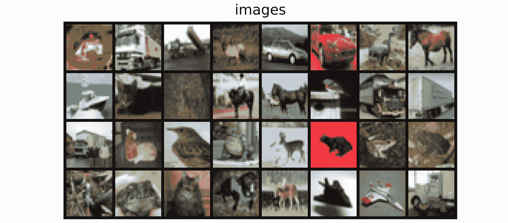
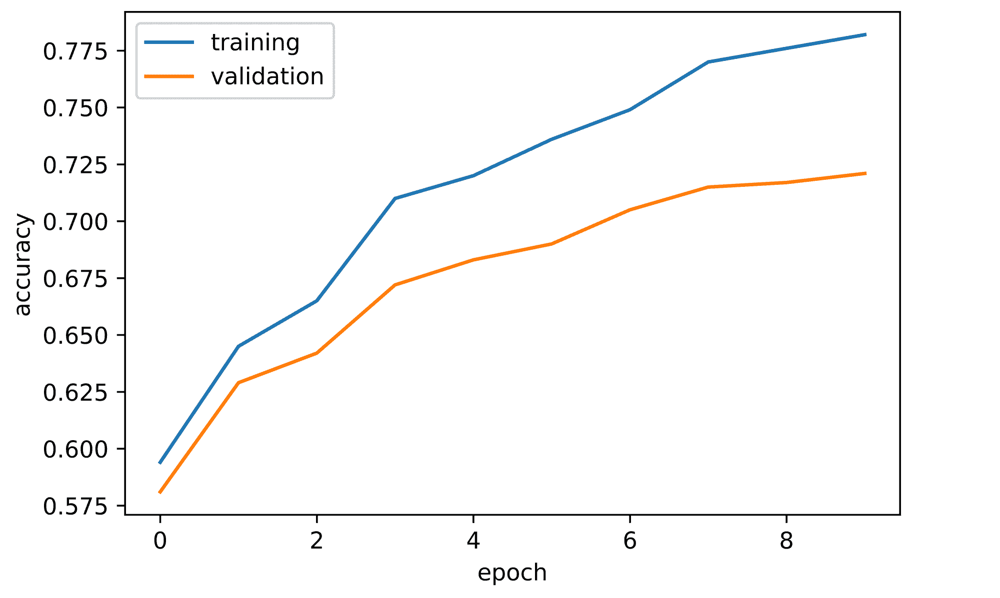
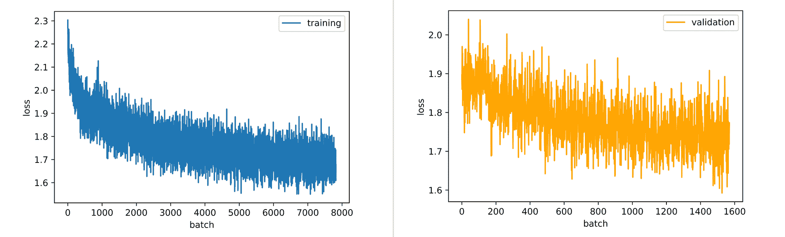

# PyTorch 中的培训、验证和准确性

> 原文：<https://blog.paperspace.com/training-validation-and-accuracy-in-pytorch/>

说到深度学习，大多数框架都没有预打包的训练、验证和准确性功能或方法。因此，当许多工程师第一次处理数据科学问题时，开始使用这些功能可能是一个挑战。在大多数情况下，这些过程需要手动实现。在这一点上，它变得棘手。为了编写这些函数，需要真正理解这些过程需要什么。在这篇初学者教程文章中，我们将从理论上对上述过程进行高级研究，并在 PyTorch 中实现它们，然后将它们放在一起，为分类任务训练一个卷积神经网络。

### 导入和设置

下面是我们将用于该任务的一些导入的库。每个都预装在 Gradient Notebook 的深度学习运行时中，因此使用上面的链接在免费的 GPU 上快速开始本教程。

```py
import torch
import torch.nn as nn
import torch.nn.functional as F
import torchvision
import torchvision.transforms as transforms
import torchvision.datasets as Datasets
from torch.utils.data import Dataset, DataLoader
import numpy as np
import matplotlib.pyplot as plt
import cv2
from tqdm.notebook import tqdm
```

```py
if torch.cuda.is_available():
  device = torch.device('cuda:0')
  print('Running on the GPU')
else:
  device = torch.device('cpu')
  print('Running on the CPU')
```

### 神经网络剖析

首先，当谈到由神经网络产生的模型时，无论是多层感知器、卷积神经网络还是生成对抗网络等，这些模型都简单地由“数字”组成，这些数字是统称为 ***参数*** 的权重和偏差。一个有 2000 万个参数的神经网络就是一个有 2000 万个数字的网络，每个数字都会影响通过网络的任何数据实例(权重为乘法，偏差为加法)。按照这种逻辑，当 28×28 像素的图像通过具有 2000 万个参数的卷积神经网络时，所有 784 个像素实际上将遇到所有 2000 万个参数，并以某种方式被所有 2000 万个参数转换。

### 模型目标

考虑下面的自定义构建的 convnet，输出层返回两个元素的矢量表示，因此可以得出结论，其目标是帮助解决二元分类任务。

```py
class ConvNet(nn.Module):
  def __init__(self):
    super().__init__()
    self.conv1 = nn.Conv2d(3, 8, 3, padding=1)
    self.batchnorm1 = nn.BatchNorm2d(8)
    self.conv2 = nn.Conv2d(8, 8, 3, padding=1)
    self.batchnorm2 = nn.BatchNorm2d(8)
    self.pool2 = nn.MaxPool2d(2)
    self.conv3 = nn.Conv2d(8, 32, 3, padding=1)
    self.batchnorm3 = nn.BatchNorm2d(32)
    self.conv4 = nn.Conv2d(32, 32, 3, padding=1)
    self.batchnorm4 = nn.BatchNorm2d(32)
    self.pool4 = nn.MaxPool2d(2)
    self.conv5 = nn.Conv2d(32, 128, 3, padding=1)
    self.batchnorm5 = nn.BatchNorm2d(128)
    self.conv6 = nn.Conv2d(128, 128, 3, padding=1)
    self.batchnorm6 = nn.BatchNorm2d(128)
    self.pool6 = nn.MaxPool2d(2)
    self.conv7 = nn.Conv2d(128, 2, 1)
    self.pool7 = nn.AvgPool2d(3)

  def forward(self, x):
    #-------------
    # INPUT
    #-------------
    x = x.view(-1, 3, 32, 32)

    #-------------
    # LAYER 1
    #-------------
    output_1 = self.conv1(x)
    output_1 = F.relu(output_1)
    output_1 = self.batchnorm1(output_1)

    #-------------
    # LAYER 2
    #-------------
    output_2 = self.conv2(output_1)
    output_2 = F.relu(output_2)
    output_2 = self.pool2(output_2)
    output_2 = self.batchnorm2(output_2)

    #-------------
    # LAYER 3
    #-------------
    output_3 = self.conv3(output_2)
    output_3 = F.relu(output_3)
    output_3 = self.batchnorm3(output_3)

    #-------------
    # LAYER 4
    #-------------
    output_4 = self.conv4(output_3)
    output_4 = F.relu(output_4)
    output_4 = self.pool4(output_4)
    output_4 = self.batchnorm4(output_4)

    #-------------
    # LAYER 5
    #-------------
    output_5 = self.conv5(output_4)
    output_5 = F.relu(output_5)
    output_5 = self.batchnorm5(output_5)

    #-------------
    # LAYER 6
    #-------------
    output_6 = self.conv6(output_5)
    output_6 = F.relu(output_6)
    output_6 = self.pool6(output_6)
    output_6 = self.batchnorm6(output_6)

    #--------------
    # OUTPUT LAYER
    #--------------
    output_7 = self.conv7(output_6)
    output_7 = self.pool7(output_7)
    output_7 = output_7.view(-1, 2)

    return F.softmax(output_7, dim=1)
```

假设我们想要训练这个 convnet 正确地区分标记为 0 的猫和标记为 1 的狗。本质上，我们试图在低层次上做的是确保每当一幅猫的图像通过网络时，它的所有像素都与这个 convnet 中的所有 197，898 个参数交互，输出向量中的第一个元素(索引 0)将大于第二个元素(索引 1){例如`[0.65, 0.35]` }。否则，如果一个狗的图像被通过，那么第二个元素(index 1)预计会更大{例如`[0.20, 0.80]` }。

现在，我们可以开始认识到模型目标的艰巨性，是的，在数百万种可能的排列中存在 197，898 个数字/参数的组合，这使我们能够做我们在上一段中描述的事情。寻找这种排列就是 ***训练*** 过程所需要的。

### 正确的组合

当一个神经网络被实例化时，它的参数都是随机的，或者如果你通过一种特定的技术初始化参数，它们将不是随机的，而是遵循特定于该特定技术的初始化。尽管如此，在初始化时，网络参数将不适合手边的模型目标，使得如果在该状态下使用模型，将获得随机分类。

现在的目标是找到 197，898 个参数的正确组合，这将使我们能够实现我们的目标。为此，我们需要将训练图像分成多个批次，然后将一个批次通过 convnet，测量我们的分类错误程度(**)，在最适合我们目标的方向上稍微调整所有 197，898 个参数( ***反向传播*** )，然后对所有其他批次重复，直到训练数据用尽。这个过程叫做 ***优化*** 。**

```py
`def train(network, training_set, batch_size, optimizer, loss_function):
  """
  This function optimizes the convnet weights
  """
  #  creating list to hold loss per batch
  loss_per_batch = []

  #  defining dataloader
  train_loader = DataLoader(training_set, batch_size)

  #  iterating through batches
  print('training...')
  for images, labels in tqdm(train_loader):
    #---------------------------
    #  sending images to device
    #---------------------------
    images, labels = images.to(device), labels.to(device)

    #-----------------------------
    #  zeroing optimizer gradients
    #-----------------------------
    optimizer.zero_grad()

    #-----------------------
    #  classifying instances
    #-----------------------
    classifications = network(images)

    #---------------------------------------------------
    #  computing loss/how wrong our classifications are
    #---------------------------------------------------
    loss = loss_function(classifications, labels)
    loss_per_batch.append(loss.item())

    #------------------------------------------------------------
    #  computing gradients/the direction that fits our objective
    #------------------------------------------------------------
    loss.backward()

    #---------------------------------------------------
    #  optimizing weights/slightly adjusting parameters
    #---------------------------------------------------
    optimizer.step()
  print('all done!')

  return loss_per_batch`
```

### **恰当的概括**

**为了确保优化的参数对训练集之外的数据起作用，我们需要利用它们对不同的图像集进行分类，并确保它们具有与在训练集上相当的性能，这次不会对参数进行优化。这个过程被称为 ***、*** ，用于此目的的数据集被称为 ***验证集*** 。**

```py
`def validate(network, validation_set, batch_size, loss_function):
  """
  This function validates convnet parameter optimizations
  """
  #  creating a list to hold loss per batch
  loss_per_batch = []

  #  defining model state
  network.eval()

  #  defining dataloader
  val_loader = DataLoader(validation_set, batch_size)

  print('validating...')
  #  preventing gradient calculations since we will not be optimizing
  with torch.no_grad():
    #  iterating through batches
    for images, labels in tqdm(val_loader):
      #--------------------------------------
      #  sending images and labels to device
      #--------------------------------------
      images, labels = images.to(device), labels.to(device)

      #--------------------------
      #  making classsifications
      #--------------------------
      classifications = network(images)

      #-----------------
      #  computing loss
      #-----------------
      loss = loss_function(classifications, labels)
      loss_per_batch.append(loss.item())

  print('all done!')

  return loss_per_batch`
```

### **衡量绩效**

**在平衡训练集的上下文中处理分类任务时，最好使用**准确度作为选择的度量来测量模型性能。由于标签是整数，本质上是指向应该具有最高概率/值的索引的指针，为了获得精确度，我们需要将图像通过 convnet 时输出向量表示中最大值的索引与图像的标签进行比较。准确性是在训练集和验证集上测量的。****

```py
**`def accuracy(network, dataset):
  """
  This function computes accuracy
  """
  #  setting model state
  network.eval()

  #  instantiating counters
  total_correct = 0
  total_instances = 0

  #  creating dataloader
  dataloader = DataLoader(dataset, 64)

  #  iterating through batches
  with torch.no_grad():
    for images, labels in tqdm(dataloader):
      images, labels = images.to(device), labels.to(device)

      #-------------------------------------------------------------------------
      #  making classifications and deriving indices of maximum value via argmax
      #-------------------------------------------------------------------------
      classifications = torch.argmax(network(images), dim=1)

      #--------------------------------------------------
      #  comparing indicies of maximum values and labels
      #--------------------------------------------------
      correct_predictions = sum(classifications==labels).item()

      #------------------------
      #  incrementing counters
      #------------------------
      total_correct+=correct_predictions
      total_instances+=len(images)
  return round(total_correct/total_instances, 3)`**
```

### ****连接零件****

 ****#### 资料组

为了观察所有这些协同工作的过程，我们现在将它们应用于一个实际的数据集。CIFAR-10 数据集将用于此目的。这是一个数据集，包含来自 10 个不同类别的 32 x 32 像素图像，如下表所示。



数据集可以加载到 PyTorch 中，如下所示...

```py
#  loading training data
training_set = Datasets.CIFAR10(root='./', download=True,
                              transform=transforms.ToTensor())

#  loading validation data
validation_set = Datasets.CIFAR10(root='./', download=True, train=False,
                                transform=transforms.ToTensor())
```

| 标签 | 描述 |
| --- | --- |
| Zero | 飞机 |
| one | 汽车 |
| Two | 鸟 |
| three | 猫 |
| four | 鹿 |
| five | 狗 |
| six | 青蛙 |
| seven | 马 |
| eight | 船 |
| nine | 卡车 |

#### 转换架构

因为这是一个包含 10 个类的分类任务，所以我们需要修改我们的 convnet，以输出一个包含 10 个元素的向量，如下面的代码单元所示。

```py
class ConvNet(nn.Module):
  def __init__(self):
    super().__init__()
    self.conv1 = nn.Conv2d(3, 8, 3, padding=1)
    self.batchnorm1 = nn.BatchNorm2d(8)
    self.conv2 = nn.Conv2d(8, 8, 3, padding=1)
    self.batchnorm2 = nn.BatchNorm2d(8)
    self.pool2 = nn.MaxPool2d(2)
    self.conv3 = nn.Conv2d(8, 32, 3, padding=1)
    self.batchnorm3 = nn.BatchNorm2d(32)
    self.conv4 = nn.Conv2d(32, 32, 3, padding=1)
    self.batchnorm4 = nn.BatchNorm2d(32)
    self.pool4 = nn.MaxPool2d(2)
    self.conv5 = nn.Conv2d(32, 128, 3, padding=1)
    self.batchnorm5 = nn.BatchNorm2d(128)
    self.conv6 = nn.Conv2d(128, 128, 3, padding=1)
    self.batchnorm6 = nn.BatchNorm2d(128)
    self.pool6 = nn.MaxPool2d(2)
    self.conv7 = nn.Conv2d(128, 10, 1)
    self.pool7 = nn.AvgPool2d(3)

  def forward(self, x):
    #-------------
    # INPUT
    #-------------
    x = x.view(-1, 3, 32, 32)

    #-------------
    # LAYER 1
    #-------------
    output_1 = self.conv1(x)
    output_1 = F.relu(output_1)
    output_1 = self.batchnorm1(output_1)

    #-------------
    # LAYER 2
    #-------------
    output_2 = self.conv2(output_1)
    output_2 = F.relu(output_2)
    output_2 = self.pool2(output_2)
    output_2 = self.batchnorm2(output_2)

    #-------------
    # LAYER 3
    #-------------
    output_3 = self.conv3(output_2)
    output_3 = F.relu(output_3)
    output_3 = self.batchnorm3(output_3)

    #-------------
    # LAYER 4
    #-------------
    output_4 = self.conv4(output_3)
    output_4 = F.relu(output_4)
    output_4 = self.pool4(output_4)
    output_4 = self.batchnorm4(output_4)

    #-------------
    # LAYER 5
    #-------------
    output_5 = self.conv5(output_4)
    output_5 = F.relu(output_5)
    output_5 = self.batchnorm5(output_5)

    #-------------
    # LAYER 6
    #-------------
    output_6 = self.conv6(output_5)
    output_6 = F.relu(output_6)
    output_6 = self.pool6(output_6)
    output_6 = self.batchnorm6(output_6)

    #--------------
    # OUTPUT LAYER
    #--------------
    output_7 = self.conv7(output_6)
    output_7 = self.pool7(output_7)
    output_7 = output_7.view(-1, 10)

    return F.softmax(output_7, dim=1)
```

#### 连接过程

为了训练上面定义的 convnet，我们需要做的就是实例化模型，利用训练函数优化 convnet 权重，并记录我们对每批的分类错误程度(损失)。然后，我们利用验证函数来确保 convnet 在训练集之外的数据上工作，并再次记录我们的分类有多错误。然后，我们在训练和验证集上导出 convnets 精度，记录每一步的损失，以跟踪优化过程。

```py
#  instantiating model
model = ConvNet()
#  defining optimizer
optimizer = torch.optim.Adam(model.parameters(), lr=3e-4)

#  training/optimizing parameters
training_losses = train(network=model, training_set=training_set, 
                        batch_size=64, optimizer=optimizer, 
                        loss_function=nn.CrossEntropyLoss())

#  validating optimizations                        
validation_losses = validate(network=model, validation_set=validation_set, 
                             batch_size=64, loss_function=nn.CrossEntropyLoss())

#  deriving model accuracy on the traininig set
training_accuracy = accuracy(model, training_set)
print(f'training accuracy: {training_accuracy}')

#  deriving model accuracy on the validation set
validation_accuracy = accuracy(model, validation_set)
print(f'validation accuracy: {validation_accuracy}')
```

当您运行上面的代码块时，很有可能您的训练和验证精度会不太理想。但是，如果您取出前四行代码并将其粘贴到新的代码单元格中，重新运行训练、验证和准确性函数将会提高性能。对整个数据集进行多次循环的过程被称为 ***时期的训练。*** 本质上，如果您运行流程五次，那么您已经为 ***5 个时期*** 训练了模型。

移动前四行代码的原因是，在运行训练函数时，模型中随机初始化的权重已经优化到一个点。如果您随后重新运行代码单元，而您的模型实例化仍然在同一个单元中，那么它的权重将再次被随机化，并使之前的优化无效。为了确保所有进程都正确同步，将进程打包在函数或类中是一个好主意。我个人更喜欢使用类，因为它把所有的过程都放在一个整洁的包中。

```py
class ConvolutionalNeuralNet():
  def __init__(self, network):
    self.network = network.to(device)
    self.optimizer = torch.optim.Adam(self.network.parameters(), lr=1e-3)

  def train(self, loss_function, epochs, batch_size, 
            training_set, validation_set):

    #  creating log
    log_dict = {
        'training_loss_per_batch': [],
        'validation_loss_per_batch': [],
        'training_accuracy_per_epoch': [],
        'validation_accuracy_per_epoch': []
    } 

    #  defining weight initialization function
    def init_weights(module):
      if isinstance(module, nn.Conv2d):
        torch.nn.init.xavier_uniform_(module.weight)
        module.bias.data.fill_(0.01)
      elif isinstance(module, nn.Linear):
        torch.nn.init.xavier_uniform_(module.weight)
        module.bias.data.fill_(0.01)

    #  defining accuracy function
    def accuracy(network, dataloader):
      network.eval()
      total_correct = 0
      total_instances = 0
      for images, labels in tqdm(dataloader):
        images, labels = images.to(device), labels.to(device)
        predictions = torch.argmax(network(images), dim=1)
        correct_predictions = sum(predictions==labels).item()
        total_correct+=correct_predictions
        total_instances+=len(images)
      return round(total_correct/total_instances, 3)

    #  initializing network weights
    self.network.apply(init_weights)

    #  creating dataloaders
    train_loader = DataLoader(training_set, batch_size)
    val_loader = DataLoader(validation_set, batch_size)

    #  setting convnet to training mode
    self.network.train()

    for epoch in range(epochs):
      print(f'Epoch {epoch+1}/{epochs}')
      train_losses = []

      #  training
      print('training...')
      for images, labels in tqdm(train_loader):
        #  sending data to device
        images, labels = images.to(device), labels.to(device)
        #  resetting gradients
        self.optimizer.zero_grad()
        #  making predictions
        predictions = self.network(images)
        #  computing loss
        loss = loss_function(predictions, labels)
        log_dict['training_loss_per_batch'].append(loss.item())
        train_losses.append(loss.item())
        #  computing gradients
        loss.backward()
        #  updating weights
        self.optimizer.step()
      with torch.no_grad():
        print('deriving training accuracy...')
        #  computing training accuracy
        train_accuracy = accuracy(self.network, train_loader)
        log_dict['training_accuracy_per_epoch'].append(train_accuracy)

      #  validation
      print('validating...')
      val_losses = []

      #  setting convnet to evaluation mode
      self.network.eval()

      with torch.no_grad():
        for images, labels in tqdm(val_loader):
          #  sending data to device
          images, labels = images.to(device), labels.to(device)
          #  making predictions
          predictions = self.network(images)
          #  computing loss
          val_loss = loss_function(predictions, labels)
          log_dict['validation_loss_per_batch'].append(val_loss.item())
          val_losses.append(val_loss.item())
        #  computing accuracy
        print('deriving validation accuracy...')
        val_accuracy = accuracy(self.network, val_loader)
        log_dict['validation_accuracy_per_epoch'].append(val_accuracy)

      train_losses = np.array(train_losses).mean()
      val_losses = np.array(val_losses).mean()

      print(f'training_loss: {round(train_losses, 4)}  training_accuracy: '+
      f'{train_accuracy}  validation_loss: {round(val_losses, 4)} '+  
      f'validation_accuracy: {val_accuracy}\n')

    return log_dict

  def predict(self, x):
    return self.network(x)
```

在上面的课程中，我们在`train()`方法中结合了训练和验证过程。这是为了防止进行多个属性调用，因为这些进程无论如何都是串联工作的。还要注意的是，精确度是作为一个辅助函数添加到`train()`方法中的，精确度是在训练和验证之后立即计算的。还定义了权重初始化函数，该函数有助于使用 Xavier 权重初始化技术来初始化权重，对如何初始化网络的权重进行一定程度的控制通常是很好的实践。还定义了一个度量日志，用于在训练 convnet 时跟踪所有损耗和精度。

```py
#  training model
model = ConvolutionalNeuralNet(ConvNet())

log_dict = model.train(nn.CrossEntropyLoss(), epochs=10, batch_size=64, 
                       training_set=training_set, validation_set=validation_set)
```

用上面定义的参数训练 con vnet 10 个时期(10 个周期)产生了下面的度量。在培训过程中，培训和验证的准确性都有所提高，这表明 convnets 参数确实得到了适当的调整/优化。验证准确度开始时约为 58%,到第十个时期能够达到 72%。

然而，应该注意的是，虽然验证曲线已经开始变平，但 convnet 并没有被彻底训练，它仍然处于上升趋势，因此 convnet 在过度拟合开始之前可能需要更多的训练周期。损失图也表明了同样的情况，即每批的验证损失在第 10 个时期结束时仍呈下降趋势。



### 结束语

在本文中，我们探讨了神经网络训练中的三个重要过程:训练、验证和准确性。我们从较高的层面解释了所有这三个过程需要什么，以及它们如何在 PyTorch 中实现。然后，我们将所有这三个过程组合在一个类中，并将其用于训练卷积神经网络。读者应该期望能够在他们自己的 PyTorch 代码中实现这些功能。****