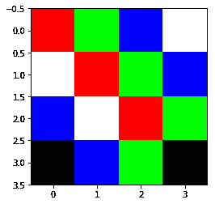
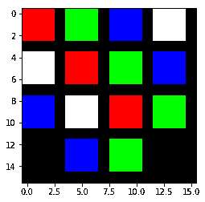
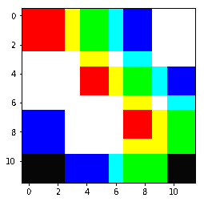

# 转置卷积解释了上采样图像

> 原文：<https://blog.paperspace.com/transpose-convolution/>

当使用深度神经网络(DNNs)进行图像处理时，卷积神经网络无需介绍。CNN 提供了一种更现实的方法来从图像中提取和学习特征，同时有助于降低图像维度。但是如果我们想要相反的结果呢？

假设您想要执行一些图像到图像的映射，比如图像或实例分割，或者超分辨率。对于语义分割的情况，您将从一个输入图像开始，其中每个像素都应该有一个相应的类标签。现在，让我们假设您试图用一个 CNN 后面跟着一个全连接层(在大多数图像分类模型中使用)来解决这个问题。你会遇到几个问题:

1.  大量的参数。
2.  丢失图像的空间特征。

假设输入图像的大小为 128×128×3 (128 像素的高度和宽度以及 3 个通道— RGB)。然后你通过几层 CNN 输出形状是 44×64。这意味着现在我们在第一个隐藏层中有 1024 个神经元。现在尝试将其上采样 32 倍。即使您将输出层放在该层之后，输出层的大小也将是 32，768。为了解决这个问题，我们使用了一种叫做转置卷积的方法，这种方法可以被认为是与普通卷积相反的。这是通过维护连接模式来实现的。

假设我们将卷积应用于一个 5×5×1 的图像，其内核为 3×3，步长为 2×2，填充有效。

Convolution Operation

正如您在上面的图像中看到的，输出将是一个 2×2 的图像。您也可以使用下面的公式来计算卷积运算的输出大小:

> 卷积输出大小= 1 +(输入大小-滤波器大小+ 2 *填充)/步幅

现在，假设您想将其上采样到与输入图像相同的维度。您将使用与卷积相同的参数，并在下采样之前首先计算图像的大小。您可以通过将上面的公式从*输出图像*大小更改为*输入图像*(在高度或宽度上)来实现这一点。*有效填充*表示图像周围没有填充。*相同的填充*意味着我们在所有边上添加了*过滤器大小/2* (底值)的填充。

> **输出维度:**
> 转置卷积输出大小=(输入大小- 1) *步长+滤波器大小- 2 *填充+输出填充

所以现在你必须在这个大小的矩阵中填充值。现在到了棘手的部分:如何获得与输入相同的值？答案是不能。那么你现在要怎么填充这个转置的复杂矩阵呢？遵循以下步骤:

1.  你需要一个(过滤器大小*过滤器大小)的过滤器，将内核的所有值与图像的第一个值相乘。
2.  然后把这个过滤器放在转置的 Conv 矩阵的左上角。
3.  将第二个像素与滤波器相乘，并将结果放入具有指定步长的转置 Conv 矩阵中。
4.  如果有任何重叠的值，则将这些值相加。
5.  重复这个过程，直到矩阵被填满，这就是结果。

为了更好地理解，我们如何将结果可视化？让我们用一种简单的方法来想象结果。假设您有下面的 4×4 图像作为输入。

Output Of Convolution

假设我们在几个卷积层之后得到这个 4×4 的图像。现在我们将应用转置卷积。为了更好地理解转置卷积，我们假设滤波器中的所有值都是透明值，这意味着当我们将其相乘时，它不会改变颜色。这将有助于我们在与颜色的比较中理解操作；在这里，我们认为向黑色添加任何颜色都会产生黑色，等量混合 RGB 颜色会产生白色。现在，让我们在上面的图像中尝试以下参数:

> **输入:** 4x4 | **滤波器大小:** 3x3 | **步长:** 4x4 | **填充:** 0 | **输出填充:** 1
> 我们来看看转置卷积运算后的输出大小会是多少。
> 转置卷积输出大小=(4-1) * 4 + 3 - 2 * 0 + 1 = 16

Output with non-overlapping filters

这里发生的情况是，每个单像素乘以一个 3x3 滤波器，形成一个 3x3 块，然后放入输出矩阵。由于我们的步幅为 4，中间的值将为零，这在图像中可以被视为黑色条纹。我们在输出填充中添加了 1，这将有助于获得大小均匀的输出，以便与下一个输出进行比较。

> **输入:** 4x4 | **滤波器大小:** 4x4 | **步长:** 4x4 | **填充:** 0 | **输出填充:** 0
> 我们来看看转置卷积运算后的输出大小会是多少。
> 转置卷积输出大小=(4-1) * 4 + 4 - 2 * 0 + 0 = 16

Output with overlapped filters

正如左边的结果所示，你可以清楚地看到更多的颜色。这是重叠单元格相加的结果。第一个 4×4 单元将用红色(255，0，0)填充，接下来的 4×4 单元用绿色(0，255，0)填充，得到的单元是(255，255，0)，即黄色。其他细胞也是如此。你可以看到重叠的细胞有不同的颜色。虽然与白色重叠的单元格将始终是白色的(因为所有大于 255 的值都被归一化为白色的 255)，但与黑色重叠的单元格将会扩展(因为黑色是 0，添加任何值都是相同的)。

要将转置卷积图层添加到 Keras 模型中，可以使用 TF . Keras . layers . conv 2d transpose 图层。作为顺序模型的一部分。

> TF . keras . layers . conv 2d transpose(
> filters _ depth，filter_size，stamps =(1，1)，padding='valid '，output_padding=0)

转置卷积用于许多最新的 CNN。进行图像到图像转换或生成的神经网络使用转置卷积。

现在我们知道如何使用转置卷积对图像进行上采样。当你训练一个神经网络时，我们需要计算出转置卷积层的滤波器中的值，就像 CNN 一样。这就是我们的朋友反向传播来帮忙的地方。我希望你喜欢这篇文章。