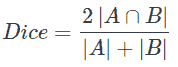
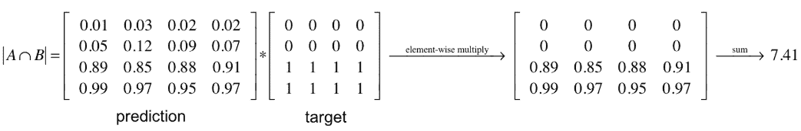
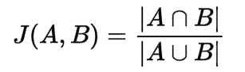
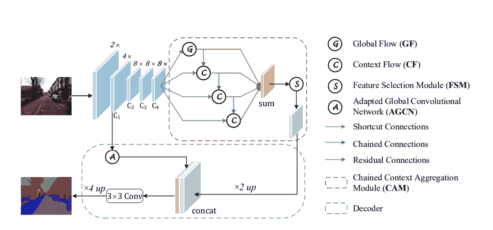
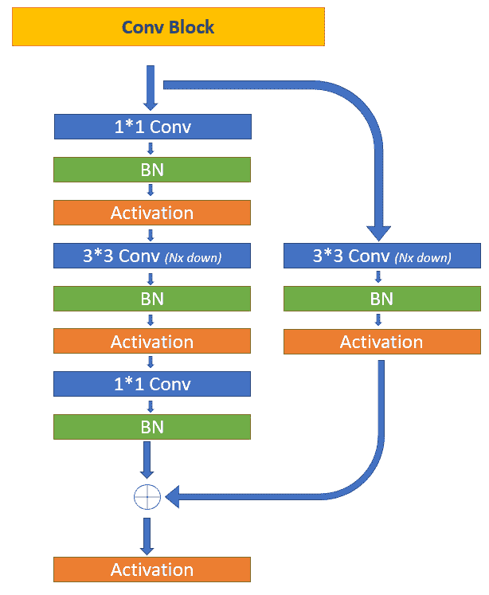
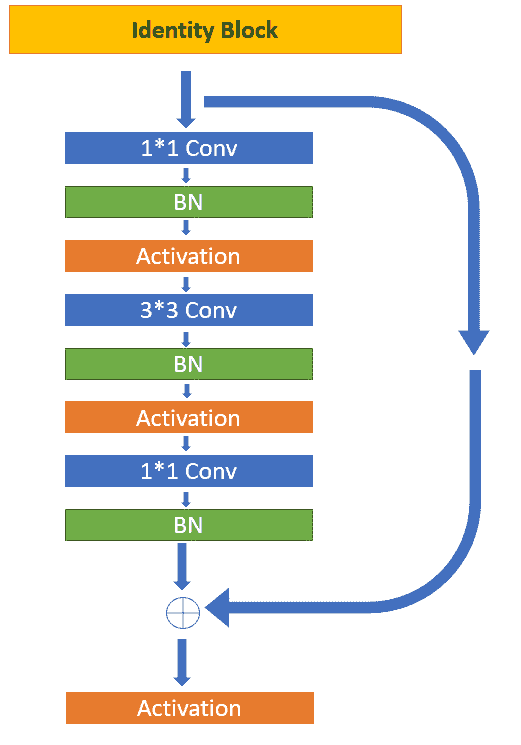
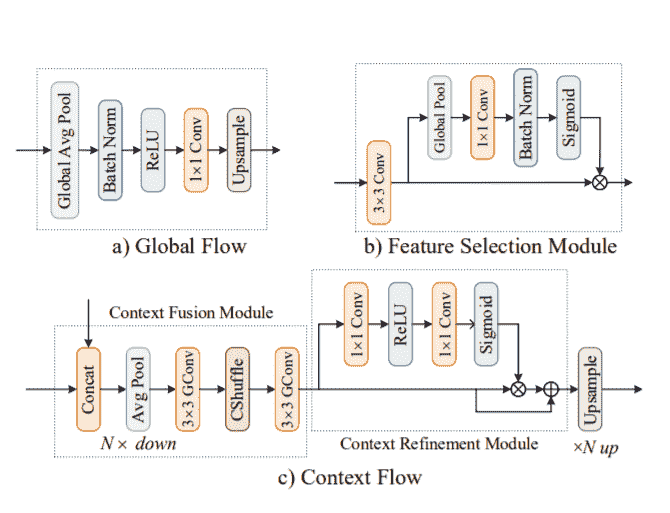
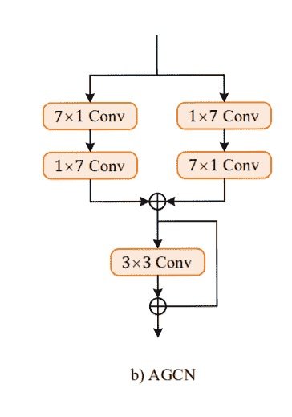
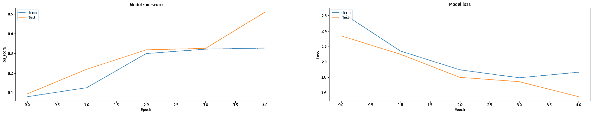
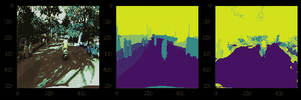

# 从头开始理解 CANet 架构

> 原文：<https://blog.paperspace.com/understanding-canet-architecture/>


Image From [Wiki](https://upload.wikimedia.org/wikipedia/commons/a/aa/Polarlicht_2.jpg)

*图像分割*是任何图像识别项目中最有趣和最关键的方面之一，因为通过图像分割，我们可以确定特定图片中最基本的元素和成分。通过图像分割，开发人员可以将特定图像中的重要对象与其他实体分开。一旦该提取过程完成，我们可以将指定的片段或整个分类的分割图像用于多种目的和各种应用。隔离图像中的特定元素可以用于确定异常。因此，图像分割在生物医学任务中具有巨大的用途。然而，学习图像中各种参数的整个分割元素可以用于其他应用，例如道路和车辆分割数据。

在我们之前的文章中，我们了解了 U-Net 模型的工作和架构。在这一部分中，我们将关注另一种类型的建筑方法来执行图像分割任务。链式上下文聚合网络(CANet)是执行图像分割任务的另一种极好的方法。它采用非对称解码器来恢复预测图的精确空间细节。本文灵感来自于[研究论文](https://arxiv.org/pdf/2002.12041.pdf) *注意力引导的链式上下文聚合语义切分*。这篇研究论文涵盖了这种新方法的大部分基本要素，以及它如何影响许多复杂任务的性能。如果您对学习该架构的几乎每一个元素都感兴趣，那么建议您阅读整篇文章。但是，如果您想关注您更感兴趣的特定元素，请随时查看目录。

### 目录:

*   CANet 简介
*   对 CAM 和一些损失函数的简单理解
*   架构入门
    1。导入库
    2。卷积块
    3。身份块
    4。形状的验证
*   全局流和上下文流
*   特征选择模块和适应的全球卷积网络(AGCN)
*   完成构建
*   结论

## 简介:

有几种方法、算法和不同类型的架构来解决深度学习中的众多问题。一种解决图像分割问题的这样的架构是 CANet 模型。该方法利用利用类似于 U-Net 架构的全卷积网络(FCN)的概念来捕获多尺度上下文，以获得精确的定位和图像分割掩模。所提出的模型引入了串-并行混合范例的概念，具有链式上下文聚合模块(CAM ),以使特征传播多样化。以下新的整合允许通过两阶段过程(即预融合和再融合)来捕捉各种空间特征和维度。

除了前面讨论过的设计特性之外，它还包括一个编码器-解码器架构，在该架构中，编码器网络对输入图像进行连续下采样。但是在解码器网络中，数据被向上采样回到其原始大小。最常见的编码器-解码器架构结构与 CANet 模型中使用的架构结构之间的一个主要区别在于，CANet 解码器在恢复预测图的精确空间细节时是不对称的。他们也使用注意力的概念来获得最好的结果。注意方法包含在 CAM 结构旁边。因此出现了链式上下文聚合网络(CANet)这个术语。

CANet 架构的主要贡献包括链式上下文聚合模块，用于在串并联混合结构的帮助下捕获多尺度特征。串行流不断扩大输出神经元的感受域，而并行流编码不同的基于区域的上下文，从而极大地提高了性能。流引导支持多尺度上下文的强大聚合。该模型在多个具有挑战性的数据集上进行了广泛测试，似乎提供了最佳结果。因此，它可以被称为最先进的表演方法之一。

* * *

## 简要了解 CAM 和一些损失函数:

如前所述，链式上下文聚合模块(CAM)是 CANet 架构最关键的方面之一。它由全局流和上下文流组成。这两种结构都是浅层编码器-解码器结构，包含用于获得不同感受野的下采样层、用于集成足够的上下文特征的投影层以及用于恢复定位信息的上采样层。

当全局流和上下文流被集成为串并行混合时，它们有助于多尺度上下文的高质量编码。它们具有许多优点，包括大的接收特征、用于图像分割的以不同形状编码的像素特征、多尺度上下文的高质量编码以及简化梯度的反向传播。现在让我们继续讨论一些通常用于图像分割任务的损失函数。

### 了解骰子损失和借据损失:

骰子损失是用于图像分割任务的流行损失函数，也称为骰子系数。它本质上是两个样本之间重叠的度量。

配方=



损失函数的范围是从 0 到 1，它可以解释如下:



对于在预测的分段掩码上评估 Dice 系数的情况，我们可以将$|A∩B|$近似为预测和目标掩码之间的元素式乘法，然后对结果矩阵求和。这个损失函数帮助我们确定在每个像素中遇到了多少损失，以及我们的模型在每个像素中的表现有多精确。那么可以取总和来显示在执行分割之后从目标模型到预测模型的完全损失。

IoU 分数是用于确定图像分割任务质量的另一个重要度量。总的来说，解释起来很直观。当预测边界框精确匹配地面真实边界框时，通过预测边界框获得 1 分。分数为 0 意味着预测边界框和地面真实的真实边界框完全不重叠。IoU 分数的计算如下:



* * *

## 架构入门:

从零开始实现 CANet 架构是相当复杂的。我们有几个需要高精度关注的编码模块，以实现最佳结果并确保我们获得最佳结果。我们将创建自定义类来执行最初的[研究论文](https://arxiv.org/pdf/2002.12041.pdf)中描述的大多数操作。这种用 TensorFlow 和 Keras 深度学习框架构建架构的方法也被称为模型子类化。在我们从头开始构建架构的每个部分之前，检查一下我们将要构建的整个模型以及它包含的所有基本实体。



上图是未来事物的代表。这种架构设计的上下两部分可以认为是两个部分，即编码器和解码器。在编码器结构中，我们有卷积块和身份块以及其他元素，如全局流、上下文流和特征选择块，其中通过模型的初始输入图像被连续下采样，因为我们只考虑宽度和高度小于原始图像的图像大小。

一旦我们将其通过解码器模块，所有这些元素将再次进行上采样，以获得所需的输出，在大多数情况下，输出大小与输入相同。让我们开始构建 CANet 架构。请仔细跟随，因为有些部分可能会有点混乱，容易卡住。我们将继续导入特定任务所需的所有库，然后继续处理卷积和标识块。

```py
import tensorflow as tf
# tf.compat.v1.enable_eager_execution()
from tensorflow import keras
from tensorflow.keras.layers import *
from tensorflow.keras.preprocessing import image
from tensorflow.keras.models import Model, load_model
from tensorflow.keras.layers import UpSampling2D
from tensorflow.keras.layers import MaxPooling2D, GlobalAveragePooling2D
from tensorflow.keras.layers import concatenate
from tensorflow.keras.layers import Multiply
from tensorflow.keras.callbacks import EarlyStopping, ModelCheckpoint
from tensorflow.keras import backend as K
from tensorflow.keras.layers import Input, Add, Dense, Activation, ZeroPadding2D, BatchNormalization, Flatten, Conv2D, AveragePooling2D, MaxPooling2D, GlobalMaxPooling2D
from tensorflow.keras.models import Model, load_model
from tensorflow.keras.utils import plot_model
from tensorflow.keras.initializers import glorot_uniform
K.set_image_data_format('channels_last')
K.set_learning_phase(1)
```

### 卷积模块:



CANet 模型的第一步是将输入图像通过卷积模块，并应用最大池层，步长为 2。然而，该码是单个卷积层，并且它不会通过架构再次重复。因此，我们将保留初始卷积层，它在最终架构中单独处理输入图像。在本节中，我们将构建迭代卷积模块。

该架构的下一步是在编码器中使用卷积模块 C1、C2、C3 和 C4 来创建通道映射。为了执行该操作，我们将利用卷积块类和相应的子类建模方法来获得可能的最佳结果。必须注意的是，通过卷积架构的图像具有递减的形状。它们如下。

*   C1 的宽度和高度比原始图像小 4 倍。
*   C2 的宽度和高度比原始图像小 8 倍。
*   C3 的宽度和高度比原始图像小 8 倍。
*   C4 的宽度和高度比原始图像小 8 倍。

下面的代码块展示了如何成功完成这个过程。

```py
class convolutional_block(tf.keras.layers.Layer):
    def __init__(self, kernel=3,  filters=[4,4,8], stride=1, name="conv block"):
        super().__init__(convolutional_block)
        self.F1, self.F2, self.F3 = filters
        self.kernel = kernel
        self.stride = stride

        self.conv_1 = Conv2D(self.F1,(1,1),strides=(self.stride,self.stride),padding='same')
        self.conv_2 = Conv2D(self.F2,(self.kernel,self.kernel),strides=(1,1),padding='same')
        self.conv_3 = Conv2D(self.F3,(1,1),strides=(1,1),padding='same')
        self.conv_4 = Conv2D(self.F3,(self.kernel,self.kernel),strides=(self.stride,self.stride),padding='same')

        self.bn1 = BatchNormalization(axis=3)
        self.bn2 = BatchNormalization(axis=3)
        self.bn3 = BatchNormalization(axis=3)
        self.bn4 = BatchNormalization(axis=3)

        self.activation = Activation("relu")

        self.add = Add()

    def call(self, X):
        # write the architecutre that was mentioned above

        X_input = X

        # First Convolutional Block

        conv1 = self.conv_1(X)
        bn1 = self.bn1(conv1)
        act1 = self.activation(bn1)

        # Second Convolutional Block

        conv2 = self.conv_2(act1)
        bn2 = self.bn2(conv2)
        act2 = self.activation(bn2)

        # Third Convolutional Block

        conv3 = self.conv_3(act2)
        bn3 = self.bn3(conv3)

        # Adjusting the input

        X_input = self.conv_4(X_input)
        X_input = self.bn4(X_input)
        X_input = self.activation(X_input)

        # Re-add the input

        X = self.add([bn3, X_input])
        X = self.activation(X)

        return X
```

### 身份模块:



当我们知道必须保留输入和输出维度时，在体系结构中使用标识块。这是一种经常用来保存实体的方法，同时也是一种避免模型特性瓶颈的方法。卷积块 C1、C2、C3 和 C4 是通过应用一个卷积块后跟$k$ number 的身份块形成的。这意味着$C(k)$特征图将由一个卷积块和后面的$k$ number 个身份块组成。下面的代码展示了如何轻松地执行这个操作。

```py
class identity_block(tf.keras.layers.Layer):
    def __init__(self, kernel=3,  filters=[4,4,8], name="identity block"):
        super().__init__(identity_block)
        self.F1, self.F2, self.F3 = filters
        self.kernel = kernel

        self.conv_1 = Conv2D(self.F1, (1,1), (1,1), padding="same")
        self.conv_2 = Conv2D(self.F2, (self.kernel,self.kernel), (1,1), padding="same")
        self.conv_3 = Conv2D(self.F3, (1,1), (1,1), padding="same")

        self.bn1 = BatchNormalization(axis=3)
        self.bn2 = BatchNormalization(axis=3)
        self.bn3 = BatchNormalization(axis=3)

        self.activation = Activation("relu")

        self.add = Add()

    def call(self, X):
        # write the architecutre that was mentioned above

        X_input = X

        conv1 = self.conv_1(X)
        bn1 = self.bn1(conv1)
        act1 = self.activation(bn1)

        conv2 = self.conv_2(act1)
        bn2 = self.bn2(conv2)
        act2 = self.activation(bn2)

        conv3 = self.conv_3(act2)
        bn3 = self.bn3(conv3)

        X = self.add([bn3, X_input])
        X = self.activation(X)

        return X
```

### 形状的验证:

在这一部分中，我们将快速构建初始架构的起点，并在图像形状的帮助下测试构建的进度。这个步骤被执行一次，以检查您的开发模型的进度是否准确，并相应地匹配。在接下来的部分中，我们不会重复这一步，但是您可以自己尝试一下。

```py
X_input = Input(shape=(256,256,3))

# Stage 1
X = Conv2D(64, (3, 3), name='conv1', padding="same", kernel_initializer=glorot_uniform(seed=0))(X_input)
X = BatchNormalization(axis=3, name='bn_conv1')(X)
X = Activation('relu')(X)
X = MaxPooling2D((2, 2), strides=(2, 2))(X)
print(X.shape)

# First Convolutional Block

c1 = convolutional_block(kernel=3,  filters=[4,4,8], stride=2)(X)
print("C1 Shape = ", c1.shape)

I11 = identity_block()(c1)
print("I11 Shape = ", I11.shape)

# Second Convolutional Block

c2 = convolutional_block(kernel=3,  filters=[8,8,16], stride=2)(I11)
print("C2 Shape = ", c2.shape)

I21 = identity_block(kernel=3,  filters=[8,8,16])(c2)
print("I21 Shape = ", I21.shape)

I22 = identity_block(kernel=3,  filters=[8,8,16])(I21)
print("I22 Shape = ", I22.shape)

# Third Convolutional Block

c3 = convolutional_block(kernel=3,  filters=[16,16,32], stride=1)(I22)
print("C3 Shape = ", c3.shape)

I31 = identity_block(kernel=3,  filters=[16,16,32])(c3)
print("I31 Shape = ", I31.shape)

I32 = identity_block(kernel=3,  filters=[16,16,32])(I31)
print("I32 Shape = ", I32.shape)

I33 = identity_block(kernel=3,  filters=[16,16,32])(I32)
print("I33 Shape = ", I33.shape)

# Fourth Convolutional Block

c4 = convolutional_block(kernel=3,  filters=[32,32,64], stride=1)(I33)
print("C3 Shape = ", c4.shape)

I41 = identity_block(kernel=3,  filters=[32,32,64])(c4)
print("I41 Shape = ", I41.shape)

I42 = identity_block(kernel=3,  filters=[32,32,64])(I41)
print("I42 Shape = ", I42.shape)

I43 = identity_block(kernel=3,  filters=[32,32,64])(I42)
print("I43 Shape = ", I43.shape)

I44 = identity_block(kernel=3,  filters=[32,32,64])(I42)
print("I44 Shape = ", I44.shape)
```

### 输出:

```py
(None, 128, 128, 64)
C1 Shape =  (None, 64, 64, 8)
I11 Shape =  (None, 64, 64, 8)
C2 Shape =  (None, 32, 32, 16)
I21 Shape =  (None, 32, 32, 16)
I22 Shape =  (None, 32, 32, 16)
C3 Shape =  (None, 32, 32, 32)
I31 Shape =  (None, 32, 32, 32)
I32 Shape =  (None, 32, 32, 32)
I33 Shape =  (None, 32, 32, 32)
C3 Shape =  (None, 32, 32, 64)
I41 Shape =  (None, 32, 32, 64)
I42 Shape =  (None, 32, 32, 64)
I43 Shape =  (None, 32, 32, 64)
I44 Shape =  (None, 32, 32, 64) 
```

现在我们有了一个简单的想法，我们已经走上了正确的道路，因为我们所有的图像形状似乎都完美地匹配，我们可以进入本文的下一部分，实现 CANet 模型架构的进一步步骤。

* * *

## 全局流和上下文流:



如上图所示，我们将利用全局平均池架构来开始构建全局流。此函数计算整个空间维度数据的全局平均值。然后，我们将这些信息传递给下一个模块，即批量标准化层、ReLU 激活函数和 1x1 卷积层。我们获得的最终输出形状的格式为(无，1，1，过滤器数量)。然后，我们可以将这些值通过一个使用双线性池作为插值技术的上采样层或 Conv2D 转置层(就像我们在上一篇文章中所做的那样)。

```py
class global_flow(tf.keras.layers.Layer):
    def __init__(self, input_dim, output_dim, channels, name="global_flow"):
        super().__init__(global_flow)

        self.input_dim = input_dim
        self.output_dim = output_dim
        self.channels = channels

        self.conv1 = Conv2D(64,kernel_size=(1,1),strides=(1,1),padding='same')
        self.global_avg_pool = GlobalAveragePooling2D()
        self.bn = BatchNormalization(axis=3)
        self.activation = Activation("relu")
        self.upsample = UpSampling2D(size=(self.input_dim,self.output_dim),interpolation='bilinear')

    def call(self, X):
        # implement the global flow operatiom

        global_avg = self.global_avg_pool(X)

        global_avg= tf.expand_dims(global_avg, 1)
        global_avg = tf.expand_dims(global_avg, 1)

        bn1 = self.bn(global_avg)
        act1 = self.activation(bn1)

        conv1 = self.conv1(act1)

        X = self.upsample(conv1)

        return X
```

对于上下文流，我们有上下文融合模块，其中我们从 C4 卷积块中获取输出，从全局流中获取输出，将它们连接在一起作为一个单元。然后，我们继续应用平均池和卷积层。我们可以跳过频道切换，因为这不是真正需要的。然后，我们有上下文细化模块，在向上采样(或通过 Conv2D 转置层运行)之前执行以下操作

$$y=(x⊗σ((1∗1)conv(relu((1∗1)conv(x)))))⊕x$$

```py
class context_flow(tf.keras.layers.Layer):    
    def __init__(self, name="context_flow"):
        super().__init__(context_flow)

        self.conv_1 = Conv2D(64, kernel_size=(3,3), strides=(1,1), padding="same")
        self.conv_2 = Conv2D(64, kernel_size=(3,3), strides=(1,1), padding="same")
        self.conv_3 = Conv2D(64, kernel_size=(1,1), strides=(1,1), padding="same")
        self.conv_4 = Conv2D(64, kernel_size=(1,1), strides=(1,1), padding="same")

        self.concatenate = Concatenate()

        self.avg_pool = AveragePooling2D(pool_size=(2,2))

        self.activation_relu = Activation("relu")
        self.activation_sigmoid = Activation("sigmoid")

        self.add = Add()
        self.multiply = Multiply()

        self.upsample = UpSampling2D(size=(2,2),interpolation='bilinear') 

    def call(self, X):        

        # here X will a list of two elements 
        INP, FLOW = X[0], X[1] 

        # implement the context flow as mentioned in the above cell      

        # Context Fusion Module

        concat = self.concatenate([INP, FLOW])
        avg_pooling = self.avg_pool(concat)
        conv1 = self.conv_1(avg_pooling)
        conv2 = self.conv_2(conv1)

        # Context Refinement Module

        conv3 = self.conv_3(conv2)
        act1 = self.activation_relu(conv3)
        conv4 = self.conv_4(act1)
        act2 = self.activation_sigmoid(conv4)

        # Combining and upsampling

        multi = self.multiply([conv2, act2])
        add = self.add([conv2, multi])
        X = self.upsample(add)

        return X
```

您可以在此步骤之后执行形状验证，也可以进行可选的评估，以确保您当前处于正确的轨道上。一旦确保没有形状不匹配，就可以继续下一节来实现接下来的几个块。

* * *

## 特征选择模块和****【AGCN】**【全球卷积网络】 :**

我们将构建的下两个代码块相对较小，也更容易理解。这种方法类似于注意力层的工作方式，输入通过卷积层。并且所获得的卷积层的输出被分成两段。第一个通过一些包含 sigmoid 函数的层，另一个乘以 sigmoid 层的输出。

```py
class fsm(tf.keras.layers.Layer):
    def __init__(self, name="feature_selection"):
        super().__init__(fsm)

        self.conv_1 = Conv2D(32, (3,3), (1,1), padding="same")
        self.global_avg_pool = GlobalAveragePooling2D()
        self.conv_2 = Conv2D(32 ,kernel_size=(1,1),padding='same')
        self.bn = BatchNormalization()
        self.act_sigmoid = Activation('sigmoid')
        self.multiply = Multiply()
        self.upsample = UpSampling2D(size=(2,2),interpolation='bilinear')

    def call(self, X):

        X = self.conv_1(X)
        global_avg = self.global_avg_pool(X)
        global_avg= tf.expand_dims(global_avg, 1)
        global_avg = tf.expand_dims(global_avg, 1)
        conv1= self.conv_2(global_avg)
        bn1= self.bn(conv1)
        Y = self.act_sigmoid(bn1)
        output = self.multiply([X, Y])
        FSM_Conv_T = self.upsample(output)

        return FSM_Conv_T
```

我们要看的下一个结构是自适应全球卷积网络(AGCN)。



AGCN 块将从 C1 卷积块的输出接收输入。在上面的所有层中，我们将使用 padding = "same "并将步幅设置为(1，1)。因此，最终获得的输入和输出矩阵具有相同的大小。让我们研究代码块来查看实现。

```py
class agcn(tf.keras.layers.Layer):    
    def __init__(self, name="global_conv_net"):
        super().__init__(agcn)
        self.conv_1  = Conv2D(32,kernel_size=(1,7),padding='same')
        self.conv_2  = Conv2D(32,kernel_size=(7,1),padding='same')
        self.conv_3  = Conv2D(32,kernel_size=(1,7),padding='same')
        self.conv_4  = Conv2D(32,kernel_size=(7,1),padding='same')
        self.conv_5  = Conv2D(32,kernel_size=(3,3),padding='same')
        self.add = Add()

    def call(self, X):
        # please implement the above mentioned architecture
        conv1 = self.conv_1(X)
        conv2= self.conv_2(conv1)

        # side path
        conv3 = self.conv_4(X)
        conv4 = self.conv_3(conv3)

        add1 = self.add([conv2,conv4])

        conv5 = self.conv_5(add1)

        X = self.add([conv5,add1])

        return X
```

现在我们已经完成了整个架构的构建，模型构建的最后一步是确保我们已经完成了预期的结果。找到工作过程的最佳方法是通过架构传递一个图像大小作为输入大小，并验证以下结果。如果这些形状与您通过下采样和上采样手动计算的形状相匹配，那么最终的上采样输出就是原始图像大小。除了要素/类的总数替换了 RGB 或灰度通道之外，此图像大小将与输入完全相同。

```py
X_input = Input(shape=(512,512,3))

# Stage 1
X = Conv2D(64, (3, 3), name='conv1', padding="same", kernel_initializer=glorot_uniform(seed=0))(X_input)
X = BatchNormalization(axis=3, name='bn_conv1')(X)
X = Activation('relu')(X)
X = MaxPooling2D((2, 2), strides=(2, 2))(X)
print(X.shape)

# First Convolutional Block

c1 = convolutional_block(kernel=3,  filters=[4,4,8], stride=2)(X)
print("C1 Shape = ", c1.shape)

I11 = identity_block()(c1)
print("I11 Shape = ", I11.shape)

# Second Convolutional Block

c2 = convolutional_block(kernel=3,  filters=[8,8,16], stride=2)(I11)
print("C2 Shape = ", c2.shape)

I21 = identity_block(kernel=3,  filters=[8,8,16])(c2)
print("I21 Shape = ", I21.shape)

I22 = identity_block(kernel=3,  filters=[8,8,16])(I21)
print("I22 Shape = ", I22.shape)

# Third Convolutional Block

c3 = convolutional_block(kernel=3,  filters=[16,16,32], stride=1)(I22)
print("C3 Shape = ", c3.shape)

I31 = identity_block(kernel=3,  filters=[16,16,32])(c3)
print("I31 Shape = ", I31.shape)

I32 = identity_block(kernel=3,  filters=[16,16,32])(I31)
print("I32 Shape = ", I32.shape)

I33 = identity_block(kernel=3,  filters=[16,16,32])(I32)
print("I33 Shape = ", I33.shape)

# Fourth Convolutional Block

c4 = convolutional_block(kernel=3,  filters=[32,32,64], stride=1)(I33)
print("C3 Shape = ", c4.shape)

I41 = identity_block(kernel=3,  filters=[32,32,64])(c4)
print("I41 Shape = ", I41.shape)

I42 = identity_block(kernel=3,  filters=[32,32,64])(I41)
print("I42 Shape = ", I42.shape)

I43 = identity_block(kernel=3,  filters=[32,32,64])(I42)
print("I43 Shape = ", I43.shape)

I44 = identity_block(kernel=3,  filters=[32,32,64])(I42)
print("I44 Shape = ", I44.shape)

# Global Flow

input_dim = I44.shape[1]
output_dim = I44.shape[2]
channels = I44.shape[-1]

GF1 = global_flow(input_dim, output_dim, channels)(I44)
print("Global Flow Shape = ", GF1.shape)

# Context Flow 1 

Y = [I44, GF1]
CF1 = context_flow()(Y)
print("CF1 shape = ", CF1.shape)

# Context Flow 2

Z = [I44, CF1]
CF2 = context_flow()(Y)
print("CF2 shape = ", CF2.shape)

# Context Flow 3

W = [I44, CF1]
CF3 = context_flow()(W)
print("CF3 shape = ", CF3.shape)

# FSM Module 

out = Add()([GF1, CF1, CF2, CF3])
print("Sum of Everything = ", out.shape)
fsm1 = fsm()(out)
print("Shape of FSM = ", fsm1.shape)

# AGCN Module

agcn1 = agcn()(c1)
print("Shape of AGCN = ", agcn1.shape)

# Concatinating FSM and AGCN

concat = Concatenate()([fsm1, agcn1])
print("Concatinated Shape = ", concat.shape)

# Final Convolutional Block

final_conv = Conv2D(filters=21, kernel_size=(1,1), strides=(1,1), padding="same")(concat)
print("Final Convolution Shape = ", final_conv.shape)

# Upsample

up_samp = UpSampling2D((4,4), interpolation="bilinear")(final_conv)
print("Final Shape = ", up_samp.shape)

# Activation

output = Activation("softmax")(up_samp)
print("Final Shape = ", output.shape)
```

### 输出:

```py
(None, 256, 256, 64)
C1 Shape =  (None, 128, 128, 8)
I11 Shape =  (None, 128, 128, 8)
C2 Shape =  (None, 64, 64, 16)
I21 Shape =  (None, 64, 64, 16)
I22 Shape =  (None, 64, 64, 16)
C3 Shape =  (None, 64, 64, 32)
I31 Shape =  (None, 64, 64, 32)
I32 Shape =  (None, 64, 64, 32)
I33 Shape =  (None, 64, 64, 32)
C3 Shape =  (None, 64, 64, 64)
I41 Shape =  (None, 64, 64, 64)
I42 Shape =  (None, 64, 64, 64)
I43 Shape =  (None, 64, 64, 64)
I44 Shape =  (None, 64, 64, 64)
Global Flow Shape =  (None, 64, 64, 64)
CF1 shape =  (None, 64, 64, 64)
CF2 shape =  (None, 64, 64, 64)
CF3 shape =  (None, 64, 64, 64)
Sum of Everything =  (None, 64, 64, 64)
Shape of FSM =  (None, 128, 128, 32)
Shape of AGCN =  (None, 128, 128, 32)
Concatinated Shape =  (None, 128, 128, 64)
Final Convolution Shape =  (None, 128, 128, 21)
Final Shape =  (None, 512, 512, 21)
Final Shape =  (None, 512, 512, 21) 
```

本文还附有 CANet 模型图。如果您有任何困惑，请随时查看。

* * *

### 完成构建:

现在，我们已经通过从零开始定义每个元素，在我们自己的定制方法的帮助下，从零开始成功地构建了 CANet 模型的完整架构，我们可以自由地在任何类型的数据集上保存、加载和利用这个保存的模型。您需要找出适当的方法来相应地加载数据。这方面的一个例子可以参考上一篇关于 U-Net 的文章。我们在 Keras 深度学习框架中的 Sequence 类的帮助下解决了一个示例项目。我们也可以使用数据生成器来加载数据。下面是一个关于如何利用构建的 CANet 架构的示例代码。您将加载模型，调用计算所需的分数，定义优化器，编译，最后，在特定任务上训练(适应)模型。

```py
model = Model(inputs = X_input, outputs = output)

import segmentation_models as sm
from segmentation_models.metrics import iou_score

optim = tf.keras.optimizers.Adam(0.0001)

focal_loss = sm.losses.cce_dice_loss

model.compile(optim, focal_loss, metrics=[iou_score])

history = model.fit(train_dataloader, 
                    validation_data=test_dataloader,
                    epochs=5,
                    callbacks=callbacks1)
```

在我的项目对数据集进行计算后，我能够获得以下 IoU 分数。模型的 IoU 和模型损耗的图形表示如下所示。重复一下，这张图来自我在道路分段数据集上解决的一个示例项目。您可以选择自己在不同类型的数据集上进行实验。



Screenshot By Author

下面显示的图像是相应输入图像的最终图像分割输出之一。正如我们可以注意到的，它在分割过程中做得相当不错。



Screenshot By Author

如果您对使用 CANet 构建令人惊叹的独特图像分割项目感兴趣，有大量选项可供您实施。举个例子，你可以通过下面的 [GitHub](https://github.com/monk-boop/CANet-on-Indian-Driving-Dataset/blob/master/CANet.ipynb) 链接查看一个类似的项目。有乐趣探索和构建独特的项目，你自己与这个建筑的建设！

* * *

## 结论:


Photo by [Dawid Zawiła](https://unsplash.com/@davealmine?utm_source=ghost&utm_medium=referral&utm_campaign=api-credit) / [Unsplash](https://unsplash.com/?utm_source=ghost&utm_medium=referral&utm_campaign=api-credit)

计算机视觉和深度学习现在正处于最高峰。随着这些领域的巨大进步，它们卓越的应用和能力几乎可以完成任何一度被认为机器不可能完成的任务，这是值得称赞的。一个与其他任务相比具有同等重要意义的任务是图像分割问题。虽然 2015 年设计和推出的 U-Net 架构能够实现高质量的结果并赢得众多奖项，但自那以来，我们已经取得了进一步的进步。对这个模型进行了许多再创造、修改和创新。我们在本文中讨论和理解的这种方法就是链式上下文聚合网络(CANet)模型的架构。

在本文中，我们了解了 CANet 的概念以及设计过程中的众多元素。我们总是简要研究 CANet 模型中的一些重要主题，并简要了解损失函数的各个方面，即骰子损失和 IoU 分数。在这些部分之后，我们继续构建 CANet 架构的整体复杂架构。我们探索了构成这个模型的各种实体。这些包括具有卷积网络的输入层、卷积块、身份块、全局流和上下文流、特征选择块和自适应全局卷积网络(AGCN)。最后，我们验证了整个架构的所有适当形状。然后，我们查看了一个示例项目输出，它显示了 CANet 模型在图像分割任务中可以产生的出色结果。

在这个架构和上一篇文章中讨论的 U-Net 模型的帮助下，您可以完成很多任务。强烈建议您尝试使用这两种体系结构的大量项目，看看它们的性能。在接下来的文章中，我们将讨论图像标题和 DCGANs 的主题。在那之前，继续编码，玩得开心！