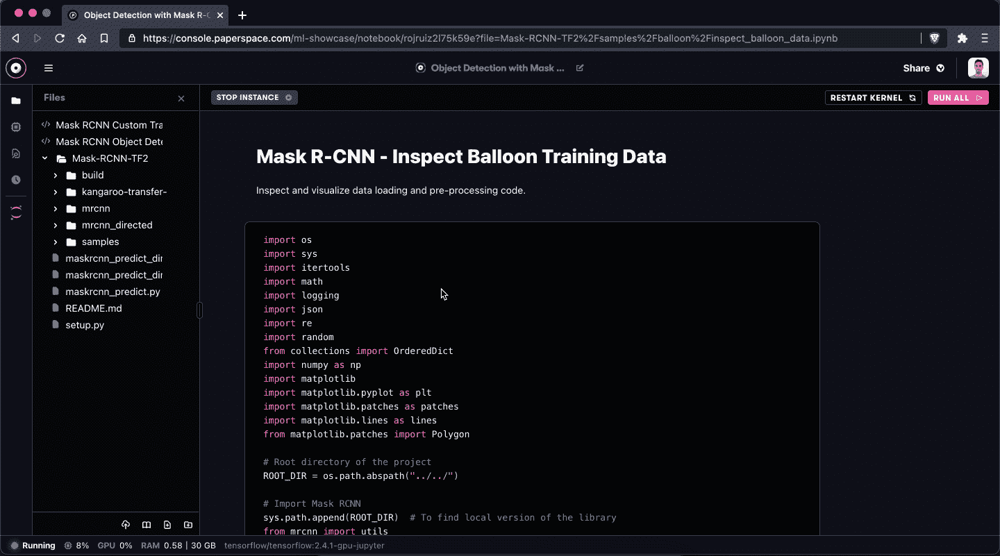
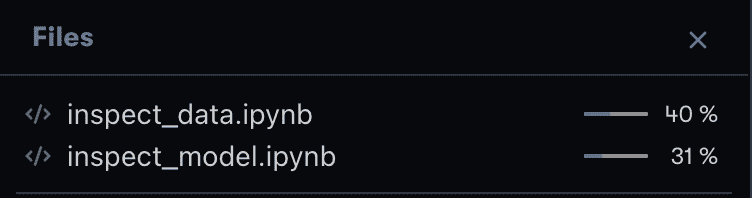
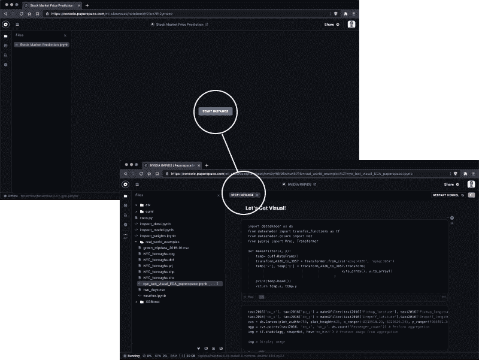
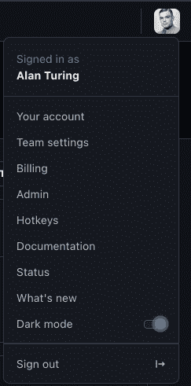

# 文件上传到达渐变笔记本

> 原文：<https://blog.paperspace.com/upload-files-paperspace-gradient-notebooks/>

我们很高兴为渐变笔记本 IDE 发布一个新的文件上传器。

自从我们在 2 月份发布了[全新的渐变笔记本 IDE](https://blog.paperspace.com/all-new-gpu-backed-notebooks-on-gradient/) 以来，我们一直专注于添加特性和功能，以改善笔记本电脑中的文件管理和资源管理用户体验。

在我们的[上一个版本](https://updates.paperspace.com/notebook-enhancements-29alzO)中，我们围绕文件和文件夹、GPU 利用率、笔记本预览和笔记本链接共享增加了许多生活质量改进。我们在最新版本中延续了这一主题。

新的文件上传程序可以轻松地将任何类型的文件上传到正在运行的笔记本电脑中。当文件上传到笔记本时，您还可以单独跟踪文件上传。

You can now track file upload progress in the file browser!

要访问文件上传程序，请在正在运行的笔记本的文件管理器侧边栏中查找`Upload File`按钮。

## 其他改进

你在定位打开你的实例的按钮时有什么困难吗？

根据大众的要求，我们为笔记本实例增加了更突出的**开始**和**停止**控件。我们从许多用户那里听到，我们需要使这些控件更加可见，所以我们现在在控制台中突出显示它们。

Start and Stop commands are now much more visible within the notebook interface.

使用笔记本电脑时，内存不足是一件不幸的事情，但它确实会发生。我们决心帮助您了解您的实例何时消耗了太多内存，以便您更好地了解笔记本电脑内核崩溃的时间和原因。

为此，我们增加了系统级指标来衡量 RAM 使用情况以及 CPU 和 GPU 使用情况，从而提高了笔记本电脑页脚的信息密度。

RAM usage is now conveyed in the notebook footer.

找到计费面板变得太难了，所以我们在控制台的用户菜单顶层添加了一个快捷方式。现在，您可以快速轻松地访问您的套餐、限额和发票！

Billing is now available in the top level of the user menu in the console.

接下来，我们将深入了解笔记本电脑的更多可用性改进。我们也非常兴奋地将完全终端访问引入笔记本 IDE——这有望为今天需要我们使用 JupyterLab 的许多活动带来惊人的加速，我们非常兴奋。

前进！

关于此版本的更多信息，请查看 [Paperspace 变更日志](https://updates.paperspace.com/file-upload-from-the-gradient-ide-1GQjfO)。