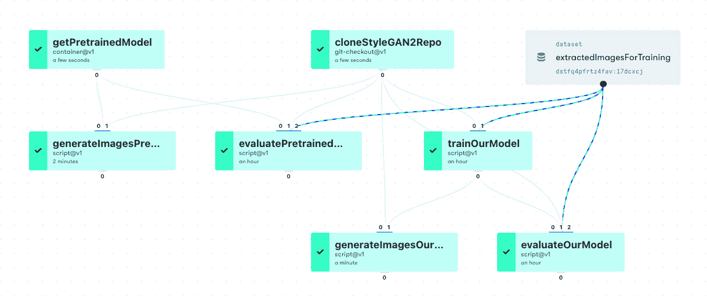

# 在生产中使用渐变工作流:更新我们的公共数据集

> 原文：<https://blog.paperspace.com/using-gradient-workflows-in-production-updating-our-public-datasets/>

Paperspace Gradient 由三个主要部分组成:笔记本、工作流和(即将)部署。虽然笔记本电脑主要是为探索性工作而设计的，但工作流是为更严格的方法而设计的，可直接用于生产。

在这里，我们通过使用工作流来更新我们的梯度公共数据集，展示了一个在生产中使用工作流的示例。

换句话说，我们足够信任我们的工作流程，可以在我们自己的产品上使用它们，你也可以！

**注意:**这篇博客是关于使用工作流来更新我们的数据集的。有关数据集本身和工作流的更多细节，请参见[这里](https://docs.paperspace.com/gradient/data/data-overview/private-datasets-repository/public-datasets-repository)和[这里](https://docs.paperspace.com/gradient/explore-train-deploy/workflows)。

### 什么是渐变公共数据集？

Gradient 旨在通过人工智能和机器学习(包括深度学习和 GPU)让人们快速轻松地启动和运行。虽然我们希望消除为人工智能提供硬件和软件环境的障碍，但我们也希望让访问您的数据变得更容易。

我们通过提供与在线数据源(如亚马逊 S3)的集成连接、为其他数据位置运行任意代码(如`curl`或`wget`)的能力以及我们的公共数据集来实现这一目标。深度学习和 GPU 通常需要大量数据才能发挥最佳性能，因此，通过方便地提供这些数据的示例，我们减少了用户的障碍，他们不想找到他们的数据或进行大量下载。

访问公共数据集的方式与访问其他渐变数据集的方式相同，方法是指向它们在代码中的位置并包含渐变命名空间，例如，我们的数据集`openslr`位于`gradient/openslr`。

我们策划的公共数据集集合中可用的数据集在我们的文档中有描述，并将在未来的博客条目中展示。

数据的收集在不断发展，但在撰写本文时，它们包括 StyleGAN，LSUN，Open SLR，Self Driving Demo，COCO，fast.ai，以及一些较小的数据，如 Tiny-imagenet-200，Sentiment140 和 MNIST。

在我们的[文档](https://docs.paperspace.com/gradient/data/data-overview/private-datasets-repository/public-datasets-repository)中查看关于我们公共数据集的详细信息。

### 什么是工作流？

作为一个端到端的机器学习和 MLOps 平台，工作流是 Gradient 从探索性数据科学转向生产的途径。

工作流包含在项目中，是您或您的团队运行笔记本和工作流、存储模型以及管理部署的工作空间。每个工作流都由一组按顺序运行的作业组成。作业可以以类似图形的方式相互关联，并且可以依次调用其他脚本，比如 Python `.py`。这使您可以创建一个 100%指定的、可移植的和可重复的处理步骤的管道。


Example Workflow in directed-acyclic-graph (DAG) representation in the Gradient graphical user interface

在这个例子中，从一个不同的项目到这个项目，`cloneStyleGAN2Repo`和`getPretrainedModel`任务输入到训练中，评估并生成任务。每个输入到另一个作业的作业都必须在后续作业开始之前完成，但是如果(在本例中)`cloneStyleGAN2Repo`成功，则`trainOurModel`和`evaluatePretrainedModel`等作业可以并行运行。

我们还可以查看包含数据集的相同工作流:



Same Workflow DAG with Gradient Dataset also shown

工作流本身是使用 [YAML](https://en.wikipedia.org/wiki/YAML) 指定的，它给出了生产系统所需的严格程度。一些用户可能不太熟悉 YAML，所以我们提供一些[帮助](https://docs.paperspace.com/gradient/explore-train-deploy/workflows/using-yaml-for-data-science)带你去你需要去的地方。

要运行工作流，您可以使用 Gradient CLI 运行 YAML，它将如上所示显示在 GUI 中。YAML 本身位于一个文件中，由指定在哪些计算资源上运行工作流、作业及其相互关系以及每个作业正在执行的操作种类的信息组成。

后一个步骤是通过使用渐变动作实现的。这些类似于 [GitHub 动作](https://github.com/features/actions)，但是渐变动作支持并行运行作业和使用大数据。这里有几个动作，但是对于我们的目的来说，最重要的是`script@v1`，它允许我们在一个任务中执行一组命令，就像在脚本中一样。

有关工作流程中渐变动作的更多详细信息，请访问文档的[工作流程部分。](https://docs.paperspace.com/gradient/explore-train-deploy/workflows/gradient-actions)

### 使用工作流更新我们的公共数据集

那么，为什么我们需要更新我们的公共数据集呢？以前，Gradient 支持笔记本和实验，而不是工作流。后者是为模型训练而设计的，现在已被否决，并已被工作流所取代。然而，之前的设置是通过指向 Gradient 托管存储上的公共`/datasets`目录来访问数据集的。因此，现在我们需要能够在工作流可以看到的梯度数据集名称空间中访问它们，如上面的`gradient/openslr`示例所示。

为什么不直接复制过来？嗯，原则上我们可以通过连接正确的文件系统来实现，但是使用工作流来更新它们有几个好处:

*   使用工作流可以确定我们的公共数据集的出处和可再现性
*   将来很容易重新运行和更新它们
*   可以通过添加新的工作流来添加新的公共数据集
*   工作流在项目中，项目可以链接到 GitHub 存储库，因此我们可以轻松地维护版本和辅助信息，如数据集许可
*   由于最终创建的数据集是我们产品的一部分，它展示了我们的工作流用于企业生产目的的示例

因此，为了更新公共数据集，我们运行如下所示的工作流:

```py
defaults:
  resources:
    instance-type: C7

jobs:
  downloadData:
    outputs:
      openslr:
        type: dataset
        with:
          ref: gradient/openslr
    uses: script@v1
    with:
      script: |-
        ...
        curl -o /outputs/openslr/original-mp3.tar.gz \
           'https://www.openslr.org/resources/12/original-mp3.tar.gz'
        ...
        cd /outputs/openslr
        ...
        md5sum original-mp3.tar.gz
        ...
        tar -zxf original-mp3.tar.gz
        ...
    image: ubuntu:18.04 
```

工作流是从原始源下载数据，并将其放入渐变公共数据集中，在本例中为`gradient/openslr`。每个工作流运行都会产生数据集的显式版本，其 ID 是可用的，但整个数据集可以通过名称来引用。

在显示的代码中可以看到关于我们工作流的几个细节:

*   要使用的计算资源由`resources`指定，这里是渐变云上的 C7 CPU 实例。GPU 实例，例如 P4000 或 V100，可以以同样的方式访问。
*   有一个作业`downloadData`，它列在工作流的主要部分`jobs`下。像`resources`这样的规范可以是特定于作业的，也可以是我们在这里使用的全局示例，这意味着你可以为需要它的作业指定一个 GPU。一个工作流可以包含几个作业。
*   作业输出，在本例中称为`openslr`，类型为`dataset`，其位置(`ref`)为`gradient/openslr`。Gradient 有几种类型的[输入和输出](https://docs.paperspace.com/gradient/explore-train-deploy/workflows/understanding-inputs-and-outputs)，可以通过类型或动作来指定，包括挂载卷、Git 库、机器学习模型和亚马逊 S3 桶。
*   渐变动作`script@v1`允许我们以脚本的形式发布任意命令，就像在终端上一样。它们在`script: |-`行之后给出。
*   这里的数据存放在 openslr.org 的一个网站上，所以我们用 curl 下载。如果连接不可靠，可以使用循环和-C 选项来恢复部分完成的下载。这对于大文件来说很方便(示例中的文件是 82g，我们目前最大的文件是 206)。
*   下载的数据放在`/outputs/openslr`目录中。当`/outputs`下的目录与`outputs:`下给出的名称相同时，目录的内容被放在作业输出中，在这种情况下是公共数据集。
*   因为任何代码都是允许的，所以我们可以执行与获取大型数据集相关的其他有用步骤，比如`md5sum`和文件提取，在本例中是`tar -zxf`。
*   `image: ubuntu:18.04`行告诉我们，我们正在 Docker 容器中运行工作流，在本例中，是 Ubuntu 18.04 映像。一般来说，像笔记本电脑一样，工作流在给定的 Docker 映像上运行，由 Kubernetes 编排，提供了一个方便(不需要许多安装和设置)、安全和可复制的环境。

一旦工作流运行完成，因为数据集`gradient/openslr`是公共的，它就可供我们的用户使用。

所示示例是针对`openslr`数据集的。一般来说，我们对每个公共数据集都有一个工作流，每个工作流都包含手头数据所需的确切步骤。这意味着每个数据集可以独立维护，并且数据的维护和出处可见。

真实数据有许多位置，需要不同的连接方法。在这里更新我们的公共数据集时遇到的一些例子包括亚马逊 S3(使用渐变`s3-download@v1`动作)、Google Drive(使用`gdown`实用程序)和学术种子(使用`at-get`工具)。同样，也看到了许多数据格式和压缩方法，包括 CSV 平面文件、LMDB 图像数据库、TFRecords 二进制文件以及`.zip`和`tar.gz`压缩。

容器与已安装软件的组合、处理大量数据和许多文件的能力，以及 Gradient 对工具和接口的灵活支持，使得为您需要做的事情构建一套合适的工具变得容易。

我们的公共数据集现已更新，[可用](https://docs.paperspace.com/gradient/data/data-overview/private-datasets-repository/public-datasets-repository)。因此，我们在生产中使用工作流来改进我们的企业业务产品！

### 摘要

我们展示了用于更新渐变公共数据集的渐变工作流，展示了一个在企业生产中使用的工作流示例。

使用工作流可以确定我们的公共数据集的出处和可再现性，并使该集合在未来易于维护和添加。

用户可以根据自己的需求运行类似的工作流，从使用作业实现更严格的方法到端到端数据科学，再到完整的企业生产系统。

### 后续步骤

有关更多详细信息，请参见关于[工作流](https://docs.paperspace.com/gradient/explore-train-deploy/workflows)和[梯度公共数据集](https://docs.paperspace.com/gradient/data/data-overview/private-datasets-repository/public-datasets-repository)的文档。

要开始使用渐变，包括笔记本、工作流、模型等等，请查看我们的[教程](https://docs.paperspace.com/gradient/get-started/tutorials-list)、 [ML Showcase](https://ml-showcase.paperspace.com/projects) 或 [GitHub 资源库](https://github.com/gradient-ai)。

感谢 Tom、Ben、Erika 和 Paperspace 的所有人让这个项目成为可能。

感谢您的阅读！