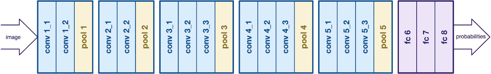
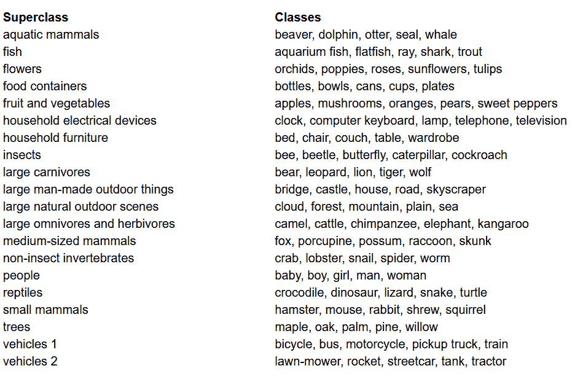
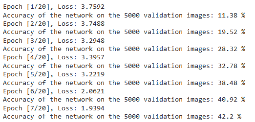

# 用 PyTorch 从零开始写 VGG

> 原文：<https://blog.paperspace.com/vgg-from-scratch-pytorch/>

继续我的关于构建经典卷积神经网络的系列，该网络在过去 10-20 年中彻底改变了计算机视觉领域，我们接下来将使用 PyTorch 从头开始构建 VGG，一个非常深入的卷积神经网络。你可以在我的个人资料上看到该系列之前的文章，主要是 [LeNet5](https://blog.paperspace.com/writing-lenet5-from-scratch-in-python/) 和 [AlexNet](https://blog.paperspace.com/alexnet-pytorch/) 。

和以前一样，我们将探究 VGG 背后的建筑和直觉，以及当时的结果。然后，我们将研究我们的数据集 CIFAR100，并使用内存高效的代码加载到我们的程序中。然后，我们将使用 PyTorch 从头开始实现 VGG16(数字是指层数，基本上有两个版本 VGG16 和 VGG19 ),然后在我们的数据集上训练它，并在我们的测试集上评估它，以查看它在看不见的数据上的表现

* * *

## VGG

基于 AlexNet 的工作，VGG 专注于卷积神经网络(CNN)的另一个重要方面，即 T2 深度。由 Simonyan 和 Zisserman 开发。它通常由 16 个卷积层组成，但也可以扩展到 19 层(因此有两个版本，VGG-16 和 VGG-19)。所有卷积层由 3×3 滤波器组成。你可以在官方报纸[这里](https://arxiv.org/pdf/1409.1556.pdf)阅读更多关于网络的信息



VGG16 architecture. [Source](https://medium.com/analytics-vidhya/cnns-architectures-lenet-alexnet-vgg-googlenet-resnet-and-more-666091488df5)

* * *

## 数据加载

### 资料组

在建立模型之前，任何机器学习项目中最重要的事情之一就是加载、分析和预处理数据集。在本文中，我们将使用 [CIFAR-100](https://www.cs.toronto.edu/%7Ekriz/cifar.html) 数据集。这个数据集就像 CIFAR-10，除了它有 100 个类，每个类包含 600 个图像。每个类有 500 个训练图像和 100 个测试图像。CIFAR-100 中的 100 个类被分成 20 个超类。每个图像都有一个“精细”标签(它所属的类)和一个“粗糙”标签(它所属的超类)。我们将在这里使用“优良”标签。以下是 CIFAR-100 中的类别列表:



Class List for the CIFAR-100 dataset

### 导入库

我们将主要与`torch`(用于建立模型和训练)`torchvision`(用于数据加载/处理，包含数据集和在计算机视觉中处理这些数据集的方法)，以及`numpy`(用于数学操作)。我们还将定义一个变量`device`，以便程序可以使用 GPU(如果可用的话)

```py
import numpy as np
import torch
import torch.nn as nn
from torchvision import datasets
from torchvision import transforms
from torch.utils.data.sampler import SubsetRandomSampler

# Device configuration
device = torch.device('cuda' if torch.cuda.is_available() else 'cpu') 
```

Importing the libraries

### 加载数据

`torchvision`是一个库，提供对大量计算机视觉数据集和方法的轻松访问，以简单直观的方式预处理这些数据集

*   我们定义了一个函数`data_loader`,它根据参数返回训练/验证数据或者测试数据
*   我们首先用数据集中每个通道(红色、绿色和蓝色)的平均值和标准偏差来定义变量`normalize`。这些可以手动计算，但也可以在线获得。这在`transform`变量中使用，我们调整数据的大小，将其转换成张量，然后归一化
*   如果`test`参数为真，我们简单地加载数据集的测试分割，并使用数据加载器返回它(下面解释)
*   如果`test`为假(也是默认行为)，我们加载数据集的训练分割，并将其随机分割为训练和验证集(0.9:0.1)
*   最后，我们利用数据加载器。对于像 CIFAR100 这样的小型数据集，这可能不会影响性能，但对于大型数据集，这确实会影响性能，通常被认为是一种良好的做法。数据加载器允许我们批量迭代数据，数据是在迭代时加载的，而不是一次全部加载到内存中

```py
def data_loader(data_dir,
                batch_size,
                random_seed=42,
                valid_size=0.1,
                shuffle=True,
                test=False):

    normalize = transforms.Normalize(
        mean=[0.4914, 0.4822, 0.4465],
        std=[0.2023, 0.1994, 0.2010],
    )

    # define transforms
    transform = transforms.Compose([
            transforms.Resize((227,227)),
            transforms.ToTensor(),
            normalize,
    ])

    if test:
        dataset = datasets.CIFAR100(
          root=data_dir, train=False,
          download=True, transform=transform,
        )

        data_loader = torch.utils.data.DataLoader(
            dataset, batch_size=batch_size, shuffle=shuffle
        )

        return data_loader

    # load the dataset
    train_dataset = datasets.CIFAR100(
        root=data_dir, train=True,
        download=True, transform=transform,
    )

    valid_dataset = datasets.CIFAR10(
        root=data_dir, train=True,
        download=True, transform=transform,
    )

    num_train = len(train_dataset)
    indices = list(range(num_train))
    split = int(np.floor(valid_size * num_train))

    if shuffle:
        np.random.seed(random_seed)
        np.random.shuffle(indices)

    train_idx, valid_idx = indices[split:], indices[:split]
    train_sampler = SubsetRandomSampler(train_idx)
    valid_sampler = SubsetRandomSampler(valid_idx)

    train_loader = torch.utils.data.DataLoader(
        train_dataset, batch_size=batch_size, sampler=train_sampler)

    valid_loader = torch.utils.data.DataLoader(
        valid_dataset, batch_size=batch_size, sampler=valid_sampler)

    return (train_loader, valid_loader)

# CIFAR100 dataset 
train_loader, valid_loader = data_loader(data_dir='./data',
                                         batch_size=64)

test_loader = data_loader(data_dir='./data',
                              batch_size=64,
                              test=True)
```

Loading the dataset

* * *

## VGG16 从零开始

为了从头开始构建模型，我们需要首先了解模型定义如何在`torch`中工作，以及我们将在这里使用的不同类型的层:

*   每个定制模型都需要从`nn.Module`类继承，因为它提供了一些帮助模型训练的基本功能。
*   其次，我们需要做两件主要的事情。首先，定义我们的模型在`__init__`函数中的不同层，以及这些层在`forward`函数中的输入上执行的顺序

现在让我们定义我们在这里使用的各种类型的层:

*   这些卷积层接受输入和输出通道的数量作为参数，以及过滤器的内核大小。如果您想应用任何步幅或填充，它也可以接受
*   `nn.BatchNorm2d`:对卷积层的输出进行批量归一化
*   `nn.ReLU`:这是应用于网络中各种输出的激活
*   `nn.MaxPool2d`:这将最大池应用于给定内核大小的输出
*   `nn.Dropout`:用于以给定的概率对输出进行丢弃
*   这基本上是一个完全连接的层
*   从技术上来说，这不是一种类型的层，但它有助于将同一步骤中的不同操作结合起来

利用这些知识，我们现在可以使用本文中的架构构建 VGG16 模型:

```py
class VGG16(nn.Module):
    def __init__(self, num_classes=10):
        super(VGG16, self).__init__()
        self.layer1 = nn.Sequential(
            nn.Conv2d(3, 64, kernel_size=3, stride=1, padding=1),
            nn.BatchNorm2d(64),
            nn.ReLU())
        self.layer2 = nn.Sequential(
            nn.Conv2d(64, 64, kernel_size=3, stride=1, padding=1),
            nn.BatchNorm2d(64),
            nn.ReLU(), 
            nn.MaxPool2d(kernel_size = 2, stride = 2))
        self.layer3 = nn.Sequential(
            nn.Conv2d(64, 128, kernel_size=3, stride=1, padding=1),
            nn.BatchNorm2d(128),
            nn.ReLU())
        self.layer4 = nn.Sequential(
            nn.Conv2d(128, 128, kernel_size=3, stride=1, padding=1),
            nn.BatchNorm2d(128),
            nn.ReLU(),
            nn.MaxPool2d(kernel_size = 2, stride = 2))
        self.layer5 = nn.Sequential(
            nn.Conv2d(128, 256, kernel_size=3, stride=1, padding=1),
            nn.BatchNorm2d(256),
            nn.ReLU())
        self.layer6 = nn.Sequential(
            nn.Conv2d(256, 256, kernel_size=3, stride=1, padding=1),
            nn.BatchNorm2d(256),
            nn.ReLU())
        self.layer7 = nn.Sequential(
            nn.Conv2d(256, 256, kernel_size=3, stride=1, padding=1),
            nn.BatchNorm2d(256),
            nn.ReLU(),
            nn.MaxPool2d(kernel_size = 2, stride = 2))
        self.layer8 = nn.Sequential(
            nn.Conv2d(256, 512, kernel_size=3, stride=1, padding=1),
            nn.BatchNorm2d(512),
            nn.ReLU())
        self.layer9 = nn.Sequential(
            nn.Conv2d(512, 512, kernel_size=3, stride=1, padding=1),
            nn.BatchNorm2d(512),
            nn.ReLU())
        self.layer10 = nn.Sequential(
            nn.Conv2d(512, 512, kernel_size=3, stride=1, padding=1),
            nn.BatchNorm2d(512),
            nn.ReLU(),
            nn.MaxPool2d(kernel_size = 2, stride = 2))
        self.layer11 = nn.Sequential(
            nn.Conv2d(512, 512, kernel_size=3, stride=1, padding=1),
            nn.BatchNorm2d(512),
            nn.ReLU())
        self.layer12 = nn.Sequential(
            nn.Conv2d(512, 512, kernel_size=3, stride=1, padding=1),
            nn.BatchNorm2d(512),
            nn.ReLU())
        self.layer13 = nn.Sequential(
            nn.Conv2d(512, 512, kernel_size=3, stride=1, padding=1),
            nn.BatchNorm2d(512),
            nn.ReLU(),
            nn.MaxPool2d(kernel_size = 2, stride = 2))
        self.fc = nn.Sequential(
            nn.Dropout(0.5),
            nn.Linear(7*7*512, 4096),
            nn.ReLU())
        self.fc1 = nn.Sequential(
            nn.Dropout(0.5),
            nn.Linear(4096, 4096),
            nn.ReLU())
        self.fc2= nn.Sequential(
            nn.Linear(4096, num_classes))

    def forward(self, x):
        out = self.layer1(x)
        out = self.layer2(out)
        out = self.layer3(out)
        out = self.layer4(out)
        out = self.layer5(out)
        out = self.layer6(out)
        out = self.layer7(out)
        out = self.layer8(out)
        out = self.layer9(out)
        out = self.layer10(out)
        out = self.layer11(out)
        out = self.layer12(out)
        out = self.layer13(out)
        out = out.reshape(out.size(0), -1)
        out = self.fc(out)
        out = self.fc1(out)
        out = self.fc2(out)
        return out
```

VGG16 from Scratch

* * *

## 超参数

任何机器或深度学习项目的重要部分之一是优化超参数。这里，我们不会用不同的值进行实验，但是我们必须事先定义它们。这些包括定义时期数、批量大小、学习率、损失函数以及优化器

```py
num_classes = 100
num_epochs = 20
batch_size = 16
learning_rate = 0.005

model = VGG16(num_classes).to(device)

# Loss and optimizer
criterion = nn.CrossEntropyLoss()
optimizer = torch.optim.SGD(model.parameters(), lr=learning_rate, weight_decay = 0.005, momentum = 0.9)  

# Train the model
total_step = len(train_loader)
```

Setting the hyper-parameters

* * *

## 培养

我们现在准备训练我们的模型。我们将首先看看如何在`torch`中训练我们的模型，然后看看代码:

*   对于每个时期，我们遍历我们的`train_loader`中的图像和标签，并将这些图像和标签移动到 GPU(如果有的话)。这是自动发生的
*   我们使用我们的模型来预测标签(`model(images)`)，然后使用我们的损失函数(`criterion(outputs, labels)`)来计算预测和真实标签之间的损失
*   然后，我们使用该损失反向传播(`loss.backward`)并更新权重(`optimizer.step()`)。但是一定要记住在每次更新之前将渐变设置为零。这是使用`optimizer.zero_grad()`完成的
*   此外，在每个时期结束时，我们也使用我们的验证集来计算模型的准确性。在这种情况下，我们不需要梯度，所以我们使用`with torch.no_grad()`进行快速评估

现在，我们将所有这些合并到下面的代码中:

```py
total_step = len(train_loader)

for epoch in range(num_epochs):
    for i, (images, labels) in enumerate(train_loader):  
        # Move tensors to the configured device
        images = images.to(device)
        labels = labels.to(device)

        # Forward pass
        outputs = model(images)
        loss = criterion(outputs, labels)

        # Backward and optimize
        optimizer.zero_grad()
        loss.backward()
        optimizer.step()

    print ('Epoch [{}/{}], Step [{}/{}], Loss: {:.4f}' 
                   .format(epoch+1, num_epochs, i+1, total_step, loss.item()))

    # Validation
    with torch.no_grad():
        correct = 0
        total = 0
        for images, labels in valid_loader:
            images = images.to(device)
            labels = labels.to(device)
            outputs = model(images)
            _, predicted = torch.max(outputs.data, 1)
            total += labels.size(0)
            correct += (predicted == labels).sum().item()
            del images, labels, outputs

        print('Accuracy of the network on the {} validation images: {} %'.format(5000, 100 * correct / total)) 
```

Training

我们可以看到上面代码的输出如下，它确实显示了模型实际上正在学习，因为损耗随着每个时期而减少:



Training Losses

* * *

## 测试

对于测试，我们使用与验证完全相同的代码，但是使用了`test_loader`:

```py
with torch.no_grad():
    correct = 0
    total = 0
    for images, labels in test_loader:
        images = images.to(device)
        labels = labels.to(device)
        outputs = model(images)
        _, predicted = torch.max(outputs.data, 1)
        total += labels.size(0)
        correct += (predicted == labels).sum().item()
        del images, labels, outputs

    print('Accuracy of the network on the {} test images: {} %'.format(10000, 100 * correct / total)) 
```

Testing

使用上述代码并训练 20 个时期的模型，我们能够在测试集上实现 75%的准确度。

* * *

## 结论

现在让我们总结一下我们在本文中所做的工作:

*   我们从理解 VGG-16 模型的架构和不同种类的层开始
*   接下来，我们使用`torchvision`加载并预处理了 CIFAR100 数据集
*   然后，我们使用`PyTorch`从头开始构建我们的 VGG-16 模型，同时理解`torch`中可用的不同类型的层
*   最后，我们在 CIFAR100 数据集上训练和测试了我们的模型，该模型在测试数据集上表现良好，准确率为 75%

* * *

## 未来的工作

通过这篇文章，你可以得到一个很好的介绍和实践学习，但是如果你扩展这篇文章，看看你还能做些什么，你会学到更多:

*   你可以尝试使用不同的数据集。一个这样的数据集是 CIFAR10 或 ImageNet 数据集的子集。
*   您可以试验不同的超参数，并查看它们在模型中的最佳组合
*   最后，您可以尝试在数据集中添加或移除图层，以查看它们对模型功能的影响。更好的是，尝试建立这个模型的 VGG-19 版本