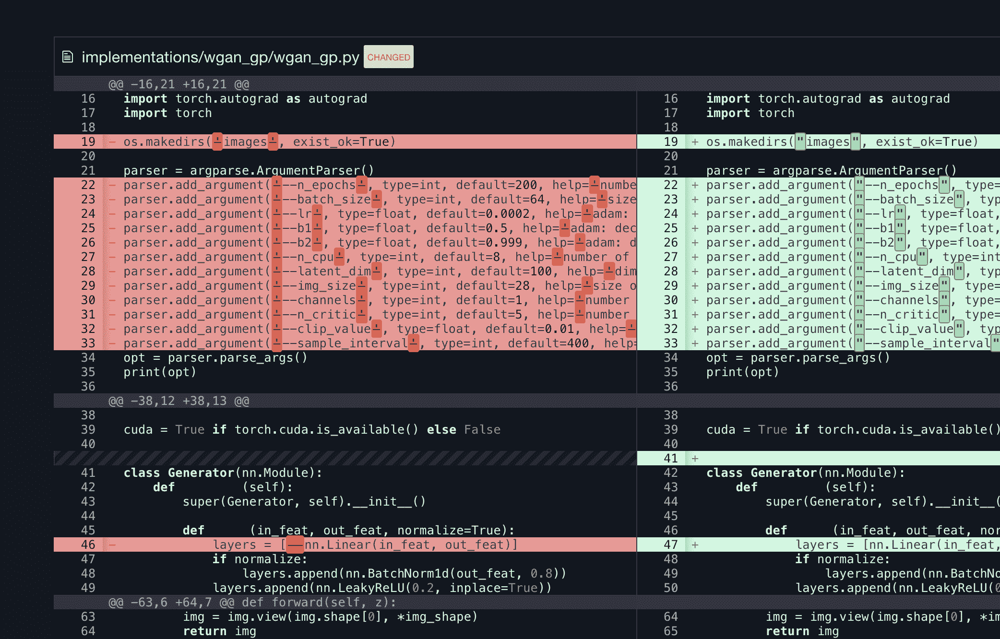

# 什么是 MLOps？

> 原文：<https://blog.paperspace.com/what-is-mlops/>

[2021 年 12 月 2 日更新:本文包含关于梯度实验的信息。实验现已被弃用，渐变工作流已经取代了它的功能。[请参见工作流程文档了解更多信息](https://docs.paperspace.com/gradient/explore-train-deploy/workflows)。]

机器学习领域可以说是世界上最先进的行业之一，然而，具有讽刺意味的是，它的运作方式让人想起了 90 年代的软件开发。

这里有几个例子:大量荒谬的工作发生在孤立的台式计算机上(甚至到今天)；几乎没有自动化(例如自动化测试)；协作一塌糊涂；管道与一系列自制的脆弱脚本一起被破解；当涉及到部署到开发、试运行和生产的模型时，可见性实际上是不存在的；CI/CD 是一个外来概念；许多组织甚至难以定义模型版本；对模型进行严格的健康和性能监控是极其罕见的，这样的例子不胜枚举。

听起来熟悉吗？整个行业似乎都停留在研发模式，需要一条清晰的成熟之路。

当我们开始构建 [Gradient](https://gradient.paperspace.com) 时，我们的愿景是将过去几十年的软件工程和 DevOps 最佳实践应用于机器学习行业。我们称这个**为机器学习的 CI/CD**。

作为一个主要由软件工程师组成的团队，这种类比似乎是不可避免的，甚至可能是显而易见的。然而，除了这里或那里的一些例外，行业还没有成熟到 ML 在实践中像软件开发一样有效和严格的程度。这是为什么呢？我们倾向于想当然地认为围绕软件行业的生态系统已经变得多么丰富。当软件团队部署每个版本时，他们依赖于许多工具，如 GitHub、CircleCI、Docker、几个自动化测试套件、健康和性能监控工具，如 NewRelic 等。相比之下，机器学习行业的可比工具少之又少。我们认为缺乏机器学习的最佳实践不是缺乏意愿的结果，而是缺乏可用的工具。

## 购买 vs 构建？

不仅许多公司没有能力自己开发一个完整的机器学习平台，而且世界上每家公司从头开始构建自己的平台也是极其低效的。即使是通常有空闲周期和构建内部工具的专业知识的超大规模人员，也可能不应该重新构建 GitHub。那将是多么浪费时间。公司应该专注于在内部构建他们擅长的东西，并产生某种竞争优势(知识产权或其他)。重建 GitHub 不会选中这两个框。构建机器学习平台也是如此。这就是为什么我们一直忙于构建 Gradient:我们可以一次解决问题，并立即向成千上万的组织提供新的能力，因此他们可以将 100%的资源集中在开发模型上，而不是开发工具。

## 引入 MLOps 的概念

机器学习操作(MLOps)是一组实践，在模型开发和部署管道中提供确定性、可伸缩性、敏捷性和治理。这种新范式专注于模型训练、调整和部署(推理)中的四个关键领域:机器学习必须是**可再现的**，必须是**协作的**，必须是**可扩展的**，必须是**连续的**。

### 可再生的

对于任何现代软件团队来说，查看一年前发布的单个组件(代码+依赖项)并在生产中重新部署那个确切的版本是微不足道的。相反，在今天缺乏工具的情况下，重建一年前的机器学习模型(精确度在几个百分点以内)的可能性通常几乎是不可能的。这需要具有覆盖所有输入的可追溯性:所使用的数据集、机器学习框架的版本、代码提交、依赖性/包、驱动程序版本和低级库(如 CUDA 和 cuDNN)、容器或运行时、用于训练模型的参数、训练模型的设备以及一些特定的机器学习输入，如层权重的初始化。

The code diffing tool in a Gradient Experiment run

无论是出于监管目的，还是您的组织仅仅重视记录其开发的内容并提供给客户和内部利益相关方，再现性都是至关重要的。通往可再生机器学习的道路可以被认为是从特定方法向更确定的工作方式的哲学转变。

### 合作的

从事 python 项目并在孤立的工作站(甚至是 AWS 实例)上生成模型是一种反模式。如果你是一个人的 ML 团队，你可以摆脱这一点，但是当你将一个模型投入生产或者有几个贡献者试图一起工作时，这个策略很快就失败了。随着模型数量和复杂性的增加，协作环境的缺乏变得尤其成问题。

从战术上来说，协作始于拥有一个统一的中心，在这里可以跟踪所有的活动、沿袭和模型性能。这包括训练运行、Jupyter 笔记本、超参数搜索、可视化、统计指标、数据集、代码引用和模型工件的存储库(通常称为*模型存储库*)。对团队成员、审计日志和标签的细粒度权限进行分层也很重要。

最终，组织范围的可见性和实时协作对于现代 ML 团队来说是必不可少的，就像它们对于软件团队一样。这种方法应该跨越模型生命周期的每个阶段，从概念和研发到测试和 QA，一直到生产。

### 可攀登的

这一条有点罗嗦，但概念很简单:与软件工程相反，实践中的机器学习需要大量(有时是海量)的计算能力(和存储)，并且通常需要像专用硅这样的深奥的基础设施(例如 GPU、TPU 和进入市场的无数其他芯片)。机器学习工程师需要一个*基础设施抽象*层，它可以轻松调度和扩展工作负载，而不需要多年的网络、Kubernetes、Docker、存储系统等方面的经验。这些都是主要的干扰。

基础设施自动化价值的一些示例:

*   **多云:**机器学习平台应该使内部训练模型变得简单，并将该模型无缝部署到公共云(反之亦然)。
*   **扩展工作负载:**随着计算需求的增加，培训或调整跨多个计算实例的模型变得至关重要。通过 MPI 或 gRPC 消息总线将共享存储卷连接到运行在异构硬件上的分布式容器群，这不是您希望机器学习工程师花费时间去做的事情。

最终，当 ML 团队可以完全自主地操作并拥有整个堆栈时，他们会更加高效和敏捷。数据科学家需要访问按需计算和存储资源，以便他们可以在训练、调整和推理阶段更快地迭代。借助 MLOps，整个流程不受基础架构限制，可扩展，并最大限度地降低了数据科学家的复杂性。

### 连续的

对于一个生活在自动化前沿的行业(例如聊天机器人到自动驾驶汽车)，ML 模型的生产几乎没有自动化。

许多年前，软件开发行业围绕着一个称为 CI/CD 的过程进行整合，在这个过程中，由工程师进行的代码合并触发了一系列自动化步骤。在基本管道中，应用程序被自动编译、测试和部署。部署后，通常需要对部署的应用程序进行自动运行状况和性能监控。诸如此类的概念对于应用程序的可靠性和开发速度至关重要。不幸的是，在机器学习行业中，许多这些概念都没有对等物。这导致了巨大的效率低下，因为高薪数据科学家花费大量时间处理重复性和乏味的任务，这些任务是在容易出错的过程中手动执行的。查看我们在 [CI/CD 上关于机器学习](https://blog.paperspace.com/ci-cd-for-machine-learning-ai/)的帖子，了解更多关于这在实践中是什么样子的。

## 包扎

最终，从概念到生产并交付商业价值所需的时间是该行业的一个主要障碍。这就是为什么我们需要优秀的 MLOps 来标准化和简化生产中 ML 的生命周期。

DevOps 作为一种实践确保了软件开发和 IT 运营生命周期是高效的、有良好文档记录的、可伸缩的，并且易于故障排除。MLOps 整合了这些实践，以高速交付机器学习应用和服务。