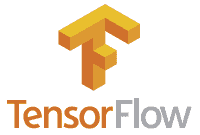
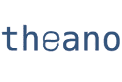
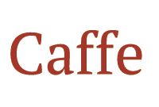
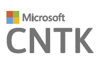
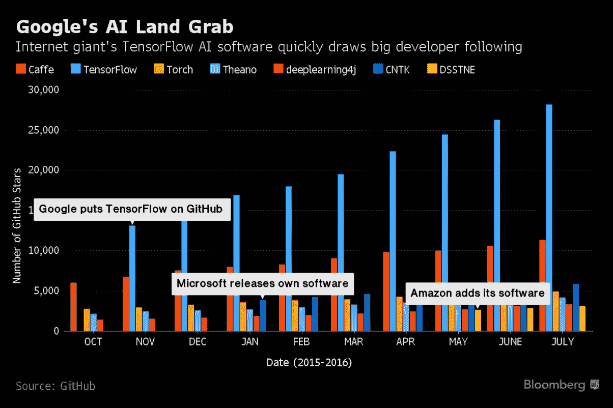

# 机器学习框架比较

> 原文：<https://blog.paperspace.com/which-ml-framework-should-i-use/>

我们需要你的帮助！

我们正在寻找专注于机器学习的内容作家、爱好者和研究人员，以帮助建立我们的社区。给 hello@paperspace.com 发电子邮件，附上写作范例和教学想法

When taking the deep-dive into Machine Learning (ML), choosing a framework can be daunting. You've probably heard the many names/acronyms that make-up the constellation of frameworks, toolkits, libraries, data sets, applications etc. but may be curious about how they differ, where they fall short and which ones are worth investing in. Since the field and surrounding technologies are relatively new, the most common concern amongst new users is understanding which of these frameworks has the most momentum. This article summarizes their major differences and attempts to contextualize them within a broader landscape.

TensorFlow 由谷歌大脑团队开发，用于进行机器学习和深度神经网络的研究。谷歌最近从 Torch 转移到 TensorFlow，这对其他框架是一个打击——特别是 Torch 和 Theano。许多人将 TensorFlow 描述为更现代版本的 Theano，因为多年来我们已经学到了许多关于这一新领域/技术的重要经验。

TensorFlow 的设置相对容易，并为初学者提供教程，涵盖了神经网络的理论基础和实际应用。TensorFlow 比 Theano 和 Torch 慢，但这一问题目前正由谷歌和开源社区正面解决。 [**TensorBoard**](https://www.tensorflow.org/versions/master/how_tos/summaries_and_tensorboard/index.html) 是 TensorFlow 的可视化模块，为您的计算管道提供直观的视图。[深度学习库 Keras](http://keras.io/) 最近被移植到 TensorFlow 上运行，这意味着用 Keras 编写的任何模型现在都可以在 TensorFlow 上运行。最后，值得一提的是，TensorFlow 可以在多种硬件上运行。

*   GPU 加速:是
*   语言/接口:Python、Numpy、C++
*   平台:跨平台
*   维护者:[谷歌](https://www.tensorflow.org/)

* * *

Theano 起源于 2007 年蒙特利尔大学在著名的学习算法研究所。Theano 功能强大，速度极快，非常灵活，但通常被认为是一个低级框架(例如，错误消息特别神秘/无用)。因此，raw Theano 更像是一个研究平台和生态系统，而不是一个深度学习图书馆。它经常被用作高级抽象库的底层平台，这些抽象库提供了简单的 API 包装器。一些更受欢迎的图书馆包括 [Keras](http://keras.io/) 、[千层面](https://github.com/Lasagne/Lasagne)和[街区](https://github.com/mila-udem/blocks)。ano 的一个缺点是多 GPU 支持仍然需要一个解决方案。

*   GPU 加速:是
*   语言/接口:Python、Numpy
*   平台:Linux、Mac OS X 和 Windows
*   维护者:[蒙特利尔大学 MILA 实验室](http://deeplearning.net/software/theano/)

* * *

在所有常见的框架中，Torch 可能是最容易上手和运行的，尤其是当你使用 Ubuntu 的时候。Torch 最初于 2002 年在 NYU 开发，被脸书和 Twitter 等大型科技公司广泛使用，也得到了 NVIDIA 的支持。Torch 是用一种叫做 [Lua](http://www.lua.org/about.html) 的脚本语言编写的，这种语言很容易阅读，但不像 Python 这样的语言那样常见。有用的错误消息、大量的示例代码/教程以及 Lua 的简单性使得 Torch 成为一个很好的起点。

*   GPU 加速:是
*   语言/界面:Lua
*   平台:Linux、Android、Mac OS X、iOS 和 Windows
*   维护者:[罗南、克莱门特、科雷和索史密斯](http://torch.ch/)

* * *

Caffe 是利用**卷积神经网络**(CNN)为图像分类/机器视觉开发的。Caffe 最出名的可能是[模型动物园](http://tutorial.caffe.berkeleyvision.org/model_zoo.html)，一套预先训练好的模型，你不用写任何代码就可以使用。

Caffe 的目标是那些建筑应用，而 Torch 和 Theano 是为研究量身定制的。Caffe 不适合文本、声音或时间序列数据等非计算机视觉深度学习应用。Caffe 可以在各种硬件上运行，在 CPU 和 GPU 之间的切换是通过一个标志来设置的。Caffe 比 Theano 和 Torch 慢。

*   GPU 加速:是
*   语言/界面:C、C++、Python、MATLAB、CLI
*   平台:Ubuntu，Mac OS X，实验性 Windows 支持
*   维护者: [BVLC](http://caffe.berkeleyvision.org/)

* * *

微软认知工具包(Cognitive Toolkit)，又称 CNTK，是微软开源的深度学习框架。尽管 CNTK 也可以用于图像和文本训练，但在语音社区中比在一般的深度学习社区中更为人所知。CNTK 支持多种算法，如前馈、CNN、RNN、LSTM 和序列到序列。它运行在许多不同的硬件类型上，包括多个 GPU。

*   GPU 加速:是
*   语言/界面:Python、C++、C#和 CLI
*   平台:Windows、Linux
*   维护者:[微软研究院](https://www.microsoft.com/en-us/research/product/cognitive-toolkit/)

* * *

## 其他框架

还有其他几个深度学习框架，包括 [MXnet](https://github.com/dmlc/mxnet) 、 [Chainer](http://chainer.org/) 、 [BidMach](https://github.com/BIDData/BIDMach) 、 [Brainstorm](https://github.com/IDSIA/brainstorm) 、 [Kaldi](https://github.com/kaldi-asr/kaldi) 、 [MatConvNet](http://www.vlfeat.org/matconvnet/) 、 [MaxDNN](https://github.com/eBay/maxDNN) 、 [Deeplearning4j](http://deeplearning4j.org/) 、 [Keras](http://keras.io/) 、[千层面](https://github.com/Lasagne/Lasagne)、 [Leaf](https://github.com/autumnai/leaf)

GitHub 活动对比:
