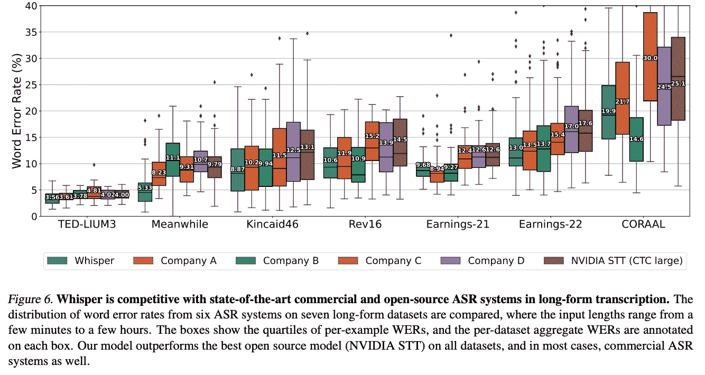
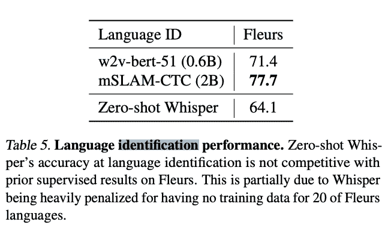
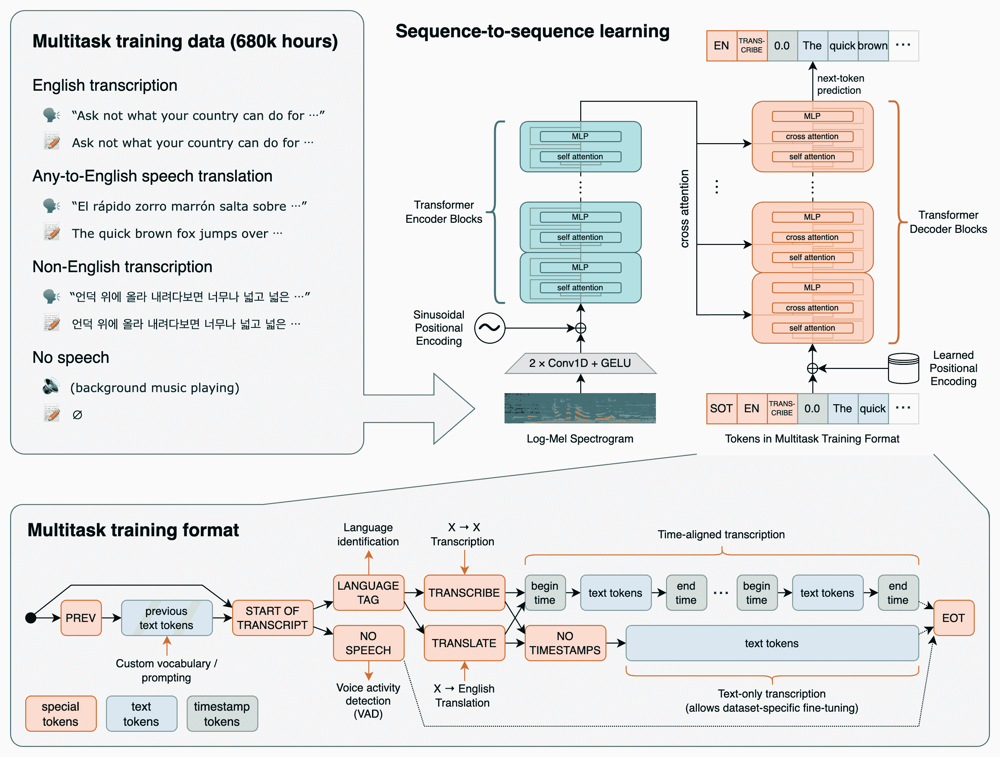
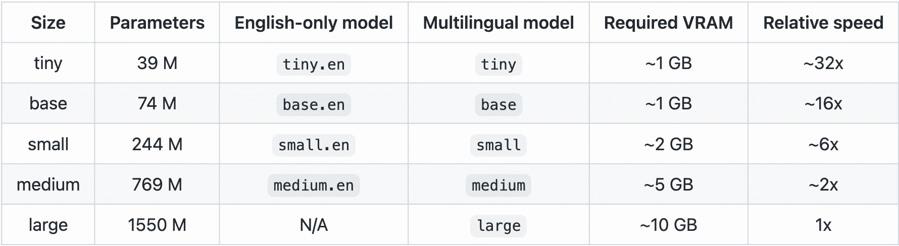
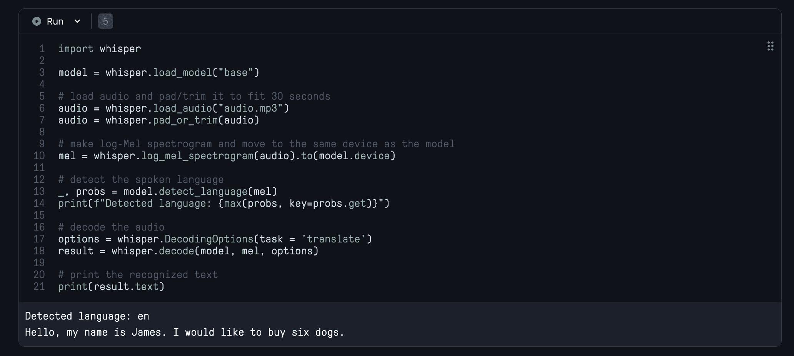
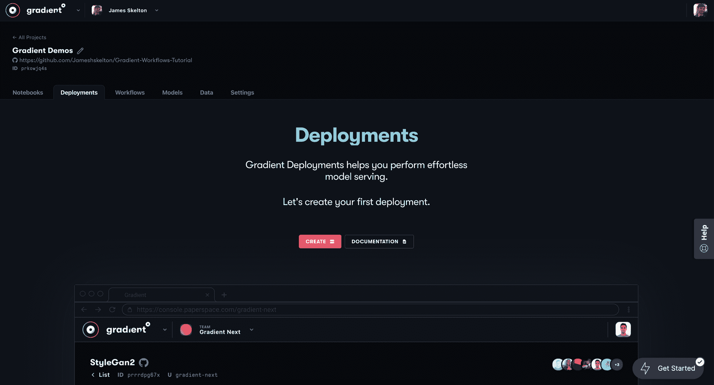
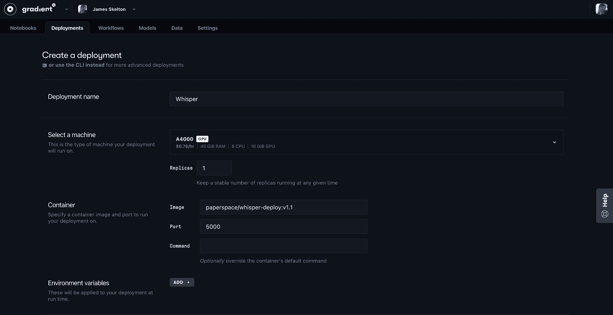
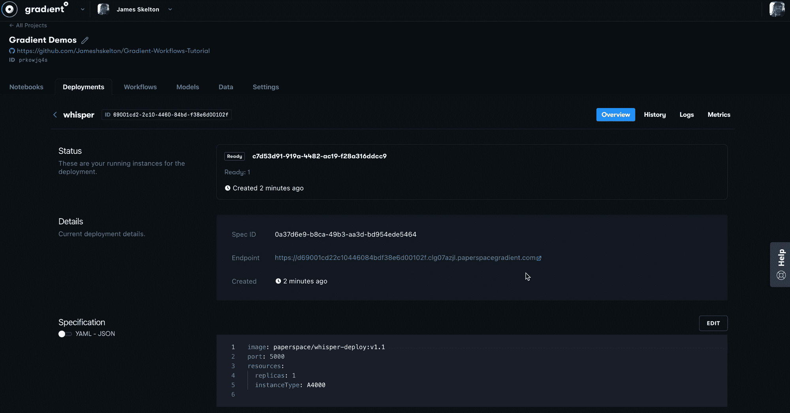

# 使用 OpenAI 和 Flask 中的 Whisper 创建您自己的语音转文本应用程序

> 原文：<https://blog.paperspace.com/whisper-openai-flask-application-deployment/>

语音转文本已经迅速成为我们日常生活中深度学习技术的一个更突出的用例。从自动呼叫系统到语音助手，再到简单的搜索引擎集成，这种功能可以大大改善用户体验。这种增加的多功能性已经成为这些技术中的一部分，并且是使用它们的体验的同义词。

多年来，这种技术很大程度上是专有的，这是有充分理由的。这是一场创造最佳 NLP 模型的竞赛，军备竞赛仍在继续。语音转文本的例子包括流行的谷歌翻译 API 和 AWS 转录。其他的内置在流行的应用程序中，比如苹果的 Siri。

为了满足这些工具，来自 Open AI 的快速普及的 [Whisper](https://github.com/openai/whisper) 应运而生，它向用户免费提供与生产级模型相当的功效，并有大量预先训练的模型可供利用。在本教程中，我们将详细了解 Whisper 的功能和架构。然后，我们将进入一个编码演示，展示如何在渐变笔记本中运行强大的语音到文本模型，最后，我们将在一个简单的 Flask 应用程序中使用渐变部署来设置相同的设置，从而结束我们的教程。

# 低语

Whisper 接受了 680，000 小时的多语言和多任务监督数据训练，这些数据是从网络上收集的。他们发现，他们的数据集选择和训练为模型提供了强大的力量，以处理口音和背景噪音等可能干扰推断的特性。在这一节中，我们将详细探讨这种训练给我们的模型带来的优势，以及该模型如何根据这些数据进行训练。

你可以在[原文中阅读更多关于 Whisper 的深度信息。](https://cdn.openai.com/papers/whisper.pdf)

## 能力

Whisper 的功能本质上可以归结为 3 个主要的关键功能:语音到文本的转录、语言识别和一种语言到另一种语言的翻译。

### 抄本



[[Source](https://cdn.openai.com/papers/whisper.pdf)]

转录是理解并记下音频片段中感知到的话语的能力。从上面的图中可以看出，Whisper 的性能与 5 家未命名公司的专有音频语音识别(ASR)系统相当。这种性能来自于观察到他们可以通过连续转录 30 秒长的整体片段来有效地执行长音频序列的缓冲转录，并通过根据模型预测的时间戳移动窗口来排序。他们发现，通过基于模型预测的重复性和对数概率的波束搜索和温度调度，他们能够准确可靠地转录长音频序列。

在实践中，该模型能够准确有效地将任何长度的文本从音频转录为字符串格式。

### 语言识别



研究小组通过微调 VoxLingua107 数据集上的原型模型来集成他们的模型，从而创建了一个音频语言检测器。这样做是为了确保音频样本中大声朗读的语言与输出抄本的语言相匹配。使用的 [CLD2](https://github.com/CLD2Owners/cld2) 模型的版本没有达到竞争识别模型的标准，但作者将此归因于缺乏用于相关测试的训练数据。测试中使用的 20 种语言没有训练数据，所以这是一个合乎逻辑的结论。

### 翻译

翻译和转录的能力可能是 Whisper 最有趣的功能之一。这种技术在现代世界的应用是无穷无尽的，尤其是在我们进一步全球化的时候。也就是说，Whisper 并不能翻译所有语言的例子。

下图显示了使用`large`模型的 [Fleurs](https://huggingface.co/datasets/google/fleurs) 数据集语言的 WER(单词错误率)细分，该模型是其预训练样本模型中性能最好的。这衡量了在所有翻译中有多少预测的单词是不正确的，并让我们很好地了解了该模型在各种任务中的表现。与其他模型和数据集相对应的更多 WER 和 BLEU 分数可在论文的[附录 D 中找到。](https://cdn.openai.com/papers/whisper.pdf)


正如我们所看到的，Fleurs 语言数据集的能力有很大的差异。该模型在最接近英语的语言上表现最佳，包括罗曼语和日耳曼语。这是显而易见的，因为这些语系和英语有许多共同的词汇和特征。最高的 WER 来自信德、肖纳和阿姆哈拉语，代表了更杰出的印度雅利安、班图和闪米特语系。鉴于这些语言和英语在口语观察上的显著差异，这也是合乎逻辑的。

这表明，虽然 Whisper 是一个强大的工具，但它并不代表一个通用的翻译器。像任何深度学习框架一样，它需要在训练期间接触来自主题数据源的示例，以真正实现预期的功能。

### 体系结构



Source https://github.com/openai/whisper

Whisper 模型的核心是基于经典的编码器-解码器转换器模型。它接收音频-文本数据对来学习预测输入音频样本的文本输出。在训练之前，音频数据全部被重新采样到 16，000 Hz。在训练期间，首先，该模型使用 25 毫秒的窗口和 10 毫秒的步长，生成音频数据的 80 通道对数幅度 Mel 谱图表示。

然后，数据被全局缩放到-1 和 1 之间，整个预训练数据集的平均值约为零。编码器使用由滤波器宽度为 3 的两个卷积层和 GELU 激活函数组成的小词干处理该输入表示，其中第二个卷积层的步幅为 2。正弦位置嵌入然后被添加到 stem 的输出。最后，将变换器预激活残余块应用于变换后的数据，并将最终层归一化应用于编码器输出。然后，解码器反转该过程，以使用学习到的位置嵌入和绑定的输入-输出令牌表示来将编码的单词重新创建为文本。

这种流水线是这样设计的，以便除了转录之外的任务可以附加到这个过程，但是某种形式的任务规范是控制它所必需的。他们设计了一种简单的格式，将所有任务和条件信息指定为解码器的输入标记序列。这些专用的标记，包括一个用于检测到的语言和手边的任务的标记，指导解码器生成输出的目的。这使得该模型相当巧妙的能够处理各种各样的 NLP 任务，而几乎不改变其架构。

# 民众

在使用 Whisper 时，我们很幸运能够使用 9 个预训练模型来进行我们自己的推断，不需要额外的培训。



这些型号在性能上差异很大，因此请确保根据您的使用案例和 GPU 能力来选择型号。您可以预期参数的数量越多，您的模型推断就越通用和有能力。此外，带有`.en`后缀的型号在所有英语任务上的表现都更好。

现在让我们看看如何在我们的两个渐变工具中使用这些不同的模型:笔记本和部署。

## 笔记本

由于 Open AI 提供的简洁和编写良好的管道，在渐变笔记本中运行 Whisper 很容易。遵循这个指南，你将能够在很短的时间内翻译和转录多种语言的语音样本。

首先，让我们用一些安装来设置工作区。

```py
## Install whisper package
pip install git+https://github.com/openai/whisper.git 
## Should already be up to date
apt update && apt install ffmpeg
```

一旦完成，运行推理代码就简单了。让我们浏览一下 Github 项目提供的示例推理代码，看看如何才能最好地将 Whisper 与 Python 结合使用。

```py
import whisper

model = whisper.load_model("base")
```

首先，我们导入 whisper 包并加载到我们的模型中。使用表 1 中指定的标签，您可以更改我们在调用`whisper.load_model()`时使用的模型类型。我们建议在轻量级应用中使用`tiny`型号，如果精确度非常重要，则使用`large`型号，如果不确定，则使用`base`型号。

```py
# load audio and pad/trim it to fit 30 seconds
audio = whisper.load_audio("audio.mp3")
audio = whisper.pad_or_trim(audio)
```

接下来，我们使用`whisper.load_audio()`载入音频数据。然后，我们使用 pad_or_trim()方法来确保样本具有正确的推断形式。

```py
# make log-Mel spectrogram and move to the same device as the model
mel = whisper.log_mel_spectrogram(audio).to(model.device)
```

然后，我们使用我们的音频数据来生成音频的 log-Mel 声谱图。这将作为我们对编码器模块的输入。一旦生成，我们就把它从 CPU 移到 GPU，所以它和模型在同一个设备上。

```py
# detect the spoken language
_, probs = model.detect_language(mel)
print(f"Detected language: {max(probs, key=probs.get)}")
```

然后，我们使用内置的`detect_language()`方法来检测语音的输入语言。在运行转录/翻译以及 WER 速率图之前，我们可以使用这些信息来推断我们的模型将做得有多好。这在尝试转录特别长的音频片段之前运行会很有用。

```py
# decode the audio
options = whisper.DecodingOptions()
result = whisper.decode(model, mel, options)

# print the recognized text
print(result.text)
```

最后，我们使用`whisper.DecodingOptions()`声明解码语音的任务和参数。在这里，我们可以声明我们希望使用模型进行翻译或转录，并另外输入任何其他数量的采样选项。然后，我们将模型、mel 和选项输入到`whisper.decode()`方法，该方法将语音转录(或者翻译然后转录)成文本字符串。这些然后以 3 种格式保存为。txt，。VTT 还有。SRT 档案。



总之，这些代码可以在一个单元格中运行，如上图所示。

## 部署

我们已经创建了一个`small`预训练模型的示例部署，供您使用，并基于它开发您自己的应用程序。这个支架本身改编自一个类似的面部修复模型 [GFPGAN](https://github.com/gradient-ai/GFPGAN) 的应用程序。在本节中，我们将演练使用梯度部署启动该应用程序的两种方法:梯度 CLI 和部署 GUI。我们建议使用后者，您很快就会明白为什么。

有关从头开始创建自己的渐变部署的更多信息，请务必阅读[教程，了解我们如何制作这个用于启动具有渐变部署的深度学习 Flask 应用程序的脚手架。](https://blog.paperspace.com/deployment-gan-to-flask/)

### 渐变客户端

当使用 Gradient CLI 时，我们需要首先采取一些步骤来设置我们的本地环境。具体来说，我们需要安装这个包，如果还没有安装的话，并把我们个人的 API 密匙附加到安装中。

为此，请在您的浏览器上登录您的 Gradient 帐户，将鼠标导航到右上角的下拉菜单，然后选择“团队设置”。然后，打开“API 密钥”选项卡，并创建一个 API 密钥。保存此 API 键以备后用，并导航回渐变控制台。在那里，为您选择的团队中的部署选择或创建一个项目空间。将项目 ID 保存在保存 API 密钥的相同位置。

然后，我们将通过在本地计算机的终端中输入以下内容来登录我们的帐户:

```py
pip install gradient
gradient apikey <your api key here>
```

完成后，我们需要将 YAML 规范加载到计算机上，并运行命令来启动部署。我们可以这样做，首先克隆`gradient-ai/whisper`分支，并导航到那个目录。

```py
git clone https://github.com/gradient-ai/whisper
cd whisper
```

最后，我们可以在 YAML 文件的指导下创建并运行部署。

```py
gradient deployments create --projectId <your project id of choice>  --name <name of deployment> --spec spec.yaml 
```

这将创建一个 API 端点，您可以通过 web 浏览器访问它。

### 梯度部署 GUI

启动演示部署的下一种方法是推荐的方法:使用部署 GUI。



要开始，请登录您的帐户并打开您选择的项目。然后，用鼠标导航到“部署”选项卡。进入后，点击“创建”进入部署创建页面。



一旦进入创建页面，我们就可以使用与使用 Gradient CLI 时从 spec.yaml 文件输入的数据相同的数据。首先，我们指定部署的名称，在本例中为“Whisper”

接下来，向下滚动到“选择一台机器”,然后选择您喜欢的 GPU 机器。这应该很容易在我们的任何 GPU 上运行，因为它们每个都提供 8+ GB 的 VRAM，但也有按需扩展的选项。如果您打算将应用程序的当前模型更改为`Large`版本，这可能是需要考虑的事情。

最后，导航到“容器”部分，在“图像”框中填入`paperspace/whisper-deploy:v1.1`，在“端口”框中填入`5000`。这个图像预先打包了运行模型所需的各种包，以及为`small`模型本身预先训练的模型权重。



Click the URL after the 'Endpoint' section to view your application's deployment.

填写完所有内容后，您可以使用页面底部的按钮启动您的部署。大约一分钟后，部署应该完成构建，然后您可以选择 API 端点来打开您的部署。

## 使用部署应用程序

<https://blog.paperspace.com/content/media/2022/10/upload.mp4>


一旦您的模型部署正在运行，您可以通过在 GUI 的“详细信息”部分中单击“端点”字段后面的链接来访问它。或者，当部署构建完成后使用 CLI 时，这也将在终端中自动打印出来。

一旦你打开链接，你将会看到一个简单的上传音频文件的界面。当你选择文件，并点击应用程序中的“上传”，该模型将开始转录你的文本。当模型预测完成时，应用程序将在输出页面中将文本输出为 HTML。

## 改变部署

在这个阶段，改变这种部署会很复杂，但是这个框架的未来版本旨在使其更加灵活。尽管如此，我们还是邀请读者尽可能多地尝试这个应用程序。这个脚手架是设计用来扩充和改进的。

目前要开始，可能需要分叉 Whisper Github repo 的 [Gradient-AI fork](https://github.com/gradient-ai/whisper) 。然后，切换到该目录并执行以下步骤:

1.  将 docker 文件的第 17 行和第 20 行编辑为您的新 fork 的 URL 和您想要使用的模型类型(模型的 URL 可以在`whisper/__init__.py`中找到)
2.  编辑`whisper/transcribe.py`的第 313 行，以包含新模型运行的参数。如果您愿意，这将允许您添加`--task translation`标签，并将型号从`small`更改为您的新型号类型。
3.  在“app.py”中根据需要对应用程序 HTML 进行其他更改
4.  用这个新目录构建一个新的 Docker 映像，并推送到 Dockerhub
5.  使用新容器启动您的部署

# 结束语

在本教程中，我们浏览了 Open AI 的 Whisper 的模型功能和架构，然后展示了两种方法，用户可以通过我们的渐变笔记本和部署演示在几分钟内充分利用模型。

Whisper 是一个令人难以置信的模型，并且是一个非常棒的测试应用程序。底层技术极具创新性，这使得它能够通过一个极其轻量级而又健壮的模型进行准确的转录和翻译。请务必浏览原始的[论文](https://cdn.openai.com/papers/whisper.pdf)和 [Github 项目页面](https://github.com/openai/whisper)，以获取关于创建这个令人敬畏的模型的研究的更多信息。