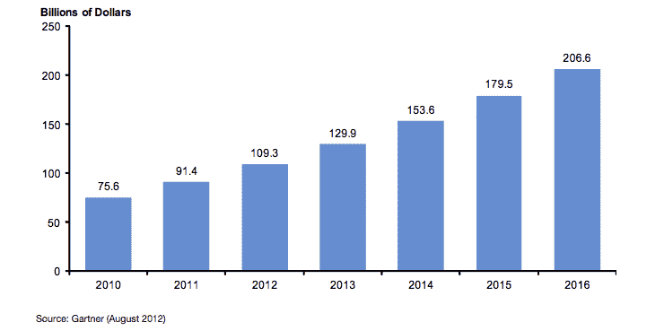

# 为什么您不能在公共云中托管您的 VDI

> 原文：<https://blog.paperspace.com/why-you-cant-host-your-vdi-in-the-public-cloud/>

似乎每天你都会读到另一家公司关闭其数据中心并[转向 AWS](http://www.theplatform.net/2015/10/08/infrastructure-pioneer-predicts-datacenter-days-are-numbered/) 。网飞的运营工程总监乔希·埃文斯最近[讨论了](http://www.techradar.com/us/news/television/how-netflix-works-400-billion-interactions-per-day-ain-t-easy-1306420)如何“从运营的角度来看，网飞的一切都依赖于 AWS……”

公司愿意支付巨额溢价来获得 AWS 等大型公共云提供商的产品范围、全球可用性和似乎永无止境的规模。从公司的角度来看，这消除了花费宝贵的工程时间在世界各地建设和管理数据中心的需要，即使这意味着在硬件本身上支付巨大的溢价。事实上，Paperspace 的大部分网络服务都是在 AWS 上运行的——像我们这样的公司承担这样的风险、工程工作和资本支出是没有意义的。

**公共云的增长:**



AWS 是托管数据库和 web 服务的绝佳平台，但以下是您无法在 AWS 上运行 VDI 的原因:

在公共云中托管您的 VDI 将比购买传统计算机花费*10 倍*。就财务可行性而言，公共云似乎是托管服务器基础设施的明显未来...事情是这样的:对于一个公司来说，构建自己的弹性豆茎、S3、数据库服务等可能没有意义。，但支付 10 倍的溢价只是为了利用公共云的优势？不会吧。外包桌面和外包 web 服务的经济性是不一样的，这就是将您的 VDI 部署迁移到公共云的概念不成立的地方。由于这个原因，VDI 停留在“内部”世界，而几乎所有其他企业技术都在向公共云迁移。

这是我们着手解决的 VDI 的许多固有问题之一。Paperspace 提供了与公共云相同的可靠性和规模经济，但价格合理。事实上，我们是历史上第一家让 VDI 比传统计算机更经济实惠的公司，尤其是在考虑总拥有成本的情况下。

以下是我们的服务与最大的公共云提供商 EC2 的对比:

```py
 <td>$720 for 3 years</td>
	<td>$6,588 for 3 years</td>
	<td>$3,204 for 3 years</td>
</tr>
<tr>
	<td rowspan="2"><strong>CAD/Gaming machine</td>
	<td>$60 month</td>
	<td>$552 month</td>
	<td>N/A</td>
</tr>
<tr>
	<td>$2,160 for 3 years</td>
	<td>$19,880 for 3 years</td>
	<td>$10,310 for 3 years</td>
</tr> 
```

|  | **纸张空间** | **EC2** (每小时) | **EC2** (3 年承诺) |
| **普通机** | 每月 20 美元 | 每月 183 美元 | 不适用的 |

公共云似乎是托管您的 VDI 的完美场所:可以无限制地访问全球分布的高质量基础架构，并获得世界上最好的专家来维护它。但是，如果定价模式与托管计算机根本不兼容，所有这些都是无关紧要的。我们喜欢 AWS，但它不适合运行您的 VDI。

* * *