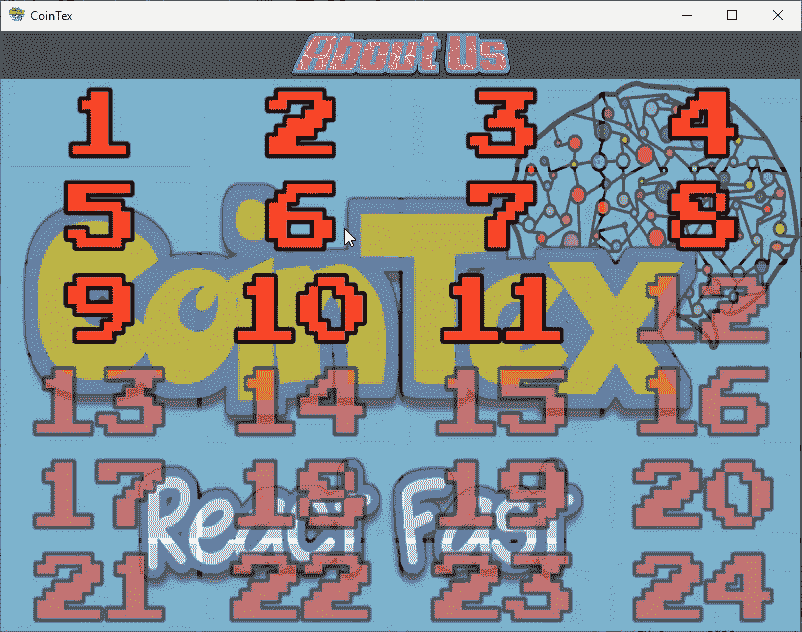

# 在 Python 中使用不同的遗传算法表示

> 原文：<https://blog.paperspace.com/working-with-different-genetic-algorithm-representations-python/>

根据被优化问题的性质，遗传算法(GA)支持两种不同的基因表达:二进制和十进制。二进制遗传算法的基因只有两个值，即 0 和 1。这更容易管理，因为与十进制遗传算法相比，它的基因值是有限的，对于十进制遗传算法，我们可以使用不同的格式，如浮点或整数，以及有限或无限的范围。

本教程讨论了 [PyGAD](https://pygad.readthedocs.io) 库如何支持两种 GA 表示，二进制和十进制。本教程的大纲如下:

*   开始使用 [PyGAD](https://blog.paperspace.com/genetic-algorithm-applications-using-pygad/)
*   控制基因在初始群体中的范围
*   基因类型(`int`或`float`)
*   避免超出初始范围
*   连续和离散基因范围
*   每个基因的自定义值
*   定制一些基因，同时随机化其他基因
*   二进制遗传算法
*   用户定义的初始群体

你也可以[在 Gradient 上免费运行本教程](https://ml-showcase.paperspace.com/projects/genetic-algorithm-with-pygad)的代码。

让我们开始吧。

## 【PyGAD 入门

PyGAD 是一个用于实现遗传算法的 Python 库。要安装它并开始使用，请查看教程 [5 使用 PyGAD 的遗传算法应用](https://blog.paperspace.com/genetic-algorithm-applications-using-pygad)。顾名思义，我们将向您展示如何使用该库开发五个不同的应用程序。你可以[在 Gradient](https://ml-showcase.paperspace.com/projects/genetic-algorithm-with-pygad) 上免费运行代码。

在[使用遗传算法](https://blog.paperspace.com/building-agent-for-cointex-using-genetic-algorithm)为 CoinTex 构建一个玩游戏的代理中，PyGAD 被用来构建一个玩名为 [CoinTex](https://play.google.com/store/apps/details?id=coin.tex.cointexreactfast&hl=en) 的游戏的代理。



PyGAD 也被记录在[阅读文件](https://pygad.readthedocs.io)。

在开始本教程之前，请确保您至少安装了 PyGad 2 . 6 . 0 版。

```py
pip install pygad>=2.6.0
```

下一节将讨论如何使用 PyGAD 定制基因的取值范围。

## **控制基因在初始种群中的范围**

正如我们所讨论的，遗传算法有两种基因表达方式:

1.  二进制的
2.  小数

对于二元遗传算法，每个基因只有两个值:0 或 1。另一方面，十进制表示可以使用基因的任何十进制值。本节讨论如何限制基因值的范围。

在一些问题中，用户限制有效基因值的范围可能是有用的。例如，假设每个基因值必须在 5 到 15 之间，没有任何例外。我们如何做到这一点？

PyGAD 支持两个参数来处理这个场景:`init_range_low`和`init_range_high`。参数`init_range_low`指定创建初始群体的范围的下限，而`init_range_high`指定上限。注意`init_range_high`是独家的。所以，如果`init_range_low=5`和`init_range_high=15`，那么可能的基因值是从 5 到 15，但不包括 15。下面的代码片段显示了这个例子。

除了这些参数之外，我们还必须指定我们的适应度函数`fitness_func`和世代数`num_generations`。

尽管下面三个参数是可选的，但是在随机创建初始群体时必须指定它们:

*   `num_parents_mating`:要交配的父母数量。
*   `sol_per_pop`:设置为 3，表示种群有 3 个解。
*   `num_genes`:每个溶液有 4 个基因。

```py
import pygad

def fitness_function(solution, solution_idx):
    return sum(solution)

ga_instance = pygad.GA(num_generations=1,
                       num_parents_mating=2,
                       sol_per_pop=3,
                       num_genes=4,
                       fitness_func=fitness_function,

                       init_range_low=5,
                       init_range_high=15)
```

一旦实例被创建，随机初始群体就在`initial_population`属性中准备好了。下面一行打印了它。因为群体有 3 个解，其中每个解有 4 个基因，所以群体的形状是`(3, 4)`。注意，每个基因都有一个介于 5 和 15 之间的值。默认情况下，基因的类型是 float。

```py
print(ga_instance.initial_population)
print(ga_instance.initial_population.shape)
```

```py
[[14.02138539 10.13561641 13.77733116 5]
 [13.28398269 14.13789428 12.6097329   7.51336248]
 [ 9.42208693  6.97035939 14.54414418  6.54276097]]

(3, 4)
```

下面的代码将`init_range_low`设置为 1，将`init_range_high`设置为 3，看看基因的范围是如何变化的。

```py
ga_instance = pygad.GA(num_generations=1,
                       num_parents_mating=2,
                       sol_per_pop=3,
                       num_genes=4,
                       fitness_func=fitness_function,

                       init_range_low=1,
                       init_range_high=3)

print(ga_instance.initial_population)
```

如下所示，随机创建的群体具有 1 到 3 之间的所有基因。请注意，可能有值为 1 的基因，但不可能有值为 3 的基因。

```py
[[1.00631559 2.91140666 1.30055502 2.10605866]
 [2.23160212 2.32108812 1.90731624 1]
 [2.23293791 1.9496456  1.25106388 2.46866602]]
```

注意，`init_range_low`和`init_range_high`参数只是限制了初始群体中基因的范围。如果解决方案进化成几代人呢？这可能会使基因超出初始范围。

为了做一个实验，将`num_generations`参数设置为 10，调用`run()`方法，通过 10 代进化解决方案。

```py
ga_instance = pygad.GA(num_generations=10,
                       num_parents_mating=2,
                       sol_per_pop=3,
                       num_genes=4,
                       fitness_func=fitness_function,

                       init_range_low=1,
                       init_range_high=3)

ga_instance.run()
```

在`run()`方法完成后，下一段代码打印如下内容:

*   使用`initial_population`属性的初始群体。
*   使用`population`属性的最终人口。

```py
print(ga_instance.initial_population)
print(ga_instance.population)
```

```py
[[1.08808272 1.16951518 1.30742402 1.40566555]
 [2.88777068 2.49699173 2.47277427 2.36010308]
 [1.94598736 2.10177613 1.57860387 1.45981019]]

[[3.7134492  1.9735615  3.39366783 2.21956642]
 [3.7134492  2.49699173 2.47277427 2.36010308]
 [2.94450144 1.9735615  3.39366783 2.36010308]]
```

对于初始种群，所有的基因都在 1 到 3 之间。对于最终群体，一些基因超出了范围，如第一个解决方案中的第一个和第三个基因。如何强制任一种群内的基因在范围内？这在**避免超出范围**一节中讨论。

另外需要注意的是，基因的类型是浮点型的。有些问题可能只适用于整数值。下一节讨论如何使用`gene_type`参数指定基因的类型。

## **基因类型(`int`或`float` )**

默认情况下，PyGAD 为初始种群分配随机浮点值。如果用户希望这些值是整数，`gene_type`参数可用于此目的。PyGAD 2.6.0 及更高版本支持它。

它支持两个值:

1.  `float`:默认值。这意味着基因是浮点数。
2.  `int`:基因由浮点数转换为整数。

下一段代码将`gene_type`参数设置为`int`，以强制随机初始种群拥有整数基因。

```py
ga_instance = pygad.GA(num_generations=10,
                       num_parents_mating=2,
                       sol_per_pop=3,
                       num_genes=4,
                       fitness_func=fitness_function,

                       init_range_low=1,
                       init_range_high=3,

                       gene_type=int)

print(ga_instance.initial_population)
```

随机初始群体如下所示。注意，基因的范围是从 1 到 3，不包括 1 和 3。这意味着 1 和 2 是仅有的整数。因此，总体只有值 1 和 2。

```py
[[1 1 2 1]
 [1 2 2 1]
 [1 2 1 2]]
```

当范围从 5 变为 10 时，可能的基因值是 5、6、7、8 和 9。

```py
ga_instance = pygad.GA(num_generations=10,
                       num_parents_mating=2,
                       sol_per_pop=3,
                       num_genes=4,
                       fitness_func=fitness_function,

                       init_range_low=5,
                       init_range_high=10,

                       gene_type=int)

print(ga_instance.initial_population)
```

```py
[[5 9 7 8]
 [5 7 9 8]
 [5 5 6 7]]
```

请注意，将`gene_type`参数设置为`int`或`float`不会阻止基因超出使用`init_range_low`和`init_range_high`参数指定的范围。这将在下一节讨论。

## **避免超出初始范围**

随机创建的初始群体的基因在两个参数`init_range_low`和`init_range_high`指定的范围内。但这并不能保证它的基因总是在这个范围内。原因是基因的值由于突变操作而改变。

默认情况下，`random`类型的变异操作适用于所有基因。这导致基因的一些随机变化，从而导致它们的值超过初始范围。根据所解决问题的类型，超出范围可能是问题，也可能不是问题。

如果问题必须有它的基因在一个范围内，那么有不同的选项来强制所有代中的所有基因都在该范围内。这些选项总结如下:

1.  不要使用`random`突变。
2.  禁用变异操作。
3.  使用`mutation_by_replacement`参数。这是最实际的选择。

让我们来讨论一下这些选项。

### **不使用`random`突变**

使用`mutation_type`参数指定所用突变操作的类型。支持的类型有:

1.  随机:`mutation_type=random`
2.  互换:`mutation_type=swap`
3.  反转:`mutation_type=inversion`
4.  争夺:`mutation_type=scramble`

在这 4 种类型中，只有`random`突变可以改变超出范围的基因值。因此，迫使基因在初始范围内的一种方法是使用另一种类型的突变，而不是`random`突变。

下一段代码使用了`swap`突变。即使在`run()`方法执行之后，基因值仍然在初始范围内。

```py
ga_instance = pygad.GA(num_generations=10,
                       num_parents_mating=2,
                       sol_per_pop=3,
                       num_genes=4,
                       fitness_func=fitness_function,

                       init_range_low=5,
                       init_range_high=10,

                       mutation_type="swap",

                       gene_type=int)

ga_instance.run()

print(ga_instance.initial_population)
print(ga_instance.population)
```

```py
[[6 9 8 7]
 [5 5 8 8]
 [9 8 5 6]]

[[8 9 6 9]
 [8 9 6 9]
 [8 9 6 9]]
```

这个选项在许多情况下可能不可行，因为其他类型保持原始基因值，而只是改变它们的顺序。基因没有发生变化。

### **禁用变异操作**

PyGAD 可以通过将`mutation_type`参数设置为`None`来禁用变异操作。尽管它保留了初始范围内的基因值，但它禁用了进化解的主要选项之一。

下一段代码禁用变异操作。10 代后，基因仍在规定范围内。

```py
ga_instance = pygad.GA(num_generations=10,
                       num_parents_mating=2,
                       sol_per_pop=3,
                       num_genes=4,
                       fitness_func=fitness_function,

                       init_range_low=5,
                       init_range_high=10,

                       mutation_type=None,

                       gene_type=int)

ga_instance.run()

print(ga_instance.initial_population)
print(ga_instance.population)
```

```py
[[7 9 5 9]
 [5 6 6 8]
 [8 5 6 6]]

[[7 9 5 9]
 [7 9 6 6]
 [7 9 5 6]]
```

### **使用`mutation_by_replacement`参数**

前两个选项要么被`random`突变破坏，要么被突变本身破坏，以将基因保持在初始范围内。支持使用`random`突变同时仍将基因保持在指定范围内的最可行选项是布尔参数`mutation_by_replacement`。

正常情况下，随机突变会产生一个随机值。然后将该值添加到当前基因值中。假设有一个值为 2.5 的基因，指定的范围是 1 到 3，不包括 1 和 3。如果随机值为 0.7，那么将其添加到当前基因值会导致`2.5+0.7=3.2`超出范围。

当`mutation_by_replacement`参数为`True`时，它会用随机值替换(而不是添加)基因值。所以，当随机值为 0.7 时，新的基因值将为 0.7。如果`gene_type`设置为`int`，则结果为`1.0`。

用户可以使用分别指定下限和上限的两个参数`random_mutation_min_val`和`random_mutation_max_val`来控制产生随机值的范围。

为了将基因保持在该范围内，这些参数中的每一个都必须满足以下条件:

```py
init_range_low <= param <= init_range_high
```

为了获得最佳体验，请设置`random_mutation_min_val=init_range_low`和`random_mutation_max_val=init_range_high`。

下一个代码给出了使用本小节中讨论的 3 个参数的示例(`mutation_by_replacement`、`random_mutation_min_val`和`random_mutation_max_val`)。

```py
ga_instance = pygad.GA(num_generations=1000,
                       num_parents_mating=2,
                       sol_per_pop=3,
                       num_genes=4,
                       fitness_func=fitness_function,

                       init_range_low=5,
                       init_range_high=10,

                       random_mutation_min_val=5,
                       random_mutation_max_val=10,

                       mutation_by_replacement=True,

                       gene_type=int)

ga_instance.run()
```

对于任何数量的世代，基因都不会超出这个范围。下一段代码打印初始和最终人口。最终群体中的基因不超出该范围。

```py
print(ga_instance.initial_population)
print(ga_instance.population)
```

```py
[[5 8 8 5]
 [9 8 8 9]
 [5 9 8 9]]

[[9 9 9 9]
 [9 9 9 9]
 [9 9 8 9]]
```

使用 3 个参数`mutation_by_replacement`，可以使遗传算法仅适用于二元基因(即值为 0 和 1 的基因)。这是通过执行以下操作实现的:

*   设置`init_range_low=random_mutation_min_val=0`。
*   设置`init_range_high=random_mutation_max_val=2`。
*   设置`mutation_by_replacement=True`。
*   设置`gene_type=int`。

```py
ga_instance = pygad.GA(num_generations=10,
                       num_parents_mating=2,
                       sol_per_pop=3,
                       num_genes=4,
                       fitness_func=fitness_function,

                       init_range_low=0,
                       init_range_high=2,

                       random_mutation_min_val=0,
                       random_mutation_max_val=2,

                       mutation_by_replacement=True,

                       gene_type=int)

ga_instance.run()
```

这是所有基因都为 0 或 1 的初始和最终群体。

```py
print(ga_instance.initial_population)
print(ga_instance.population)
```

```py
[[1 1 0 1]
 [0 1 0 0]
 [0 1 1 1]]

[[0 1 0 1]
 [0 1 0 0]
 [0 1 1 0]]
```

注意，这不是支持二进制 GA 的唯一方法。使用`gene_space`参数，也可以支持二进制遗传算法。下一节将介绍该参数。

## **连续和离散基因范围**

前面的讨论假设基因取样的范围是连续的。因此，如果范围从 1 到 5 开始，则此范围内的所有值(1、2、3 和 4)都是可接受的。如果某个范围内的某些值是不允许的，或者这些值不符合连续的范围(例如-2、18、43 和 78)，该怎么办？为此，PyGAD 支持一个名为`gene_space`的参数来指定基因值空间。

`gene_space`参数允许用户列出所有可能的基因值。它接受一个列表或元组，其中列出了所有可能的基因值。

下一段代码使用`gene_space`参数列出所有基因的可能值。因此，所有基因都是从列出的 4 个值中取样的。

```py
ga_instance = pygad.GA(num_generations=10,
                       num_parents_mating=2,
                       sol_per_pop=3,
                       num_genes=4,
                       fitness_func=fitness_function,

                       gene_space=[-2, 18, 43, 78])

ga_instance.run()

print(ga_instance.initial_population)
print(ga_instance.population)
```

```py
[[78 43 78 -2]
 [18 -2 78 78]
 [43 43 18 -2]]

[[-2 -2 18 78]
 [18 -2 78 78]
 [-2 -2 18 78]]
```

注意，所有的基因都是从相同的值中取样的。换句话说，`gene_space`参数中的值对所有基因都是通用的。如果每个基因都有不同的价值呢？下一节讨论如何为每个基因指定自定义值。

## **每个基因的自定义值**

当`gene_space`参数接受一个非嵌套列表/元组时，那么这个列表/元组中的值被用来采样所有基因的值。有些基因可能有自己独特的价值。`gene_space`参数分别接受每个基因的值。这是通过创建嵌套列表/元组来实现的，其中每一项都包含其对应基因的可能值。

假设有 4 个基因，每个基因都有自己的值空间。每个基因的可能值列表如下所示。请注意，没有一个基因的值遵循一个序列。每个基因可能有不同数量的值。

1.  基因 1: [-4，2]
2.  基因 2: [0，5，7，22，84]
3.  基因 3: [-8，-3，0，4]
4.  基因 4: [1，6，16，18]

所有 4 个列表都作为项目添加到下面给出的`gene_space`参数中。

```py
gene_space = [[-4, 2], 
              [0, 5, 7, 22, 84],
              [-8, -3, 0, 4],
              [1, 6, 16, 18] ]
```

下一段代码创建了一个使用`gene_space`属性的`pygad.GA`类的实例。打印的初始和最终群体显示了每个基因是如何从其自己的空间中取样的。例如，所有解决方案的第一个基因的值都是-4 和 2。

```py
ga_instance = pygad.GA(num_generations=10,
                       num_parents_mating=2,
                       sol_per_pop=3,
                       num_genes=4,
                       fitness_func=fitness_function,

                       gene_space=[[-4, 2], 
                                   [0, 5, 7, 22, 84], 
                                   [-8, -3, 0, 4], 
                                   [1, 6, 16, 18] ])

ga_instance.run()

print(ga_instance.initial_population)
print(ga_instance.population)
```

```py
[[-4\. 84\.  0\. 18.]
 [ 2\.  7\.  4\.  1.]
 [ 2\.  0\. -8\.  6.]]

[[-4\.  7\.  4\.  1.]
 [ 2\.  7\.  4\.  1.]
 [-4\.  7\.  4\.  6.]]
```

前 4 个基因的值没有遵循一个序列。某些基因的值可能遵循一个序列。下面列出了 4 个基因的值。第一个基因的值从 0 到 5(不含)开始，第二个基因的值从 16 到 27(不含)开始。第三个和第四个基因的值与之前相同。

1.  基因 1: [0，1，2，3，4]
2.  基因 2: [16，17，18，19，20，21，22，23，24，25，26]
3.  基因 3: [-8，-3，0，4]
4.  基因 4: [1，6，16，18]

参数`gene_space`的新值如下所示。

```py
gene_space = [ [0, 1, 2, 3, 4],
               [16, 17, 18, 19, 20, 21, 22, 23, 24, 25, 26],
               [-8, -3, 0, 4],
               [1, 6, 16, 18] ]
```

如果一个基因有一个序列，例如，1000 个值。我们必须列出它的单个元素吗？幸运的是，PyGAD 允许使用`range()`函数指定单个基因的空间。如果第一个基因的值空间从 0 开始，但不包括 5，那么可以使用`range(0, 5)`对其建模。对于从 16 开始但不包括 26 的第二个基因，其值空间用`range(16, 27)`表示。

使用`range()`功能后，`gene_space`参数的新值如下所示。

```py
gene_space = [ range(5), range(16, 27), [-8, -3, 0, 4], [1, 6, 16, 18] ]
```

下面是使用更新后的`gene_space`的代码。

```py
ga_instance = pygad.GA(num_generations=10,
                       num_parents_mating=2,
                       sol_per_pop=3,
                       num_genes=4,
                       fitness_func=fitness_function,

                       gene_space=[range(5), 
                                   range(16, 27), 
                                   [-8, -3, 0, 4], 
                                   [1, 6, 16, 18] ])

ga_instance.run()

print(ga_instance.initial_population)
print(ga_instance.population)
```

```py
[[ 0\. 19\. -8\. 18.]
 [ 2\. 26\.  4\.  6.]
 [ 3\. 18\. -3\.  1.]]

[[ 3\. 25\.  0\.  6.]
 [ 0\. 26\.  4\.  18.]
 [ 3\. 22\.  0\.  6.]]
```

将一个基因固定为一个单一的值是可能的。这是通过将其在`gene_space`参数中的项目分配给该单一值来实现的。下面是一个例子，其中第一个基因设置为 4，第三个基因设置为 5。这两个基因的值永远不会改变。

```py
gene_space = [4, 
              range(16, 27), 
              5, 
              [1, 6, 16, 18] ]
```

下面是使用最后一个`gene_space`值的代码。在初始和最终群体中，第一个和第三个基因从不改变。

```py
ga_instance = pygad.GA(num_generations=10,
                       num_parents_mating=2,
                       sol_per_pop=3,
                       num_genes=4,
                       fitness_func=fitness_function,

                       gene_space=[4, 
                                   range(16, 27), 
                                   5, 
                                   [1, 6, 16, 18] ])

ga_instance.run()

print(ga_instance.initial_population)
print(ga_instance.population)
```

```py
[[ 4\. 21\.  5\. 16.]
 [ 4\. 18\.  5\. 16.]
 [ 4\. 24\.  5\. 16.]]

[[ 4\. 18\.  5\.  1.]
 [ 4\. 18\.  5\. 16.]
 [ 4\. 18\.  5\. 18.]]
```

## **定制一些基因，同时随机化其他基因**

根据前面对`gene_space`参数的讨论，每个基因都有自己的基因空间，通过硬编码单个值或使用`range()`函数来指定。

在某些情况下，用户可能需要强制将某些基因限制为某些值，但其他基因可能会被随机化。例如，如果染色体中有一个基因必须是-1 或 1，但其他基因可以是任何随机值。怎么做呢？

对于要随机化的基因，将其在`gene_space`参数中的项目分配给`None`。这意味着该基因的值将被随机化。下一行将列表`[-1, 1]`分配给第一个基因，将`None`分配给剩余的 3 个基因。最后 3 个基因将具有随机值。

```py
gene_space = [[-1, 1], None, None, None]
```

下一个代码使用最后一个`gene_space`值。注意第一个基因是如何从列表`[-1, 1]`中抽取的，而其他基因具有随机值。

```py
ga_instance = pygad.GA(num_generations=10,
                       num_parents_mating=2,
                       sol_per_pop=3,
                       num_genes=4,
                       fitness_func=fitness_function,

                       gene_space=[[-1, 1], None, None, None])
ga_instance.run()

print(ga_instance.initial_population)
print(ga_instance.population)
```

```py
[[ 1\.          0.28682682  1.39230915  1.12768838]
 [-1\.         -1.05781089  1.71296713  2.56994039]
 [ 1\.          3.78611876 -3.80634854  2.15975074]]

[[-1\.         -1.05781089  1.88097581  2.56994039]
 [-1\.         -1.05781089  1.71296713  2.56994039]
 [-1\.         -1.05781089  1.3061504   2.56994039]]
```

注意，随机基因是从 2 个参数`init_range_low`和`init_range_high`指定的范围内的值随机初始化的。如果突变类型是随机的，那么加到基因上的随机值是从两个参数`random_mutation_min_val`和`random_mutation_max_val`指定的范围中取样的。此外，随机值的类型根据`gene_type`参数来确定。最后，如果`mutation_by_replacement`被设置为`True`，那么随机值将不会被添加而是替换基因。请注意，这些参数仅影响其间距设置为`None`的基因。

下一个代码强制基因初始值在 10 到 20 之间，不包括 10 和 20。突变随机范围从 30 到 40，不含 30 和 40。将`gene_type`设置为`int`。

```py
ga_instance = pygad.GA(num_generations=1000,
                       num_parents_mating=2,
                       sol_per_pop=3,
                       num_genes=4,
                       fitness_func=fitness_function,

                       init_range_low=10,
                       init_range_high=20,

                       random_mutation_min_val=30,
                       random_mutation_max_val=40,

                       gene_space=[[-1, 1], None, None, None],

                       gene_type=int)

ga_instance.run()

print(ga_instance.initial_population)
print(ga_instance.population)
```

```py
[[ 1\. 16\. 14\. 10.]
 [-1\. 12\. 16\. 14.]
 [-1\. 17\. 19\. 13.]]

[[-1\. 12\. 16\. 48.]
 [-1\. 15\. 26\. 14.]
 [-1\. 12\. 16\. 14.]]
```

## **二进制遗传算法**

在**使用突变替换参数**部分，PyGAD 通过使用以下参数支持二进制遗传算法。

*   `init_range_low=random_mutation_min_val=0`。
*   `init_range_high=random_mutation_max_val=2`。
*   `mutation_by_replacement=True`。
*   `gene_type=int`。

也可以通过使用`gene_space`参数支持二进制遗传算法。这是通过将该参数设置为全局空间`[0, 1]`来实现的。这意味着所有基因的值不是 0 就是 1。

下一段代码将`gene_space`参数设置为`[0, 1]`。这将强制所有基因的值为 0 或 1。

```py
ga_instance = pygad.GA(num_generations=10,
                       num_parents_mating=2,
                       sol_per_pop=3,
                       num_genes=4,
                       fitness_func=fitness_function,

                       gene_space=[0, 1])
ga_instance.run()

print(ga_instance.initial_population)
print(ga_instance.population)
```

```py
[[1 1 1 0]
 [0 1 0 0]
 [1 1 1 0]]

[[0 1 1 0]
 [0 1 0 1]
 [0 1 0 0]]
```

## **用户自定义初始人口**

有时，用户可能希望从没有任何随机化的自定义初始群体开始。PyGAD 支持一个名为`initial_population`的参数，该参数允许用户指定一个定制的初始群体。

下一个代码 prepares 将一个嵌套列表分配给`initial_population`参数，其中有 3 个解，每个解有 4 个基因。在这种情况下，不需要`num_genes`和`sol_per_pop`参数，因为它们将从分配给`initial_population`参数的值中推导出来。

```py
ga_instance = pygad.GA(num_generations=10,
                       num_parents_mating=2,
                       fitness_func=fitness_function,

                       initial_population=[[34, 32, 24, -2],
                                           [3, 7, 2, 7],
                                           [-2, -4, -6, 1]])
ga_instance.run()

print(ga_instance.initial_population)
print(ga_instance.population)
```

```py
[[34 32 24 -2]
 [ 3  7  2  7]
 [-2 -4 -6  1]]

[[3 7 2 6]
 [3 7 2 7]
 [3 7 2 7]]
```

## **结论**

本教程使用了 [PyGAD](https://pygad.readthedocs.io) 库来处理遗传算法的二进制和十进制表示。本教程讨论了 [PyGAD](https://pygad.readthedocs.io) 中的不同参数，以允许用户除了控制变异操作之外，还可以控制如何创建初始种群。

使用`gene_type`参数，基因值可以是浮点数或整数。`mutation_by_replacement`参数用于将基因保持在其初始范围内。`initial_population`参数接受用户定义的初始群体。

在基因值不遵循序列的情况下，`gene_space`参数会有所帮助。在这种情况下，离散基因值以列表形式提供。该参数接受每个基因的自定义值空间。此外，它允许从一个确定的空间取样一些基因，而随机选择其他基因。