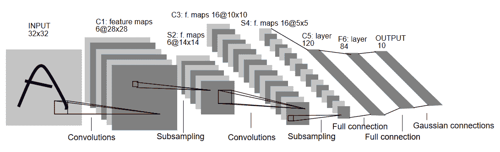
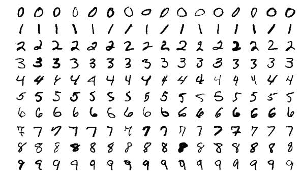
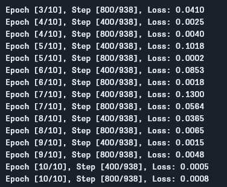

# 在 PyTorch 中从头开始编写 LeNet5

> 原文：<https://blog.paperspace.com/writing-lenet5-from-scratch-in-python/>

作为我上一篇[帖子](https://blog.paperspace.com/writing-cnns-from-scratch-in-pytorch/)的后续，我们将通过构建一些经典的 CNN，继续在 PyTorch 中从头开始编写卷积神经网络，并在数据集上看到它们的作用。

## 介绍

在本文中，我们将构建有史以来最早引入的卷积神经网络之一，LeNet5 ( [论文](http://yann.lecun.com/exdb/publis/pdf/lecun-01a.pdf))。我们正在 PyTorch 中从头开始构建这个 CNN，并且还将看看它在真实世界数据集上的表现。

我们将从探索 LeNet5 的架构开始。然后，我们将使用`torchvision`中提供的类加载并分析我们的数据集 MNIST。使用`PyTorch`，我们将从头开始构建 LeNet5，并根据我们的数据对其进行训练。最后，我们将看到模型如何在看不见的测试数据上执行。

## LeNet5

LeNet5 是最早的卷积神经网络(CNN)之一。它是由 Yann LeCun 等人在 1998 年提出的。可以在这里阅读原文：<http://yann.lecun.com/exdb/publis/pdf/lecun-01a.pdf>。本文将 LeNet5 用于手写字符的识别。

现在让我们了解 LeNet5 的架构，如下图所示:



LeNet5 Architecture (Source: http://yann.lecun.com/exdb/publis/pdf/lecun-01a.pdf)

顾名思义，LeNet5 有 5 层，包括两个卷积层和三个全连接层。让我们从输入开始。LeNet5 接受 32x32 的灰度图像作为输入，表明该架构不适合 RGB 图像(多通道)。因此输入图像应该只包含一个通道。之后，我们从卷积层开始

第一卷积层具有 5×5 的滤波器大小，具有 6 个这样的滤波器。这将减少图像的宽度和高度，同时增加深度(通道数)。输出将是 28x28x6。在此之后，应用池化来将特征图减少一半，即 14x14x6。具有 16 个过滤器的相同过滤器大小(5x5)现在被应用于输出，接着是池层。这将输出特征映射减少到 5x5x16。

在此之后，应用具有 120 个滤波器的大小为 5×5 的卷积层，以将特征图展平为 120 个值。然后是第一个完全连接的层，有 84 个神经元。最后，我们有输出层，它有 10 个输出神经元，因为 MNIST 数据对于所表示的 10 个数字中的每一个都有 10 个类别。

* * *

## 数据加载

### 资料组

让我们从加载和分析数据开始。我们将使用 [MNIST](http://yann.lecun.com/exdb/mnist/) 数据集。MNIST 数据集包含手写数字的图像。这些图像都是灰度图像，大小都是 28x28，由 60，000 幅训练图像和 10，000 幅测试图像组成。

你可以在下面看到一些图片样本:



Source: https://paperswithcode.com/dataset/mnist

### 导入库

我们先导入需要的库，定义一些变量(超参数和`device`也有详细说明，帮助包确定是在 GPU 上训练还是在 CPU 上训练):

```py
# Load in relevant libraries, and alias where appropriate
import torch
import torch.nn as nn
import torchvision
import torchvision.transforms as transforms

# Define relevant variables for the ML task
batch_size = 64
num_classes = 10
learning_rate = 0.001
num_epochs = 10

# Device will determine whether to run the training on GPU or CPU.
device = torch.device('cuda' if torch.cuda.is_available() else 'cpu')
```

Importing the libraries

### 加载数据集

使用`torchvision`，我们将加载数据集，因为这将允许我们轻松地执行任何预处理步骤。

```py
#Loading the dataset and preprocessing
train_dataset = torchvision.datasets.MNIST(root = './data',
                                           train = True,
                                           transform = transforms.Compose([
                                                  transforms.Resize((32,32)),
                                                  transforms.ToTensor(),
                                                  transforms.Normalize(mean = (0.1307,), std = (0.3081,))]),
                                           download = True)

test_dataset = torchvision.datasets.MNIST(root = './data',
                                          train = False,
                                          transform = transforms.Compose([
                                                  transforms.Resize((32,32)),
                                                  transforms.ToTensor(),
                                                  transforms.Normalize(mean = (0.1325,), std = (0.3105,))]),
                                          download=True)

train_loader = torch.utils.data.DataLoader(dataset = train_dataset,
                                           batch_size = batch_size,
                                           shuffle = True)

test_loader = torch.utils.data.DataLoader(dataset = test_dataset,
                                           batch_size = batch_size,
                                           shuffle = True)
```

Loading and Transforming the Data

让我们来理解代码:

*   首先，MNIST 数据不能用于 LeNet5 架构。LeNet5 架构接受的输入为 32x32，MNIST 图像为 28x28。我们可以通过调整图像大小，使用预先计算的平均值和标准偏差(在线提供)对它们进行归一化，最后将它们存储为张量来解决这个问题。
*   我们设置`download=True`以防数据尚未下载。
*   接下来，我们使用数据加载器。对于像 MNIST 这样的小数据集，这可能不会影响性能，但对于大数据集，这确实会影响性能，通常被认为是一种好的做法。数据加载器允许我们批量迭代数据，数据是在迭代时加载的，而不是在 start 中一次加载。
*   我们指定批量大小，并在加载时打乱数据集，以便每一批都有一些标签类型的差异。这将增加我们最终模型的效率。

* * *

## LeNet5 从零开始

让我们先来看看代码:

```py
#Defining the convolutional neural network
class LeNet5(nn.Module):
    def __init__(self, num_classes):
        super(ConvNeuralNet, self).__init__()
        self.layer1 = nn.Sequential(
            nn.Conv2d(1, 6, kernel_size=5, stride=1, padding=0),
            nn.BatchNorm2d(6),
            nn.ReLU(),
            nn.MaxPool2d(kernel_size = 2, stride = 2))
        self.layer2 = nn.Sequential(
            nn.Conv2d(6, 16, kernel_size=5, stride=1, padding=0),
            nn.BatchNorm2d(16),
            nn.ReLU(),
            nn.MaxPool2d(kernel_size = 2, stride = 2))
        self.fc = nn.Linear(400, 120)
        self.relu = nn.ReLU()
        self.fc1 = nn.Linear(120, 84)
        self.relu1 = nn.ReLU()
        self.fc2 = nn.Linear(84, num_classes)

    def forward(self, x):
        out = self.layer1(x)
        out = self.layer2(out)
        out = out.reshape(out.size(0), -1)
        out = self.fc(out)
        out = self.relu(out)
        out = self.fc1(out)
        out = self.relu1(out)
        out = self.fc2(out)
        return out
```

Defining the LeNet5 Model

我将线性地解释代码:

*   在 PyTorch 中，我们通过创建一个继承自`nn.Module`的类来定义神经网络，因为它包含了我们将需要使用的许多方法。
*   之后有两个主要步骤。首先是初始化我们将在 CNN 中使用的图层，另一个是定义这些图层处理图像的顺序。这是在`forward`函数中定义的。
*   对于架构本身，我们首先使用具有适当内核大小和输入/输出通道的`nn.Conv2D`函数定义卷积层。我们还使用`nn.MaxPool2D`函数应用最大池。PyTorch 的好处在于，我们可以使用`nn.Sequential`函数将卷积层、激活函数和最大池合并到一个单独的层中(它们将单独应用，但有助于组织)。
*   然后我们定义完全连接的层。请注意，我们也可以在这里使用`nn.Sequential`,将激活函数和线性层结合起来，但是我想说明这两者都是可能的。
*   最后，我们的最后一层输出 10 个神经元，这是我们对数字的最终预测。

* * *

# 设置超参数

在训练之前，我们需要设置一些超参数，比如损失函数和要使用的优化器。

```py
model = LeNet5(num_classes).to(device)

#Setting the loss function
cost = nn.CrossEntropyLoss()

#Setting the optimizer with the model parameters and learning rate
optimizer = torch.optim.Adam(model.parameters(), lr=learning_rate)

#this is defined to print how many steps are remaining when training
total_step = len(train_loader)
```

Setting the Hyperparameters

我们首先使用类的数量作为参数来初始化我们的模型，在本例中是 10。然后我们定义我们的成本函数为交叉熵损失，优化器为 Adam。有很多选择，但这些往往会给出模型和给定数据的良好结果。最后，我们定义`total_step`以便在训练时更好地跟踪步骤。

* * *

# 培养

现在，我们可以训练我们的模型:

```py
total_step = len(train_loader)
for epoch in range(num_epochs):
    for i, (images, labels) in enumerate(train_loader):  
        images = images.to(device)
        labels = labels.to(device)

        #Forward pass
        outputs = model(images)
        loss = cost(outputs, labels)

        # Backward and optimize
        optimizer.zero_grad()
        loss.backward()
        optimizer.step()

        if (i+1) % 400 == 0:
            print ('Epoch [{}/{}], Step [{}/{}], Loss: {:.4f}' 
        		           .format(epoch+1, num_epochs, i+1, total_step, loss.item()))
```

Training the model

让我们看看代码做了什么:

*   我们首先遍历历元数，然后遍历训练数据中的批次。
*   我们根据正在使用的设备(即 GPU 或 CPU)来转换图像和标签。
*   在正向传递中，我们使用我们的模型进行预测，并根据这些预测和我们的实际标签计算损失。
*   接下来，我们进行反向传递，我们实际上更新我们的权重，以改善我们的模型
*   然后，在每次更新之前，我们使用`optimizer.zero_grad()`函数将梯度设置为零。
*   然后，我们使用`loss.backward()`函数计算新的梯度。
*   最后，我们用`optimizer.step()`函数更新权重。

我们可以看到如下输出:



Training Losses

如我们所见，损失随着每个时期而减少，这表明我们的模型确实在学习。请注意，这种损失是在训练集上，如果损失太小(就像我们的情况一样)，这可能表明过度拟合。有多种方法可以解决这个问题，比如正则化、数据扩充等等，但我们不会在本文中深入讨论。现在让我们测试我们的模型，看看它的表现如何。

* * *

# 测试

现在让我们测试我们的模型:

```py
# Test the model
# In test phase, we don't need to compute gradients (for memory efficiency)

with torch.no_grad():
    correct = 0
    total = 0
    for images, labels in test_loader:
        images = images.to(device)
        labels = labels.to(device)
        outputs = model(images)
        _, predicted = torch.max(outputs.data, 1)
        total += labels.size(0)
        correct += (predicted == labels).sum().item()

    print('Accuracy of the network on the 10000 test images: {} %'.format(100 * correct / total)) 
```

Testing the model

如您所见，代码与用于培训的代码没有太大的不同。唯一的区别是，我们没有计算梯度(使用`with torch.no_grad()`)，也没有计算损失，因为我们不需要在这里反向传播。为了计算模型的最终精度，我们可以简单地计算图像总数中正确预测的总数。

使用该模型，我们获得了大约 98.8%的准确率，这是相当不错的:


Testing Accuracy

请注意，对于今天的标准来说，MNIST 数据集非常基本而且很小，对于其他数据集来说，很难获得类似的结果。尽管如此，当学习深度学习和 CNN 时，这是一个很好的起点。

* * *

# 结论

现在让我们总结一下我们在本文中所做的工作:

*   我们从学习 LeNet5 的架构和其中不同种类的层开始。
*   接下来，我们研究了 MNIST 数据集，并使用`torchvision`加载数据。
*   然后，我们从零开始构建 LeNet5，并为模型定义超参数。
*   最后，我们在 MNIST 数据集上训练和测试了我们的模型，该模型在测试数据集上表现良好。

* * *

# 未来的工作

虽然这看起来是 PyTorch 中深度学习的一个很好的介绍，但是您也可以扩展这项工作来学习更多内容:

*   您可以尝试使用不同的数据集，但对于这个模型，您将需要灰度数据集。一个这样的数据集是 [FashionMNIST](https://github.com/zalandoresearch/fashion-mnist) 。
*   您可以试验不同的超参数，并查看它们在模型中的最佳组合。
*   最后，您可以尝试在数据集中添加或移除图层，以查看它们对模型功能的影响。

在这里找到本教程的 Github repo:[https://github.com/gradient-ai/LeNet5-Tutorial](https://github.com/gradient-ai/LeNet5-Tutorial)