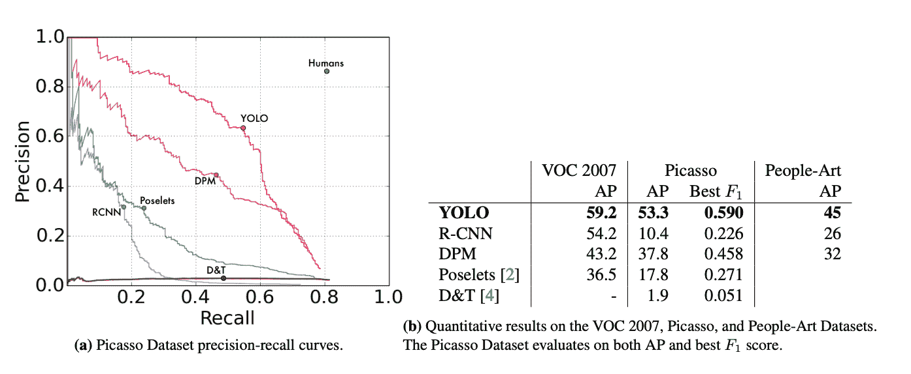
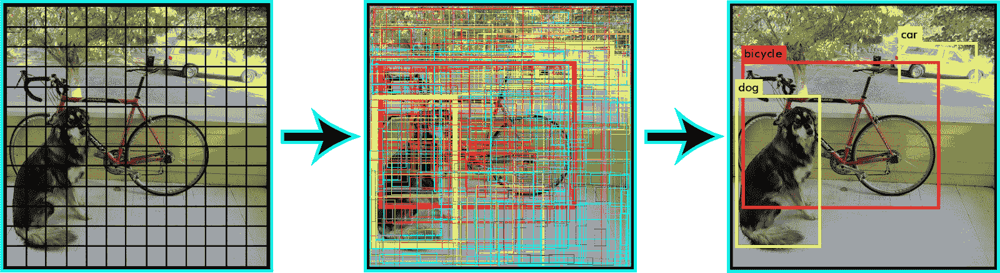
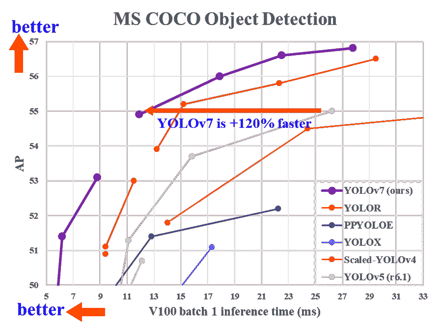
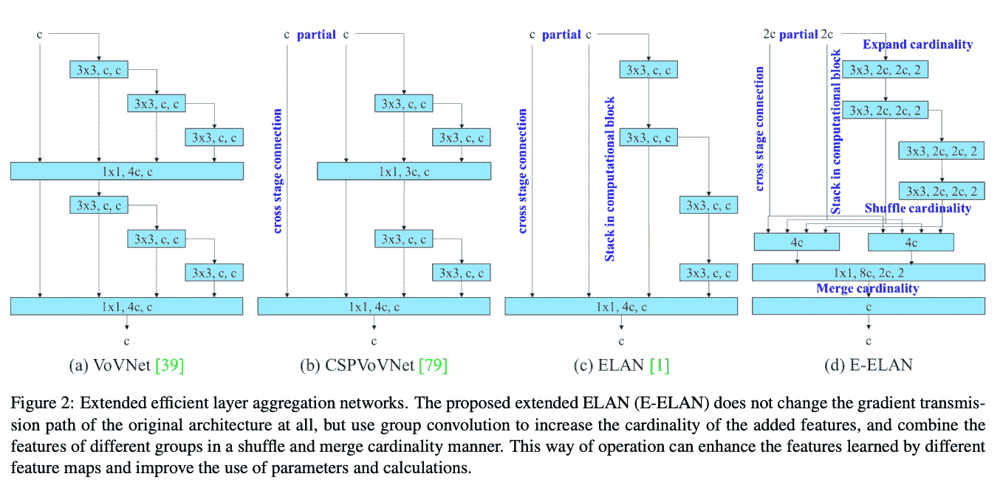
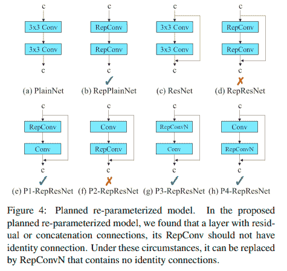
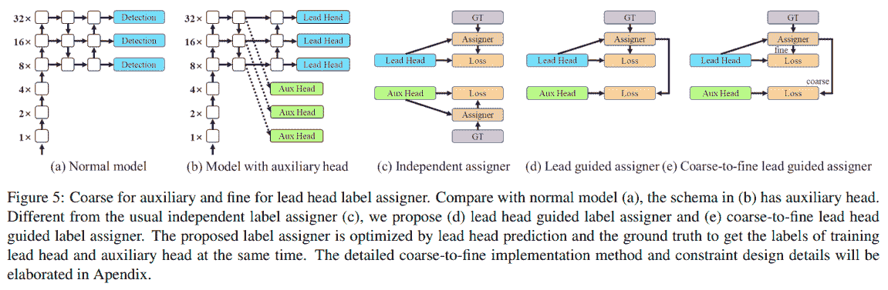
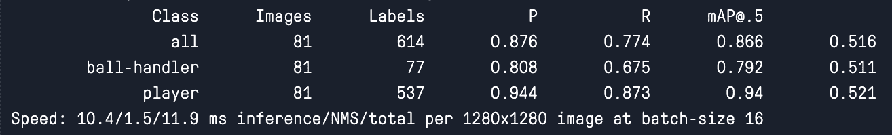
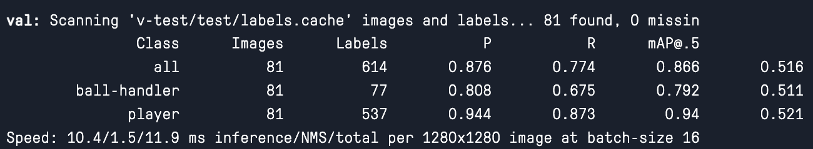

# 如何训练和使用定制的 YOLOv7 模型

> 原文：<https://blog.paperspace.com/yolov7/>

物体检测无疑是深度学习技术承诺的“圣杯”之一。结合图像分类和对象识别的实践中，对象检测涉及识别图像中离散对象的位置并对其进行正确分类。然后预测边界框并将其放置在图像的副本中，以便用户可以直接看到模型的预测分类。

YOLO 自创建以来一直是首要的目标检测网络之一，主要有两个原因:它的准确性、相对较低的成本和易用性。由于这种实用的组合，这些特征一起使 YOLO 无疑成为数据科学社区之外最著名的 DL 模型之一。经过多次迭代开发，YOLOv7 是流行算法的最新版本，并对其前辈进行了显著改进。

<https://blog.paperspace.com/content/media/2022/08/luca2-1.mp4>


Sample from code demo later shows side by side footage of NBA players with and without bounding box labels from YOLOv7

在这篇博客教程中，我们将首先检查 YOLO 行动背后的更大理论，它的架构，并将其与之前的版本进行比较。然后，我们将跳转到一个编码演示，详细说明为您的对象检测任务开发自定义 YOLO 模型所需的所有步骤。我们将使用 NBA 比赛镜头作为我们的演示数据集，并尝试创建一个模型，该模型可以将持球者与球场上的其他球员区分开来。

## 什么是 YOLO？



Generalization results on Picasso and People-Art datasets from original YOLO paper [[Source]](https://arxiv.org/pdf/1506.02640.pdf)

最初的 YOLO 模型是在 2015 年的论文*[你只看一次:统一的实时物体检测](https://arxiv.org/pdf/1506.02640.pdf)中介绍的。*当时，RCNN 模型是执行对象检测的最佳方式，其耗时、多步骤的训练过程使其在实践中难以使用。YOLO 的创建就是为了尽可能地消除这种麻烦，通过提供单阶段物体检测，他们减少了训练&推理时间，并大幅降低了运行物体检测的成本。

从那以后，各种各样的团体开始着手解决 YOLO 的问题，希望有所改进。这些新版本的一些例子包括强大的[约洛夫 5](https://github.com/ultralytics/yolov5) 和[约洛尔](https://github.com/WongKinYiu/yolor)。每一次迭代都试图在过去的基础上进行改进，YOLOv7 现在是该系列发布的最高性能型号。

## YOLO 是如何工作的？

YOLO 首先将图像分成 N 个网格，在一个阶段完成目标检测。这些网格中的每一个都具有相同的大小 SxS。这些区域中的每一个都用于检测和定位它们可能包含的任何对象。对于每个网格，用对象标签和预测对象存在的概率分数来预测潜在对象的边界框坐标 B。

正如您可能已经猜到的那样，这导致了网格累积预测中预测对象的显著重叠。为了处理这种冗余并将预测对象减少到感兴趣的对象，YOLO 使用非最大抑制来抑制所有具有相对较低概率分数的包围盒。



为了做到这一点，YOLO 首先比较与每个决策相关的概率分数，并取最大的分数。随后，它移除与所选高概率边界框的并集上具有最大交集的边界框。然后重复该步骤，直到只剩下所需的最终边界框。

## YOLOv7 有什么变化



为 [YOLOv7](https://arxiv.org/abs/2207.02696) 做了很多新的改动。本节将尝试分解这些变化，并展示这些改进如何导致 YOLOv7 与前代模型相比性能的大幅提升。

### 扩展的高效层聚合网络

模型重新参数化是在推理阶段合并多个计算模型以加速推理时间的实践。在 YOLOv7 中,“扩展高效层聚合网络”或 E-ELAN 技术用于实现这一壮举。



[[Source]](https://arxiv.org/pdf/2207.02696.pdf)

E-ELAN 实现了扩展、洗牌和合并基数技术，以不断提高网络的适应性和学习能力，而不会对原始梯度路径产生影响。该方法的目标是使用群卷积来扩展计算块的通道和基数。这是通过将相同的组参数和通道乘数应用于层中的每个计算块来实现的。然后，按块计算特征图，并按照变量 g 的设置，将特征图混洗到多个组中，并进行组合。这样，每组特征图中的通道数量与原始架构中的通道数量相同。然后，我们将这些组加在一起以合并基数。通过仅改变计算块中的模型架构，过渡层不受影响，并且梯度路径是固定的。[【来源】](https://medium.com/aiguys/yolov7-making-yolo-great-again-7b1ec1f6a2a0)

### 基于连接的模型的模型缩放


[[Source]](https://arxiv.org/pdf/2207.02696.pdf)

YOLO 和其他对象检测模型通常会发布一系列按比例放大或缩小尺寸的模型，以用于不同的用例。对于缩放，对象检测模型需要知道网络的深度、网络的宽度以及网络被训练的分辨率。在 YOLOv7 中，模型在将层连接在一起的同时缩放网络深度和宽度。消融研究表明，这种技术在缩放不同尺寸的同时保持了模型架构的最优化。通常，像放大深度这样的事情会导致过渡层的输入通道和输出通道之间的比率变化，这可能会导致模型的硬件使用量减少。YOLOv7 中使用的复合缩放技术减轻了缩放时对性能产生的这种和其他负面影响。

### 可训练的免费赠品袋



[[Source]](https://arxiv.org/pdf/2207.02696.pdf)

YOLOv7 作者使用梯度流传播路径来分析重新参数化卷积应该如何与不同的网络相结合。上图显示了卷积块应该以何种方式放置，带有复选标记的选项表示它们工作正常。

## 辅助压头粗糙，铅损失压头精细



[[Source]](https://arxiv.org/pdf/2207.02696.pdf)

深度监督是一种在网络的中间层增加一个额外的辅助头的技术，使用带有辅助损失的浅层网络权值作为指导。即使在模型权重通常收敛的情况下，这种技术对于进行改进也是有用的。在 YOLOv7 架构中，负责最终输出的头叫做带头头，用来辅助训练的头叫做辅助头。YOLOv7 使用导联头预测作为指导，生成由粗到细的分层标签，分别用于辅助头和导联头学习。

综上所述，与之前的产品相比，这些改进显著提高了性能，降低了成本。

## 设置您的自定义数据集

既然我们理解了为什么 YOLOv7 比过去的技术有如此大的改进，我们可以试一试了！对于这个演示，我们将下载 NBA 集锦的视频，并创建一个 YOLO 模型，它可以准确地检测球场上哪些球员正在积极持球。这里的挑战是让模型能够可靠地检测和辨别球场上的持球者和其他球员。为此，我们可以去 Youtube 下载一些 NBA 集锦。然后我们可以使用 [VLC 的快照过滤器将视频分解成图像序列。](https://averagelinuxuser.com/video-to-images-with-vlc-media-player/)

要继续培训，首先需要选择合适的标注工具来标注新创建的自定义数据集。YOLO 和相关模型要求用于训练的数据具有准确标记的每个期望的分类，通常是手工标记的。我们选择使用 [RoboFlow](https://app.roboflow.com/) 来完成这项任务。该工具可以在线免费使用，快速，可以对上传的数据进行扩充和转换以使数据集多样化，甚至可以根据输入的扩充量自由地将训练数据量增加三倍。付费版本提供了更多有用的功能。

创建一个 RoboFlow 帐户，启动一个新项目，然后将相关数据上传到项目空间。

<https://blog.paperspace.com/content/media/2022/08/Screen-Recording-2022-08-04-at-1.46.15-PM.mp4>


我们将在这项任务中使用的两种可能的分类是“控球者”和“球员”要在上传后用 RoboFlow 标记数据，您需要做的就是单击左侧菜单上的“Annotate”按钮，单击数据集，然后将您的边界框拖到所需的对象上，在本例中是有球和无球的篮球运动员。

这些数据完全由游戏镜头组成，所有商业广告或大量 3d CGI 填充的帧都从最终数据集中排除。球场上的每个球员都被标识为“球员”，这是数据集中大多数边界框分类的标签。几乎每一帧，但不是全部，也包括一个“球处理器”。“持球者”是目前拥有篮球的球员。为了避免混淆，在任何帧中，持球者都不会被双重标记为球员。为了试图说明游戏镜头中使用的不同角度，我们包括了所有镜头的角度，并对每个角度保持相同的标记策略。最初，当镜头从地面拍摄时，我们尝试了一个单独的“球处理者-地板”和“球员-地板”标签，但这只是给模型增加了混乱。

一般来说，建议你每种分类有 2000 张图片。然而，手工标记如此多的图像(每个图像都有许多对象)非常耗时，因此我们将使用一个较小的样本进行演示。它仍然工作得相当好，但是如果您希望改进这个模型的功能，最重要的一步是将它暴露给更多的训练数据和更健壮的验证集。

我们对训练集使用了 1668 张(556x3)训练照片，对测试集使用了 81 张图像，对验证集使用了 273 张图像。除了测试集，我们将创建自己的定性测试，通过在新的 highlight reel 上测试模型来评估模型的可行性。您可以使用 RoboFlow 中的 generate 按钮生成数据集，然后通过 YOLOv7 - PyTorch 格式的`curl`终端命令将其输出到您的笔记本。下面是您可以用来访问本演示所用数据的代码片段:

```py
curl -L "https://app.roboflow.com/ds/4E12DR2cRc?key=LxK5FENSbU" > roboflow.zip; unzip roboflow.zip; rm roboflow.zip 
```

## 代码演示

您可以通过单击下面的链接运行此演示所需的所有代码。

#### 设置

要开始代码演示，只需点击下面的梯度运行链接。笔记本完成设置并运行后，导航到“notebook.ipynb”。此笔记本包含设置模型所需的所有代码。文件“data/coco.yaml”被配置为使用我们的数据。

首先，我们将加载所需的数据和我们将微调的模型基线:

```py
!curl -L "https://app.roboflow.com/ds/4E12DR2cRc?key=LxK5FENSbU" > roboflow.zip; unzip roboflow.zip; rm roboflow.zip
!wget https://github.com/WongKinYiu/yolov7/releases/download/v0.1/yolov7_training.pt
! mkdir v-test
! mv train/ v-test/
! mv valid/ v-test/
```

接下来，我们需要安装一些必需的包，因此运行这个单元将使您的环境为培训做好准备。我们正在降级火炬和火炬视觉，因为 YOLOv7 不能在当前版本上工作。

```py
!pip install -r requirements.txt
!pip install setuptools==59.5.0
!pip install torchvision==0.11.3+cu111 -f https://download.pytorch.org/whl/cu111/torch_stable.html
```

#### 助手

```py
import os 

# remove roboflow extra junk

count = 0
for i in sorted(os.listdir('v-test/train/labels')):
    if count >=3:
        count = 0
    count += 1
    if i[0] == '.':
        continue
    j = i.split('_')
    dict1 = {1:'a', 2:'b', 3:'c'}
    source = 'v-test/train/labels/'+i
    dest = 'v-test/train/labels/'+j[0]+dict1[count]+'.txt'
    os.rename(source, dest)

count = 0
for i in sorted(os.listdir('v-test/train/images')):
    if count >=3:
        count = 0
    count += 1
    if i[0] == '.':
        continue
    j = i.split('_')
    dict1 = {1:'a', 2:'b', 3:'c'}
    source = 'v-test/traimg/'+i
    dest = 'v-test/traimg/'+j[0]+dict1[count]+'.jpg'
    os.rename(source, dest)

for i in sorted(os.listdir('v-test/valid/labels')):
    if i[0] == '.':
        continue
    j = i.split('_')
    source = 'v-test/valid/labels/'+i
    dest = 'v-test/valid/labels/'+j[0]+'.txt'
    os.rename(source, dest)

for i in sorted(os.listdir('v-test/valid/images')):
    if i[0] == '.':
        continue
    j = i.split('_')
    source = 'v-test/valimg/'+i
    dest = 'v-test/valimg/'+j[0]+'.jpg'
    os.rename(source, dest)
for i in sorted(os.listdir('v-test/test/labels')):
    if i[0] == '.':
        continue
    j = i.split('_')
    source = 'v-test/test/labels/'+i
    dest = 'v-test/test/labels/'+j[0]+'.txt'
    os.rename(source, dest)

for i in sorted(os.listdir('v-test/test/images')):
    if i[0] == '.':
        continue
    j = i.split('_')
    source = 'v-test/teimg/'+i
    dest = 'v-test/teimg/'+j[0]+'.jpg'
    os.rename(source, dest)
```

笔记本的下一部分有助于设置。因为 RoboFlow 数据输出在文件名末尾附加了一个额外的数据和 id 字符串，所以我们首先删除所有多余的文本。这些会阻止训练运行，因为它们不同于 jpg 和相应的 txt 文件。训练文件也是一式三份，这就是为什么训练重命名循环包含额外的步骤。

## 火车

既然我们的数据已经设置好了，我们就可以开始在自定义数据集上训练我们的模型了。我们使用 2 x A6000 模型来训练我们的模型 50 个时期。这部分的代码很简单:

```py
# Train on single GPU
!python train.py --workers 8 --device 0 --batch-size 8 --data data/coco.yaml --img 1280 720 --cfg cfg/training/yolov7.yaml --weights yolov7_training.pt --name yolov7-ballhandler --hyp data/hyp.scratch.custom.yaml --epochs 50

# Train on 2 GPUs
!python -m torch.distributed.launch --nproc_per_node 2 --master_port 9527 train.py --workers 16 --device 0,1 --sync-bn --batch-size 8 --data data/coco.yaml --img 1280 720 --cfg cfg/training/yolov7.yaml --weights yolov7_training.pt --name yolov7-ballhandler --hyp data/hyp.scratch.custom.yaml --epochs 50 
```

我们提供了两种在单 GPU 或多 GPU 系统上运行训练的方法。通过执行此单元，训练将开始使用所需的硬件。您可以在此处修改这些参数，此外，您还可以在“data/hyp.scratchcustom.yaml”处修改 YOLOv7 的超参数。让我们回顾一下这些参数中一些比较重要的参数。

*   workers (int):在培训期间要并行化多少个子流程
*   img (int):我们图像的分辨率。在这个项目中，图像的尺寸被调整为 1280 x 720
*   batch_size (int):确定在创建模型更新之前处理的样本数
*   nproc_per_node (int):训练时使用的机器数量。对于多 GPU 训练来说，这通常是指可以指向的可用机器的数量。

在训练期间，模型将在每个时期结束时输出为训练保留的内存、检查的图像数量、预测的标签总数、精度、召回和 mAP @.5。您可以使用这些信息来帮助确定模型何时可以完成训练，并了解模型在验证集上的功效。

在训练结束时，最好的、最后的和一些附加的模型阶段将被保存到“runs/train/yolov 7-ball handler[*n*]中的相应目录，其中 *n* 是训练已经运行的次数。它还会保存一些关于培训过程的相关数据。您可以在带有- name 标志的命令中更改保存目录的名称。

## 发现

一旦模型训练完成，我们就不能使用该模型来实时执行对象检测。这能够处理图像和视频数据，并将以包括边界框在内的帧的形式为您实时输出预测(在渐变笔记本之外)。我们将使用 detect 作为定性评估模型在其任务中的有效性的方法。为此，我们从 Youtube 上下载了不相关的 NBA 比赛片段，并上传到笔记本上，用作小说测试集。你也可以直接插入一个带有 HTTPS、RTPS 或 RTMP 视频流的 URL 作为 URL 字符串，但是 YOLOv7 可能会提示进行一些额外的安装才能继续。

一旦我们输入了用于训练的参数，我们就可以调用`detect.py`脚本来检测新测试视频中任何想要的对象。

```py
!python detect.py --weights runs/train/yolov7-ballhandler/weights/best.pt --conf 0.25 --img-size 1280 --source video.mp4 --name test 
```

在使用与上述完全相同的方法训练了 50 个时期后，您可以预期您的模型的性能大致类似于以下视频中所示的性能:

<https://blog.paperspace.com/content/media/2022/08/alley.mp4>


由于所使用的训练图像角度的多样性，该模型能够考虑所有种类的拍摄，包括地面水平和相对基线的更远的地面水平。在绝大多数的镜头中，模型能够正确地识别持球者，并同时标记球场上的每个额外球员。

<https://blog.paperspace.com/content/media/2022/08/transition.mp4>


然而，这个模型并不完美。我们可以看到，有时球员身体的一部分在转身时被遮挡似乎会使模型困惑，因为它试图给这些位置的球员分配控球者标签。通常，这种情况发生在球员背对着摄像机的时候，可能是因为后卫在组织比赛或冲向篮筐时经常发生这种情况。

其他时候，该模型将场上的多名球员识别为控球，例如在上面显示的快攻期间。同样值得注意的是，在近距离摄像机视图上扣篮和阻挡也会混淆模型。最后，如果球场的一小块区域被大多数球员占据，它会使模型中的持球者变得模糊，从而引起混乱。

<https://blog.paperspace.com/content/media/2022/08/dunk.mp4>


总的来说，从我们定性的角度来看，该模型似乎在检测每个球员和持球者方面总体上是成功的，但在某些比赛中使用的罕见角度方面存在一些困难，当半场球员非常拥挤时，以及在进行更多训练数据中没有考虑的运动比赛时，如独特的扣篮。由此，我们可以推测，问题不在于我们数据的质量，也不在于训练时间的长短，而在于训练数据的数量。确保一个健壮的模型可能需要大约 3 倍于当前训练集中的图像量。

现在让我们使用 YOLOv7 的内置测试程序来评估我们在测试集上的数据。

## 试验

`test.py`脚本是使用测试集评估模型质量的最简单快捷的方法。它快速评估测试集上所做预测的质量，并以清晰的格式返回它们。当与我们的定性分析结合使用时，我们可以更全面地了解我们的模型是如何执行的。

RoboFlow 建议，除了每个分类 2000 张图像之外，当用于 YOLO 时，对数据集进行 70-20-10 的训练测试验证分割。由于我们的测试集很小，很可能有几个类没有被充分代表，所以对这些结果要有所保留，并使用比我们为自己的项目选择的更健壮的测试集。这里我们用 test.yaml 代替 coco.yaml。

```py
!python test.py --data data/test.yaml --img 1280 --batch 16 --conf 0.001 --iou 0.65 --device 0 --weights runs/train/yolov7-ballhandler/weights/best.pt --name yolov7_ballhandler_testing 
```

然后，您将在日志中获得一个输出，以及几个数字和数据点，用于评估保存到指定位置的测试集上的模型的有效性。在日志中，您可以看到文件夹中图像的总数和这些图像中每个类别的标签数，以及累积预测和每个分类类型的精度、召回率和 mAP@.5。



正如我们所看到的，数据反映了一个健康的模型，该模型在预测测试集中的每个真实标签时至少达到了～0 . 79 mAP @ 0 . 5 功效。

考虑到我们明显的类别不平衡&类别之间的极端相似性，控球者相对较低的召回率、精确度和 mAP@.5，在使用了多少数据进行训练的背景下是完全合理的。可以说，定量结果证实了我们的定性发现，该模型是有能力的，但需要更多的数据来达到完全的效用。

## 结束语

正如我们所看到的，YOLOv7 不仅是一个强大的工具，其使用的准确性显而易见，而且在 RoboFlow 等强大的标签工具和 Paperspace Gradient 等强大的 GPU 的帮助下，也非常容易实现。我们选择这个挑战是因为很难辨别篮球运动员是否有球给人类，更不用说机器了。这些结果非常有希望，并且已经有许多用于跟踪玩家的应用，用于统计、赌博和玩家训练，这些都可以很容易地从这项技术中得到。

我们鼓励您在运行我们准备好的版本后，在您自己的自定义数据集上遵循本文中描述的工作流。此外，RoboFlow 的数据集存储上还有大量公共和社区数据集。在开始数据标注之前，请务必仔细阅读这些数据集。感谢您的阅读！

