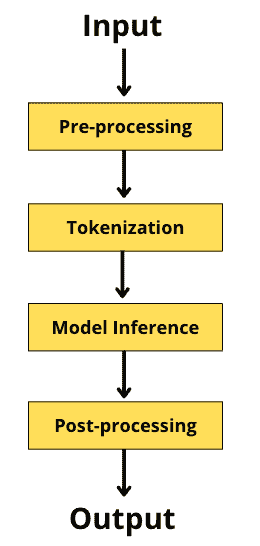
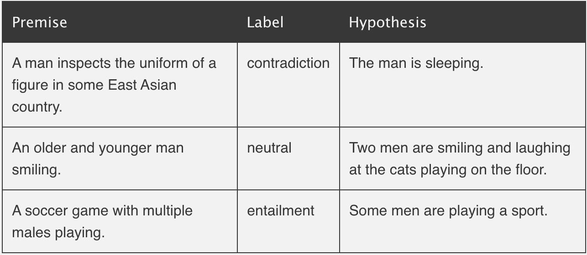

# 拥抱人脸的零镜头文本分类🤗在坡度上

> 原文：<https://blog.paperspace.com/zero-shot-text-classification-with-hugging-face-on-gradient/>

[Zero-shot learning](https://en.wikipedia.org/wiki/Zero-shot_learning) (ZSL)是一种机器学习范式，它引入了用初始训练阶段从未观察到的类别标签测试样本的思想。这类似于我们人类也是如何基于我们随着时间的推移收集的现有知识将我们的学习推断为新概念的。ZSL 范式最近变得更加流行，这主要是因为获得任何特定领域的标记数据是一个非常昂贵和耗时的过程。根据您想要优化的成本，您可以让主题专家(SME)标记每个输入样本，或者在编写任务和特定领域手工制作的规则时寻求他们的帮助，以[每周监督的方式](https://en.wikipedia.org/wiki/Weak_supervision)帮助启动训练阶段。ZSL 在机器学习的各个垂直领域有许多应用，一些流行和有趣的应用是[文本分类](https://joeddav.github.io/blog/2020/05/29/ZSL.html)、[图像分类](https://www.kdnuggets.com/2021/04/zero-shot-learning.html)、[文本到图像生成](https://arxiv.org/abs/2102.12092)、[语音翻译](https://arxiv.org/abs/2107.06010)等。

[文本分类](https://en.wikipedia.org/wiki/Document_classification)是将一组预定义的类别分配给给定文本片段的任务。它通常在受监督的设置中建模，其中您已经标记了特定于领域的文本数据及其关联的类别标签/类别。然后你学习一些映射函数 X->Y；其中，X:输入样本，Y:类别。文本分类的一些例子包括情感分析、垃圾邮件分类、新闻分类等等。欢迎关注[这个博客](https://blog.paperspace.com/transformers-text-classification/)，获取使用变形金刚进行文本分类的快速教程。

因此，**零镜头文本分类**是关于将给定的一段文本分类到某个预定义的组或类标签，而无需在包含文本和标签映射的下游数据集上显式训练专用的机器学习模型。

你可能没有听说过[拥抱脸](https://huggingface.co/)🤗如果你不经常练习 NLP。但是，作为一个复习，拥抱脸是[机器学习技术](https://github.com/huggingface)的开源和平台提供商。它在 NLP 开发人员中非常受欢迎，因为它的 Transformers 支持提供了一种简单的方法来下载、训练和推断最新的 NLP 模型。[渐变笔记本](https://gradient.run/notebooks)是一个易于使用的基于网络的 Jupyter IDE，带有免费的 GPU，允许使用任何底层的库或框架。它也促进了协作开发和公共共享——对 ML 开发者来说是完美的🚀

在这篇博客中，我们将快速浏览一遍从拥抱脸开始的零镜头文本分类管道🤗并讨论是什么使得算法成为可能。

## 恋恋笔记本

*让我们从安装变压器库开始-*

```py
>> pip install transformers
```

拥抱脸提供了管道的概念，通过抽象大部分复杂的代码，使得从已经训练好的模型中进行推断变得非常容易。我们将把同样的想法用于“零射击分类”的任务。Pipeline 类是基类，所有特定于任务的管道都从该类继承。因此，在管道中定义任务会触发特定于任务的子管道，在这种情况下，它将是[ZeroShotClassificationPipeline](https://huggingface.co/docs/transformers/v4.19.2/en/main_classes/pipelines#transformers.ZeroShotClassificationPipeline)。还有许多其他的任务可以探索，值得花些时间在[拥抱脸流水线任务](https://huggingface.co/docs/transformers/task_summary)上看完整的任务列表。

接下来，我们继续导入*管道*并定义一个相关的任务，促进该任务的底层模型*(在后面的章节中有更多关于该模型的内容)、*和设备*(设备=0 或就此而言，任何正值都表示使用 GPU，设备=-1 表示使用 CPU)。*

```py
from transformers import pipeline
classifier = pipeline(
                      task="zero-shot-classification",
                      device=0,
                      model="facebook/bart-large-mnli"
                    )
```

Loading zero-shot pipeline

一旦我们的分类器对象准备好了，我们就为 *text_piece* 、候选*标签*以及是否选择*多类*预测传递我们的例子。

```py
import pprint

text_piece = "The food at this place is really good."
labels = ["Food", "Employee", "Restaurant", "Party", "Nature", "Car"]

predictions = classifier(text_piece, labels, multi_class=False)
pprint.pprint(predictions)
```

Zero-shot Topic Classification

```py
{'labels': ['Food', 'Restaurant', 'Employee', 'Car', 'Party', 'Nature'],
 'scores': [0.6570185422897339,
            0.15241318941116333,
            0.10275784879922867,
            0.04373772069811821,
            0.027072520926594734,
            0.01700017973780632],
 'sequence': 'The food at this place is really good.'}
```

从上面的片段中可以看出，我们的模型在候选标签集中输出了一个 [Softmax 分布](https://en.wikipedia.org/wiki/Softmax_function)。该模型似乎完美地捕捉到了围绕谈论的中心主题(即食物)的意图。

现在，让我们通过添加一个特定的模式来调整这一点，该模式试图以我们喜欢的方式执行分类。我已经将模板记为*“用餐者在{}”*，其中模型应该用上下文相关的位置填充括号“{ }”。让我们看看这个模型是否足够聪明。

```py
import pprint

text_piece = "The food at this place is really good."
labels = ["Food", "Employee", "Restaurant", "Party", "Nature", "Car"]
template = "The diners are in the {}"
predictions = classifier(text_piece, 
           labels, 
           multi_class=False, 
           hypothesis_template=template
           )
```

Zero-shot Question Answering

```py
{'labels': ['Food', 'Restaurant', 'Employee', 'Car', 'Party', 'Nature'],
 'scores': [0.6570185422897339,
  0.15241318941116333,
  0.10275784879922867,
  0.04373772069811821,
  0.027072520926594734,
  0.01700017973780632],
 'sequence': 'The food at this place is really good.'}
```

哇！模型得到了这个正确的*(在最可能的意义上)。*鉴于我们的模型从未在问答式文本分类上进行过明确训练，性能似乎仍然相当不错！

让我们这次设计另一个模板和不同的候选集来定义文本中传达的整体情绪。

```py
import pprint

text_piece = "The food at this place is really good."
labels = ["Positive", "Negative", "Neutral"]
template = "The sentiment of this review is {}"
predictions = classifier(text_piece, 
           labels, 
           multi_class=False, 
           hypothesis_template=template
           )
pprint.pprint(predictions)
```

Zero-shot Sentiment Classification

```py
{'labels': ['Positive', 'Neutral', 'Negative'],
 'scores': [0.8981141448020935, 0.07974622398614883, 0.02213958650827408],
 'sequence': 'The food at this place is really good.'}
```

不错！通过上面讨论的例子，很明显这个问题公式可以推广到各种下游任务。现在，您可以着手构建其他零测试用例了。另外，请随时查看这个在线[演示](https://huggingface.co/zero-shot/)。现在，让我们继续深入研究小细节。

## 在后台

在这一部分中，我们将研究调用管道时的步骤，并了解系统如何正确地将我们的文本分类到相关的标签中，而无需对它们进行明确的训练。

*管道工作流程是一组堆栈功能，定义如下-*



Hugging Face Pipeline workflow

如上图所示，我们从文本序列作为输入开始，然后添加任何必要的特殊标记*(如 SEP、CLS 等。)*根据基础预训练模型和用例的要求。然后，我们使用标记器，将我们的序列分成更小的块，将其映射到预定义的词汇索引，并通过我们的模型进行推理。下一步，后处理，是可选的，取决于用例以及底层模型的输出。这包括需要完成的任何额外工作，如删除特殊标记、修剪到特定的最大长度等。最后，我们以输出结束。

再来说说上图中的推理步骤，底层模型([*Facebook/Bart-large-mnli*](https://huggingface.co/facebook/bart-large-mnli))在[自然语言推理](https://www.youtube.com/watch?v=6-NV9lzm8qw) (NLI)的任务上进行训练。NLI 的任务是确定两个序列，“前提”和“假设”是否相互遵循(必然)或不(矛盾)或不确定(中性)或彼此无关。*从*[*NLP progress*](http://nlpprogress.com/english/natural_language_inference.html)*跟随下面的例子来更好地理解它-*



NLI Example from [Source](http://nlpprogress.com/english/natural_language_inference.html)

*“Facebook/BART-large-MNLI”*在[多体裁自然语言推理](https://cims.nyu.edu/~sbowman/multinli/)*【MNLI】*语料库上微调 [BART](https://www.youtube.com/watch?v=BGWpNQHIcs4) [模型](https://arxiv.org/abs/1910.13461)。语料库中有近 50 万个句子对标注了文本蕴涵信息。BART 模型的输入是一对序列*(前提&假设)*针对长度为 3 的一个热输出向量*(蕴涵、中性、矛盾)*进行训练。

令人惊讶的是，通过将文本片段和候选标签分别视为前提和假设，这个问题公式可以适用于零镜头文本分类的任务。人们希望，随着模型在 NLI 任务上接受预训练，它现在能够理解和学习将两个文本片段联系起来的复杂性。这种知识现在可以用于确定候选集合中的任何标签是否需要文本片段。如果是这样，我们将该候选标签视为真实标签。你可以通过加载*"*[*joeddav/xlm-RoBERTa-large-XNLI*](https://huggingface.co/joeddav/xlm-roberta-large-xnli)*"*，一个在[XNLI](https://github.com/facebookresearch/XNLI)数据集上微调的跨语言模型，在[XLM·罗伯塔](https://huggingface.co/xlm-roberta-base)之上。

## 总结想法

这就是这篇博客的内容。无论我们今天讨论的是什么，都只是执行零镜头文本分类的一种可能方式。我们看到了将 NLI 问题公式化扩展到主题识别、问题回答和情感分析的方法。但是根据[提示](https://www.youtube.com/watch?v=K3MasIU25Zw&list=PLsAqq9lZFOtWCEeootx1nmteDdAILZ5BB&index=1)的格式，可能性是无限的。你可以在[现代自然语言处理中的零镜头学习](https://joeddav.github.io/blog/2020/05/29/ZSL.html)了解更多方法，并关注[这个播放列表](https://www.youtube.com/watch?v=JOB7gwufvAw&list=PLsAqq9lZFOtV6RmVvRfI6KUJx5Qulhut9)了解自然语言处理中零镜头和少镜头学习的最新研究。

谢谢大家！